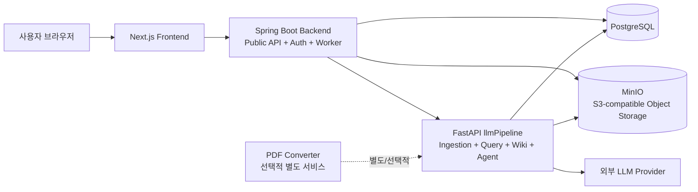

# Fruition

> 인증된 workspace 안의 문서를 Wiki 지식과 근거 기반 채팅으로 연결하는 지식화 서비스

## 1. Problem

문서가 여러 파일과 폴더에 흩어지면 사용자는 파일명이나 저장 위치를 기억해야 원하는 지식과 원문 근거를 찾을 수 있다. Fruition은 문서의 원본을 보존하면서 문서에서 Wiki page와 관계를 만들고, 질문에 답할 때 관련 page와 근거를 함께 보여주는 것을 목표로 한다.

## 2. Current Solution

현재 `dev` 브랜치 구현은 다음 흐름을 제공한다.

- 이메일·OAuth 기반 인증과 workspace·멤버십 관리
- PDF/Markdown 문서 업로드와 원본·메타데이터 저장
- Markdown 문서 비동기 처리와 Wiki ingestion. PDF converter는 별도 실행 서비스이며 자동 upload flow에는 아직 연결되지 않음
- source/concept Wiki page 생성과 Wiki graph·schema·maintenance 기능
- Wiki 기반 채팅 질의, 답변 근거와 관련 page 조회
- Markdown 편집, 콘텐츠 버전·diff·복원, 편집 잠금
- AI 작업 로그와 pipeline 실행 상태 관리

주요 public API 경계는 Spring Boot backend이며, Python `llmPipeline`은 내부 문서 처리·검색·Wiki·Agent 실행 서비스로 동작한다.

## 3. Architecture Overview



현재 구조의 상세 설명은 [아키텍처 문서](./docs/architecture.md)를 참고한다.

## 4. Key Technical Challenges

- 문서 업로드와 LLM 처리를 분리하면서 처리 상태와 재시작 동작을 보장하기
- Spring Boot와 `llmPipeline` 사이의 내부 실행 계약과 공용 PostgreSQL 스키마를 유지하기
- workspace 멤버십을 기준으로 문서·Wiki·채팅 데이터를 격리하기
- Wiki 답변의 source reference와 관련 page를 함께 보존하기
- Markdown 변경의 버전·diff·복원과 AI 작업 이력을 연결하기

## 5. Tech Stack

| 영역 | 기술 |
|---|---|
| Frontend | Next.js, React, TypeScript |
| Backend | Java 21, Spring Boot, Spring Security |
| AI/Pipeline | Python, FastAPI, LLM provider SDK |
| Primary Database | PostgreSQL 16, Flyway |
| Object Storage | MinIO, S3-compatible API |
| Local Infrastructure | Docker Compose |
| API Documentation | springdoc OpenAPI |

## 6. Scope and Non-goals

현재 구현의 기준은 로컬 개발 환경과 `dev` 브랜치 코드다. AWS MSA, Kafka·Redis 기반 확장, 별도 서비스 분할과 같은 목표 구조는 현재 런타임 설명이 아니라 [백로그](./docs/backlog/)에 보관한다.

현재 MVP에서 우선하지 않는 범위는 다음과 같다.

- 완전한 single-writer 구조로의 pipeline 산출물 이전
- 대규모 이벤트 스트리밍과 다중 리전 운영
- 모든 문서 형식에 대한 OCR·고급 레이아웃 복원
- 운영 환경의 최종 AWS 배포 토폴로지 확정

## 7. Documentation

- [Architecture](./docs/architecture.md) — C1/C2, 핵심 데이터 흐름, 책임, 실패·보안·확장성
- [API](./docs/api.md) — 현재 public/internal API 그룹과 계약 기준
- [Data Model](./docs/data-model.md) — Flyway 기준 테이블·상태·저장소 모델
- [Demo Script](./docs/demo-script.md) — 현재 구현 시연 순서와 확인 포인트
- [Architecture Decision Records](./docs/adr/) — 주요 기술 선택과 후속 부채
- [Backlog](./docs/backlog/) — 과거 설계와 완료된 이슈 기록

## 8. Local Development

실행 요구사항과 시연 순서는 [Demo Script](./docs/demo-script.md)를 먼저 확인한다.

```sh
cp infra/.env.example infra/.env
./scripts/dev-up.sh
```

기본 주소:

- Frontend: `http://localhost:3000`
- Backend health: `http://localhost:8080/actuator/health`
- Pipeline health: `http://localhost:8000/health`
- Swagger UI: `http://localhost:8080/swagger-ui.html`

## 9. Repository Structure

```text
backend/      Spring Boot public API and domain logic
frontend/     Next.js web application
llmPipeline/  FastAPI ingestion/query/wiki/agent service
infra/        Local PostgreSQL, MinIO, pipeline, converter configuration
docs/
  architecture.md
  api.md
  data-model.md
  demo-script.md
  adr/         Architecture Decision Records
  backlog/     과거 MVP 문서·설계·마일스톤·이슈 기록
```

## License

Copyright (c) 2026 Fruition KR
