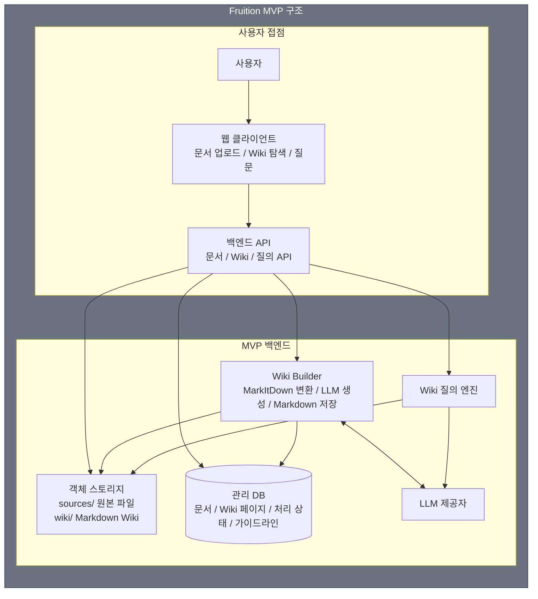
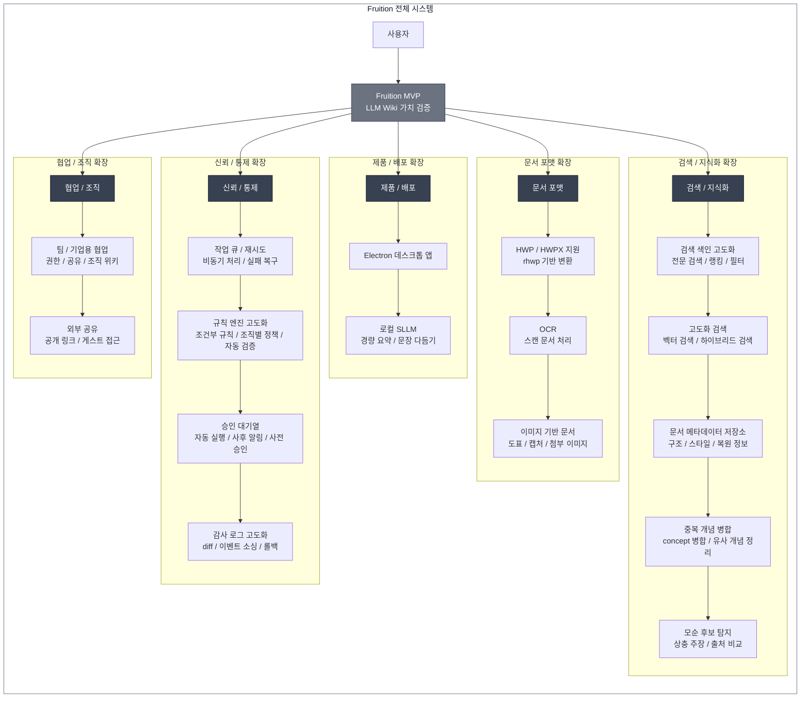
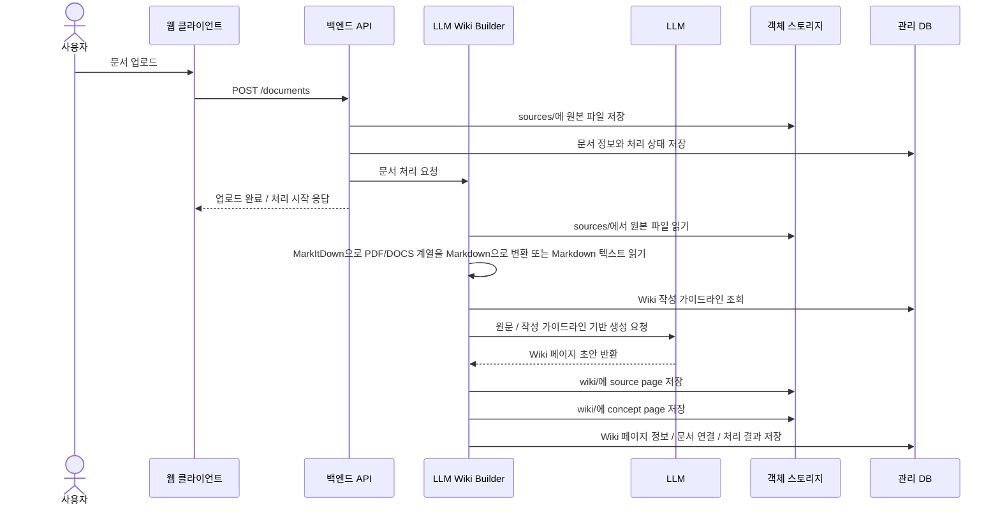
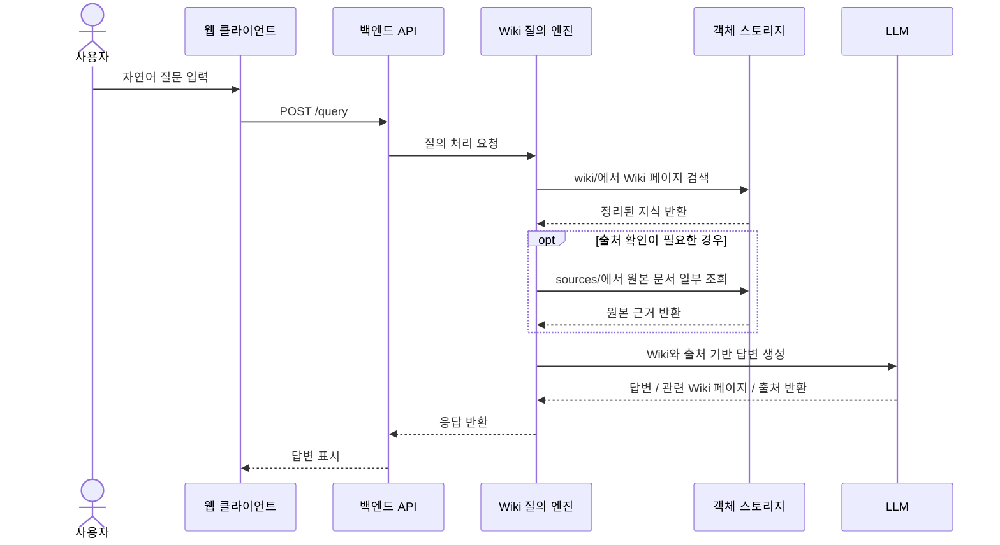
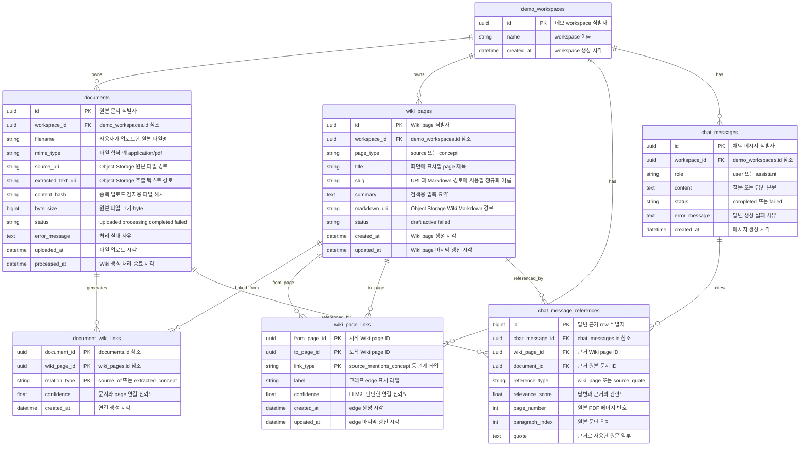
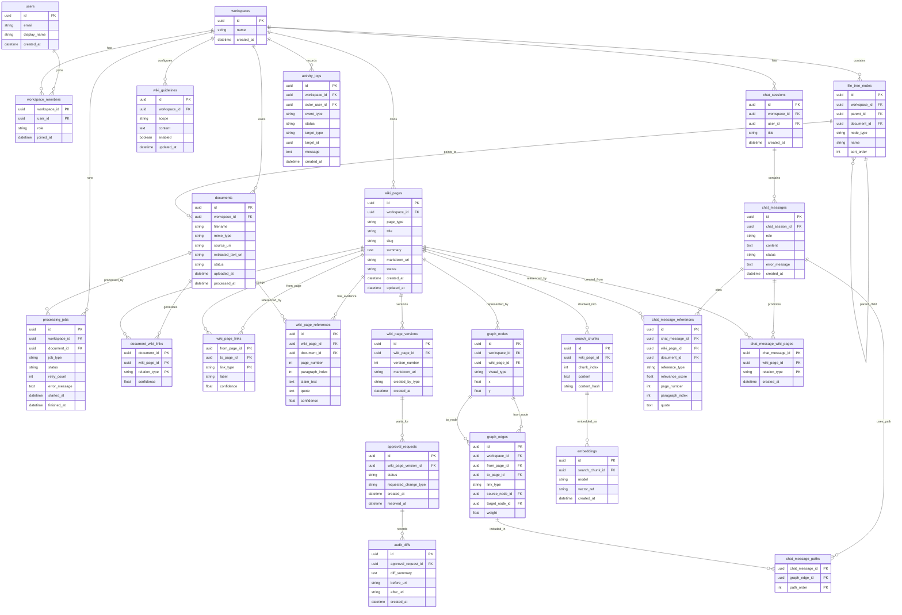
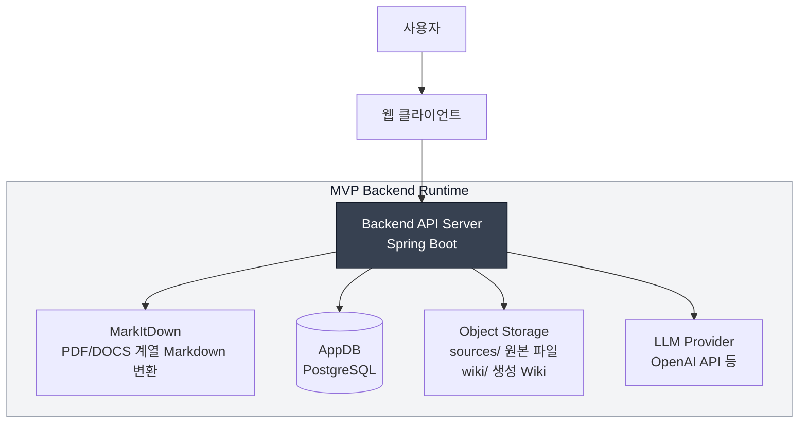

# Fruition MVP 아키텍처

### MVP 기준 요약

MVP의 핵심 검증 목표는 "파일명을 몰라도 개념이나 질문만으로 관련 Wiki page와 원본 근거를 찾을 수 있는가"

웹 데모는 로그인 없이 시작. 
사용자는 왼쪽 사이드바에 원하는 만큼 파일을 업로드하고, 업로드된 원본 파일은 flat list 형태로 확인. 
원본 파일은 수정하지 않는 raw source로 보관하고 그래프의 직접 노드로 쓰지 않음. 
대신 LLM이 원본을 대표하는 `source page`와 지식 단위인 `concept page`를 만들고, 이 Wiki page들이 메인 그래프의 node.

화면은 3개 영역으로 나뉘어요.

```text
왼쪽 사이드바
  원본 파일 목록
  - lecture_01.pdf
  - paper_a.pdf
  - notes.md

메인 왼쪽 영역
  Wiki graph
  - source page node
  - concept page node
  - page 간 연결 edge

메인 오른쪽 영역
  LLM 채팅
  - 질문 입력
  - Wiki 기반 답변
  - 답변에 사용된 node/path 하이라이트
```

MVP 데이터 흐름.

```text
원본 파일 업로드
  -> Object Storage의 sources/에 원본 저장
  -> AppDB의 documents에 파일 관리 정보 저장
  -> LLM Wiki Builder가 source page 생성
  -> 문서에서 concept page 생성 또는 기존 concept page와 연결
  -> wiki_page_links로 Wiki page 간 관계 저장
  -> wiki_pages를 node, wiki_page_links를 edge로 화면 그래프 표시
  -> 사용자가 채팅하면 관련 Wiki page를 읽고 답변
  -> 답변에 사용된 node와 path를 그래프에서 하이라이트
  -> 처리 성공/실패와 채팅 기록을 로그로 확인
```

MVP의 두 가지 핵심 페이지.

- `source page`: 원본 문서 1개에 대응되는 요약/출처 페이지. 
원본 파일 URI, 문서 요약, 핵심 내용, 추출된 concept 목록, 원본 근거를 담음. 
사용자가 source page를 누르면 원본 요약을 보고 원본 PDF/DOCS 계열/Markdown 파일을 열 수 있음.

- `concept page`: 문서에서 추출된 개념, 방법론, 기술, 문제, 주장 같은 지식 단위를 표현하는 페이지. 
MVP에서는 Definition, Key Points, Evidence, Related Concepts 네 가지 섹션만 생성.
Definition은 개념의 짧은 정의, Key Points는 문서에서 중요한 핵심 내용 정리, Evidence는 해당 내용이 나온 원본 문서·페이지·문단 근거, Related Concepts는 그래프에서 연결할 관련 개념을 의미.

MVP ERD의 핵심은 원본 파일 영역과 Wiki graph 영역을 분리하는 것.

```text
documents
  원본 파일 관리

documents -> wiki_pages
  원본 문서에서 생성된 source/concept page 추적

wiki_pages -> wiki_page_links -> wiki_pages
  source/concept page 사이의 의미적 연결

wiki_pages + wiki_page_links
  화면에 표시되는 Wiki graph

chat_messages -> chat_message_references
  답변에 사용된 Wiki page와 원본 출처 기록
```

MVP는 단순 파일 검색이나 RAG가 아니라, 원본 문서를 `source page`와 `concept page`로 컴파일하고 그 결과를 Wiki graph와 채팅 인터페이스에서 함께 보여주는 구조.

### 전체 시스템 구조 기준 요약

전체 시스템은 MVP를 하나의 핵심 블록으로 두고, MVP에서 뺀 기능을 5개 확장 영역으로 붙이는 구조예요.

- 신뢰/통제 확장: 작업 큐/재시도(`processing_jobs`), 규칙 엔진 고도화, 승인 대기열(`approval_requests`), 감사 로그 고도화(`audit_diffs`).
- 검색/지식화 확장: 검색 색인 고도화(`search_chunks`), 벡터/하이브리드 검색(`embeddings`), 문서 메타데이터 저장소, 중복 개념 병합, 모순 후보 탐지.
- 문서 포맷 확장: HWP/HWPX 지원, OCR 스캔 문서 처리, 이미지 기반 문서 처리.
- 제품/배포 확장: Electron 데스크톱 앱, 로컬 SLLM.
- 협업/조직 확장: 팀/기업용 협업(`users`, `workspaces`, `workspace_members`), 외부 공유.

전체 시스템에서 채팅 답변은 Wiki의 재료. 
사용자가 LLM 답변을 가치 있다고 판단하면 해당 답변을 `query_answer page`(특정 질문-답변 보존) 또는 `synthesis page`(여러 source/concept 종합)로 승격. 
그리고 `chat_message_wiki_pages` junction으로 답변과 page를 연결하고, 기존 source/concept page와는 `wiki_page_links`로 연결. 
concept page도 단순 추출 결과를 넘어 여러 문서에서 같은 개념을 하나로 병합하고, concept 간 관계를 `similar_to`, `depends_on`, `contradicts`, `supports`처럼 타입화. 
이를 통해 Fruition은 문서를 한 번 정리하는 도구가 아니라, 질문과 답변을 바탕으로 Wiki가 계속 성장하는 구조.

## 0. 멘토님의 질문에 대한 답변

1. 왜 Fruition을 써야 하나요?
Notion은 작성에 용이하지만 AI를 통한 내용 검색이나 지식 연결의 부분에서 태그를 수동으로 꼭 작성해야한다는 단점이 있습니다. 
Obsidian 또한 ai 관련 설정을 사용자가 모두 진행해야하여 진입 장벽이 높습니다. 
NotebookLM은 검색은 되지만 정리를 사용자가 원하는대로 해주지 않고, 구글 드라이브는 그저 저장소의 역할만 수행합니다. 
이에 Fruition은 AI가 사용자가 정한 규칙을 기반으로 문서를 정리해주고, 그러한 문서들을 연결하여 사용자의 새로운 지식창출에 도움을 줄 수 있는 솔루션이 될 수 있습니다.

2. 처음 100명의 사용자는 누구인가요?
초기 사용자는 논문·강의자료를 많이 다루는 대학원생, 학부 연구생, 고학년 대학생으로 생각하고 있습니다. 
저희가 겪은 문제와 가장 가깝고, 베타 모집도 현실적이기 때문입니다.

3. 처음 넣을 문서 세트는 무엇인가요?
강의자료, 논문 PDF, 과제 자료, 개인 필기처럼 하나의 과목이나 연구 주제에 묶인 문서 세트입니다. 
크기는 30~50개 정도로 두어, 지식 연결이 유사한 부분에서도 제대로 분류되어 연결되는지 확인할 수 있어야할 것 같습니다.

4. 사용자가 계속 쓰겠다고 느끼는 결과물은 무엇인가요?
파일명을 몰라도 기억나는 개념이나 문장만으로 관련 원문, 위키 페이지, 근거 문서를 바로 찾을 수 있을 때입니다. 
예를 들어 이전 단원 개념을 연결해주거나, 필요한 논문 근거를 바로 찾아주는 경우입니다.

5. AI가 틀렸을 때 신뢰를 어떻게 회복하나요?
AI 결과에는 원문 출처와 변경 이력을 함께 보여주고, 중요한 변경은 사용자 승인 후 반영합니다. 
잘못된 요약·분류·위키 갱신은 감사 로그에서 확인하고 롤백할 수 있도록 설계합니다. 
또한, 로그와 사용자의 질문/답변을 통해 사용자 규칙을 ai가 수정할 수 있도록 확장하여 신뢰도를 올리는 방식을 생각했습니다.

## 1. MVP

`LLM Wiki가 실제 사용 가치가 있는지 검증하는 것`이 MVP의 목표!
- 최소 기능
  - 사용자가 PDF 또는 Markdown 문서 업로드
  - 업로드한 문서에서 본문 텍스트를 추출
  - 원본 파일, 서비스 관리 정보, Wiki Markdown을 분리 저장
  - 사용자가 최소 Wiki 작성 가이드라인을 설정
  - LLM이 원본 문서를 바탕으로 `source page`와 `concept page`를 생성
    - source page : 원본 문서가 무슨 내용을 담고 있었는지 정리한 페이지
    - concept page : 문서 안에서 뽑힌 개념, 방법론, 기술, 문제, 주장 같은 지식 단위 페이지
  - 사용자가 생성된 Wiki를 탐색하고 원본 출처를 확인
  - 사용자가 자연어 질문을 입력하면 Wiki 페이지 기반으로 답변과 관련 페이지를 확인 가능
  - 문서 처리 성공/실패와 생성된 Wiki 페이지를 최소 로그로 확인

검증할 핵심 흐름
```text
문서 업로드 → LLM Wiki 페이지 생성 →  Wiki 기반 자연어 질문 → 원하는 답변 출력
```
MVP에서는 문제 추적을 위해 “어떤 문서가 처리됐고 어떤 Wiki 페이지가 생성됐는지” 수준의 최소 실행 로그만 남김

## 2. 시스템 구조
- MVP 구조에서는 LLM Wiki 가치 검증에 필요한 최소 구성요소만 확인
- 전체 시스템 구조에서는 MVP에서 어떤 기능이 추가적으로 붙고 확장되는 지 확인

### 2.1 MVP 구조

MVP 구조는 문서 업로드부터 LLM Wiki 생성, 저장, 탐색, 자연어 질의까지의 최소 구현 범위로 설정
사용자의 독립적인 규칙 엔진, 복원 메타데이터 저장소, 검색 엔진, 감사 로그, 작업 큐는 MVP의 필수 블록으로 두지 않고,필요하면 구현 내부의 단순 로직으로 처리



### 2.2 전체 시스템 구조

전체 시스템 구조에서는 MVP를 하나의 핵심 블록으로 축약, MVP에서 뺀 기능을 확장 영역으로 둠. 



## 3. LLM Wiki 관리 방식

Fruition MVP에서 LLM Wiki는 원본 문서를 직접 수정하는 기능이 아님. 사용자가 업로드한 문서는 원본 저장소에 그대로 보관하고, LLM은 파싱된 텍스트를 읽어서 별도의 Markdown Wiki 페이지를 생성.

핵심은 `원본 파일`, `서비스 관리 데이터`, `Wiki Markdown` 세 가지. 원본 파일과 Wiki Markdown은 하나의 객체 스토리지 안에서 prefix로 분리하고, 원본 복원용 메타데이터, 별도 검색 색인, 고도화 로그는 전체 시스템 확장 범위로 둠.

### 3.1 저장소 분리

MVP 기준 데이터는 아래처럼 나눠서 관리

| 저장소 | 들어가는 데이터 | 파일/레코드 예시 | 역할 |
|---|---|---|---|
| `AppDB` | 서비스 운영용 관리 데이터 | `documents`, `wiki_pages`, `document_wiki_links`, `wiki_page_links` 테이블 | 문서 ID, 처리 상태/오류, Wiki 페이지 경로, 원본과 Wiki의 연결 관계를 저장 |
| `Object Storage` | 원본 파일과 LLM이 생성한 Markdown Wiki 파일(텍스트 추출) | `s3://fruition-storage/sources/documents/doc_123/original.pdf`, `s3://fruition-storage/wiki/sources/doc_123.md`, `s3://fruition-storage/wiki/concepts/llm-wiki.md` | `sources/`에는 원본 파일을, `wiki/`에는 생성된 Wiki Markdown을 저장 |

즉, 원본 파일과 LLM Wiki 결과물은 같은 객체 스토리지에 저장하되, `sources/`와 `wiki/` prefix로 역할을 분리해요. `AppDB`는 파일 본문을 저장하는 곳이 아니라 “어떤 원본 문서가 어떤 Wiki 페이지를 만들었는지”, “처리 상태가 어떤지”를 추적하는 관리 DB예요. Wiki 작성 가이드라인은 별도 테이블 없이 코드 상수로 고정해요(3.2 참조).

MVP에서 저장되는 파일과 레코드를 문서 1개 기준으로 보면 아래와 같이 구성 예정

```text
Object Storage
  s3://fruition-storage/sources/documents/doc_123/original.pdf
  s3://fruition-storage/sources/documents/doc_123/extracted.txt
  s3://fruition-storage/wiki/sources/doc_123.md
  s3://fruition-storage/wiki/concepts/{concept_slug}.md

AppDB
  documents: doc_123, filename, mime_type, source_uri, extracted_text_uri, status, error_message
  wiki_pages: page_id, markdown_uri, page_type, title, slug, status, updated_at
  document_wiki_links: document_id, wiki_page_id, relation_type
```

원본 추출 텍스트(`extracted_text_uri`)는 원본과 같은 `sources/documents/{document_id}/` 경로에 `extracted.txt`로 저장하고, 처리 상태와 실패 사유는 별도 작업 큐 없이 `documents.status`, `documents.error_message`에 직접 기록해요. 비동기 작업 큐(`jobs`)는 전체 시스템 확장 범위로 둬요.

### 3.2 Wiki 작성 가이드라인

MVP에서 Wiki 작성 가이드라인은 사용자가 수정할 수 없는 고정 기본값. DB 테이블이나 규칙 엔진이 아니라 코드 상수(또는 설정 파일)에 정의해 두고, LLM Wiki Builder가 항상 참고하는 작성 지시문으로 사용. 페이지 구조, concept 추출 기준, 문체, 출처 표기 방식을 하나의 가이드라인으로 묶어서 관리.

고정 가이드라인 예시
```text
WIKI_GUIDELINE (코드 상수)
  - source page는 Summary, Key Points, Extracted Concepts, Source References 순서로 작성
  - concept page는 Definition, Key Points, Evidence, Related Concepts 순서로 작성
  - concept은 기술, 사용자 문제, 기능 요구사항, 시장/경쟁, 의사결정 근거 관점에서 추출
  - 해요체로 간결하고 객관적으로 작성
  - 모든 핵심 주장에는 source reference 포함
```

Wiki Builder는 문서를 처리할 때 이 고정 가이드라인을 LLM 프롬프트의 작성 지시문으로 주입. 사용자가 가이드라인을 직접 수정하는 기능과 별도 규칙 엔진은 전체 시스템으로 미루고, MVP에서는 정해진 페이지 구조, 분류 기준, 말투, 출처 표기 방식을 일관되게 적용하는 정도만 검증.

### 3.3 Wiki 파일 구조

객체 스토리지 안의 Markdown Wiki 파일 구조.

```text
wiki/
  sources/
    {document_slug}.md
  concepts/
    {concept_slug}.md
```

각 Wiki 파일은 프로젝트 안에서 아래 역할을 수행.

- `sources/{document_slug}.md`: 업로드 문서 1개에 대응되는 source page예요. 원문 요약, 핵심 주장, 추출된 concept, 최소 원본 출처를 저장.
- `concepts/{concept_slug}.md`: 업로드 문서에서 추출된 개념, 방법론, 기술, 문제, 주장 같은 지식 단위를 정리하는 concept page. 같은 concept이 이미 있으면 기존 페이지에 source reference를 추가하는 방향으로 확장 가능.

Wiki 탐색 화면의 목록은 `AppDB`의 `wiki_pages`와 `document_wiki_links`를 기준으로 구성. 이 방식이면 생성된 source page와 concept page를 별도 목록 파일 없이 탐색가능.

source page는 사용자가 업로드한 원본 문서 1개에 대응되는 Wiki 페이지로 `sources/` prefix에서 원본 문서와 1:1로 연결. 
파일 본문 안에는 `document_id`와 `source_file`을 남기고, 실제 원본 파일은 객체 스토리지에서 조회.

`AppDB`에는 원본 문서와 source page의 연결 관계를 저장. `documents.source_uri`에는 원본 파일 URI를 저장,
`wiki_pages.path`에는 source page Markdown URI를 저장, `document_wiki_links`에는 `document_id`와 `page_id`의 연결을 저장.

source page 본문에는 `document_id`와 `source_file`을 front matter로 남겨요. 사용자가 source page에서 원본 보기를 누르거나 질의 응답에서 원문 근거가 필요할 때, 
백엔드는 `document_id` 또는 `source_file`을 기준으로 `AppDB`와 객체 스토리지에서 원본 파일을 찾아 조회해요.

```md
type: source
document_id: doc_123
source_file: s3://fruition-storage/sources/documents/doc_123/original.pdf
created_at: 2026-05-29T10:00:00Z

---

# 문서 제목

## Summary
문서 전체 요약.

## Key Points
- 핵심 주장 1
- 핵심 주장 2

## Extracted Concepts
- [[concepts/concept-a]]
- [[concepts/concept-b]]

## Source References
- p. 3, paragraph 2
- p. 7, paragraph 1
```

concept page는 업로드 문서에서 추출된 개념, 방법론, 기술, 문제, 주장 같은 지식 단위를 정리. 실제 원문은 직접 담지 않고, 어떤 source page와 document ID에서 나온 내용인지 연결.

```md
---
type: concept
created_at: 2026-05-29T10:00:00Z
sources:
  - doc_123
---

# 개념명

## Definition
이 개념의 현재 Wiki 기준 정의.

## Key Points
- [[sources/document-a]]에서 언급된 핵심 내용.

## Evidence
- [[sources/document-a]]

## Related Concepts
- [[concepts/related-concept]]
```

## 4. LLM Wiki 생성 흐름



세부 처리 순서
1. 업로드된 원본 파일을 객체 스토리지의 `sources/` prefix에 저장.
2. `AppDB`에 문서 ID, 파일명, MIME type, 원본 파일 URI, 처리 상태를 저장.
3. Wiki Builder가 원본 파일을 읽고 PDF/DOCS 계열은 오픈소스 `MarkItDown`으로 Markdown 텍스트로 변환, Markdown 파일은 그대로 텍스트로 읽음.
4. Wiki Builder가 `AppDB`에서 활성화된 Wiki 작성 가이드라인을 조회.
5. LLM에게 원문 텍스트와 Wiki 작성 가이드라인을 함께 전달.
6. LLM은 source page 초안과 concept page 초안을 반환.
7. Wiki Builder는 반환 결과를 객체 스토리지의 `wiki/` prefix에 Markdown 파일로 저장.
8. `AppDB`에 문서와 생성된 Wiki 페이지의 연결 관계(`document_wiki_links`), 처리 성공/실패(`documents.status`), 오류 메시지(`documents.error_message`)를 저장.

PDF 파싱과 LLM 호출은 수십 초 이상 걸릴 수 있어서, 업로드 API는 원본 저장과 `documents` 레코드 생성까지만 처리하고 즉시 `status = processing` 응답을 돌려줘요(위 시퀀스의 `업로드 완료 / 처리 시작 응답`). 실제 Wiki 생성은 Spring `@Async`로 백그라운드에서 진행하고, 웹 클라이언트는 `documents.status`를 polling해서 완료/실패를 확인해요. 별도 작업 큐(`jobs`)는 MVP에서 도입하지 않고, 재시도가 필요해지면 전체 시스템 확장의 `processing_jobs`로 분리해요.

## 5. Wiki 기반 자연어 질의 흐름



질의 처리 시에도 원본 문서를 먼저 검색하지 않고 Wiki를 우선 검색.

세부 처리 순서
1. 사용자가 질문을 입력.
2. QueryEngine이 1차로 `AppDB`의 `wiki_pages.title`과 `wiki_pages.summary`를 대상으로 후보 페이지를 검색. Wiki 본문은 객체 스토리지에 있어서 모든 페이지를 매번 읽으면 비용/지연이 커지므로, MVP에서는 `title + summary`에 PostgreSQL full-text search(`tsvector` + GIN 인덱스)를 적용해 상위 N개만 추림. (벡터/하이브리드 검색은 전체 시스템 확장으로 분리.)
3. 추려진 상위 N개의 source page와 concept page 본문만 객체 스토리지에서 읽음.
4. 답변에 근거가 더 필요한 경우에만 source page의 `Source References`를 보고 객체 스토리지의 `sources/`에서 원문 일부를 조회.
5. LLM이 Wiki 페이지와 원본 근거를 바탕으로 답변을 생성.
6. 응답에는 답변 본문, 관련 Wiki 페이지, 원본 출처를 함께 반환.

응답 예시는 다음과 같음.

```json
{
  "answer": "LLM Wiki는 원본 문서를 직접 수정하지 않고 별도 Markdown Wiki 페이지를 생성하는 방식이에요.",
  "related_pages": [
    "wiki/sources/karpathy-llm-wiki.md",
    "wiki/concepts/llm-wiki.md"
  ],
  "source_references": [
    {
      "document_id": "doc_123",
      "page": 3,
      "paragraph": 2
    }
  ]
}
```

## 6. MVP ERD

ERD는 `데모 구현에 바로 필요한 MVP용 ERD`와 `제품 확장까지 고려한 전체 시스템 ERD`를 분리해서 봐야 함. MVP에서는 화면을 만들고 검증하는 데 필요한 데이터만 남기고, 그래프 좌표, 작업 큐, 승인/롤백, 벡터 검색, 팀 권한 같은 기능은 전체 시스템 ERD로 분리.

웹 기반 데모에서는 원본 파일과 Wiki 그래프를 분리해서 보여주는 것이 좋음. 원본 파일은 왼쪽 사이드바의 flat list에서 관리하고, 그래프는 LLM이 생성한 Wiki page 중심으로 구성. 원본 파일은 그래프의 직접 노드가 아니라 `source page`가 대표하고, source page 상세에서 원본 파일을 열 수 있게 함.

데모 실행 흐름은 아래처럼 구성.

1. 사용자가 로그인 없이 데모 화면에 진입.
2. 왼쪽 사이드바에 PDF/DOCS 계열/Markdown 파일을 원하는 만큼 업로드.
3. 업로드된 원본 파일은 사이드바에서 flat list로 표시.
4. 백엔드는 원본 파일을 저장하고, LLM Wiki Builder가 source page와 concept page를 자동 생성.
5. 메인 그래프에는 원본 파일이 아니라 생성된 Wiki page들이 node로 표시.
6. 사용자가 source page node를 누르면 원본 요약과 원본 파일 열기 버튼을 확인.
7. 사용자가 concept page node를 누르면 개념 정의, 핵심 내용, 근거 문서, 관련 concept을 확인.
8. 오른쪽 채팅에서 질문하면 Wiki page를 기반으로 답변 생성.
9. 답변에 사용된 source/concept page와 연결 path를 그래프에서 하이라이트.
10. 사용자는 채팅 기록과 문서 처리/채팅 성공·실패 로그를 확인.

좋은 답변을 `query_answer` 또는 `synthesis` Wiki page로 저장하는 기능은 MVP에서는 제외하고, 전체 시스템 확장으로 분리.

### 6.1 MVP용 ERD

MVP용 ERD는 데모 구현에 필요한 최소 테이블만 둠. 그래프의 node는 `wiki_pages`, edge는 `wiki_page_links`로 바로 표현. 별도 `graph_nodes`, `graph_edges` 테이블은 MVP에서 만들지 않음.

사이드바는 MVP에서는 폴더 구조 없이 업로드된 문서의 flat list로 시작. `documents.parent_document_id`나 복잡한 파일 트리 전용 테이블은 전체 시스템 ERD로 미룸.

키 설계는 핵심 리소스 테이블(`documents`, `wiki_pages`, `chat_messages`)에는 UUID PK를 두고, 순수 연결 테이블(`document_wiki_links`, `wiki_page_links`)은 중복 방지를 위해 복합 PK를 사용.

ERD 컬럼 표기는 아래처럼 읽음.

```text
uuid id PK "문서 식별자"
```

- `uuid`: DB 데이터 타입. PostgreSQL의 UUID 타입
- `id`: 컬럼명
- `PK`: Primary Key. 테이블에서 row를 구분하는 기본 식별자
- `FK`: Foreign Key. 다른 테이블의 PK를 참조하는 값
- `"문서 식별자"`: 컬럼 설명

예를 들어 `uuid workspace_id FK "데모 workspace ID"`는 `workspace_id`가 UUID 타입이고, `demo_workspaces.id`를 참조하는 외래키라는 의미.



위 ERD에서 명시해 두는 제약은 아래와 같음.

- `document_wiki_links`는 별도 UUID 없이 `(document_id, wiki_page_id, relation_type)`를 복합 PK로 둬서 같은 문서-페이지 연결이 중복되지 않게 함.
- `wiki_page_links`는 별도 UUID 없이 `(from_page_id, to_page_id, link_type)`를 복합 PK로 둬서 LLM이 매 처리마다 같은 edge를 중복 생성하지 않게 함. confidence가 바뀌면 `updated_at`을 갱신.
- `wiki_pages.slug`는 `UNIQUE(workspace_id, page_type, slug)`로 두고, slug는 소문자/공백 정규화 후 생성해 "Self-Attention"과 "self-attention"이 서로 다른 페이지로 갈라지는 것을 막음.
- `documents.content_hash`는 같은 파일 재업로드를 감지하는 용도(중복 업로드 시 기존 문서 재사용 가능).
- `chat_message_references`는 한 답변에 여러 근거가 순서대로 붙을 수 있으므로 단순 정렬용 `bigint id`를 둠. 한 행은 Wiki 근거이거나 원본 근거 중 하나만 가리킴: `CHECK ((wiki_page_id IS NOT NULL) <> (document_id IS NOT NULL))`. `page_number`, `paragraph_index`, `quote`는 `document_id`가 채워진 원본 근거 행에서만 사용.

MVP 테이블의 각 필드 의미는 아래와 같음.

#### `demo_workspaces`

로그인 없는 MVP에서 데모 데이터 묶음을 구분하는 테이블.

| 필드 | 의미 |
|---|---|
| `id` | 데모 workspace 식별자. `documents`, `wiki_pages`, `chat_messages`가 이 값을 참조 |
| `name` | 데모 workspace 이름 |
| `created_at` | workspace 생성 시각 |

#### `documents`

사용자가 업로드한 원본 PDF/DOCS 계열/Markdown의 관리 정보를 저장하는 테이블. 원본 본문은 DB에 저장하지 않고 객체 스토리지 URI만 저장.

| 필드 | 의미 |
|---|---|
| `id` | 원본 문서 식별자 |
| `workspace_id` | 이 문서가 속한 demo workspace. `demo_workspaces.id` 참조 |
| `filename` | 사용자가 업로드한 원본 파일명 |
| `mime_type` | 파일 형식. 예: `application/pdf`, `text/markdown` |
| `source_uri` | 객체 스토리지에 저장된 원본 파일 위치 |
| `extracted_text_uri` | PDF/DOCS 계열/Markdown에서 추출 또는 변환한 텍스트 파일 위치 |
| `content_hash` | 같은 파일 재업로드를 감지하기 위한 해시 |
| `byte_size` | 원본 파일 크기 |
| `status` | 문서 처리 상태. 예: `uploaded`, `processing`, `completed`, `failed` |
| `error_message` | 처리 실패 시 에러 메시지 |
| `uploaded_at` | 파일 업로드 시각 |
| `processed_at` | Wiki 생성 처리가 끝난 시각 |

#### `wiki_pages`

LLM이 생성한 Wiki page의 메타데이터를 저장하는 테이블. 화면 그래프에서는 이 테이블의 row가 node가 됨.

| 필드 | 의미 |
|---|---|
| `id` | Wiki page 식별자 |
| `workspace_id` | 이 Wiki page가 속한 demo workspace. `demo_workspaces.id` 참조 |
| `page_type` | Wiki page 종류. MVP에서는 `source`, `concept`만 허용 |
| `title` | 화면에 표시할 Wiki page 제목 |
| `slug` | Markdown 경로나 URL에 사용할 정규화된 이름 |
| `summary` | 검색용 압축 요약. `title + summary` full-text search에 사용 |
| `markdown_uri` | 객체 스토리지에 저장된 Wiki Markdown 파일 위치 |
| `status` | Wiki page 생성/사용 상태. 예: `draft`, `active`, `failed` |
| `created_at` | Wiki page 생성 시각 |
| `updated_at` | Wiki page 마지막 갱신 시각 |

`summary`는 단순 설명문이 아니라 검색 후보를 고르기 위한 압축 본문. Definition/Key Points/Evidence의 핵심 키워드와 짧은 근거 맥락을 포함해야 함.

#### `document_wiki_links`

원본 문서와 Wiki page의 관계를 저장하는 연결 테이블. "어떤 원본에서 어떤 Wiki page가 생성됐는지"를 추적.

| 필드 | 의미 |
|---|---|
| `document_id` | 원본 문서 ID. `documents.id` 참조 |
| `wiki_page_id` | 원본에서 생성되었거나 원본과 연결된 Wiki page ID. `wiki_pages.id` 참조 |
| `relation_type` | 문서와 Wiki page의 관계. 예: `source_of`, `extracted_concept` |
| `confidence` | LLM이 이 연결을 판단한 신뢰도 |
| `created_at` | 연결 생성 시각 |

복합 PK는 `(document_id, wiki_page_id, relation_type)`. 같은 문서와 같은 Wiki page 사이에도 관계 타입이 다르면 별도 행으로 저장 가능.

#### `wiki_page_links`

Wiki page끼리의 의미 연결을 저장하는 테이블. 화면 그래프에서는 이 테이블의 row가 edge가 됨.

| 필드 | 의미 |
|---|---|
| `from_page_id` | 링크가 시작되는 Wiki page ID. `wiki_pages.id` 참조 |
| `to_page_id` | 링크가 향하는 Wiki page ID. `wiki_pages.id` 참조 |
| `link_type` | 두 Wiki page 사이의 관계. 예: `source_mentions_concept`, `concept_related_to`, `concept_contrasts_with` |
| `label` | 그래프 edge에 표시할 짧은 라벨 |
| `confidence` | LLM이 이 관계를 판단한 신뢰도 |
| `created_at` | 연결 생성 시각 |
| `updated_at` | 연결 마지막 갱신 시각 |

복합 PK는 `(from_page_id, to_page_id, link_type)`. 링크는 Obsidian처럼 한 방향으로 저장하고, 현재 page를 가리키는 링크를 역조회하면 backlink처럼 보여줄 수 있음.

#### `chat_messages`

사용자의 질문과 LLM 답변을 저장하는 테이블.

| 필드 | 의미 |
|---|---|
| `id` | 채팅 메시지 식별자 |
| `workspace_id` | 이 메시지가 속한 demo workspace. `demo_workspaces.id` 참조 |
| `role` | 메시지 작성 주체. 예: `user`, `assistant` |
| `content` | 질문 또는 답변 본문 |
| `status` | 답변 생성 상태. 예: `completed`, `failed` |
| `error_message` | 답변 생성 실패 시 에러 메시지 |
| `created_at` | 메시지 생성 시각 |

#### `chat_message_references`

LLM 답변이 어떤 Wiki page 또는 원본 문서를 근거로 사용했는지 저장하는 테이블.

| 필드 | 의미 |
|---|---|
| `id` | 답변 근거 row 식별자. 답변 안에서 근거 표시 순서로도 사용 가능 |
| `chat_message_id` | 근거가 붙는 LLM 답변 메시지 ID. `chat_messages.id` 참조 |
| `wiki_page_id` | 답변에 사용된 Wiki page ID. `wiki_pages.id` 참조 |
| `document_id` | 답변에 사용된 원본 문서 ID. `documents.id` 참조 |
| `reference_type` | 근거 종류. 예: `wiki_page`, `source_quote` |
| `relevance_score` | 답변과 근거의 관련도 점수 |
| `page_number` | 원본 PDF 근거의 페이지 번호 |
| `paragraph_index` | 원본 문서 안의 문단 위치 |
| `quote` | 답변 근거로 사용한 원문 일부 |

`wiki_page_id`와 `document_id`는 한 행에서 둘 중 하나만 채움. Wiki page를 근거로 쓴 경우에는 `wiki_page_id`, 원본 문서의 특정 위치를 근거로 쓴 경우에는 `document_id`, `page_number`, `paragraph_index`, `quote`를 사용.

Wiki 작성 가이드라인은 별도 테이블 없이 코드 상수/설정으로 고정. 문서 업로드/Wiki 생성/채팅 응답 같은 이벤트 로그도 별도 `activity_logs` 테이블 없이 애플리케이션 로그로 처리. 데모 화면에 이력이 필요하면 `documents.status`와 `chat_messages.status`로 충분.

### 6.2 채팅 답변의 Wiki Page화 (MVP 제외)

채팅 답변을 새 Wiki page로 승격하는 기능은 MVP 범위에서 제외하고 전체 시스템으로 미룸. MVP의 핵심 가설은 "파일명을 몰라도 개념이나 질문만으로 관련 Wiki page와 원본 근거를 찾을 수 있는가"이고, 이는 업로드→Wiki 생성→그래프/채팅 검색만으로 검증 가능. 답변 승격은 검증 이후 지식 구조를 성장시키는 단계의 기능이라 MVP ERD에 `chat_message_wiki_pages` junction을 두지 않음.

전체 시스템에서는 답변을 `page_type = query_answer`(특정 질문-답변 보존) 또는 `synthesis`(여러 source/concept를 종합한 분석 페이지)로 승격하고, `chat_message_wiki_pages` junction으로 답변과 page를 연결, 기존 source/concept page와는 `wiki_page_links`로 연결. 자세한 구조는 6.3 전체 시스템 ERD를 참조.

### 6.3 전체 시스템 구조 기준 ERD

전체 시스템 ERD는 MVP 이후 기능을 분리해서 붙이는 구조. 아래 테이블들은 처음부터 모두 만들 필요가 없고, 제품 검증 후 필요한 기능부터 단계적으로 추가.



전체 시스템에서는 MVP 테이블을 아래처럼 확장.

- 로그인/협업: `users`, `workspaces`, `workspace_members`
- 사이드바 파일 트리 고도화: `file_tree_nodes`
- 문서와 Wiki의 N:M 추적: `document_wiki_links`
- Wiki 주장과 원본 근거 추적: `wiki_page_references`
- Wiki 작성 규칙 관리: `wiki_guidelines`
- 비동기 처리/재시도: `processing_jobs`
- Wiki 변경 이력/승인/롤백: `wiki_page_versions`, `approval_requests`, `audit_diffs`
- 그래프 레이아웃 저장: `graph_nodes`, `graph_edges`
- 검색 고도화: `search_chunks`, `embeddings`
- 답변 path 재현: `chat_message_paths`
- 채팅 답변의 Wiki 승격 이력: `chat_message_wiki_pages`

### 6.4 Concept Page 생성 기준

기존에 `topic page`라고 부르던 것은 MVP에서는 `concept page`로 구체화하는 것이 좋음. topic은 범위가 넓어서 폴더/주제/문서 묶음과 혼동될 수 있고, 실제 LLM Wiki에서 중요한 단위는 문서에서 추출된 개념, 방법론, 기술, 문제, 주장 같은 지식 단위이기 때문.

MVP에서 concept page는 문서 업로드 후 자동 생성되는 지식 노드로 둠. 한 원본 문서에서 여러 concept page가 생길 수 있고, 같은 개념이 이미 있으면 새 페이지를 만들기보다 기존 concept page에 source reference를 추가하는 방향이 이상적. 단, 데모 구현이 복잡하면 MVP 1차에서는 문서별 concept page를 생성하고, 추후 병합 기능으로 고도화할 수 있음.

MVP concept page에 들어갈 데이터는 아래 정도로 제한.

```md
---
type: concept
title: Self-Attention
aliases:
  - self attention
  - 자기 어텐션
source_documents:
  - doc_123
created_at: 2026-05-29T10:00:00Z
updated_at: 2026-05-29T10:00:00Z
---

# Self-Attention

## Definition
개념의 짧은 정의.

## Key Points
- 핵심 내용 1
- 핵심 내용 2

## Evidence
- doc_123, p. 3, paragraph 2: 근거 요약

## Related Concepts
- [[concepts/transformer]]
- [[concepts/positional-encoding]]
```

MVP DB에는 본문 전체를 구조화해서 넣지 않고, 아래 값만 관리 데이터로 저장.

- `wiki_pages.page_type = concept`
- `wiki_pages.title`, `slug`, `summary`, `markdown_uri`, `status`
- `document_wiki_links.relation_type = extracted_concept` (concept을 추출한 문서마다 한 줄, N:M)
- `wiki_page_links.link_type = source_mentions_concept` 또는 `concept_related_to`
- `chat_message_references.document_id`, `page_number`, `paragraph_index`, `quote`

이렇게 하면 데모에서 사용자가 concept node를 클릭했을 때 개념 설명을 읽을 수 있고, 채팅 답변 후에는 어떤 concept page와 source page를 근거로 답했는지 graph에서 하이라이트할 수 있음.

전체 시스템에서는 concept page를 더 정교하게 관리하기 위해 아래 데이터를 추가. (`document_wiki_links`는 MVP에서 이미 도입했고, 아래는 그 위에 얹는 정교화 항목.)

- `wiki_page_references.claim_text`, `document_id`, `page_number`, `paragraph_index`, `quote`
- `wiki_page_versions`로 concept page 변경 이력 관리
- `approval_requests`, `audit_diffs`로 중요한 concept 변경 승인/롤백 관리

추후에는 concept page를 단순 추출 결과가 아니라 누적 지식 단위로 활용.

- 여러 문서에서 같은 개념이 반복되면 하나의 concept page로 병합
- 서로 비슷한 concept page를 중복 후보로 탐지
- concept 사이의 관계를 `similar_to`, `part_of`, `depends_on`, `contradicts`, `supports`처럼 타입화
- source별 주장이 다르면 concept page 안에 상충 주장 또는 확인 필요 상태를 표시
- 좋은 채팅 답변은 `query_answer` 또는 `synthesis` page로 저장하고 concept page와 연결
- 검색/추천에서는 concept page를 원본 chunk보다 먼저 읽어 답변 품질과 속도를 높임

### 6.5 MVP에서 제외해도 되는 테이블

이번 데모에서는 로그인 없이 시작하므로 `users`, `auth_sessions`, `workspace_members`는 제외. 팀 공유, 권한, 공개 링크도 MVP ERD에는 넣지 않음.

Wiki 수정 기능이 읽기 중심이면 `wiki_page_versions`, `approval_requests`, `audit_diffs`도 제외. 사용자가 Wiki를 직접 편집하거나 롤백하는 데모를 넣을 때 추가.

검색 엔진과 벡터 DB를 별도 구성하지 않으면 `search_indexes`, `embeddings`, `vector_chunks`도 제외. MVP에서는 `wiki_pages.title + summary`를 대상으로 PostgreSQL full-text search를 적용하거나, 필요 시 구현 내부에서 임시 랭킹을 적용.

`wiki_guidelines`는 가이드라인을 고정 기본값(코드 상수)으로 두므로 제외(3.2 참조). 답변 승격을 MVP에서 빼므로 `chat_message_wiki_pages`도 제외(6.2 참조). 멀티 세션 관리를 미루므로 `chat_sessions`를 빼고 `chat_messages`에 `workspace_id`를 직접 두며, 이벤트 로그는 애플리케이션 로그로 처리하므로 `activity_logs`도 제외.

## 7. MVP 백엔드 기술 아키텍처

MVP는 SaaS 기반 서비스를 전제로 하고, Spring Boot 백엔드와 PostgreSQL을 중심으로 구성. 
백엔드 서버가 API 처리, `MarkItDown` 기반 문서 Markdown 변환, Markdown 텍스트 읽기, LLM 호출, Markdown Wiki 저장을 담당, 원본 파일과 생성된 Wiki Markdown은 S3 호환 객체 스토리지에 저장. 
별도 작업 큐, 검색 엔진, 벡터 DB는 MVP 이후로 미루고, PostgreSQL의 관리 데이터와 객체 스토리지의 파일 데이터만으로 LLM Wiki의 사용 가치를 먼저 검증.



MVP 기준 기술 구성은 아래와 같음.

| 구성요소 | MVP 기술 | 이유 |
|---|---|---|
| Backend API Server | `Spring Boot` | SaaS 백엔드 API, 인증/권한, DB 연동, 운영 배포 구조를 안정적으로 가져갈 수 있어요. |
| AppDB | `PostgreSQL` | 문서 상태, Wiki 페이지 메타데이터, 문서-Wiki 연결을 관계형 데이터로 관리하기 좋아요. 작성 가이드라인은 코드 상수로 고정하고, 처리 로그는 애플리케이션 로그로 둬요. |
| Object Storage | S3 호환 객체 스토리지 | `sources/`에는 원본 파일을, `wiki/`에는 생성된 Markdown Wiki를 저장해요. |
| 문서 Markdown 변환 | 오픈소스 `MarkItDown` | MVP에서는 PDF와 DOCS 계열 문서를 Markdown 텍스트로 변환해 LLM 입력으로 사용해요. |
| Markdown 처리 | 일반 텍스트 읽기 | 이미 Markdown인 파일은 별도 파서로 분석하지 않고 텍스트 파일로 읽어 LLM 입력에 사용해요. |
| HWP/HWPX 처리 | MVP 이후 `rhwp` 기반 구현 | 한글 파일은 MVP 이후 문서 포맷 확장에서 `rhwp`를 활용해 별도 변환 파이프라인으로 제작해요. |
| LLM Provider | 외부 LLM API | Wiki 페이지 생성과 Wiki 기반 답변 생성을 빠르게 검증할 수 있어요. |

## 8. Q
1. Agent 툴같은 경우는 python을 docker처럼 띄워서 호출하는게 나은지, spring AI를 활용하는게 나은지?
2. S3 스토리지를 쓰지 않아도 괜찮을지?
3. 백엔드 아키텍처는 올바른지?
4. 추가적으로 고려해야 할 상황은 무엇인지..
