# Backend ERD

```mermaid
erDiagram
    users {
        VARCHAR id PK
        VARCHAR email UK
        VARCHAR display_name
        VARCHAR password_hash
        TIMESTAMPTZ created_at
        TIMESTAMPTZ updated_at
    }

    user_oauth_accounts {
        BIGINT id PK
        VARCHAR user_id FK
        VARCHAR provider
        VARCHAR provider_user_id
        TIMESTAMPTZ created_at
    }

    user_refresh_tokens {
        BIGINT id PK
        VARCHAR user_id FK
        VARCHAR token_hash
        TIMESTAMPTZ expires_at
        TIMESTAMPTZ created_at
        TIMESTAMPTZ revoked_at
    }

    workspaces {
        VARCHAR id PK
        VARCHAR name
        TIMESTAMPTZ created_at
        TIMESTAMPTZ updated_at
    }

    workspace_members {
        VARCHAR workspace_id PK
        VARCHAR user_id PK
        VARCHAR role
        TIMESTAMPTZ joined_at
    }

    documents {
        VARCHAR id PK
        VARCHAR workspace_id FK
        VARCHAR user_id FK
        VARCHAR filename
        VARCHAR mime_type
        BIGINT byte_size
        VARCHAR status
        VARCHAR source_uri
        VARCHAR extracted_text_uri
        VARCHAR content_hash UK
        TIMESTAMPTZ uploaded_at
        TIMESTAMPTZ processed_at
        TEXT error_message
        VARCHAR pipeline_run_id
        TIMESTAMPTZ processing_started_at
        TIMESTAMPTZ processing_updated_at
    }

    document_processing_queue {
        BIGINT id PK
        VARCHAR document_id UK
        TIMESTAMPTZ created_at
        VARCHAR status
    }

    wiki_pages {
        VARCHAR id PK
        VARCHAR workspace_id FK
        VARCHAR user_id FK
        VARCHAR page_type
        VARCHAR title
        VARCHAR slug
        TEXT summary
        VARCHAR markdown_uri
        VARCHAR status
        TIMESTAMPTZ created_at
        TIMESTAMPTZ updated_at
    }

    document_wiki_links {
        VARCHAR document_id PK
        VARCHAR wiki_page_id PK
        VARCHAR relation_type PK
        DOUBLE confidence
        TIMESTAMPTZ created_at
    }

    wiki_page_links {
        VARCHAR from_page_id PK
        VARCHAR to_page_id PK
        VARCHAR link_type PK
        VARCHAR label
        DOUBLE confidence
        TIMESTAMPTZ created_at
        TIMESTAMPTZ updated_at
    }

    source_blocks {
        VARCHAR document_id PK
        VARCHAR block_id PK
        TEXT text
    }

    pipeline_runs {
        UUID id PK
        TEXT document_id FK
        TEXT input_source
        TEXT output_dir
        TEXT mode
        TEXT status
        JSONB manifest
        TEXT error
        TIMESTAMPTZ created_at
        TIMESTAMPTZ finished_at
    }

    wiki_page_embeddings {
        TEXT page_id PK
        TEXT embedding_model PK
        TEXT representation_hash
        DOUBLE embedding_vector
        INTEGER embedding_dimension
        TEXT status
        TIMESTAMPTZ created_at
        TIMESTAMPTZ updated_at
    }

    wiki_embedding_vectors {
        TEXT id PK
        TEXT embedding_model
        TEXT representation_hash
        TEXT representation_text
        DOUBLE embedding_vector
        INTEGER embedding_dimension
        TEXT status
        TIMESTAMPTZ created_at
        TIMESTAMPTZ updated_at
    }

    wiki_embedding_units {
        TEXT id PK
        TEXT embedding_vector_id FK
        TEXT page_id FK
        TEXT source_document_id FK
        TEXT unit_type
        TEXT block_refs
        TEXT text
        DOUBLE weight
        TIMESTAMPTZ created_at
        TIMESTAMPTZ updated_at
    }

    chat_sessions {
        VARCHAR id PK
        VARCHAR workspace_id FK
        VARCHAR user_id FK
        VARCHAR title
        TEXT context_summary
        TIMESTAMPTZ context_summary_updated_at
        TIMESTAMPTZ created_at
        TIMESTAMPTZ last_message_at
        VARCHAR wiki_page_id
    }

    chat_messages {
        VARCHAR id PK
        VARCHAR session_id FK
        VARCHAR pair_id
        VARCHAR role
        TEXT content
        VARCHAR status
        TIMESTAMPTZ created_at
        VARCHAR error_message
        VARCHAR wiki_page_id
    }

    chat_message_references {
        BIGINT id PK
        VARCHAR chat_message_id FK
        VARCHAR reference_type
        VARCHAR document_id
        INTEGER rank
        TEXT source_block_ids
        TEXT quote
    }

    chat_message_related_pages {
        BIGINT id PK
        VARCHAR chat_message_id FK
        VARCHAR wiki_page_id
        VARCHAR page_type
        VARCHAR title
        VARCHAR slug
        DOUBLE relevance_score
        VARCHAR role
        INTEGER depth
        INTEGER rank
    }

    users ||--o{ user_oauth_accounts : "user_id"
    users ||--o{ user_refresh_tokens : "user_id"
    users ||--o{ workspace_members : "user_id"
    users ||--o{ documents : "user_id"
    users ||--o{ wiki_pages : "user_id"
    users ||--o{ chat_sessions : "user_id"
    workspaces ||--o{ workspace_members : "workspace_id"
    workspaces ||--o{ documents : "workspace_id"
    workspaces ||--o{ wiki_pages : "workspace_id"
    workspaces ||--o{ chat_sessions : "workspace_id"
    documents ||--o| document_processing_queue : "document_id"
    documents ||--o{ source_blocks : "document_id"
    documents ||--o{ document_wiki_links : "document_id"
    documents ||--o{ pipeline_runs : "document_id"
    documents ||--o{ wiki_embedding_units : "source_document_id"
    wiki_pages ||--o{ document_wiki_links : "wiki_page_id"
    wiki_pages ||--o{ wiki_page_links : "from_page_id"
    wiki_pages ||--o{ wiki_page_links : "to_page_id"
    wiki_pages ||--o{ wiki_page_embeddings : "page_id"
    wiki_pages ||--o{ wiki_embedding_units : "page_id"
    wiki_embedding_vectors ||--o{ wiki_embedding_units : "embedding_vector_id"
    chat_sessions ||--o{ chat_messages : "session_id"
    chat_messages ||--o{ chat_message_references : "chat_message_id"
    chat_messages ||--o{ chat_message_related_pages : "chat_message_id"
```

## 테이블 설명

| 테이블 | 소유자 | 설명 |
|---|---|---|
| `users` | Spring Boot | 서비스 사용자. 이메일/비밀번호와 OAuth 공통 프로필. `password_hash`를 직접 포함 |
| `user_oauth_accounts` | Spring Boot | OAuth provider 연결 계정. 한 유저가 여러 provider를 연결할 수 있음 (1:N) |
| `user_refresh_tokens` | Spring Boot | JWT Refresh Token 저장. 로그아웃 및 강제 만료 지원. `revoked_at`으로 탈취 감지 |
| `workspaces` | Spring Boot | 워크스페이스. documents·wiki_pages·chat_sessions의 격리 단위. 소유자/멤버 정보는 `workspace_members`에서 관리 |
| `workspace_members` | Spring Boot | 워크스페이스 소속 관계. `(workspace_id, user_id)` 복합 PK, `role`(owner/member). N:M 공유 대비 구조, 현재는 워크스페이스당 owner 1명만 존재 |
| `documents` | Spring Boot | 원본 문서(PDF, Markdown) 업로드 정보. `processing_updated_at`으로 stalled 감지 |
| `document_processing_queue` | Spring Boot | 문서 처리 순서 보장용 내부 큐. 외부 API에 노출되지 않음 |
| `wiki_pages` | Spring Boot | LLM pipeline이 생성하는 Wiki 페이지. `source`(원본 문서 추출)·`concept`(개념) 타입 |
| `document_wiki_links` | Spring Boot | 문서와 Wiki 페이지 간 연결. 복합 PK `(document_id, wiki_page_id, relation_type)` |
| `wiki_page_links` | Spring Boot | Wiki 페이지 간 방향성 링크. 그래프 탐색에 사용 |
| `source_blocks` | Spring Boot | 원본 문서를 block 단위로 나눈 텍스트. llmPipeline이 적재, Spring은 읽기만 |
| `chat_sessions` | Spring Boot | 채팅 세션. `last_message_at`으로 목록 정렬. workspace당 최대 10개 제한 |
| `chat_messages` | Spring Boot | 질의응답 메시지. user·assistant 쌍으로 저장. `pair_id`로 쌍 식별 |
| `chat_message_references` | Spring Boot | assistant 메시지의 근거 source block 스니펫 |
| `chat_message_related_pages` | Spring Boot | assistant 메시지와 연결된 탐색된 Wiki 페이지 목록 |
| `pipeline_runs` | llmPipeline | pipeline 실행 기록. llmPipeline이 단독 관리, Spring은 상태 조회만 |
| `wiki_page_embeddings` | llmPipeline | Wiki 페이지 임베딩 벡터. 모델별 1개 행. query 검색에 사용 |
| `wiki_embedding_vectors` | llmPipeline | 임베딩 벡터 풀. 동일 텍스트를 여러 페이지가 공유할 때 중복 연산 방지 |
| `wiki_embedding_units` | llmPipeline | Wiki 페이지 내 검색 단위. `wiki_embedding_vectors`와 연결 |

---

### users
서비스 사용자. 이메일/비밀번호와 OAuth 공통 프로필. `password_hash`를 직접 포함.

| 컬럼 | 타입 | 설명 |
|---|---|---|
| `id` | VARCHAR | `user_{UUID}` |
| `email` | VARCHAR | 계정 식별자. 인증 방식 무관하게 동일인 판단 기준 |
| `display_name` | VARCHAR | 가입 시 email 앞부분으로 자동 설정. OAuth 가입 시 provider name. 이후 변경 가능 |
| `password_hash` | VARCHAR | bcrypt 해시. OAuth 전용 가입자는 NULL |
| `created_at` | TIMESTAMPTZ | 가입 시각 |
| `updated_at` | TIMESTAMPTZ | 최종 수정 시각 |

---

### user_oauth_accounts
OAuth provider 연결 계정. 한 유저가 여러 provider를 연결할 수 있음 (1:N).

| 컬럼 | 타입 | 설명 |
|---|---|---|
| `id` | BIGINT | 자동 생성 식별자 |
| `user_id` | VARCHAR | 연결 대상 사용자 |
| `provider` | VARCHAR | `google` \| `github` 등 |
| `provider_user_id` | VARCHAR | provider가 발급하는 고유 ID |
| `created_at` | TIMESTAMPTZ | 연결 시각 |

---

### user_refresh_tokens
JWT Refresh Token 저장. 로그아웃 및 강제 만료 지원. `revoked_at`으로 탈취 감지.

| 컬럼 | 타입 | 설명 |
|---|---|---|
| `id` | BIGINT | 자동 생성 식별자 |
| `user_id` | VARCHAR | 토큰 소유자 |
| `token_hash` | VARCHAR | SHA-256 해시. 원문 미저장 |
| `expires_at` | TIMESTAMPTZ | 만료 시각 |
| `created_at` | TIMESTAMPTZ | 로그인 시각 |
| `revoked_at` | TIMESTAMPTZ | NULL이면 유효. 로그아웃 시 기록. NOT NULL이면 탈취 감지 트리거 |

---

### workspaces
워크스페이스. documents·wiki_pages·chat_sessions의 격리 단위. 삭제 시 하위 데이터 CASCADE 삭제. 소유자/멤버 정보는 별도 `workspace_members`에서 관리한다.

| 컬럼 | 타입 | 설명 |
|---|---|---|
| `id` | VARCHAR | `ws_{UUID}` |
| `name` | VARCHAR | 워크스페이스 이름 |
| `created_at` | TIMESTAMPTZ | 생성 시각 |
| `updated_at` | TIMESTAMPTZ | 최종 수정 시각 |

---

### workspace_members
워크스페이스 소속 관계. 향후 워크스페이스 공유(멤버 초대)를 대비해 N:M 구조로 설계했으나, 현재는 워크스페이스 생성 시 생성자가 owner로 등록되는 것 외의 멤버 추가 기능은 없음.

| 컬럼 | 타입 | 설명 |
|---|---|---|
| `workspace_id` | VARCHAR | 소속 워크스페이스. 복합 PK, `ON DELETE CASCADE` |
| `user_id` | VARCHAR | 멤버 유저. 복합 PK, `ON DELETE CASCADE` |
| `role` | VARCHAR | `owner` \| `member`. 현재는 `owner`만 존재 |
| `joined_at` | TIMESTAMPTZ | 가입 시각 |

---

### documents
원본 문서(PDF, Markdown) 업로드 정보. `processing_updated_at`으로 stalled 감지.

| 컬럼 | 타입 | 설명 |
|---|---|---|
| `id` | VARCHAR | `doc_{UUID}` |
| `workspace_id` | VARCHAR | 소속 워크스페이스 |
| `user_id` | VARCHAR | 소유자 |
| `filename` | VARCHAR | 원본 파일명 |
| `mime_type` | VARCHAR | `application/pdf`, `text/markdown` 등 |
| `byte_size` | BIGINT | 파일 크기 (bytes) |
| `status` | VARCHAR | `uploaded` \| `processing` \| `completed` \| `failed` |
| `source_uri` | VARCHAR | MinIO 저장 경로 |
| `extracted_text_uri` | VARCHAR | 텍스트 추출 완료 시 MinIO 경로 |
| `content_hash` | VARCHAR | SHA-256. 중복 업로드 방지 |
| `uploaded_at` | TIMESTAMPTZ | 업로드 시각 |
| `processed_at` | TIMESTAMPTZ | pipeline 처리 완료 시각 |
| `error_message` | TEXT | 처리 실패 사유 |
| `pipeline_run_id` | VARCHAR | pipeline run UUID. 요청 성공 후 채워짐 |
| `processing_started_at` | TIMESTAMPTZ | pipeline run 시작 시각 |
| `processing_updated_at` | TIMESTAMPTZ | 마지막 heartbeat 수신 시각. stalled 감지 기준 |

---

### document_processing_queue
문서 처리 순서 보장용 내부 큐. 외부 API에 노출되지 않음.

| 컬럼 | 타입 | 설명 |
|---|---|---|
| `id` | BIGINT | 자동 생성 식별자 |
| `document_id` | VARCHAR | 처리 대상 문서 ID. UNIQUE로 중복 등록 방지 |
| `created_at` | TIMESTAMPTZ | 큐 등록 시각. 처리 순서 기준 |
| `status` | VARCHAR | `pending` \| `processing` |

---

### wiki_pages
LLM pipeline이 생성하는 Wiki 페이지. `source`(원본 문서 추출)·`concept`(개념) 타입.

| 컬럼 | 타입 | 설명 |
|---|---|---|
| `id` | VARCHAR | `source:{slug}` \| `concept:{slug}` |
| `workspace_id` | VARCHAR | 소속 워크스페이스 |
| `user_id` | VARCHAR | 소유자 |
| `page_type` | VARCHAR | `source` \| `concept` |
| `title` | VARCHAR | 페이지 제목 |
| `slug` | VARCHAR | URL용 슬러그 |
| `summary` | TEXT | 페이지 요약. LLM이 생성 |
| `markdown_uri` | VARCHAR | MinIO 마크다운 경로 |
| `status` | VARCHAR | `draft` \| `active` \| `failed` |
| `created_at` | TIMESTAMPTZ | 생성 시각 |
| `updated_at` | TIMESTAMPTZ | 최종 수정 시각 |

---

### document_wiki_links
문서와 Wiki 페이지 간 연결. 복합 PK `(document_id, wiki_page_id, relation_type)`.

| 컬럼 | 타입 | 설명 |
|---|---|---|
| `document_id` | VARCHAR | 원본 문서 |
| `wiki_page_id` | VARCHAR | 연결된 Wiki 페이지 |
| `relation_type` | VARCHAR | `source_of` \| `extracted_concept` |
| `confidence` | DOUBLE | 연결 신뢰도 (0~1). LLM 판단 기준 |
| `created_at` | TIMESTAMPTZ | 연결 생성 시각 |

---

### wiki_page_links
Wiki 페이지 간 방향성 링크. 그래프 탐색에 사용.

| 컬럼 | 타입 | 설명 |
|---|---|---|
| `from_page_id` | VARCHAR | 출발 Wiki 페이지 |
| `to_page_id` | VARCHAR | 도착 Wiki 페이지 |
| `link_type` | VARCHAR | `source_mentions_concept` \| `concept_related_to` \| `source_related_to` \| `related_to` |
| `label` | VARCHAR | 링크 레이블 (예: `mentions`) |
| `confidence` | DOUBLE | 링크 신뢰도 (0~1). LLM 판단 기준 |
| `created_at` | TIMESTAMPTZ | 생성 시각 |
| `updated_at` | TIMESTAMPTZ | 최종 수정 시각 |

---

### source_blocks
원본 문서를 block 단위로 나눈 텍스트. llmPipeline이 적재, Spring은 읽기만.

| 컬럼 | 타입 | 설명 |
|---|---|---|
| `document_id` | VARCHAR | 원본 문서 |
| `block_id` | VARCHAR | 예: `B0005` |
| `text` | TEXT | block 본문 |

---

### chat_sessions
채팅 세션. `last_message_at`으로 목록 정렬. workspace당 최대 10개 제한.

| 컬럼 | 타입 | 설명 |
|---|---|---|
| `id` | VARCHAR | `session_{UUID}` |
| `workspace_id` | VARCHAR | 소속 워크스페이스 |
| `user_id` | VARCHAR | 소유자 |
| `title` | VARCHAR | 세션 제목. NULL이면 미지정 |
| `context_summary` | TEXT | 멀티턴 누적 요약 |
| `context_summary_updated_at` | TIMESTAMPTZ | race condition 사후 감지용 |
| `created_at` | TIMESTAMPTZ | 생성 시각 |
| `last_message_at` | TIMESTAMPTZ | 가장 최근 메시지 시각. 세션 목록 정렬 기준 |
| `wiki_page_id` | VARCHAR | 세션 전체를 위키로 저장 시 연결 |

---

### chat_messages
질의응답 메시지. user·assistant 쌍으로 저장. `pair_id`로 쌍 식별.

| 컬럼 | 타입 | 설명 |
|---|---|---|
| `id` | VARCHAR | `chat_user_{UUID}` \| `chat_assistant_{UUID}` |
| `session_id` | VARCHAR | 소속 채팅 세션 |
| `pair_id` | VARCHAR | user-assistant 쌍 공유 UUID |
| `role` | VARCHAR | `user` \| `assistant` |
| `content` | TEXT | 메시지 본문 |
| `status` | VARCHAR | `completed` \| `failed` |
| `created_at` | TIMESTAMPTZ | 생성 시각 |
| `error_message` | VARCHAR | 메시지 생성 실패 사유 |
| `wiki_page_id` | VARCHAR | assistant 메시지 위키 저장 시 연결 |

---

### chat_message_references
assistant 메시지의 근거 source block 스니펫.

| 컬럼 | 타입 | 설명 |
|---|---|---|
| `id` | BIGINT | 자동 생성 식별자 |
| `chat_message_id` | VARCHAR | 연결된 assistant 메시지 |
| `reference_type` | VARCHAR | 고정값 `source_block` |
| `document_id` | VARCHAR | 참조 원본 문서 ID |
| `rank` | INTEGER | 답변 내 인용 순위 |
| `source_block_ids` | TEXT | 근거 block ID 목록 (JSON 배열) |
| `quote` | TEXT | 인용 텍스트 |

---

### chat_message_related_pages
assistant 메시지와 연결된 탐색된 Wiki 페이지 목록.

| 컬럼 | 타입 | 설명 |
|---|---|---|
| `id` | BIGINT | 자동 생성 식별자 |
| `chat_message_id` | VARCHAR | 연결된 assistant 메시지 |
| `wiki_page_id` | VARCHAR | 탐색된 Wiki 페이지 ID |
| `page_type` | VARCHAR | `source` \| `concept` |
| `title` | VARCHAR | 페이지 제목 |
| `slug` | VARCHAR | URL용 슬러그 |
| `relevance_score` | DOUBLE | 관련성 점수 |
| `role` | VARCHAR | 예: `seed_source`, `focus_concept` |
| `depth` | INTEGER | 그래프 탐색 깊이 (0 = 시드 노드) |
| `rank` | INTEGER | 목록 내 순위 (1부터 시작) |

---

### pipeline_runs
pipeline 실행 기록. llmPipeline이 단독 관리, Spring은 상태 조회만.

| 컬럼 | 타입 | 설명 |
|---|---|---|
| `id` | UUID | pipeline run 고유 식별자 |
| `document_id` | TEXT | 문서 삭제 시 NULL로 유지 |
| `input_source` | TEXT | 입력 소스 경로 |
| `output_dir` | TEXT | 결과물 저장 경로 |
| `mode` | TEXT | 실행 모드 |
| `status` | TEXT | `pending` \| `running` \| `succeeded` \| `failed` |
| `manifest` | JSONB | 실행 결과 메타데이터 |
| `error` | TEXT | 실패 사유 |
| `created_at` | TIMESTAMPTZ | 실행 시작 시각 |
| `finished_at` | TIMESTAMPTZ | 완료 시각 |

---

### wiki_page_embeddings
Wiki 페이지 임베딩 벡터. 모델별 1개 행. query 검색에 사용.

| 컬럼 | 타입 | 설명 |
|---|---|---|
| `page_id` | TEXT | 임베딩 대상 Wiki 페이지 |
| `embedding_model` | TEXT | 임베딩 모델명 |
| `representation_hash` | TEXT | 임베딩 대상 텍스트 해시. 변경 감지용 |
| `embedding_vector` | DOUBLE PRECISION[] | 임베딩 벡터 |
| `embedding_dimension` | INTEGER | 벡터 차원 수 |
| `status` | TEXT | `completed` \| `failed` |
| `error` | TEXT | 임베딩 실패 사유 |
| `created_at` | TIMESTAMPTZ | 생성 시각 |
| `updated_at` | TIMESTAMPTZ | 최종 수정 시각 |

---

### wiki_embedding_vectors
임베딩 벡터 풀. 동일 텍스트를 여러 페이지가 공유할 때 중복 연산 방지.

| 컬럼 | 타입 | 설명 |
|---|---|---|
| `id` | TEXT | 벡터 고유 식별자 |
| `embedding_model` | TEXT | 임베딩 모델명 |
| `representation_hash` | TEXT | 임베딩 대상 텍스트 해시. 중복 연산 방지용 |
| `representation_text` | TEXT | 임베딩 원문 |
| `embedding_vector` | DOUBLE PRECISION[] | 완료 전 NULL |
| `embedding_dimension` | INTEGER | 벡터 차원 수 |
| `status` | TEXT | `pending` \| `completed` \| `failed` |
| `error` | TEXT | 임베딩 실패 사유 |
| `created_at` | TIMESTAMPTZ | 생성 시각 |
| `updated_at` | TIMESTAMPTZ | 최종 수정 시각 |

---

### wiki_embedding_units
Wiki 페이지 내 검색 단위. `wiki_embedding_vectors`와 연결.

| 컬럼 | 타입 | 설명 |
|---|---|---|
| `id` | TEXT | 검색 단위 고유 식별자 |
| `embedding_vector_id` | TEXT | 연결된 임베딩 벡터 |
| `page_id` | TEXT | 소속 Wiki 페이지 |
| `source_document_id` | TEXT | 원본 문서 |
| `unit_type` | TEXT | `key_point` \| `observation` \| `category` \| `core_concept` \| `section_candidate` \| `mention` \| `source_block` |
| `block_refs` | TEXT[] | 참조 block ID 목록 |
| `text` | TEXT | 단위 원문 |
| `weight` | DOUBLE PRECISION | 검색 가중치 |
| `created_at` | TIMESTAMPTZ | 생성 시각 |
| `updated_at` | TIMESTAMPTZ | 최종 수정 시각 |
