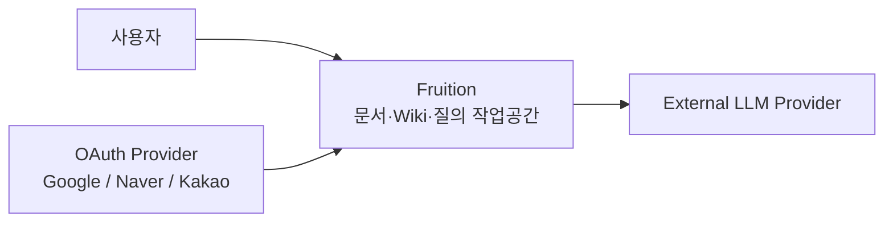
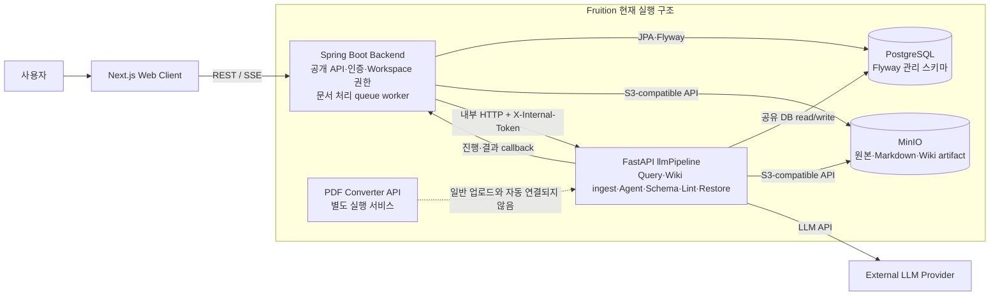
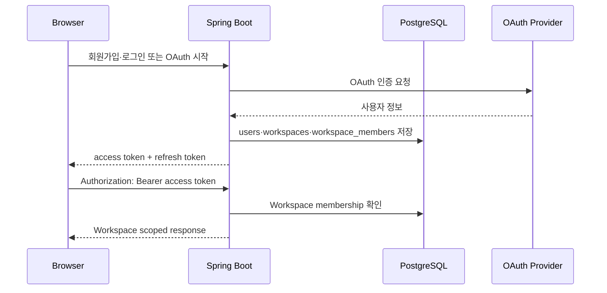
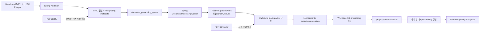
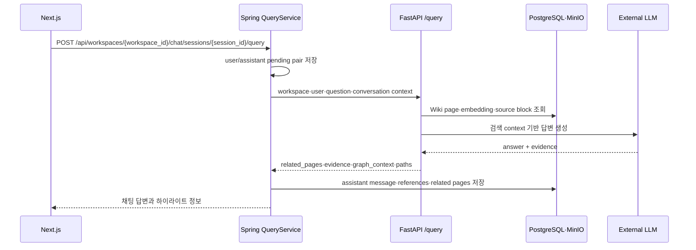

# Fruition 아키텍처

> 상태: 현재 구현 기준
> 기준 브랜치: `dev`
> 기준일: 2026-08-06
>
> 이 문서는 저장소의 코드·설정·Flyway migration을 기준으로 작성한다. AWS MSA, Kafka, EKS, MongoDB를 사용하는 구조는 현재 실행 구조가 아니라 [백로그의 목표 구조](./backlog/Fruition_AWS_MSA_Architecture.md)다.

## 1. Goals

Fruition은 사용자가 문서의 정확한 파일명을 기억하지 못해도 Wiki page와 원본 근거를 찾고, 질문과 Markdown 편집을 하나의 Workspace 안에서 이어갈 수 있게 하는 지식 작업공간이다.

현재 아키텍처의 목표는 다음과 같다.

- 인증된 사용자의 Workspace 경계를 지킨다.
- PDF·Markdown 원본과 서비스 메타데이터를 분리한다.
- Markdown 문서를 Wiki ingestion pipeline으로 비동기 처리한다.
- Wiki graph, source block, evidence를 이용한 질의 결과를 채팅에 저장한다.
- AI 편집·ingest·lint·restore 작업을 operation 단위로 추적한다.
- 로컬 개발 환경에서 PostgreSQL, MinIO, Spring Boot, FastAPI를 재현 가능하게 실행한다.

## 2. Non-goals

현재 구현의 범위에 포함하지 않는 항목은 다음과 같다.

- Vercel·EKS·MSK·Kafka·MongoDB·Redis를 이용한 AWS MSA 배포
- 공개 링크, Workspace 멤버 초대, 세분화된 협업 권한
- 일반 PDF 업로드와 PDF converter의 자동 ingestion 연결
- 프론트엔드의 만료 access token 자동 갱신
- Agent Skill 기능의 기본 활성화. 현재 `AGENT_SKILLS_ENABLED=false`가 기본값이다.

이 항목들은 구현 계획 또는 목표 구조로 남기며 현재 시스템의 동작으로 설명하지 않는다.

## 3. Requirements

### 기능 요구사항

| 영역 | 현재 동작 |
|---|---|
| 인증 | 이메일·비밀번호와 Google/Naver/Kakao OAuth 로그인, access/refresh token 발급 |
| Workspace | 사용자별 Workspace 생성·조회·수정·삭제와 membership 기반 격리 |
| 문서 | PDF·Markdown 업로드, Markdown 생성·편집·내보내기·버전 복원 |
| Wiki | source/concept page, page link, graph·page 조회와 이름 변경 |
| 질의 | Wiki 검색, graph 탐색, evidence 생성, 동기·비동기 Query 실행 |
| AI 작업 | Markdown 편집안, Wiki ingest·lint·restore, 작업 로그와 결과 callback |
| 채팅 | 세션·메시지 저장, evidence·related page 저장, 채팅의 Wiki export |

### 비기능 요구사항

- Workspace 밖의 문서·Wiki·채팅을 조회하거나 변경하지 않는다.
- 업로드·편집·복구 요청의 중복 처리를 멱등성 키와 version 검증으로 제한한다.
- 긴 AI 작업은 HTTP 요청과 분리하고 진행 상태를 polling 또는 SSE로 전달한다.
- LLM 결과를 곧바로 사용자 문서에 반영하지 않고 validation·preview·apply 경계를 둔다.
- 원본 파일과 Markdown 본문은 데이터베이스 행과 별도 저장소에 보관한다.

## 4. C1 - System Context Diagram

사용자는 브라우저를 통해 Fruition에 접근한다. OAuth Provider는 로그인 과정에만 연결되고, LLM Provider는 Wiki 생성·질의·AI 편집·Schema 정리에 사용된다. 사용자의 브라우저가 `llmPipeline`을 직접 호출하지 않는 것이 현재 시스템 경계다.

## 5. C2 - Container Diagram

### Container 책임

| Container | 책임 | 현재 상태 |
|---|---|---|
| Next.js Web Client | 로그인, Workspace UI, 문서 편집, Wiki graph, 채팅, 상태 polling/SSE | 구현됨 |
| Spring Boot Backend | 외부 API, 인증, Workspace membership, 문서·채팅·Wiki 조회, operation 기록 | 구현됨 |
| Spring queue worker | `document_processing_queue`에서 문서를 하나씩 claim하고 pipeline 실행 요청 | 구현됨. 2초 fixed delay 기반 |
| FastAPI `llmPipeline` | Query, Wiki ingestion, Markdown Agent, Schema, lint, restore, embedding | 구현됨. 기능별 route로 분리 |
| PostgreSQL | 운영 데이터·관계·버전·작업 로그·pipeline 결과 저장 | Flyway V1~V19 관리 |
| MinIO | 문서 원본, Markdown, Wiki 산출물, asset 저장 | 로컬 개발 기준 구현됨 |
| PDF Converter | `pdfinfo`, OCR, `markitdown` 기반 변환 API | 별도 실행되지만 일반 upload flow에는 아직 연결되지 않음 |

## 6. Core Data Flow

### 6.1 인증과 Workspace 경계

이메일 회원가입과 최초 OAuth 가입은 기본 Workspace와 `owner` membership을 함께 만든다. Workspace 하위 요청은 membership이 없으면 존재 여부를 숨기기 위해 `404`로 거절한다.

### 6.2 Markdown 문서 처리와 Wiki ingestion

Markdown 업로드는 요청 transaction이 commit된 뒤 queue에 등록된다. `DocumentProcessingWorker`가 pending 항목을 순서대로 claim하고 FastAPI에 실행을 요청한다. pipeline은 PostgreSQL과 MinIO에서 입력을 읽고 LLM을 호출한 뒤 Wiki 산출물을 저장한다. 단계별 heartbeat와 최종 callback은 문서 상태·AI operation log·프론트 화면에 반영된다.

현재 일반 PDF upload는 원본 저장과 관리 정보 기록이 중심이며, `infra/docker-compose.converter.yml`의 converter가 이 흐름에 자동으로 연결되어 있지는 않다.

### 6.3 Wiki 기반 Query

긴 질의는 `query/runs`로 등록한다. Spring은 run 상태를 보관하고 FastAPI callback을 받아 SSE와 polling 응답으로 전달한다.

### 6.4 Markdown AI 편집

LLM 출력은 미리보기 단계에서 끝나며, 사용자가 적용한 경우에만 기존 Markdown 저장·version·lock 규칙을 통과한다.

## 7. Component Responsibilities

### Next.js Web Client

- Input: 사용자 입력, access token, Workspace ID
- Responsibility: 인증 화면, 문서·Wiki·채팅·Agent UI와 polling/SSE 표시
- Output: Spring API 요청, 사용자에게 답변·근거·상태 표시
- Failure handling: `401`이면 로그인 상태를 정리하고, `409/423`이면 충돌·잠금 상태를 표시한다.
- Why this exists: 외부 사용자가 제품 기능을 이용하는 단일 UI 경계를 제공한다.

### Spring Boot Backend

- Input: Browser REST/SSE 요청, FastAPI callback
- Responsibility: 공개 API, 인증, Workspace membership, 문서·채팅·Wiki·operation의 제품 규칙
- Output: API response, PostgreSQL transaction, MinIO object, FastAPI request
- Failure handling: validation·권한·상태 충돌을 `400/401/404/409/415/422`로 변환하고 pipeline 장애는 `502/503` 또는 failed 상태로 기록한다.
- Why this exists: 프론트엔드가 저장소와 AI pipeline의 내부 계약을 직접 알지 않도록 한다.

### DocumentProcessingWorker

- Input: `document_processing_queue`의 pending row
- Responsibility: queue claim, stuck item reset, FastAPI pipeline 실행 요청
- Output: `pipeline_run_id`, document processing 상태, progress callback 대상
- Failure handling: 서버 재시작 시 processing row를 pending으로 되돌리고, pipeline 호출 실패를 문서와 operation log에 기록한다.
- Why this exists: 긴 AI 작업을 사용자 upload transaction과 분리한다.

### FastAPI `llmPipeline`

- Input: 내부 HTTP request, PostgreSQL·MinIO의 문서와 Wiki 데이터
- Responsibility: Wiki ingestion, Query retrieval·answer, Markdown Agent, Schema, lint, restore, embedding
- Output: Wiki artifact, query answer/evidence/path, progress·result callback
- Failure handling: internal token 검증, payload validation, evaluator retry/fallback, run `failed`와 error 기록
- Why this exists: Python AI 생태계와 LLM workflow를 Spring 제품 API와 분리한다.

### PostgreSQL

- Input: Spring domain write, pipeline ingestion/query write
- Responsibility: 사용자·Workspace·문서·채팅·Wiki 관계·버전·작업 로그의 durable state
- Output: transaction 조회, queue claim, retrieval projection
- Failure handling: Flyway migration 검증 실패 시 application 기동을 중지한다. pipeline은 startup에서 schema를 확인만 한다.
- Why this exists: 관계·상태·멱등성·버전 충돌을 한 곳에서 검증한다.

### MinIO

- Input: 업로드 원본, Markdown, Wiki artifact, asset
- Responsibility: 큰 본문과 binary object 저장
- Output: object stream 또는 pipeline input
- Failure handling: DB transaction이 rollback되면 새로 저장한 object를 정리하도록 backend가 보정한다.
- Why this exists: DB에 큰 파일과 본문을 넣지 않고 보존·스트리밍한다.

### External LLM Provider

- Input: 정제된 Markdown, Wiki context, 사용자 지시
- Responsibility: semantic extraction, answer generation, edit proposal, schema organization
- Output: 구조화된 JSON 또는 Markdown
- Failure handling: provider timeout·contract 위반·보호 구문 손상은 pipeline 실패 또는 재시도·fallback으로 처리한다.
- Why this exists: MVP에서 자체 모델 운영 없이 지식화 가설을 검증한다.

## 8. Failure Handling

| 실패 지점 | 현재 처리 |
|---|---|
| 잘못된 입력 | DTO·파일·Markdown 검증 후 `400`; 지원하지 않는 파일은 `415` |
| 인증 실패 | access token 검증 실패는 `401`; refresh token은 hash와 만료·폐기 상태를 확인 |
| Workspace 접근 실패 | membership이 없으면 `404 WORKSPACE_NOT_FOUND` |
| 중복 요청 | `Idempotency-Key`와 request hash를 `idempotency_records`에 저장해 재실행·충돌을 구분 |
| 문서 동시 편집 | `base_version` 불일치는 `409`, 다른 사용자의 edit lock은 `423` |
| queue stuck | Spring 시작 시 processing row를 pending으로 되돌리고, worker는 처리 후 queue row를 삭제 |
| pipeline timeout/장애 | FastAPI 호출 실패를 문서·operation failed 상태로 기록하고, Query는 `502/503`으로 변환 |
| 오래된 callback | `run_id`, operation ID, payload hash를 확인하고 다른 실행의 event는 무시하거나 `409`로 거절 |
| LLM 출력 문제 | Markdown 보호 조각·schema·evaluator 검증, targeted patch/fallback, unresolved 상태 기록 |
| 저장소 불일치 | DB transaction 종료 후 object cleanup callback을 사용하고, pipeline artifact에는 hash를 함께 둔다 |

## 9. Security & Privacy

- 이메일 비밀번호는 BCrypt hash로 저장하고, refresh token·email verification code/token은 원문 대신 hash를 저장한다.
- access token은 JWT Bearer 방식이며 기본 만료는 900초, refresh token 기본 만료는 14일이다.
- Workspace-scoped service는 membership을 확인하며, 다른 Workspace의 존재 여부를 노출하지 않도록 `404`를 사용한다.
- FastAPI의 `/query`, `/pipeline`, `/chat-wiki`, `/wiki/*`, `/wiki-schema`, `/documents/*`, `/agent/turn` 경로는 `X-Internal-Token`을 요구하도록 구현되어 있다. Agent Skill 경로는 활성화 시 `X-Agent-Service-Token`도 요구한다.
- Spring의 AI operation result callback은 `X-Internal-Token`과 operation/payload 검증을 사용한다. 반면 문서 heartbeat와 Query event callback은 현재 flat endpoint에 token 검사가 없어, 외부 배포 전에 동일한 보호 정책으로 통일해야 한다.
- MinIO bucket은 anonymous access를 끄고, 원본·Wiki object key를 API를 통해서만 노출한다.
- secret은 `infra/.env` 또는 배포 환경 주입값으로 관리하며 커밋하지 않는다. LLM credential, token, 문서 원문을 일반 로그에 남기지 않는다.
- 현재 Spring Security는 `/api/auth/me`와 `/api/workspaces/**`를 명시적으로 authenticated로 보호하고, 나머지 제품 endpoint는 controller/service의 membership 검증과 내부 token 검증에 의존한다. 다만 현재 Spring의 pipeline outbound `RestClient` 구현에는 `X-Internal-Token` 주입이 확인되지 않아, token이 설정된 FastAPI 환경에서는 backend→pipeline 요청이 `401`이 될 수 있다. 이 연결 gap과 flat callback 보호는 외부 공개 전 해결해야 한다.

## 10. Scalability & Cost

### 현재 병목

- `DocumentProcessingWorker`가 2초 간격으로 하나의 pending 문서만 선택한다.
- FastAPI 긴 작업은 현재 process 내부 background task와 공유 PostgreSQL을 사용한다.
- Query latency와 비용은 retrieval 범위, embedding 방식, evaluator 재시도 횟수, LLM provider에 좌우된다.
- Wiki·embedding·operation 데이터가 같은 PostgreSQL instance에 쌓이면 ingestion과 query가 서로 영향을 줄 수 있다.

### 확장 방향

- queue claim을 여러 worker가 안전하게 수행하도록 row lock/lease와 worker별 concurrency를 도입한다.
- AI 작업량이 늘면 durable broker와 worker deployment를 도입하되, operation state는 PostgreSQL에 남긴다.
- Query projection과 embedding 계산을 분리하고, 반복 질의는 cache·precomputed projection으로 줄인다.
- object storage는 본문과 artifact의 원본 저장소로 유지하고, DB에는 metadata·hash·URI만 둔다.
- 비용은 모델별 token·latency·retry를 operation/run manifest에 기록해 관리한다.

이 확장 방향의 AWS 구현안은 현재 구조가 아니라 [백로그의 AWS MSA 목표 문서](./backlog/Fruition_AWS_MSA_Architecture.md)에서 관리한다.

## 11. Trade-offs

| 결정 | 선택 이유 | 감수한 비용 |
|---|---|---|
| Spring Boot + FastAPI 분리 | Spring은 인증·관계형 domain에, Python은 LLM·LangGraph에 적합 | 두 언어·두 runtime의 계약과 배포 복잡도 |
| DB queue + 내부 HTTP | MVP에서 Kafka 운영 없이 재시작·상태 추적을 구현 | 단일 worker 처리량과 shared DB coupling |
| PostgreSQL + MinIO | 관계·상태·version과 binary/object를 각각 잘 처리 | 두 저장소 간 transaction 보정 필요 |
| Spring public boundary | 프론트 계약과 AI pipeline 내부 변경을 분리 | Spring proxy·callback DTO 유지 비용 |
| shared DB의 pipeline write 허용 | 대량 Wiki 결과를 빠르게 적재하고 현재 구현을 단순화 | 단일 writer 원칙 위반. [ADR-0003](./adr/0003-choose-event-processing-strategy.md)에 부채와 전환 방향을 기록 |
| 동기 + 비동기 Query | 짧은 질의는 단순한 response, 긴 질의는 SSE/polling으로 처리 | 두 실행 모델과 run 상태를 함께 유지 |

## 12. Related Documents

- [API 문서](./api.md)
- [데이터 모델](./data-model.md)
- [Demo Script](./demo-script.md)
- [Backend–llmPipeline 상세 API 계약](./spec/llmpipeline-backend-api-contract.md)
- [ADR 목록](./adr/README.md)
- [백로그 목록](./backlog/README.md)
