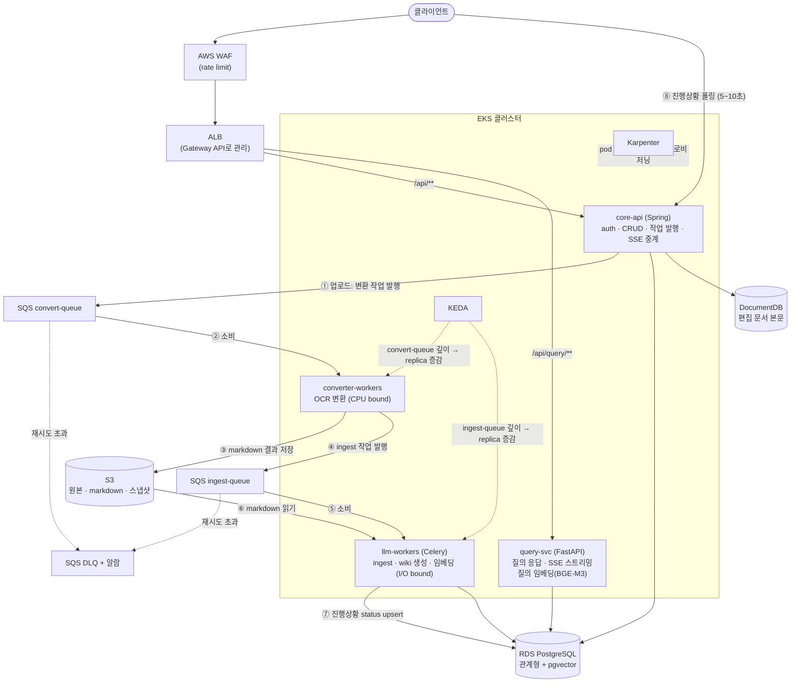

# Fruition MSA 전환 및 AWS 배포 제안서

> **이전 자료 안내 (2026-07-27)**: 이 문서는 4서비스와 SQS를 전제로 한 초기 제안서다. 현재 목표 구조는 [Fruition AWS MSA 목표 구조](../Fruition_AWS_MSA_Architecture.md)를 따른다.

> 작성일: 2026-07-20 (4차 개정 — query SSE 확정, 전체 재정리)
> 대상: Fruition MVP (backend / llmPipeline / converter / frontend)
> 목적:
> 1. 오래 걸리는 LLM 작업을 K8s(EKS)에서 안정적으로 처리하기 위한 서비스 분할
> 2. 문서(NoSQL) / 사용자(RDBMS) 저장소 분리
> 3. AWS 관리형 서비스를 활용한 실제 배포 아키텍처
> 4. 실시간 통신(SSE/폴링), 관측성, 비용, 보안, 백업 방안

---

## 1. 요약 — 결정 사항 한눈에

| 질문 | 결정 | 근거 위치 |
|------|------|-----------|
| 서비스를 어떻게 나눌까? | **4개**: core-api / query-svc / llm-workers / converter-workers. 더 잘게 쪼개지 않음 | §3 |
| 게이트웨이는 직접 구현? | **아니오.** ALB + AWS Load Balancer Controller. AWS "API Gateway" 서비스는 SSE 제약으로 비권장 | §4.2 |
| LLM 장시간 작업 처리는? | **SQS 큐 + Celery 워커 + KEDA 큐 깊이 스케일링** | §4.3 |
| query 응답 전달은? | **SSE 스트리밍 확정.** 첫 토큰까지 시간이 체감 품질을 지배 | §4.4 |
| 배치 작업 진행상황은? | **SSE가 아니라 status 폴링.** 다중 replica 팬아웃 문제가 해결이 아니라 소멸. Redis pub/sub 불필요 | §4.4 |
| User 데이터 → RDBMS? | **적합.** RDS PostgreSQL | §5.1 |
| 문서 본문 → NoSQL? | **채택.** 편집기가 문서 전체를 한 단위로 저장·수정 → MongoDB 계열. 메타·관계·임베딩은 RDS(+pgvector), S3는 원본·스냅샷 | §5.2 |
| 월 비용은? | 편집기 도입 전 **약 $230~260/월** (참고치). NAT Gateway 요금 함정 → VPC Endpoint 필수 | §7 |
| 운영 가시성은? | MSA 전환과 **동시에** `run_id` 상관관계 ID + 중앙 로깅 구축 | §6 |

---

## 2. 현재 구조 진단

### 2.1 구성 요소

| 구성 | 스택 | 역할 |
|------|------|------|
| `backend/` | Spring Boot 3.5 (Java 21) | auth, workspace, 문서 메타, wiki/chat CRUD, query SSE 중계 |
| `llmPipeline/` | FastAPI (Python) | ingest, wiki 생성(LangGraph), 임베딩(BGE-M3), query 응답, agent — 전부 장시간 LLM 작업 |
| `infra/converter/` | FastAPI + OCR | 문서 → markdown 변환 사이드카 (이미 분리됨) |
| `frontend/` | Next.js 14 | 웹 UI |

### 2.2 저장소 현황

- **PostgreSQL 16 단일 DB** (`fruition_mvp`)
  - backend가 JPA + Flyway로 관계형 테이블 관리 (users, workspaces, documents, wiki_pages, chat_* 등)
  - **pipeline이 같은 DB에 raw SQL(psycopg3)로 직접 씀** (wiki_pages, wiki_page_embeddings 등)
- **MinIO(S3 호환)**: 문서 원문·위키 markdown 본문은 이미 객체 저장. Postgres에는 URI/메타데이터만 존재

### 2.3 문제점 4가지

1. **DB 결합**: backend(JPA)와 pipeline(raw SQL)이 같은 테이블을 공유. 스키마 변경 시 두 코드베이스가 동시에 깨질 수 있음 — MSA 전환의 최대 걸림돌
2. **브로커 부재**: 비동기 처리가 `BackgroundTasks`, `threading.Thread`, DB 테이블 큐(`document_processing_queue`), HTTP 콜백으로 임시 구현 → 프로세스 재시작 시 작업 유실 위험
3. **배포 인프라 공백**: K8s 매니페스트 없음(docker-compose만). backend/frontend는 Dockerfile조차 없음
4. **진행상황 전달의 단일 인스턴스 가정**: 워커 → backend HTTP 콜백 → SSE 구조는 backend가 1개일 때만 성립. replica가 늘면 콜백 받은 인스턴스와 SSE 연결 쥔 인스턴스가 달라짐 (§4.4에서 폴링 전환으로 해소)

---

## 3. 서비스 분할

### 3.1 서비스별 책임

| 서비스 | 기반 | 책임 | 스케일 방식 |
|--------|------|------|------------|
| **core-api** | 기존 backend 그대로 | auth, workspace, 문서 메타, wiki/chat CRUD, query SSE 중계, 진행상황 status 조회 | HPA (빠른 CRUD) |
| **query-svc** | pipeline의 query/agent 모듈 | 대화형 질의 응답, SSE 스트리밍 | HPA (동시 접속 기준, min 1 — §3.4) |
| **llm-workers** | pipeline의 ingest/생성/임베딩 모듈 | 큐 소비형 배치성 LLM 작업 | KEDA (ingest-queue 깊이) |
| **converter-workers** | 기존 converter를 큐 소비 워커화 | OCR 문서 변환 (CPU bound) | KEDA (convert-queue 깊이) |

### 3.2 왜 더 잘게 쪼개지 않는가

- Martin Fowler의 ["Monolith First"](https://martinfowler.com/articles/break-monolith-into-microservices.html): 서비스 경계를 초기에 정확히 긋기는 어렵고, 잘못 그은 경계는 단일 코드베이스 안에서 고치는 게 훨씬 싸다
- 소규모 팀은 마이크로서비스 운영 비용("microservice premium")이 기능 개발 시간을 잠식한다 ([modular monolith 권장론](https://newsletter.techworld-with-milan.com/p/why-you-should-build-a-modular-monolith))
- 현재 코드가 이미 backend / pipeline / converter라는 자연스러운 경계를 갖고 있다. **이 경계를 승격하는 것이 최소 비용의 MSA 전환.** user/workspace/wiki를 각각 서비스로 또 나누는 것은 근거 없는 과분해
- 학습이 목적에 포함되므로: 관리형으로 대체 가능한 것(게이트웨이·DB·큐)은 대체하고, 서비스 분리·K8s 운영·스케일링에 학습 리소스를 집중

### 3.3 파이프라인 모듈 배정표 (전체)

`llmPipeline/app/modules/`의 **모든** 모듈을 두 서비스 중 하나에 배정한다. 기준은 하나: **사용자가 응답을 기다리는가(동기 → query-svc) / 큐에 넣고 잊는가(배치 → llm-workers)**.

| 모듈 | 배정 | 근거 |
|------|------|------|
| `query` | query-svc | 대화형 질의 응답, 스트리밍 |
| `agent` | query-svc | 대화 턴 처리, query와 동일 UX 특성 |
| `markdown_edit` | query-svc | agent 모듈이 직접 import (`agent/application/handle_agent_turn.py` 등) — agent와 분리 불가 |
| `wiki_ingestion` | llm-workers | 큐 소비형 배치 작업 |
| `wiki_generation` | llm-workers | LangGraph 기반 장시간 생성 |
| `wiki_embedding` | llm-workers | 배치 임베딩 |
| `wiki_schema` | llm-workers | ingest 계열 |
| `document_evaluation` | llm-workers | ingest 평가 단계 (wiki-ingest-evaluator) |
| `document_restoration` | llm-workers | `document_evaluation`이 의존 (`local_document_evaluator.py`) — OCR/vision 배치 |

> 공용 코드(도메인 모델, 저장소 어댑터)는 monorepo 공용 패키지로 공유. 서비스 분리 ≠ 저장소 분리.

### 3.4 주의: query-svc도 임베딩 모델이 필요하다

query 모듈은 유사도 검색을 사용한다 (`query/application/evidence_selector.py`, `query_page_scorer.py`). 질의를 벡터로 바꾸려면 **query-svc에도 BGE-M3가 필요**하다.

| 선택지 | 장점 | 단점 |
|--------|------|------|
| **A. query-svc가 직접 BGE-M3 로드 (시작안)** | 구조 단순, 추가 서비스 없음 | pod 메모리 수 GB, 콜드스타트 수 분 → `minReplicas: 1` 고정 필요 |
| B. 내부 임베딩 서비스 분리 | 모델 1곳 로드, query-svc 경량화 | 서비스 +1, 네트워크 홉 +1 — 초기엔 과분해 |

A로 시작하고, query-svc·llm-workers 양쪽 모델 메모리가 노드 비용을 압박하면 B로 전환.

---

## 4. AWS 배포 아키텍처

### 4.1 전체 그림



> 이미지: ECR │ CI: GitHub Actions │ CD: ArgoCD │ 시크릿: Secrets Manager + ESO
> 통신 규칙 요약 — **query = SSE 스트리밍(동기), 배치 진행상황 = status 폴링, 작업 전달 = SQS 큐.** 근거는 §4.4.

### 4.2 진입점: AWS API Gateway가 아니라 ALB인 이유

**게이트웨이를 직접 구현(코드 작성)할 필요는 없다.** 다만 AWS의 두 관리형 선택지 중 ALB를 골라야 한다.

**AWS API Gateway의 제약 (우리 서비스와 충돌):**
- 기본 통합 타임아웃 **29초** — query SSE 같은 장시간 연결에 부적합 ([AWS Compute Blog](https://aws.amazon.com/blogs/compute/building-responsive-apis-with-amazon-api-gateway-response-streaming/))
- response streaming으로 15분까지 SSE가 가능해졌지만 **REST API 전용**(HTTP API 불가), regional endpoint도 **idle 5분 타임아웃** ([AWS 공식 문서](https://docs.aws.amazon.com/apigateway/latest/developerguide/response-transfer-mode.html))
- API Gateway가 맞는 경우는 API key 발급/사용량 플랜 등 외부 API 상품화가 필요할 때 ([AWS Containers Blog](https://aws.amazon.com/blogs/containers/integrate-amazon-api-gateway-with-amazon-eks/)) — 현재 요구사항에 없음

**ALB + AWS Load Balancer Controller 권장:**
- L7 path 라우팅으로 단일 ALB에서 여러 서비스 노출 (`/api/**`→core-api, `/api/query/**`→query-svc) ([AWS 공식 가이드](https://aws.amazon.com/blogs/containers/how-to-expose-multiple-applications-on-amazon-eks-using-a-single-application-load-balancer/))
- idle timeout 조정 가능(기본 60초, 최대 4,000초 — [ALB 공식 문서](https://docs.aws.amazon.com/elasticloadbalancing/latest/application/application-load-balancers.html#idle-timeout)) → SSE 사용 가능. 단, 아래 keepalive 필수
- rate limit은 ALB에 없으므로 **AWS WAF rate-based rule**로 보완. 인증(JWT)은 지금처럼 core-api가 처리
- **학습 포인트**: AWS Load Balancer Controller가 K8s **Gateway API 표준(HTTPRoute)** 을 지원 — 구식 Ingress 대신 Gateway API로 구성하면 표준 스펙 학습과 관리형 이점을 동시에 얻는다 ([AWS Networking Blog](https://aws.amazon.com/blogs/networking-and-content-delivery/streamline-your-amazon-eks-deployments-with-gateway-api-support-for-aws-load-balancer-controller-and-amazon-vpc-lattice/))

**SSE keepalive (query 경로 필수 설정):**
- ALB idle timeout은 "마지막 바이트 이후" 기준. LLM 생성 중 토큰 간격이 길어지거나 툴 호출로 침묵 구간이 생기면 연결이 조용히 끊긴다
- 대책: **서버가 15~30초 간격으로 SSE comment 라인(`: keep-alive\n\n`) 전송.** 데이터가 아니라 클라이언트 파싱에 영향 없음. 적용 대상은 query 경로(core-api 중계 + query-svc)뿐 — 배치 진행상황은 폴링이라 해당 없음

### 4.3 큐: SQS + Celery + KEDA

**브로커로 ElastiCache Redis 대신 SQS를 권장하는 이유:**
- SQS는 메시지를 다중 AZ에 복제 저장 — 브로커 장애로 인한 작업 유실 없음. Redis는 인메모리라 장애 시 미처리 작업이 사라질 수 있다 ([ElastiCache vs SQS 비교](https://stackshare.io/stackups/amazon-elasticache-vs-amazon-sqs))
- 서버 관리 제로, 선불 비용 없음, 소규모 트래픽에서는 사실상 무료 ([Celery with SQS](https://seankerr.dev/posts/using-celery-with-an-sqs-broker/))
- Celery가 SQS를 공식 브로커로 지원 ([Celery 공식 문서](https://docs.celeryq.dev/en/stable/getting-started/backends-and-brokers/index.html))
- KEDA에 **SQS 스케일러 내장** — `ApproximateNumberOfMessages` 기준 replica 자동 증감, EKS Pod Identity로 자격 증명 처리 ([AWS Prescriptive Guidance 공식 패턴](https://docs.aws.amazon.com/prescriptive-guidance/latest/patterns/event-driven-auto-scaling-with-eks-pod-identity-and-keda.html))

**트레이드오프 (알고 선택할 것):**
- SQS 브로커는 Celery 일부 기능(worker remote control, 우선순위 큐) 미지원 ([Celery 공식 문서](https://docs.celeryq.dev/en/stable/getting-started/backends-and-brokers/index.html)) — 현재 요구사항에 불필요
- Celery result backend 별도 필요 → 이미 있는 Postgres 상태 테이블(run status) 재활용이 단순
- **Standard 큐는 순서 비보장 + 중복 배달 가능**(at-least-once). 같은 문서에 ingest를 연달아 두 번 발행하면 뒤집힌 순서로 처리될 수 있다. 대책: 멱등 처리(아래 표) + 메시지에 발행 시각/버전 포함, **오래된 메시지는 워커가 스킵**. FIFO 큐는 순서를 보장하지만 처리량 제한·설정 복잡도 증가로 초기엔 불필요
- **visibility timeout 상한 12시간** ([SQS 공식 문서](https://docs.aws.amazon.com/AWSSimpleQueueService/latest/SQSDeveloperGuide/sqs-visibility-timeout.html)) — "최장 작업 × 2" 규칙으로 6시간 넘는 작업이 생기면 패턴 재검토 (현재 작업은 수십 분 수준이라 여유 큼)

**흐름 (문서 업로드 → wiki 생성 예시):**
1. core-api가 SQS에 작업 메시지 발행(doc ID, S3 URI, `run_id`, `schema_version`) 후 즉시 202 + task ID 반환
2. SQS가 메시지를 다중 AZ에 복제 저장. 워커가 가져가면 visibility timeout 동안 다른 워커에게 숨김
3. Celery 워커가 큐 소비, 작업 실행(수 분~수십 분). 진행 상황은 status 테이블 upsert → 프론트가 core-api를 폴링 (§4.4)
4. 성공 시 메시지 삭제(ack). **워커가 도중에 죽으면 visibility timeout 후 메시지 재노출 → 다른 워커가 재처리 (유실 없음)**
5. 재시도 한도(maxReceiveCount) 초과 시 DLQ 격리 + 알람
6. KEDA가 큐 깊이를 보고 replica 증감 (예: `queueLength: 5` → 대기 25개면 5 replica)

**운영에서 반드시 잡아야 할 설정:**

| 설정 | 값 | 안 하면 |
|------|-----|---------|
| SQS visibility timeout | 최장 작업 시간 × 2 (상한 12h) | 작업 중 메시지 재노출 → 중복 실행 |
| Celery `acks_late=True` | 작업 완료 후 ack | 기본값(선 ack)이면 워커 사망 시 작업 유실 |
| 작업 멱등성 | run ID 기준 upsert | 재시도 시 중복 데이터. 현재 repo의 status 테이블 upsert 구조가 이미 이 형태 |
| `terminationGracePeriodSeconds` | 작업 시간 이상 + Celery warm shutdown | KEDA 축소 시 실행 중 작업 강제 종료 |

**converter도 같은 패턴 (재구조화):**

converter(OCR)는 llm-workers와 병목 특성이 다르다 — CPU bound, 수 초~수 분, 업로드 폭주 시 스파이크. 동기 HTTP로 두면 폭주 시 타임아웃·유실 위험 → **별도 SQS 큐(`convert-queue`) + KEDA** 동일 패턴. 큐를 작업 유형별로 분리하면 OCR 폭주가 LLM 워커 스케일에 영향 없음.

처리 체인: 업로드 → `convert-queue` → converter-workers → S3 저장 → `ingest-queue` 발행 → llm-workers.

**스케일링 주의점:**
- CPU 기준 HPA는 LLM 워커에 부적합 — CPU가 놀면서 큐만 쌓임 ([vLLM autoscaling 분석](https://dev.to/soniarotglam/why-vllm-autoscaling-on-kubernetes-breaks-and-what-to-use-instead-1231)). 큐 깊이 스케일이 표준 ([AWS EKS 공식 가이드](https://docs.aws.amazon.com/eks/latest/userguide/ml-inference-autoscaling-hpa-keda.html))
- BGE-M3 등 모델 자체 호스팅 pod는 콜드스타트(모델 로딩 수 분) → `minReplicaCount: 1` 유지 ([KEDA cold-start 분석](https://www.spheron.network/blog/keda-knative-gpu-autoscaling-kubernetes-llm-cold-start/)). **query-svc도 동일 (§3.4)**
- 노드 레벨은 **Karpenter** — pod 증가 시 적절한 인스턴스를 초 단위 프로비저닝, Cluster Autoscaler보다 비용 효율적 ([EKS 프로덕션 사례](https://medium.com/@yawgyamfiprempeh27/eks-karpenter-argocd-from-zero-to-production-gitops-with-25-cheaper-ci-cd-pipelines-heres-8bd81d4d657b))

### 4.4 실시간 통신 설계: 무엇을 스트리밍하고, 무엇을 폴링하나

원칙 하나로 정리된다: **사용자가 초 단위로 기다리는 응답은 SSE, 분 단위 배치는 폴링.**

| 경로 | 방식 | 이유 |
|------|------|------|
| query/agent 응답 | **SSE 스트리밍 (확정)** | 첫 토큰까지 시간이 체감 품질을 지배 |
| ingest/wiki 생성 진행상황 | **status 폴링 (5~10초)** | 수십 분 작업에 상시 연결은 비용만 있고 이득 없음 |
| 작업 전달 (core-api → 워커) | SQS 큐 | 유실 불가 데이터 — §4.3 |

#### query: SSE 확정 근거

query는 임베딩 검색 + LLM 생성 + agent 툴 호출을 포함해 **10초를 넘는 응답이 일상**이다. 검토한 대안:

| 대안 | 평가 |
|------|------|
| **A. SSE 스트리밍 (채택)** | 첫 토큰 1~3초 → 체감 즉답. 연결 수명이 수초~수십 초라 배치에서 SSE를 버린 이유(장시간 연결, 재연결 로직)가 해당 없음. 요청받은 pod가 그 자리에서 스트리밍하는 요청-응답 단일 체인이라 **팬아웃 문제도 원래 없음.** backend에 SSE 중계가 이미 구현돼 있어 추가 개발 비용도 없음 |
| B. 동기 HTTP 한 방 | 가장 단순하지만 응답 완성까지 30~60초 무반응 — 사용자는 죽은 것으로 인식. ALB timeout도 전체 응답 시간만큼 필요. 평균 응답이 5초 이내일 때만 합리적인데, 우리 워크로드가 아님 |
| C. query도 폴링 | 부분 응답을 폴링하려면 생성 중간 텍스트를 초당 수십 토큰씩 DB에 upsert해야 함 — 쓰기 부하 불가. 완성본만 폴링하면 B와 동일 + 복잡도만 추가 |

운영 조건은 §4.2의 keepalive(15~30초 heartbeat) + ALB idle timeout 설정이 전부다.

#### 배치 진행상황: 폴링 확정 근거

**문제.** 기존 구조(현재 코드)는 "워커 → core-api HTTP 콜백 → SSE 푸시"인데, 이는 core-api가 1개일 때만 성립한다:

```
클라이언트 A ──SSE──> core-api pod #1   (SSE 연결은 pod #1이 쥠)
워커 콜백    ──HTTP──> core-api pod #2   (K8s Service가 임의 pod로 라우팅)
→ pod #2는 A의 SSE 연결을 모름. 이벤트 소실.
```

§3.1에서 core-api를 HPA로 스케일하므로 replica는 반드시 2개 이상 — 이대로면 진행상황 표시가 확률적으로 동작한다.

**해결: 폴링 전환.** 문제를 "해결"하는 게 아니라 "소멸"시킨다.

1. 워커는 진행 상황을 **Postgres status 테이블에 upsert** (`run_id` 기준, 이미 존재하는 구조)
2. 프론트는 진행 중인 작업이 있을 때만 **core-api status 조회 API를 5~10초 간격 폴링**, 완료/실패 응답 받으면 중단
3. core-api는 어느 replica든 status 테이블만 읽으면 됨 → **팬아웃 문제 자체가 없음**

| 관점 | SSE 상시 연결 | status 폴링 (채택) |
|------|--------------|-------------------|
| 사용자 행동 | 탭 닫기/새로고침마다 재연결 로직 | 페이지 열 때마다 자연스럽게 최신 상태 |
| 다중 replica | Redis pub/sub 팬아웃 인프라 필요 | 추가 인프라 불필요 |
| 구현 | 워커 이벤트 발행 + 구독 코드 | 기존 status 테이블 + 조회 API 그대로 |
| 지연 | 실시간 | 5~10초 — 수십 분 작업에서 무의미한 차이 |
| 비용 | ElastiCache +$12/월 | $0 |

폴링 부하는 걱정할 수준이 아님 — 진행 중 작업을 가진 클라이언트만 폴링하는 단건 PK 조회. 동시 작업 수백 건 규모가 되면 status 조회에 짧은 캐시(1~2초)를 얹으면 된다.

**기각한 대안 (기록용):**

| 대안 | 기각 이유 |
|------|-----------|
| Redis pub/sub 팬아웃 + SSE 유지 | 동작은 하지만 ElastiCache 인프라·발행/구독 코드 추가 대비 얻는 것이 배치 진행률의 실시간성뿐. 수십 분 작업에서 5초 지연은 UX 차이 없음 |
| sticky session (ALB) | SSE 연결 pod는 고정돼도 워커 콜백 라우팅 문제는 그대로. 미해결 |
| WebSocket | 폴링 대비 이득 없음 + 연결 관리 복잡도만 추가 |

> 추후 실시간 공동 편집 등 진짜 실시간 push가 필요한 기능이 생기면 Redis pub/sub 팬아웃(위 기각안)을 다시 꺼낸다. 설계는 이미 검토돼 있다.

### 4.5 서비스 간 통신 보안

MSA로 나누는 순간 "내부 API"가 생긴다. 방치하면 클러스터 내 아무 pod나 관리성 엔드포인트를 호출할 수 있다.

| 항목 | 방안 | 비고 |
|------|------|------|
| 내부 서비스 노출 범위 | ALB에는 core-api·query-svc만 연결. llm-workers·converter는 **ClusterIP도 불필요**(큐 소비형이라 인바운드 HTTP 없음) | 외부 노출면 최소화 |
| 내부 API 인증 | core-api 내부 전용 엔드포인트(있다면)는 **공유 시크릿 헤더** 검증. 시크릿은 Secrets Manager → ESO 주입 | 소규모 클러스터에 mTLS/서비스메시(Istio 등)는 과설계 — 미도입이 결정사항 |
| 네트워크 격리 | **NetworkPolicy**로 "query-svc → RDS, llm-workers → RDS/S3, core-api → 전부" 식 최소 허용 | EKS는 VPC CNI의 NetworkPolicy 지원 사용 |
| AWS 자원 접근 | pod별 **IRSA/Pod Identity**로 IAM 역할 분리 — llm-workers는 ingest-queue·S3 읽기만, core-api는 발행만 | long-lived key를 pod에 넣지 않음 |
| SQS 메시지 계약 | 메시지에 `schema_version` 포함. 워커는 모르는 버전이면 DLQ로 | 발행자/소비자 배포 시점이 어긋나도 안전 |

### 4.6 관리형 서비스 매핑

| 현재 (로컬) | AWS | 비고 |
|-------------|-----|------|
| Postgres 16 (docker) | **RDS for PostgreSQL** | pgvector 0.8.0 지원 (PG 15.9+/16.5+/17.1+) ([AWS 공식](https://aws.amazon.com/about-aws/whats-new/2024/11/amazon-rds-for-postgresql-pgvector-080/)). DB를 K8s 안에서 돌리지 말 것 ([EKS Best Practices](https://docs.aws.amazon.com/eks/latest/best-practices/introduction.html)) |
| MinIO | **S3** | 이미 S3 호환 API 사용 중 → endpoint 설정 변경 수준으로 이전 |
| (없음) | **SQS** | Celery 브로커 + KEDA 스케일 신호 |
| docker-compose | **EKS** | 학습 목표 부합. 비용 최적화만 원하면 ECS Fargate가 더 싸지만 K8s 학습 가치 없음 |
| (없음) | **ECR** | 컨테이너 이미지 저장소 |
| (없음) | **DocumentDB 또는 MongoDB Atlas** | 편집기 문서 본문. 선택 기준 §5.2 |
| .env 파일 | **Secrets Manager + External Secrets Operator** | pod에 long-lived credential 금지, IRSA/Pod Identity 사용 ([ESO 통합 패턴](https://medium.com/@muralindiablog/aws-external-secret-and-application-integration-running-on-eks-407beccddb5f)) |
| (없음) | **GitHub Actions(CI) + ArgoCD(CD)** | Git = 클러스터 상태의 단일 진실 공급원 ([ArgoCD on EKS](https://oneuptime.com/blog/post/2026-02-26-argocd-aws-eks-best-practices/view)) |

frontend(Next.js)는 EKS에 같이 올려도 되고 Amplify/Vercel로 분리해도 됨 — 백엔드 아키텍처와 독립적 결정.

---

## 5. 저장소 설계

### 5.1 User → RDBMS: 적합 ✅

- 대상: `users`, `user_oauth_accounts`, `user_refresh_tokens`, `workspaces`, `workspace_members`
- FK 무결성, 트랜잭션(ACID), 멤버십 정합성이 핵심 — RDBMS가 정석 ([PostgreSQL vs MongoDB 2025](https://dev.to/hamzakhan/postgresql-vs-mongodb-in-2025-which-database-should-power-your-next-project-2h97))
- AWS에서는 **RDS for PostgreSQL**

### 5.2 문서 본문 → NoSQL: 채택 ✅

**전제**: 문서 편집기 서비스를 제공하며, **문서 전체를 한 단위로 저장·수정**하는 모델. `source_blocks` 테이블은 LLM이 문단 단위로 활용하기 위한 것이지 편집기 저장 모델이 아니다.

**채택 근거:**

1. **S3는 hot 편집 경로에 부적합.** S3 객체는 불변 — 한 글자 수정에도 전체 재업로드, 부분 수정 API 없음, PUT마다 과금·지연. S3 역할은 원본·스냅샷·내보내기로 한정
2. **Postgres JSONB는 통짜 문서의 잦은 수정에 불리.** `jsonb_set` 부분 수정도 내부적으로는 **JSONB 전체 재작성 + MVCC 새 row 버전 생성**, 2KB 초과 시 TOAST로 빠져 read-modify-write 지연 급증 ([JSONB 내부 트레이드오프](https://dev.to/aws-builders/postgresql-vs-mongodb-for-json-the-internal-trade-offs-they-dont-tell-you-in-the-docs-40oe))
3. **MongoDB는 update-heavy 문서 워크로드에서 우세.** `$set` 필드 단위 in-place 수정, 저널에 델타만 기록. 고동시성 부분 업데이트 벤치마크 우위 ([MongoDB update-heavy 평가](https://www.mongodb.com/company/blog/technical/evaluation-update-heavy-workloads-postgresql-jsonb-and-mongodb-bson), [PG17 vs MongoDB 벤치마크 리뷰](https://techbytes.app/posts/postgresql-17-json-vs-mongodb-benchmark-reality-check/))

**기각한 대안 (기록용):** 블록 단위 row 저장이면 RDBMS로도 편집기 대규모 운영이 검증돼 있다 — Notion이 블록=row 모델로 RDS Postgres에서 2,000억+ 블록 운영 ([Notion 데이터 모델](https://www.notion.com/blog/data-model-behind-notion)). 통짜 문서 모델 확정으로 미채택. 실시간 공동 편집(블록 단위 동시 수정)이 요구되면 재검토.

**비용 인지:** DB 두 종류 운영은 정합성·운영 부담 수반 ([database-per-service 장단점](https://www.dataexpert.io/blog/polyglot-persistence-database-per-service-pattern)). 문서 본문(MongoDB)과 메타데이터(RDS) 정합성은 §5.3 소유권 규칙으로 관리.

**AWS 선택지: DocumentDB vs MongoDB Atlas**

| 기준 | Amazon DocumentDB | MongoDB Atlas (on AWS) |
|------|-------------------|------------------------|
| API 호환성 | MongoDB 4.0 수준, 기능 호환 ~35% — `$facet`/`$unionWith`/Atlas Search/Vector Search 없음 ([호환성 비교](https://oneuptime.com/blog/post/2026-03-31-mongodb-atlas-vs-documentdb-compatibility-features/view)) | 최신 MongoDB 전체 기능 |
| AWS 통합 | VPC 내부 전용, IAM 통합 단순 | VPC peering/PrivateLink 별도 구성 |
| 쓰기 확장 | 단일 primary, 샤딩 제한 | 네이티브 샤딩 |
| **최소 비용** | **db.t3.medium 1대 약 $60/월 + 스토리지/IO. 무료 티어 없음** | **M0 무료 티어(512MB), M10부터 ~$60/월** |
| 우리 워크로드 적합성 | 문서 CRUD + 부분 업데이트면 충분 | 고급 aggregation·검색 필요 시, 개발 단계 비용 절감 |

- **개발·검증은 Atlas M0(무료)로 시작**해 편집기 저장 모델을 검증하고, 프로덕션 전환 시점에 DocumentDB(AWS 통합 단순) vs Atlas 유료(최신 기능)를 재결정
- 주의: 호환성 비교 출처 다수가 MongoDB 자사 자료 — 수치는 참고치

**저장소 역할 최종 정리:**

| 저장소 | 역할 |
|--------|------|
| MongoDB 계열 | 편집 중인 문서 본문 (hot path) |
| S3 | 업로드 원본, 버전 스냅샷, 내보내기 |
| RDS PostgreSQL | 유저/워크스페이스/권한, 문서 메타데이터, wiki 링크 그래프, 임베딩(pgvector) |

### 5.3 진짜 고칠 것: DB 종류가 아니라 "소유권"

database-per-service 패턴의 핵심은 "다른 DB 제품 사용"이 아니라 **서비스별 데이터 소유권** ([polyglot persistence in microservices](https://softwarepatternslexicon.com/microservices/6/6/)).

- 현재: backend(JPA)와 pipeline(raw SQL)이 **같은 테이블**에 씀 → 이 결합부터 끊는다
- wiki 결과물·임베딩 테이블은 **llm-workers 소유** 확정, core-api는 API/이벤트로만 접근
- 문서 본문(MongoDB 컬렉션)은 **core-api(문서 편집 도메인) 소유** — llm-workers는 ingest 시점 스냅샷(S3)이나 API로만 읽음
- 임베딩: 일반 컬럼 → **pgvector 전환** (RDS 지원, HNSW 인덱스 포함 ([AWS](https://aws.amazon.com/about-aws/whats-new/2023/10/amazon-rds-postgresql-pgvector-hnsw-indexing/)))

**마이그레이션 도구도 소유권을 따라 분리:**

| 테이블 그룹 | 소유 서비스 | 마이그레이션 도구 |
|-------------|------------|------------------|
| users, workspaces, documents 메타, chat_* | core-api | **Flyway** (기존 유지) |
| wiki_pages, wiki_page_embeddings 등 파이프라인 산출물 | llm-workers | **Alembic** (Python 표준) — Flyway에서 해당 테이블 정의 제거 |

원칙: **한 테이블의 DDL을 두 도구가 만지는 순간이 사고 지점.** 이관 시점에 Flyway 히스토리에서 llm-workers 소유 테이블을 baseline으로 굳히고, 이후 변경은 Alembic만 수행.

---

## 6. 관측성

MSA 전환의 숨은 비용: "ingest가 왜 느리지?"의 답이 4개 서비스 + 큐 + 2개 DB에 흩어진다. **관측성 없이 서비스를 나누면 디버깅 시간이 개발 시간을 잠식한다.** 최소 구성을 전환과 동시에(로드맵 단계 8) 넣는다.

### 6.1 최소 구성 (필수)

| 항목 | 방안 | 이유 |
|------|------|------|
| **상관관계 ID** | 업로드 시점에 `run_id` 생성 → SQS 메시지·로그·status 테이블에 전파. 모든 서비스가 로그에 `run_id` 포함 | 문서 하나의 여정을 서비스 경계 넘어 추적하는 유일한 수단. **코드 수정이 필요한 유일한 항목 — 가장 먼저** |
| 중앙 로깅 | 구조화(JSON) 로그 + **CloudWatch Logs** (Fluent Bit DaemonSet) | `run_id`로 Logs Insights 크로스 서비스 검색 |
| 기본 메트릭 | **CloudWatch Container Insights** | pod CPU/메모리/재시작. 설치만 하면 됨 |
| 큐 알람 | SQS `ApproximateAgeOfOldestMessage` + DLQ 유입 건수 알람 | 큐 깊이보다 **최고령 메시지 나이**가 "처리가 멈췄다"의 정확한 신호 |

### 6.2 확장 구성 (학습 가치, 선택)

- **Prometheus + Grafana**: K8s 표준 스택 학습 목적이면 도입. Celery 워커 메트릭(처리율·실패율)은 `celery-exporter`로 노출
- **분산 트레이싱 (ADOT/X-Ray)**: 서비스 4개 + 큐 중심(비동기) 흐름이라 이득이 작음 — `run_id` 로깅이 같은 질문에 답한다. **초기 도입 보류가 결정사항.** 동기 호출 경로가 늘면 재검토

---

## 7. 비용 추정

서울 리전(ap-northeast-2), 최소 학습·검증 구성 기준 **참고치**. 단가는 구축 시점에 재확인할 것.

### 7.1 월 고정비 (편집기 도입 전)

| 항목 | 사양 | 월 비용(약) |
|------|------|------------|
| EKS 컨트롤플레인 | 클러스터 1개 | $73 |
| 워커 노드 | t3.medium × 2 (on-demand) | $75 |
| RDS PostgreSQL | db.t4g.micro + 20GB | $15~25 |
| ALB | 기본 + 소량 LCU | $20~25 |
| **NAT Gateway** | 1개 + 처리량 | **$43 + $0.059/GB** |
| SQS / ECR / Secrets Manager / CloudWatch | 소규모 사용량 | $5~15 |
| **소계** | | **약 $230~260/월** |

편집기 도입 시 **+DocumentDB db.t3.medium 약 $60/월 + 스토리지/IO** (개발 단계는 Atlas M0 무료로 회피 가능, §5.2).

### 7.2 비용 함정과 절감 수단

- **NAT Gateway가 최대 함정.** private subnet의 워커가 S3(문서 읽기/쓰기)·SQS(폴링)를 호출할 때마다 NAT 처리 요금. 문서·모델 파일은 GB 단위라 방치하면 NAT 요금이 인스턴스 요금을 넘을 수 있다:
  - **S3 Gateway Endpoint — 무료. 무조건 생성** (라우팅 테이블 항목일 뿐)
  - SQS·ECR·CloudWatch는 Interface Endpoint(개당 약 $7~8/월/AZ) — Celery의 SQS 폴링은 상시 트래픽이라 켜는 쪽이 보통 이득. NAT 요금 그래프 확인 후 결정 ([VPC Endpoints 요금](https://aws.amazon.com/privatelink/pricing/))
- **노드는 Karpenter + Spot**: 워커(llm-workers, converter)는 중단 허용 설계(§4.3 재시도)라 Spot 적합 — 최대 70~90% 절감. core-api·query-svc는 on-demand 유지
- **개발 환경 상시 가동 금지**: 야간·주말 노드 0으로 축소(Karpenter 자동, 컨트롤플레인 $73만 잔존). RDS도 개발 단계엔 stop 스케줄
- 단일 NAT·단일 AZ 최소 구성은 **가용성과 맞바꾼 선택** — 프로덕션 승격 시 multi-AZ 전환 (§8)

---

## 8. 백업·복구

| 대상 | 정책 | 비고 |
|------|------|------|
| RDS | 자동 백업 7일 + 주요 마이그레이션 전 수동 스냅샷 | point-in-time 복구 가능 |
| DocumentDB / Atlas | 자동 백업 7일 (양쪽 다 기본 제공) | 편집기 도입 시점에 활성화 확인 |
| S3 | **버저닝 활성화** + 이전 버전 30일 후 IA/삭제 lifecycle | 편집기 스냅샷 실수 삭제 방어 |
| SQS DLQ | **redrive 절차 문서화**: DLQ 메시지 확인 → 원인 수정 배포 → "Start DLQ redrive"로 원큐 재주입 | 멱등 처리(§4.3) 덕분에 재주입이 안전하다는 것이 전제 |
| 클러스터 상태 | 별도 백업 불필요 — GitOps(ArgoCD)라 Git이 곧 복구 원본 | 재해 복구 = `terraform apply` + ArgoCD sync |

DR(리전 장애) 대비는 현 단계 범위 밖 — 학습·MVP 규모에서 multi-region은 과설계. 단일 리전 내 multi-AZ(RDS multi-AZ, 노드 AZ 분산)는 프로덕션 승격 시점 체크리스트로 남긴다.

---

## 9. 단계별 로드맵

| 단계 | 작업 | 검증 기준 |
|------|------|-----------|
| 1 | 전 서비스 Dockerfile 작성 (backend/frontend 현재 없음), 로컬 docker-compose 4-서비스 분리 구동 | compose up으로 전체 플로우 동작 |
| 2 | Celery + SQS 도입(로컬은 ElasticMQ/LocalStack), `threading.Thread`·DB 테이블 큐 대체. 메시지에 `run_id`·`schema_version` 포함 | 워커 재시작 후 ingest 작업 유실 없음 |
| 3 | **진행상황 폴링 전환**: 워커→backend 직접 콜백 제거, status 테이블 upsert + 프론트 폴링으로 교체 (§4.4) | backend replica 2개로 띄워도 진행상황 정상 표시 |
| 4 | Postgres 쓰기 소유권 분리: llm-workers 소유 테이블 확정 + **Alembic 도입**, Flyway에서 해당 테이블 제거 (§5.3) | 테이블별 마이그레이션 주체가 하나 |
| 5 | AWS 기반 구축: EKS + ECR + RDS + S3 + SQS + Secrets Manager (Terraform 권장). **S3 Gateway Endpoint 필수**, S3 버저닝·RDS 백업 활성화 | 스테이징에서 전체 플로우 동작 |
| 6 | ALB(Gateway API 모드) + WAF 구성, **query SSE keepalive(15~30초 heartbeat)** + idle timeout 검증 | 장시간 무이벤트 구간 포함 query 스트리밍 끊김 없음 |
| 7 | KEDA(SQS 스케일러) + Karpenter 적용, NetworkPolicy·IRSA 역할 분리 (§4.5) | 부하 주입 시 워커 pod·노드 자동 증감, 서비스별 IAM 최소 권한 확인 |
| 8 | **관측성 구축**: `run_id` 전파, Fluent Bit → CloudWatch Logs, Container Insights, SQS 최고령 메시지·DLQ 알람 (§6) | `run_id` 하나로 업로드→변환→ingest 전 구간 로그 추적 |
| 9 | GitHub Actions → ECR → ArgoCD 파이프라인 | git push만으로 배포 완결 |
| 10 | pgvector 전환 | 기존 임베딩 검색 결과 동일성 확인 |
| 11 | 편집기 도입 시: Atlas M0(개발)→DocumentDB/Atlas(프로덕션) 구축, 문서 본문 이전 + S3 스냅샷 정책 | 편집→저장→LLM ingest 전체 플로우 동작, 본문·메타 정합성 확인 |

> 단계 3·4는 AWS 진입 전에 로컬에서 끝낼 수 있는 구조 개선. **인프라 비용이 발생하기 전에 아키텍처 결함(진행상황 전달·소유권)을 먼저 제거**하는 순서다.

---

## 10. 참고 자료

**MSA 분할 원칙**
- [Martin Fowler — How to break a Monolith into Microservices](https://martinfowler.com/articles/break-monolith-into-microservices.html)
- [Why you should build a modular monolith first](https://newsletter.techworld-with-milan.com/p/why-you-should-build-a-modular-monolith)

**비동기 큐 / 스케일링**
- [Celery 공식 — Backends and Brokers (SQS 지원)](https://docs.celeryq.dev/en/stable/getting-started/backends-and-brokers/index.html)
- [Using Celery with an SQS broker](https://seankerr.dev/posts/using-celery-with-an-sqs-broker/)
- [ElastiCache vs SQS 비교](https://stackshare.io/stackups/amazon-elasticache-vs-amazon-sqs)
- [SQS visibility timeout 공식 문서 (상한 12시간)](https://docs.aws.amazon.com/AWSSimpleQueueService/latest/SQSDeveloperGuide/sqs-visibility-timeout.html)
- [AWS Prescriptive Guidance — KEDA + SQS + EKS Pod Identity](https://docs.aws.amazon.com/prescriptive-guidance/latest/patterns/event-driven-auto-scaling-with-eks-pod-identity-and-keda.html)
- [AWS EKS — Autoscale AI inference with HPA and KEDA](https://docs.aws.amazon.com/eks/latest/userguide/ml-inference-autoscaling-hpa-keda.html)
- [KEDA cold-start 분석](https://www.spheron.network/blog/keda-knative-gpu-autoscaling-kubernetes-llm-cold-start/)
- [Why vLLM autoscaling on Kubernetes breaks](https://dev.to/soniarotglam/why-vllm-autoscaling-on-kubernetes-breaks-and-what-to-use-instead-1231)

**게이트웨이 / 진입점 / SSE**
- [API Gateway response streaming 공식 문서 (제약 포함)](https://docs.aws.amazon.com/apigateway/latest/developerguide/response-transfer-mode.html)
- [API Gateway response streaming 블로그](https://aws.amazon.com/blogs/compute/building-responsive-apis-with-amazon-api-gateway-response-streaming/)
- [ALB idle timeout 공식 문서 (기본 60초, 최대 4000초)](https://docs.aws.amazon.com/elasticloadbalancing/latest/application/application-load-balancers.html#idle-timeout)
- [EKS 단일 ALB 다중 앱 노출](https://aws.amazon.com/blogs/containers/how-to-expose-multiple-applications-on-amazon-eks-using-a-single-application-load-balancer/)
- [AWS LB Controller의 Gateway API 지원](https://aws.amazon.com/blogs/networking-and-content-delivery/streamline-your-amazon-eks-deployments-with-gateway-api-support-for-aws-load-balancer-controller-and-amazon-vpc-lattice/)
- [API Gateway + EKS 통합 (API 상품화 케이스)](https://aws.amazon.com/blogs/containers/integrate-amazon-api-gateway-with-amazon-eks/)

**EKS 운영 / GitOps / 비용**
- [Amazon EKS Best Practices Guide](https://docs.aws.amazon.com/eks/latest/best-practices/introduction.html)
- [ArgoCD on EKS Best Practices](https://oneuptime.com/blog/post/2026-02-26-argocd-aws-eks-best-practices/view)
- [EKS + Karpenter + ArgoCD 프로덕션 사례](https://medium.com/@yawgyamfiprempeh27/eks-karpenter-argocd-from-zero-to-production-gitops-with-25-cheaper-ci-cd-pipelines-heres-8bd81d4d657b)
- [External Secrets Operator + Secrets Manager 통합](https://medium.com/@muralindiablog/aws-external-secret-and-application-integration-running-on-eks-407beccddb5f)
- [VPC Endpoints 요금 (S3 Gateway 무료, Interface 유료)](https://aws.amazon.com/privatelink/pricing/)

**저장소 / 편집기 워크로드**
- [MongoDB — Update-Heavy Workloads: JSONB vs BSON 평가](https://www.mongodb.com/company/blog/technical/evaluation-update-heavy-workloads-postgresql-jsonb-and-mongodb-bson)
- [PostgreSQL JSONB 내부 트레이드오프 (TOAST/MVCC)](https://dev.to/aws-builders/postgresql-vs-mongodb-for-json-the-internal-trade-offs-they-dont-tell-you-in-the-docs-40oe)
- [PostgreSQL 17 JSON vs MongoDB 벤치마크 리뷰](https://techbytes.app/posts/postgresql-17-json-vs-mongodb-benchmark-reality-check/)
- [Notion 데이터 모델 (블록=row, RDS Postgres)](https://www.notion.com/blog/data-model-behind-notion)
- [MongoDB Atlas vs Amazon DocumentDB 호환성 비교](https://oneuptime.com/blog/post/2026-03-31-mongodb-atlas-vs-documentdb-compatibility-features/view)
- [RDS PostgreSQL pgvector 0.8.0 지원](https://aws.amazon.com/about-aws/whats-new/2024/11/amazon-rds-for-postgresql-pgvector-080/)
- [RDS pgvector HNSW 인덱싱](https://aws.amazon.com/about-aws/whats-new/2023/10/amazon-rds-postgresql-pgvector-hnsw-indexing/)
- [MongoDB vs PostgreSQL JSONB: Deep Dive](https://dev.to/sparsh9/mongodb-vs-postgresql-jsonb-a-deep-dive-into-performance-and-use-cases-5bge)
- [JSON Documents: MongoDB vs PostgreSQL 실측](https://binaryigor.com/json-documents-mongodb-vs-postgresql.html)
- [PostgreSQL vs MongoDB in 2025](https://dev.to/hamzakhan/postgresql-vs-mongodb-in-2025-which-database-should-power-your-next-project-2h97)
- [Polyglot Persistence: Database Per Service Pattern](https://www.dataexpert.io/blog/polyglot-persistence-database-per-service-pattern)
- [Polyglot Persistence in Microservices](https://softwarepatternslexicon.com/microservices/6/6/)
