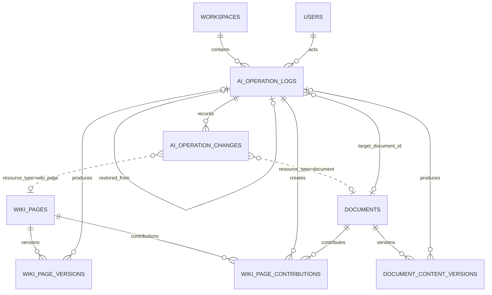
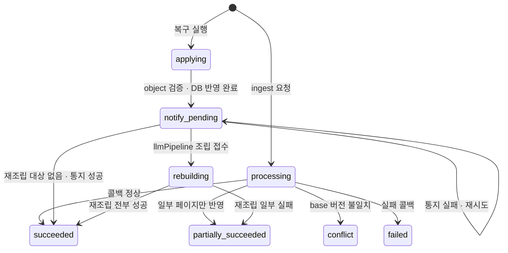

# AI 작업 로그 저장·조회·복구 설계 (상세)

> 요약본은 [`ai-operation-log.md`](./ai-operation-log.md)다. 이 문서는 같은 설계의 **근거와 배경**을 담는다.
> 결정 사항이 충돌하면 요약본이 기준이다.

## 1. 문서 정보

- 상태: Draft
- 작성일: 2026-07-30
- 기준 계약: `ai-operation-log.md`(AI 작업 로그 저장·조회 계약 초안)
- 구현 범위: Backend API. 데이터 모델, 저장 흐름, 조회·복구 API, llmPipeline 계약, 기능 단위 작업 계획
- 범위 밖: 프론트엔드 UI, 보존 정책(개수·기간 제한)과 로그 삭제 API, llmPipeline 내부 구현

## 2. 먼저 결론

- 사용자에게 보여줄 AI 작업 로그를 Backend RDS 한 곳에 모은다. 대상은 `document_edit`, `ingest`, `lint`다.
- llmPipeline 결과는 **Kafka가 아니라 내부 콜백 API**로 받는다. Backend에 Kafka가 없고, 기존 `/api/documents/**` 콜백과 같은 방식이면 Kafka 도입 시 수신부만 교체하면 된다.
- Wiki revision은 **Backend 소유로 신규 생성**한다. 기준 계약은 llmPipeline 소유 S3를 전제했으나 이번 결정으로 소유권을 Backend로 옮긴다.
- **버전은 `revision` 하나다.** 단조 증가하며 화면에도 이 번호를 쓴다. 기여 수는 `contribution_count`로 함께 보여주되 버전으로 쓰지 않는다.
- **복구는 "그 작업의 기여를 빼는 것"이다.** 빼고 남은 기여를 세면 그게 목표 기여 수다.
- 페이지별 활성 기여는 `wiki_page_contributions`에서 명시적으로 관리한다. 과거 로그만 재생해 현재 상태를 추측하지 않는다.
- Wiki revision 채번과 `markdown_uri` 갱신은 Backend만 수행한다. llmPipeline은 작업별 불변 object를 쓰고 결과 key만 콜백한다.
- 본문은 RDS에 저장한다. diff는 저장하지 않고 줄 수만 저장한다.
- 보존 정책과 로그 삭제는 이번 범위에서 제외한다. 따라서 `expires_at`, `deleted_at` 컬럼도 만들지 않는다.

## 3. 현재 상태

| 항목 | 상태 | 근거 |
|---|---|---|
| Document 버전 이력 | 있음 | `document_content_versions`(V12), `DocumentController.java:433-495` |
| Document diff·복구 API | 있음 | `GET /{id}/diff`, `POST /{id}/versions/{version}/restore` |
| diff 계산기 | 있음 | `MarkdownDiffService` (Myers, 크기 가드) |
| AI 작업 로그 테이블 | 없음 | — |
| Wiki revision·기여 명단 | 없음 | `WikiPage`는 `markdown_uri` 1개를 덮어쓰는 구조 |
| Kafka | 없음 | `backend/build.gradle`에 의존성 없음 |
| llmPipeline 연동 | 동기 HTTP | `PipelineAgentRequester`, `PipelineWikiMaintenanceRequester`, `/api/documents/{id}/pipeline-events` |

확인된 제약 세 가지.

- llmPipeline이 Wiki 본문을 in-place로 덮어쓴다(`postgres_wiki_output_persistence.py:337`, `postgres_wiki_ingestion_repository.py:691`). Backend는 읽기만 하므로 **Wiki 변경을 스스로 감지할 수 없다.** 이 덮어쓰기는 이번 설계에서 **작업별 고유 key 쓰기로 바꾼다**(8.2.1).
- `DocumentService.saveContent`의 `source` 파라미터는 현재 받기만 하고 쓰이지 않는다(`DocumentService.java:945-1007`). 문자열만으로 AI 작업 여부를 신뢰할 수 없어 `apply_operation_id` 검증으로 대체한다.
- llmPipeline의 `PipelineRunIn`은 `extra="forbid"`다(`schemas.py:14`). 요청 필드 추가는 반드시 llmPipeline 스키마 수정을 동반한다.

## 4. 목표와 비목표

### 4.1 목표

- AI가 문서·Wiki를 바꾼 이력을 한 목록에서 조회한다.
- 각 변경의 before/after diff를 확인한다.
- 특정 작업을 취소해 그 이전 상태로 되돌린다.

### 4.2 비목표

- LLM 호출 trace, 재시도 진단, CloudWatch application log는 다루지 않는다.
- 적용하지 않은 AI 편집안은 기록하지 않는다(5.1).
- 로그 개수·기간 제한과 정리 배치는 만들지 않는다.
- Wiki 간선(link)의 기여 support 모델은 별도 범위다.

## 5. 기록 원칙

### 5.1 실제 반영된 변경만 남긴다

AI 편집은 "편집안 생성"과 "사용자 승인 후 저장" 2단계다. 로그는 **저장 단계에서만** 쓴다.

| 사용자 행동 | 로그 |
|---|---|
| 편집안을 보고 적용 | 남음 |
| 편집안을 취소하거나 이탈 | 남지 않음 |
| 3번 재요청 후 마지막 것만 적용 | 1건 |

로그 1건이 곧 되돌릴 수 있는 지점이 된다. 미확정 `processing` row도 쌓이지 않는다. `processing`은 비동기인 ingest 전용이다. lint는 동기 호출(11.5)이라 이 상태를 거치지 않는다.

**대안이었던 방식**은 편집안 생성 시점에 `processing` 로그를 만드는 것이었다. AI에게 요청한 이력까지 전부 남지만, 사용자가 편집안을 버리거나 창을 닫으면 `processing` row가 영구히 남고 정리할 주체가 없다. 또 적용하지 않은 편집안에는 되돌아갈 지점이 없어 복구 목록과 아귀가 맞지 않는다.

### 5.2 로그 1건 = AI 작업 1회

ingest 하나가 Wiki page 15개를 바꿔도 로그는 1건이고, 그 안에 변경내역 15건이 들어간다.

### 5.3 내용이 안 바뀌면 기록하지 않는다

`content_hash`가 같으면 변경내역을 만들지 않는다. 저장 버튼만 눌렀거나, lint가 훑기만 하고 고치지 않은 경우다.

## 6. 버전과 기여 모델

### 6.1 버전은 `revision` 하나다

되돌리기는 이력을 덮어쓰지 않고 **새 버전으로 append**한다. 그래서 `revision`은 절대 줄지 않는다.

```text
C3    revision            1    2    3    4    5      6
      만든 작업           A    B    C    A2   D      재조립(B,C,D)
      contribution_count  1    2    3    4    5   →  3
```

| 컬럼 | 성질 | 용도 |
|---|---|---|
| `revision` | 단조 증가. 절대 안 줄어듦 | 기본키 구성. **화면에 보여줄 버전.** 복구 지목 좌표 |
| `contribution_count` | 증가·감소 가능 | 그 시점에 살아 있던 기여 수. **버전이 아니다** |

### 6.2 기여 수를 버전으로 쓰지 않는 이유

기여 수를 버전으로 쓰면 같은 번호가 서로 다른 내용을 가리킨다.

```text
revision 4  기여 4  =  A, B, C, A2
revision 6  기여 4  =  A, B, C, D      ← 기여 수가 같지만 내용이 다름
```

번호가 되돌아가는 ABA 상태가 되어 다음이 전부 어긋난다.

- 캐시 무효화 — 소비자가 "버전 4"를 캐시했다면 변경을 감지하지 못한다
- 낙관적 잠금 — 같은 번호가 다른 상태를 뜻한다
- 이력 조회 — "버전 4로 돌아가기"가 어느 4인지 모호하다
- 복구 대상 지목 — 좌표로 쓸 수 없다

`revision`이 유일하므로 두 상태가 섞이지 않는다. 화면 표기는 이렇게 한다.

```text
C3  개념 페이지
    버전 6  ·  기여 문서 4개

버전 이력
    버전 6   기여 4   문서 A 복구      ← 현재
    버전 5   기여 5   문서 D ingest
    버전 4   기여 4   문서 A2 ingest
```

### 6.3 복구 목표 = 남은 기여 operation 수

"버전을 N 내린다"를 계산할 필요가 없다. **남는 기여를 세면 그게 목표 값**이다.

```text
C3 기여 이력 :  A → B → C → A2 → D        현재 5
A와 A2를 빼면 :  B, C, D                    목표 3
```

lint는 원문 기여가 아니므로 이 계산에 포함하지 않는다. lint가 만든 revision은 `contribution_count`를 올리지 않는다.

source page도 concept page와 **같은 버전 모델**을 쓴다. 기여 문서가 하나뿐일 뿐 구조는 동일하다. 재ingest는 교체가 아니라 `revision`을 올리고 기여를 하나 더 만든다. 그래서 `A`와 `A2`가 모두 기여로 남고, "A2만 취소"와 "문서 A 취소"가 다르게 동작한다. source page에만 예외를 두면 판정 로직이 두 벌이 된다.

### 6.4 기여란 무엇인가

개념 페이지는 여러 원문 문서가 조금씩 보태서 만들어진다. 그 한 덩어리가 **기여**다.

```text
C3  "머신러닝" 개념 페이지
      문서 A 가 넣은 것 : 정의
      문서 B 가 넣은 것 : 적용 사례
      문서 C 가 넣은 것 : 성능 지표
      문서 D 가 넣은 것 : 한계점
```

네 덩어리가 **하나의 글로 엮여 있어** A 부분만 오려낼 수 없다. 그래서 복구는 빼기가 아니라 **남은 조각으로 다시 조립하기**다.

기여는 **작업 단위**다. `A`와 `A2`는 같은 문서지만 다른 작업이라 별개다.

## 7. ERD

### 7.1 전체 관계



신규 테이블은 `AI_OPERATION_LOGS`, `AI_OPERATION_CHANGES`, `WIKI_PAGE_VERSIONS`, `WIKI_PAGE_CONTRIBUTIONS` 넷이다. 기존 테이블 중 컬럼이 추가되는 것은 `DOCUMENT_CONTENT_VERSIONS` 하나뿐이다.

점선 관계는 FK가 아니다. `ai_operation_changes.resource_id`는 `resource_type`에 따라 `documents.id` 또는 `wiki_pages.id`를 가리키는 다형 참조라 DB 제약을 걸지 않는다. 대상이 삭제돼도 로그는 남아야 한다.

### 7.2 `ai_operation_logs` (신규)

AI 작업 1회를 1행으로 기록한다.

| 컬럼 | 타입 | 제약 | 설명 |
|---|---|---|---|
| `operation_id` | varchar(255) | PK | 작업 식별자. 작업 등록 중복 방지 |
| `workspace_id` | varchar(255) | NOT NULL, FK → `workspaces(id)` ON DELETE CASCADE | 조회 범위 |
| `user_id` | varchar(255) | NOT NULL, FK → `users(id)` | 작업을 일으킨 사용자 |
| `operation_type` | varchar(20) | NOT NULL | 7.7 참조 |
| `target_document_id` | varchar(255) | NULL 허용, FK → `documents(id)` ON DELETE SET NULL | **어느 원문 문서의 작업인지. 없으면 복구가 불가능하다.** lint는 NULL |
| `status` | varchar(20) | NOT NULL | 7.7 참조 |
| `summary` | text | NULL 허용 | 사용자에게 보여줄 한 줄 요약 |
| `changed_resource_count` | integer | NOT NULL DEFAULT 0 | 실제 생성된 변경내역 수 |
| `restored_from` | varchar(255) | NULL 허용, FK → self | 복구 작업이 되돌린 대상 |
| `restore_manifest` | jsonb | NULL 허용 | 복구 시 llmPipeline에 보낸 조립 지시서 원본. 재조립 결과 수신과 재전송에 사용 |
| `payload_hash` | varchar(64) | NULL 허용 | 완료 콜백 payload의 정규화 SHA-256. 재전송 동일성 확인 |
| `created_at` | timestamptz | NOT NULL | 작업 생성 시각. 목록 정렬·감사용 |
| `completed_at` | timestamptz | NULL 허용 | 종료 시각 |

```sql
CREATE INDEX idx_ai_operation_logs_workspace_type
    ON ai_operation_logs(workspace_id, operation_type, created_at DESC);
CREATE INDEX idx_ai_operation_logs_target_document
    ON ai_operation_logs(target_document_id, created_at);
```

기준 계약은 `id` PK와 `operation_id` UNIQUE를 함께 뒀지만 대리 키가 필요한 곳이 없어 `operation_id`를 PK로 쓴다.

ingest는 Backend가 llmPipeline을 호출하기 **전에** 이 행을 `processing`으로 먼저 커밋한다. 콜백 본문의 `workspace_id`, `user_id`, `target_document_id`는 권한 판단에 사용하지 않고 이 행의 값과 일치하는지만 검증한다. 콜백이 보낸 값을 권한 근거로 쓰면 위조된 콜백이 다른 워크스페이스를 건드릴 수 있다.

### 7.3 `ai_operation_changes` (신규)

작업 1회가 바꾼 리소스를 1행씩 기록한다. **일어난 일의 감사 기록이며 나중에 고치지 않는다.**

| 컬럼 | 타입 | 제약 | 설명 |
|---|---|---|---|
| `id` | bigint | PK, GENERATED BY DEFAULT AS IDENTITY | 복구 API 경로 변수 |
| `operation_id` | varchar(255) | NOT NULL, FK → `ai_operation_logs` ON DELETE CASCADE | 소속 작업 |
| `resource_type` | varchar(20) | NOT NULL | `document`, `wiki_page` |
| `resource_id` | varchar(255) | NOT NULL | 다형 참조. FK 없음 |
| `before_revision` | bigint | NULL 허용 | 손대기 직전 버전. NULL이면 새로 만든 것 |
| `after_revision` | bigint | NULL 허용 | 이 작업이 만든 버전. 위임·실패면 NULL |
| `change_type` | varchar(20) | NOT NULL | 7.7 참조 |
| `change_summary` | text | NULL 허용 | 리소스별 요약. 실패 사유도 여기 |
| `additions` | integer | NULL 허용 | 추가된 줄 수 |
| `deletions` | integer | NULL 허용 | 삭제된 줄 수 |

```sql
CREATE INDEX idx_ai_operation_changes_operation ON ai_operation_changes(operation_id);
CREATE INDEX idx_ai_operation_changes_resource  ON ai_operation_changes(resource_id, id);
CREATE UNIQUE INDEX uk_ai_operation_changes_operation_resource_type
    ON ai_operation_changes(operation_id, resource_type, resource_id, change_type);
```

UNIQUE 제약이 콜백 재전송 시 변경내역 중복을 막는다. `change_type`을 키에 포함하는 이유는 한 복구 작업이 같은 페이지에 대해 `delegated`와 `rebuilt`를 순서대로 남기기 때문이다.

**diff 본문은 저장하지 않는다.** 전체 본문이 `wiki_page_versions`와 `document_content_versions`에 있어 언제든 재계산할 수 있다. 저장하면 같은 정보가 두 곳에 남고 어긋날 여지가 생긴다.

실제 시스템들도 같은 선택을 한다.

| 시스템 | 저장 | diff |
|---|---|---|
| Git | 전체 스냅샷(blob) | 저장 안 함. 볼 때 계산 |
| MediaWiki | revision마다 전체 본문 | 계산 후 메모리 캐시. DB 컬럼 아님 |
| Notion · Confluence | 버전마다 전체 문서 | 볼 때 계산 |

기존 `GET /documents/{id}/diff`도 이미 요청 시 계산한다. 위키만 다르게 갈 이유가 없다.

`additions`·`deletions`만 저장하는 이유는 상세 화면이 페이지 목록을 보여줄 때 페이지 수만큼 diff를 돌리지 않게 하기 위해서다. 저장 시점에 어차피 한 번 계산하므로 추가 비용이 없다.

### 7.4 `wiki_page_versions` (신규)

Wiki 페이지의 본문 이력. `document_content_versions`와 같은 형태다.

| 컬럼 | 타입 | 제약 | 설명 |
|---|---|---|---|
| `page_id` | varchar(255) | PK, FK → `wiki_pages(id)` ON DELETE CASCADE | 대상 페이지 |
| `revision` | bigint | PK | 저장 순번. 1부터 단조 증가. **화면 버전이자 복구 좌표** |
| `contribution_count` | integer | NOT NULL | 그 시점 살아 있던 기여 수. 버전이 아니다 |
| `markdown` | text | NOT NULL | 그 시점 전체 본문 |
| `markdown_key` | text | NOT NULL | 그 본문이 담긴 불변 object key. **복구가 이 값을 재사용한다** |
| `content_hash` | varchar(64) | NOT NULL | 무변경 판정용 |
| `operation_id` | varchar(255) | NULL 허용, FK → `ai_operation_logs` ON DELETE SET NULL | 이 버전을 만든 작업 |
| `created_by` | varchar(255) | NULL 허용 | 작업을 일으킨 사용자 |
| `created_at` | timestamptz | NOT NULL | 생성 시각 |

```sql
CREATE INDEX idx_wiki_page_versions_page ON wiki_page_versions(page_id, revision DESC);
```

다음 revision 채번은 이 인덱스로 `max(revision)`을 읽어 얻는다. 인덱스 첫 항목 1행이라 비용이 사실상 없고, `wiki_pages`에 중복 상태를 두지 않아도 된다.

#### 본문을 RDS에 두는 이유

본문을 S3 key 참조로 두면 RDS 용량은 줄지만 운영이 복잡해진다.

| | RDS 저장 | 저장소 외부화 |
|---|---|---|
| 트랜잭션 | 버전 행과 본문이 **함께 커밋** | 두 시스템. 순서 규율 필요 |
| 백업·복구 | DB 백업 하나로 끝 | **DB와 버킷의 시점을 맞춰야 함** |
| 특정 시점 복구 | 간단 | 두 저장소를 같은 시점으로 |
| 삭제 요청 | 한 군데 | 두 군데 |

이 프로젝트 규모는 다음과 같다.

```text
위키 페이지 1,000개 × 버전 20개 × 본문 5KB  ≈  100MB
```

Postgres는 TEXT를 TOAST로 압축하므로 실제로는 더 작다. **외부화를 정당화하는 규모가 아니다.** MediaWiki도 초기에는 DB에 넣었다가 규모가 커진 뒤 외부화했다. 같은 신호가 오면 그때 옮긴다.

```text
wiki_page_versions 가 수십 GB          →  외부화 검토
페이지당 revision이 수백 개로 쌓임       →  오래된 본문만 외부로
백업 시간이 문제가 됨                   →  외부화 + 시점 정합 절차
```

`markdown_uri`가 가리키는 Object Storage object는 여전히 llmPipeline의 embedding·query가 읽는 현재 본문이다.

### 7.5 `wiki_page_contributions` (신규)

페이지를 구성하는 ingest 기여의 **현재 활성 상태**를 명시적으로 관리한다. `ai_operation_changes`는 감사 로그이고, 이 테이블은 복구 계산용 현재 상태다.

| 컬럼 | 타입 | 제약 | 설명 |
|---|---|---|---|
| `page_id` | varchar(255) | PK, FK → `wiki_pages(id)` ON DELETE CASCADE | 대상 페이지 |
| `ingest_operation_id` | varchar(255) | PK, FK → `ai_operation_logs(operation_id)` | 기여를 만든 ingest |
| `source_document_id` | varchar(255) | NULL 허용, FK → `documents(id)` ON DELETE SET NULL | 원문 문서 |
| `sequence_revision` | bigint | NOT NULL | 이 기여가 처음 적용된 페이지 revision |
| `object_key` | text | NOT NULL | 재조립에 사용할 불변 기여 조각 key |
| `active` | boolean | NOT NULL DEFAULT true | 현재 본문에 포함되는지 |
| `deactivated_by` | varchar(255) | NULL 허용, FK → `ai_operation_logs(operation_id)` | 비활성화한 restore 작업 |
| `created_at` | timestamptz | NOT NULL | 생성 시각 |

```sql
CREATE INDEX idx_wiki_page_contributions_active
    ON wiki_page_contributions(page_id, active, sequence_revision);
```

복구 시 제외 대상 기여는 `active=false`, `deactivated_by=복구 operation_id`로 갱신한다. 이후 복구는 `active=true`인 행만 기준으로 계산하므로 **이전에 제외한 기여가 다시 살아나지 않는다.** 감사 이력은 `ai_operation_changes`와 `restore_manifest`에 남는다.

#### 왜 별도 테이블인가

기여 이력을 `ai_operation_changes`에서 매번 재구성할 수도 있다. 그러나 세 가지가 걸린다.

- **역할 혼재** — `ai_operation_changes`는 "무슨 일이 있었나"(로그)인데 "지금 누가 기여 중인가"(상태)까지 떠받치게 된다
- **비활성 표현 불가** — "이 기여는 복구로 무효화됨"을 기록할 자리가 없다. 연속 복구에서 제외한 기여가 다시 포함된다
- **조립 지시서** — 이 테이블을 그대로 읽으면 지시서가 나온다. 재구성하면 매번 계산이 필요하다

`(ingest_operation_id, page_id)`가 llmPipeline이 보관한 **조각의 키**이기도 하다.

### 7.6 기존 테이블 변경

| 테이블 | 추가 컬럼 | 설명 |
|---|---|---|
| `document_content_versions` | `operation_id varchar(255)` NULL, FK → `ai_operation_logs` ON DELETE SET NULL | 이 버전을 만든 AI 작업. 수동 편집이면 NULL |

`wiki_pages`는 변경하지 않는다.

- **채번용 `current_revision`** — `max(revision)`으로 얻는다. 인덱스 첫 항목 1행이라 비용이 없고, 중복 상태를 만들지 않는다. `documents.current_version`은 낙관적 잠금(`updateContentIfVersionMatches`)에 쓰여 필요하지만, Wiki는 사용자 직접 편집이 없어 그 용도가 없다
- **재조립 실패용 `needs_lint`** — `ai_operation_changes.rebuild_failed`에 이미 남는다. 읽는 주체(lint의 페이지 지정, 화면 노출)가 정해지지 않은 상태에서 컬럼을 만들면 쓰기만 있고 읽기가 없는 죽은 컬럼이 된다

### 7.7 열거값과 상태



| 대상 | 허용값 |
|---|---|
| `operation_type` | `document_edit` · `ingest` · `lint` · `restore` |
| `status` | `processing` · `applying` · `notify_pending` · `rebuilding` · `succeeded` · `partially_succeeded` · `failed` · `conflict` |
| `change_type` | `created` · `updated` · `deleted` · `restored` · `delegated` · `rebuilt` · `rebuild_failed` |

`restore_rebuild`는 operation type이 아니라 restore의 **처리 단계**다. 재조립 결과 콜백은 새 operation을 만들지 않고 기존 restore operation의 `rebuilding` 단계를 완료시킨다.

## 8. 저장 흐름

### 8.1 `document_edit` — 저장과 같은 트랜잭션

```text
POST /agent/turns
  → 편집 잠금·base_version 선검사 (기존 그대로)
  → Backend가 apply_operation_id 발급
  → llmPipeline 호출, 결과와 apply_operation_id를 프론트에 반환
  → 로그 없음                              ← 아직 문서가 안 바뀜

PUT /documents/{id}/content  (source=agent, apply_operation_id)
  └─ saveContent 트랜잭션
       ① 워크스페이스·소유자·EDITABLE 검증
       ② editLockService.requireWritable
       ③ apply_operation_id가 해당 사용자·문서·편집안에 대해
          Backend가 발급한 값인지 검증
       ④ base_version 불일치 → 409 (8.4)
       ⑤ content_hash 동일 → changed=false 반환, 로그 없음
       ⑥ updateContentIfVersionMatches
       ⑦ recordContentVersion(baseVersion,   직전 본문)
       ⑧ recordContentVersion(baseVersion+1, 새 본문)
       ⑨ 검증된 apply_operation_id가 있을 때만
            ai_operation_logs insert (operation_id=apply_operation_id,
                                      succeeded, changed_resource_count=1)
            줄 수 계산 → ai_operation_changes insert (N → N+1)
            document_content_versions.operation_id 갱신
     commit
```

⑨가 ⑥~⑧과 같은 트랜잭션이다. 문서만 바뀌고 로그가 없거나 그 반대가 생기지 않는다.

**`source=agent` 문자열만으로 AI 작업 여부를 신뢰하지 않는다.** 그 값은 클라이언트가 임의로 넣을 수 있어, 수동 편집을 AI 작업으로 위장해 로그를 오염시킬 수 있다. Backend가 발급한 `apply_operation_id`를 검증한다.

줄 수 계산은 실패해도 저장을 막지 않는다. `MarkdownDiffService`는 크기 초과 시 예외를 던지므로(`MarkdownDiffService.java:83`) 잡아서 `additions`·`deletions`를 NULL로 두고 진행한다. 로그 때문에 사용자 저장이 실패하는 것은 잘못된 트레이드오프다.

### 8.2 `ingest` / `lint` — 요청 등록과 결과 콜백

```text
Backend
  → operation_id 발급
  → ai_operation_logs insert (processing) 후 commit
  → llmPipeline 요청
     요청 실패 → 별도 트랜잭션으로 status=failed

llmPipeline
  → Wiki 변경
  → 본문을 작업별 고유 key에 write     wiki/{ws}/pages/{page_id}/ops/{op_id}.md
  → 기여 조각 저장                    wiki/{ws}/pages/{page_id}/ops/{op_id}.json
  → POST /api/ai-operations/{operation_id}/result   (markdown_key 포함)

Backend
  ① 콜백 인증 검증
  ② operation_id 조회
     terminal 상태이며 같은 payload_hash → 기존 결과 200
     terminal 상태이며 다른 payload_hash → 409
  ③ 요청 때 저장한 workspace·user·document와 콜백 값 일치 여부,
     page 소속 검증
  ④ markdown_key·contribution_key 검증 — bucket은 환경 설정 고정, prefix가
     wiki/{요청 workspace_id}/pages/{요청 page_id}/ 로 시작하는지
  ⑤ [트랜잭션 밖] 페이지마다 markdown_key 읽기 → content_hash 대조
  ⑥ [트랜잭션 안]
       페이지마다
         wiki_pages 행 SELECT ... FOR UPDATE
         직전 wiki_page_versions 조회
           없음             → change_type=created, before_revision=NULL
           content_hash 동일 → skip
           다름             → 줄 수 계산, change_type=updated
         revision = max(revision) + 1
         wiki_page_versions insert
         wiki_page_contributions insert (ingest만, active=true,
                                         sequence_revision=revision)
         wiki_pages.markdown_uri 갱신
         ai_operation_changes insert
       ai_operation_logs 갱신 (payload_hash, succeeded 또는 partially_succeeded,
                               changed_resource_count)
     commit
```

같은 페이지의 revision 채번과 `markdown_uri` 변경은 **페이지 행 잠금 안에서 직렬화**한다. llmPipeline은 `wiki_pages`를 갱신하지 않는다. 콜백이 역순으로 도착해도 Backend가 실제 적용한 순서가 `revision` 순서이며, 한 콜백의 재전송은 `(operation_id, resource_type, resource_id, change_type)` UNIQUE와 `payload_hash`로 멱등 처리한다.

⑤를 트랜잭션 밖에 두는 이유는 페이지 N개를 저장소에서 읽는 동안 DB 커넥션을 붙잡지 않기 위해서다.

#### 8.2.1 덮어쓰기를 없애는 이유

기존 구조는 정본 경로 하나를 계속 덮어쓴다. 그러면 llmPipeline이 쓰고 Backend가 읽는 사이에 다른 작업이 끼어들 수 있다.

```text
op_A2 : C3 본문 write → 콜백 발송
op_D  : C3 본문 write            ← 끼어듦
Backend : C3 읽음 → op_D가 쓴 본문

기록 : "op_A2가 이 본문을 만들었다"   ← 사실이 아님
```

에러가 안 나고 **조용히 오염된다.** 몇 달 뒤 복구할 때 엉뚱한 내용이 들어가고 그때는 원인을 찾을 수 없다. 409로 거절해도 소용없다 — 재전송해도 본문은 이미 다른 작업 것이라 결과가 같다.

**작업마다 새 key에 쓰면 이 문제가 사라진다.** 이미 쓴 파일은 아무도 건드리지 않는다.

```text
wiki/{ws}/pages/{page_id}/ops/{op_a}.md
wiki/{ws}/pages/{page_id}/ops/{op_b}.md
wiki/{ws}/pages/{page_id}/ops/{op_a2}.md    ← wiki_pages.markdown_uri 가 여기를 가리킴
```

Backend가 검증하고 revision으로 채택한 가장 최근 파일이 현재 본문이다. `markdown_uri`는 고정 경로가 아니라 **Backend가 채택한 최신 작업 key를 가리키는 포인터**가 된다. llmPipeline의 embedding·query는 지금도 `wiki_pages.markdown_uri`를 DB에서 읽어 그 경로를 열므로, 경로가 매번 달라져도 그대로 동작한다.

#### 8.2.2 키 검증과 멱등

콜백이 준 경로를 검증 없이 읽으면 임의 객체를 읽게 된다. 기준 계약 §13의 "Backend는 result event에 담긴 임의 URI를 그대로 읽지 않는다"를 그대로 적용한다.

| 검증 | 방법 |
|---|---|
| bucket | 콜백에서 받지 않는다. 환경 설정으로 고정 |
| prefix | 정규화 후 정확히 `wiki/{workspace_id}/pages/{page_id}/ops/{operation_id}.md` 또는 `.json`인지 확인 |
| 무결성 | `content_hash` 대조 |

`WikiService.normalizeObjectName`(`WikiService.java:172`)이 이미 `s3://`와 bucket prefix를 벗겨내므로 여기에 prefix 검증만 더한다.

`content_hash`는 경합 검출이 아니라 **전송·저장 무결성 확인**용이다. 불일치면 쓰기가 잘린 것이므로 재전송이 실제로 의미가 있다.

콜백 인증은 별도 내부 토큰 또는 서명으로 검증한다. 기존 공개 인증 경로와 분리하며, **인증되지 않은 요청은 객체를 읽기 전에 401로 거부한다.**

멱등은 operation 행의 `payload_hash`와 변경내역 UNIQUE 제약으로 보증한다. `operation_id` PK는 작업 등록 중복만 막는다. 같은 payload 재전송은 200, 같은 operation에 다른 payload가 오면 409다.

### 8.3 콜백 순서와 base revision

llmPipeline 작업이 시작할 때 페이지별 `base_revision`을 요청에 포함하지 않으므로, 1차 구현에서는 **콜백 도착 순서대로 결과 전체를 새 revision으로 채택**한다. 이는 두 ingest가 같은 과거 본문을 바탕으로 서로의 변경을 덮는 의미 충돌까지 해결하지 않는다.

같은 페이지의 병렬 ingest를 허용하려면 후속 계약에서 `base_revision`을 콜백에 추가하고 불일치 시 `conflict` 또는 재조립으로 보내야 한다.

따라서 **1차 구현은 같은 workspace의 ingest를 직렬 실행한다.** 이 제약이 llmPipeline에서 보장되지 않으면 F4 완료 조건을 만족하지 못한 것으로 본다.

### 8.4 `conflict` 기록은 별도 트랜잭션

`base_version` 불일치는 `DocumentVersionConflictException`을 던지고 트랜잭션이 롤백된다. 같은 트랜잭션에 conflict 로그를 넣으면 함께 사라지므로 `REQUIRES_NEW`로 분리해 커밋한다.

## 9. 복구

### 9.1 `document_edit` 복구

문서는 기여가 겹치지 않는다. 한 줄로 흘러가므로 판정도 위임도 필요 없다.

```text
v1 → v2 → v3 → v4
           ↑ 여기로 되돌리려면 v3 본문을 새 버전으로 저장. 끝
```

기존 `POST /documents/{id}/versions/{version}/restore`(`DocumentController.java:494`)를 그대로 쓰고, 이번 작업에서는 그 복구를 `restore` 로그로 남기는 것만 추가한다.

9.2 이하는 전부 Wiki 얘기다.

### 9.2 판정 규칙

복구는 **"그 작업의 기여를 빼는 것"** 이다. 기준은 기여 문서 수가 아니라 **빼려는 기여가 페이지 이력의 어디에 놓였는지**다.

```text
E = 제외할 operation 집합. 기준 작업 X와 mode 로 정한다

    since     X 이후 같은 문서의 작업 전부      ← 기본값
              target_document_id = X.target AND created_at > X.created_at
    single    X 하나만                          { X }
    document  같은 문서의 작업 전부              target_document_id = X.target

페이지별 active=true 기여에서 E를 제거한 뒤

    남은 기여 = 0                              → 삭제
    E가 이력의 꼬리                             → Backend 복원
    그 외 (E가 중간에 낌)                       → llmPipeline 재조립
```

꼬리 판정은 자리 비교로 끝난다.

```text
E가 아닌 것의 마지막 자리  <  E인 것의 첫 자리     →  꼬리

C2  E={A2}  : [ A , B , (A2) ]             1 < 2        → 꼬리
C3  E={A2}  : [ A , B , C , (A2) , D ]     4 < 3 거짓   → 중간
C6  E={A2}  : [ (A2) , D ]                 1 < 0 거짓   → 중간
C2  E={A,A2}: [ (A) , B , (A2) ]           1 < 0 거짓   → 중간
```

### 9.3 왜 세 갈래인가

| 갈래 | 근거 |
|---|---|
| 삭제 | 남은 기여가 없으면 그 페이지는 존재 이유가 사라진다 |
| Backend 복원 | E가 꼬리면 **E 직전 스냅샷이 곧 정답**이다. 꺼내 쓰면 되고 LLM이 필요 없다 |
| 재조립 | E가 중간이면 "남은 기여만의 본문"이 저장된 적이 없다. 새로 써야 한다 |

```text
C2 이력 : A → B → A2

  A2만 취소  →  A2가 꼬리       → 직전 스냅샷이 이미 "A+B" → 꺼내 쓰면 끝
  A 취소     →  B가 중간에 남음  → "B만의 본문"은 한 번도 저장된 적 없음 → 재조립
```

세 번째가 llmPipeline이 필요한 유일한 경우다.

`C6`은 함정 사례다. `A2`가 만든 페이지(`before_revision=NULL`)지만 뒤에 `D`가 붙어 삭제 대상이 아니다. **NULL이라고 삭제하면 D의 기여를 잃는다.**

### 9.4 계산 절차

```text
① E 확정                ai_operation_logs
② 영향 페이지 수집       wiki_page_contributions
                        WHERE ingest_operation_id IN (E) AND active=true
③ 페이지별 활성 기여     wiki_page_contributions
                        WHERE page_id IN (후보) AND active=true
                        ORDER BY sequence_revision
④ 판정                  순수 계산. DB 접근 없음
⑤ 본문 로드             wiki_page_versions   ← Backend 복원 대상만
```

기여 순서는 실제 페이지 적용 순서인 `sequence_revision`으로 결정한다. `created_at`은 표시·감사용이며 복구 순서 계산에 사용하지 않는다. 작업 시작 시각과 실제 적용 순서가 다를 수 있기 때문이다.

**④까지 본문을 한 번도 읽지 않는다.** 미리보기가 가벼운 이유이고, 재조립 대상은 ⑤에서도 읽지 않는다. llmPipeline이 새로 쓸 것이라 예전 본문이 쓸모없다.

목표 값은 이렇게 나온다.

```text
Backend 복원의 목적지        = 제외 기여 중 가장 작은 sequence_revision의 직전 revision
재조립의 contribution_count  = 남은 active 기여 수
keep_contributions           = 남은 active 기여를 sequence_revision 순으로
```

### 9.5 실행 순서

```text
① 미리보기 응답 — "삭제 n건 · 복원 m건 · 재작성 k건"
   + preview_token(대상 page_id·현재 revision·활성 기여 manifest hash)
② 사용자 확인

③ preview_token 재검증
     현재 revision 또는 활성 기여가 달라졌으면 409

④ 문서 본문 복원 (document_role=EDITABLE인 경우)
     Wiki보다 문서가 먼저다. 문서가 그대로면 다음 ingest에서 되살아난다

⑤ ai_operation_logs insert (restore, applying, restore_manifest)
⑥ 직접 복원 본문을 새 key에 write
     wiki/{ws}/pages/{page_id}/ops/{op_restore}.md
   쓰기 실패 → DB 상태 변경 없이 재시도

⑦ [트랜잭션]
     영향받는 wiki_pages 행을 page_id 순서로 SELECT ... FOR UPDATE
     preview_token 조건 재검사
     새 object hash 재검증
     wiki_page_contributions
       SET active=false, deactivated_by=복구 operation_id
       WHERE ingest_operation_id IN (E) AND active=true
     [복원] wiki_page_versions insert (revision=max+1, contribution_count=남은 수)
            wiki_pages.markdown_uri 갱신
            ai_operation_changes insert (restored)
     [삭제] wiki_pages.status = 'deleted'
            wiki_page_links · document_wiki_links 정리
            ai_operation_changes insert (deleted)
     [위임] ai_operation_changes insert (delegated)
     ai_operation_logs.status = notify_pending
   commit

⑧ llmPipeline 조립 지시서 전송
     재조립 대상 있음 → rebuilding
     재조립 대상 없음 → succeeded
⑨ 재조립 결과는 restore 단계 콜백으로 수신
```

작업별 object는 불변 key이므로 **object를 먼저 써도 기존 정본에는 영향이 없다.** 쓰기와 검증이 끝난 뒤 revision 생성과 `markdown_uri` 이동을 한 트랜잭션에서 처리한다. 트랜잭션이 실패하면 object 하나만 고아로 남고 현재 본문은 바뀌지 않으며, 같은 key로 안전하게 재시도할 수 있다.

`page_id` 순서로 잠그는 이유는 여러 복구가 동시에 실행될 때 교착을 피하기 위해서다.

**삭제는 소프트 삭제**다. 하드 삭제하면 `wiki_page_versions`와 `wiki_page_contributions`가 CASCADE로 함께 사라져 되살릴 수 없다.

**위임도 기록으로 남긴다.** `delegated`가 없으면 복구 상세에서 "그 페이지는 어떻게 됐나"에 답할 수 없다.

문서 본문 복원부터 Wiki 반영까지는 하나의 DB 트랜잭션으로 묶을 수 없는 **saga**다. 중간 실패 시 restore operation을 `applying`에 두고 같은 `restore_manifest`로 재시도한다. 이 상태에서는 같은 문서에 대한 새 ingest를 막아, 문서만 먼저 복원된 상태가 새 Wiki 기여를 만들지 못하게 한다.

### 9.6 재조립 결과 처리

llmPipeline이 다시 쓰면 ingest와 같은 엔드포인트로 들어온다. 새 operation을 만들지 않고 **기존 restore operation의 `rebuilding` 단계를 완료**시킨다.

```text
① 멱등 확인          (operation_id, page_id, result_phase='rebuild')
② 목표 값 조회        restore_manifest 의 rebuild_pages 에서 contribution_count
③ [트랜잭션] 성공분
     페이지 행 잠금 → revision = max+1
     wiki_page_versions insert (contribution_count = 지시서 값)
     wiki_pages.markdown_uri 갱신
     ai_operation_changes insert (rebuilt)
   실패분
     ai_operation_changes insert (rebuild_failed, change_summary=reason)
④ ai_operation_logs 갱신 (succeeded 또는 partially_succeeded)
```

②가 `restore_manifest`를 저장해 둔 이유다. 다시 계산하면 그사이 새 ingest가 들어왔을 때 값이 달라진다. **보낸 지시서를 그대로 쓴다.**

`delegated` 행은 **갱신하지 않는다.** 로그는 일어난 일의 기록이라 나중에 고치지 않고, 화면에서는 같은 operation의 `delegated` → `rebuilt` 순서로 이어 보여준다.

허용 상태가 `rebuilding`이 아니거나 동일 page 결과의 payload가 다르면 409다.

### 9.7 lint의 위치

lint는 원문 문서에 종속되지 않아 `target_document_id`가 없다. 그래서 "기여를 뺀다"는 규칙이 적용되지 않는다.

| 항목 | ingest | lint |
|---|---|---|
| 기여 명단 등록 | 함 | **안 함** |
| `contribution_count` | 증가 | **불변** |
| 재조립 참여 | 가능 (조각 있음) | 불가 (떼어낼 단위 없음) |
| 되돌리기 | 3갈래 | **꼬리일 때만** |

**lint 복구는 꼬리일 때만 지원한다.** 방금 돌린 lint를 무르는 것은 이미 만드는 스냅샷 복원 로직을 그대로 쓰면 된다. lint 뒤에 다른 작업이 있으면 되붙일 조각이 없으므로 되돌리기를 제공하지 않고 **lint 재실행으로 안내**한다.

lint가 복원 대상 페이지의 E 이후에 실제 변경을 만들었다면, 복원은 진행하되 그 사실을 사용자에게 알린다. lint는 복구 대상이라기보다 **복구 후처리**에 가깝다. 재조립에 실패한 페이지도 다음 lint가 정리한다.

## 10. Backend API

### 10.1 목록

```http
GET /api/workspaces/{workspace_id}/ai-operation-logs?type=&status=&cursor=&size=
```

`ai_operation_logs`만 읽는다. diff 계산이 없다.

### 10.2 상세

```http
GET /api/workspaces/{workspace_id}/ai-operation-logs/{operation_id}
```

`ai_operation_changes`를 함께 반환한다. `additions`·`deletions`는 저장된 값이라 계산이 없다.

```json
{ "page_id": "C3", "revision": 6, "contribution_count": 4, "additions": 24, "deletions": 11 }
```

페이지 버전은 `revision`으로 표기하고 `contribution_count`를 함께 내려준다. 두 값의 역할은 6.1~6.2를 따른다.

### 10.3 페이지 diff

```http
GET /api/workspaces/{workspace_id}/wiki/pages/{page_id}/diff?from={revision}&to={revision}
```

두 revision 본문을 읽어 그 자리에서 계산한다. 사용자가 펼칠 때만 발생한다.

| 화면 | 읽는 테이블 | diff 계산 |
|---|---|---|
| 로그 목록 | `ai_operation_logs` | 없음 |
| 로그 상세 | `ai_operation_changes` | 없음 |
| diff 펼치기 | `wiki_page_versions` 2행 | 1회 |

### 10.4 복구 미리보기

```http
GET /api/workspaces/{workspace_id}/ai-operation-logs/{operation_id}/restore-preview
```

9.4의 ①~④만 수행한다. 본문을 읽지 않는다. 응답의 `preview_token`은 대상 페이지별 현재 revision과 활성 기여 manifest hash를 포함해 Backend가 서명한다.

### 10.5 복구 실행

```http
POST /api/workspaces/{workspace_id}/ai-operation-logs/{operation_id}/restore
```

- 요청 body에 미리보기에서 받은 `preview_token`이 필수다
- 편집 잠금 보유자가 다르면 423, 버전 충돌이면 409
- 대상 문서가 `ORIGINAL`이면 문서 본문은 되돌리지 못한다(13절 미확정)

Wiki 복구가 Object Storage에 작업별 새 object를 쓰므로 Backend에 `wiki/` prefix **쓰기 권한**이 필요하다. 기존 object는 덮어쓰지 않는다. 기준 계약 §13은 읽기 전용이었으나 이번 결정으로 바뀐다.

### 10.6 내부 콜백

```http
POST /api/ai-operations/{operation_id}/result
```

기존 `/api/documents/{id}/pipeline-events`와 같은 내부 콜백 계열이며 `/api/workspaces/**` 사용자 인증 대상이 아니다. 대신 **환경별 내부 토큰 또는 서명을 반드시 검증한다.** 콜백 body의 사용자·workspace·문서 값은 operation 등록값과 일치 여부만 확인하고 권한 근거로 신뢰하지 않는다.

## 11. llmPipeline 계약

```text
저장  ①  Backend → llmPipeline   ingest 요청           기존 확장
      ②  llmPipeline → Backend   결과 콜백             신규
복구  ③  Backend → llmPipeline   조립 지시서           신규
      ④  llmPipeline → Backend   재조립 결과 콜백       ②와 같은 경로
```

### 11.1 ingest 요청 — `POST /pipeline/runs`

```json
{
  "document_id": "doc_A",
  "user_id": "user_hw",
  "workspace_id": "ws_fruition",
  "log_callback_url": "http://backend/api/documents/doc_A/pipeline-events",

  "operation_id": "op_a2_7f3c9",
  "result_callback_url": "http://backend/api/ai-operations/op_a2_7f3c9/result"
}
```

| 추가 필드 | 용도 |
|---|---|
| `operation_id` | 로그 식별자 + **본문 object와 기여 조각의 저장 key** |
| `result_callback_url` | 완료 결과를 보낼 곳. 기존 `log_callback_url`(진행 로그)과 별개 |

응답은 기존 `PipelineRunOut` 그대로다.

llmPipeline이 작업 중에 남겨야 할 것:

```text
wiki/{ws}/pages/{page_id}/ops/{op_id}.md     본문. 작업마다 새 key. 덮어쓰지 않음
wiki/{ws}/pages/{page_id}/ops/{op_id}.json   기여 조각
```

llmPipeline은 `wiki_pages.markdown_uri`를 갱신하지 않는다. 덮어쓰면 동시 ingest 때 이력이 오염되고(8.2.1), 조각이 없으면 재조립이 불가능하다.

조각 형식은 llmPipeline이 정하되, **그 조각들만으로 페이지를 재구성할 수 있어야** 한다는 게 계약 조건이다.

### 11.2 결과 콜백 — `POST /api/ai-operations/{operation_id}/result`

```json
{
  "operation_id": "op_a2_7f3c9",
  "operation_type": "ingest",
  "status": "succeeded",
  "workspace_id": "ws_fruition",
  "user_id": "user_hw",
  "target_document_id": "doc_A",
  "summary": "문서 A 재처리로 위키 페이지 5개를 갱신했습니다.",
  "changed_pages": [
    {
      "page_id": "C2",
      "page_type": "concept",
      "markdown_key": "wiki/ws_fruition/pages/C2/ops/op_a2_7f3c9.md",
      "contribution_key": "wiki/ws_fruition/pages/C2/ops/op_a2_7f3c9.json",
      "content_hash": "sha256:3c4d...",
      "contribution_stored": true
    }
  ]
}
```

| 필드 | 필수 | 없으면 |
|---|---|---|
| `operation_id` | O | 멱등 불가. 재전송 시 로그 중복 |
| `status` | O | 부분 실패가 성공으로 기록됨 |
| `target_document_id` | O | **복구 자체가 불가능** |
| `changed_pages[].page_id` | O | 기여 이력 누락 → 버전 계산이 어긋남 |
| `markdown_key` | O | 그 작업의 본문을 특정할 수 없음. 경로를 유추하면 경합이 남음 |
| `contribution_key` | ingest일 때 O | 반복 복구·재조립에 사용할 기여 조각을 특정할 수 없음 |
| `content_hash` | O | 쓰기가 잘렸는지 확인 불가 |
| `contribution_stored` | O | 재조립 가능 여부를 복구 시점에야 알게 됨 |

`markdown_key`는 bucket을 뺀 object key만 담는다. Backend는 bucket을 환경 설정으로 고정하고 prefix를 검증한 뒤 읽는다(8.2.2).

**보내지 않는 것**: 버전 번호, 본문 전문, bucket, diff, 안 바뀐 페이지. 전부 Backend가 계산하거나 DB에서 꺼낸다.

| 응답 | 코드 | llmPipeline이 할 일 |
|---|---|---|
| 정상 | 200 | 없음 |
| 같은 `payload_hash` 재전송 | 200 + 기존 결과 | 없음 |
| 같은 operation에 다른 payload | 409 | 중단 |
| 객체 없음 / 해시 불일치 / prefix 위반 | 422 | 본문을 다시 쓰고 재전송 |
| 알 수 없는 `operation_id` | 404 | 중단 |

**부분 실패해도 이미 만든 페이지는 `changed_pages`에 담아 보낸다.** 안 보내면 `wiki_pages`에는 있는데 로그에 없는 페이지가 생기고, 그 페이지는 영원히 복구 대상에서 빠진다.

### 11.3 조립 지시서 — `POST /wiki/restore-runs`

```json
{
  "operation_id": "op_restore_9a2b",
  "restored_from": "op_a2_7f3c9",
  "workspace_id": "ws_fruition",
  "user_id": "user_hw",
  "result_callback_url": "http://backend/api/ai-operations/op_restore_9a2b/result",

  "excluded_operations": ["op_a2_7f3c9"],

  "rebuild_pages": [
    { "page_id": "C3", "contribution_count": 4,
      "keep_contributions": [
        { "operation_id": "op_a", "document_id": "doc_A" },
        { "operation_id": "op_b", "document_id": "doc_B" },
        { "operation_id": "op_c", "document_id": "doc_C" },
        { "operation_id": "op_d", "document_id": "doc_D" }
      ] },
    { "page_id": "C6", "contribution_count": 1,
      "keep_contributions": [
        { "operation_id": "op_d", "document_id": "doc_D" }
      ] }
  ],

  "restored_pages": [
    { "page_id": "S_A", "revision": 3 },
    { "page_id": "C2",  "revision": 4 }
  ],
  "deleted_pages": []
}
```

| 필드 | 성격 | 의미 |
|---|---|---|
| `rebuild_pages` | **요청** | 조각을 순서대로 붙여 다시 써 달라 |
| `contribution_count` | 요청 | Backend가 계산한 복구 후 활성 기여 수 |
| `keep_contributions` | 요청 | **`sequence_revision` 순**. 순서가 결과를 바꾼다 |
| `restored_pages` | 통보 | Backend가 이미 되돌림. 임베딩 갱신용 |
| `deleted_pages` | 통보 | Backend가 이미 지움. 임베딩·링크 정리용 |
| `excluded_operations` | 통보 | 무효 처리할 작업 |

`restored_pages`와 `deleted_pages`는 다시 쓸 대상이 아니다. Backend가 처리를 마친 사실을 알려 임베딩을 정리하게 하는 용도다.

`keep_contributions`가 1개인 페이지는 조립이 아니라 그 조각을 그대로 쓰면 되므로 LLM 호출이 필요 없다.

응답은 `{ "run_id": "...", "status": "started" }`.

### 11.4 재조립 결과 콜백

11.2와 **같은 엔드포인트**를 쓰되, 기존 restore operation의 `rebuilding` 단계를 완료하는 분기로 처리한다. 로그 존재 여부만으로 중복 처리하지 않는다.

```json
{
  "operation_id": "op_restore_9a2b",
  "operation_type": "restore",
  "status": "partially_succeeded",
  "changed_pages": [
    { "page_id": "C3", "markdown_key": "...", "content_hash": "sha256:aaaa..." }
  ],
  "failed_pages": [
    { "page_id": "C6", "reason": "contribution_missing" }
  ]
}
```

`failed_pages`가 11.2와 다른 점이다. 재조립은 부분 실패가 실제로 일어난다 — 조각 유실, LLM 실패, 조립 불가.

| `reason` | Backend 처리 |
|---|---|
| `contribution_missing` | `rebuild_failed` 기록, lint로 위임 |
| `assembly_failed` | `rebuild_failed` 기록, 재시도 가능 |
| `page_not_found` | 로그만 |

`contribution_count`는 콜백에서 받지 않는다. 지시서의 값을 Backend가 그대로 쓴다. 페이지별 `(operation_id, page_id, result_phase='rebuild')`를 멱등 기준으로 삼고, 페이지 행을 잠근 뒤 `revision = max+1`로 매긴다. 허용 상태가 `rebuilding`이 아니거나 동일 page 결과의 payload가 다르면 409다.

### 11.5 lint — `POST /wiki/maintenance/lint` (동기)

요청에 `operation_id`를, 응답에 `changed_pages`를 더한다. `contribution_stored`는 항상 `false`이고 `contribution_key`도 없다. lint는 원문 기여가 아니라 다듬기라 떼어낼 조각이 없다. `dry_run=true`면 `changed_pages`는 빈 배열이다.

### 11.6 공통 규칙

| 항목 | 규칙 |
|---|---|
| `operation_id` 발급 | **항상 Backend.** llmPipeline은 받아서 되돌려줌 |
| 버전 채번 | **항상 Backend.** llmPipeline은 버전 개념을 모름 |
| `markdown_uri` 갱신 | **항상 Backend.** llmPipeline은 `wiki_pages`를 건드리지 않음 |
| 본문 읽기 | 콜백이 준 `markdown_key`를 검증 후 읽음. 콜백에 본문 전문을 싣지 않음 |
| 본문 쓰기 | llmPipeline과 Backend 모두 작업마다 새 key에 쓴다. 검증 후 Backend만 포인터를 옮긴다 |
| 명명 | `snake_case` (양쪽 기존 관례) |
| 작업 등록 멱등 | `operation_id` PK |
| 콜백 멱등 | operation `payload_hash` + 페이지별 변경 UNIQUE. 같은 payload는 200, 다른 payload는 409 |
| 부분 실패 | `status=failed`여도 이미 만든 페이지는 `changed_pages`에 담아 보냄 |

## 12. 기능 단위 작업 계획

```text
F1. 로그 스키마
    V15__add_ai_operation_logs.sql
      ai_operation_logs · ai_operation_changes 생성
      payload_hash · 변경내역 멱등 UNIQUE 추가
      document_content_versions.operation_id 추가
    → verify: 같은 operation_id 2회 insert 시 제약 위반
             같은 callback payload 재전송은 200, 다른 payload는 409

F2. Wiki revision·기여 스키마
    V16__add_wiki_page_versions.sql
      wiki_page_versions (page_id, revision) PK + contribution_count
      wiki_page_contributions 생성 (active 부분 인덱스 포함)
      wiki_pages 는 변경 없음
    → verify: revision 단조 증가, contribution_count 감소 가능
             같은 contribution_count가 서로 다른 revision에 나와도 구분됨
             복구로 비활성화한 기여는 후속 계산에서 제외됨

F3. document_edit 로그 저장
    편집안에 Backend 발급 apply_operation_id 연결
    DocumentService.saveContent에서 검증된 id만 기록
    conflict는 REQUIRES_NEW로 분리
    → verify: AI 편집 1회 = 로그 1건, 수동 저장·무변경은 로그 없음
             source=agent만 위조한 요청은 AI 로그를 만들지 못함

F4. ingest·lint 콜백 수신
    llmPipeline 요청 전에 processing 로그 생성
    POST /api/ai-operations/{operation_id}/result
    인증 → key 검증 → 읽기(트랜잭션 밖) → hash 대조
    → page row lock → revision 채번·markdown_uri 갱신·적재
    → verify: 요청 실패는 failed, 재전송 시 로그 1건
             hash 불일치·prefix 위반 시 422, 부분 실패도 기록
             동시 콜백에도 revision 중복과 정본 포인터 역전 없음

F5. 조회 API
    목록 · 상세 · 페이지 diff
    MarkdownDiffService 응답 타입을 리소스 중립 record로 분리
    → verify: 기존 /documents/{id}/diff 스키마 무변경, 목록·상세는 계산 0회

F6. 복구 계산과 미리보기
    E 확정 → active 기여 조회 → 3분류 → contribution_count 산출
    preview_token에 현재 revision·활성 manifest hash 서명
    → verify: 12.1 시나리오와 일치
             미리보기 후 revision 변경 시 실행은 409

F7. 복구 실행
    문서 복원 → 불변 object write → 기여 비활성화·복원·삭제·위임
    → 정본 포인터 이동 → 지시서 전송
    → verify: revision append, 소프트 삭제, 통지 실패 시 notify_pending
             object 쓰기 실패 시 현재 revision·markdown_uri 불변

F8. 재조립 결과 수신
    F4의 restore/rebuilding 분기. failed_pages를 rebuild_failed로 기록
    → verify: contribution_count가 지시서 값과 일치
             페이지별 재전송은 멱등, 다른 payload는 409

F9. 문서·이슈
    docs/spec/api/ai-operation-log.md
    docs/backlog/issue/ai/2026-07-30.md    llmPipeline 계약
    docs/backlog/issue/infra/2026-07-30.md wiki/ prefix 쓰기 권한
    → verify: 문서 경로·예외가 실제 컨트롤러와 일치
```

**의존 관계**

```text
F1 ─┬─ F3 ─┐
    │       ├─ F5
F2 ─┴─ F4 ─┘
           └─ F6 ─ F7 ─ F8
```

F1·F2는 병렬 가능하다. **F9의 llmPipeline 이슈를 가장 먼저** 내야 한다. 콜백이 없으면 F4를 검증할 수 없다.

### 12.1 검증 시나리오

**F6의 시나리오 테스트가 이 설계의 안전장치다.** 기대값은 복구 후 `contribution_count`이고, `revision`은 어느 경우든 직전 값 +1이다.

```text
A → B → C → A2 → D 를 ingest한 상태에서

D 취소   C3 기여4 · C6 기여1
A2 취소  C2 기여2 · C3 기여4 · C5 기여1 · C6 기여1
C 취소   C3 기여4 · C4 기여1
B 취소   C2 기여2 · C3 기여4
A 취소   삭제 S_A·C1·C5 / C2 기여1 · C3 기여3 · C4 기여1 · C6 기여1
```

A2 취소를 펼치면 이렇다.

| 페이지 | 기여 이력 | 남은 기여 | E 위치 | 판정 |
|---|---|---|---|---|
| S_A | A → **A2** | A | 꼬리 | 복원 |
| C2 | A → B → **A2** | A, B | 꼬리 | 복원 |
| C5 | A → **A2** | A | 꼬리 | 복원 |
| C3 | A → B → C → **A2** → D | A,B,C,D | 중간 | 재조립 |
| C6 | **A2** → D | D | 중간 | 재조립 |
| C1 · C4 | (A2 기여 없음) | — | — | 손대지 않음 |

연속 복구와 동시성도 별도 시나리오로 고정한다.

```text
A2 취소 → D 취소
  두 번째 계산에서 A2는 active=false라 다시 포함되지 않는다

A 취소 → A3 ingest → B 취소
  A의 과거 기여는 비활성 상태를 유지하고 A3만 새 활성 기여가 된다

복구 미리보기 → 같은 페이지 신규 ingest → 복구 실행
  preview_token 불일치로 409, 아무 revision도 생성하지 않는다

같은 페이지 콜백 2개 동시 수신
  revision은 서로 다르고 markdown_uri는 더 큰 revision의 object를 가리킨다
```

### 12.2 llmPipeline 선행 작업

```text
L1. PipelineRunIn에 operation_id · result_callback_url 추가 (extra="forbid")
L2. 본문을 작업별 고유 key에 쓰되 wiki_pages.markdown_uri는 갱신하지 않음
    기여 조각도 같은 (operation_id, page_id) 키로 저장
L3. 완료·실패 시 changed_pages · markdown_key · contribution_key · content_hash
    담아 인증된 콜백
L4. POST /wiki/restore-runs 신설 — 조각 재조립
L5. WikiLintIn/Out에 operation_id · changed_pages 추가
L6. 1차 구현에서 같은 workspace의 ingest 직렬 실행 보장
```

L1~L3이 F4의 선행 조건이다. **L2가 가장 급하다.** ingest 시점에 조각을 안 남기면 그때 쌓인 데이터는 나중에 어떤 방법으로도 되돌릴 수 없다.

## 13. 열린 결정사항

- **간선 support 모델** — `wiki_page_links`에 기여 support 개념이 없다. 간선 복구는 별도 범위로 다룬다
- **문서가 `ORIGINAL`인 경우** — Wiki만 복구할지, 복구를 거부할지
- **재조립 실패 페이지** — `rebuild_failed`로 기록하는 것까지는 정했다. 사용자 화면에 어떻게 드러낼지가 남았다
- **오래된 로그·기여 정리** — 보존 정책 범위. 이번엔 만들지 않는다

넷 다 F1~F8 착수를 막지 않는다.

## 14. 기준 계약과 달라진 점

| 항목 | 기준 계약 | 이 설계 | 이유 |
|---|---|---|---|
| 결과 전달 | Kafka + S3 artifact | 내부 콜백 API | Backend에 Kafka 미도입 |
| Wiki revision 소유 | llmPipeline (S3) | Backend (RDS) | 결정 사항. diff·복구 코드 재사용 |
| Wiki 본문 저장 | S3 key 참조 | RDS text | 이 규모(수백 MB 이하)에서는 트랜잭션 정합성과 백업 단순성이 용량보다 이득이 크다. MediaWiki처럼 규모가 커지면 그때 포인터 방식으로 이전한다 |
| Wiki 본문 쓰기 | 정본 덮어쓰기 | **작업별 고유 key** + Backend 소유 `markdown_uri` 포인터 | 덮어쓰면 콜백 도착 전 다른 작업이 끼어들어 이력이 오염됨 |
| 화면 버전 | 기여 수 기준 | **`revision` 기준** | 기여 수는 되돌아가서 같은 번호가 다른 내용을 가리킴(ABA) |
| 기여 수 | 버전으로 사용 | `contribution_count` 지표로 병기 | 버전 역할에서 분리 |
| 활성 기여 상태 | 작업 로그에서 재구성 | `wiki_page_contributions.active` | 연속 복구에서 제외한 기여가 다시 포함되는 오류 방지 |
| diff 저장 | 저장 시점에 계산해 보관 | **저장 안 함.** 줄 수만 | 본문이 옆에 있어 재계산 가능. 중복 저장 회피 |
| `diff_key`·snapshot key | 있음 | 없음 | S3 참조가 불필요해짐 |
| Backend의 `wiki/` 권한 | 읽기 전용 | 읽기·쓰기 | Wiki 복구가 작업별 새 object를 써야 함 |
| 콜백 인증 | 미확정 | 내부 토큰 또는 서명 필수 | 인증되지 않은 결과로 정본이 바뀌는 것을 방지 |
| 보존 정책 | 유형별 개수·기간 | 제외 | 범위 밖. `expires_at`·`deleted_at` 미생성 |
| `ai_operation_logs` PK | `id` + `operation_id` UNIQUE | `operation_id` PK | 대리 키 사용처 없음 |
