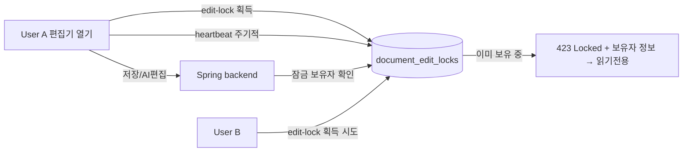
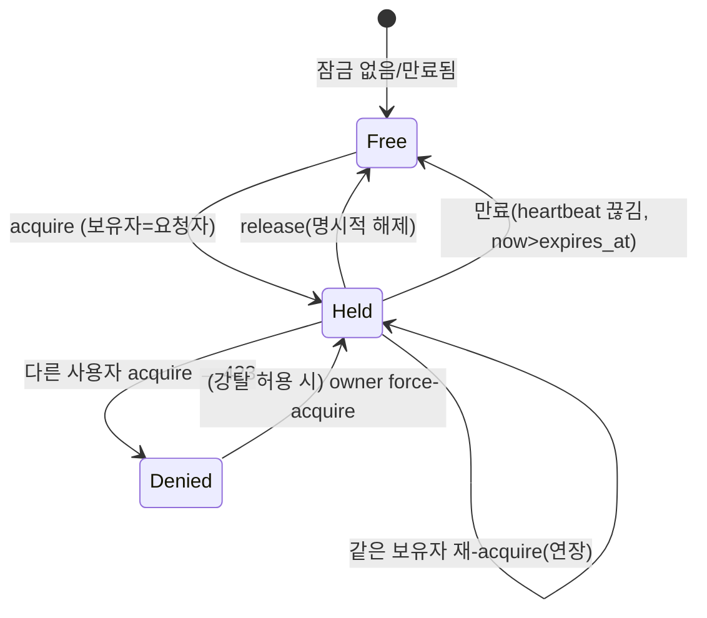
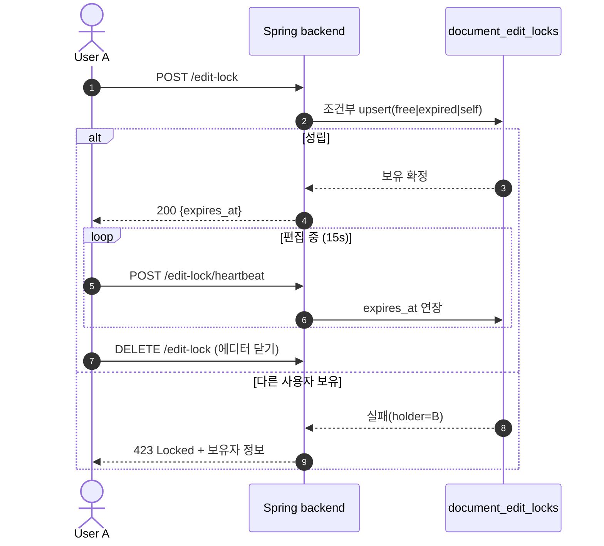

# 문서 편집 잠금(활성 편집 추적) 설계

## 1. 먼저 결론

현재는 **낙관적(optimistic) 동시성**만 있다. 아무나 편집하고 저장 시점에 `base_version` 불일치면 409로 거절한다. "지금 누가 편집 중인지"를 나타내는 상태가 **아예 없어서**, 프론트가 편집 중 여부를 알 수 없고 남의 편집을 사전에 막을 수도 없다.

이를 위해 **리스(lease) 기반 편집 잠금**을 도입한다.

- 문서당 1개의 편집 잠금을 두고, **TTL + heartbeat**로 유지한다.
- 잠금 보유자만 쓰기(저장·AI 편집·복원·재ingest)가 가능하고, 나머지는 읽기 전용이다.
- heartbeat가 끊기면 잠금은 **자동 만료**되어 다음 사람이 잡을 수 있다(탭 닫힘·브라우저 종료 대비).
- 기존 `base_version` 409는 **2차 안전망**으로 유지한다(잠금이 1차 방어).



---

## 2. 현재 상태 — 왜 편집 중인지 알 수 없나

| 후보 신호 | 실제 의미 | presence로 쓸 수 있나 |
|---|---|---|
| `DocumentEditState` | 문서의 편집 버퍼(markdown·hash). 첫 편집 때 생겨 계속 남음 | ❌ "버퍼 존재"지 "지금 편집 중"이 아님 |
| `updated_at` / `version` | 마지막 변경 시각/버전 | ❌ "언제 바뀌었나"지 "지금 편집 중"이 아님 |
| `status = processing` | 파이프라인 처리 중 | ❌ 사람 편집이 아님 |
| `DocumentDetailResponse` | 문서 상세 | ❌ 편집중·보유자 필드 없음 |

→ **활성 편집 세션 개념이 없다.** 이 기능이 그것을 새로 만드는 것이다.

## 3. 목표와 비목표

**목표**
- 한 문서를 동시에 두 사람이 편집하지 못하게 배타적으로 막는다.
- 프론트가 "userX 편집 중(읽기전용)"을 표시할 수 있게 상태를 노출한다.
- 클라이언트 비정상 종료 시 잠금이 영구 stuck 되지 않게 한다.

**비목표**
- 실시간 공동 편집(CRDT/OT) — 반대 방향이라 범위 밖.
- 블록 단위 부분 잠금 — 문서 단위로만.
- 권한(role) 모델 자체 확장 — 잠금은 "쓰기 권한이 있는 사용자들 사이의 시간적 배타성"만 다룬다.

## 4. 데이터 모델

```
document_edit_locks
  document_id        varchar  PK, FK → documents(id) ON DELETE CASCADE
  holder_user_id     varchar  NOT NULL
  acquired_at        timestamptz NOT NULL
  last_heartbeat_at  timestamptz NOT NULL
  expires_at         timestamptz NOT NULL   -- last_heartbeat_at + TTL
```

- 문서당 1행(활성 잠금 1개). 별도 테이블로 두어 `documents` row 락 경합을 피한다.
- "만료"는 별도 배치로 지우지 않고 **조회·획득 시점에 `now > expires_at`로 판정**(lazy expiry). 필요 시 청소 배치는 후순위.

## 5. 잠금 상태 흐름



## 6. API 계약

기준 경로: `/api/workspaces/{workspace_id}/documents/{document_id}`

| Method / Path | 동작 | 성공 | 실패 |
|---|---|---|---|
| `POST /edit-lock` | 잠금 획득. 비었거나 만료됐거나 **본인 보유**면 부여(+TTL). | `200` `{holder_user_id, expires_at, ttl_seconds}` | 다른 사용자 보유 중 → `423 Locked` + `{holder_user_id, holder_display_name, expires_at}` |
| `POST /edit-lock/heartbeat` | 편집 중 주기적 갱신 → `expires_at` 연장 | `200` `{expires_at}` | 보유자 아님/만료 → `409` `EDIT_LOCK_LOST` |
| `DELETE /edit-lock` | 명시적 해제 | `204` | 보유자 아니면 무시(멱등, `204`) |
| `GET /documents/{id}` (기존) | 응답에 잠금 상태 필드 추가 | `edit_lock: {holder_user_id, holder_display_name, expires_at} \| null` | — |

**획득 원자성**: 조건부 upsert(`잠금 없음 OR 만료 OR holder=요청자`일 때만 성립)로 경합을 막는다. 기존 `updateContentIfVersionMatches`와 동일한 조건부 update 패턴을 재사용한다.



## 7. 적용 지점(enforcement)과 base_version 관계

쓰기 계열은 **다른 사용자가 유효한 잠금을 보유 중일 때만** `423 DOCUMENT_EDIT_LOCKED`로 차단한다. 잠금이 없거나 만료됐거나 본인 보유면 그대로 진행한다(잠금 보유를 강제하지 않음 — 비파괴적이고 잠금 미인지 클라이언트도 동작). 즉 "A가 편집 중이면 B 차단"만 보장한다.
- `PUT /documents/{id}/content` (저장)
- `POST /agent/turn` (AI 편집)
- `POST /documents/{id}/versions/{version}/restore` (복원)
- `POST /documents/{id}/ingest` (재ingest)

읽기(`GET`)와 목록은 누구나 가능 + 잠금 상태 표시(읽기 전용 모드).

**base_version 409는 유지한다(2차 방어).** 잠금이 있어도 남는 케이스가 있다:
- AI 비동기 편집이 오래된 스냅샷을 들고 오는 경우(→ 이미 넣은 agent baseVersion 409가 처리).
- 리스 만료 후 다른 사람이 재획득한 직후의 틈새.

즉 **잠금 = 1차(진입 차단), base_version = 2차(적용 시 정합성)**.

### 7.1 다른 사용자(B)의 열람 — 읽기 O, 쓰기 X

A가 편집 중이어도 B는 문서를 **읽기 전용으로 열람**할 수 있고, 수정은 막힌다.

| B의 행동 | 결과 |
|---|---|
| `GET /documents/{id}` 열람 | ✅ 가능. 응답 `edit_lock.holder = A` → 프론트가 "A 편집 중, 읽기 전용" 표시 |
| `POST /edit-lock` 편집 진입 | ❌ `423 Locked` + 보유자(A) 정보 |
| `PUT /content` · `POST /agent/turn` 등 쓰기 | ❌ `423 DOCUMENT_EDIT_LOCKED` (다른 사용자 보유 시) |

**열람 시 보이는 내용은 "마지막으로 저장된 버전"이다.** A가 편집 중이지만 아직 저장하지 않은 편집분(EditState 버퍼)은 B에게 노출하지 않는다. 실시간으로 A의 입력을 B에게 보여주는 것은 공동 편집(CRDT/OT) 영역으로 이 설계의 범위 밖이다(§3 비목표).

- A가 저장 전 → B는 **직전 저장본**을 읽음.
- A가 저장 후 → B가 재조회하면 최신 저장본이 보임.

## 8. 만료·heartbeat 파라미터(권장 기본값)

| 항목 | 권장 | 비고 |
|---|---|---|
| TTL | 45s | `expires_at = last_heartbeat_at + TTL` |
| heartbeat 주기 | 15s | TTL의 1/3, 한두 번 놓쳐도 유지 |
| 판정 | lazy | 조회/획득 시 `now > expires_at`면 free 취급 |

## 9. 열린 결정사항 (구현 전 확정 필요)

1. **강탈(steal)**: 워크스페이스 owner가 남의 잠금을 **강제 인수**할 수 있게 할지, 만료만 기다리게 할지. → 초안: **불허(만료 대기)**, force는 후속.
2. **잠금 대상 범위**: 저장·AI편집·복원·재ingest만. rename·삭제·복제도 포함할지. → 초안: **본문 편집 계열만**, rename/삭제/복제는 제외.
3. **권한 선행성**: 현재 write는 사실상 owner 1인이다. "write 권한 사용자 여럿"의 실효는 **멤버 초대(미구현)** 가 선행돼야 한다. → 초안: **잠금 뼈대는 지금 만들되, 실효 검증은 멤버 기능 이후**.
4. **표시 정보**: 잠금 응답에 보유자 표시 이름·만료 시각까지 내릴지. → 초안: **내림**(프론트 표시용).

## 10. 단계적 구현 계획

1. **모델·마이그레이션**: `document_edit_locks` 테이블 + 엔티티/리포지토리, 조건부 upsert 쿼리.
2. **잠금 서비스·API**: acquire/heartbeat/release + 조회 노출(`DocumentDetailResponse`에 `edit_lock`).
3. **enforcement**: 쓰기 4개 경로에 보유자 검증 추가(`423`), `base_version` 409는 유지.
4. **프론트 계약 문서**: 에디터 열기→획득→heartbeat→해제 흐름, 423/409 처리. (프론트 코드는 별도)
5. (후속) 강탈·멤버 권한 연동·만료 청소 배치.

## 11. 프론트 연동 요약(계약)

- 에디터 진입 시 `POST /edit-lock`. 200이면 편집 가능, **423이면 읽기 전용** + 보유자 표시.
- 편집 중 15s마다 `POST /edit-lock/heartbeat`. `409 EDIT_LOCK_LOST` 오면 편집 중단·읽기 전용 전환.
- 에디터 종료 시 `DELETE /edit-lock`.
- 저장/AI편집이 `423 DOCUMENT_EDIT_LOCKED`면 다른 사용자가 편집 중 → 잠금 해제 대기/재획득 유도.
