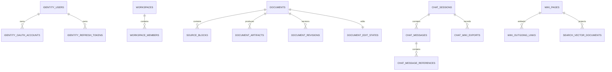

# Fruition MSA 구현·운영 계약 초안

> **이전 자료 안내 (2026-07-27)**: 이 문서는 4도메인 분할(`document-api`·`chat-api`·`wiki-api` 등)과 SQS/Redis Streams를 전제로 한 이전 계약 초안이다. 도메인 4분할은 당시 Phase 5 목표였고, 당시 기준 문서는 같은 backlog의 `Fruition_MSA_Proposal_revised.md`였다. 문서 편집용 MongoDB와 필드·상태 전이·재처리 알고리즘은 참고 자료로만 사용하고, 현재 서비스·Kafka 계약은 [Fruition AWS MSA 목표 구조](../Fruition_AWS_MSA_Architecture.md)를 따른다.

> 작성일: 2026-07-20
> 상태: Draft
> 기준: 현재 저장소의 `backend/`, `llmPipeline/`, `infra/converter/`, `frontend/`

이 문서는 당시 `Fruition_MSA_Proposal_revised.md`에서 정한 MSA 구조를 구현할 때 필요한 데이터·message·상태 전이와 장애 복구 계약을 상세히 다룬다.

상위 아키텍처의 선택 이유, 장애 전파 방지와 트래픽 대응 원칙은 제안서를 기준으로 하며, 이 문서는 다음 구현 경계를 구체화한다.

1. 현재 코드를 어떤 저장소와 실행 프로그램으로 옮기는가
2. Operation, Outbox, Queue와 worker가 어떤 상태 계약을 사용하는가
3. 권한·삭제·중복 전달·재시작 상황에서 결과를 어떻게 보호하는가

---

## 1. 현재 구현된 것

### 1.1 현재 실행 구조

현재 시스템은 도메인별 서비스가 아니라 다음 네 실행 단위로 구성되어 있다.

```text
Frontend (Next.js)
    ↓
Backend (Spring Boot)
    ├─ PostgreSQL
    ├─ MinIO/S3 호환 storage
    ├─ llmPipeline FastAPI
    └─ Converter FastAPI
```

Spring Backend와 llmPipeline이 같은 PostgreSQL의 문서·Wiki·실행 상태 데이터를 함께 읽거나 쓴다. 따라서 코드 모듈은 나뉘어 있지만 데이터 소유권과 장애 범위는 아직 MSA로 분리되지 않았다.

### 1.2 Spring Backend

| 영역 | 현재 구현 |
|---|---|
| 인증/User | 회원가입, 로그인, refresh, 로그아웃, OAuth exchange, 사용자 조회 |
| Workspace | 생성, 목록, 수정, 삭제, membership 기반 접근 검증 |
| Document | 업로드, 목록·상세·원본·block 조회, 삭제, 이름 변경, pipeline 상태·event 수신 |
| Chat | 대화 생성·목록·삭제, 메시지 조회, Chat→Wiki preview/생성 |
| Query | 동기 Query 요청, 비동기 run 요청, 진행 event callback과 SSE endpoint |
| Wiki | graph 조회, page 상세 조회, page 이름 변경 |

현재 Query 외부 API는 Workspace와 Chat 경로에서 사용자 접근을 검증하지만, llmPipeline의 `/query` 요청으로 전달되는 payload에는 `workspace_id`가 없다. Backend의 비동기 Query run과 SSE broker도 현재 process memory에 의존한다.

### 1.3 llmPipeline

현재 하나의 FastAPI application에 다음 기능이 함께 들어 있다.

| 모듈 | 구현 상태 | 현재 실행·저장 방식 |
|---|---|---|
| Query | 구현 | 질문 rewrite, BM25, BGE-M3 embedding, Wiki graph 탐색, evidence 선정, LLM 답변·평가, web fallback |
| Query event | 부분 구현 | token stream이 아니라 stage log를 HTTP callback으로 전송 |
| Wiki ingestion | 구현 | Document/Chat Markdown 입력을 읽고 Wiki 생성 pipeline 실행 |
| Wiki generation | 구현 | source/concept page 생성, 기존 Wiki 문맥 반영, 평가 loop, 의미 cluster 처리 |
| Wiki schema | 구현 | preview, draft 생성, activate, active schema 조회 |
| Wiki lint | 구현 | Workspace 단위 lint와 promotion materialization |
| Wiki embedding | 구현 | page 표현 생성, hash 비교, BGE-M3 embedding 계산과 PostgreSQL 저장 |
| Agent | 구현 | Agent turn routing과 Markdown edit use case 연결 |
| Markdown edit | application/실험 코드 구현 | Markdown 변경 생성과 출력 계약은 있으나 실제 편집 UI·저장 API는 없음 |
| Document restoration/evaluation | CLI 중심 구현 | PDF block 복원, OCR/vision 보정, 품질 평가. 서비스 API로 통합되지 않음 |

현재 구조의 핵심 제약은 다음과 같다.

- `/query` request schema에는 `workspace_id`가 없다.
- Query repository는 PostgreSQL의 모든 active Wiki page/link를 읽으며 Workspace filter를 적용하지 않는다.
- Query는 동기 HTTP 응답이고 실제 token SSE나 Redis Streams consumer가 아니다.
- Query event는 사용자 입력 callback URL 또는 환경 설정 URL로 HTTP POST한다.
- ingest는 FastAPI `BackgroundTasks`로 실행된다.
- llmPipeline이 `run_id`를 내부에서 생성하고 `pipeline_runs`를 PostgreSQL에 저장한다.
- llmPipeline이 `wiki_pages`, link, embedding table을 직접 갱신한다.
- embedding 후속 작업은 별도 worker가 아니라 process 내부 thread로 실행된다.
- Wiki 실제 원본용 NoSQL, page revision, 삭제 차단 기록, Wiki 변경을 검색 데이터에 반영하는 worker(indexer)는 없다.
- Redis와 SQS client/consumer는 llmPipeline에 구현되어 있지 않다.

즉, Query·Wiki 생성·schema·lint·embedding 같은 LLM 핵심 기능은 존재한다. 부족한 부분은 주로 기능 자체가 아니라 Workspace 격리, 데이터 소유권, 비동기 실행과 AWS 운영 경계다.

### 1.4 Converter

`infra/converter`는 다음 pipeline을 제공한다.

```text
PDF upload
  → pdfinfo / pdffonts
  → OCRmyPDF
  → MarkItDown
  → Markdown 반환
```

현재 `/convert`는 PDF만 허용한다. `requirements.txt`도 `markitdown[pdf]`만 설치한다.

- PDF→Markdown: 구현
- DOCX/PPTX/XLSX/HWP 등→Markdown: 미구현
- Markdown→PDF/DOCX/PPTX 등 export: 미구현

### 1.5 Frontend와 추가 제품 기능

| 기능 | 현재 상태 |
|---|---|
| Markdown 표시 | `react-markdown` 기반 viewer와 source preview 구현 |
| Document Markdown 편집기 | 미구현. 현재는 viewer이며 Document 편집·저장·revision 충돌 UI가 없음 |
| Document LLM 편집 Revision Log·rollback | 미구현. Document 편집 전후 snapshot, revision history, 과거 시점 복원 API가 없음 |
| Chat UI | 질문 입력, 메시지·근거·관련 Wiki 표시 구현 |
| Graph UI | Wiki graph canvas와 filter 구현 |
| 파일 upload UI | PDF, Markdown 선택 허용. 실제 변환기는 PDF만 지원 |
| STT | 미구현 |
| TTS | 미구현 |

Markdown 편집기는 화면만 추가한다고 완성되지 않는다. 사용자가 수정하는 원본은 Document이므로 문서 저장·조회 서버(document-api)에 revision 저장과 동시 저장 충돌 처리 API가 함께 필요하다. Wiki page는 사용자가 직접 수정하지 않고 Document 또는 Chat의 특정 시점 저장본으로 생성한다.

### 1.6 운영 로그·AWS 인프라

현재는 로컬 `pipeline.log`, HTTP log callback, 일부 `run_id`, Docker Compose와 개별 Dockerfile이 중심이다.

다음은 아직 구현되지 않았다.

- CloudWatch 구조화 로그·metric·alarm
- 서비스 전체를 잇는 공통 `trace_id`
- Redis Streams와 SQS 기반 실행 복구
- WAF/ALB, public/private subnet, EKS, 도메인별 DB로 구성된 AWS 3-Tier
- Pod Identity/IRSA와 서비스별 IAM 최소 권한
- Terraform 기반 IaC

이 절의 운영 로그는 서버 장애와 성능을 확인하기 위한 CloudWatch log다. 사용자가 보는 문서 편집 checkpoint와 rollback metadata는 Document RDS의 `document_revisions`, 실제 Markdown 저장본은 S3에 저장하며 서로 다른 기능이다.

---

## 2. AWS에서의 MSA 구조

이 절은 현재 미구현된 Document Markdown 편집기, Document LLM 편집 Revision Log와 rollback, STT/TTS, 다중 파일 형식 import/export, CloudWatch 관측성과 AWS 3-Tier까지 최종 제품에 존재한다고 가정한다. 현재 구현 여부는 1장에서만 구분하고, 여기서는 논리적 소유권과 웹 운영 목표 구조를 설명한다. 개발·검증 환경에서 비용을 줄이는 임시 구성과 운영 이후의 확장 방향은 목표 구조와 구분해서 적는다.

### 2.1 전체 구조

최상위 구조는 배포 프로세스가 아니라 비즈니스 도메인을 기준으로 본다.

아래에서 RDS는 일반 업무 데이터를 저장하는 관계형 DB, S3는 파일 저장소, Redis는 빠른 조회와 실시간 event를 위한 메모리 저장소다. 각 영문 이름은 실제 배포·코드에서 사용할 이름이며 앞의 한국어가 해당 프로그램의 역할이다.

```text
Fruition
├─ 로그인·Workspace 권한 영역
│  ├─ 로그인·Workspace 권한 관리 서버 (access-svc)
│  │  ├─ 로그인 처리 부분 (Identity module)
│  │  └─ Workspace 권한 관리 부분 (Workspace Access module)
│  ├─ 사용자·로그인 DB
│  ├─ Workspace·멤버 권한 DB
│  └─ 요청 권한 확인용 Redis
│
├─ 문서 영역
│  ├─ 문서 저장·조회 서버 (document-api)
│  ├─ AI 문서 편집 후보 생성 worker (markdown-edit-engine)
│  ├─ 파일 형식 변환 worker (converter-worker)
│  ├─ Document RDS: metadata·artifact·checkpoint 정보
│  ├─ Document MongoDB: 현재 본문·revision·저장 멱등성
│  └─ S3 문서 원본·고정 revision snapshot 저장소
│
├─ 채팅 영역
│  ├─ 채팅 저장·실시간 전송 서버 (chat-api)
│  ├─ Wiki 검색·LLM 답변 생성 worker (query-engine)
│  ├─ 음성 인식·음성 생성 worker (speech-worker)
│  ├─ 채팅 DB: 초기에는 하나, 필요할 때 분할
│  ├─ 답변 작업·실시간 token용 Redis
│  └─ S3 음성 파일 저장소
│
└─ Wiki 영역
   ├─ Wiki 요청·조회 서버 (wiki-api)
   ├─ Wiki page 생성·저장 worker (wiki-generation-worker)
   ├─ Wiki Lint·저장 worker (lint-worker)
   ├─ Wiki를 검색 데이터로 변환하는 worker (indexer)
   ├─ Wiki 원본 MongoDB: 초기에는 하나, 필요할 때 분할
   ├─ 키워드·의미 검색 저장소: 초기에는 하나, 필요할 때 분할
   └─ S3 입력 목록·결과 manifest 저장소
```

이름에 `worker`나 `engine`이 붙은 프로그램은 사용자 요청을 직접 받는 별도 제품 영역이 아니다. 채팅·문서·Wiki 영역 안에서 계산이 필요할 때 실행되며, 작업량에 따라 서버 수만 따로 늘릴 수 있는 프로그램이다.

웹 운영 목표 구조에서는 로그인·Workspace, 문서 metadata, 채팅의 장애와 connection 사용량을 서로 격리하기 위해 `Access/Workspace RDS`, `Document RDS`, `Chat RDS`를 물리적으로 나눈다. 문서의 현재 Markdown과 편집 revision은 Document MongoDB가 함께 소유한다. 이는 Workspace마다 DB를 하나씩 만든다는 뜻이 아니라 각 기능 영역이 모든 Workspace를 `workspace_id`로 구분해 저장소를 공유한다는 뜻이다. 개발·검증 환경에서는 비용을 줄이기 위해 PostgreSQL 서버 하나의 schema와 접속 계정만 나눠 사용할 수 있지만, 운영 구조도에는 이 임시 구성이 아니라 영역별 RDS를 표시한다. Document MongoDB와 Wiki MongoDB는 같은 관리형 cluster로 시작할 수 있어도 database·계정·collection과 write 권한을 분리한다. 답변용 Redis와 검색 저장소도 각각 하나로 시작하고 권한 확인용 Redis만 다른 Redis와 분리한다. 권한 정보가 답변 token 같은 임시 데이터 때문에 메모리에서 밀려나면 모든 기능의 접근 판단에 문제가 생기기 때문이다.

웹 SaaS 배포에서는 Ollama나 GPU 기반 SLLM 추론 서버를 직접 운영하지 않는다. Query·Wiki 생성·문서 복원처럼 LLM이 필요한 프로그램은 공통 inference adapter를 통해 Amazon Bedrock 또는 승인된 외부 LLM API를 호출한다. 문서 복원은 OCR과 규칙 기반 처리를 먼저 적용하고, 코드만으로 복원하거나 검증하지 못한 block에만 관리형 LLM을 호출해 사용량을 제한한다.

현재 `qwen2.5:7b`, `qwen2.5vl:7b`와 Ollama를 사용하는 로컬 SLLM 경로는 삭제하지 않지만 웹 AWS 배포 범위에는 포함하지 않는다. 이 경로는 향후 원문 외부 전송이 제한되는 Desktop 또는 On-premise 상품을 검토할 때 별도 배포 옵션으로 사용한다. 따라서 로컬 SLLM과 관리형 LLM의 모델이 같거나 결과가 동일하다고 가정하지 않으며, provider를 바꿀 때는 같은 평가 문서로 복원 품질과 문서당 비용을 다시 측정한다.

#### 이 도메인과 실행 프로그램 경계를 선택한 이유

현재 Backend 하나가 로그인, Workspace, 문서, 채팅과 Wiki 연결을 모두 담당하면 이 서버나 DB 하나의 장애가 전체 기능을 멈출 수 있다.

로그인과 Workspace 권한 관리는 초기에는 서버 하나에 둔다. 처음에는 Workspace를 별도 서버로 나누는 방안도 고려했지만, 현재 프로젝트가 `workspace_id`로 접근을 검증하고 있어 문서·채팅·Wiki 요청마다 Workspace DB의 존재 여부를 조회해야 했다. 이 구조에서는 해당 DB가 모든 read를 감당해야 하고, 로그인·권한 서버나 Workspace DB가 전체 기능의 병목과 단일 장애점이 될 수 있다.

그래서 문서·채팅·Wiki 요청이 로그인 서버를 거치지 않도록 JWT에는 `user_id`와 만료 시각처럼 자주 바뀌지 않는 정보만 담는다. Workspace ID는 요청 주소에서 받고 각 API가 권한 Redis의 현재 Workspace 상태와 사용자 역할을 확인한다. Workspace 권한 변경·삭제는 Redis에 반영된 뒤에만 성공으로 응답하므로 성공 응답 이후의 기능 요청은 이전 권한을 사용하지 않는다. 이 구조에서는 로그인 서버가 멈춰도 기존 JWT와 권한 Redis가 살아 있으면 기존 사용자가 기능을 계속 사용할 수 있다.

문서 서버와 채팅 서버는 분리하여 무거운 파일 변환이 실시간 대화를 느리게 만들지 않게 한다. 음성·파일 변환도 worker로 떼어 CPU 사용량이나 외부 서비스 장애가 API 서버를 직접 멈추지 않게 한다. 채팅 저장과 답변 생성 역시 프로그램을 나눠 질문이 많아질 때 LLM worker만 늘릴 수 있게 한다.

Wiki는 실제 원본 저장소와 검색용 복사본을 분리한다. 검색 부하를 원본 저장과 분리할 수 있고, Wiki 원본 저장에 장애가 생겨도 이미 만들어진 검색 데이터로 기존 검색을 유지할 수 있기 때문이다.

답변 생성 worker와 음성 worker는 채팅 서버와 별도 프로그램으로 실행하지만 모두 채팅 기능에 속한다. 파일 변환·AI 편집 worker는 문서 기능, Wiki 생성·검색 데이터 갱신 worker는 Wiki 기능에 속한다.

로그인과 Workspace 권한 관리는 담당 데이터가 다르지만 초기에는 로그인·권한 서버 하나로 실행한다. 두 기능의 사용량이나 장애 특성이 실제로 달라질 때만 서버를 나눈다. 이 구분을 통해 각 기능이 왜 특정 DB와 Queue를 사용하는지, 누가 결과를 저장하는지와 장애 범위를 함께 설명할 수 있다.

#### 기존 기능을 이 경계로 이동하는 이유

현재 LLM 프로그램에는 답변 생성, Wiki 생성, schema, Lint, embedding 로직이 이미 있다. MSA 전환의 목적은 이 기능을 새로 만드는 것이 아니라 실행 위치와 데이터 저장 책임을 나누는 것이다.

- 기존 OpenAI-compatible LLM client → provider별 차이를 감추는 공통 inference adapter. 웹 배포는 관리형 LLM을 사용하고 로컬 Ollama 경로는 Desktop·On-premise 범위로 분리
- 기존 답변 생성 코드 → 채팅 영역의 답변 생성 worker(query-engine)
- 기존 AI Markdown 편집 코드 → 문서 영역의 AI 편집 worker(markdown-edit-engine)
- 기존 Wiki 생성 코드 → Wiki 영역의 Wiki 생성 worker(wiki-generation-worker)
- 기존 embedding 코드 → Wiki를 검색 데이터로 바꾸는 worker(indexer)
- 기존 Wiki schema 요청 코드 → Wiki 요청·조회 서버(wiki-api)
- 기존 Wiki 저장 규칙 코드 → Wiki 생성 worker와 Lint worker가 함께 쓰는 공통 Wiki 저장 모듈
- 기존 문서 복원·평가 코드 → 문서 영역의 파일 변환 과정

현재 Chat Wiki화와 Document Wiki화는 서로 다른 HTTP API로 시작하지만 내부에서는 `PipelineRunCommand`와 생성·저장 핵심 로직을 함께 사용한다. MSA로 옮긴 뒤에도 입력을 해석하는 부분만 Document revision·Chat `full`·Chat `partial`로 나눈다. page·link 생성과 Wiki 원본 저장은 하나의 내부 pipeline을 사용하여 같은 기능을 두 번 구현하거나 서로 다른 link 저장 규칙을 만들지 않는다.

먼저 어떤 서비스가 어떤 데이터를 최종 저장하는지와 서비스 간 message 형식을 분리한다. 그다음 기존 기능 로직을 새 서비스 경계로 옮기는 방식이 가장 적은 변경으로 목표 구조에 도달한다.

### 2.2 어떤 프로그램이 어떤 데이터를 저장하는가

| 영역 | 하는 일 | 저장 위치 | 실제로 저장하는 프로그램 |
|---|---|---|---|
| 로그인 | 회원가입·로그인, OAuth, JWT 발급·갱신 | 사용자·로그인 DB | 로그인·권한 관리 서버(access-svc)의 로그인 처리 부분 |
| Workspace 권한 | Workspace, 멤버, 역할, 삭제 상태와 빠른 권한 확인 데이터 관리 | Workspace DB, 권한 확인용 Redis | 로그인·권한 관리 서버(access-svc)의 Workspace 처리 부분 |
| 문서 | 사용자 원본 Markdown, revision, 수동·AI 편집, rollback, 파일 가져오기·내보내기 | Document MongoDB, Document RDS, S3 | 문서 저장 서버(document-api). AI 편집 worker는 변경 후보만 만듦 |
| 채팅 | 대화, 답변 생성 상태, 답변 근거, 실시간 전송, 음성 파일 | 채팅 DB, Redis, S3 | 채팅 서버(chat-api) |
| Wiki | 생성된 읽기 전용 page, Lint 갱신, page 사이 link, 검색 데이터 | MongoDB, 검색 저장소, S3 | Wiki 요청·조회 서버(wiki-api)가 작업을 접수하고, Wiki 생성·Lint worker가 MongoDB에 저장. 검색 데이터는 indexer가 갱신 |

“worker는 DB에 저장하면 안 된다”는 규칙을 두지 않는다. 현재 기능의 저장 책임을 기준으로 한다. 문서·채팅 기능은 document-api와 chat-api가 저장 규칙을 가지므로 변환·음성·AI 편집·답변 생성 worker가 결과를 돌려주고 담당 API가 DB에 저장한다. 반면 Wiki 생성·Lint 기능은 Python 처리 흐름이 생성과 저장을 함께 책임지므로 worker가 Wiki MongoDB까지 저장한다.

**각 프로그램은 다른 기능 영역의 DB를 직접 수정하지 않는다.** `wiki-api`, Wiki 생성 worker와 Lint worker는 같은 Wiki 저장 모듈을 공유해 권한·Operation 상태·revision·중복 방지·MongoDB transaction 규칙이 흩어지지 않게 한다. 초기에는 모든 Workspace가 기능별 기본 schema 또는 저장소를 공유한다. 처리량·용량·장애 범위가 실제 한계를 넘을 때만 `workspace_id`를 routing key로 여러 shard에 분배한다.

사용자·로그인 DB는 처음부터 여러 개로 나누지 않는다. email과 OAuth 계정의 중복을 막고 계정 상태와 refresh token을 DB transaction으로 함께 저장한다. 여기서 transaction은 관련 저장이 모두 성공하거나 모두 취소되는 한 번의 DB 작업을 뜻한다. 로그인 요청이 많아지면 API 서버 수와 DB index부터 조정하고 실제 DB 쓰기 한계가 확인될 때만 분할한다.

Workspace 권한 DB도 처음부터 여러 개로 나누지 않는다. Workspace 생성·삭제와 멤버·역할 변경은 일반 기능 요청보다 적고 즉시 정확하게 반영하는 것이 중요하다. 일반 문서·채팅·Wiki 요청은 매번 Workspace DB나 로그인·권한 관리 서버를 호출하지 않는다. 대신 요청 권한 확인용 Redis에서 현재 Workspace 상태와 사용자 역할을 한 번 확인한다. 권한의 실제 원본은 Workspace DB에 있으며 Redis 데이터가 사라지면 원본에서 다시 만든다.

| 저장소 | 웹 운영 목표 구성 | 논리 격리 키 | 확장 시 분할 기준 | 소유 데이터 |
|---|---|---|---|---|
| 사용자·로그인 DB | Access/Workspace RDS Multi-AZ의 Identity schema | `user_id` | 사용자 ID 기반 shard routing | 사용자, OAuth 계정, refresh token |
| Workspace DB | Access/Workspace RDS Multi-AZ의 Workspace schema | `workspace_id` | `workspace_id` 기반 shard routing | Workspace, 멤버, 삭제 상태, Outbox message |
| 권한 확인용 Redis | 권한 전용 Redis 하나 | `workspace_id`, `(workspace_id, user_id)` | 필요할 때 Workspace 단위 partition | 접근 확인용 Workspace 상태와 사용자 역할 복사본 |
| Document RDS | RDS Multi-AZ | `workspace_id` | `workspace_id` 기반 shard routing | 문서 metadata·상태, 조회용 revision projection, checkpoint·파일 정보, 관계형 Operation·Outbox |
| Document MongoDB | MongoDB replica set 하나 | `workspace_id` | `workspace_id` 기반 shard routing | 현재 Markdown, 편집 revision·content hash, 저장 멱등성, edit event/outbox |
| 채팅 DB | Chat RDS Multi-AZ | `workspace_id` | `workspace_id` 기반 shard routing | 대화, message, 답변 근거, Outbox message |
| Wiki MongoDB | MongoDB 하나 | `workspace_id` | `workspace_id` 기반 shard routing | Wiki page, 생성·Lint Operation, Workspace 삭제 차단 기록 |
| 키워드·의미 검색 저장소 | 검색 cluster 하나 | `workspace_id` | Workspace routing 또는 partition | Wiki 검색·graph 파생 데이터 |
| 답변 작업용 Redis | 답변 작업용 Redis 하나 | `workspace_id`, `request_id` | 필요할 때 Workspace 단위 partition | 답변 생성 요청, 요청별 token·진행 event, Chat RDS 저장 전 완료 결과의 임시 전달 데이터 |

문서·채팅·Wiki 데이터는 처음부터 모든 row·document·message에 검증된 `workspace_id`를 넣고 같은 값을 조회 조건으로 사용해 논리적으로 격리한다. 물리 DB를 기능별로 나눈 뒤에도 각 RDS는 여러 Workspace를 함께 저장하며, Workspace마다 DB를 만들지 않는다.

저장소의 처리량·용량·장애 범위가 실제 한계를 넘을 때만 `workspace_id`를 routing key로 사용해 여러 Workspace를 shard에 분배한다. 이는 Workspace마다 DB 하나를 만든다는 뜻이 아니다. 물리적으로 분할한 뒤에도 각 shard 안의 모든 조회는 `workspace_id`를 조건으로 사용한다. 분할 전에는 사용하지 않는 shard mapping과 데이터 이동 기능을 미리 구현하지 않는다.

### 2.3 현재 DB table을 새 저장소로 나누기

이 절은 현재 DB table을 어느 저장소로 옮길지 정리한 구현용 표다. 전체 흐름만 이해하려면 표를 건너뛰어도 된다. 서비스 분리 후에는 다른 기능의 DB table을 FK로 직접 연결하지 않고 ID만 저장한다.

| 현재 테이블 | 목표 도메인·저장소 | 처리 | 변경 내용 |
|---|---|---|---|
| `users` | Access/Workspace RDS의 Identity schema | 이동 | Identity의 사용자 원본 |
| `user_oauth_accounts` | Access/Workspace RDS의 Identity schema | 이동 | `users`와 같은 schema에서 FK 유지 |
| `user_refresh_tokens` | Access/Workspace RDS의 Identity schema | 이동 | `users`와 같은 schema에서 FK 유지 |
| `workspaces` | Access/Workspace RDS의 Workspace schema | 이동·확장 | Workspace 상태의 원본. 삭제 상태 version, 도메인별 처리 완료 여부와 삭제 시각을 함께 저장 |
| `workspace_members` | Access/Workspace RDS의 Workspace schema | 이동·확장 | `workspaces` FK는 유지하고 `user_id`는 외부 ID로 변경. role·상태 변경마다 증가하는 `membership_version`을 함께 소유 |
| `documents` | Document RDS | 이동·정리 | `workspace_id`, `user_id` FK 제거. 제목·폴더·최종 `status`는 유지하고 현재 본문·편집 revision·content hash의 원본 책임은 제거. 목록 조회용 `projected_edit_revision`·`projected_edited_at`만 선택적으로 유지 |
| `document_edit_states` | Document MongoDB `document_edit_states` | 이동·형태 변경 | 현재 Markdown과 revision·content hash를 한 document에 저장. `(workspace_id, document_id)` 범위에서 조건부 갱신 |
| `source_blocks` | S3 snapshot 또는 Document MongoDB의 editor 구조 | 이동·정리 | 편집 원본의 일부라면 같은 MongoDB document에 두고, import 원본·고정 snapshot용 대용량 block은 S3에 둔다. RDS에 본문을 중복 저장하지 않음 |
| `document_processing_queue` | SQS | 제거 | DB Queue를 `convert-queue`, `ingest-queue`로 대체 |
| `wiki_pages` | Wiki MongoDB | 형태 변경 | page JSON과 `revision`, 삭제 차단 기록, `embedding_source`로 전환 |
| `wiki_page_links` | Wiki MongoDB | 형태 변경 | Wiki 생성·Lint가 명시적으로 만든 원본 link만 각 page의 `outgoing_links`에 포함. Category 공유·공통 Concept·embedding으로 계산하는 `source_related_to`와 이 page를 가리키는 incoming link는 원본에 저장하지 않고 검색용 복사본에서 제한된 Top-K로 계산 |
| `document_wiki_links` | Wiki source page의 변경 출처 정보 | 형태 변경 | `page_type=source`인 page만 source Document/Chat ID, 최초 ingest revision과 현재 Ingest가 반영한 revision·content hash를 보유. Concept page의 근거 관계는 source page의 link와 검색용 복사본으로 계산 |
| `wiki_page_embeddings` | Search/Vector | 이동·통합 | page vector 검색용 복사본 |
| `wiki_embedding_vectors` | Search/Vector | 이동·통합 | vector 중복 계산 방지와 모델별 검색용 복사본 |
| `wiki_embedding_units` | Search/Vector | 이동·통합 | page/section/block 단위 vector와 source reference |
| `chat_sessions` | Chat RDS | 이동·정리 | `workspace_id`, `user_id`, `wiki_page_id` FK 제거. 완료된 Chat→Wiki 생성의 대표 `root_page_id`만 논리 참조 |
| `chat_messages` | Chat RDS | 이동·확장 | `chat_sessions` FK 유지. Wiki page FK는 제거. assistant generation 상태와 optional STT/TTS audio metadata를 함께 소유 |
| `chat_message_references` | Chat RDS | 이동·통합 | `reference_type`을 `evidence` 또는 `related`로 구분해 답변 당시 근거와 관련 page snapshot을 함께 저장. 외부 ID FK는 제거 |
| `chat_message_related_pages` | `chat_message_references` | 제거·통합 | 별도 table 대신 reference type으로 구분 |
| `chat_partial_wiki` | Chat RDS | 형태 변경 | 완료된 Chat→Wiki 관계만 저장. Document FK와 실행 상태는 저장하지 않음 |
| `pipeline_runs` | 업무 상태 데이터와 필요한 장시간 Operation으로 대체 | 제거·분리 | 범용 기술 실행 상태는 제거한다. Chat은 message, Workspace는 workspace row, Wiki 생성·Lint만 별도 Operation으로 상태를 저장하고 내부 stage log는 CloudWatch에 기록한다. |

현재 LLM 프로그램이 별도로 만드는 `wiki_schemas`도 Wiki 영역으로 이동한다. `wiki-api`가 schema 조회·변경 요청을 담당하고 Wiki 생성·Lint worker가 고정된 schema version을 사용한다.

#### 미구현 기능을 포함한 신규 저장 구조

최종 기능을 기준으로 다음 table/collection만 추가한다. 기존 업무 데이터만 보고 판단할 수 있는 상태는 새 table을 만들지 않는다. 별도의 장시간 Operation이 필요하거나 다른 원본에서 복원할 수 없는 업무 데이터만 저장한다.

| 새 table/collection | 담당 영역 | 저장하는 서버 | 역할 |
|---|---|---|---|
| `workspace_lifecycle_tombstones` | Document·Chat·Wiki | 각 소유 API | Workspace 삭제 상태 event를 받아 저장한 최소 차단 기록. membership 복제에는 사용하지 않음 |
| `document_edit_writes` | 문서 | 문서 저장 서버 | `(document_id, revision_write_id)` unique 기록, 요청 content hash와 성공 revision을 보관해 중복 자동저장 방지 |
| `document_edit_outbox_events` | 문서 | 문서 저장 서버 | 본문 갱신과 같은 MongoDB transaction에 저장하는 revision projection 갱신 event. 발행 성공 후 삭제 |
| `document_revisions` | 문서 | 문서 저장 서버 | 사용자가 고정한 버전, AI 편집·rollback·Wiki ingest·export checkpoint의 revision·content hash·S3 저장본 위치 |
| `wiki_ingestion_operations` | Wiki | `wiki-api`와 Wiki 생성 worker | API가 작업을 접수하고 worker가 진행·성공·실패 상태와 page를 함께 저장 |
| `wiki_lint_operations` | Wiki | `wiki-api`와 Lint worker | API가 작업을 접수하고 worker가 진행 상태·재시작 위치와 page 갱신을 저장 |
| `outbox_events` | 각 관계형 DB 영역 | 각 담당 API | 업무 상태와 함께 저장하는 미발행 message. Queue 전송 성공 후 삭제하며 별도 중앙 Outbox DB는 사용하지 않음 |
| `wiki_outbox_events` | Wiki | `wiki-api` | Wiki Operation과 같은 MongoDB transaction에 저장하는 미발행 command. SQS 전송 성공 후 삭제 |
| `document_artifacts` | 문서 | 문서 저장 서버 | 업로드 원본, 편집기 이미지·첨부 파일과 보존할 변환 결과의 형식·S3 위치·연결 revision·상태 |

파일 변환·음성·AI 편집·답변 생성 worker는 결과를 문서 또는 채팅 서버에 돌려주고, 담당 API가 DB에 저장한다. Wiki 생성·Lint worker는 Wiki 영역의 공통 저장 모듈으로 권한과 작업 상태를 확인한 뒤 Wiki MongoDB에 직접 저장한다. 어떤 worker도 다른 기능 영역의 DB는 직접 수정하지 않는다.

같은 사용자 요청의 상태를 여러 도메인에 복제하지 않는다.

- Document 또는 Chat source의 Wiki 생성·갱신 상태는 `wiki_ingestion_operations` 하나에만 저장한다. Document와 Chat은 수정되지 않는 revision·snapshot 저장본을 제공한다. 같은 source라도 더 최신 버전을 명시적으로 ingest하면 기존 Source·Concept page에 변경 내용을 반영하고, 같은 버전의 재요청은 기존 결과를 반환한다.
- Query 생성 상태는 assistant placeholder를 포함한 `chat_messages`가 소유한다. 별도 `query_requests`를 만들지 않는다.
- Workspace 삭제 상태와 도메인별 처리 완료 여부는 `workspaces`에 직접 저장한다. Workspace ID를 재사용하지 않으므로 별도 삭제 이력 데이터를 기본으로 만들지 않는다.
- Wiki 검색 데이터가 최신인지는 검색 저장소의 `page_revision`과 검색 데이터 갱신 worker의 지연 시간으로 확인한다. 이 상태를 Wiki 원본 DB에 중복 저장하지 않는다.

장시간 Operation의 `status`는 API 동작과 상태 전이를 결정한다. `phase`는 사용자에게 중간 처리 위치를 실제로 제공할 때만 선택적으로 저장한다.

```text
status: accepted | processing | succeeded | retry_wait | cancel_requested | cancelled | failed
optional phase: queued | converting | generating | applying | indexing
```

`phase`를 사용하더라도 성공·실패 상태와 섞지 않는다. 함수 진입, LLM 평가 loop, worker thread 시작 같은 기술 실행 기록은 Operation에 저장하지 않고 CloudWatch에 기록한다.

최소 필드는 다음과 같다. 실제 이름과 추가 index는 저장소를 확정할 때 결정한다.

```text
document_edit_states
├─ document_id, workspace_id, markdown, revision, content_hash
├─ schema_version, workspace_lifecycle_version
├─ document_lifecycle_version, document_status
└─ updated_by, updated_at

document_edit_writes
├─ document_id, revision_write_id UNIQUE, base_revision, result_revision
├─ request_content_hash
└─ actor_user_id, created_at

document_edit_outbox_events
├─ event_id UNIQUE, document_id, workspace_id, revision, content_hash
├─ claimed_by, claim_expires_at, publish_attempt, last_error
└─ created_at, updated_at

wiki_ingestion_operations
├─ id, workspace_id, source_type, source_id, source_version, source_content_hash
├─ snapshot_uri, workspace_lifecycle_version, message_schema_version, origin_trace_id
├─ actor_user_id, required_permission, membership_version_at_accept
├─ status, idempotency_key, result_manifest_uri
├─ command_event_id, dispatch_attempt, dispatched_at, sqs_message_id
├─ attempt, execution_token, heartbeat_at, lease_expires_at
├─ cancel_requested_at, error_code
└─ created_at, updated_at

wiki_lint_operations
├─ id, workspace_id, status, idempotency_key
├─ actor_user_id, required_permission, membership_version_at_accept
├─ input_manifest_uri, input_manifest_hash, workspace_lifecycle_version, message_schema_version, origin_trace_id
├─ command_event_id, dispatch_attempt, dispatched_at, sqs_message_id
├─ checkpoint, cancel_requested_at
├─ attempt, execution_token, heartbeat_at, lease_expires_at
└─ created_at, updated_at

outbox_events
├─ event_id UNIQUE, aggregate_type, aggregate_id, event_type
├─ payload
└─ created_at

wiki_outbox_events
├─ event_id UNIQUE, operation_id, command_type, message_schema_version
├─ payload, payload_hash
├─ claimed_by, claim_expires_at, publish_attempt, last_error
└─ created_at, updated_at

workspaces 삭제 필드
├─ status, lifecycle_version, deletion_requested_at
├─ deletion_acks
└─ deleted_at, purged_at

workspace_lifecycle_tombstones
├─ workspace_id UNIQUE, lifecycle_version, status
└─ updated_at
```

저장 기간도 업무 목적에 맞게 제한한다.

- 발행 성공한 Outbox row 또는 document는 삭제한다. Outbox를 event history나 감사 log로 사용하지 않는다.
- `document_edit_writes`는 client 재시도와 응답 유실을 흡수하는 기간만 유지한다. 보존 기간이 지난 write ID를 감사 이력으로 사용하지 않으며, 장기 편집 이력은 고정 snapshot과 `document_revisions`로 제공한다.
- `wiki_ingestion_operations`와 `wiki_lint_operations`는 `succeeded`·`failed`·`cancelled` 같은 최종 상태가 된 뒤 사용자 조회와 재시도에 필요한 기간만 유지하고 TTL로 제거한다. 중복 생성은 Operation을 오래 보관해서 막지 않는다. Wiki page의 변경 출처 정보에 둔 중복 금지 조건으로 막는다.
- generation·Lint result manifest와 보존하지 않는 Document export artifact는 운영 분석·재개 또는 다운로드에 필요한 기간 이후 S3 lifecycle로 제거한다.
- `workspace_lifecycle_tombstones`는 Workspace가 삭제됐음을 나타내는 매우 작은 접근 차단 기록이다. 오래된 Queue·DLQ event가 나중에 다시 실행되는 것을 막기 위해 삭제하지 않으며 Workspace ID도 재사용하지 않는다.
- Document revision과 Chat message처럼 사용자가 조회하거나 rollback하는 업무 데이터는 제품의 보존 정책을 따른다.

분리 후의 관계는 다음과 같다.



이 다이어그램의 도메인 간 ID는 관계를 설명하기 위한 논리 참조다. 실제 DB FK는 같은 도메인 안에서만 유지한다.

#### Chat→Wiki 관련 ERD 변경

현재 DB 구조는 Chat→Wiki 생성용 대화 저장본을 임시 Document처럼 만든다. 목표 구조에서는 채팅 서버가 대화 저장본을 직접 만들어 Wiki 영역에 전달하므로 중간 Document row가 필요하지 않다.

```text
현재
chat_sessions/chat_partial_wiki
  → documents
  → pipeline_runs
  → wiki_pages

목표
사용자 → 채팅 서버: Wiki로 만들 대화 범위 선택
  → 채팅 서버: 선택한 대화를 S3에 덮어쓰기 없이 저장
  → Wiki 요청·조회 서버: full이면 기존 대화 source용, partial이면 별도 source용 작업 생성
  → Wiki 생성 worker: Document Wiki화와 같은 로직으로 page·link를 만들고 Wiki MongoDB에 저장
  → 채팅 DB: 완료된 Wiki 생성 ID와 대표 source page ID만 연결
```

채팅 DB에는 Wiki 생성의 세부 실행 과정이 아니라 어떤 Chat에서 어떤 Wiki 생성이 완료됐는지만 남긴다.

```text
chat_wiki_exports
├─ id
├─ chat_session_id       FK, 채팅 DB 내부
├─ source_snapshot_id
├─ selection_mode        full | partial
├─ source_message_refs
├─ ingestion_key         외부 논리 ID, FK 없음
├─ root_page_id          생성 page 집합의 대표 source page ID, FK 없음
└─ created_at
```

`full`·`partial` export는 Chat 내용을 Wiki로 만드는 기능이다. `full`은 대화 전체를 하나의 계속 이어지는 source로 사용하고, `partial`은 선택한 message 묶음을 별도 source로 만든다. 두 방식 모두 같은 Wiki 생성·저장 로직을 사용한다. 완료되면 채팅 DB에는 Wiki 생성 ID와 대표 source page ID만 연결하고, 생성된 Wiki 본문과 concept page 목록은 Wiki 저장소에서 관리한다.

#### 저장 원본과 물리 저장소를 이렇게 나눈 이유

같은 원본을 여러 DB에 반복 저장하면 어느 값이 진짜인지 판단하기 어려워진다. 사용자·Workspace·채팅·Wiki는 각 담당 DB 한곳에 원본을 두고, 문서는 관계형 metadata와 편집 원본의 소유권을 명시적으로 나눈다. 현재 Markdown·revision·content hash는 Document MongoDB가 함께 소유하며 Document RDS의 revision은 조회용 projection일 뿐 충돌 판정에 사용하지 않는다. 여러 DB를 한 번에 저장하려 하지 않고, 한 저장소 안에서 반드시 같이 바뀌어야 하는 데이터만 묶어서 저장한다. 답변 생성·Lint·embedding처럼 무거운 계산은 원본 DB 저장과 분리한다.

| 즉시 정확하게 함께 저장해야 하는 범위 | 처리 방식 |
|---|---|
| 로그인과 token 상태 | 사용자·로그인 DB에 함께 저장 |
| Workspace 삭제·멤버·역할 | Workspace DB에 상태와 미발행 event를 함께 저장한 뒤 권한 Redis 갱신 |
| Document/Chat→Wiki 생성 요청 | Wiki DB에 생성 작업 상태와 원본 revision 저장 |
| Chat message와 최종 답변 | 채팅 DB에 message와 답변 상태를 함께 저장하고 채팅 서버만 수정 |
| STT/TTS 음성 파일 정보 | 채팅 DB에 저장하고 채팅 서버만 수정 |
| Wiki ingest 결과 반영 | `wiki_ingestion_operations`의 중복 방지 key, source revision과 변경 출처 정보의 중복 금지 조건 |
| Wiki page와 outgoing link | MongoDB document 하나에 함께 저장하고 revision 확인 |
| Document Markdown 수동·AI 편집 | MongoDB의 현재 revision이 같을 때만 본문·content hash·revision·write 기록을 transaction으로 저장 |

서로 다른 DB를 하나의 저장처럼 동시에 commit하려는 복잡한 방식은 사용하지 않는다. 각 기능은 자신이 담당하는 원본만 저장하고, 다른 기능의 사용자나 Workspace는 FK로 연결하지 않고 ID로만 참조한다. Workspace 멤버와 사용자 profile도 다른 DB에 반복 저장하지 않으며 빠른 권한 확인에 필요한 최소 값만 Redis에 복사한다.

이 소유권을 지키기 위해 각 API와 worker에는 자신이 담당하는 DB에만 접속할 수 있는 계정을 부여한다. DB 복제와 장애 전환은 애플리케이션에서 다시 구현하지 않고 AWS RDS와 MongoDB가 제공하는 기능을 사용한다.

웹 운영 목표 구조에서는 Access/Workspace, Document metadata, Chat이 각각 RDS Multi-AZ를 소유하고 Document 편집과 Wiki는 분리된 MongoDB database를 소유한다. 한 기능의 connection 고갈, 느린 query나 장애가 다른 기능의 저장까지 멈추게 하지 않고, 배포·권한·백업·확장 책임을 데이터 소유권과 맞추기 위해서다. 개발·검증 환경에서는 사용량이 적을 때 PostgreSQL 서버 하나의 schema와 접속 계정을 나눠 비용을 줄일 수 있지만 이를 운영 목표 구조로 보지는 않는다. Document와 Wiki MongoDB는 비용 절감을 위해 같은 cluster를 사용할 수 있지만 계정과 write 권한은 분리한다. 답변용 Redis·검색 저장소는 각각 하나로 시작하고 권한 Redis만 다른 Redis와 처음부터 분리한다.

이미 영역별로 나눈 DB와 Redis를 여러 shard나 partition으로 더 나누는 작업은 다음 문제가 실제로 지속될 때 도입한다.

| 저장소 | 확장 판단 신호 |
|---|---|
| 영역별 PostgreSQL | 한 영역의 저장 속도가 계속 느리거나 DB connection·IOPS 한계에 가까워짐 |
| Document MongoDB | 자동저장 지연·충돌 외 실패율, working set, 저장 공간 또는 복구 시간이 목표를 넘음 |
| Wiki MongoDB | Wiki 데이터가 메모리·저장 공간 한계에 가까워지거나 저장 속도와 복구 시간이 목표를 넘음 |
| 답변용 Redis | 메모리 사용량, Stream 처리 지연 또는 장애 영향 범위가 목표를 넘음 |
| 검색 저장소 | 검색 데이터 크기, 검색 응답 시간 또는 전체 재구축 시간이 목표를 넘음 |

영역별 RDS 안에서는 모든 Workspace를 기본 저장소 하나에 함께 둔다. 특정 영역의 RDS를 여러 shard로 더 나누기 전에는 Workspace별 저장 위치나 데이터 이동 기능을 만들지 않는다. 실제 분할을 준비할 때만 `workspace_id` 기반 routing과 이동 절차를 추가한다.

### 2.4 AWS 3-Tier 배치

인터넷의 application API 요청은 WAF와 ALB를 통과하며 실제 API 서버와 worker는 private network에 둔다. ALB는 로그인과 Workspace 관리 요청을 `access-svc`로 보내고 문서·채팅·Wiki 요청은 각 담당 서버로 바로 보낸다. 따라서 로그인·권한 서버는 모든 기능 요청이 거쳐 가는 중계 서버가 아니다. Signed URL을 발급받은 browser와 S3 사이의 파일 전송은 이 경로와 다른 data path다.
회원가입·로그인·JWT 갱신 외의 기능을 사용하려면 먼저 발급받은 JWT를 요청에 포함해야 하며, 각 API는 JWT를 직접 검증한 뒤 권한 확인용 Redis에서 Workspace 상태와 멤버 권한을 한 번 확인한다.

서버끼리 같은 요청을 이어서 처리할 때는 첫 서버가 확인한 사용자·Workspace·권한 정보를 짧게 유효한 내부 서명 값으로 전달한다. 이 방식으로 같은 요청 안에서 Redis를 반복 조회하지 않도록 한다.
Worker와 답변 생성 프로그램은 인터넷에 노출하지 않고, 권한을 확인한 API가 만든 내부 작업으로만 시작한다. Converter·AI 편집·음성·답변 생성 worker는 결과를 담당 API로 반환하고, 담당 API가 현재 권한과 작업 상태를 다시 확인한 뒤 DB에 저장한다. Wiki 생성·Lint worker는 Wiki 원본을 직접 저장하므로 저장 직전에 같은 확인을 수행한다.
검색 데이터 갱신, Workspace 삭제 event 처리와 복구 점검 같은 시스템 작업은 DB 변경·Queue event·정기 점검으로만 시작한다.

동일한 HTTP 요청에서 전달하는 짧은 내부 서명 값은 비동기 worker의 신원을 대신하지 않는다. Queue consumer와 결과 callback은 mTLS, service mesh identity 또는 audience·만료가 있는 service token처럼 검증 가능한 workload identity를 사용한다. 담당 API는 service identity, `request_id`와 결과 저장용 token을 확인한 뒤 사용자 권한과 Workspace lifecycle을 별도로 다시 검증한다. NetworkPolicy와 TLS는 통신 범위를 줄이는 수단이며 호출자 인증 자체로 간주하지 않는다.

DB·Redis·검색 저장소도 private network에 두고 S3와 SQS는 AWS 내부 연결을 사용한다. 웹 운영 목표 구조는 Access/Workspace, Document, Chat RDS를 물리적으로 나누고 각 DB 계정은 담당 API에만 부여한다. MongoDB·답변용 Redis·검색 저장소는 각각 하나에서 `workspace_id`로 데이터를 구분한다.

EKS Pod가 AWS API를 호출할 때는 Pod Identity 또는 IRSA로 Deployment별 IAM role을 사용한다. S3·SQS·Bedrock과 managed secret 저장소 접근 권한은 실제로 필요한 action과 resource로 제한하며, 장기 AWS access key를 image·환경 변수·Kubernetes Secret에 직접 저장하지 않는다.

Bedrock은 지원되는 private 연결로 호출한다. 다른 승인된 외부 LLM API와 OAuth provider는 public IP를 가진 Pod에서 직접 호출하지 않고 공통 egress 경로를 통과시킨다. NAT Gateway는 외부로 나가는 network 경로와 고정 IP를 제공할 뿐 목적지 허용 목록이나 application-level 검사를 수행하는 통제 장치로 간주하지 않는다. 고정 IP만 필요하면 NAT Gateway를 사용하고, 목적지 제한·검사·감사 요구가 있으면 egress proxy 또는 firewall을 함께 사용한다. 구체적인 조합은 트래픽·검사·고정 IP 요구를 확인한 뒤 선택한다. 호출 기록에는 어느 Workspace가 어떤 제공 업체와 모델을 사용했는지, token을 얼마나 썼고 얼마나 걸렸는지, 재시도와 예상 비용이 얼마인지만 남긴다. 질문과 문서 원문은 일반 로그에 기록하지 않는다.

OAuth의 browser redirect와 provider callback은 사용자의 browser와 OAuth provider 사이의 public data path다. `access-svc`가 authorization code를 token으로 교환하거나 userinfo를 조회하는 backend 호출만 공통 egress 경로를 사용한다. 구조도에서도 browser redirect/callback과 backend code exchange/userinfo를 서로 다른 선으로 구분한다.

#### EKS 운영과 장애 격리

목표 운영 플랫폼은 EKS로 정한다. 각 API와 worker를 별도 Deployment로 실행하고 HPA·PodDisruptionBudget·ResourceQuota·NetworkPolicy를 같은 운영 모델로 적용해, 파일 변환·답변 생성·Wiki 생성 부하와 배포 주기를 다른 API에서 분리하면서 필요한 프로그램만 독립적으로 확장하기 위해서다.

- Pod가 실제 요청을 받을 준비가 됐을 때만 ALB나 내부 Service에 연결되도록 readiness probe를 둔다.
- 교착이나 복구되지 않는 내부 오류를 감지하는 liveness probe를 두고, 시작 시간이 긴 프로그램에만 startup probe를 추가한다.
- 모든 Pod에 CPU·memory request와 limit을 설정한다. API와 worker는 서로 다른 Deployment와 autoscaling 정책을 사용하며, worker는 CPU만이 아니라 Queue depth와 oldest message age도 확장 신호로 사용한다.
- 같은 서비스의 replica는 여러 가용 영역과 node에 분산한다. 운영 중인 replica가 동시에 내려가지 않도록 PodDisruptionBudget을 두되, replica가 하나인 개발 환경에는 가용성을 보장하는 설정처럼 적용하지 않는다.
- rolling update 중 readiness가 실패하거나 오류율이 기준을 넘으면 배포를 중단하고 이전 image로 되돌린다. DB migration은 Pod 시작 과정에서 각 replica가 실행하지 않고, 배포 단계의 별도 Job에서 한 번 수행한다.
- CPU·memory를 많이 사용하는 worker가 API 자원을 고갈시키지 않도록 namespace별 ResourceQuota와 Pod별 limit을 적용한다. 실제 측정에서 node 자원 경합이 계속될 때만 worker 전용 node group을 추가한다.
- namespace에는 기본 거부 NetworkPolicy를 적용하고 필요한 통신만 허용한다. ALB ingress는 API에만 열고 worker는 외부 ingress를 받지 않는다. API·worker별로 필요한 내부 Service, 담당 DB·Redis와 승인된 AWS endpoint 또는 공통 egress 경로만 접근하게 하며, security group과 DB 계정도 같은 서비스 경계로 제한한다.

HPA의 최소·최대 replica 수와 확장 기준은 임의의 고정값으로 정하지 않고 부하 시험에서 확인한 응답 시간, Queue 대기 시간과 비용 목표로 결정한다. Pod 재시작 횟수, probe 실패, pending Pod, HPA 최대 replica 도달과 가용 영역별 replica 불균형을 CloudWatch에 수집하고 경보한다.

Deployment와 저장소 분리는 application 부하와 DB 장애의 전파를 줄이지만 단일 EKS cluster와 Region 장애까지 격리하지는 않는다. cluster-wide 설정·controller·upgrade는 rehearsal 환경과 단계적 배포로 검증하고, cluster를 다시 구성해도 RDS·MongoDB·S3의 원본과 SQS의 미완료 작업에서 업무를 재개할 수 있어야 한다. 별도 cluster나 교차 Region 구성은 정한 RTO·RPO와 규제 요구가 단일 cluster·Region으로 충족되지 않을 때 도입한다.

#### 배포와 IaC

VPC·subnet·EKS·RDS·IAM·VPC Endpoint·관측성 같은 AWS 인프라는 Terraform으로 관리한다. 조직에 이미 동등한 IaC 표준이 있다면 도구는 대체할 수 있지만, 수동 console 변경을 목표 운영 절차로 사용하지 않는다. 인프라 변경은 plan·review·apply 단계를 거치고, 애플리케이션 image build·EKS 배포와 인프라 변경의 승인·rollback 경계를 분리한다.

#### 오류 전파 방지 원칙

서비스와 외부 provider 사이의 모든 원격 호출에는 호출 목적에 맞는 timeout을 둔다. 사용자 요청의 전체 처리 기한을 하위 호출에 전달하고, 하위 timeout은 상위 요청의 남은 시간보다 짧게 설정해 이미 끝난 요청을 위해 작업이 계속 쌓이지 않게 한다.

- Network timeout, 429와 일시적인 5xx처럼 다시 실행하면 성공할 수 있는 오류만 제한된 횟수로 재시도한다. exponential backoff와 jitter를 적용하고, 지원하지 않는 입력·권한 거부·schema 불일치 같은 오류는 재시도하지 않는다.
- 하나의 호출 경로에서 재시도 책임은 한 계층만 가진다. API, 내부 client와 Queue consumer가 같은 실패를 각각 재시도해 요청 수가 증폭되는 retry storm을 만들지 않는다.
- 특정 서비스나 외부 provider의 timeout·오류가 계속되면 circuit breaker가 새 호출을 일시 차단하고 제한된 확인 요청으로 회복 여부를 판단한다.
- 서비스·외부 provider별 connection pool과 동시 실행 수를 제한한다. 파일 변환, LLM 호출과 검색 장애가 다른 API의 thread, connection과 Pod 자원을 모두 점유하지 않도록 Queue와 worker Deployment도 분리한다.
- Queue 대기 시간이나 동시 처리량이 운영 한계를 넘으면 신규 비필수 작업을 제한하고 재시도 가능 응답을 반환한다. 이미 과부하인 Queue에 무제한으로 작업을 추가하지 않는다.
- Workspace별 요청률, 대기 작업 수, 동시 실행 수와 LLM token·비용 budget을 제한한다. 한 Workspace가 worker와 provider quota를 독점하지 않도록 Workspace별 실행 한도와 공정한 작업 선택을 적용하고, 전체 시스템 한계와 Workspace 한계를 각각 metric과 경보로 관리한다.
- fallback은 오래된 검색용 복사본처럼 업무 정확성과 권한을 해치지 않는 읽기 경로에만 사용한다. 권한을 확인할 수 없거나 쓰기 결과가 불확실하면 요청을 허용하지 않는 fail-closed를 적용한다.

Circuit breaker는 업무 성공 상태를 대신하지 않는다. 차단된 요청과 timeout도 기존 Operation 상태, idempotency key, Queue 재처리 규칙에 따라 복구한다. 서비스·provider별 timeout, retry, circuit open, 동시 실행 거부와 Queue 지연을 metric으로 기록하고 한 의존성의 장애가 여러 서비스의 오류율을 동시에 올리는지 경보한다.

Workspace 한도는 정책 문구로만 두지 않고 실행 경계를 나눈다. 각 API의 middleware가 작업 접수 전에 요청률과 대기 작업 수를 확인하고, worker consumer는 고비용 작업을 시작하기 전에 Workspace별 동시 실행 lease를 얻는다. 공통 inference adapter는 provider 호출 전에 LLM token·비용 budget을 예약하고 실제 사용량으로 정산한다. 이 분산 상태는 권한 Redis나 답변 Redis에 섞지 않는 논리적인 Quota/Rate State에 저장하며, 구체적인 저장 기술은 부하·정확도·비용 요구를 확인한 뒤 선택한다.

#### 백업과 복구

Multi-AZ와 복제 서버는 장비나 가용 영역 장애가 발생했을 때 서비스를 계속하기 위한 구성이지 백업이 아니다. 사용자가 데이터를 잘못 삭제했거나 애플리케이션이 잘못된 값을 저장하면 그 변경도 복제되므로, 원본 저장소에는 별도의 시점 복구 수단이 필요하다.

각 관계형 업무 DB에는 RDS 자동 백업과 시점 복구를 적용하고, Document·Wiki MongoDB에는 사용 중인 배포 방식이 제공하는 snapshot·시점 복구와 restore 절차를 둔다. 현재 Document 편집 원본은 MongoDB에서 복구하고, 고정 revision snapshot과 보존하는 결과 파일은 S3 Versioning과 Lifecycle을 사용해 실수로 덮어쓰거나 삭제한 파일을 복구한다. 보존 기간이 지난 이전 version은 Glacier 또는 삭제 대상으로 전환한다. 백업 보존 기간과 복구 목표(RPO·RTO)는 데이터 중요도와 B2B 계약 요구가 정해질 때 저장소별로 확정하며, 임의로 모든 데이터를 영구 보관하지 않는다.

권한 확인용 Redis는 Workspace DB, 검색 저장소는 Wiki MongoDB, 답변 작업용 Redis의 최종 결과는 Chat RDS에서 다시 만들 수 있으므로 기본 백업 대상에 넣지 않는다. 대신 원본에서 재구축하는 절차와 걸리는 시간을 확인한다. Queue의 처리 중 message와 생성 중인 token처럼 원본이 아닌 임시 데이터는 백업으로 복구하려 하지 않고, 업무 DB에 저장된 상태와 `request_id`를 기준으로 재시도한다.

Workspace가 `deleted` 또는 `purged`가 되어도 보존 기간이 남은 백업에는 데이터가 존재할 수 있다. 이 데이터는 서비스 조회 경로에서 계속 차단하고 백업 만료 정책에 따라 제거하며, 법적 복구 요청이나 운영 복구 외에는 별도 환경에 복원하지 않는다. 백업 생성 성공만 확인하지 않고 정기적으로 격리된 환경에 복원해 DB와 S3 원본을 실제로 조회할 수 있는지 검증한다.

기본 구성에서는 저장소마다 제공되는 백업 기능으로 충분하므로 AWS Backup을 필수 구성에 넣지 않는다. 여러 저장소의 일정과 보존 정책을 중앙에서 강제해야 하거나 장기 보존, 교차 Region 복구, 변경할 수 없는 백업 보관과 규정 준수 요구가 생길 때 AWS Backup 도입을 검토한다.

#### 암호화와 비밀 관리

외부 통신과 서비스 간 HTTP·DB·Redis 연결에는 TLS를 사용한다. RDS·S3·MongoDB·Redis·검색 저장소·log와 backup은 사용하는 AWS 또는 managed service의 저장 암호화를 적용하고, AWS 저장소의 key 권한은 KMS와 IAM으로 서비스별 최소 범위만 허용한다. S3 Block Public Access를 적용하고 object는 application role과 짧게 유효한 signed URL 또는 권한을 재확인하는 download API로만 접근한다.

DB credential, OAuth secret와 외부 provider API key는 AWS Secrets Manager에 두고 Pod Identity/IRSA로 필요한 Deployment만 읽게 한다. Secrets Manager가 rotation을 지원하는 credential은 자동 교체를 적용하고, 외부 provider처럼 자동 교체를 지원하지 않는 secret은 담당자·교체 주기·무중단 반영 절차를 정한다. source code·image·일반 log에는 secret을 저장하지 않는다.

Signed URL을 사용하는 파일 전송은 API가 JWT·Workspace 권한·revision과 local deny 상태를 확인한 뒤 짧은 URL을 발급하고, browser가 S3와 직접 object를 주고받는 별도 data path다. 엄격한 즉시 철회가 필요한 artifact는 이 경로를 사용하지 않고 매 요청마다 권한을 확인하는 download API를 통과시킨다.

### 2.5 로그인과 Workspace 권한 확인

`access-svc`는 회원가입·로그인·JWT 발급과 Workspace 생성·멤버·역할 변경을 처리한다. 초기에는 로그인과 Workspace 권한 관리를 서버 하나에서 실행하지만 내부 코드와 DB 영역은 나누며, 일반 문서·채팅·Wiki 요청을 중계하지 않는다.

로그인·권한 서버만 비밀 key로 JWT에 서명하고 다른 API는 JWKS로 배포된 공개 key를 cache해 위조 여부를 직접 확인한다. JWT에는 사용자 ID와 만료 시각처럼 자주 바뀌지 않는 정보만 넣는다. 새 key는 서명에 사용하기 전에 JWKS에 배포하고, 기존 token과 API cache가 만료될 때까지 이전 key를 겹쳐 제공한다. 비상 폐기 시에는 API가 해당 key ID의 cache를 즉시 무효화할 수 있어야 한다.
추방과 역할 변경을 바로 반영해야 하는 Workspace 멤버 여부와 역할은 JWT에 넣지 않고, Workspace DB를 원본으로 삼아 권한 확인용 Redis에 현재 Workspace 상태와 사용자 역할만 복사한다.
문서·채팅·Wiki 서버는 JWT의 사용자 ID와 요청 주소의 Workspace ID로 Redis를 한 번 조회하고, Workspace가 사용 가능하며 현재 역할에 필요한 권한이 있을 때만 요청을 처리한다.

Workspace 삭제, 멤버 초대·추방, 역할 변경과 소유권 이전은 `access-svc`가 Workspace DB 원본을 확인해 처리한다. 변경할 때는 새 version과 아직 발행하지 않은 event를 같은 DB 저장으로 묶고, 권한 Redis까지 갱신된 뒤에만 성공으로 응답한다. 중간에 서버가 종료되면 DB에 남은 event를 발행 worker가 이어서 처리한다.
추방이나 role 하향은 member key에, `deleting` 전환은 Workspace status key에 deny 또는 새 version을 반영하므로 관리 요청이 성공한 뒤 들어오는 기능 요청은 이전 권한을 사용할 수 없다.

권한 확인용 Redis에는 접근 판단에 필요한 정보만 저장하며 답변 token이나 일반 cache와는 분리한다. 메모리가 부족해도 권한 정보가 자동 삭제되지 않게 설정하고 임의의 만료 시간도 두지 않는다. Redis를 사용할 수 없거나 사용자 권한 정보가 없다면 요청을 임의로 허용하지 않는다. Multi-AZ 복제와 자동 failover를 적용하고, 전체 데이터가 유실되면 Workspace DB 원본에서 Redis를 다시 만든다. failover와 전체 재구축 시간은 Workspace 기능의 허용 중단 시간 안에 들어오는지 정기적으로 시험한다.

서버끼리 같은 요청을 이어서 처리할 때는 첫 서버가 확인한 사용자 ID·Workspace ID·권한과 request ID를 짧게 유효한 서명 값으로 전달한다. 내부 서버는 이 값의 대상과 만료 시각을 확인하며, 사용자가 같은 이름의 header를 보내더라도 신뢰하지 않고 서버가 만든 값으로 덮어쓴다.

답변 생성, Wiki 생성·Lint, 파일 변환·AI 편집·음성 처리처럼 HTTP 응답보다 오래 걸리는 작업에는 요청 사용자와 필요한 권한을 함께 전달한다. 결과를 저장하기 직전에 현재 권한을 다시 확인하여 작업 도중 사용자가 추방됐거나 필요한 권한을 잃었다면 `cancelled`로 끝낸다. 역할이 바뀌어도 필요한 권한이 남아 있으면 저장할 수 있다. 이때 Redis가 잠시 멈췄다면 결과를 저장하지 않고 나중에 다시 시도한다. 검색 갱신·Workspace 삭제처럼 시스템이 시작한 작업은 사용자 역할 대신 Workspace lifecycle만 확인한다.

로그인·권한 서버가 장애로 멈추면 신규 로그인, token 갱신과 Workspace 관리 기능은 중단된다. 하지만 기존 JWT와 권한 확인용 Redis가 살아 있다면 문서·채팅·Wiki 요청은 계속 처리할 수 있다. 권한 확인용 Redis까지 멈추면 권한을 확인할 수 없으므로 Workspace 기능 요청을 거부한다.

#### Workspace 삭제 상태 단계

Workspace 삭제의 접근 차단과 물리 정리를 같은 시점에 끝내려 하지 않는다.

```text
active → deleting → deleted → purged
```

- `active`: 정상 접근과 신규 작업을 허용한다.
- `deleting`: Workspace DB에 삭제 시작 상태를 저장한 뒤 권한 Redis에 접근 차단 상태를 반영한다. 그다음 신규 요청을 막고 진행 중 작업의 취소를 시작한다. 삭제 API는 권한 Redis의 접근 차단까지 끝나기 전에 성공으로 응답하지 않는다. 중간에 서버가 종료되면 DB에 함께 저장한 event를 발행 worker와 복구 점검 작업이 이어서 처리한다.
- `deleted`: Document·Chat·Wiki와 Search에서 사용자가 더 이상 Workspace 데이터를 조회할 수 없음을 확인했다. 보존 대상인 실제 데이터는 저장소에 남아 있을 수 있다.
- `purged`: 서비스 접근 경로와 일반 저장소에서 삭제를 완료했다. S3 noncurrent version과 Backup처럼 보존 정책이 적용되는 데이터는 서비스 조회에서 계속 차단하고 별도 만료 정책으로 제거한다.

삭제 시작은 Workspace RDS의 하나의 transaction으로 처리한다.

```text
Workspace RDS transaction
├─ workspace.status = deleting
├─ lifecycle_version 증가
├─ deletion_requested_at과 deletion_acks 초기화
└─ WorkspaceDeletionRequested outbox event 저장
```

`WorkspaceDeletionRequested`에는 `workspace_id`, 증가된 `lifecycle_version`, `event_id`를 포함한다. 삭제 작업은 `workspace_id + lifecycle_version`으로 구분할 수 있으므로 별도 `request_id`를 중복 저장하지 않는다. 각 도메인은 membership 전체를 복제하지 않고 `workspace_lifecycle_tombstones`에 최소 접근 차단 기록만 저장한다. 같은 event가 여러 번 와도 결과는 한 번만 반영한다.

```text
문서 영역
├─ 신규 편집·ingest·export 차단
├─ 진행 중 Operation cancel_requested
└─ DocumentDomainDeletionAcknowledged event

채팅 영역
├─ 신규 Query·STT·TTS 차단
├─ 진행 중 Query 취소와 SSE 종료
└─ ChatDomainDeletionAcknowledged event

Wiki 영역
├─ 신규 ingest·Lint 차단
├─ 진행 중 Operation cancel_requested
├─ Wiki 원본 조회 차단과 Search 삭제 command
└─ WikiDomainDeletionAcknowledged event

Indexer / Search
├─ Workspace deny marker 반영
├─ SearchDomainDeletionAcknowledged event
├─ index document 비동기 삭제
└─ SearchPurgeAcknowledged event
```

Workspace 관리 서버는 문서·채팅·Wiki·검색 영역이 보낸 삭제 완료 event를 `workspaces.deletion_acks`에 기록한다. 같은 완료 event가 반복되어도 한 번만 반영한다. 모든 영역에서 사용자 조회가 막히면 `deleted`, 서비스 접근 경로와 일반 저장소의 데이터 정리까지 끝나면 `purged`로 전환한다. 보존 정책이 적용되는 S3 noncurrent version과 Backup은 `purged` 판단에서 제외하고 별도 만료 상태를 관측한다. 한 영역의 삭제가 실패해도 이미 적용한 다른 영역의 접근 차단은 되돌리지 않는다.

삭제 event를 받는 각 worker는 자신이 저장한 Workspace 상태 version보다 새로운 event만 적용하고 이전 event는 무시한다. 같은 event가 반복되어도 결과가 달라지지 않아야 하며 Workspace ID는 재사용하지 않는다.

삭제 transaction 전에 이미 시작된 요청을 즉시 모두 중단한다고 보장하지 않는다. 대신 삭제 event가 각 서비스에 전달되어야 하는 목표 시간을 정한다. 늦게 완료된 결과는 해당 데이터를 저장하는 API 또는 worker가 `lifecycle_version`과 자신의 삭제 차단 기록을 확인해 저장하지 않는다. 삭제 도중 Queue·DLQ에서 다시 전달된 message도 같은 검사를 통과해야 한다.

#### 이 권한 확인과 삭제 흐름을 선택한 이유

Workspace 멤버 여부와 역할을 JWT에 넣지 않는 이유는 token 만료를 기다리지 않고 추방과 역할 변경을 바로 적용하기 위해서다. 각 API 서버가 JWT를 직접 검증한 뒤 권한 Redis를 한 번 조회하면 현재 권한을 확인하면서 로그인·권한 서버를 모든 요청의 중간 경로로 만들지 않을 수 있다.

HTTP 요청보다 오래 실행되는 작업은 시작할 때 확인한 권한만 믿고 결과를 저장하지 않는다. 최종 저장 직전에 현재 멤버 여부와 역할을 다시 확인해, 작업 도중 추방된 사용자의 결과가 나중에 Workspace를 수정하지 못하게 한다. 반면 검색 데이터 갱신·삭제·재구축은 시스템 작업이므로 특정 사용자의 멤버 변경 때문에 취소하지 않는다.

Workspace 삭제 시 모든 도메인의 데이터를 동시에 물리 삭제하려 하면 여러 저장소를 하나의 transaction처럼 묶어야 한다. 먼저 접근을 차단하고 실제 데이터를 비동기로 정리하면 사용자의 조회를 즉시 막으면서 저장소별 실패를 독립적으로 복구할 수 있다.

```text
1. Workspace DB에 deleting 상태와 새 상태 version을 함께 저장
2. 로그인·권한 서버가 권한 Redis에 접근 차단 상태를 반영한 뒤 삭제 요청 성공 응답
3. 문서·채팅·Wiki 서버가 삭제 차단 기록을 저장하고 진행 중 작업 취소
4. 검색 데이터와 S3 파일을 백그라운드에서 정리
5. 모든 사용자 조회 차단이 끝나면 deleted, 서비스 접근 경로와 일반 저장소 정리가 끝나면 purged
```

신규 요청은 각 API가 권한 Redis의 삭제 상태를 확인해 차단한다. 이미 시작된 작업은 삭제 event를 받은 뒤 취소한다. 늦게 도착한 결과와 삭제 전 검색 갱신 event는 Workspace 상태 version을 비교해 버린다.

### 2.6 Chat과 Query 흐름

채팅 저장과 답변 생성은 같은 채팅 영역에 속하지만 프로그램은 따로 실행한다. 그래야 LLM 작업량만 별도로 서버 수를 늘릴 수 있다.

현재 단일 backend 구현은 Query 진행 상태와 SSE event를 memory에 두고 최종 message만 PostgreSQL에 저장한다. 여러 backend 사이에서 실시간 event만 전달하면 되는 단계에서는 Redis Pub/Sub을 사용할 수 있고, 재연결 시 event 재생과 worker 장애 후 작업 재처리까지 요구될 때 Redis Streams로 확장한다. 아래 흐름과 운영 구조도는 EKS에서 여러 Pod를 사용하고 재처리까지 지원하는 목표 단계이므로 Redis Streams를 기준으로 설명한다.

```text
사용자
  → 채팅 서버: JWT와 Workspace 권한 확인
  → 채팅 DB: 질문, 빈 assistant message, 아직 보내지 않은 답변 생성 요청을 함께 저장
  → 발행 worker: 답변 생성 요청을 Redis Stream에 전달하고 복제본 전달까지 확인
  → 답변 생성 worker: Wiki 검색, 근거 선택, LLM 답변 생성
  → 요청별 Redis Stream: 생성 중인 token과 진행 상태 임시 저장
  → 결과 Redis Stream: 완성된 답변 또는 실패 결과 임시 저장
  → 채팅 서버 내부 결과 처리 consumer: 최종 답변과 근거를 채팅 DB에 저장
  → 채팅 서버: SSE로 사용자에게 실시간 전송
```

#### 요청 접수와 저장 책임

채팅 DB는 `chat-api`만 수정한다. `query-engine`은 Wiki 검색 저장소를 읽어 답변을 만들고 Redis로 전달할 뿐 채팅 DB에는 직접 쓰지 않는다. 사용자가 질문하면 `chat-api`가 user message, `generation_status=pending`인 빈 assistant message와 아직 발행하지 않은 command를 하나의 Chat RDS transaction으로 저장한다. 이 저장이 끝난 시점에 요청이 접수되며, Query를 처리하는 동안 DB transaction이나 connection을 계속 잡아 두지는 않는다.

Outbox 발행 worker는 command를 Redis primary와 설정된 수의 복제본에 전달한 뒤에만 발행 완료로 처리한다. 복제를 확인하지 못하면 Outbox를 남겨 다시 발행하며, 같은 command가 반복돼도 고유한 assistant `request_id`로 한 번만 처리한다. Assistant의 `generation_status`도 허용된 순서로만 바뀌므로 별도 `query_requests` table 없이 최종 답변의 중복 저장을 막는다.

#### 실시간 전달과 최종 완료

`query:events:{request_id}`는 생성 중인 token과 진행 상태를 SSE로 보여 주는 임시 Stream이다. 최종 상태가 된 뒤 재연결에 필요한 기간만 유지하고 제거하며, Chat 이력이나 성공 여부의 원본으로 사용하지 않는다. 완성된 답변이나 실패 결과도 결과 Stream에 잠시 두고, `chat-api` 내부 consumer가 assistant message·근거·관련 page를 Chat RDS에 저장한다. DB 저장이 끝나 `succeeded` 또는 `failed`가 된 시점이 Query의 최종 완료다.

`query-engine`은 최종 결과가 Redis 주 서버와 복제 서버에 전달된 것을 확인한 뒤 원래 요청을 완료한다. `chat-api`는 DB 저장 후 완료 event를 Stream에 남겨 SSE를 종료한다. 이 event 전달에 실패해도 최종 답변은 Chat RDS에 있으므로 재접속한 사용자가 조회할 수 있다. SSE 연결이 다른 채팅 서버로 바뀌면 Client의 `Last-Event-ID` 다음부터 Stream을 이어 읽으며, 생성 중인 token을 Chat RDS에 하나씩 저장하지는 않는다.

#### 취소와 장애 복구

답변 생성 요청에는 시작 당시 Workspace lifecycle version, 요청 사용자와 필요한 권한을 포함한다. Workspace 삭제 event를 받으면 assistant를 `cancel_requested`로 바꾸고, 최종 저장 직전에 Workspace 상태와 사용자 권한을 다시 확인한다. 사용자가 추방됐거나 권한이 부족하면 `cancelled`로 끝내고 답변과 근거를 저장하거나 전달하지 않는다. Search에 삭제된 Workspace 문서가 남아 있어도 `query-engine`은 local deny 상태나 lifecycle version이 맞지 않는 결과를 반환하지 않는다.

SSE 연결 종료 자체는 Query 취소가 아니다. 사용자가 명시적으로 중지했거나 Workspace lifecycle이 deny로 바뀐 경우에만 취소한다. Pub/Sub은 consumer를 깨우는 알림으로만 사용하고 처리할 event는 Redis Streams가 보존한다. Redis 복제본 장애는 복제로 대응하며, cluster 전체 데이터가 사라지면 Chat RDS에서 아직 최종 상태가 아닌 assistant를 찾아 같은 `request_id`로 복구한다. 중간 장애로 요청이 다시 실행돼도 Chat RDS의 조건부 상태 변경이 최종 답변을 한 번만 저장한다.

#### STT/TTS 흐름

음성을 글로 바꾸는 STT와 글을 음성으로 만드는 TTS는 모두 채팅 영역에서 처리한다.

```text
STT
사용자 음성
  → 채팅 서버: 음성 파일을 S3에 저장하고 채팅 DB에 처리 중 상태 기록
  → 음성 인식 작업 Queue
  → 음성 worker: 음성을 글로 변환하고 결과를 S3에 저장
  → 채팅 서버의 내부 결과 API 호출
  → 채팅 서버: 변환된 글과 완료 상태를 같은 user message에 저장
  → 음성 worker: DB 저장 확인 후 Queue message 완료 처리
  → 일반 텍스트 질문과 같은 답변 생성 흐름 시작

TTS
assistant 답변 완료
  → 채팅 서버: 음성 생성 작업 Queue에 전달
  → 음성 worker: 답변을 음성으로 만들고 S3에 저장
  → 채팅 서버의 내부 결과 API 호출
  → 채팅 서버: 해당 assistant message에 음성 파일 정보와 완료 상태 저장
  → 음성 worker: DB 저장 확인 후 Queue message 완료 처리
  → 채팅 서버: 사용자에게 일정 시간만 유효한 다운로드 URL 제공
```

audio binary는 S3에 두고 Chat RDS의 `chat_messages`에는 optional S3 URI, format, duration과 `audio_status`만 저장한다. message당 여러 audio version을 보존해야 하는 요구가 생길 때만 별도 asset table로 분리한다. `speech-worker`는 Chat RDS credential을 갖지 않는다. STT 결과는 별도 대화 체계를 만들지 않고 일반 user message가 되며, TTS 결과는 기존 assistant message에 연결된다.

STT 결과를 반영하는 Chat RDS transaction에는 빈 assistant message와 Query command Outbox를 함께 저장한다. 음성 인식 결과 저장 후 Query 시작 전에 `chat-api` 복제본이 종료되어도 Outbox 발행 worker가 기존 Query 흐름을 시작한다.

signed URL은 발급 시 Workspace local deny 상태를 확인하고 짧은 TTL을 사용한다. 이미 발급한 URL은 만료 전까지 유효할 수 있으므로 `deleting` 전환 시 원본 object 접근을 차단하거나 삭제한다. 엄격한 즉시 철회가 필요한 artifact는 직접 S3 URL 대신 매 요청 권한을 확인하는 download API를 사용한다.

### 2.7 Document와 Wiki 생성 흐름

Document는 사용자가 수정하는 원본이고 Wiki page는 직접 편집할 수 없는 생성 결과다. Document 저장만으로 Wiki를 자동 변경하지 않으며, 사용자가 특정 Document revision 또는 Chat snapshot을 Wiki에 반영하도록 명시적으로 요청할 때 ingest를 시작한다. 같은 `(workspace_id, source_type, source_id, source_version)`을 다시 요청하면 page를 중복 생성하지 않고 기존 결과를 반환한다. 같은 source라도 더 최신 `source_version`이면 ingest를 다시 실행해 변경 내용을 기존 Source·Concept page에 반영한다. Document는 `revision`, Chat은 snapshot version을 `source_version`으로 사용하고 content hash로 입력이 같은지도 확인한다.

#### Document 편집과 revision

수동 편집과 AI 편집은 동일한 Document revision 계약을 사용한다.

```text
수동 편집
Frontend Markdown Editor
  → 마지막 입력 후 5초가 지나면 base_revision·revision_write_id와 함께 자동저장 요청
  → 문서 저장 서버: 현재 권한·Workspace lifecycle과 요청 형식 확인
  → MongoDB: 다른 저장으로 revision이 바뀌지 않았을 때만 본문·content hash·revision·write 기록을 함께 저장
  → Document RDS: MongoDB edit event를 받아 목록 조회용 revision projection 갱신

AI 편집
Frontend instruction + target range + current_revision
  → 문서 저장 서버: 현재 MongoDB 본문을 S3의 불변 snapshot으로 고정
  → AI 편집 worker: 변경 후보 생성
  → 문서 저장 서버: 결과 형식과 현재 revision을 다시 확인
  → MongoDB: 다른 저장이 없었을 때만 새 revision으로 저장
```

AI 편집 worker(markdown-edit-engine)는 변경 후보만 만들고 문서 DB를 직접 수정하지 않는다. 편집 도중 다른 저장이 먼저 완료되면 문서 저장 서버가 `409 Conflict`를 반환하고 화면에서 최신 Document를 불러와 AI 변경을 다시 적용할지 보여준다.

Rollback은 과거 revision 번호를 현재 값으로 되돌리지 않는다. S3에 고정된 과거 Markdown snapshot을 내용으로 사용하는 새 MongoDB revision을 만들고 `operation_type=rollback`, `restored_from`을 기록한다. 따라서 rollback 이후의 편집과 ingest도 단조 증가하는 Document revision을 사용한다.

현재 편집 원본은 MongoDB의 `document_edit_states` 하나다. 이 document에는 `document_id`, `workspace_id`, `markdown`, `revision`, `content_hash`, `schema_version`, `workspace_lifecycle_version`, `document_lifecycle_version`, `document_status`, `updated_by`, `updated_at`을 저장한다. RDBMS의 `documents`에는 본문을 저장하지 않고, 목록 조회가 필요하면 `projected_edit_revision`과 `projected_edited_at`만 비동기로 갱신한다. 이 projection이 지연돼도 저장·AI 적용·rollback의 revision 판정에는 사용하지 않는다. 본문과 editor 구조에는 선택한 MongoDB 제품의 document 크기보다 낮은 application 상한을 두고, 첨부 파일과 대용량 고정 데이터는 S3에 저장한다.

Document별 실시간 공동 편집은 지원하지 않지만, 네트워크 재시도·autosave·AI 편집으로 같은 `base_revision`의 저장 요청이 겹칠 수 있다. MongoDB transaction은 `(workspace_id, document_id, revision=base_revision, workspace_lifecycle_version, document_lifecycle_version, document_status=active)` 조건으로 현재 document를 갱신하고 revision을 하나 증가시키며, `document_edit_writes`와 projection용 `document_edit_outbox_events`를 함께 저장한다. 조건에 맞는 document가 없으면 transaction을 중단하고 `409 Conflict`를 반환한다. 서로 다른 Document의 저장은 독립적으로 병렬 처리된다.

Client는 응답 유실 뒤 같은 저장을 다시 요청할 때 새 ID를 만들지 않고 동일한 `revision_write_id`를 재사용한다. MongoDB의 `document_edit_writes`는 `(document_id, revision_write_id)`를 unique로 저장하며 이미 성공한 요청이면 기존 revision 결과를 반환한다. 같은 ID에 다른 content hash가 오면 잘못된 재사용으로 거부한다.

자동저장 revision은 동시성 제어 token이며 모든 자동저장을 장기 rollback 이력으로 보존한다는 뜻이 아니다. 사용자가 버전을 고정하거나 AI 편집·rollback·Wiki ingest·export가 특정 revision을 요구할 때만 MongoDB에서 요청한 revision·content hash와 일치하는 본문을 한 번 읽고 `documents/{document_id}/revisions/{revision}.md`처럼 revision 기반 S3 key에 overwrite 없이 snapshot을 만든다. 읽은 뒤 더 최신 자동저장이 발생해도 이미 읽은 revision의 내용은 바뀌지 않는다. S3 저장에 성공하면 Document RDS의 `document_revisions`에 URI와 변경 유형을 기록하고, RDS 기록 전에 장애가 나면 같은 key·hash로 재시도하거나 orphan 점검이 정리한다. 이미 고정된 같은 revision·hash의 요청은 기존 snapshot을 반환한다.

Document 생성·삭제처럼 RDS metadata와 MongoDB 편집 상태가 함께 바뀌어야 하는 작업에도 분산 transaction을 사용하지 않는다. 생성 시 Document RDS에 `initializing` 상태와 Outbox를 함께 저장하고 consumer가 MongoDB 편집 상태를 멱등하게 만든 뒤 RDS를 `active`로 바꾼다. 삭제 시에는 RDS를 `deleting`으로 바꿔 신규 조회·저장을 먼저 막고 lifecycle event로 MongoDB의 `document_status`와 version을 갱신한 뒤 보존 정책에 따라 본문을 제거한다. 생성이 완료되기 전에는 편집을 허용하지 않으며, 삭제와 경합한 저장이 먼저 commit됐더라도 `deleting` 이후 조회에는 노출하지 않고 삭제 흐름이 최종 정리한다.

#### 명시적 Wiki ingest

```text
사용자
  → Wiki 요청·조회 서버: JWT와 Workspace 권한 확인
  → 특정 Document revision을 Wiki로 만들어 달라고 요청
  → Wiki 요청·조회 서버: 문서 서버에서 해당 revision 저장본 확인
  → 같은 Document revision의 성공한 작업이 있으면 기존 결과 반환
  → 더 최신 revision이면 기존 source page와 관련 concept page의 변경 후보 생성
  → Wiki 요청·조회 서버: Wiki 생성 작업을 접수 상태로 저장하고 Queue에 전달
  → Wiki 생성 worker: page·link를 만들고 필요한 결과 파일을 S3에 저장
  → Wiki 생성 worker: 권한·취소·revision·중복 여부를 다시 확인하고 Wiki 원본 page와 성공 상태를 MongoDB에 함께 저장
  → Wiki 생성 worker: DB 저장 성공 후 Queue message 완료 처리
  → 검색 데이터 갱신 worker: MongoDB 변경을 감지해 키워드·의미 검색 데이터 갱신
```

#### 요청 식별과 중복 방지

최초 요청에는 `message_schema_version`, `request_id`, `workspace_id`, `workspace_lifecycle_version`, source ID·version, `snapshot_uri`, content hash와 `origin_trace_id`를 넣는다. 각 command와 event는 별도의 `event_id`를 가지며, 결과 중복 저장은 `idempotency_key`로 막는다. `message_schema_version`은 Wiki schema version과 다른 message envelope의 호환성 version이다. Consumer는 지원하는 version만 처리한다. 지원하지 않는 version은 반복 재시도용 DLQ가 아니라 schema quarantine Queue에 같은 `event_id`로 한 번 전달하고 원본 message를 완료한다. 운영자는 호환 consumer 또는 변환 절차를 준비한 뒤 quarantine message를 replay한다. Wiki ingest는 `(workspace_id, source_type, source_id, source_version)`, Lint는 source·page revision과 schema·policy version을 포함한 입력 목록의 hash를 중복 방지 기준으로 사용한다. 실행 중이거나 성공한 같은 버전의 Operation만 중복을 금지하고, `failed`·`cancelled` 작업은 새 `request_id`로 다시 시도한다. Source page의 provenance unique constraint는 같은 source의 page가 여러 개 생기는 것을 막되, 더 최신 버전의 Ingest가 기존 page를 갱신하는 것은 허용한다.

Document revision은 ingest 전에 S3에 덮어쓰기 없이 저장한다. `wiki-api`는 `document-api`의 read API로 revision과 저장본을 확인한 뒤 Operation을 만들며 Document DB를 수정하지 않는다. 같은 source와 version의 실행 중·성공 Operation이 있으면 기존 결과를 반환하고, 현재 반영된 버전보다 최신이면 새 Operation을 만든다. 이미 반영된 버전보다 오래된 요청은 최신 page를 덮어쓰지 않는다. S3 저장 후 Document DB 저장에 실패해 참조되지 않는 파일은 lifecycle과 복구 점검으로 제거한다.

#### Page 저장

최초 ingest가 반영한 version과 content hash는 Source page의 최초 출처와 현재 반영 출처에 같은 값으로 기록한다. 이후 더 최신 version의 Ingest가 성공할 때 현재 반영 값을 앞으로 이동시킨다. Ingest는 생성·갱신할 page 수와 전체 결과 크기를 제한하고, 공통 저장 모듈이 Operation 상태, Source·Concept page·outgoing link와 `succeeded` 전환을 짧은 MongoDB transaction으로 함께 처리한다. Commit 전 장애가 나면 이전 버전의 page가 그대로 보이고, commit 후에는 최신 변경 전체가 함께 보인다.

기존 Concept의 unique key나 page revision과 경합하면 transaction을 중단하고 최신 page를 기준으로 다시 해석한 뒤 제한된 횟수만 재시도한다. 한 transaction에 담기 어려운 규모가 실제로 필요해질 때만 staging generation과 `active_generation` pointer를 도입한다.

#### Queue 발행과 장애 구간

`wiki-api`는 Operation을 `accepted`로 저장할 때 command를 다시 만들 수 있는 불변 입력과 `command_event_id`, `wiki_outbox_events`를 같은 MongoDB transaction에 저장한다. Outbox publisher는 원자적인 claim으로 발행할 document를 가져오고, claim lease 안에 SQS로 전달한다. 전송이 성공하면 짧은 MongoDB transaction에서 Operation의 `dispatch_attempt`을 증가시키고 `dispatched_at`, `sqs_message_id`를 기록한 뒤 해당 Outbox document를 삭제한다. 전송이 실패하면 오류와 시도 횟수를 기록하고 claim을 해제하거나 lease 만료 뒤 다시 시도한다.

Publisher가 SQS 전송 뒤 MongoDB transaction 전에 종료되면 Outbox가 남아 같은 `event_id`와 payload가 다시 전달될 수 있다. SQS 안의 message 존재 여부를 검색해 이 구간을 판정하지 않는다. Worker는 `operation_id`, `event_id`, `idempotency_key`와 현재 상태를 확인해 중복 command가 최종 결과를 두 번 만들지 않게 한다.

Worker가 MongoDB commit 전에 종료되면 SQS가 같은 message를 다시 전달한다. Commit 후 Queue 완료 전에 종료되면 새 worker가 `succeeded`와 중복 방지 key를 확인하여 page를 다시 만들지 않고 message만 완료한다. 반복 실패한 message는 DLQ에 보관한다. 누락된 ID를 Redis에서 역추적하지 않으며, 공용 `pipeline_runs`나 DB 작업 Queue도 사용하지 않는다.

관계형 DB와 Document·Wiki MongoDB에서 복구가 필요한 흐름은 업무 상태와 아직 발행하지 않은 message를 같은 저장소 transaction으로 함께 저장하고, 발행 성공 후 Outbox row 또는 document를 삭제한다. 전달과 삭제 사이의 장애로 message가 반복될 수 있으므로 consumer는 현재 상태와 중복 방지 key를 확인한다. 모든 consumer에 Inbox를 일괄 추가하지 않고, 여러 저장소를 바꾸거나 되돌리기 어려운 외부 효과가 있을 때만 사용한다. CloudWatch는 상세 실행을 관측하지만 업무 상태나 Queue를 대신하지 않는다.

초기 Outbox publisher는 각 저장소를 소유한 API Deployment의 background role로 실행한다. 관계형 DB에서는 조건부 조회나 row lock으로 미발행 row를 가져오고, Document·Wiki MongoDB에서는 `claimed_by`와 `claim_expires_at`을 조건부 갱신해 미발행 document 하나의 lease를 얻은 뒤 SQS 또는 Redis Streams에 전달한다. Document edit publisher는 이 event로 RDS의 조회용 revision projection을 갱신하되 현재 projection보다 큰 revision만 반영하고, projection 성공 여부를 원래 편집 저장 성공으로 되돌려 판단하지 않는다. 한 replica가 종료되면 lease 만료 뒤 다른 replica가 같은 Outbox를 이어서 처리한다. DB가 Queue를 직접 호출하는 구조가 아니다. 발행량과 API 부하 특성이 실제로 달라질 때만 같은 코드와 DB 권한을 사용하는 별도 publisher Deployment로 분리한다.

#### 다중 형식 import/export 흐름

파일 변환 worker(converter-worker)는 독립적인 사용자 기능이 아니라 문서 업로드·내보내기 흐름 안에서만 실행된다. 실행 중 상태를 자체 DB에 저장하지 않고, 문서 서버가 만든 내부 작업의 입력 파일을 변환해 결과만 돌려준다. PDF뿐 아니라 여러 형식을 처리하도록 확장한다.

```text
Import
JWT를 발급받은 사용자가 PDF/DOCX/PPTX/XLSX/HWP/지원 형식 업로드
  → 문서 저장 서버: JWT와 Workspace 권한 확인
  → 문서 저장 서버: 업로드 원본을 S3에 저장하고 변환 작업을 Queue에 전달
  → 파일 변환 worker: 원본을 Markdown으로 변환하고 결과를 S3에 저장
  → 문서 저장 서버의 내부 결과 API 호출
  → 문서 저장 서버: MongoDB에 Document 본문·revision 1을 저장하고 Document RDS의 import 완료 상태를 갱신
  → 파일 변환 worker: DB 저장 확인 후 Queue message 완료 처리
  → 사용자가 요청할 때만 별도 Wiki ingest

Export
JWT를 발급받은 사용자가 Document의 현재 또는 선택한 Markdown revision 내보내기 요청
  → 문서 저장 서버: JWT·Workspace 권한·revision 확인
  → 문서 저장 서버: 원하는 형식과 revision을 담아 변환 작업 Queue에 전달
  → 파일 변환 worker: PDF/DOCX/PPTX 등으로 변환하고 S3에 저장
  → 문서 저장 서버의 내부 결과 API 호출
  → 문서 저장 서버: 보존할 결과 파일 정보를 문서 DB에 저장
  → 다운로드 요청마다 현재 권한과 revision을 확인하고 임시 다운로드 URL 발급
```

사용자가 최초 업로드한 파일은 원본 그대로 다시 다운로드할 수 있다. 다른 형식으로 내보낼 때는 선택한 Document revision의 S3 고정 snapshot을 입력으로 사용한다. 현재 MongoDB revision에 snapshot이 없다면 문서 저장 서버가 먼저 revision·content hash를 검증해 snapshot을 만든다. 보존할 결과만 Document RDS의 `document_artifacts`에 기록하고 나머지는 정해진 기간 후 S3에서 제거한다. Wiki page 자체를 파일로 내보내는 기능은 지원하지 않는다.

파일 변환 worker와 음성 worker는 `request_id + output_kind`로 정한 S3 key에 결과를 저장하고 content hash를 함께 전달한다. 같은 요청이 다시 실행되면 hash가 같은 artifact를 재사용하여 고가의 변환이나 음성 생성을 반복하지 않는다.

담당 API는 callback의 workload identity와 audience·만료·재사용 여부를 확인해 허용된 worker인지 검증한다. 그다음 요청 ID, 입력 revision·hash, Workspace lifecycle version, 요청 사용자와 필요한 권한, 결과 파일이 현재 작업 상태와 맞는지 확인한다. 현재 권한까지 유효할 때만 결과를 저장하며, worker는 DB 저장 성공이나 동일 결과가 이미 저장됐다는 응답을 받은 뒤 Queue message를 완료한다. 호출 전 worker 종료, API의 일시 장애, DB 저장 후 Queue 완료 전 종료는 모두 같은 message와 `request_id`로 재시도한다.

업무가 이미 최종 상태이거나 Workspace가 삭제 중이거나 입력 revision·hash가 바뀌었다면 기존 값을 덮어쓰지 않는다. 같은 입력으로 해결되지 않는 오류이므로 message를 완료하고 참조되지 않는 결과 파일은 S3 보존 정책으로 제거한다. 반대로 담당 서버에 결과를 계속 전달하지 못해 재시도를 소진하면 message를 DLQ로 옮기고, DLQ 처리기가 작업을 `failed`로 바꾼 뒤 경보를 보낸다.

#### 실패 복구와 상태 변경 규칙

장애 뒤 처리 방식은 작업마다 다르다. Lint는 고정된 결과 목록과 checkpoint가 저장된 뒤에는 아직 적용하지 않은 page부터 이어서 처리한다. 반면 Wiki Ingest·파일 변환·음성 처리·답변 생성은 계산 도중의 실행 상태를 다른 worker가 그대로 이어받지 않는다. 같은 입력과 `request_id`로 처음부터 다시 실행하되, 이미 저장된 artifact는 재사용하고 DB의 현재 상태·중복 방지 key·조건부 저장으로 최종 결과가 두 번 반영되지 않게 한다. 최종 결과가 이미 저장된 뒤 Queue 완료 전에 worker가 죽었다면 새 worker는 계산을 반복하지 않고 저장된 성공 상태를 확인한 뒤 message만 완료한다.

특히 LLM 호출 중 worker가 죽으면 모델이 생성하던 내부 상태나 중간 token부터 이어갈 수 없으므로 새 worker가 같은 입력으로 다시 호출한다. 이전 호출이 외부 제공자에서 이미 처리됐다면 결과가 저장되지 않았더라도 token 비용이 중복될 수 있다. 따라서 LLM 호출에는 timeout과 실행 횟수를 기록하고, 재시도해도 업무 결과는 한 번만 저장한다.

Wiki Ingest와 Lint는 Operation과 `wiki_outbox_events` command를 같은 MongoDB transaction에 저장한다. `wiki-api`가 저장 후 SQS 발행 전에 종료돼도 다른 Outbox publisher가 command를 전달한다. Queue에 전달된 작업은 SQS 재전달, lease와 `execution_token`을 이용해 다른 worker가 재시도한다.

Operation 상태는 아래에 표시한 순서로만 바꾼다. DB를 update할 때 현재 상태가 예상한 값인지 함께 확인하여, 동시에 들어온 다른 요청이 상태를 먼저 바꿨다면 덮어쓰지 않는다.

```text
accepted ─┬→ processing ─┬→ succeeded
          │              ├→ retry_wait → processing
          │              ├→ cancel_requested → cancelled
          │              └→ failed
          └→ failed
```

`accepted → failed`는 command 불변 입력이 손상됐거나 발행 복구 횟수를 소진해 worker가 시작되지 못한 경우에만 사용한다. `cancel_requested`는 취소를 요청했지만 worker가 아직 실행 중일 수 있는 상태이고, `cancelled`는 worker가 멈췄거나 저장 직전 검사를 통해 늦은 결과를 버리기로 확정한 상태다. 이미 `succeeded`·`cancelled`·`failed`인 Operation은 다시 `processing`으로 돌리지 않는다. 관리자가 재실행하면 기존 상태를 바꾸지 않고 새 `request_id`를 만든다.

Wiki 생성과 Lint처럼 오래 걸리는 작업에는 `attempt`, `execution_token`, `heartbeat_at`과 `lease_expires_at`을 둔다. Worker는 시작할 때 조건부 update로 lease를 얻고 attempt를 증가시킨 뒤 새 token을 받는다. 실행 중에는 heartbeat를 보내며 현재 token이 유효할 때만 lease와 SQS 재전달 대기 시간을 연장한다. SQS가 재전달하기 전에 끝나는 짧은 작업에는 이 필드를 일괄 적용하지 않는다.

Heartbeat나 lease 갱신에 실패하면 worker는 다음 단계로 넘어가지 않는다. 외부 LLM 호출을 즉시 멈출 수 없다면 timeout으로 제한하고 늦은 결과는 저장하지 않는다. Lease가 만료되면 기존 실행은 `retry_wait`가 되고, SQS message를 다시 받은 worker만 새 token을 얻어 실행한다. 이전 token은 무효이므로 유효한 lease가 남아 있는 동안 두 worker가 같은 결과를 저장하지 못한다.

Wiki 원본 저장이 완료된 시점에 Operation은 `succeeded`다. 이후 Search/Vector 갱신이 실패해도 원본 성공을 되돌리지 않고 indexer 재시도와 projection 지연 metric으로 따로 관리한다. Wiki 원본 DB에는 별도 `projection_status`를 중복 저장하지 않는다.

따라서 Operation이 `succeeded`여도 새 page가 Query 검색에 즉시 나오지 않을 수 있다. Page ID 조회는 MongoDB 원본을 사용하고, 검색·graph UI는 Search/Vector가 해당 `page_revision`을 반영할 때까지 검색 반영 대기 상태를 안내한다. 목표 지연을 넘으면 indexer 경보와 재처리 대상으로 삼되 Wiki 원본 성공을 실패로 되돌리지는 않는다.

Indexer의 입력은 논리적인 durable Mongo change feed다. MongoDB 배포가 제공하는 change stream이나 동등한 변경 feed를 사용하고, indexer는 마지막으로 반영한 위치와 `page_revision`을 checkpoint로 저장한다. Feed가 중단되거나 checkpoint를 사용할 수 없으면 MongoDB 원본을 기준으로 Search/Vector를 다시 만들 수 있어야 한다. 구체적인 MongoDB 제품과 change feed 구현은 배포 provider를 선택할 때 확정한다.

Wiki 생성·Lint worker는 공통 Wiki 저장 모듈을 통해 MongoDB에 결과를 저장하기 직전 다음을 확인한다.

1. Operation이 `processing`이고 결과의 `attempt`·`execution_token`이 현재 소유자와 같은가
2. Workspace local 상태가 `active`이고 message의 `workspace_lifecycle_version`과 같은가
3. 작업을 요청한 사용자가 권한 Redis에서 아직 Workspace 멤버이고 현재 역할에 필요한 권한이 있는가
4. 결과 목록에 기록된 수정되지 않는 source revision과 content hash가 ingest Operation 또는 Lint 입력 목록에 고정한 값과 같은가
5. ingest라면 같은 source identity의 source page가 아직 없는가, Lint라면 현재 page revision이 `base_revision`과 같고 Source page에 반영할 revision·hash가 input manifest의 값과 같은가
6. 같은 중복 방지 key(`idempotency_key`)의 결과가 이미 적용되지 않았는가

`wiki-api`는 Document MongoDB·Document RDS나 Chat RDS를 직접 조회하지 않는다. 각 담당 API가 제공하는 read API를 통해 수정되지 않는 source 저장본을 확인한다. Document revision이 아직 S3에 고정되지 않았다면 `document-api`가 현재 revision·content hash를 확인해 snapshot을 만든 뒤 URI를 반환한다. 사용자의 Wiki 생성 취소는 `wiki-api`가 `wiki_ingestion_operations`에 적용한다. source Document·Chat 또는 Workspace 삭제 event를 받으면 같은 Operation을 `cancel_requested`로 바꾼다. 이 요청 상태를 source 도메인 DB에 중복 저장하지 않는다.

취소 요청과 worker 저장이 동시에 진행될 수 있으므로 message 도착 순서를 믿지 않는다. `wiki-api`와 worker가 공통 저장 모듈의 조건부 update를 사용해 같은 Operation 상태를 한 번에 하나씩 변경한다. 이미 Wiki 원본 저장이 끝났다면 취소 성공으로 표시하지 않고, 저장된 결과를 되돌리는 별도 작업이 필요한지 판단한다. Workspace 삭제 여부는 membership을 복제해서 판단하지 않는다. Workspace 상태 event와 version을 받아 해당 데이터를 저장하는 API 또는 worker가 보관한 접근 차단 상태를 확인한다.

모든 page 변경과 Search 갱신 event에도 `workspace_lifecycle_version`을 포함한다. Indexer가 `WorkspaceDeleted(version=8)`을 처리한 뒤 늦게 `PageIndexed(version=7)`을 받으면 이전 Workspace 상태에서 만들어진 event이므로 버린다. Search의 실제 데이터 삭제가 늦어져도 Query는 자신의 접근 차단 기록을 확인해 `deleting`, `deleted`, `purged` Workspace의 검색 결과를 반환하지 않는다.

재시도 책임은 다음처럼 나눈다.

SQS는 정해진 시간 동안 완료되지 않은 message를 다시 전달하고 반복 실패하면 DLQ로 보낸다. Visibility timeout은 재전달 시점만 정할 뿐 실제 작업 권한을 정하지 않는다. 새 worker는 기존 lease가 만료된 뒤 조건부 update로 새 `execution_token`을 얻어야 실행할 수 있다.

Consumer는 오류를 `retryable`과 `non_retryable`로 구분한다. Network timeout, provider 429와 일시적인 Search 장애는 같은 message를 다시 처리하면 성공할 수 있다. 반면 지원하지 않는 형식, 손상된 저장본, 삭제된 Workspace, 오래된 source revision과 schema 불일치는 같은 입력으로 재시도해도 해결되지 않으므로 message를 완료한다. Consumer가 같은 command를 임의로 새 message로 만들지는 않는다. 복구 점검 작업만 Operation의 불변 입력과 저장된 `command_event_id`로 원래 command와 같은 payload·`idempotency_key`를 가진 Outbox를 조건부 재생성할 수 있다.

지원하지 않는 `message_schema_version`은 일반 업무 오류와 구분한다. Consumer는 같은 `event_id`가 schema quarantine에 이미 전달됐는지 확인해 한 번만 격리하고 원본을 완료한다. 반복 실행 실패는 Queue의 redrive 정책으로 전용 DLQ에 보내고, schema 호환성 실패는 quarantine에서 별도로 관리한다.

최대 전달 횟수를 넘긴 message는 DLQ로 이동한다. DLQ 처리기는 `request_id`로 Operation을 찾고, 유효한 작업 처리 권한이 없으며 재시도 횟수까지 소진한 경우에만 `failed`로 바꾸고 경보를 보낸다.

Redis Streams의 답변 생성 요청도 처음 가져간 worker 하나만 처리한다. Worker는 생존 신호를 보내고 LLM 호출에 최대 실행 시간과 취소를 적용한다. 다른 worker는 `최대 실행 시간 + 취소 유예 시간`보다 오래 생존 신호가 끊긴 뒤에만 작업을 가져간다. 따라서 같은 질문을 동시에 처리하지 않으며, 재실행되더라도 `chat-api`의 조건부 저장이 최종 답변을 한 번만 반영한다.

초기 복구 점검 작업(reconciler)은 모든 업무를 조정하는 범용 workflow engine으로 만들지 않는다. 아래 표는 공통 점검 유형을 한곳에 정리한 것이며, 하나의 중앙 reconciler가 모든 DB credential을 갖는다는 뜻이 아니다. Access·Document·Chat·Wiki의 도메인별 reconciler Job이 자신이 소유한 DB·Queue·Operation만 점검하고, 공통 운영 영역은 각 Job의 metric과 경보만 모은다. 각 Job은 다음과 같이 멈추거나 서로 맞지 않는 상태만 주기적으로 검사한다.

| 검사 | 복구 |
|---|---|
| Wiki 생성·Lint가 `accepted`인 채 최대 발행·Queue 대기 시간을 넘김 | SQS 내부를 검색하지 않는다. Outbox가 있으면 claim lease와 오류를 확인해 다시 발행하고, Outbox가 없으면 Operation의 불변 입력과 `command_event_id`로 같은 Outbox를 조건부 재생성한다. Queue backlog metric을 함께 확인하되 반복해서 복구되지 않을 때만 `failed`로 바꾸고 경보 |
| Outbox row 또는 document가 `created_at` 기준 대기 시간을 넘김 | 만료된 claim을 회수한 뒤 발행 worker가 다시 발행하고 운영 경보 |
| Chat assistant가 `최대 Query 실행 시간 + 취소 유예`보다 오래 `pending`이고 실행 중이라는 생존 신호와 저장 가능한 최종 결과가 없음 | 같은 `request_id` command를 다시 발행. 이미 최종 상태라면 중단하고 반복해서 멈추면 `failed` 전환과 운영 경보 |
| 장시간 작업이 `processing`이고 작업 처리 권한 만료 시각을 지남 | 현재 `execution_token`을 무효화하고 재시도 가능 여부에 따라 `retry_wait` 또는 `failed`로 변경 |
| `succeeded`인데 필수 결과 파일이나 Wiki 원본 결과가 없음 | 상태 불일치 경보 후 도메인별 복구 작업 또는 재실행 |
| DLQ message가 있는데 Operation이 여전히 `processing` | 유효한 작업 처리 권한이 없고 재시도 횟수를 모두 사용한 경우에만 `failed`로 바꾸고 운영 경보 |

Outbox와 consumer는 같은 message가 한 번 이상 전달될 수 있다고 전제한다. 실행이 정확히 한 번만 일어난다고 가정하지 않는다. message가 중복 전달되어도 DB의 중복 금지 조건과 현재 상태를 확인하는 update로 최종 업무 결과는 한 번만 저장한다.

#### Queue와 worker를 프로세스에서 분리한 이유

API 서버 내부의 background thread와 memory에 실행 상태를 두면 서버 재시작·배포 때 작업이나 실시간 진행 정보가 사라질 수 있다.

오래 걸리는 문서·Wiki 작업은 SQS로 보내고, 실시간 답변 요청·token·결과는 Redis Streams에 임시로 전달한다. 현재 업무 상태와 최종 결과는 기존 message·Workspace 같은 업무 데이터에 저장하며, 정말 오래 걸리는 작업만 별도 Operation을 둔다.

SQS는 하나의 공용 업무 Queue로 만들지 않는다. 초기에는 최소한 Workspace lifecycle event, 문서 변환, 음성 처리, Wiki ingest·Lint를 서로 다른 논리 Queue로 분리하고 각 Queue에 전용 DLQ와 재전달 정책을 둔다. 지원하지 않는 message version은 공통 schema quarantine Queue에 격리한다. 같은 worker pool과 timeout·확장 기준을 공유할 수 있는 작업만 같은 Queue를 사용한다. 구조도의 SQS 표시는 이 `Domain Queues + per-queue DLQ + schema quarantine` 묶음을 뜻한다.

자동 복구가 필요한 Workspace·RDS event는 DB 상태와 아직 보내지 않은 message를 Outbox로 함께 저장한다. Queue는 같은 message를 여러 번 전달할 수 있으므로 consumer는 중복 방지 key와 현재 상태를 확인해 결과를 한 번만 반영한다. CloudWatch는 이 실행 과정을 관측할 뿐 작업을 조정하거나 성공 여부를 판단하지 않는다.

이렇게 나누면 API 서버가 종료돼도 DB에 남은 미발행 message를 다른 서버가 Queue로 보내고 worker가 처리를 이어갈 수 있다. 반복 실패한 message는 DLQ에 보관하고 원래 작업 ID를 함께 남긴다.

Wiki 생성·Lint도 사용자 요청을 접수한 뒤 서버 장애 때문에 command가 유실되지 않도록 Operation과 Wiki Outbox를 같은 MongoDB transaction에 저장한다. Outbox는 업무 상태의 복사본이 아니라 아직 발행하지 않은 command만 보관하고 전송 성공 뒤 삭제한다. 관계형 DB 영역과 마찬가지로 전달과 삭제 사이의 중복 가능성은 worker의 조건부 상태 변경과 중복 방지 key로 처리한다.

사용자의 SSE 연결이 끊겨도 답변 생성은 계속한다. 브라우저 탭 종료·새로고침·채팅 서버 교체 때문에 답변이 사라지지 않도록 최종 답변은 chat-api 내부 consumer가 Chat RDS에 저장하고, 요청별 Redis Stream은 생성 중인 token을 이어받는 용도로만 사용한다.

Converter·speech worker가 담당 DB를 직접 수정하지 않는 이유는 Document revision과 Chat message의 상태 변경 규칙을 각 담당 API 한곳에 두기 위해서다. 반면 Wiki 생성·Lint worker는 현재 Python 흐름이 생성 결과와 Wiki 저장 규칙을 함께 책임지므로 공통 저장 모듈을 통해 Wiki MongoDB에 직접 저장한다.

#### Kafka 도입 판단 기준

초기 구조에서는 오래 걸리는 command와 작업 재처리에 SQS를 사용하고, 실시간 답변 요청·token·결과 전달에는 Redis Streams를 사용한다. MSA라는 이유만으로 Kafka를 추가하지 않으며, 현재처럼 작업을 특정 consumer가 처리하고 실패한 message를 재전달하는 흐름에는 SQS가 더 단순하다.

다음 요구가 실제로 확인될 때 Kafka 도입을 검토한다.

- 하나의 event를 여러 독립 consumer가 각자의 처리 속도와 위치를 유지하며 소비해야 함
- 수일 이상 event를 보존하고 새 consumer나 복구 작업이 특정 시점부터 대량으로 replay해야 함
- 같은 Workspace 또는 업무 객체에 속한 event의 순서를 partition 단위로 지속해서 보장해야 함
- consumer마다 SQS Queue와 fan-out 구성을 반복해서 추가해 Queue 수와 운영 복잡도가 계속 증가함
- 지속적인 대용량 event stream의 처리량과 지연을 측정한 결과 SQS 기반 구성이 운영 목표를 충족하지 못함

Kafka를 도입하더라도 업무 상태의 원본은 각 도메인 DB에 두고, DB 변경과 event 발행 사이의 유실을 막는 Outbox를 유지한다. Kafka의 전달 자체를 정확히 한 번 실행된다는 보장으로 사용하지 않으며 consumer의 중복 방지 key, idempotent 처리, 제한된 재시도와 실패 격리 정책도 유지한다. 도입 전에는 대상 event, 보존 기간, partition key, 순서 보장 범위, replay 절차와 운영 주체를 먼저 확정한다.

### 2.8 Wiki 저장과 데이터 일치 규칙

Wiki 조회의 기준이 되는 실제 원본 page는 MongoDB BSON document로 저장한다. 이 Wiki page는 Search/Vector에 저장된 검색용 데이터의 원본이다. 다만 사용자가 직접 편집하는 업무 원본은 Wiki가 아니라 Document다.

```json
{
  "_id": "page-123",
  "workspace_id": "workspace-456",
  "page_type": "source",
  "identity_key": "source:document:doc-012",
  "status": "active",
  "revision": 18,
  "content": {
    "title": "MSA",
    "summary": "...",
    "aliases": [],
    "sections": [],
    "attributes": {}
  },
  "outgoing_links": [],
  "provenance": {
    "source_type": "document",
    "source_id": "doc-012",
    "initial_source_revision": 3,
    "reflected_source_revision": 3,
    "reflected_source_content_hash": "sha256:...",
    "ingestion_key": "workspace-789:document:doc-012:revision:3"
  },
  "embedding_source": {
    "schema_version": 2,
    "field_map": {}
  },
  "updated_at": "2026-07-20T00:00:00Z",
  "deleted_at": null
}
```

#### Page identity와 수정 책임

Page 본문과 outgoing link는 한 MongoDB document에 두고 함께 수정한다. Source page는 `(workspace_id, page_type=source, provenance.source_type, provenance.source_id)`, Concept page는 `(workspace_id, page_type=concept, identity_key)` 조합으로 중복을 막는다. Wiki 생성 worker와 Lint worker만 공통 저장 모듈을 통해 이 원본을 수정하며, `wiki-api`는 요청·취소·schema와 Operation 접수 상태만 변경한다.

모든 수정은 현재 page `revision`이 예상한 값과 같을 때만 적용하고 성공하면 revision을 증가시킨다. Ingest와 Lint의 `base_revision`이 다르면 기존 page를 덮어쓰지 않고 `conflicted`로 처리한다. 같은 source version의 Ingest는 기존 결과를 반환하지만, 더 최신 version의 Ingest는 기존 Source·Concept page를 갱신한다. 이미 반영된 source version보다 오래된 요청은 적용하지 않는다. 삭제할 때도 먼저 page revision을 포함한 삭제 차단 기록을 남긴다.

#### Ingest와 변경 출처

하나의 ingest가 여러 page 후보를 만들면 각 항목에 재시도해도 같은 `output_key`와 바뀌지 않는 `identity_key`를 넣는다. 최신 source version에서 만든 후보는 기존 Source·Concept page의 본문과 outgoing link에 반영한다. 여러 source가 함께 사용하는 Concept의 병합·중복 제거처럼 한 번의 Ingest만으로 판단할 수 없는 정합성 문제는 Lint가 검사하고 보정한다.

변경 출처는 Source page에만 저장한다. 최초 ingest version과 현재 Wiki에 반영된 source version·content hash는 처음에는 같고, 이후 더 최신 version의 Ingest가 성공할 때 현재 반영 값을 앞으로 이동시킨다. Concept를 근거로 삼는 Source 목록은 outgoing link의 역방향 검색 데이터로 계산하며 Concept document에 다시 저장하지 않는다.

#### Category와 파생 관계

Category는 Source를 분류하고 filter·탐색 후보를 줄이는 metadata다. 같은 Category에 속한다는 이유만으로 Source끼리 원본 link를 만들지 않는다. Graph에 Category가 필요하면 Source를 Category node에 연결한다.

`source_related_to`, incoming link, graph 조회용 subgraph와 keyword/vector index도 원본이 아니다. Search/Vector가 명시적인 Source→Concept link, Category와 embedding으로 요청 시 계산하거나 Source별 제한된 Top-K만 materialize한다. 공통 Category나 고빈도 Concept를 공유하는 모든 Source 조합을 먼저 만들거나 전체 graph 응답을 영구 저장하지 않는다.

Indexer는 현재 `page_revision`보다 오래된 event를 무시한다. MongoDB replica set은 장애 전환과 조회 분산에 사용하고, 애플리케이션은 `workspace_id`로 shard를 선택하여 같은 Workspace의 쓰기를 둘 이상의 shard로 보내지 않는다.

#### Read-only Wiki와 Lint

사용자는 Wiki page를 조회할 수 있지만 직접 수정하지 않는다. Document revision 또는 Chat snapshot을 명시적으로 ingest하면 새 source는 page를 생성하고, 기존 source의 최신 version은 기존 Source·Concept page를 갱신한다. Lint는 최신 source 내용을 가져오는 수단이 아니라 여러 page 사이의 관계·형식·중복·근거 정합성을 검사하고 보정하는 작업이다. 따라서 Wiki page revision 경쟁은 사용자 편집이 아니라 Ingest, Lint와 Workspace 삭제 사이에서 발생한다.

Lint를 시작하면 `wiki-api`가 먼저 검사할 Source page 목록과 각 page에 이미 반영된 source version을 확정한다. 문서 서버와 채팅 서버에서는 그 version의 수정되지 않는 저장본 위치를 받아 S3 입력 목록에 기록한다. Lint worker는 실행 도중 원본의 최신 version을 새로 가져오지 않고 처음 기록한 입력만 사용한다. 그래야 재시도해도 같은 결과를 만들 수 있다. 최종 변경은 Lint worker가 공통 저장 모듈로 page의 현재 revision과 권한을 확인한 뒤 저장한다.

```text
Lint 요청
  → Wiki 요청·조회 서버: 같은 Workspace의 다른 Lint가 실행 중인지 확인
  → 검사할 Source page와 이미 반영된 source version 목록 확정
  → 문서 서버·채팅 서버: 지정된 version의 저장본 위치 반환
  → Wiki 요청·조회 서버: page revision·schema·정책을 포함한 입력 목록을 S3에 저장
  → Lint 작업을 접수 상태로 저장하고 Queue에 전달
  → Lint worker: Source page·Concept page·link 변경 결과 생성
  → Lint worker: Workspace 권한과 작업 상태를 확인하고 Source page부터 순서대로 MongoDB에 저장
  → Lint worker: 결과 목록과 마지막 처리 위치를 기록하여 중간 장애 시 이어서 처리
  → 검색 데이터 갱신 worker: 변경된 Wiki를 검색 저장소에 반영
```

#### 실행 범위와 고정 입력

같은 Workspace에서는 Lint를 한 번에 하나만 실행하고 다른 Workspace끼리는 병렬 처리한다. `wiki-api`의 조건부 insert와 Workspace별 active Operation unique constraint가 동시 실행을 막는다. 같은 Workspace의 page와 Operation은 같은 MongoDB shard에 두어 Lint가 여러 shard를 가로지르지 않게 한다.

Lint 입력에는 source type·ID·반영된 version·content hash·저장본 URI, page ID·`base_revision`, schema version과 policy version을 기록한다. 전체 목록의 hash를 중복 방지 key로 사용한다. 입력을 고정한 뒤 Document나 Chat에 더 최신 version이 생겨도 현재 Lint에는 포함하지 않는다. 최신 원본은 별도의 Ingest가 먼저 반영하고, 그 결과의 정합성은 이후 Lint에서 검사한다.

#### Page 적용과 충돌

Lint는 page batch를 적용하기 전 actor의 현재 membership과 role을 다시 확인한다. Page 본문과 outgoing link는 revision 조건을 확인한 뒤 함께 저장하지만, Ingest가 기록한 현재 source version은 변경하지 않는다. Source page의 revision이 달라지면 그 Source에 의존하는 Concept와 link 후보도 저장하지 않고 `conflicted`로 남긴다. Ingest나 삭제 때문에 Workspace lifecycle version이 달라졌다면 `cancelled`로 처리한다.

#### 재개와 종료 판단

같은 `operation_id`가 이미 적용된 page는 건너뛴다. Checkpoint는 단순 처리 개수가 아니라 고정 결과 목록에서 마지막으로 처리한 항목을 가리키므로, 장애 후에는 아직 적용하지 않은 항목부터 이어서 처리한다. 일시적 오류는 완료로 표시하지 않고 재시도하며, 재시도를 소진한 미처리 항목이 있으면 Operation은 `failed`다.

`succeeded`는 모든 page가 변경됐다는 뜻이 아니라 적용 가능한 항목을 모두 처리했고 재시도할 기술 오류가 남지 않았다는 뜻이다. 충돌로 건너뛴 항목은 종료 summary에 기록하고 다음 Lint가 새 입력으로 판단한다. 진행 중 count를 page마다 Operation에 누적하지 않고, 적용 여부는 page의 `last_operation_id`, 재개 위치는 checkpoint, 상세 결과는 S3 manifest와 CloudWatch에서 확인한다.

일부 page만 새 결과가 된 상태는 일시적으로 허용한다. Workspace 전체를 한순간에 전환해야 하는 요구가 생길 때만 staging generation과 `active_generation` pointer를 도입한다. 검색용 incoming link, `source_related_to` Top-K와 subgraph는 비동기로 갱신하며, 이 갱신 실패가 Wiki 원본에 반영된 Lint 성공을 되돌리지는 않는다.

Wiki page에는 현재 생성 결과의 `revision`, 변경 출처 정보와 마지막으로 적용된 `operation_id`를 남긴다. Document의 사용자 편집 저장본과 rollback history를 Wiki에 중복 저장하지 않는다.

#### Wiki 원본과 검색용 복사본을 분리한 이유

Query가 Wiki 원본 DB 전체를 매번 검색하면 검색 부하가 원본 저장에 영향을 주고 Wiki DB 장애도 Query로 전파된다. 따라서 특정 page 조회는 Wiki 원본 MongoDB, 키워드·의미 검색과 graph 탐색은 검색 전용 저장소가 담당한다.

- 특정 Wiki page 조회: Wiki 원본 MongoDB에서 ID로 조회
- Workspace 권한 확인: 각 API가 권한 Redis 조회
- 키워드·의미 검색: Wiki 원본이 아니라 검색 전용 저장소 사용
- incoming link와 제한된 `source_related_to` Top-K: 명시적 원본 link에서 비동기로 계산
- DB 장애 복구와 조회 분산: AWS 또는 MongoDB의 복제 서버 사용

Search/Vector는 실제 원본 DB가 아니라 검색을 빠르게 하기 위한 복사본이다. 유실되면 Wiki JSON 원본과 변경 event를 이용해 다시 만들 수 있어야 한다. Category 공유나 고빈도 Concept를 근거로 모든 Source 조합을 원본에 저장하지 않는 이유도 같은 파생 관계를 원본 데이터처럼 관리하지 않기 위해서다.

Lint를 시작할 때 source revision·page base revision·schema·policy를 입력 목록에 기록해 고정한다. 그래야 다시 실행한 worker도 같은 입력으로 같은 결과를 만들고, 실행 중 추가된 source 변경이 현재 결과에 섞이지 않는다. Lint 결과는 page별로 저장하므로 잠시 동안 일부 page만 새 결과일 수 있지만, Workspace 전체 사본을 매번 만든 뒤 한 번에 전환하는 복잡성을 피할 수 있다. revision이 충돌한 항목은 덮어쓰지 않고 다음 Lint가 새 입력 목록으로 다시 판단한다.

### 2.9 운영 로그와 관측성

모든 HTTP 요청, Redis command/event, SQS message에 trace 문맥과 필요한 업무 식별자를 전달한다. `request_id`는 한 사용자 작업에 속한 전체 흐름을 연결하고, `event_id`는 개별 message를 구분한다. `idempotency_key`는 같은 최종 결과가 여러 번 저장되는 일을 막는다.

장시간 대기 뒤 재발행되는 command는 최초 요청의 trace를 계속 열어 두지 않는다. Operation에 `origin_trace_id`를 보관하고 발행 attempt마다 새 `trace_id`를 만든 뒤 span link로 최초 요청과 연결한다. `payload_hash`는 `trace_id`, `traceparent` 같은 전달 attempt별 관측성 field를 제외한 업무 payload만 계산한다.

Application trace는 OpenTelemetry SDK로 계측하고 EKS의 ADOT Collector를 거쳐 AWS X-Ray에 저장한다. 구조화 application·container log는 CloudWatch Logs, EKS infrastructure metric은 Container Insights와 CloudWatch Metrics, application custom metric은 CloudWatch Metrics에 수집한다. CloudWatch Alarms는 확정된 SLI·SLO 임계값 위반을 감지해 SNS 운영 알림 channel로 전달한다.

| 대상 | CloudWatch 기록 |
|---|---|
| API | service, trace_id, user/workspace 식별자, endpoint, status, latency |
| Authorization | Redis 조회 시간·오류, 허용/거부, 권한 복사본 갱신 지연, Workspace RDS 원본과 Redis version 차이, 재구축 결과 |
| Document 편집 | 자동저장 지연·실패율, revision 충돌, 중복 `revision_write_id` 재사용, MongoDB transaction 실패, RDS projection 지연 |
| 답변 생성 | request_id, 검색·LLM 단계, 첫 event까지 걸린 시간, 전체 시간, 요청·결과 처리 지연, pending 수, Redis Stream 수·memory, 결과 |
| Worker | request_id, event_id, document_id, revision, 처리 단계, 실행 횟수, 실행 token hash, 작업 권한·생존 신호, 실행 시간, 결과 |
| Queue | depth, oldest message age, retry, DLQ count |
| Wiki | revision 충돌, 저장 시간, 장애 시 복제본 전환, 검색용 데이터 갱신 지연 |
| Workspace 삭제 | workspace_id, lifecycle_version, 도메인별 완료 여부, event 전달 지연, deleting 지속 시간, 실제 데이터 정리 결과 |

질문 전문, 문서 본문, access token, API key는 일반 로그에 기록하지 않는다.

`deleting` 상태가 목표 시간보다 오래 지속되거나 특정 도메인의 완료 응답이 누락되면 경보한다. `deleted`는 사용자가 더 이상 조회할 수 없는 상태, `purged`는 서비스 접근 경로와 일반 저장소의 데이터 정리까지 끝난 상태다. S3 noncurrent version과 Backup의 별도 만료 상태도 함께 관측한다. 각 단계에 걸린 시간과 실패율을 별도 metric으로 관리한다.

CloudWatch 운영 로그는 장애 분석과 metric을 위한 것이며 Document 편집 rollback의 원본으로 사용하지 않는다. 현재 편집 원본은 Document MongoDB이고, 과거 checkpoint 복원 원본은 `document_revisions`가 참조하는 덮어쓰지 않는 S3 Markdown snapshot이다.

#### Ingest Progress Log

`wiki-api`, `wiki-generation-worker`, `lint-worker`, `indexer`는 같은 `request_id`와 `trace_id`로 다음 stage를 CloudWatch에 구조화해 기록한다.

```text
snapshot_loaded
source_extracted
wiki_candidate_generated
wiki_evaluated
result_ready
canonical_applied
index_updated
```

각 stage는 `started`, `completed`, `failed` event를 기록한다.

```json
{
  "event_type": "ingest.stage",
  "service": "wiki-generation-worker",
  "request_id": "ingestion-123",
  "event_id": "event-456",
  "trace_id": "trace-456",
  "workspace_id": "workspace-789",
  "document_id": "doc-012",
  "document_revision": 3,
  "stage": "wiki_candidate_generated",
  "status": "completed",
  "attempt": 1,
  "elapsed_ms": 18420,
  "result_count": 7,
  "timestamp": "2026-07-20T00:00:00Z"
}
```

CloudWatch Logs Insights에서 `request_id`, `document_id`, `trace_id`로 검색하면 ingest가 마지막으로 기록한 단계와 실패 원인을 조사할 수 있다. 다만 로그가 없다는 이유만으로 작업 유실·대기·성공을 판단하지 않는다. 사용자 요청의 현재 상태, 취소, 재시도와 최종 성공 여부는 `wiki_ingestion_operations`, `chat_messages`, `workspaces`처럼 해당 업무 상태를 직접 저장한 데이터에서 판단한다.

사용자 화면은 application API를 통해 업무 데이터의 `status`를 조회하며 CloudWatch를 직접 조회하지 않는다. 사용자에게 필요한 경우에만 선택적인 처리 단계(`phase`)를 보여준다. 더 자세한 실시간 진행 event와 LLM 내부 단계·성능 분석은 Redis event 또는 CloudWatch에서 확인한다.

### 2.10 운영 전 확정·검증 항목

앞 절의 목표 구조만으로 운영 준비가 끝나는 것은 아니다. 다음 항목은 제품과 managed service를 선택하거나 부하·장애 시험으로 확인해야 하며, 확정되기 전에는 운영 배포의 미결정 사항으로 관리한다.

| 우선순위 | 항목 | 운영 위험 | 운영 전 완료 조건 |
|---|---|---|---|
| 필수 | 기존 데이터 이전 | 현재 PostgreSQL `document_edit_states`를 MongoDB로 옮기고 공유 PostgreSQL을 영역별 RDS와 Wiki MongoDB로 나누는 동안 쓰기 유실·중복·장시간 중단이 생길 수 있음 | Document edit backfill 건수·revision·content hash 대조, dual-read 검증, cutover 순서, 짧은 쓰기 동결, 실패 시 PostgreSQL write 경로 rollback을 rehearsal 환경에서 검증. 이후 영역별 table도 같은 원칙 적용 |
| 필수 | MongoDB 제품과 topology | Document edit transaction·unique write ID와 Wiki Outbox transaction·change feed·snapshot이 선택 제품에서 동일하게 동작한다고 가정할 수 없음 | 실제 제품·version을 정하고 conditional update, transaction 범위, unique index, change stream 또는 동등한 feed, checkpoint 재개, 백업 복원과 장애 전환 시험 통과 |
| 필수 | Search/Vector 제품 | BM25·vector·graph 파생 조회, Workspace 격리와 전체 재구축 시간이 저장소에 따라 크게 달라짐 | index mapping, `workspace_id` routing/filter, revision 기반 갱신, 삭제 deny, 전체 rebuild 시간과 검색 응답 목표 검증 |
| 필수 | message 계약 | API와 worker를 독립 배포할 때 오래된 Queue message가 새 consumer schema와 맞지 않을 수 있음 | 필수 `message_schema_version`을 기준으로 호환 기간, 확장 가능한 field 규칙, 폐기 조건, DLQ replay 전 검증 절차 정의 |
| 필수 | 내부 서비스 인증 | NetworkPolicy와 TLS만으로 callback 호출자를 신뢰하면 위조된 결과가 저장될 수 있음 | workload identity, audience·만료, token replay 방지, service 인증과 사용자 권한 재검증 절차 확정 |
| 필수 | 외부 LLM 데이터 통제 | 문서·질문에 개인정보·기밀정보가 포함되면 승인되지 않은 provider나 Region으로 원문이 전송될 수 있음 | 데이터 등급, provider·model·Region 허용 목록, 전송 전 차단·마스킹 규칙, provider 보존 정책과 감사 기록을 보안 검토로 승인 |
| 필수 | 파일 업로드 격리 | 손상되거나 악의적인 PDF·Office·HWP가 converter의 parser와 CPU·memory를 공격할 수 있음 | 크기·형식 제한, quarantine, 악성 파일 검사, 제한된 권한의 sandbox, CPU·memory·실행 시간 제한과 실패 파일 폐기 절차 검증 |
| 필수 | 인증 key 수명주기 | JWT signing key 유출·교체 때 모든 API가 새 공개 key를 안전하게 반영하지 못할 수 있음 | key ID, JWKS 배포·cache, 이전 key 중첩 기간, 비상 폐기와 rotation rehearsal 정의 |
| 필수 | 권한 Redis 가용성 | 권한 projection 장애가 모든 Workspace 요청의 fail-closed로 전파될 수 있음 | Multi-AZ 자동 failover, no-eviction, Workspace RDS 기반 전체 재구축 절차와 허용 중단 시간 안의 복구 시험 통과 |
| 필수 | 복구 목표 | Multi-AZ만으로 운영자 실수·잘못된 배포·Region 장애에서 복구할 수 없음 | 저장소별 RPO·RTO와 보존 기간을 정하고 격리 환경 복원, 필요 시 교차 Region·immutable backup 도입 여부를 검증 |
| 필수 | 실시간 연결 | ALB idle timeout, Pod 종료 또는 Redis Stream trim 때문에 SSE 재연결 시 token 구간이 끊길 수 있음 | heartbeat 주기, ALB·application timeout, event cursor, reconnect API, Stream 보존량·trim·consumer recovery 정책을 부하 시험으로 검증 |
| 필수 | 관측성과 SLO | `trace_id`만 전달하고 계측·sampling·임계값이 없으면 장애를 탐지해도 원인과 사용자 영향을 판단하기 어려움 | OpenTelemetry·ADOT→X-Ray와 CloudWatch 수집 경로, sampling·민감정보 제외 규칙, API/Queue/LLM별 SLI·SLO, 경보 임계값과 SNS 수신 담당자·runbook 연결 확정 |
| 필수 | Quota/Rate State | 저장소와 원자적 lease 방식이 미정이면 Workspace 공정성·비용 budget이 여러 Pod에서 일관되게 적용되지 않을 수 있음 | 저장 기술, key와 원자 연산, 장애 시 fail-open/closed 범위, lease 회수, 비용 정산 오차와 부하 시험 통과 |
| 필수 | EKS 운영 적합성 | 서비스 수가 적은 초기에도 cluster 비용과 운영 부담이 생기며 cluster-wide 설정·upgrade 실패가 모든 API·worker로 전파될 수 있음 | 예상 부하·팀 운영 역량·비용을 ECS/Fargate와 비교하고, cluster 재구성·upgrade rollback·미완료 작업 재개 시험을 통과한 EKS 채택 근거 기록 |

위 항목의 구체적인 수치와 제품 이름은 근거 없이 이 문서에서 고정하지 않는다. 결정마다 담당자, 목표일, 검증 결과와 운영 runbook 위치를 남기고, 필수 항목이 완료되지 않았다면 해당 기능의 운영 전환 범위를 축소하거나 배포를 보류한다.
