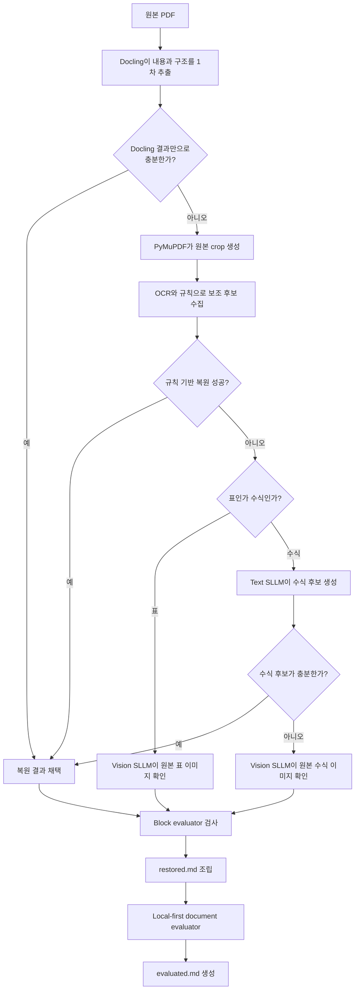

# PDF를 Markdown으로 복원하는 과정

## 1. 1분 요약

PDF를 사람이 다시 읽고 활용할 수 있는 Markdown으로 복원하는 것이 목표!

처리 과정은 다음과 같다.

1. **Docling**이 PDF의 본문·표·수식을 1차로 추출하고 문서 구조를 만든다.
2. Docling 결과만으로 부족한 영역은 **PyMuPDF**가 원본 이미지로 잘라낸다.
3. Docling의 1차 추출 결과에 OCR과 규칙 기반 코드의 결과를 더해 복원한다.
4. 코드만으로 해결하기 어려운 표는 **Vision SLLM**이 직접 이미지를 보고 복원한다.
5. 어려운 수식은 **Text SLLM**이 텍스트 후보를 만들고, 필요하면 Vision SLLM이 원본 이미지와 대조한다.
6. block별 **evaluator**가 결과 형식과 명백한 거절·손상을 검사한다.
7. 검사 결과를 조립해 `restored.md`를 만든다.
8. 별도 local-first document evaluator를 실행하면 의심 block을 원본 PDF와 다시 대조하고 `evaluated.md`를 만든다.

> 확실한 부분은 코드로 처리하고, 어려운 부분만 AI에게 보여주며, AI가 추측한 내용은 그대로 믿지 않는다.

실제 PDF 4개, 총 30페이지로 확인한 핵심 결론은 네 가지다.

- 제목·본문·표·수식·그림·참고문헌을 원본과 전수 대조한 사람 기준 전체 block 정확도는 93.03%(414/445)였다.
- 표·수식 70개는 모두 사람이 구조를 구분하고 읽을 수 있었다.
- 그중 55개는 핵심 내용이 완전하거나 경미한 표기 오류만 있었고, 15개는 정확한 재사용 전에 원본 확인이 필요했다.
- PDF 입력부터 최종 평가 Markdown까지의 처리시간은 총 705.45초, 약 11분 45초였다.

이 수치가 어떤 기준으로 계산됐고 왜 이런 결과가 나왔는지는 뒤의 실험 장에서 순서대로 설명한다.

---

## 2. 현재 pipeline의 구성요소

먼저 전체 흐름에 등장하는 도구와 처리 방식을 간단히 구분한다. 여기서는 각 구성요소의 역할만 이해하고, 실제 연결 순서는 다음 장에서 확인한다.

### Docling

PDF를 읽어 구조화된 문서로 바꾸는 1차 변환 도구다. 본문 text, 표 cell, 수식, 그림 정보를 추출하며 Markdown이나 JSON으로 내보낼 수도 있다.

현재 pipeline에서는 Docling이 만든 Markdown을 그대로 최종 결과로 사용하지 않고, 더 많은 정보가 들어 있는 Docling JSON을 1차 복원 결과이자 문서 구조의 기준선으로 사용한다.

쉽게 말하면 PDF를 먼저 읽어 다음과 같은 초안을 만드는 역할이다.

```text
제목: 추출한 제목 text
본문: 추출한 문단 text
표: 추출한 행·열과 cell
수식: 추출한 수식 표현
그림: 그림 정보와 caption 후보
```

이와 함께 각 요소의 읽기 순서와 몇 페이지의 어느 위치에 있는지를 `bbox` 좌표로 알려준다.

따라서 Docling의 역할은 다음 세 가지다.

- PDF 내용을 Markdown으로 바꿀 수 있는 1차 추출
- 제목·본문·표·수식·그림을 연결한 문서 구조 생성
- 후속 OCR과 Vision SLLM이 원본을 다시 볼 수 있는 page/bbox 제공

### PyMuPDF

PDF 파일을 직접 열고 특정 좌표를 이미지로 렌더링하는 도구다.

예를 들어 Docling이 표의 cell을 1차 추출했지만 일부 열이 빠졌다면, Docling이 함께 제공한 2페이지 bbox를 사용해 PyMuPDF가 원본 표 영역을 PNG 이미지로 잘라낸다.

이 잘라낸 이미지를 이 문서에서는 `crop`이라고 부른다.

### OCR
이 프로젝트에서는 Tesseract와 수식 전용 OCR 등을 이용해 같은 crop을 여러 방식으로 읽는다. OCR 하나만 정답이라고 믿지 않고 여러 결과를 비교한다.

### 규칙 기반 코드 처리

Python 코드와 정해진 규칙으로 결과를 만드는 방식이다. LLM이 없는, 순수 코드로 처리하는 단계이다.

예를 들면 다음과 같다.

- OCR에서 찾은 행을 `|`로 연결해 Markdown 표 만들기
- 수식 괄호의 짝 확인하기
- 표의 모든 행이 같은 열 개수를 갖는지 확인하기
- 이미 구조가 확실한 결과를 바로 채택하기

속도가 빠르고 같은 입력에 같은 결과를 내지만, 복잡한 표나 여러 줄 수식에는 약하다.

이 문서에서 말하는 **코드가 만든 1차 복원 결과**는 Docling 원문을 그대로 사용한다는 뜻이 아니다. Docling 구조, PDF crop의 OCR 결과, PDF text layer와 좌표 정보를 Python 코드가 정해진 규칙으로 조합해 만든 Markdown 후보를 뜻한다. 이 과정에서는 Text SLLM과 Vision SLLM을 호출하지 않는다.

표에서는 행·열을 정렬하고 Markdown 표 형식을 검사한다. 수식에서는 OCR의 변수·연산자·첨자·분수 구조를 조립하고 LaTeX 형식을 검사한다.

코드가 유효한 결과를 만들고 최소 형식 검사를 통과하면 **코드 처리 성공**으로 본다. 만들지 못하거나 검사를 통과하지 못하면 **코드만으로 복원하지 못한 것**이며, 이때만 Text SLLM이나 Vision SLLM으로 넘어간다.

```text
규칙 기반 코드 처리 성공 → SLLM 호출 없이 결과 사용
표를 코드만으로 복원하지 못함 → Vision SLLM 검토
수식을 코드만으로 복원하지 못함 → Text SLLM 복원 → 필요하면 Vision SLLM 검토
```

주의할 점은 코드 처리가 성공해도 원본과 완전히 같다는 뜻은 아니라는 것이다. 행·열 개수나 LaTeX 형식이 정상이어도 원본 표의 일부 행 또는 수식의 둘째 줄이 OCR 단계에서 빠지면 코드가 그 누락을 알지 못한 채 통과시킬 수 있다. 이것이 최종 evaluator가 원본 PDF와 다시 비교해야 하는 이유다.

### Text SLLM

텍스트만 처리하는 로컬 소형 언어 모델이다. 현재 모델은 `qwen2.5:7b`다.

Text SLLM은 이미지를 직접 보지 않는다. OCR이 읽은 문자열과 구조 힌트를 보고 수식을 LaTeX로 정리한다.

현재 흐름에서는 **수식에만 사용한다**. 표에는 사용하지 않는다.

### Vision SLLM

이미지와 텍스트를 함께 처리하는 로컬 Vision-Language SLLM이다. 현재 모델은 `qwen2.5vl:7b`다.

표의 행과 열, 수식의 분수와 위첨자처럼 위치가 중요한 정보를 원본 crop에서 확인한다.

두 모델의 차이는 다음과 같다.

| 구분 | 현재 모델 | 입력 | 현재 사용하는 경우 |
| --- | --- | --- | --- |
| Text SLLM | `qwen2.5:7b` | OCR text와 구조 힌트 | 규칙 기반 코드로 복원하지 못한 어려운 수식 |
| Vision SLLM | `qwen2.5vl:7b` | 원본 crop 이미지와 text 후보 | 어려운 표·수식·본문·그림의 원본 대조 |

### Evaluator

복원 결과를 최종 Markdown에 넣어도 되는지 검사하는 단계다.

복원 중 block evaluator는 주로 다음 형식을 검사한다.

- Markdown 표의 열 개수가 맞는가?
- 수식의 괄호와 LaTeX delimiter가 닫혀 있는가?
- 결과가 비어 있거나 `[rejected: ...]`로 시작하지 않는가?
- 깨진 글자가 남아 있지 않은가?

중요한 점은 evaluator가 완전한 정답 판별기가 아니라는 것이다. 형식이 맞더라도 숫자가 틀릴 수 있고, 내용이 많이 맞아도 형식이 조금 깨지면 거절할 수 있다.

복원 후 별도로 실행하는 local-first document evaluator는 조립된 Markdown의 모든 block을 읽고, 규칙상 의심되는 block만 원본 PDF crop과 다시 대조한다. 현재 네 문서에서는 조립된 457개 block 중 27개가 검토 대상으로 선택됐다. 이 단계는 전체 block을 사람이 채점해 정확도 점수를 계산하는 benchmark와는 다르다.

---

## 3. 현재 코드의 전체 흐름



PDF 전체를 한 번에 AI에게 보내지 않는다. 표 하나, 수식 하나처럼 작은 단위로 잘라서 필요한 경우에만 모델을 호출한다.

이 흐름의 핵심은 Docling 결과를 무조건 버리고 새로 읽는 것이 아니다. Docling이 만든 초안을 먼저 사용하고, 부족한 block에만 crop·OCR·SLLM을 추가하는 것이다. 다음 장에서는 표 하나가 이 흐름을 통과하는 과정을 구체적으로 본다.

---

## 4. 각 단계가 실제로 하는 일

### 표 하나가 처리되는 예시

PDF 5페이지에 표가 하나 있다고 가정해 보자.

#### 1단계: Docling이 표를 1차 추출한다

Docling은 표를 찾는 것과 동시에 가능한 범위에서 표의 행·열과 cell text를 추출한다. 그리고 다음과 같은 구조와 위치 정보도 만든다.

```text
종류: table
페이지: 5
위치: [왼쪽, 위, 오른쪽, 아래]
추출 결과: header, row, cell text
```

#### 2단계: PyMuPDF가 표 이미지를 만든다

PyMuPDF가 5페이지의 해당 좌표를 PNG로 렌더링한다.

Docling도 이미지를 출력할 수 있다. 다만 현재 pipeline은 Docling을 `--image-export-mode placeholder`로 실행해 이미지 파일을 별도로 내보내지 않는다.

대신 Docling에서 1차 표 내용과 page/bbox를 받고, PyMuPDF가 그 좌표를 이용해 원본 PDF에서 crop을 만든다. 이렇게 하면 표·수식·본문·그림마다 OCR과 Vision SLLM에 필요한 해상도와 여백을 후속 코드에서 조절할 수 있다. PyMuPDF는 PDF text layer와 좌표 확인에도 사용하므로, Docling 이미지 출력을 켜더라도 현재 흐름에서 바로 제거되지는 않는다.

#### 3단계: OCR과 코드가 먼저 시도한다

Python 코드는 Docling이 추출한 표 구조와 여러 OCR 관측값을 비교해 Markdown 표를 조립한다.

```markdown
| Parameter | Value |
| --- | ---: |
| Speed | 1000 |
| Torque | 2396 |
```

행과 열이 명확하면 여기에서 끝난다. AI 모델은 호출하지 않는다.

#### 4단계: 어려운 표만 Vision SLLM으로 보낸다

OCR 결과에서 열 관계가 깨졌거나 규칙 기반 코드가 표를 만들지 못했다면 Vision SLLM이 원본 crop을 직접 본다.

현재는 표를 Text SLLM에 먼저 보내지 않는다. 실험에서 Text SLLM이 표의 열 관계를 잘못 정리하거나 Vision SLLM의 판단을 방해했기 때문이다.

#### 5단계: evaluator가 형식을 검사한다

Vision SLLM 결과가 Markdown 표 형식을 만족하면 최종 문서에 들어간다. 형식이 깨졌다면 거절 상태로 남는다.

---

### 각 도구는 정확히 언제 사용되는가?

아래 표의 “사용”은 항상 실행된다는 뜻이 아니다. 실제로 해당 조건을 만족할 때만 실행된다.

| 도구 또는 단계 | 사용하는 경우 | 사용하지 않는 경우 |
| --- | --- | --- |
| Docling | 저장된 Docling JSON이 없어서 PDF의 내용·구조를 1차 추출해야 할 때 | 기존 Docling JSON을 입력으로 전달했을 때 |
| PyMuPDF crop | Docling의 1차 추출이 부족한 표·수식·그림·본문을 원본 이미지로 다시 볼 때 | Docling 결과만으로 충분한 단순 text 처리 |
| PyMuPDF 보조 text/layout | PDF text layer와 Docling 결과를 비교할 보조 후보가 필요할 때 | 최종 읽기 순서를 직접 결정하는 용도로는 사용하지 않음 |
| 본문 crop OCR | 본문이 깨졌거나 별도 판정이 필요할 때 | 정상 본문 |
| 표 규칙 기반 코드 | 모든 표 후보에서 가장 먼저 실행 | 표 후보가 아니거나 crop이 없을 때 |
| 수식 규칙 기반 코드 | 모든 수식 후보에서 가장 먼저 실행 | 수식 후보가 아니거나 crop이 없을 때 |
| Text SLLM 수식 복원 | 규칙 기반 코드로 수식을 복원하지 못했고 `--use-local-sllm`이 켜졌을 때 | 표, 이미 복원된 수식, flag가 꺼진 경우 |
| Text SLLM 수식 재시도 | 첫 Text SLLM 수식 결과가 거절됐을 때 최대 한 번 | 첫 결과가 통과했거나 Text SLLM을 사용하지 않은 경우 |
| Vision SLLM 표 복원 | 표 복원 파일이 없거나 evaluator가 거절했거나 깨진 문자가 남았을 때 | 기존 표 결과가 accepted이고 깨진 문자가 없을 때 |
| Vision SLLM 수식 검토 | Text SLLM·규칙 기반 코드의 수식 결과가 없거나 거절됐거나 깨진 경우 | 기존 수식 결과가 accepted이고 깨진 문자가 없을 때 |
| Vision SLLM 본문 검토 | 본문이 `needs_text_adjudication`이거나 glyph 손상이 있을 때 | 정상 본문 |
| Vision SLLM 그림 복원 | caption이 필요하거나 그림 설명이 깨졌을 때 | 정상 caption이 있거나 caption 대상이 아닐 때 |
| 최종 local evaluator | 복원 후 별도 평가 CLI를 실행했을 때 | 복원 CLI만 실행하고 종료할 때 |

CLI flag의 의미도 구분해야 한다.

- 기본 `--mode crop-first`: Rust Heron으로 표·수식·그림을 crop하고, redaction한 본문은 AnyDoc으로 변환한다. 그림은 원본 asset을 유지하며 표·수식과 확정 손상·차이 상위 30% 본문을 Luna 페이지 묶음으로 복원한다.
- `--mode docling-only`: Docling Markdown을 최종 산출물로 게시하고 후속 crop·OCR·SLLM 복원을 실행하지 않는다.
- `--mode selective-repair`: 기존 코드가 검출한 표·수식·손상 text만 원본 페이지와 crop을 첨부해 OpenAI Responses API로 복원한다. 같은 페이지에서도 본문과 표·수식은 별도 lane으로 묶고, 180초 timeout·JSON/ID 불일치·Markdown 검증 탈락 항목만 단건 fallback한다. 그림은 원본 asset을 유지한다. 기본값은 `gpt-5.6-luna`, reasoning `medium`이다.
- `--mode full-repair`: 기존 검출·crop OCR·규칙 복원과 선택적 SLLM·Vision 단계를 실행한다.
- `--docling-json`으로 캐시를 재사용하는 `docling-only` 실행은 대응하는 `--docling-markdown`도 함께 전달한다.
- `--use-local-sllm`: 코드만으로 복원하지 못한 **수식**에 Text SLLM 보완을 허용한다.
- `--use-local-vision`: 필요한 표·수식·본문·그림에 Vision SLLM 검토를 허용한다.

`crop-first`와 `selective-repair`는 `DOCUMENT_REPAIR_OPENAI_API_KEY` 또는 `OPENAI_API_KEY`가 필요하다. SLLM·Vision flag는 `full-repair` mode에서만 의미가 있으며, flag를 켰다고 모든 block이 모델에 들어가는 것은 아니다.

---

### Docling과 PyMuPDF를 왜 둘 다 사용하는가?

두 도구는 서로 다른 장점이 있다.

#### Docling이 잘하는 것

- 본문 text의 1차 추출
- 표의 행·열과 cell 구조 추출
- 수식·그림·caption 후보 추출
- 문서 요소 종류 구분
- 본문의 읽기 순서 구성
- 표, 수식, 그림의 기본 위치 제공
- 문서 전체를 Markdown 또는 구조화된 JSON으로 표현

#### PyMuPDF가 잘하는 것

- PDF 원본 파일에 직접 접근
- 특정 좌표를 정확한 이미지로 렌더링
- PDF text layer의 단어와 좌표 읽기
- 표의 열 경계나 보조 layout 후보 확인

따라서 역할을 다음처럼 나눴다.

```text
Docling: PDF를 먼저 읽어 내용과 구조를 만드는 1차 변환기이자 기준선
PyMuPDF: 부족한 영역을 원본에서 다시 잘라 보고 좌표와 text layer를 확인하는 보조 도구
```

Docling만으로도 PDF를 Markdown으로 내보낼 수 있다. 이 프로젝트가 후속 단계를 추가한 이유는 Docling으로만 하기엔, 실제 연구 PDF에서 발견된 부분 누락과 인식 오류를 원본 근거로 보완하기 위해서다.

#### PyMuPDF는 현재 실제로 어디에 사용하는가?

다음 역할에는 필수다.

- Docling bbox를 PNG crop으로 렌더링
- 표·수식·그림의 원본 이미지 생성
- evaluator가 다시 볼 원본 영역 생성
- PDF 단어 좌표와 표 열 구조 확인

다만 PyMuPDF text를 이용해 Docling 본문을 교체하는 보조 경로는 주의가 필요하다.

일부 PDF는 글자 인코딩이 일정하게 밀려 있어 별도 decode가 도움이 된다. 하지만 정상 PDF에도 같은 decode를 적용하면 정상 글자가 오히려 깨질 수 있다. 따라서 text 교체는 다음 조건이 필요하다.

- 문서가 실제 glyph-shift 문서인지 먼저 판정
- 비교하는 두 bbox의 크기와 범위가 비슷한지 확인
- 정상 Docling text보다 보조 후보가 명확히 좋은지 확인

PyMuPDF를 제거할 문제는 아니다. crop과 좌표 기능은 유지하고, 일반 본문 교체만 더 엄격하게 제한해야 한다.

#### `infra/converter`는 현재 흐름에 포함되는가?

포함되지 않는다. `infra/converter`는 OCRmyPDF, Tesseract, MarkItDown으로 일반 파일을 빠르게 Markdown으로 바꾸는 별도 서비스다. 현재 실험 대상인 canonical 복원 pipeline에서 converter의 `/convert` API를 호출하는 코드는 확인되지 않았다.

`infra` 아래에 있는 이유는 Tesseract, Ghostscript, Poppler 같은 시스템 패키지와 별도 port가 필요한 독립 실행 서비스이기 때문이다. 따라서 이 문서의 나머지 설명은 `infra/converter`가 아니라 Docling에서 시작하는 canonical 복원 pipeline만 다룬다.

여기까지가 모든 문서에 공통으로 적용되는 기본 흐름이다. 다음 장에서는 왜 표와 수식을 같은 방식으로 처리하지 않는지 설명한다.

---

## 5. 표와 수식을 왜 다르게 처리하는가?

현재 코드는 규칙 기반 코드로 복원하지 못한 표는 Vision SLLM으로 보내고, 수식은 Text SLLM 후보를 만든 뒤 필요할 때 Vision SLLM으로 보낸다. 표와 수식의 실패 특성이 다르기 때문이다.

### 표에서 텍스트용 SLLM이 불리했던 이유

표는 글자 자체보다 행과 열의 위치 관계가 중요하다.

텍스트 모델은 OCR 문자열만 보기 때문에 다음 문제가 있었다.

- 여러 열을 하나의 긴 cell로 합침
- header와 body의 열 관계를 잘못 연결
- 잘못된 Text SLLM 표가 Vision SLLM prompt에 들어가 판단까지 방해
- Text SLLM 생성과 평가 때문에 호출 시간이 증가

Vision SLLM은 원본 이미지를 직접 보기 때문에 표에서는 더 많은 cell 값을 복원했다.

### 수식에서 텍스트용 SLLM이 도움이 된 이유

수식은 OCR 문자열에도 변수와 기호에 대한 중요한 단서가 남는다.

실제 사례에서 Vision SLLM만 사용한 방식은 다음 수식의 역수를 잃었다.

```text
원본:   Σ(1 / yᵢ²) / n
Vision SLLM: Σ(yᵢ² / n)
```

Text SLLM은 OCR 문자열에서 `1/yᵢ²` 구조를 잡았고, 이 후보를 사용한 처리 방식은 올바른 수식을 복원했다.

그래서 현재 정책은 다음과 같다.

```text
표:   Vision SLLM 중심
수식: Text SLLM으로 텍스트 구조 확보 → 필요하면 Vision SLLM 확인
```

---

이 선택이 실제로 정확도와 시간에 도움이 됐는지는 추측이 아니라 같은 PDF를 사용한 비교 실험으로 확인했다.

---

## 6. 실제 PDF 실험

### 실험 대상

- PDF 4개
- 총 30페이지
- 표·수식 block 70개
- 표 정보 단위 1,693개
- 수식 정보 단위 415개
- 전체 원본 정보 단위 2,108개

여러 처리 방식을 같은 조건에서 비교하도록 Docling JSON, bbox, crop, OCR 증거를 고정했다. 따라서 AI 보완 방식의 차이만 비교할 수 있다.

이 처리 방식 비교는 일반 본문까지 포함한 30페이지 전체 정확도가 아니다. 각 방식이 다르게 처리하는 표·수식 70개의 엄격한 정보 단위 recall이다.

### 복원율은 어떻게 계산했는가?

예를 들어 27행 표에서 한 cell만 틀렸다면 나머지 cell은 복원한 것으로 계산했다.

- 표: 원본의 비어 있지 않은 header/data cell을 1 unit으로 계산
- 수식: 변수, 계수, 항, 연산 관계, equation number를 의미 단위로 계산
- 산출물에 같은 의미가 남아 있으면 복원된 unit으로 계산
- evaluator가 거절한 후보는 최종 전달 복원량에서 제외

이 계산은 AI 보완 방식을 비교하기 위한 보조 지표다. 사람이 읽는 품질과는 차이가 있다.

- 큰 표가 대부분 복원돼도 evaluator가 거절하면 전달 정보가 전부 0점이 된다.
- 원본의 한 cell이 여러 Markdown cell로 나뉘면 사람이 읽을 수 있어도 일부 unit을 잃은 것으로 계산한다.
- 표 하나와 수식 하나를 같은 block 한 개로 보는 사람 기준과 달리, 큰 표의 cell 수가 점수에 큰 영향을 준다.

### 실험 1: 표·수식 처리 방식 비교

이 표의 `70개 block`과 `SLLM 호출`은 같은 뜻이 아니다. 표·수식 70개 전체에 먼저 규칙 기반 코드가 만든 결과를 적용했고, 코드만으로 충분히 복원되지 않은 block에만 SLLM을 호출했다.

| 방식 | 평가 대상 | 최종 복원 정보 | 복원율 | Text/Vision SLLM 호출 | SLLM 처리시간 |
| --- | ---: | ---: | ---: | ---: | ---: |
| Python 규칙만 사용 | 70 block | 1,401/2,108 | 66.46% | 0회 | 0초 |
| Python 규칙 + Text SLLM | 70 block | 1,475/2,108 | 69.97% | 19회 | 99.78초 |
| Python 규칙 + Vision SLLM | 70 block | 1,650/2,108 | 78.27% | 9회 | 90.12초 |
| 비교용 Text SLLM + Vision SLLM | 70 block | 1,536/2,108 | 72.87% | 26회 | 175.39초 |
| **현재 표·수식 분리 방식** | **70 block** | **1,654/2,108** | **78.46%** | **17회** | **101.34초** |

현재 방식에서 70개 중 62개는 규칙 기반 코드가 만든 결과를 그대로 사용했다. 즉, 62개가 이 단계의 최소 형식 검사를 통과해 SLLM 보완이 실행되지 않았다는 뜻이다. 나머지 8개 block만 AI 보완 대상이었다.

| AI 보완 대상 | block | 실제 SLLM 호출 |
| --- | ---: | ---: |
| 표: Vision SLLM만 사용 | 4 | 5회 |
| 수식: Text SLLM으로 완료 | 2 | 5회 |
| 수식: Text SLLM 후 Vision SLLM 확인 | 2 | 7회 |
| **합계** | **8** | **17회** |

현재 표·수식 분리 방식의 실제 순차 실행 wall time은 101.82초였다.

#### 비교용 혼합 방식과 비교

- 복원율: 72.87% → 78.46%
- 복원율 상승: 5.59%p
- SLLM 처리시간: 175.39초 → 101.34초
- SLLM 처리시간 감소: 약 42.22%
- Text/Vision SLLM 호출: 26회 → 17회

#### Vision SLLM만 사용한 방식과 비교

- 복원율: 78.27% → 78.46%
- 복원율 상승: 0.19%p
- SLLM 처리시간: 90.12초 → 101.34초
- 추가 시간: 11.22초

Vision SLLM만 사용한 방식이 가장 빠르다. 현재 방식은 약 11초를 더 사용하는 대신 수식의 역수와 연산 관계를 조금 더 안전하게 복원했다.

#### 표와 수식을 따로 보면

| 종류 | Python 규칙 | Text SLLM | Vision SLLM | 비교용 혼합 방식 | 현재 방식 |
| --- | ---: | ---: | ---: | ---: | ---: |
| 수식 | 68.92% | 73.73% | 76.87% | 77.83% | **77.83%** |
| 표 | 65.86% | 69.05% | **78.62%** | 71.65% | **78.62%** |

표는 Vision SLLM 결과가 가장 좋고, 수식은 Text SLLM과 Vision SLLM을 함께 사용한 결과가 가장 좋았다. 현재 방식은 표와 수식에 각각 더 적합했던 처리 방법을 사용한다.

#### 현재 AI 보완 실행 결과

현재 표·수식 분리 방식에서 SLLM을 사용한 8개 block의 실행 결과다.

- 표 Vision SLLM: 4 block, 5회 호출, 72.62초
- 수식 Text SLLM만으로 완료: 2 block, 5회 호출, 10.16초
- 수식 Text SLLM 후 Vision SLLM 확인: 2 block, 7회 호출, 18.56초
- AI 보완 대상 합계: 8 block, 17회 호출, 101.34초
- 70개 전체 결과 중 evaluator accepted: 69/70

101.34초는 이미 만들어진 Docling·layout·OCR 증거를 고정하고 AI 보완 방식만 다시 실행한 시간이다. 사용자가 PDF 파일을 넣고 기다려야 하는 전체 시간과는 다르다.

70개 결과는 원본 crop 대조에서 선택한 `표 Vision SLLM + 수식 Text/Vision SLLM 조합` 결과와 Markdown 및 accepted 상태가 모두 일치했다.

### 실험 2: 현재 최종 Markdown의 사람 기준 재평가

위 처리 방식 비교 실험과 별도로, 현재 네 개의 `evaluated.md`에 들어간 표·수식 70개를 원본 crop과 다시 대조했다.

판정 기준은 다음과 같다.

- **완전·경미**: 표나 수식의 핵심 구조와 내용이 모두 있고, 첨자·header 표현·불필요한 문자 같은 작은 표기 오류만 있음
- **부분 복원**: 표나 수식으로 읽을 수 있지만 중요한 행·항·부호·값이 빠졌거나 잘못됨
- **미복원**: 원본 내용을 표나 수식으로 확인할 수 없음

| 문서 | 표·수식 | 완전·경미 | 부분 복원 | 미복원 |
| --- | ---: | ---: | ---: | ---: |
| Serial-loop | 10 | 8 | 2 | 0 |
| Designing | 19 | 12 | 7 | 0 |
| Multi-objective | 20 | 17 | 3 | 0 |
| IET | 21 | 18 | 3 | 0 |
| **합계** | **70** | **55, 78.57%** | **15, 21.43%** | **0** |

종류별로 보면 수식은 38/44개로 86.36%가 완전·경미였고, 표는 17/26개로 65.38%가 완전·경미였다. 표 26개와 수식 44개 모두 Markdown에서 해당 구조로 구분하고 읽을 수 있었다.

부분 복원 15개의 대표적인 문제는 다음과 같다.

- 큰 표에서 일부 행이 빠짐
- 표 값은 남아 있지만 두 열의 값이 한 cell에 합쳐짐
- 수식의 둘째 줄이나 일부 항이 빠짐
- `±` 부호, 분수 관계, 지수처럼 의미에 영향을 주는 기호가 손상됨

따라서 대표 품질은 목적에 따라 두 수치로 설명해야 한다.

- **문서를 사람이 읽고 구조를 파악하는 목적**: 70/70, 100%
- **표의 값과 수식을 원본 확인 없이 그대로 재사용하는 목적**: 55/70, 78.57%

앞의 78.46%와 78.57%가 비슷한 것은 우연이다. 78.46%는 cell·기호 개수로 가중한 처리 방식 비교 실험의 recall이고, 78.57%는 현재 최종 Markdown에서 완전·경미로 판정된 block 비율이다.

### 실험 3: 원본 PDF부터 최종 Markdown까지 걸린 시간

PDF 4개를 각각 빈 출력 폴더에 넣고 현재 복원 과정을 처음부터 끝까지 다시 실행했다.

```text
원본 PDF
→ Docling 변환
→ layout·수식 후보 탐지
→ primary manifest 생성
→ crop OCR 보강
→ 표·수식 Text/Vision SLLM 복원과 block evaluator
→ 그림 Vision SLLM 복원
→ restored.md 조립
→ 문서 전체 local evaluator
→ evaluated.md 생성
```

측정 조건은 다음과 같다.

- PDF 4개, 총 30페이지를 한 번씩 순차 실행
- 기존 Docling JSON과 복원 결과를 재사용하지 않음
- PDF별로 새로운 출력 폴더 사용
- `qwen2.5:7b`, `qwen2.5vl:7b`, Docling 2.112.0 사용
- Apple M5 Pro 15-core, RAM 48GB, macOS 26.5.2 환경
- Ollama server가 실행된 상태에서 복원 CLI 시작
- 병렬 실행하지 않음

| 문서 | 페이지 | PDF → `restored.md` | evaluator | 합산 처리시간 | 조립 block / 검토 대상 |
| --- | ---: | ---: | ---: | ---: | ---: |
| Serial-loop | 4 | 38.40초 | 5.22초 | 43.63초 | 76 / 1 |
| Designing | 6 | 168.47초 | 30.79초 | 199.26초 | 92 / 6 |
| Multi-objective | 8 | 167.78초 | 16.33초 | 184.11초 | 104 / 7 |
| IET | 12 | 252.71초 | 25.74초 | 278.45초 | 185 / 13 |
| **합계** | **30** | **627.36초** | **78.08초** | **705.45초, 약 11분 45초** | **457 / 27** |

따라서 현재 장비에서 PDF 4개를 차례로 처리해 `evaluated.md`까지 얻는 순수 처리시간 합계는 약 **11분 45초**다. evaluator는 조립된 Markdown의 모든 block을 읽어 후보를 고른 뒤, 457개 중 27개만 원본 crop으로 검토했다.

복원 CLI와 evaluator CLI는 별도 프로세스다. 위 705.45초는 각 프로세스에 기록된 처리시간을 더한 값이며, 두 명령 사이의 사람 대기시간은 포함하지 않는다. evaluator를 실행하면 다음 시간이 `*.evaluation.json`과 `*.evaluator_report.md`에 저장된다.

- `evaluation_elapsed_seconds_last_run`: 이번 evaluator 실행시간
- `evaluation_elapsed_seconds_total`: `--resume`을 포함한 evaluator 누적 실행시간
- `restoration_elapsed_seconds`: `pipeline_timing.json`에서 읽은 복원 시간
- `pdf_to_evaluated_processing_seconds`: 복원 시간과 evaluator 누적 시간의 합

여기서 457은 evaluator가 조립된 Markdown에서 파싱한 block 수다. primary manifest의 458개 후보 수와는 집계 단계가 다르므로 같은 숫자일 필요는 없다.

전체 처리시간 705.45초를 단계별로 합산하면 다음과 같다.

| 단계 | 4개 PDF 합계 | 전체 처리시간 내 비중 |
| --- | ---: | ---: |
| Docling 1차 변환 | 119.52초 | 16.94% |
| OCR·규칙 기반 코드·수식 Text SLLM block 복원 | 189.68초 | 26.89% |
| 표·수식·손상 text Vision SLLM 검토 | 292.97초 | 41.53% |
| 그림 Vision SLLM 복원 | 16.25초 | 2.30% |
| layout·manifest·OCR 보강·조립 | 8.94초 | 1.27% |
| local-first document evaluator | 78.08초 | 11.07% |

호출 수는 측정 단계마다 다음처럼 구분한다.

| 측정 범위 | 대상 | 실제 SLLM 호출 |
| --- | ---: | ---: |
| 표·수식 처리 방식 비교 | 표·수식 70개 중 코드만으로 복원하지 못한 8개 | Text·Vision SLLM 합계 17회 |
| 전체 복원 중 `review_blocks_with_vision` | 표·수식·손상 본문 68 block | Vision SLLM 67회, 고유 이미지 57개 |
| 최종 local-first document evaluator | 의심 block 27개 | Vision SLLM 42회 |

동일한 block도 첫 결과가 불충분하면 다시 호출하므로 `검토 block 수`, `고유 이미지 수`, `SLLM 호출 수`는 서로 다를 수 있다. 특히 292.97초는 처리 방식 비교 실험의 17회가 아니라 전체 복원 과정의 Vision SLLM 67회에 해당한다.

Vision SLLM 검토가 복원 CLI에서 가장 큰 비중을 차지한다. 따라서 전체 속도를 개선하려면 PyMuPDF crop 자체보다 다음 항목이 더 중요하다.

1. AI에게 보내는 block 수를 줄인다.
2. evaluator를 통과할 가능성이 낮은 후보의 재시도를 줄인다.
3. 서로 독립적인 block은 모델 메모리가 허용되는 범위에서 병렬 처리한다.

단, 위 결과는 동일 장비에서 한 번씩 실행한 wall-clock 측정값이다. 모델의 warm-up 상태, 다른 프로세스의 부하, 표·수식·그림 수에 따라 달라질 수 있으므로 통계적 성능 benchmark로 사용하려면 여러 번 반복 측정해야 한다. 특히 페이지 수보다 AI 검토 대상 block 수가 처리시간에 더 큰 영향을 준다.

### 실험 4: 전체 문서 구성과 참고문헌 결과

현재 primary manifest는 PDF 4개, 총 30페이지에서 458개 block을 만든다.

| block 종류 | 개수 |
| --- | ---: |
| heading | 58 |
| paragraph | 293 |
| figure candidate | 37 |
| table candidate | 26 |
| equation candidate | 44 |
| **합계** | **458** |

Docling JSON의 `body.children`에 group이 있으면 내부 요소를 문서 순서대로 재귀 탐색한다. 참고문헌은 `group(label=list)` 안의 `list_item`으로 들어오며, 정상 list item은 Docling text를 우선 사용한다.

| 문서 | 참고문헌 포함 | 사람이 읽고 구분 가능 | 내용 누락 없이 복원 |
| --- | ---: | ---: | ---: |
| Serial-loop | 11/11 | 11/11 | 11/11 |
| Designing | 8/8 | 8/8 | 6/8 |
| Multi-objective | 26/26 | 26/26 | 26/26 |
| IET | 46/46 | 46/46 | 46/46 |
| **합계** | **91/91** | **91/91, 100%** | **89/91, 97.80%** |

Designing의 남은 두 항목은 참고문헌 본문을 식별할 수 있지만, 하나는 crop 하단에서 마지막 연도가 잘렸고 다른 하나는 Vision SLLM 전사에서 목록 번호 `[4]`가 빠졌다. 따라서 “사람이 읽을 수 있는가”에는 성공, “원본 정보가 하나도 빠지지 않았는가”에는 실패로 판정했다.

### 전체 30페이지 사람 기준 전수 평가

표·수식과 참고문헌만 따로 보던 기존 평가 범위를 넓혀, `tmp/full_flow_group_fix_2026-07-16/`의 원본 PDF 4개와 최종 `evaluated.md`를 30페이지 전체에서 직접 대조했다. primary manifest의 원본 block을 기준으로 제목·본문·표·수식·그림·참고문헌을 `완전·경미`, `부분 복원`, `미복원`으로 판정했다.

- **완전·경미**: 핵심 구조와 내용이 모두 남아 있고, 공백·하이픈·첨자 같은 작은 표기 차이만 있음
- **부분 복원**: 읽을 수는 있지만 제목·저자·문장·표 행·수식 항·숫자·부호 등 의미 있는 정보가 빠지거나 달라짐
- **미복원**: 원본 block의 핵심 내용을 최종 Markdown에서 확인할 수 없음

IET 문서에서 반복되는 page number와 publisher download notice 13개는 논문 본문 의미 정보가 아니므로 정확도 분모에서 제외했다. 따라서 primary manifest 458개 중 실제 평가 대상은 445개다. 표·수식은 앞의 70개 사람 판정을 그대로 사용하고, 참고문헌은 91개 전수 판정을 사용했다. 나머지 제목·본문·그림은 원본 페이지와 최종 Markdown을 직접 대조했다.

| 문서 | 평가 block | 완전·경미 | 부분 복원 | 미복원 | 정확도 |
| --- | ---: | ---: | ---: | ---: | ---: |
| Serial-loop | 77 | 73 | 4 | 0 | 94.81% |
| Designing | 92 | 77 | 15 | 0 | 83.70% |
| Multi-objective | 104 | 97 | 7 | 0 | 93.27% |
| IET | 172 | 167 | 5 | 0 | 97.09% |
| **합계** | **445** | **414** | **31** | **0** | **93.03%** |

유형별 결과는 다음과 같다.

| 유형 | 평가 block | 완전·경미 | 부분 복원 | 미복원 | 정확도 |
| --- | ---: | ---: | ---: | ---: | ---: |
| 제목·section heading | 58 | 55 | 3 | 0 | 94.83% |
| 본문·저자·참고문헌 | 280 | 267 | 13 | 0 | 95.36% |
| 그림·caption | 37 | 37 | 0 | 0 | 100% |
| 표·수식 | 70 | 55 | 15 | 0 | 78.57% |
| **합계** | **445** | **414** | **31** | **0** | **93.03%** |

대표적인 부분 복원 사례는 다음과 같다.

- Serial-loop: 저자명이 `N`만 남고, 투고·게재 정보 문단이 glyph 손상 상태로 남음
- Designing: 제목 앞부분과 저자명이 빠지고, 일부 section heading이 본문으로 분리됨
- Designing: 평균 torque `2.39`가 `2.3`으로, 효율 `91.16%`가 `1.16%`로 손상됨
- Multi-objective: 저자 2명의 이름·소속이 깨지고, 1~2페이지 introduction 일부의 읽기 순서가 섞임
- IET: 민감도 식을 설명하는 문장의 앞부분이 빠지고, 마지막 `How to cite this article` 문구가 glyph 손상됨
- 기존 표·수식 평가에서 확인한 표 행·값, 수식 항, `±` 부호 누락 15개

원본에 없는 별도 의미 block을 새로 만든 hallucination은 확인되지 않았다. 다만 부분 복원 block 안에 OCR·glyph debris가 섞인 사례는 있었으며, 이를 정확한 block으로 계산하지 않았다.

이 93.03%는 문서 4개에 대한 단일 reviewer의 block 단위 사람 평가다. 긴 본문 문단과 큰 표를 각각 한 block으로 동일하게 계산하므로 문자 단위 정확도나 정보 단위 recall과는 다르다. 또한 다른 종류의 PDF에도 같은 정확도가 나온다는 의미는 아니다.

---

## 7. 실험에서 확인된 evaluator의 한계

앞의 실험은 현재 처리 방식이 왜 선택됐는지는 보여주지만, 최종 정확도를 보장하지는 못한다. 남은 오류를 살펴보면 모델뿐 아니라 evaluator에도 다음 한계가 있었다.

### 현재 판정 규칙

- `[rejected: ...]`, 대괄호가 없는 `rejected: ...`, 대소문자가 다른 거절 응답을 모두 거절한다.
- 본문·참고문헌 Vision SLLM 검토가 거절되면 거절 문자열로 정상 Docling 원문을 덮지 않는다.
- 결과가 비어 있거나 code fence와 glyph 손상이 남으면 거절한다.
- 표의 Markdown 열 수와 수식 delimiter·괄호·LaTeX 구조를 검사한다.
- `local_first_v10`부터 모든 `equation_candidate`를 원본 crop과 대조하고 수식 행·항·계수·연산자·분모·지수·첨자·부호를 확인한다.
- 표의 `corrected`·`match`·text-layout 결과는 PDF word 좌표의 행·열별 cell token과 Tesseract TSV에서 확인한 이미지 부호를 보존해야 채택한다. Tesseract 실행에 실패하면 text-layout 결과를 자동 채택하지 않고 Vision 검증으로 넘긴다.

### 틀렸는데 통과한 경우

- Designing의 정격 정보 표에서 `Maximum DC Bus Voltage`, `Maximum Current Density` 행이 빠졌지만 형식 검사를 통과함
- Designing의 여러 줄 회귀 수식에서 둘째 줄의 quadratic 항이 빠졌지만 수식 형식은 정상으로 판정됨
- IET의 noise 표에서 모든 `±` 부호가 빠졌지만 행·열 개수가 맞아 통과함
- IET의 initial/optimised 비교 표에서 일부 두 값을 한 cell에 합치고 반대 cell을 비워 둠
- Multi-objective의 parameter 표에서 원본 12개 행 중 6개만 남았지만 Markdown 표 형식은 정상임

위 사례는 `local_first_v8` 평가에서 확인됐다. `local_first_v10`은 수식 전체를 원본 crop 필수 검토 대상으로 바꾸고, 표의 PDF word 좌표를 행·열별 cell 근거로 유지한다. text layer에 없는 `±`는 Tesseract TSV에서 식별할 수 있는 부호 근거로 보충하며, Tesseract 자체가 실패하면 text-layout 후보를 Vision 검증으로 넘긴다. 다만 OCR에서도 안정적으로 인식하지 못한 이미지 문자와 manifest에 들어오지 않은 block은 아직 결정론적으로 검증하지 못한다.

### 내용은 맞는데 거절한 경우

IET 문서의 20행 큰 표는 현재 최종 Markdown에 모든 행과 값이 들어 있다. 하지만 header가 하나의 긴 문장처럼 합쳐져 local evaluator에서는 `unresolved`로 남았다.

이 경우에는 전체 후보를 버리는 대신 다음 처리가 더 적절하다.

1. Vision SLLM이 읽은 값을 구조화된 임시 데이터로 보존
2. header와 body의 열 수를 코드로 맞춤
3. 값이 바뀌지 않았는지 검사
4. 수정한 Markdown 표를 다시 평가

즉, 다음 개선 대상은 모델 추가가 아니라 **표 구조 repair와 원본 기반 검증 강화**다.

---

## 8. 현재 prompt가 모델에 요구하는 것

모델에게 자유롭게 설명하거나 요약하라고 요청하지 않는다.

### 표 프롬프트

- 원본 이미지에 보이는 내용만 사용
- Markdown 표만 반환
- 보이지 않는 값을 추측하지 않음
- 확신할 수 없으면 `[rejected: ...]` 반환

### 수식 프롬프트

- display math만 반환
- 변수, 숫자, 분수, 위첨자를 임의로 수정하지 않음
- OCR과 Text SLLM 후보는 참고 자료일 뿐 정답으로 간주하지 않음
- 최종 판단 근거는 원본 crop

### Evaluator 프롬프트

- 결과를 더 자연스럽게 다시 쓰지 않음
- 원본 근거 없이 누락된 값을 보충하지 않음
- accepted 여부와 구체적인 실패 이유만 반환

프롬프트의 공통 원칙은 다음과 같다.

> 완성된 것처럼 보이는 결과보다, 원본에 충실하거나 명확하게 실패한 결과를 우선한다.

### 현재 실행 prompt 원문과 줄별 한글 주석

아래 내용은 흐름을 이해하는 데 반드시 읽어야 하는 본문이 아니라, 실제 지시문을 확인하기 위한 참고자료다. 처음 읽을 때는 접힌 원문을 건너뛰어도 된다.

영어 문장은 `llmPipeline/prompts/document_restoration`에서 현재 실제로 사용하는 prompt 원문이다. 각 영어 지시문 뒤의 `// 한글`은 멘토가 바로 이해할 수 있도록 이 문서에만 붙인 설명이며, 실제 prompt 파일이나 모델 입력에는 포함되지 않는다. 각 파일은 코드가 역할에 맞는 OCR·hint·후보 정보를 뒤에 붙여 모델에 전달한다.

#### 표

`block_table_vision.md`는 규칙 기반 코드의 복원이 충분하지 않은 표를 원본 crop과 대조할 때 사용한다.

<details>
<summary><code>block_table_vision.md</code> 원문 + 한글 주석</summary>

~~~~text
You review one cropped PDF table image after OCR and SLLM reconstruction. // OCR과 SLLM 복원 뒤 PDF 표 crop 하나를 직접 검토한다.

Return only a compact Markdown table. // 간결한 Markdown 표만 반환한다.
If the visible table is insufficient, return exactly one `[rejected: ...]` line. // 이미지에서 표를 충분히 확인할 수 없으면 거절문 한 줄만 반환한다.

Rules: // 세부 이미지 검토 규칙이다.
- Read only cells visible in the supplied image. // 제공된 이미지에 보이는 cell만 읽는다.
- Use OCR text and the SLLM candidate only as hypotheses to verify against the image. // OCR과 SLLM 후보는 이미지와 대조할 가설로만 사용한다.
- Keep row and column structure visible in the image. // 이미지에 보이는 행·열 구조를 유지한다.
- Correct OCR mistakes only when the image supports the correction. // 이미지가 근거를 제공할 때만 OCR 오류를 고친다.
- Reject if the candidate invents rows, columns, headers, values, or units. // 후보가 행·열·header·값·단위를 만들어냈으면 거절한다.
- Reject if the candidate reorders rows or fills missing cells from outside knowledge. // 행 순서를 바꾸거나 외부 지식으로 빈 cell을 채우면 거절한다.
- Reject if glyph-encoded text or random OCR debris remains. // glyph 깨짐이나 무작위 OCR 찌꺼기가 남으면 거절한다.
- Do not summarize the table. // 표를 요약하지 않는다.
- Do not add explanations outside the Markdown table. // Markdown 표 밖에 설명을 붙이지 않는다.
~~~~

</details>

#### 수식

`block_equation_recovery.md`는 규칙 기반 코드로 복원하지 못한 수식의 OCR 문자열을 Text SLLM이 LaTeX 후보로 정리할 때 사용한다.

<details>
<summary><code>block_equation_recovery.md</code> 원문 + 한글 주석</summary>

~~~~text
You reconstruct one equation block from OCR. Accuracy is more important than completeness. // OCR로 수식 block 하나를 복원하며, 완성도보다 정확성을 우선한다.

Return only one or more Markdown display math blocks. // 하나 이상의 Markdown display math block만 반환한다.
If you cannot return valid display math, return exactly one `[rejected: ...]` line. // 유효한 수식을 만들 수 없으면 거절문 한 줄만 반환한다.
Never compare OCR variants, explain discrepancies, summarize, recommend verification, or mention an image. // OCR 비교 설명·요약·검증 권고·이미지 언급을 출력하지 않는다.

Decision process: // 다음 순서로 수식을 판단한다.
1. Identify whether the crop is a complete equation, multiple complete equations, or only a continuation fragment. // crop이 완전한 수식인지, 여러 수식인지, 이어지는 조각인지 구분한다.
2. Identify the left-hand variable from OCR or PDF extracted hint text. // OCR 또는 PDF hint에서 좌변 변수를 찾는다.
3. Preserve the equation shape: inline fraction, stacked fraction, or multi-line additive polynomial. // 분수·적층 분수·여러 줄 다항식 등 원래 형태를 보존한다.
4. Normalize obvious OCR variable errors. // 명백한 OCR 변수 오류를 정규화한다.
5. If the left-hand variable or main operators cannot be recovered, reject instead of guessing. // 좌변이나 주요 연산자를 복원할 수 없으면 추측하지 않고 거절한다.

Rules: // 세부 복원 규칙이다.
- Use the OCR text as the primary input. // OCR text를 주 입력으로 사용한다.
- Treat all OCR observations as readings of the same equation block, not as separate equations to compare. // 여러 OCR 결과는 서로 다른 수식이 아니라 같은 수식을 읽은 관측값으로 본다.
- Use the PDF extracted hint text to repair obvious OCR symbol errors and recover variable order. // PDF hint로 명백한 기호 오류와 변수 순서를 보정한다.
- Preserve variables, subscripts, superscripts, signs, and equation numbers. // 변수·아래첨자·위첨자·부호·식 번호를 보존한다.
- Preserve the original equation shape. Do not convert line breaks into fractions unless a fraction bar or denominator relationship is explicit. // 명시적인 분수 근거가 없으면 줄바꿈을 분수로 바꾸지 않는다.
- If a crop contains multiple equations, return multiple display math blocks in the same order. // crop에 여러 수식이 있으면 같은 순서로 여러 display math block을 반환한다.
- If a crop is only a continuation fragment, return exactly `[rejected: equation fragment]`. // 이어지는 조각만 있으면 equation fragment로 거절한다.
- Normalize an OCR symbol only when another OCR observation, positioned token, or hint contains the same target token. // 다른 OCR·좌표 token·hint에 같은 token이 있을 때만 기호를 보정한다.
- Do not map a corrupted token to a domain-specific variable merely because it looks similar. // 모양이 비슷하다는 이유만으로 깨진 token을 전문 변수로 추측하지 않는다.
- For response surface polynomials, keep additive polynomial form. Never make them fractions. // response surface 다항식은 덧셈형 다항식으로 유지하고 분수로 만들지 않는다.
- For additive polynomials, preserve the sequence of `+` and `-` terms across wrapped OCR lines. // 여러 OCR 줄에 걸친 다항식의 `+`·`-` 항 순서를 보존한다.
- If multiple OCR observations disagree, use the value/operator that is directly visible in at least one OCR observation and best supported by the hint text. // OCR 결과가 충돌하면 실제 관측에 있고 hint가 가장 잘 뒷받침하는 값·연산자를 쓴다.
- If OCR left-hand side is corrupted, recover it only from directly observed OCR/hint tokens. // 좌변이 깨졌으면 OCR 또는 hint에서 직접 확인되는 token으로만 복원한다.
- If the left-hand side cannot be recovered from observed OCR/hint tokens, reject instead of guessing. // 근거에서 좌변을 찾을 수 없으면 추측하지 않고 거절한다.
- Do not output a math block that has only numeric constants and no left-hand variable. // 좌변 없이 숫자 상수만 있는 수식을 출력하지 않는다.
- Do not turn a multi-line equation into a fraction unless OCR or hint explicitly shows a fraction. // OCR이나 hint에 분수가 명시되지 않으면 여러 줄 수식을 분수로 바꾸지 않는다.
- Do not invent terms. // 항을 만들어내지 않는다.
- If a term is unreadable, write `\text{[unclear]}`. // 읽을 수 없는 항은 `\text{[unclear]}`로 표시한다.
- If more than two terms are unreadable, return exactly `[rejected: unreadable equation]`. // 읽을 수 없는 항이 두 개를 넘으면 unreadable equation으로 거절한다.
- If OCR and hint disagree on operators or variables and cannot be reconciled conservatively, return exactly `[rejected: conflicting OCR and hint]`. // OCR과 hint의 변수·연산자 충돌을 안전하게 해결할 수 없으면 거절한다.
- If the result would require guessing an exponent, denominator, or missing variable, return exactly `[rejected: unsupported equation]`. // 지수·분모·누락 변수를 추측해야 한다면 unsupported equation으로 거절한다.
- Do not add explanations, notes, code fences, or surrounding prose. // 설명·주석·code fence·주변 문장을 추가하지 않는다.
- The first character of your response must be `\` or `[`. // 응답은 LaTeX의 `\` 또는 거절문의 `[`로 시작해야 한다.
~~~~

</details>

`block_equation_evaluator.md`는 Text SLLM 또는 Vision SLLM이 만든 수식 후보의 형식과 근거 위반 여부를 평가할 때 사용한다.

<details>
<summary><code>block_equation_evaluator.md</code> 원문 + 한글 주석</summary>

~~~~text
You evaluate one reconstructed Markdown equation block. // 복원된 Markdown 수식 block 하나를 평가한다.

Return only JSON with this schema: // 아래 schema의 JSON만 반환한다.

```json
{
  "accepted": true,
  "score": 0.0,
  "reasons": []
}
```

Rules: // 세부 평가 규칙이다.
- Accept only Markdown display math. // Markdown display math만 통과시킨다.
- Reject any result that starts with `[rejected:`. // `[rejected:`로 시작하면 거절한다.
- Reject prose summaries. // 설명식 요약문은 거절한다.
- Reject isolated numeric fragments that do not include the left-hand variable. // 좌변 변수 없이 숫자만 떨어져 있는 조각은 거절한다.
- Reject if the block looks like table rows, an array of experiment rows, or simulation data. // 표 행·실험 배열·simulation data처럼 보이면 수식으로 인정하지 않는다.
- Reject if repeated punctuation, empty scripts, or malformed commands remain inside variable names. // 변수명에 반복 문장부호·빈 첨자·깨진 명령이 남으면 거절한다.
- Reject if an additive multi-line polynomial was changed into a fraction without evidence. // 근거 없이 여러 줄 덧셈형 다항식을 분수로 바꿨으면 거절한다.
- Reject if equation numbering is clearly wrong or conflicts with OCR/hint text. // 식 번호가 명백히 틀리거나 OCR/hint와 충돌하면 거절한다.
- Reject if the result drops a visible left-hand variable from OCR/hint text. // OCR/hint에 보이는 좌변 변수를 빠뜨렸으면 거절한다.
- Reject if the result invents a denominator, exponent, variable, or operator not supported by OCR or hint text. // 근거 없는 분모·지수·변수·연산자를 만들었으면 거절한다.
- Accept conservative `[unclear]` terms only when there are at most two of them. // `[unclear]` 항은 최대 두 개까지만 허용한다.
- Use `score` from 0 to 1. // 점수는 0에서 1 사이로 기록한다.
- Put concise Korean reasons in `reasons`. // 판정 이유는 짧은 한국어로 적는다.
~~~~

</details>

`block_equation_vision.md`는 수식 후보가 없거나 거절·손상된 경우 원본 crop과 대조할 때 사용한다.

<details>
<summary><code>block_equation_vision.md</code> 원문 + 한글 주석</summary>

~~~~text
You review one cropped PDF equation image after OCR and SLLM reconstruction. // OCR과 SLLM 복원 뒤 PDF 수식 crop 하나를 직접 검토한다.

Return only Markdown display math delimited by `$$`. // `$$`로 감싼 Markdown display math만 반환한다.
If the visible equation is insufficient, return exactly one `[rejected: ...]` line. // 이미지에서 수식을 충분히 확인할 수 없으면 거절문 한 줄만 반환한다.

Rules: // 세부 이미지 검토 규칙이다.
- Read only the equation visible in the supplied image. // 제공된 이미지에 보이는 수식만 읽는다.
- Use OCR text and the SLLM candidate only as hypotheses to verify against the image. // OCR과 SLLM 후보는 이미지와 대조할 가설로만 사용한다.
- Preserve visible equation numbers when present. // 보이는 식 번호가 있으면 보존한다.
- Preserve every visible equation row, including continuation rows. // 이어지는 행을 포함해 보이는 모든 수식 행을 보존한다.
- Write a visible equation number as `\tag{N}` at the end, never as an arithmetic term between rows. // 식 번호는 행 사이의 숫자 항이 아니라 끝의 `\tag{N}`으로 적는다.
- Put `\tag{N}` after every continuation row, and replace `N` with the visible numeric equation number. // 이어지는 각 행 뒤에 실제 보이는 숫자로 `\tag{N}`을 붙인다.
- Do not replace visible Greek letters with similar-looking Latin letters. // Greek letter를 모양이 비슷한 Latin letter로 바꾸지 않는다.
- Correct variables, subscripts, superscripts, operators, fractions, and brackets only when supported by the image. // 변수·첨자·연산자·분수·괄호는 이미지 근거가 있을 때만 고친다.
- Reject if the candidate invents terms, variables, coefficients, equation numbers, or functions. // 후보가 항·변수·계수·식 번호·함수를 만들어냈으면 거절한다.
- Reject if OCR debris, malformed LaTeX commands, or glyph-encoded text remains. // OCR 찌꺼기·깨진 LaTeX·glyph 깨짐이 남으면 거절한다.
- Do not summarize or explain the equation. // 수식을 요약하거나 설명하지 않는다.
- Do not add explanations outside the display math. // display math 밖에 설명을 붙이지 않는다.
~~~~

</details>

#### 일반 본문

`block_text_vision.md`는 정상 본문 전체가 아니라 glyph 손상이나 별도 판정 표시가 있는 본문 crop만 검토할 때 사용한다.

<details>
<summary><code>block_text_vision.md</code> 원문 + 한글 주석</summary>

~~~~text
You review one cropped PDF text image after OCR and SLLM recovery. // OCR과 SLLM 복원 뒤 PDF 본문 crop 하나를 직접 검토한다.

Return only one plain-text line. // plain text 한 줄만 반환한다.
If the visible text is insufficient, return exactly one `[rejected: ...]` line. // 이미지에서 내용을 충분히 확인할 수 없으면 거절문 한 줄만 반환한다.

Rules: // 세부 이미지 검토 규칙이다.
- Read only text visible in the supplied image. // 제공된 이미지에 보이는 text만 읽는다.
- Use OCR text and the SLLM candidate only as hypotheses to verify against the image. // OCR과 SLLM 후보는 이미지와 대조할 가설로만 사용한다.
- If the source text is already readable and matches the image, preserve it. // 기존 text가 읽을 수 있고 이미지와 일치하면 그대로 보존한다.
- If the SLLM candidate is supported by the image, return the corrected plain text. // SLLM 후보가 이미지로 확인되면 보정된 plain text를 반환한다.
- Reject if the candidate copies nearby context instead of the target crop. // 대상 crop 대신 주변 문맥을 복사했으면 거절한다.
- Reject if glyph-encoded text, publisher footer text, or random OCR debris remains. // glyph 깨짐·publisher footer·OCR 찌꺼기가 남으면 거절한다.
- Do not summarize, translate, expand, or complete missing content. // 요약·번역·확장하거나 빠진 내용을 완성하지 않는다.
- Do not add explanations outside the recovered line. // 복원한 한 줄 밖에 설명을 붙이지 않는다.
~~~~

</details>

#### 그림과 caption

`block_figure_vision.md`는 그림 설명이 필요하거나 기존 결과가 깨진 경우 전체 figure crop을 검토할 때 사용한다.

<details>
<summary><code>block_figure_vision.md</code> 원문 + 한글 주석</summary>

~~~~text
You review one cropped PDF figure image after OCR and SLLM reconstruction. // OCR과 SLLM 복원 뒤 PDF figure crop 하나를 직접 검토한다.

Return only compact Markdown. // 간결한 Markdown만 반환한다.
If the visible text is insufficient, return exactly one `[rejected: ...]` line. // 이미지에서 text를 충분히 확인할 수 없으면 거절문 한 줄만 반환한다.

Rules: // 세부 이미지 검토 규칙이다.
- Read only text visible in the supplied image. // 제공된 이미지에 보이는 text만 읽는다.
- Use the OCR text and SLLM candidate only as hypotheses to verify against the image. // OCR과 SLLM 후보는 이미지와 대조할 가설로만 사용한다.
- If the SLLM candidate is fully supported by visible image text, return the corrected compact Markdown. // SLLM 후보 전체가 이미지로 확인되면 보정된 Markdown을 반환한다.
- If the SLLM candidate includes unsupported caption text, inferred chart values, summaries, or glyph debris, remove or reject it. // 근거 없는 caption·추정 chart 값·요약·glyph 찌꺼기가 있으면 제거하거나 거절한다.
- Prefer a visible figure caption when present. // figure caption이 보이면 우선 사용한다.
- Preserve the figure number and caption wording as written. // figure 번호와 caption 문구를 적힌 그대로 보존한다.
- If readable labels or internal figure text are visible, return them under `Figure text:`. // 읽을 수 있는 label이나 내부 text는 `Figure text:` 아래에 적는다.
- Ignore mesh lines, axis ticks, random OCR debris, and unreadable marks. // mesh line·축 눈금·OCR 찌꺼기·읽을 수 없는 표시는 무시한다.
- Do not infer chart data values from curves, bars, or visual positions. // 곡선·막대·시각적 위치로 chart 값을 추정하지 않는다.
- Do not convert a plot into a data table unless table cells are explicitly printed in the image. // 이미지에 명시적인 table cell이 없으면 plot을 데이터 표로 바꾸지 않는다.
- Do not summarize surrounding paper content. // 주변 논문 내용을 요약하지 않는다.
- Do not invent labels, values, figure numbers, or captions. // label·값·figure 번호·caption을 만들어내지 않는다.
- Do not add explanations outside the Markdown result. // Markdown 결과 밖에 설명을 붙이지 않는다.
~~~~

</details>

`block_figure_caption_vision.md`는 전체 그림이 아니라 caption 영역만 잘라 정확한 문구를 다시 읽어야 할 때 사용한다.

<details>
<summary><code>block_figure_caption_vision.md</code> 원문 + 한글 주석</summary>

~~~~text
You transcribe one cropped PDF figure caption image. // PDF figure caption crop 하나를 그대로 전사한다.

Return only the caption text visible in the supplied image as one plain Markdown line. // 이미지에 보이는 caption text만 Markdown 한 줄로 반환한다.
If no figure caption is visible, return exactly one `[rejected: no visible figure caption]` line. // caption이 보이지 않으면 정해진 거절문 한 줄만 반환한다.

Rules: // 세부 caption 전사 규칙이다.
- Read only the supplied caption crop. // 제공된 caption crop만 읽는다.
- Preserve the visible figure number and caption wording. // 보이는 figure 번호와 caption 표현을 보존한다.
- Do not transcribe graph axes, tick values, plot legends, or surrounding body text. // 그래프 축·눈금 값·legend·주변 본문은 옮기지 않는다.
- Do not summarize or explain the figure. // figure를 요약하거나 설명하지 않는다.
- Do not use OCR or prior reconstruction text as a substitute for the image. // OCR이나 이전 복원 text를 이미지 대신 사용하지 않는다.
- Do not add a code fence, heading, label, or explanation. // code fence·heading·label·설명을 추가하지 않는다.
~~~~

</details>

---

## 9. 현재 코드에서 가장 중요한 개선 순서

현재 코드의 처리 방식과 실험 결과를 함께 보면, 다음 개선 대상은 모델을 더 추가하는 일이 아니다. 원본에 있었던 정보가 최종 Markdown에 실제로 남았는지 evaluator가 확인하도록 만드는 것이 우선이다.

### 1순위: evaluator의 남은 원본 정보 보존 검사

`local_first_v10`에서 표의 행·열별 cell token, OCR 이미지 부호, 수식 후보의 원본 crop 대조를 추가했다. 다음 단계는 목록 번호, 연도, DOI, OCR에서도 안정적으로 인식하지 못한 표 cell과 manifest 밖 block이 결과에 남아 있는지 검증하는 것이다.

### 2순위: 잘린 crop의 범위 재조정

crop 경계에 문장이 걸리거나 참고문헌 끝이 잘린 경우를 감지하고, 해당 block만 여백을 늘려 다시 렌더링한다.

### 3순위: 표 Markdown 구조 repair와 원본 검증

Vision SLLM이 값을 읽었지만 pipe 수가 맞지 않아 거절되는 표를 코드로 안전하게 정리한다.

- 원본 leaf column 수와 결과 열 수 비교
- PDF word 좌표의 행·열별 cell token과 OCR 이미지 부호 보존 검사는 `local_first_v10`에 반영됨
- header가 합쳐지거나 사라졌는지 확인
- text layer에 없는 큰 표의 행 누락 감지

### 4순위: 원본 기반 수식 검증의 결정론적 보강

- 수식 후보의 원본 crop 대조는 `local_first_v10`에 반영됨
- 계수·부호·분모를 코드에서도 재검증
- 분자와 분모 반전 감지
- 위첨자와 아래첨자 보존 확인
- 여러 줄 수식의 항 누락 감지

### 5순위: 더 큰 평가 dataset

현재 결과는 PDF 4개와 단일 reviewer 판정에 기반한다. 일반화하려면 문서 종류를 늘리고 두 명 이상이 독립적으로 원본을 판정해야 한다.

### 향후 설계안 C: 중간 text 검토를 최종 Multimodal evaluator로 통합

> **현재 구현된 흐름이 아니다.** 외부 Multimodal API 결제와 운영 환경이 준비되지 않아 설계만 기록한다. 따라서 아직 정확도와 처리시간을 측정하지 않았다.

일반 본문은 중간 단계에서 Text SLLM이나 Vision SLLM으로 반복 검토하지 않고 Docling 결과를 우선 사용한다. Markdown 전체를 조립한 다음, 최종 Multimodal evaluator가 원본 PDF와 결과를 직접 비교한다.

```text
원본 PDF
→ Docling 1차 추출
→ 표·수식 규칙 기반 코드 복원
→ 표는 필요한 경우 Vision SLLM 사용
→ 수식은 필요한 경우 Text SLLM과 Vision SLLM 사용
→ 전체 Markdown 조립
→ 최종 Multimodal evaluator가 PDF 페이지와 Markdown 비교
→ 누락되거나 의심스러운 block만 crop 재검토
→ 원본 이미지에 근거한 수정안 생성
→ 원본 핵심 정보 검사
→ 검증을 통과한 수정안만 Markdown에 반영
→ 수정된 Markdown을 원본 PDF와 다시 평가
→ 통과하면 최종 Markdown, 실패하면 제한 횟수만 재시도
```

최종 evaluator는 단순히 점수만 매기지 않고 다음 폐쇄형 복원 loop를 수행한다.

1. **페이지 단위 누락 탐지**: PDF 페이지에는 있지만 Markdown에는 없는 제목·본문·표·수식·그림·참고문헌을 찾는다.
2. **block 단위 원본 대조**: 의심 block만 crop으로 다시 보고 목록 번호, 숫자, 연도, DOI, 표의 행·열, 수식의 항과 부호가 보존됐는지 확인한다.
3. **수정안 생성**: 원본 crop에서 직접 확인되는 내용만 사용해 해당 block의 Markdown 수정안을 만든다.
4. **원본 핵심 정보 검증**: 수정안에 원본의 목록 번호·숫자·행·열·변수·부호 등이 보존됐는지 Python 코드로 검사한다.
5. **수정 반영**: 원본 핵심 정보 검증을 통과한 수정안만 전체 Markdown에 반영한다.
6. **재평가**: 수정된 Markdown을 원본 PDF와 다시 비교해 누락과 잘못된 변경이 해결됐는지 확인한다.
7. **종료 판정**: 문제가 해결되면 최종 결과로 확정하고, 정해진 재시도 횟수 안에 해결되지 않으면 임의로 채우지 않고 `unresolved`로 남긴다.

```text
문제 탐지
→ 수정안 생성
→ 원본 핵심 정보 검증
→ 수정 반영
→ 원본 재평가
→ 통과: 최종 확정
→ 실패: crop 범위 또는 피드백을 조정해 제한적으로 재시도
→ 재시도 한도 도달: unresolved
```

재시도에는 제한이 필요하다. 같은 block을 무한히 다시 호출하면 시간과 비용이 계속 증가하고, 모델이 반복할수록 원본에 없는 내용을 만들 가능성도 생긴다. 따라서 block별 최대 재시도 횟수를 정하고, 이전 수정안보다 원본 핵심 정보가 더 잘 보존된 경우에만 다음 수정안을 채택한다.

Multimodal 모델의 `accepted` 응답만 믿지 않는다. OCR과 Docling에서 신뢰할 수 있는 다음 핵심 정보를 Python 코드가 추출해 최종 결과에도 남아 있는지 검사한다.

- 목록 번호
- 숫자, 연도, 페이지 범위
- DOI
- 표의 행·열 수와 주요 cell
- 수식의 변수·계수·부호·분모·첨자

예를 들어 원본이 13행인 표를 6행으로 복원했다면 evaluator는 누락을 찾고 전체 표 crop으로 수정안을 만든다. 코드가 13개 행과 주요 숫자가 남았는지 검사한 뒤에만 수정안을 반영하고, 반영된 표를 다시 원본과 비교한다. 수식도 둘째 줄의 항이나 `±`, 분모, 지수가 빠졌다면 같은 방식으로 수정하고 재검증한다.

이 구조의 목적은 모델을 하나 더 추가하는 것이 아니라, 중간 text 검토와 최종 검토의 중복 호출을 없애고 탐지·수정·검증·재평가를 마지막 단계로 모으는 것이다.

예상되는 장점은 다음과 같다.

- manifest에 아예 들어오지 않은 내용도 페이지 대조에서 발견 가능
- 정상 본문을 중간 단계에서 반복 처리하지 않음
- 사람이 보는 기준과 가까운 최종 품질 판정
- 같은 text를 중간과 최종에서 두 번 Vision SLLM으로 보는 호출 감소

다만 최종 Multimodal 검사를 현재 흐름에 단순 추가하면 처리시간이 늘 수 있다. 실제 구현 시에는 중간 일반 text 검토를 제거한 C안과 현재 방식을 같은 PDF로 비교해야 한다.

| 비교할 방식 | 확인할 항목 |
| --- | --- |
| 현재 pipeline | 사람 기준 복원율, 전체 처리시간, SLLM 호출 수 |
| 최종 Multimodal 검사를 단순 추가 | 정확도 상승과 추가 시간 |
| **C안: 중간 text 검토 제거 후 최종 단계로 통합** | 정확도, 중복 호출 감소, 전체 처리시간 |

수식용 Text SLLM은 일반 text와 분리해서 판단한다. 현재 실험에서는 OCR 문자열의 구조가 Vision SLLM의 역수 누락을 막은 사례가 있으므로, 외부 Multimodal evaluator를 도입하기 전에는 수식용 Text SLLM을 바로 제거하지 않는다.

---

## 10. 결론과 해석 범위

### 현재 코드에 대해 말할 수 있는 것

현재 코드는 Docling이 만든 문서 구조를 기준으로 삼고, PyMuPDF·OCR·Python 규칙으로 부족한 정보를 보완한 뒤 어려운 block에만 SLLM을 사용한다. 실험에서는 표는 Vision SLLM 중심, 수식은 Text SLLM 후보와 필요시 Vision SLLM을 함께 사용하는 방식이 가장 적합했다.

PDF 4개, 30페이지의 제목·본문·표·수식·그림·참고문헌을 원본과 전수 대조한 결과, 평가 대상 445개 block 중 414개가 완전하거나 경미한 표기 오류만 있어 사람 기준 전체 block 정확도는 93.03%였다. 부분 복원은 31개였고 미복원 block은 없었다.

표·수식 70개는 모두 사람이 구조를 구분하고 읽을 수 있었다. 다만 원본 확인 없이 정확한 값과 수식을 재사용할 수 있는 수준은 55/70개였으며, 나머지 15개에는 중요한 행·항·값 문제가 있었다. 참고문헌은 91개 모두 포함됐고, 89개는 내용 누락 없이 복원됐다.

PDF 입력부터 `evaluated.md`까지 총 처리시간은 705.45초였다. 가장 큰 시간 비중은 전체 복원 중 Vision SLLM 검토였고, 가장 큰 품질 한계는 원본 내용 누락을 충분히 잡지 못하는 evaluator였다. 따라서 다음 개선의 중심은 SLLM 추가가 아니라 원본 기반 evaluator 강화다.

### 아직 말할 수 없는 것

- 모든 종류의 PDF에서 표·수식 가독성 100% 또는 완전·경미 비율 78.57%가 나온다는 주장
- 다른 PDF 종류에서도 전체 block 정확도 93.03%가 재현된다는 주장
- 복원과 evaluator 사이의 사람 대기시간까지 포함한 단일 stopwatch wall-clock 시간
- 모델 하나만 바꾸면 같은 개선이 재현된다는 주장
- single reviewer 결과를 공식 benchmark로 간주하는 것

---

## 부록 A. 관련 코드 위치

### 전체 orchestration

- `llmPipeline/app/modules/document_restoration/interfaces/cli.py`
- `llmPipeline/app/modules/document_restoration/application/restore_document.py`
- `llmPipeline/app/modules/document_restoration/infrastructure/subprocess_restoration_stages.py`

### Docling과 PyMuPDF

- `llmPipeline/app/modules/document_restoration/infrastructure/detect_layout_blocks.py`
- `llmPipeline/app/modules/document_restoration/infrastructure/detect_docling_equation_candidates.py`
- `llmPipeline/app/modules/document_restoration/infrastructure/build_docling_primary_manifest.py`
- `llmPipeline/app/modules/document_restoration/infrastructure/augment_text_candidates_with_crop_ocr.py`

### 표·수식 복원

- `llmPipeline/app/modules/document_restoration/infrastructure/recover_blocks_with_ocr_sllm.py`
- `llmPipeline/app/modules/document_restoration/infrastructure/review_blocks_with_vision.py`
- `llmPipeline/app/modules/document_restoration/infrastructure/process_auto_layout_blocks.py`

### 그림 복원

- `llmPipeline/app/modules/document_restoration/infrastructure/recover_figure_blocks_with_vision.py`

### 최종 평가

- `llmPipeline/app/modules/document_evaluation/interfaces/local_cli.py`
- `llmPipeline/app/modules/document_evaluation/infrastructure/local_document_evaluator.py`

---

## 부록 B. prompt 위치

### 표

- `llmPipeline/prompts/document_restoration/block_table_vision.md`

현재 표 Text SLLM recovery는 사용하지 않는다. 표 복원에는 Vision SLLM prompt와 Python 형식 검사를 사용한다.

### 수식

- `llmPipeline/prompts/document_restoration/block_equation_recovery.md`
- `llmPipeline/prompts/document_restoration/block_equation_evaluator.md`
- `llmPipeline/prompts/document_restoration/block_equation_vision.md`

### 본문과 그림

- `llmPipeline/prompts/document_restoration/block_text_vision.md`
- `llmPipeline/prompts/document_restoration/block_figure_vision.md`
- `llmPipeline/prompts/document_restoration/block_figure_caption_vision.md`

---

## 부록 C. 실험 산출물 위치

- 현재 복원 실행 log, evaluator report, `restored.md`, `evaluated.md`: `tmp/full_flow_group_fix_2026-07-16/`
- 표·수식 70개 처리 방식 비교 산출물: `tmp/pdf_ablation_2026-07-16/`

`tmp`는 실험 중간 산출물용이며 Git에는 포함하지 않는다.

---
