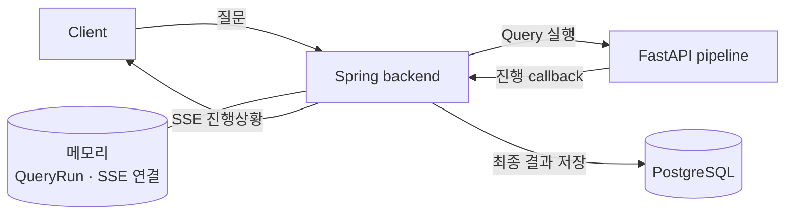
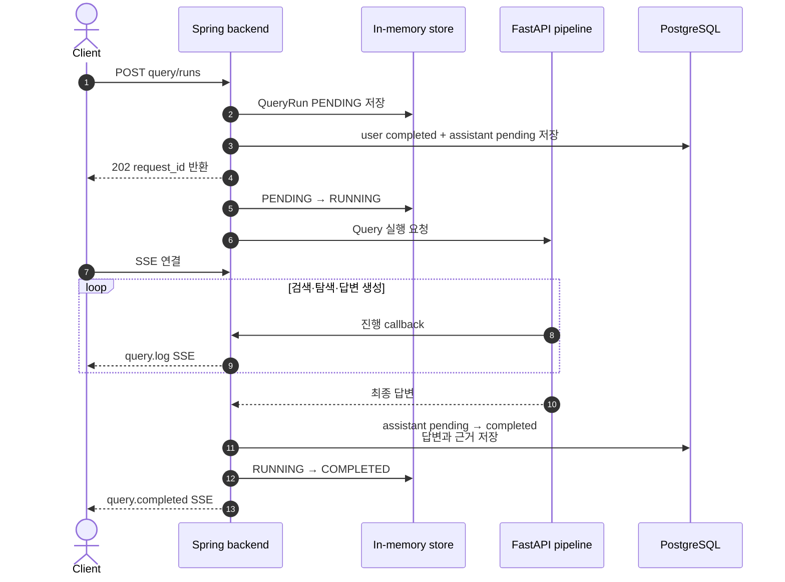
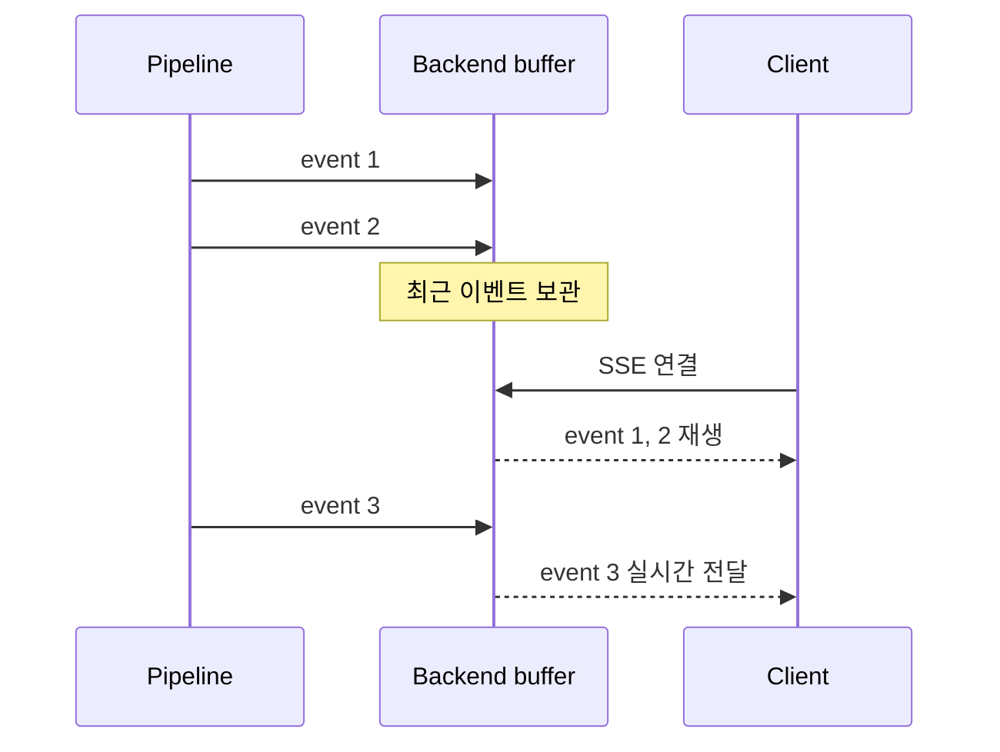
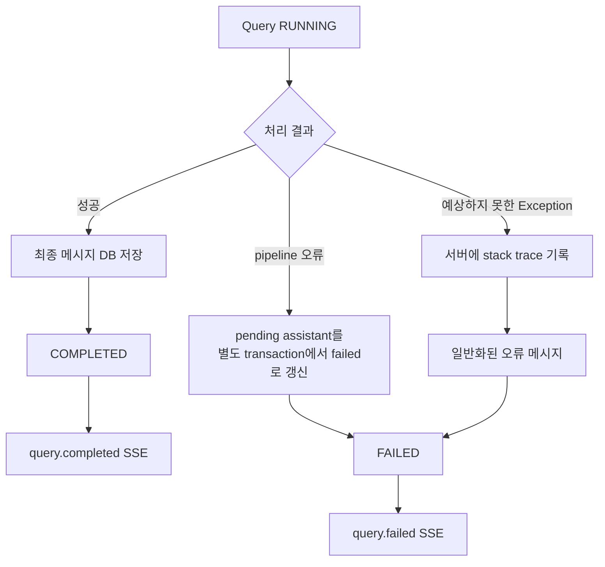
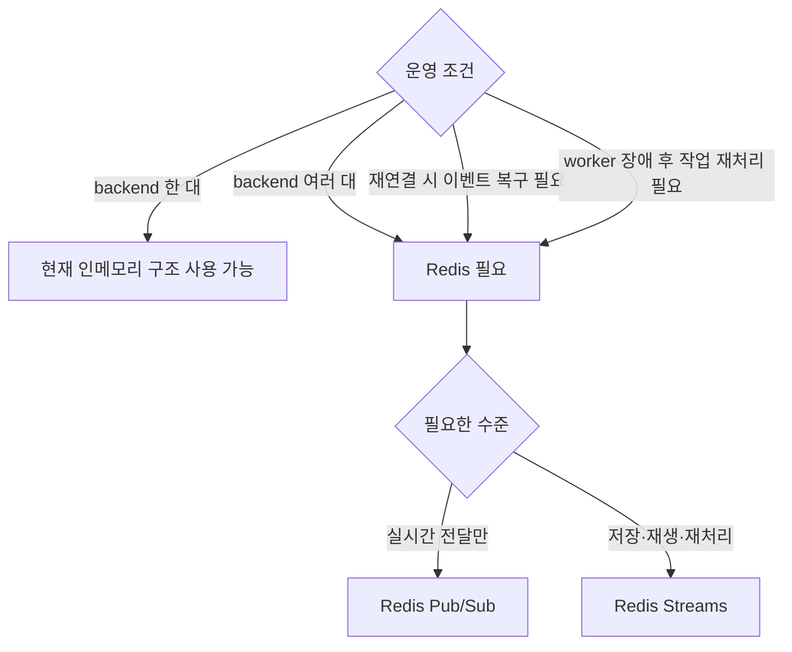
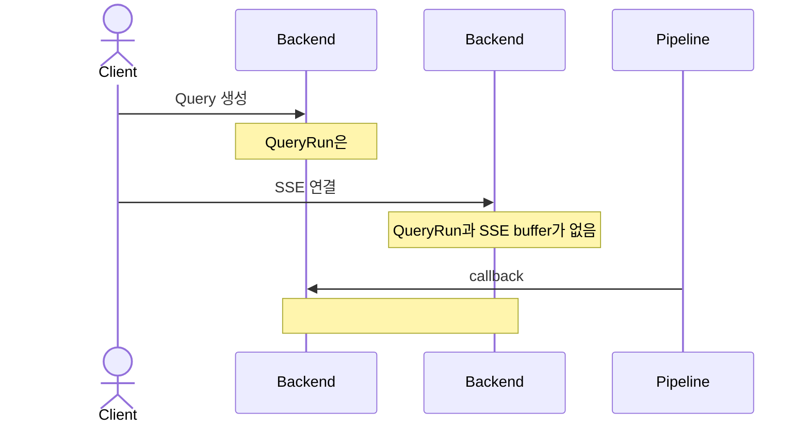
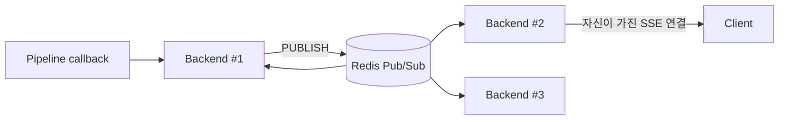
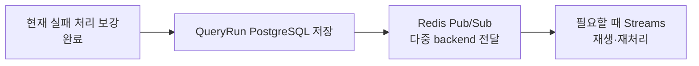

# Query 비동기 처리와 Redis 적용

> **이전 자료 안내 (2026-07-27)**: 이 문서는 인메모리 Query 실행을 Redis Pub/Sub·Streams로 확장하는 이전 설계안이다. 현재 목표 구조는 AI 작업 실행·재처리에 Kafka를 사용하고 Redis는 실시간 상태 전달에 한정하므로, [Fruition AWS MSA 목표 구조](../Fruition_AWS_MSA_Architecture.md)를 따른다.

## 1. 먼저 결론

현재 Query SSE는 **backend가 한 대일 때 정상 동작**한다.

- Query 진행 상태와 SSE 연결은 backend 메모리에 있다.
- Query 접수 시 user 메시지와 pending assistant를 PostgreSQL에 먼저 저장한다.
- pipeline 실패와 예상하지 못한 애플리케이션 오류는 `FAILED`로 처리한다.
- backend를 여러 대로 늘리거나 재시작 후 이벤트를 복구해야 한다면 Redis가 필요하다.



---

## 2. 현재 정상 흐름

사용자가 질문하면 backend는 작업을 접수하고 `request_id`를 먼저 반환한다. 실제 Query는 별도 스레드에서 실행하며, pipeline이 보내는 단계별 callback을 SSE로 중계한다.



### 어디에 무엇을 저장하는가

| 데이터 | 저장 위치 | 특징 |
|---|---|---|
| `QueryRun` 상태 | backend 메모리 | 재시작하면 사라짐 |
| SSE 연결 | 요청을 받은 backend 메모리 | 다른 backend가 접근할 수 없음 |
| 최근 진행 이벤트 | backend 메모리, 최대 200개 | 늦게 연결한 client에 재생 가능 |
| user/assistant 메시지·근거 | PostgreSQL | Query 접수 시 먼저 저장, 재시작해도 유지 |

pipeline callback이 SSE 연결보다 먼저 도착해도 최근 이벤트는 메모리 buffer에서 재생된다.



---

## 3. 현재 실패 처리

### 처리 흐름



### Pipeline 오류

pipeline timeout, 연결 실패, 4xx·5xx 응답은 `PipelineQueryException`으로 변환한다.

처리 결과는 다음과 같다.

1. Query 접수 시 user는 `completed`, assistant는 `pending`으로 이미 저장돼 있다.
2. 기존 pending assistant를 `failed`로 갱신하고 오류를 기록한다.
3. `QueryRun`을 `FAILED`로 변경한다.
4. client에 `query.failed` SSE를 전송하고 연결을 종료한다.

초기 메시지 생성과 assistant 실패 갱신은 `QueryMessageRecorder`의 별도 `REQUIRES_NEW` transaction에서 수행한다. `202`를 반환하기 전에 초기 저장을 commit하므로 SSE 연결 전에도 질문과 pending 답변을 조회할 수 있고, 원래 Query transaction이 rollback돼도 실패 상태는 유지된다.

### 예상하지 못한 오류

DB 오류나 직렬화 오류 같은 예상 밖 `Exception`도 최상위에서 처리한다.

- 자세한 stack trace는 서버 로그에만 남긴다.
- client에는 `질의 처리 중 오류가 발생했습니다.`라는 일반화된 메시지를 보낸다.
- `QueryRun`을 `FAILED`로 바꾸고 `query.failed`를 전송한다.

### SSE 연결만 끊긴 경우

SSE 연결이 끊겨도 Query 실행은 계속된다.

- 성공하면 최종 결과를 PostgreSQL에 저장한다.
- 같은 backend에 다시 연결하면 메모리에 남은 최근 이벤트를 재생할 수 있다.
- `GET /api/query/runs/{requestId}`로 최종 상태를 조회할 수 있다.

### 아직 남은 주의점

- 오래 실행되는 `RUNNING`을 timeout 처리하는 기능은 아직 없다.
- SSE heartbeat 메서드는 있지만 주기적으로 실행하는 scheduler가 없다.
- backend가 재시작되면 메모리의 run과 진행 이벤트가 사라진다.

---

## 4. Redis는 언제 필요한가

로컬 또는 backend 한 대로 운영한다면 현재 인메모리 구조로 동작할 수 있다.

Redis는 다음 요구가 생길 때 필요하다.



### 여러 backend에서 현재 구조가 실패하는 이유



`QueryRun`을 DB에 저장하면 어느 backend에서든 상태를 조회할 수 있다. 하지만 다른 backend가 가진 SSE 연결에는 여전히 접근할 수 없다. 따라서 다중 backend에서는 이벤트를 공유할 Redis 같은 중간 전달 계층이 필요하다.

---

## 5. Redis Pub/Sub을 적용하면

Pub/Sub은 여러 backend가 함께 듣는 실시간 방송 채널이다.



callback을 받은 backend가 Redis에 이벤트를 발행하면 모든 backend가 받는다. 그중 해당 SSE 연결을 가진 backend가 client에 전달한다.

### 이점

- callback과 SSE 연결이 서로 다른 backend에 있어도 전달할 수 있다.
- 현재 구조에서 비교적 변경 범위가 작다.
- 실시간 fan-out이 빠르고 단순하다.

### 주의할 점

- Pub/Sub은 이벤트를 저장하지 않는다.
- backend가 Redis 구독을 놓친 동안 발생한 이벤트는 다시 받을 수 없다.
- 전달 보장은 at-most-once이므로 최종 상태를 Pub/Sub에만 의존하면 안 된다.
- `QueryRun` 상태와 최종 결과는 PostgreSQL에 저장하고, Pub/Sub은 실시간 알림으로만 사용하는 것이 안전하다.

---

## 6. Redis Streams를 적용하면

Streams는 이벤트를 순서대로 저장하는 짧은 event log다.

```mermaid
flowchart LR
    P[Query worker] -->|XADD 진행 이벤트| R[(Redis Stream<br/>query:events:{requestId})]
    C[Client] -->|SSE + Last-Event-ID| B[어느 Backend pod]
    B -->|XREAD| R
    R -->|저장 이벤트 + 새 이벤트| B
    B -->|SSE| C
```

### 이점

- backend가 달라도 같은 event stream을 읽을 수 있다.
- client가 재연결하면 마지막 event ID 다음부터 다시 받을 수 있다.
- backend가 잠시 중단돼도 보존 기간 안의 이벤트를 복구할 수 있다.
- `MAXLEN`이나 TTL로 이벤트 보관량을 제한할 수 있다.

### 주의할 점

- Pub/Sub보다 구현과 운영이 복잡하다.
- stream을 정리하지 않으면 Redis 메모리가 계속 증가한다.
- 중복 전달 가능성을 고려해 event 처리를 멱등하게 만들어야 한다.
- SSE event를 공용 consumer group으로 읽으면 안 된다.

consumer group은 메시지를 group 안의 consumer 한 곳에만 배분한다. SSE 연결이 없는 backend가 이벤트를 가져갈 수 있기 때문에, SSE handler는 request별 stream을 consumer group 없이 독립적으로 읽는 것이 단순하다.

consumer group은 여러 worker 중 하나가 Query 작업을 가져가는 작업 queue에 적합하다.

---

## 7. 무엇을 선택할 것인가

| 상황 | 선택 |
|---|---|
| backend 한 대, 로컬 데모 | 현재 인메모리 구조 |
| backend 여러 대, 진행 로그 일부 유실 허용 | PostgreSQL + Redis Pub/Sub |
| 재연결 시 진행 로그 재생 필요 | PostgreSQL + Redis Streams |
| worker 장애 후 Query 작업 재처리 필요 | Redis Streams consumer group |

권장 도입 순서는 다음과 같다.



처음부터 모든 기능을 Streams로 만들 필요는 없다. 실시간 전달만 필요하면 Pub/Sub으로 시작하고, 이벤트 유실이나 작업 재처리가 실제 요구가 될 때 Streams로 확장할 수 있다.

---

## 8. 발표용 마무리

> 현재 구조는 한 backend 안에서는 정상 동작한다. 실패하면 DB에 실패 기록을 남기고 `query.failed`로 종료한다. backend를 여러 대로 늘리면 메모리를 공유할 수 없으므로 Redis가 필요하다. 실시간 전달만 필요하면 Pub/Sub, 이벤트 저장과 재생까지 필요하면 Streams를 선택한다.

핵심 역할은 다음처럼 기억하면 된다.

```text
PostgreSQL = 최종 상태와 결과
Redis      = backend 사이의 이벤트 전달과 보존
SSE        = 사용자 화면으로 실시간 전달
```

## 참고

- 현재 API 상세: `docs/spec/api/query.md`
- 실패 처리 기록: `docs/issue/2026-07-21.md`의 `Query 비동기 실패 기록 rollback과 RUNNING 고착`
- [Redis Pub/Sub 공식 문서](https://redis.io/docs/latest/develop/pubsub/)
- [Redis Streams 공식 문서](https://redis.io/docs/latest/develop/data-types/streams/)
