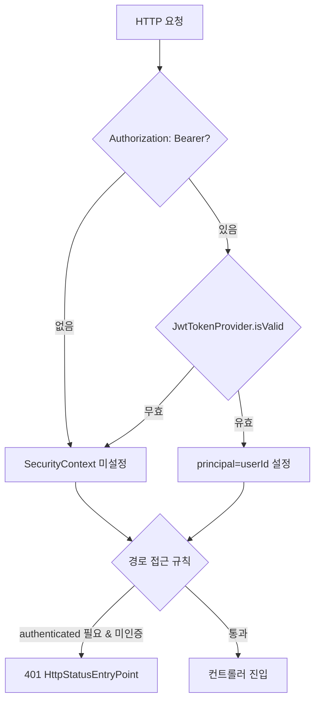
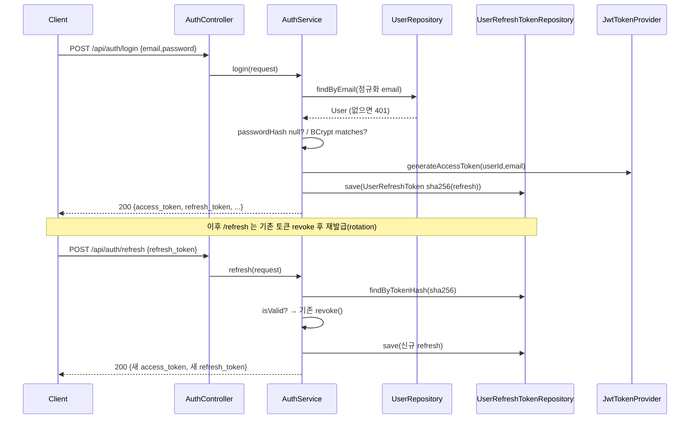

# API 공통 인프라 (재구성 스펙)

이 문서는 모든 도메인 API가 전제하는 **공통 기반**을 담는다. 각 도메인 페이지(`auth.md`, `document.md`, `ai-operation-log.md` 등)는 이 문서를 참조 전제로 하며, 이 문서 하나만으로도 인증·보안·예외·응답 규약을 코드로 재구성할 수 있도록 작성한다.

- 대상: Spring Boot 3 / Java 17, JPA(Hibernate) + Flyway, Spring Security 6
- 컨트롤러 공통: `@RestController`, 도메인별 `@RequestMapping` prefix, 응답은 `ResponseEntity<...>`
- 외부 파이프라인: FastAPI(llmPipeline)를 `RestClient`로 호출 (문서/쿼리 도메인에서 상세)

---

## 1. 공통 관례

| 항목 | 규칙 | 근거 |
|---|---|---|
| ID 형식 | `user_`/`doc_`/`chatdoc_`/`session_`/`query_` + `UUID`(하이픈 제거) | 각 서비스 생성부 |
| 이메일 정규화 | `trim().toLowerCase()` 후 저장·조회 | `UserService`, `AuthService` |
| displayName 결정 | `DisplayNames.resolve(요청값, email)` — 있으면 trim, 없으면 email 앞부분, 최대 50자 | `util/DisplayNames` |
| 해시 유틸 | `sha256(value)` = SHA-256 → `HexFormat` hex 문자열 | `AuthService.sha256`, `DocumentService.sha256` |
| 비밀번호 해시 | `BCryptPasswordEncoder` (`PasswordEncoder` 빈) | `SecurityConfig.passwordEncoder` |

## 2. 인증 · 토큰 모델

- **access token**: JWT(HS256). `subject=userId`, `claim.email`, 만료 `app.jwt.access-token-expiration-seconds`(기본 900s). 서명 키 `app.jwt.secret`. → `JwtTokenProvider`
- **refresh token**: 서버 생성 32바이트 난수의 URL-safe Base64(=opaque). **DB에는 원문이 아니라 `sha256(refresh)` 해시만 저장**. 만료 `app.jwt.refresh-token-expiration-seconds`(기본 1209600s=14일). → `AuthService.issueTokenPair`
- **저장 테이블** `user_refresh_tokens`: `token_hash`, `expires_at`, `revoked_at`. `isValid() = revoked_at IS NULL && expires_at > now`.

### 요청 인증 필터

`JwtAuthenticationFilter`(OncePerRequestFilter, `UsernamePasswordAuthenticationFilter` 앞에 등록):
1. `Authorization: Bearer <token>` 헤더 파싱.
2. `JwtTokenProvider.isValid(token)` 통과 시 `subject`(userId)를 principal로 한 `UsernamePasswordAuthenticationToken`을 SecurityContext에 저장(권한 목록은 빈 리스트).
3. 무효/부재면 인증 미설정으로 통과 → 접근 제어는 SecurityConfig가 담당.
4. 컨트롤러는 `@AuthenticationPrincipal String userId`로 principal(userId)을 주입받는다.

## 3. 접근 제어 (`SecurityConfig`)

- CSRF 비활성, formLogin/httpBasic 비활성, CORS는 `app.cors.allowed-origins` 기준 `/api/**`에 적용(허용 메서드 GET/POST/PATCH/DELETE/OPTIONS).
- 세션 정책 `IF_REQUIRED` (OAuth2 로그인 redirect에 임시 세션 필요, STATELESS 아님).
- 미인증 진입점 `HttpStatusEntryPoint(401)`.

| 경로 패턴 | 접근 |
|---|---|
| `/actuator/health` | permitAll |
| `/api/auth/me` | **authenticated** |
| `/api/workspaces/**` | **authenticated** |
| 그 외 전부(`/api/auth/**` 나머지, `/api/documents/**`, `/api/query/runs/**`, `/api/ai-operations/**`) | permitAll |

> ⚠️ 현재 파이프라인 콜백 계열(`/api/documents/**`, `/api/query/runs/**`)은 인증이 걸려 있지 않다. `SecurityConfig` line 63 TODO: Phase 5에서 authenticated 전환 예정.
>
> `/api/ai-operations/**`(llmPipeline 작업 결과 콜백)는 Spring Security 대신 **컨트롤러에서 `X-Internal-Token` 헤더를 상수 시간 비교**해 검증한다. 사용자 인증과 분리된 내부 토큰이며, 검증을 통과하기 전에는 저장소 객체를 읽지 않는다. → [`ai-operation-log.md` §4.1](./ai-operation-log.md)

## 4. 예외 → HTTP 매핑 (전역)

`util/GlobalExceptionHandler`(`@RestControllerAdvice`)가 예외를 상태코드+에러코드로 변환한다.

| 예외 | HTTP | 에러 code |
|---|---|---|
| `MethodArgumentNotValidException`(Bean Validation) | 400 | `INVALID_REQUEST` (+ field details) |
| `MultipartException` | 400 | `INVALID_REQUEST` |
| `DuplicateEmailException` | 409 | `DUPLICATE_EMAIL` |
| `InvalidCredentialsException` | 401 | `INVALID_CREDENTIALS` |
| `InvalidRefreshTokenException` | 401 | `INVALID_REFRESH_TOKEN` |
| `InvalidOAuthCodeException` | 401 | `INVALID_OAUTH_CODE` |
| `OAuthEmailNotProvidedException` | 400 | `OAUTH_EMAIL_NOT_PROVIDED` |
| `UserNotFoundException` | 404 | `USER_NOT_FOUND` |
| `WorkspaceNotFoundException` | 404 | `WORKSPACE_NOT_FOUND` |
| `DocumentNotFoundException` | 404 | `DOCUMENT_NOT_FOUND` |
| `DocumentOriginalNotFoundException` | 404 | `DOCUMENT_ORIGINAL_NOT_FOUND` |
| `InvalidDocumentFilenameException` | 400 | `INVALID_DOCUMENT_FILENAME` |
| `DuplicateDocumentException` | 409 | `DOCUMENT_ALREADY_EXISTS` |
| `DocumentUploadException` | 500 | `INTERNAL_SERVER_ERROR` |
| `ChatSessionNotFoundException` | 404 | `CHAT_SESSION_NOT_FOUND` |
| `ChatSessionLimitExceededException` | 409 | `CHAT_SESSION_LIMIT_EXCEEDED` |
| `EmptyChatWikiExportException` | 400 | `EMPTY_CHAT_WIKI_EXPORT` |
| `InvalidChatWikiExportRequestException` | 400 | `INVALID_CHAT_WIKI_EXPORT_REQUEST` |
| `WikiPageNotFoundException` | 404 | `WIKI_PAGE_NOT_FOUND` |
| `InvalidWikiPageTitleException` | 400 | `INVALID_WIKI_PAGE_TITLE` |
| `WikiPageSlugConflictException` | 409 | `WIKI_PAGE_SLUG_CONFLICT` |
| `PipelineQueryException` | 예외의 `httpStatus` | 예외의 `errorCode` |
| `QueryRunNotFoundException` | 404 | `QUERY_RUN_NOT_FOUND` |
| `WikiPageVersionNotFoundException` | 404 | `WIKI_PAGE_VERSION_NOT_FOUND` |
| `OperationNotFoundException` | 404 | `AI_OPERATION_NOT_FOUND` |
| `InvalidRestoreRequestException` | 400 | `INVALID_RESTORE_REQUEST` |
| `RestorePreviewStaleException` | 409 | `RESTORE_PREVIEW_STALE` |
| `OperationPayloadConflictException` | 409 | `AI_OPERATION_PAYLOAD_CONFLICT` |
| `InvalidCallbackTokenException` | 401 | `INVALID_CALLBACK_TOKEN` |
| `InvalidCallbackPayloadException` | 422 | `INVALID_CALLBACK_PAYLOAD` |

> 위 표는 이 문서가 다루는 범위의 매핑만 담는다. 실제 `GlobalExceptionHandler`에는 문서 잠금·버전 충돌 등 도메인별 예외가 더 있으며 각 도메인 페이지에서 다룬다.

### 에러 응답 포맷 (`util/ErrorResponse`)

```json
{ "error": { "code": "INVALID_CREDENTIALS", "message": "...", "details": null } }
```
- 검증 실패 시 `details`에 `[{ "field": "...", "reason": "..." }]` 포함, code는 `INVALID_REQUEST`.
- `details`는 null이면 응답에서 생략(`@JsonInclude(NON_NULL)`).

## 5. 설정 키

| 키 | 기본값(env) | 용도 |
|---|---|---|
| `app.jwt.secret` | `JWT_SECRET` | access token 서명 키(HS256, 32바이트+) |
| `app.jwt.access-token-expiration-seconds` | `900` | access 만료 |
| `app.jwt.refresh-token-expiration-seconds` | `1209600` | refresh 만료 |
| `app.oauth.frontend-redirect-uri` | `http://localhost:3000/oauth/callback` | OAuth 성공 후 code 부착 redirect |
| `app.cors.allowed-origins` | `http://localhost:3000` | CORS 허용 origin |
| `app.callback.base-url` | `http://host.docker.internal:8080` | 파이프라인 콜백이 되돌아올 backend base URL |
| `app.internal.callback-token` | `INTERNAL_CALLBACK_TOKEN` | llmPipeline 작업 결과 콜백 인증용 공유 시크릿 |
| `app.aihistory.ingest-logging-enabled` | `false` | ingest를 AI 작업 로그에 등록할지. llmPipeline 스키마가 준비되면 켠다 |
| `app.wiki-restore.endpoint` | `http://localhost:8000/wiki/restore-runs` | 복구 조립 지시서 전송 대상 |

## 6. 공통 흐름 시각화

### 요청 인증(Bearer) 처리



### 로그인 → 토큰 발급/재발급(rotation)


