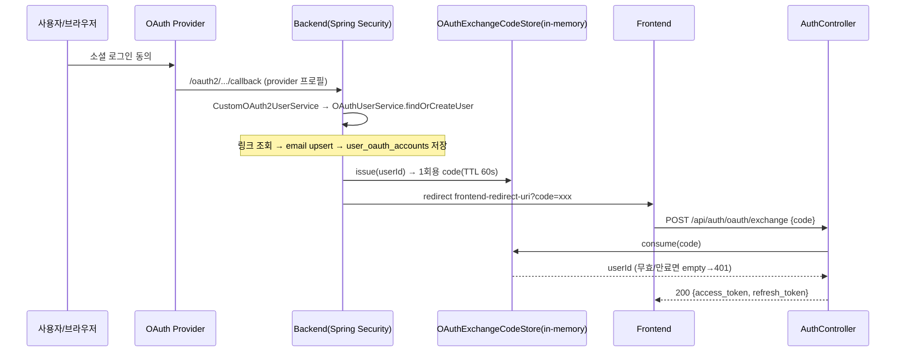

# auth 도메인 API (재구성 스펙)

`/api/auth` — 회원가입 및 인증. 공통 인프라(토큰/필터/예외/설정)는 [`00-common.md`](./00-common.md) 참조.

- 컨트롤러: `user/controller/AuthController.java`
- 서비스: `user/service/AuthService.java`, `user/service/UserService.java`, `user/service/OAuthUserService.java`
- OAuth: `security/oauth/**`, `security/SecurityConfig.java`

## 데이터 모델

| 테이블 | 핵심 컬럼 | 비고 |
|---|---|---|
| `users` | `id`(PK), `email`(unique, not null), `display_name`, `password_hash`(**nullable**), `created_at`, `updated_at` | `password_hash=null` ⇒ OAuth 전용 계정(비밀번호 로그인 불가) |
| `user_refresh_tokens` | `id`(PK), `user_id`, `token_hash`, `expires_at`, `revoked_at`(nullable) | `isValid()=revoked_at IS NULL && expires_at>now` |
| `user_oauth_accounts` | `id`(PK), `user_id`, `provider`, `provider_user_id`, `created_at` | (provider, provider_user_id) 링크 |
| `email_verifications` | `id`(PK, =`verification_id`), `email`, `purpose`(`signup`\|`password_reset`), `code_hash`, `code_expires_at`, `attempt_count`, `confirmed_at`(nullable), `token_hash`(nullable), `token_expires_at`(nullable), `consumed_at`(nullable), `created_at` | 인증번호·`verification_token`은 **SHA-256 해시만 저장**. 새 코드 발급 시 같은 (email, purpose)의 미소비 코드 폐기 |

---

## 엔드포인트

### `POST /api/auth/email-verifications` — 인증번호 발급

- 인증: 불필요(permitAll)
- 요청 `EmailVerificationRequest`: `email`(@NotBlank @Email), `purpose`(@NotBlank, `signup`|`password_reset`)
- 응답 202 `EmailVerificationResponse`: `verification_id`, `expires_in`(코드 만료초), `retry_after`(재요청 cooldown초)
- 에러: 검증 400 `INVALID_REQUEST` / (`signup` 전용) 중복 409 `DUPLICATE_EMAIL` / cooldown·일일 상한 초과 429 `VERIFICATION_RATE_LIMITED`

흐름 (`EmailVerificationService.request`, @Transactional):
1. `email = trim().toLowerCase()`.
2. `purpose=signup` && `existsByEmail` → `DuplicateEmailException`(409, 존재 노출 허용). `password_reset`은 계정 존재 여부와 무관하게 동일 진행(존재 무노출).
3. cooldown: 같은 `(email, purpose)` 최근 발급이 `resend-cooldown-seconds` 이내면 429.
4. 일일 상한: 같은 `(email, purpose)` 24h 내 발급 수 ≥ `daily-limit`면 429.
5. 같은 `(email, purpose)`의 미소비 이전 코드를 만료 처리(기존 번호 폐기).
6. 6자리 코드 생성(`dev-fixed-code` 설정 시 그 값) → `code_hash=sha256(code)` 저장, `EmailVerificationSender.send`로 발송(dev: 로그 stub).
7. 202 반환.

### `POST /api/auth/email-verifications/{verification_id}/confirm` — 인증번호 검증

- 인증: 불필요
- 요청 `VerificationConfirmRequest`: `code`(@NotBlank)
- 응답 200 `VerificationConfirmResponse`: `verification_token`(1회용), `expires_in`(토큰 만료초)
- 에러: 부재 404 `VERIFICATION_NOT_FOUND` / 코드 불일치 400 `INVALID_VERIFICATION_CODE` / 만료 400 `VERIFICATION_CODE_EXPIRED` / 시도 초과 400 `VERIFICATION_CODE_ATTEMPTS_EXCEEDED`

흐름 (`EmailVerificationService.confirm`, @Transactional):
1. `findById(verification_id)`, 없으면 404.
2. 이미 소비됨(`consumed_at`) → `INVALID_VERIFICATION_CODE`.
3. `attempt_count >= max-attempts` → `VERIFICATION_CODE_ATTEMPTS_EXCEEDED`.
4. `code_expires_at < now` → `VERIFICATION_CODE_EXPIRED`.
5. `sha256(code) != code_hash` → `attempt_count++` 저장 후 `INVALID_VERIFICATION_CODE`.
6. 일치 → `confirmed_at` 기록, opaque `verification_token` 발급(`token_hash=sha256`, `token_expires_at=now+token-ttl`) → 200.

### `POST /api/auth/signup` — 회원가입

- 인증: 불필요(permitAll)
- 요청 `SignupRequest`: `email`(@NotBlank @Email), `password`(@NotBlank @Size 8~72), `display_name`(옵션, @Size ≤50), **`verification_token`(@NotBlank, 인증번호 검증에서 발급받은 1회용 토큰)**
- 응답 201 `SignupResponse`: `id`, `email`, `display_name`, `created_at`
- 에러: 검증 400 `INVALID_REQUEST` / 중복 409 `DUPLICATE_EMAIL` / 토큰 무효·만료·불일치 400 `INVALID_VERIFICATION_TOKEN`

흐름 (`UserService.signup`, @Transactional):
1. `email = trim().toLowerCase()`.
2. `existsByEmail(email)` → true면 `DuplicateEmailException`(토큰 소비 전 검사 → 유효 토큰 낭비 방지).
3. **`consumeForSignup(email, verification_token)`**: `purpose=signup`·email 일치·미소비·미만료 검증 후 `consumed_at` 기록. 실패 시 `INVALID_VERIFICATION_TOKEN`.
4. `displayName = DisplayNames.resolve(request.displayName(), email)`.
5. `id = "user_"+UUID`, `password_hash = BCrypt.encode(password)` → `users` 저장.
6. **`WorkspaceService.createDefault(userId, displayName)`** — 같은 트랜잭션에서 기본 워크스페이스 생성.
7. 201 반환.

### `POST /api/auth/password-reset` — 비밀번호 재설정

- 인증: 불필요(`verification_token`으로 검증)
- 요청 `PasswordResetRequest`: `email`(@NotBlank @Email), `new_password`(@NotBlank @Size 8~72), `verification_token`(@NotBlank)
- 응답 204 No Content
- 에러: 검증 400 `INVALID_REQUEST` / 토큰 무효·만료·불일치 400 `INVALID_VERIFICATION_TOKEN`

흐름 (`AuthService.resetPassword`, @Transactional):
1. `email` 정규화 → `consumeForPasswordReset(email, token)`: `findByTokenHash` → `purpose=password_reset`·email 일치·미소비·미만료 검증, 실패 시 `INVALID_VERIFICATION_TOKEN`. 성공 시 `consumed_at` 기록.
2. `findByEmail` — 없으면 `INVALID_VERIFICATION_TOKEN`(존재 무노출, 정상 흐름에선 도달 불가).
3. `user.changePassword(BCrypt.encode(new_password))`.
4. 해당 사용자의 미폐기 refresh token 전체 `revoke()`.
5. 204 반환.

### `POST /api/auth/login` — 로그인

- 인증: 불필요
- 요청 `LoginRequest`: `email`(@NotBlank), `password`(@NotBlank)
- 응답 200 `LoginResponse`: `access_token`, `refresh_token`, `token_type`("Bearer"), `expires_in`(access 만료 초)
- 에러: 401 `INVALID_CREDENTIALS`(사유 무관 동일 — 사용자 열거 방지)

흐름 (`AuthService.login`, @Transactional):
1. email 정규화 → `findByEmail`, 없으면 401.
2. `password_hash == null`(OAuth 전용) → 401.
3. `passwordEncoder.matches(password, hash)` 실패 → 401.
4. `issueTokenPair(user)` → 200.

### `POST /api/auth/refresh` — 토큰 재발급(rotation)

- 인증: 불필요(본문 refresh로 검증)
- 요청 `RefreshRequest`: `refresh_token`(@NotBlank)
- 응답 200 `LoginResponse`(새 access + 새 refresh)
- 에러: 401 `INVALID_REFRESH_TOKEN`

흐름 (`AuthService.refresh`, @Transactional):
1. `findByTokenHash(sha256(refresh_token))`, 없으면 401.
2. `isValid()`(미폐기 && 미만료) 실패 → 401.
3. **기존 토큰 `revoke()`** → `findById(userId)` → `issueTokenPair`로 새 쌍 발급. (1회성, 재사용 차단)

### `POST /api/auth/logout` — 로그아웃

- 요청 `RefreshRequest`: `refresh_token`(@NotBlank)
- 응답 204 No Content / 에러 401 `INVALID_REFRESH_TOKEN`
- 흐름: `findByTokenHash(sha256)` → `revoke()`. access token은 무상태라 만료까지 유효(별도 폐기 없음).

### `POST /api/auth/oauth/exchange` — OAuth code 교환

- 요청 `OAuthExchangeRequest`: `code`(@NotBlank)
- 응답 200 `LoginResponse` / 에러 401 `INVALID_OAUTH_CODE`(무효·만료·사용자 부재)
- 흐름 (`AuthService.exchangeOAuthCode`, @Transactional): `OAuthExchangeCodeStore.consume(code)`(1회용, TTL 60s, in-memory) → userId → `findById` → `issueTokenPair`.

### `GET /api/auth/me` — 내 정보

- 인증: **필요**(authenticated). `@AuthenticationPrincipal String userId` 주입.
- 응답 200 `MeResponse`: `id`, `email`, `display_name`, `created_at` / 미인증 401 / 사용자 부재 404 `USER_NOT_FOUND`
- 흐름 (`AuthService.me`): `findById(userId)` → 매핑.

---

## 토큰 발급 공통 — `issueTokenPair(user)`

1. `accessToken = JwtTokenProvider.generateAccessToken(userId, email)`.
2. `refreshValue = URL-safe Base64(SecureRandom 32B)`; `expiresAt = now + refresh 만료`; `user_refresh_tokens`에 `sha256(refreshValue)` 저장.
3. `LoginResponse(accessToken, refreshValue, "Bearer", access 만료초)`.

---

## OAuth 로그인 선행 흐름 (`/oauth2/**`)

`/api/auth/oauth/exchange`는 아래 소셜 로그인 성공 이후 발급된 code를 교환하는 단계다.

`CustomOAuth2UserService.loadUser` → `OAuthUserService.findOrCreateUser(provider, userInfo)`:
1. `(provider, provider_user_id)` 링크 존재 → 연결된 user 반환.
2. 없으면 email 필수(없으면 `OAuthEmailNotProvidedException` 400). email 정규화.
3. email로 기존 user 조회 → 없으면 `createUser`(`password_hash=null`, `WorkspaceService.createDefault` 호출).
4. `user_oauth_accounts`에 링크 저장.

성공 후 `OAuth2AuthenticationSuccessHandler`: `OAuthExchangeCodeStore.issue(userId)`로 1회용 code 발급 → `app.oauth.frontend-redirect-uri`에 `?code=` 부착해 redirect.

---

## 이메일 인증 설정 (`application.properties`)

| 키 | 기본값 | 설명 |
|---|---|---|
| `app.auth.email-verification.code-ttl-seconds` | 300 | 인증번호 만료초 |
| `app.auth.email-verification.token-ttl-seconds` | 600 | `verification_token` 만료초 |
| `app.auth.email-verification.resend-cooldown-seconds` | 60 | 재요청 cooldown |
| `app.auth.email-verification.daily-limit` | 5 | (email, purpose) 24h 발급 상한 |
| `app.auth.email-verification.max-attempts` | 5 | 코드 오입력 허용 횟수 |
| `app.auth.email-verification.dev-fixed-code` | (빈값) | 로컬 개발용 고정 코드(예: `9700`). 빈값이면 랜덤. **운영 비활성** |

## 정합성 · 주의점

- **refresh rotation 정상**: 조회 → 검증 → 기존 revoke → 신규 발급. 유출된 옛 refresh 재사용 차단.
- **사용자 열거 방지**: login 실패는 사유(unknown_email/password_login_unavailable/password_mismatch)와 무관하게 동일 401. `password_reset` 인증 발급도 계정 존재 여부와 무관하게 동일 202.
- **회원가입은 의도적 존재 노출**: `signup` 인증 발급·최종 가입 모두 중복 이메일에 409 `DUPLICATE_EMAIL`. rate limit·감사 로그 병행.
- **인증 토큰 1회성**: `verification_token`은 `token_hash`만 저장, `consumed_at`으로 재사용 차단. 비밀번호 재설정 성공 시 해당 사용자 refresh token 전체 폐기.
- **OAuth 전용 계정**(`password_hash=null`)은 비밀번호 로그인 불가로 명시 처리.
- ⚠️ `LoggingEmailVerificationSender`(dev stub)는 인증번호를 로그로 출력한다. **운영 배포 전 실제 발송 sender로 교체** 필요.
- ⚠️ `OAuthExchangeCodeStore`는 in-memory(`ConcurrentHashMap`) — 단일 인스턴스 전제. 다중 인스턴스 확장 시 code 발급/교환 인스턴스 불일치로 실패 가능(공유 저장소 필요).
- 만료·폐기된 refresh row, 소비·만료된 `email_verifications` row 정리(삭제) 로직 없음 — 누적. 기능엔 무해하나 장기 정리 필요.
