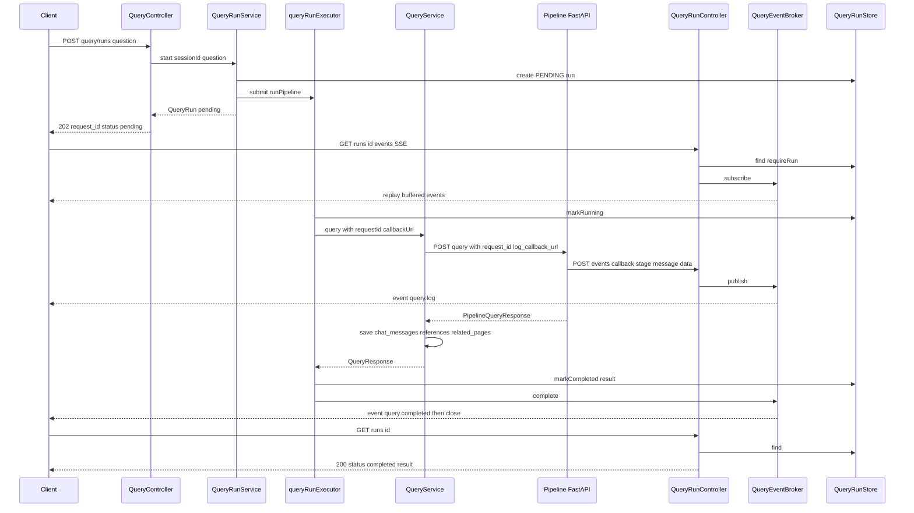
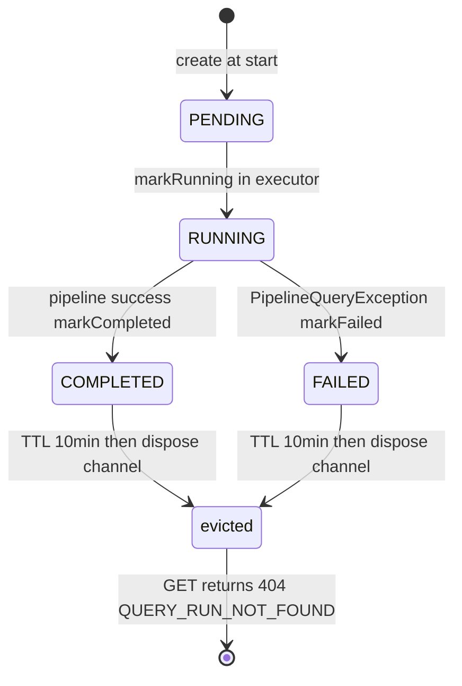

# query 도메인 API (재구성 스펙)

Wiki 기반 자연어 질의(Query) 도메인의 동기·비동기 API 상세 스펙이다. 사용자의 질문을 FastAPI 쿼리 파이프라인으로 전달해 답변·근거·관련 Wiki 페이지·그래프 경로를 생성하고, 그 결과를 `chat_messages` 및 부속 테이블에 저장한다. 비동기 모드는 진행 로그를 SSE로 스트리밍한다.

공통 인프라(인증/CORS/에러 응답 포맷/`ErrorResponse` 등)는 [`00-common.md`](./00-common.md)를 따르며 여기서 반복하지 않는다.

구성 파일 경로:
- `query/controller/QueryController.java` — 동기 `POST /query`, 비동기 `POST /query/runs`
- `query/controller/QueryRunController.java` — SSE 구독, 파이프라인 callback, run 상태 조회
- `query/service/QueryService.java` — 파이프라인 호출 및 DB 저장(`@Transactional`)
- `query/service/QueryRunService.java` — 비동기 run 실행(executor 백그라운드), TTL cleanup 스케줄
- `query/service/QueryRunStore.java` — in-memory run 저장소(TTL 만료)
- `query/service/QueryEventBroker.java` — SSE emitter 관리, `request_id`별 이벤트 buffer
- `query/repository/PipelineQueryRequester.java` — FastAPI 파이프라인 `RestClient` 호출
- `query/repository/PipelineQueryResponse.java` — 파이프라인 응답 모델
- `query/domain/QueryRun.java`, `QueryRunStatus.java` — run 상태 record/enum
- `query/dto/` — `QueryRequest`, `QueryResponse`, `QueryRunCreateResponse`, `QueryRunStatusResponse`, `PipelineEventCallbackRequest`
- `query/exception/` — `PipelineQueryException`, `QueryRunNotFoundException`
- `query/config/QueryAsyncConfig.java` — `Clock`, `queryRunExecutor` 빈

---

## 데이터 모델

### QueryRun (in-memory)

`QueryRun`은 **DB 엔티티가 아니라 in-memory record**다. `QueryRunStore`의 `ConcurrentHashMap<String, QueryRun>`에만 존재하며, 완료 후 TTL(10분) 경과 시 제거된다. 애플리케이션 재시작 시 전부 소실된다.

| 필드 | 타입 | 설명 |
|---|---|---|
| `requestId` | `String` | run 식별자. `"query_" + UUID` 형식 |
| `sessionId` | `String` | 대상 채팅 세션 ID |
| `status` | `QueryRunStatus` | `PENDING` / `RUNNING` / `COMPLETED` / `FAILED` |
| `question` | `String` | 질문 원문 |
| `result` | `QueryResponse` | 완료 시에만 채워짐(그 외 `null`) |
| `errorMessage` | `String` | 실패 시에만 채워짐(그 외 `null`) |
| `createdAt` | `Instant` | 생성 시각(`clock.instant()`) |
| `completedAt` | `Instant` | 완료/실패 시각. TTL 만료 판정 기준 |

`isFinished()` = `status == COMPLETED || status == FAILED`.

### DB 저장 관계 (동기·비동기 공통, `QueryService.query`가 수행)

한 번의 질의는 `pairId`(UUID) 하나로 묶인 user/assistant 메시지 2건과 그 부속 근거·관련 페이지를 저장한다. assistant 메시지에만 references / related_pages가 연결된다.

| 테이블 | 엔티티 | 저장 시점/내용 | FK |
|---|---|---|---|
| `chat_messages` | `ChatMessage` | user 메시지(`role="user"`, id `chat_user_<UUID>`) + assistant 메시지(`role="assistant"`, id `chat_assistant_<UUID>`). 동일 `pairId`. 성공 시 `status="completed"`, 파이프라인 실패 시 두 건 모두 `status="failed"`, `error_message`에 파이프라인 에러 본문(최대 255자) | `session_id` → `chat_sessions` (CASCADE) |
| `chat_message_references` | `ChatMessageReference` | assistant 메시지의 근거. `PipelineQueryResponse.evidenceSnippets` 각 항목 → `reference_type="source_block"`, `document_id`, `rank`, `source_block_ids`(JSON), `quote`, `source_refs`(JSON, 다중 문서 참조). `sourceDocumentId==null` 또는 `text`가 blank면 스킵 | `chat_message_id` → `chat_messages` (CASCADE) |
| `chat_message_related_pages` | `ChatMessageRelatedPage` | assistant 메시지의 관련 Wiki 페이지. `PipelineQueryResponse.relatedPages` 각 항목 → `wiki_page_id`(=`rp.id`), `page_type`, `title`, `slug`, `relevance_score`, `role`, `depth`, `rank`(1부터 순번) | `chat_message_id` → `chat_messages` (CASCADE) |

저장 후 `ChatSession.touchLastMessageAt(now)`로 세션 `lastMessageAt`을 갱신한다.

---

## 엔드포인트

동기/비동기 질의 생성 엔드포인트는 `@RequestMapping("/api/workspaces/{workspace_id}/chat/sessions/{session_id}")` 하위이고, run 조작 엔드포인트는 `@RequestMapping("/api/query/runs")` 하위다.

### `POST /api/workspaces/{workspace_id}/chat/sessions/{session_id}/query` — 동기 질의

- **인증**: 필요. `/api/workspaces/**`는 `authenticated()`이며, `chatSessionService.verifyOwnedSession(workspaceId, userId, sessionId)`로 세션 소유권을 검증한다(`userId`는 `@AuthenticationPrincipal`).
- **path**: `workspace_id`, `session_id`
- **요청 DTO** `QueryRequest`:

  | 필드 | 타입 | 검증 |
  |---|---|---|
  | `question` | `String` | `@NotBlank` — "질문은 비어 있을 수 없습니다." |

- **응답**: `200 OK`, body `QueryResponse`

  | 필드(JSON) | 타입 | 설명 |
  |---|---|---|
  | `user_message` | `MessageSummary` | `id`, `role`, `content`, `status`, `created_at` |
  | `assistant_message` | `MessageSummary` | 동일 구조. `content`=파이프라인 `answer` |
  | `related_pages` | `List<RelatedPage>` | `id`, `page_type`, `title`, `slug`, `relevance_score`, `role`, `depth` |
  | `evidence_snippets` | `List<EvidenceSnippet>` | `rank`, `source_document_id`, `source_block_ids`, `source_refs`(`[{source_document_id, source_block_id}]`, 다중 문서 참조), `text` |
  | `graph_context` | `GraphContext` | `nodes: List<RelatedPage>`, `edges: List<GraphEdge>` |
  | `traversal_paths` | `List<TraversalPath>` | `path_id`, `role`, `used_for_answer`, `score`, `stop_reason`, `nodes`, `edges` |

  `GraphEdge`: `from_page_id`, `to_page_id`, `link_type`, `role`, `score`.

- **에러**:

  | 예외 | status | errorCode |
  |---|---|---|
  | `question` 공백 (`@Valid` 실패) | 400 | 공통 검증 핸들러 |
  | 세션 미존재 `ChatSessionNotFoundException` | 404 | 공통(chat 도메인) |
  | 파이프라인 4xx 응답 `PipelineQueryException("PIPELINE_ERROR", 502, body)` | 502 | `PIPELINE_ERROR` |
  | 파이프라인 5xx 응답 `PipelineQueryException("PIPELINE_UNAVAILABLE", 503, body)` | 503 | `PIPELINE_UNAVAILABLE` |
  | 파이프라인 타임아웃/연결 실패 `PipelineQueryException("PIPELINE_TIMEOUT", 503, null)` | 503 | `PIPELINE_TIMEOUT` |

  `PipelineQueryException`은 `GlobalExceptionHandler`가 예외의 `httpStatus`/`errorCode`/`message`를 그대로 `ErrorResponse`로 반환한다.

- **흐름** (`@Transactional` 경계는 `QueryService.query` 전체):
  1. `QueryController.query` → `verifyOwnedSession`
  2. `QueryService.query(sessionId, question)` → `query(sessionId, question, null, null)` (requestId/callbackUrl 없음)
  3. 세션 조회 → `pairId`/메시지 ID 생성
  4. `PipelineQueryRequester.query(question)`로 FastAPI 호출(`request_id`, `log_callback_url` 미포함)
  5. 성공: user/assistant 메시지 저장 → references/related_pages 저장 → 세션 touch → `QueryResponse` 반환
  6. 실패(`PipelineQueryException`): user/assistant 메시지를 `status="failed"`로 저장 후 예외 재던짐(저장 후 그대로 throw)

### `POST /api/workspaces/{workspace_id}/chat/sessions/{session_id}/query/runs` — 비동기 질의 시작

- **인증**: 필요(`/api/workspaces/**`). `verifyOwnedSession` 수행.
- **path/요청 DTO**: 동기와 동일(`QueryRequest`, `question @NotBlank`)
- **응답**: `202 Accepted`, body `QueryRunCreateResponse`

  | 필드(JSON) | 타입 | 값 |
  |---|---|---|
  | `request_id` | `String` | `"query_<UUID>"` |
  | `status` | `String` | 최초 `"pending"` (enum 소문자) |

- **에러**: `question` 공백 → 400, 세션/워크스페이스 미존재 → 404. (파이프라인 오류는 이 응답 이후 백그라운드에서 발생하므로 202 응답에는 나타나지 않는다.)

- **흐름**:
  1. `QueryController.createRun` → `verifyOwnedSession`
  2. `QueryRunService.start(sessionId, question)` → `QueryRunStore.create`로 `PENDING` run 저장
  3. `queryRunExecutor.execute(...)`로 `runPipeline`을 **백그라운드 스레드**에 제출(스레드명 `query-run-*`, core 2 / max 8 / queue 50)
  4. 즉시 `202`와 `request_id` 반환. 이후 진행은 SSE(GET `/events`)로 관찰
  5. 백그라운드: `markRunning` → `logCallbackUrl = {app.callback.base-url}/api/query/runs/{requestId}/events/callback` 구성 → `QueryService.query(sessionId, question, requestId, logCallbackUrl)` 호출(이때 파이프라인 payload에 `request_id`·`log_callback_url` 포함) → 성공 `markCompleted` + `QueryEventBroker.complete`, 실패 `markFailed` + `QueryEventBroker.fail`

### `GET /api/query/runs/{requestId}/events` — SSE 진행 로그 구독

- **인증**: **불필요**. `/api/query/runs/**`는 `SecurityConfig`의 `anyRequest().permitAll()`에 해당(워크스페이스 소유권 검증 없음).
- **path**: `requestId`
- **동작**: run 존재 확인 후 `SseEmitter(0L)`(타임아웃 없음) 반환. 구독 시점에 채널 buffer에 남아 있던 이벤트를 즉시 재전송(late-subscriber 재생)한다.
- **SSE 이벤트 종류**:

  | event 이름 | 발행 시점 | payload(JSON) |
  |---|---|---|
  | `query.log` | 파이프라인 callback 수신 시 | `request_id`, `sequence`(채널 내 1부터 증가), `received_at`(ISO-8601), `stage`, `message`, `data`(Map, null이면 `{}`) |
  | `query.completed` | run 성공 완료 시 | `request_id`, `status: "completed"` |
  | `query.failed` | run 실패 시 | `request_id`, `status: "failed"`, `error` |

  `query.completed`/`query.failed` 발행 직후 채널을 `close()`하여 모든 emitter를 `complete()`한다. 연결 유지용 heartbeat(`:ping` comment)를 보내는 `QueryEventBroker.sendHeartbeat()`가 존재하나, **현재 이를 주기적으로 호출하는 스케줄러는 코드에 없다**.
- **에러**: run 미존재 → `QueryRunNotFoundException` → 404 `QUERY_RUN_NOT_FOUND`.

### `POST /api/query/runs/{requestId}/events/callback` — 파이프라인 진행 이벤트 수신

- **인증**: 불필요(`/api/query/runs/**` permitAll). FastAPI 파이프라인이 호출하는 내부 callback.
- **path**: `requestId` — 이 path variable이 이벤트를 발행할 채널의 기준이다.
- **요청 DTO** `PipelineEventCallbackRequest`:

  | 필드(JSON) | 타입 | 사용 여부 |
  |---|---|---|
  | `event_type` | `String` | 바인딩만, 미사용 |
  | `stage` | `String` | `query.log` payload로 발행 |
  | `message` | `String` | `query.log` payload로 발행 |
  | `data` | `Map<String,Object>` | `query.log` payload로 발행 |
  | `request_id` | `String` | 바인딩만, 미사용(발행은 path variable 기준) |
  | `sequence` | `Long` | 바인딩만, 미사용(broker가 자체 sequence 부여) |
  | `timestamp` | `String` | 바인딩만, 미사용(broker가 `received_at` 부여) |

- **응답**: `200 OK`(빈 body)
- **동작**: run 존재 확인 → `QueryEventBroker.publish(requestId, stage, message, data)` → 해당 채널의 emitter들에게 `query.log` 전송 및 buffer 적재.
- **에러**: run 미존재 → 404 `QUERY_RUN_NOT_FOUND`.

### `GET /api/query/runs/{requestId}` — run 상태 조회

- **인증**: 불필요(`/api/query/runs/**` permitAll).
- **path**: `requestId`
- **응답**: `200 OK`, body `QueryRunStatusResponse`(`@JsonInclude(NON_NULL)` — null 필드 생략)

  | 필드(JSON) | 타입 | 설명 |
  |---|---|---|
  | `request_id` | `String` | run 식별자 |
  | `status` | `String` | `pending`/`running`/`completed`/`failed` |
  | `result` | `QueryResponse` | `completed`일 때만 존재 |
  | `error` | `String` | `failed`일 때만 존재 |

- **에러**: run 미존재(또는 TTL 만료로 제거됨) → 404 `QUERY_RUN_NOT_FOUND`.

---

## 비동기 run 수명주기

상태 전이는 `QueryRunStore`의 `computeIfPresent` 기반 원자적 교체로 이뤄지며, run이 이미 제거된 경우 no-op이다.

1. **PENDING**: `start` → `QueryRunStore.create`. `202` 응답의 `status`.
2. **RUNNING**: executor 스레드 진입 시 `markRunning`. 이후 `QueryService.query`가 파이프라인 호출·DB 저장을 수행. 파이프라인은 진행 단계마다 `.../events/callback`을 호출 → `QueryEventBroker.publish` → `query.log` SSE.
3. **COMPLETED**: 파이프라인 성공 → `markCompleted(result)`(`completedAt` 기록) → `QueryEventBroker.complete` → `query.completed` 발행 후 채널 close.
4. **FAILED**: `PipelineQueryException` 발생 → `markFailed(errorMessage)`(`completedAt` 기록) → `QueryEventBroker.fail` → `query.failed` 발행 후 채널 close. (이 경로에서 assistant/user 메시지는 `QueryService`가 이미 `status="failed"`로 저장한 상태)

**SSE buffer / emitter**:
- 채널(`RunChannel`)은 `request_id`별로 lazily 생성(`publish`/`complete`/`fail`/`subscribe` 어디서든 없으면 생성).
- emitter 리스트는 `CopyOnWriteArrayList`, buffer는 `ConcurrentLinkedDeque`. buffer 상한 **200**(초과 시 가장 오래된 이벤트부터 제거).
- 구독 시 buffer의 기존 이벤트를 새 emitter에 재전송하므로, callback이 구독보다 먼저 도착해도 최근 200건은 재생된다.
- emitter의 `onCompletion`/`onTimeout`/`onError` 및 전송 중 `IOException` 시 해당 emitter를 리스트에서 제거.

**TTL 만료**:
- `QueryRunService.cleanupExpiredRuns()`가 `@Scheduled(fixedDelay = 60_000)`로 60초마다 실행.
- `QueryRunStore.evictExpired()`: `isFinished()` 이고 `completedAt < now - 10분`인 run을 제거하고 requestId 목록 반환.
- 반환된 requestId마다 `QueryEventBroker.dispose(requestId)`로 SSE 채널도 제거.
- 만료 후 `GET /runs/{id}` 및 `/events`는 404 `QUERY_RUN_NOT_FOUND`.

---

## 정합성 · 주의점

- **단일 인스턴스 전제**: `QueryRunStore`(`ConcurrentHashMap`)와 `QueryEventBroker`(채널 맵)는 모두 in-memory다. 다중 인스턴스로 스케일아웃하면, 파이프라인 callback·SSE 구독·상태 조회가 run을 생성한 인스턴스와 다른 인스턴스로 라우팅될 경우 404가 발생한다. run은 재시작 시 소실된다.
- **callback 채널 dispatch 기준**: 발행 채널은 요청 body의 `request_id`가 아니라 **URL path variable `{requestId}`**로 결정된다. body의 `request_id`/`sequence`/`timestamp`는 바인딩만 되고 사용되지 않으며, broker가 채널 단위 `sequence`(AtomicLong)와 `received_at`을 자체 부여한다. 덕분에 파이프라인이 발행하지 않는 `query.completed`/`query.failed`도 같은 numbering 체계에 포함된다.
- **인증 비대칭**: 질의 생성(`/api/workspaces/**`)은 세션 소유권까지 검증하지만, `/api/query/runs/**`(SSE 구독·callback·상태 조회)는 `permitAll`이라 **인증이 없다**. `request_id`(`query_<UUID>`)를 아는 주체는 누구나 run 상태·결과·진행 로그를 조회할 수 있다. callback 역시 인증 없이 임의 이벤트를 주입할 수 있다.
- **SSE buffer 200 상한**: 진행 이벤트가 200건을 초과하면 오래된 것부터 유실된다. 늦게 구독한 클라이언트는 초반 로그를 못 볼 수 있다.
- **heartbeat 미가동**: `sendHeartbeat()`는 구현돼 있으나 호출 스케줄러가 없어, 장시간 idle 연결에 대한 keep-alive는 현재 동작하지 않는다. emitter 타임아웃은 `0L`(무제한).
- **동기 vs 비동기 저장 동일성**: 두 모드 모두 `QueryService.query`를 통과하므로 `chat_messages`/references/related_pages 저장 로직은 동일하다. 차이는 파이프라인 payload에 `request_id`/`log_callback_url` 포함 여부와 결과 반환 방식(즉시 응답 vs run 조회)뿐이다.
- **실패 시 메시지 저장**: 파이프라인 실패 시에도 user/assistant 메시지가 `status="failed"`로 남는다. 비동기에서는 이후 `markFailed`로 run에 `errorMessage`가 별도 보존된다.

---

## 시각화

