# Fruition Core Data Flow

## 1. 문서 목적

Fruition의 핵심 데이터가 사용자 행동에서 시작해 API, 검증, 비즈니스 로직, 저장소를 거쳐 화면에 표시되는 순서를 기능별로 설명한다.

상태 표기는 다음 의미로 사용한다.

- `연결됨`: Frontend 또는 공개 Spring API부터 저장·응답까지 현재 연결되어 있다.
- `부분 연결`: 핵심 구현은 있지만 시작점, 후속 처리 또는 UI 일부가 연결되지 않았다.
- `내부 구현`: llmPipeline 내부 API·CLI·저장 로직만 있으며 Spring 공개 경계가 없다.
- `목업`: 실제 Backend 데이터와 연결되지 않은 화면이다.

이 문서에서 `Component`는 독립된 책임과 실패 경계를 가진 아키텍처 단위를 뜻한다.

- 제목은 쉽게 읽히는 한글 책임명을 사용하고, 괄호 안에 실제 코드명을 병기한다.
- 여러 클래스·함수가 하나의 책임을 함께 구현하면 하나의 Component로 설명한다.
- User, UI 표시 상태, 단순 검증 단계는 Actor·State·Logic이며 Component 설명 대상이 아니다.
- PostgreSQL, MinIO, External LLM은 Component가 아닌 Dependency로 다이어그램에 표시한다.

## 2. 전체 Core Data Flow

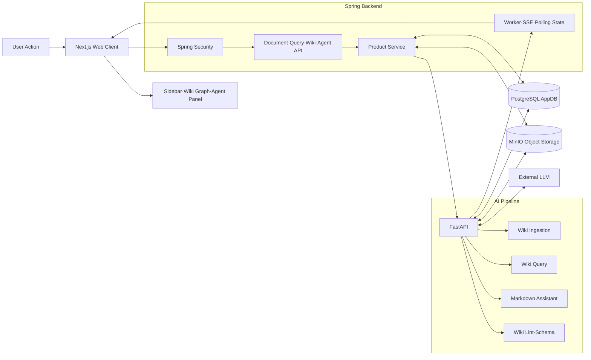

## 3. 기능별 Data Flow와 책임

### 3.1 Document Management

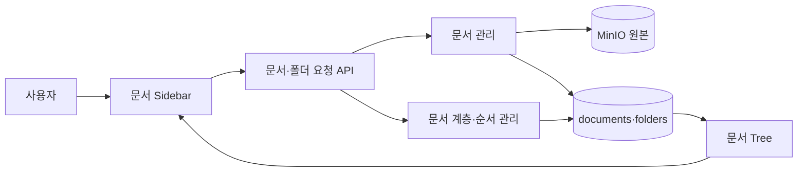

**Status:** 연결됨. 단, 일반 업로드 후 Wiki Ingestion 자동 시작은 미연결이다.

#### 문서·폴더 요청 API (`DocumentController`, `FolderController`)

- **Input:** JWT로 인증된 파일 업로드와 문서·폴더 생성, 이름 변경, 이동, 삭제, 복원 요청
- **Responsibility:** HTTP 요청을 DTO로 받고 Workspace·User context와 함께 적절한 Service에 전달한다.
- **Output:** Document·Folder 응답과 HTTP status
- **Key Logic:** multipart·JSON 입력 분리, path variable 매핑, idempotency key·hierarchy version 전달
- **Failure Handling:** DTO validation 실패는 `400`, 미지원 media type은 `415`, 권한·충돌 예외는 공통 exception handler에 위임한다.
- **Why this exists:** Web Client와 문서 domain 로직 사이의 HTTP 경계를 하나로 유지하기 위해 존재한다.

#### 문서 관리 (`DocumentService`)

- **Input:** Workspace·User context, 검증 대상 파일, 문서 변경 요청
- **Responsibility:** 원본 object와 Document metadata의 생성·수정·삭제·복원을 조정한다.
- **Output:** `documents` 레코드, MinIO 원본 object, 문서 상세·목록 응답
- **Key Logic:** Workspace membership, 파일명·형식·크기, 중복·idempotency, 부모 폴더와 hierarchy version을 검증한다.
- **Failure Handling:** DB transaction 실패 시 새로 저장한 MinIO object를 정리한다. version·idempotency 충돌은 `409`, 저장 실패는 `500`으로 변환된다.
- **Why this exists:** DB와 Object Storage에 걸친 문서 변경 규칙을 하나의 transaction 경계에서 관리하기 위해 존재한다.

#### 문서 계층·순서 관리 (`FolderService`, `DocumentPlacementService`)

- **Input:** 부모 폴더, 이동 대상, 목표 position, hierarchy version
- **Responsibility:** Workspace 내 문서·폴더 계층과 sibling 순서를 관리한다.
- **Output:** 갱신된 Folder·Document position과 Navigation Tree에 사용될 계층 정보
- **Key Logic:** cycle 방지, 부모·Workspace 일치, hierarchy version 비교, sibling reorder를 수행한다.
- **Failure Handling:** 없는 항목은 `404`, cycle·잘못된 부모는 `400`, 동시 수정 충돌은 `409`로 거절한다.
- **Why this exists:** 계층 변경 규칙을 문서 저장 로직과 분리해 tree 정합성을 지키기 위해 존재한다.

### 3.2 Markdown Editing & Versioning

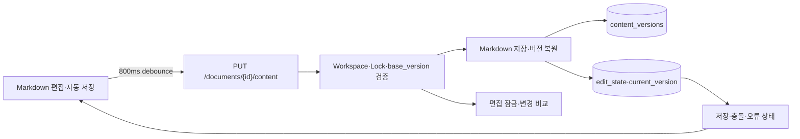

**Status:** 연결됨

#### Markdown 편집·자동 저장 (`NoteEditor`, `useNoteAutosave`)

- **Input:** 사용자가 편집한 Markdown, 현재 `base_version`, Agent 적용 여부
- **Responsibility:** Editor 상태를 유지하고 800ms debounce 후 저장 요청을 보낸다.
- **Output:** save payload, Saved·Saving·Conflict·Error UI 상태
- **Key Logic:** 연속 입력 debounce, pending save 병합, Agent 결과에 `source=agent` 적용
- **Failure Handling:** `409`는 conflict로 표시하고 일반 실패는 pending save를 유지해 다음 저장에서 재시도한다.
- **Why this exists:** 키 입력마다 API를 호출하지 않으면서 저장 상태를 사용자에게 즉시 보여주기 위해 존재한다.

#### Markdown 저장·버전 복원 (`DocumentService.saveContent`, `restoreContentVersion`)

- **Input:** Markdown file, `base_version`, 저장 source
- **Responsibility:** 현재 문서 version을 검증하고 Markdown 본문·edit state·version history를 저장하며 과거 version을 새 version으로 복원한다.
- **Output:** 증가한 content version, `document_edit_states`, `document_content_versions`, 복원 결과
- **Key Logic:** Workspace 권한, Markdown 형식·크기, edit lock, `base_version` 낙관적 동시성, 복원 대상 version을 검증한다.
- **Failure Handling:** 오래된 version은 `409`, 다른 사용자의 lock은 `423`, 잘못된 Markdown은 `400`으로 거절한다.
- **Why this exists:** 수동 편집과 Agent 편집을 같은 저장·version 규칙으로 처리하기 위해 존재한다.

#### 편집 잠금·변경 비교 (`DocumentEditLockService`, `MarkdownDiffService`)

- **Input:** 문서·User ID, lock 획득·heartbeat·해제 요청, 비교할 두 version의 Markdown
- **Responsibility:** 편집 lease를 유지하고 version 간 Markdown diff를 계산한다.
- **Output:** lock holder·expiry와 Markdown diff
- **Key Logic:** TTL·heartbeat, lock 보유자 검증, diff 크기 제한
- **Failure Handling:** 다른 사용자 lock은 `423`, lock 유실·version 충돌은 `409`, 과도한 diff는 전용 예외로 거절한다.
- **Why this exists:** 동시 편집 덮어쓰기를 방지하고 변경 추적과 복원을 가능하게 하기 위해 존재한다.

### 3.3 Markdown AI Assistant

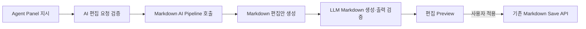

**Status:** 부분 연결. 선택된 Markdown 편집은 연결됐지만 Spring이 Workspace/User를 AI Pipeline payload로 전달하지 않는다.

#### AI 편집 요청 검증 (`AgentTurnService`)

- **Input:** 자연어 지시, Document ID, Markdown snapshot, `base_version`, edit target
- **Responsibility:** AI Pipeline 호출 전에 문서와 편집 범위가 안전한지 검증한다.
- **Output:** request ID와 AI Pipeline이 만든 편집 proposal
- **Key Logic:** Markdown 문서 여부, edit lock, 현재 version, selection·current section·whole document target 범위를 검증한다.
- **Failure Handling:** 잘못된 문서·target은 `400`, 오래된 version은 `409`, lock 충돌은 `423`으로 Pipeline 호출 전 거절한다.
- **Why this exists:** 비용이 드는 LLM 호출 전에 제품의 문서 권한·동시성 규칙을 적용하기 위해 존재한다.

#### Markdown·Skill AI Pipeline 호출 (`PipelineAgentRequester`)

- **Input:** AgentTurnRequest의 message, conversation context, active Markdown context, 선택적 Skill scope·참조 문서 ID
- **Responsibility:** Spring 요청을 AI Pipeline `/agent/turn` payload로 변환하고 Markdown 작업 또는 자연어 Skill authoring 응답을 중계한다.
- **Output:** AI Pipeline JSON 응답 또는 Tool 권한이 숨겨진 Skill Markdown draft
- **Key Logic:** connect·read timeout, target field snake_case 변환, `400/422` 응답 보존
- **Failure Handling:** timeout·빈 응답·기타 Pipeline 장애는 `503`, Pipeline의 `400/422`는 그 상태로 전달한다.
- **Why this exists:** Spring domain service에서 AI Pipeline의 HTTP 규약과 장애 처리를 분리하기 위해 존재한다.

#### Markdown 편집안 생성 (`GenerateMarkdownEditUseCase`)

- **Input:** 편집 지시, active Markdown, edit goal, target
- **Responsibility:** 편집 대상 범위를 계산하고 Markdown editor에 replacement 생성을 요청한다.
- **Output:** replacement, actual target, change summary가 포함된 MarkdownEditResult
- **Key Logic:** target boundary 확장, source-range 편집, LLM 결과 정규화, 편집 goal별 operation 선택
- **Failure Handling:** 범위가 잘못되었거나 수정 결과가 target 계약을 어기면 `422` 계열 오류로 반환한다.
- **Why this exists:** LLM 호출과 문서 범위 계산을 하나의 편집 use case로 묶기 위해 존재한다.

#### LLM Markdown 생성·출력 검증 (`ChatCompletionsMarkdownEditor`, `markdown_output_contract`)

- **Input:** 보호 처리된 Markdown 원문, editable context, 사용자 지시
- **Responsibility:** LLM으로 Markdown replacement를 생성하고 구조·보호 콘텐츠·출력 계약을 검증한다.
- **Output:** 계약을 통과한 replacement와 검증 failure 목록
- **Key Logic:** code fence·link·frontmatter 보호, Markdown syntax 검증, 요청하지 않은 구조 변경 탐지, 제한된 repair
- **Failure Handling:** API key·LLM 호출 실패는 Pipeline 장애로, 보호 조각 손실·Markdown 계약 위반은 validation 실패로 반환한다.
- **Why this exists:** 자유 형식 LLM 출력을 바로 문서에 적용하지 않고 안전한 Markdown 결과로 제한하기 위해 존재한다.

### 3.4 Wiki Ingestion

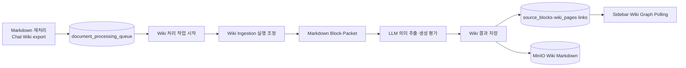

**Status:** 부분 연결. Markdown 재처리와 Chat Wiki export는 연결됐지만 일반 업로드와 PDF converter는 연결되지 않았다.

#### Wiki 처리 작업 시작 (`DocumentProcessingWorker`, `DocumentProcessingRequester`)

- **Input:** `document_processing_queue`의 pending 항목과 Document ID
- **Responsibility:** 후보 문서를 claim하고 AI Pipeline run을 시작한다.
- **Output:** Pipeline run ID, processing 상태·stage 갱신
- **Key Logic:** queue claim, processing 중복 방지, `/pipeline/runs` 또는 `/chat-wiki/runs` 요청, 실패 재시도 상태 관리
- **Failure Handling:** claim·HTTP 호출 실패 시 queue와 Document를 실패 상태로 갱신하고 재시도 가능한 항목은 다음 worker cycle에 남긴다.
- **Why this exists:** Spring transaction과 오래 걸리는 AI 처리를 분리하기 위해 존재한다.

#### Wiki Ingestion 실행 조정 (`RunPipelineUseCase`)

- **Input:** Document·Workspace·User ID, semantic prompt, source URI, callback URL
- **Responsibility:** 원본 로드부터 Wiki 생성·저장·callback까지 ingest 단계를 순서대로 조정한다.
- **Output:** PipelineRun 결과, 생성된 Page·Link·Source Block ID
- **Key Logic:** source 읽기, block·packet 생성, LLM 의미 추출·평가, Concept resolution, Wiki 조립, 진행 event 발행
- **Failure Handling:** 처리할 text가 없으면 `409`, 단계 실패 시 run·Document를 `failed`로 기록하고 예외를 BackgroundTask 경계에 전파한다.
- **Why this exists:** 여러 AI·저장 단계의 순서와 실행 상태를 하나의 use case에서 관리하기 위해 존재한다.

#### Wiki 결과 저장 (`persist_wiki_outputs`, `postgres_wiki_writer`)

- **Input:** 조립된 Source·Concept Page, Page Link, contribution, Markdown
- **Responsibility:** Wiki 결과를 PostgreSQL과 MinIO에 일관되게 저장한다.
- **Output:** `source_blocks`, `wiki_pages`, `wiki_page_links`, `document_wiki_links`, MinIO Wiki Markdown
- **Key Logic:** operation artifact·contribution 기록, Page upsert, link 정리, `documents.status` 갱신
- **Failure Handling:** transaction 실패 시 DB 변경을 rollback하고 run을 실패로 마감한다. Object Storage 실패도 ingest 실패로 전파한다.
- **Why this exists:** AI 결과의 DB 관계와 실제 Markdown object를 같은 ingest 결과로 유지하기 위해 존재한다.

### 3.5 Wiki Embedding Index

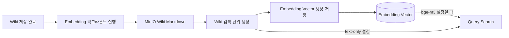

**Status:** 부분 연결. ingest 후 vector 생성은 연결됐지만 Docker Compose Query 기본값은 `text-only`다.

#### Embedding 백그라운드 실행 (`ThreadedWikiEmbeddingJob`)

- **Input:** ingest transaction이 완료한 Wiki Page ID 목록
- **Responsibility:** embedding 생성을 daemon thread에서 비동기로 실행한다.
- **Output:** embedding build 작업 시작·성공·실패 로그
- **Key Logic:** transaction 후 시작, Page ID dedupe, background thread 생성
- **Failure Handling:** thread 실패를 로그로 남기지만 이미 성공한 ingest는 실패로 되돌리지 않는다.
- **Why this exists:** Wiki 저장 응답을 model embedding 실행 시간과 분리하기 위해 존재한다.

#### Wiki 검색 단위 생성 (`BuildWikiPageEmbeddingsUseCase`)

- **Input:** Wiki Page ID와 MinIO Markdown
- **Responsibility:** Page Markdown을 검색 단위로 분할하고 각 단위의 vector를 생성한다.
- **Output:** embedding unit과 vector 목록
- **Key Logic:** Source·Concept Page 입력 정규화, Markdown unit 분할, batch embedding
- **Failure Handling:** Markdown을 읽지 못하거나 model이 실패하면 해당 Page 작업을 실패로 전파한다.
- **Why this exists:** 저장 포맷과 embedding model 사이에 일관된 검색 단위 생성 규칙을 두기 위해 존재한다.

#### Embedding Vector 생성·저장 (`BgeM3EmbeddingModel`, `PostgresWikiPageEmbeddingRepository`)

- **Input:** embedding unit text와 Page·unit metadata
- **Responsibility:** BGE-M3 vector를 계산하고 PostgreSQL의 embedding table에 저장한다.
- **Output:** `wiki_embedding_units`, `wiki_embedding_vectors`
- **Key Logic:** model batch 호출, 기존 Page embedding 교체, unit·vector 순서 유지
- **Failure Handling:** model load·inference·DB 저장 실패를 job으로 전파하며 불완전한 결과를 정상 상태로 보고하지 않는다.
- **Why this exists:** model 실행과 영속화 책임을 use case에서 분리하고 Query가 재사용할 vector를 남기기 위해 존재한다.

### 3.6 Wiki Query & Chat

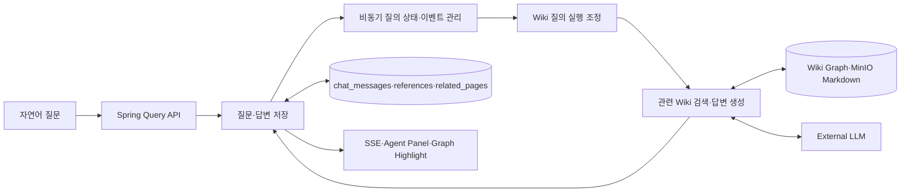

**Status:** 연결됨

#### 질문·답변 저장 (`QueryService`, `QueryMessageRecorder`)

- **Input:** Workspace·Session·User ID와 자연어 질문
- **Responsibility:** Session 권한을 검증하고 User message와 pending Assistant message를 저장한 뒤 Pipeline Query를 요청한다.
- **Output:** 완료된 Assistant message, evidence reference, related Page
- **Key Logic:** 빈 질문·Session/Workspace 일치 검증, pending message 선저장, Pipeline 결과 transaction 저장
- **Failure Handling:** 빈 질문은 `400`, Session·Workspace 불일치는 `404`, Pipeline 실패 시 pending Assistant를 `failed`로 변경한다.
- **Why this exists:** Chat 영속화와 AI Query 호출을 하나의 제품 transaction 흐름으로 관리하기 위해 존재한다.

#### 비동기 질의 상태·이벤트 관리 (`QueryRunService`, `QueryRunStore`, `QueryEventBroker`)

- **Input:** Query 요청, request ID, Pipeline log callback
- **Responsibility:** 비동기 Query run 상태와 SSE event stream을 관리한다.
- **Output:** pending·running·completed·failed run, SSE log·completion event
- **Key Logic:** executor 제출, `ConcurrentHashMap` 상태 저장, event replay·broadcast, 종료 후 10분 TTL
- **Failure Handling:** 없거나 TTL이 지난 run은 `404`, Pipeline 예외은 failed run과 error message로 보존한다.
- **Why this exists:** 오래 걸리는 Query를 HTTP 요청 하나에 묶지 않고 진행 상태를 전달하기 위해 존재한다.

#### Wiki 질의 실행 조정 (`AnswerQueryUseCase`)

- **Input:** 질문, Workspace, 선택적 conversation context·web search 허용값
- **Responsibility:** 질문 정제, 검색, Graph 탐색, evidence 조립, 답변 생성을 조정한다.
- **Output:** answer, related Page, evidence snippet, graph context, traversal path
- **Key Logic:** query rewrite, internal relevance 판단, BM25/vector 결과 결합, Wiki Markdown 로드, answer citation 추출
- **Failure Handling:** 검색·Markdown·LLM 장애를 Pipeline Query 실패로 전파하고 evaluator·web search가 disabled이면 해당 분기를 건너뛴다.
- **Why this exists:** 여러 retrieval·generation component를 하나의 질문 처리 규칙으로 조합하기 위해 존재한다.

#### 관련 Wiki 검색·답변 생성 (`Bm25Searcher`, `StoredWikiPageEmbeddingSearch`, `QueryChatAnswerGenerator`)

- **Input:** 정제된 query, Wiki Page embedding·text index, Graph·Markdown context
- **Responsibility:** 설정에 따라 관련 Page를 검색하고 근거 기반 답변을 생성한다.
- **Output:** score가 있는 Page 후보와 LLM answer
- **Key Logic:** `text-only` BM25 또는 stored BGE-M3 vector 검색, Graph context 포맷, citation 생성 프롬프트
- **Failure Handling:** embedding mode·model·LLM 설정 오류는 Query 실패로 전파하며 disabled 기능은 fallback 경로를 사용한다.
- **Why this exists:** retrieval 방식과 답변 생성을 교체 가능한 경계로 분리하기 위해 존재한다.

현재 Docker Compose 기본값은 `QUERY_EMBEDDING_MODE=text-only`, `QUERY_EVALUATOR_MODE=disabled`, `QUERY_WEB_SEARCH_MODE=disabled`다. 단, 환경변수가 아예 없을 때 Query 코드가 사용하는 embedding mode fallback은 `bge-m3`다.

### 3.7 Wiki Graph & Page Reader

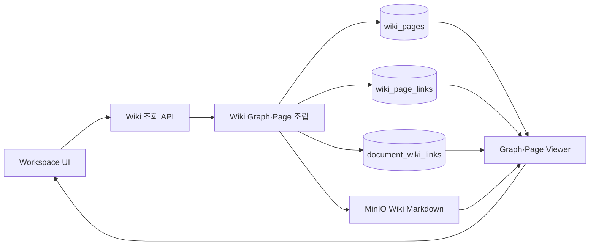

**Status:** 부분 연결. Graph·Page 조회는 연결됐지만 Page rename은 Spring 호출 대상인 llmPipeline route가 없어 현재 실패한다.

#### Wiki 조회 API (`WikiController`)

- **Input:** Workspace ID, 선택적 Wiki Page ID와 이름 변경 요청
- **Responsibility:** Graph·Page 상세·Page rename HTTP endpoint를 제공한다.
- **Output:** WikiGraphResponse, WikiPageDetailResponse, rename 결과
- **Key Logic:** authentication principal과 path parameter를 WikiService에 전달한다.
- **Failure Handling:** 입력 validation과 domain 예외를 공통 exception handler에 위임한다. Page rename은 현재 내부 토큰 미전송으로 `401`, Backend 토큰 송신 적용 후에는 llmPipeline route 미구현으로 `404`가 발생한다.
- **Why this exists:** Wiki 탐색 기능의 공개 HTTP 경계를 명확히 하기 위해 존재한다.

#### Wiki Graph·Page 조립 (`WikiService`)

- **Input:** Workspace·User ID, Wiki Page ID
- **Responsibility:** Workspace Wiki Page를 Graph node·edge로 변환하고 Page 상세와 원본 Document 참조를 조회한다.
- **Output:** Graph, Page Markdown, 관련 Page, Source Document 목록
- **Key Logic:** membership 검증, Workspace Page ID 집합의 양 끝점이 있는 Link만 필터링, `markdown_uri` MinIO 로드
- **Failure Handling:** Workspace·Page가 없으면 `404`, MinIO Markdown 읽기 실패는 현재 Markdown을 `null`로 두고 metadata 응답은 유지한다.
- **Why this exists:** DB 관계와 Object Storage 본문을 Web Client가 탐색할 하나의 Wiki view model로 조립하기 위해 존재한다.

### 3.8 Chat Wiki Export

**Status:** 연결됨

#### Chat Wiki Export 조정 (`ChatWikiExportService`)

- **Input:** Workspace·Session·User ID, `selection_mode=full|partial`, partial `pair_ids`
- **Responsibility:** export할 문답을 선택하고 Markdown Document를 생성하거나 재사용한 뒤 Processing Queue에 넣는다.
- **Output:** `chat_export` Document, queue 항목, `created·regenerated·skipped` 결과
- **Key Logic:** Session membership, full·partial pair 선택, content hash 중복 검사, full 재생성 시 기존 Document 재사용
- **Failure Handling:** 잘못된 mode·pair는 `400`, 완전한 문답이 없으면 export를 거절하고 동일 content는 `skipped`로 종료한다.
- **Why this exists:** Chat domain의 대화를 기존 Document·Ingestion 흐름에 안전하게 연결하기 위해 존재한다.

#### 채팅 Markdown 변환 (`ChatWikiMarkdownSerializer`)

- **Input:** 완료된 User·Assistant message pair
- **Responsibility:** 채팅 문답을 재현 가능한 Markdown으로 직렬화하고 비밀값을 masking한다.
- **Output:** export Markdown과 안정적 content hash
- **Key Logic:** pair 순서 유지, header·metadata 조립, secret pattern masking, hash 계산
- **Failure Handling:** 직렬화할 완전한 pair가 없으면 빈 출력을 만들지 않고 Service에 실패를 알린다.
- **Why this exists:** 대화 표현·비밀값 제거·dedupe 규칙을 Document 생성 로직에서 분리하기 위해 존재한다.

#### Chat·Wiki 연결 정합성 맞춤 (`ChatWikiExportReconciler`)

- **Input:** processing이 완료된 chat export Document와 생성된 Source Page
- **Responsibility:** Chat Session의 export 상태와 실제 Wiki Source Page 연결을 맞춘다.
- **Output:** Session↔Document↔Source Page 연결 상태
- **Key Logic:** Document 처리 완료 확인, Source Page 탐색, full·partial export 레코드 갱신
- **Failure Handling:** 아직 Source Page가 없거나 처리가 완료되지 않았으면 연결을 확정하지 않는다.
- **Why this exists:** 비동기 Ingestion 완료 전에 잘못된 Source Page를 Session에 연결하지 않기 위해 존재한다.

### 3.9 Wiki Lint & Recovery

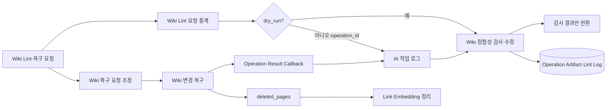

**Status:** 연결됨. Lint dry-run·변경 실행, Ingestion·Lint 복구 재조립, `deleted_pages`의 link·embedding 정리와 결과 callback을 지원한다. Backend의 ingest logging을 켠 실제 Backend↔llmPipeline 흐름도 확인했다.

#### Wiki Lint 요청 중계 (`WikiMaintenanceService`, `PipelineWikiMaintenanceRequester`)

- **Input:** Workspace·User ID, `dry_run`, `materialize_promotions`
- **Responsibility:** Workspace membership을 검증하고 Spring 요청을 AI Pipeline lint payload로 전달한다.
- **Output:** AI Pipeline lint JSON 결과, mutation AI 작업 로그와 changed Page 기록
- **Key Logic:** membership 확인, dry-run이면 operation 없이 조회하고 `dry_run=false`면 `LintOperationStarter`가 operation ID를 먼저 등록한다. 응답의 `changed_pages`를 작업 로그에 반영한다.
- **Failure Handling:** timeout·빈 응답·Pipeline 장애는 `503`으로 변환한다. mutation 실패 시 먼저 등록한 operation을 `failed`로 확정한다.
- **Why this exists:** 제품 권한 검증과 Pipeline maintenance HTTP 규약을 분리하기 위해 존재한다.

#### Wiki 정합성 검사·수정 (`PostgresWikiMaintenance`)

- **Input:** Workspace·User ID, dry-run 여부, operation ID, promotion 설정
- **Responsibility:** Wiki contribution·orphan link·promotion 후보를 검사하고 실행 모드에서 정합성을 수정한다.
- **Output:** lint report, changed Page, operation artifact, lint log
- **Key Logic:** transaction 내 reconciliation, orphan link 정리, 선택적 Concept promotion, artifact·log 기록
- **Failure Handling:** 실행 모드의 operation ID 누락은 `422`, DB·Object Storage 실패는 transaction 실패로 반환한다.
- **Why this exists:** 누적 ingest 후 Wiki 관계의 불일치를 검사와 수정이 같은 규칙을 따르도록 하기 위해 존재한다.

#### Wiki 변경 복구 (`RestoreWikiPagesUseCase`)

- **Input:** ingest·lint operation ID, restore target, 유지·취소할 contribution
- **Responsibility:** operation artifact를 사용해 Wiki Page와 contribution 상태를 이전 시점으로 복원한다.
- **Output:** 복원된 Page·Link·contribution 요약
- **Key Logic:** artifact 로드, restore target 검증, 취소 operation 적용, Wiki Markdown·DB 재저장
- **Failure Handling:** 없는 artifact·잘못된 operation 관계는 restore 실패로 반환하고 예상 못 한 오류는 내부 API에서 `500`으로 처리한다. `deleted_pages` 정리에 실패하면 callback을 보내지 않아 복구 완료로 잘못 확정되지 않는다.
- **Why this exists:** lint·ingest 변경을 작업 단위로 되돌릴 수 있게 하기 위해 존재한다.

#### Wiki 복구 요청 조정 (`RestoreExecuteService`, `PipelineRestoreRequester`)

- **Input:** 인증된 복구 요청, 대상 operation, Page별 유지 contribution plan
- **Responsibility:** Spring DB 복구를 먼저 적용하고 Ingestion·Lint 유형에 맞는 재조립 지시서를 llmPipeline에 전달한다.
- **Output:** restore operation, `/wiki/ingest-restore-runs` 또는 `/wiki/lint-restore-runs` 요청, `rebuilding·notify_pending` 상태
- **Key Logic:** Source Page와 Concept Page 복구 계획 분리, contribution 적용 순서 보존, callback URL 생성, 유형별 endpoint 선택
- **Failure Handling:** llmPipeline 요청·callback 완료가 실패하면 이미 적용한 Spring 복구를 되돌리지 않고 `notify_pending`으로 남겨 재전송 대상으로 관리한다.
- **Why this exists:** Spring이 소유한 작업 로그·version 복구와 llmPipeline이 소유한 Wiki artifact 재조립을 하나의 restore 작업으로 연결하기 위해 존재한다.

### 3.10 Pipeline Run & Progress Log

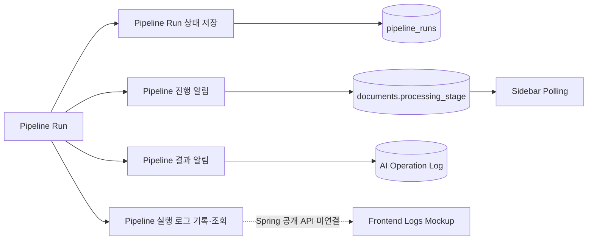

**Status:** 부분 연결. Document 진행 callback과 token 기반 Operation 결과 callback은 연결됐다. Pipeline log 조회는 내부 API뿐이며 Frontend 화면은 목업이다.

#### Pipeline Run 상태 저장 (`PostgresPipelineRunRepository`)

- **Input:** run 등록·상태 갱신·callback pending payload
- **Responsibility:** Pipeline run의 실행 상태와 결과·실패·callback 재시도 정보를 영속화한다.
- **Output:** `pipeline_runs` 레코드와 run 조회 결과
- **Key Logic:** running·completed·failed transition, result metadata, pending callback payload 저장
- **Failure Handling:** 없는 run은 `404`, DB 갱신 실패는 Pipeline run 실패로 전파한다.
- **Why this exists:** BackgroundTask이 종료되거나 process가 다시 시작돼도 run 상태를 확인할 수 있게 하기 위해 존재한다.

#### Pipeline 실행 로그 기록·조회 (`PipelineLog`, `LocalPipelineLogReader`)

- **Input:** run ID와 stage·message·data log event
- **Responsibility:** Pipeline 실행 로그를 `pipeline.log`에 기록하고 run ID별로 읽어 반환한다.
- **Output:** 로컬 log line과 `GET /pipeline/runs/{run_id}/logs` 응답
- **Key Logic:** structured log format, run ID filtering, log file 스캔
- **Failure Handling:** log 파일·run이 없으면 `404`, 읽기 실패는 내부 API 실패로 반환한다.
- **Why this exists:** DB 상태만으로 알 수 없는 단계별 실패 원인을 run 단위로 추적하기 위해 존재한다.

#### Pipeline 진행 알림 (`PipelineLog`, `DocumentPipelineController`)

- **Input:** Document callback URL, run ID, stage·message·data event
- **Responsibility:** AI Pipeline의 단계별 진행 event를 Spring에 보내 Document heartbeat와 현재 processing stage를 갱신한다.
- **Output:** `documents.processing_stage`, Sidebar polling이 조회할 상태
- **Key Logic:** local log 기록 후 HTTP POST, 현재 Document Run ID 대조, Spring 수신 시각으로 heartbeat 갱신
- **Failure Handling:** callback 실패를 local `pipeline.log`에 남기고 Pipeline 실행은 계속한다. 자동 재시도하지 않는다.
- **Why this exists:** 비동기 Ingestion의 현재 단계를 Spring polling UI에 전달하기 위해 존재한다.

#### Pipeline 결과 알림 (`HttpPipelineResultNotifier`, `OperationCallbackController`)

- **Input:** operation ID, result callback URL, 성공·실패 상태, changed Page artifact와 hash
- **Responsibility:** Ingestion·Restore의 최종 결과를 Spring AI 작업 로그에 전달하고 Page 변경을 멱등하게 반영한다.
- **Output:** 확정된 operation 상태와 기록된 변경 수, 또는 `pipeline_runs.pending_notification·notify_pending`
- **Key Logic:** path·body operation ID 대조, 등록 범위 확인, artifact key·content hash 검증, payload hash 기반 멱등 처리, `422` artifact rewrite
- **Failure Handling:** `INTERNAL_CALLBACK_TOKEN`이 없으면 HTTP 요청 전 실패하고 Spring 설정값과 다르면 `401`이 발생한다. Ingestion은 pending notification을 저장하고 Restore는 `500`과 `notify_pending`으로 남긴다. `422`는 artifact를 정규 경로로 다시 쓴 뒤 재시도한다.
- **Why this exists:** llmPipeline이 만든 Wiki artifact와 Spring의 AI 작업 이력·복구 상태를 같은 operation으로 확정하기 위해 존재한다.

### 3.11 Wiki Schema

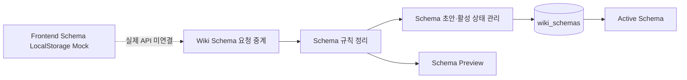

**Status:** 부분 연결. Spring과 AI Pipeline API는 연결됐지만 Frontend Schema 화면은 LocalStorage 목업을 사용한다.

#### Wiki Schema 요청 중계 (`WikiSchemaService`, `PipelineWikiSchemaRequester`)

- **Input:** Workspace·User ID, raw Schema Markdown, 이름, Schema ID
- **Responsibility:** membership을 검증하고 preview·draft·activate·active 조회 요청을 AI Pipeline에 중계한다.
- **Output:** Schema preview, draft, active Schema JSON
- **Key Logic:** endpoint별 payload 조립, timeout 설정, Pipeline `400/404/422` 응답 보존
- **Failure Handling:** timeout·빈 응답·기타 Pipeline 장애는 `503`으로 변환한다.
- **Why this exists:** Schema 권한 검증과 AI Pipeline HTTP 규약을 Frontend에서 숨기기 위해 존재한다.

#### Schema 규칙 정리 (`OrganizeSchemaUseCase`)

- **Input:** raw Schema Markdown
- **Responsibility:** Markdown을 Wiki 생성·수집·질의 규칙 섹션으로 정리하고 적용 가능성을 검사한다.
- **Output:** SchemaFragments, issue 목록, preview Markdown
- **Key Logic:** LLM organizer, section 필터링, 필수 evidence guard, secret redaction
- **Failure Handling:** 빈·잘못된 Markdown은 `400`, organizer 출력 계약 위반은 validation 실패로 반환한다.
- **Why this exists:** 자유 형식 규칙을 ingest·query가 선택해 사용할 구조로 변환하기 위해 존재한다.

#### Schema 초안·활성 상태 관리 (`CreateSchemaDraftUseCase`, `ActivateSchemaUseCase`, `GetActiveSchemaUseCase`)

- **Input:** 정리된 Schema, Workspace·User ID, Schema ID
- **Responsibility:** Schema draft를 저장하고 Workspace의 active Schema를 선택·조회한다.
- **Output:** `wiki_schemas` draft와 active Schema
- **Key Logic:** draft·activation 분리, Workspace/User scope 검증, 기존 active 해제 후 선택 Schema activation
- **Failure Handling:** 없거나 접근할 수 없는 Schema는 `404`, DB 실패는 Pipeline `500`으로 반환한다.
- **Why this exists:** 초안 편집과 실제 AI 규칙 적용을 분리해 미완성 Schema가 즉시 적용되지 않게 하기 위해 존재한다.

### 3.12 Skill & Agent Run

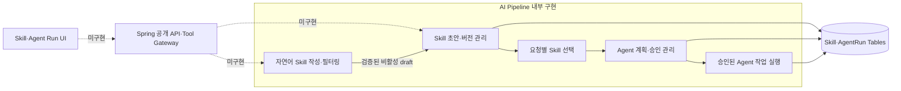

**Status:** 내부 구현. 기본값 `AGENT_SKILLS_ENABLED=false`이며 Spring 공개 API와 internal tool endpoint가 아직 없다.

#### Skill 초안·버전 관리 (`AuthorSkillUseCase`, `ManageSkillUseCase`, `ProposeSkillDraftUseCase`)

- **Input:** 짧은 자연어, 선택적 참조 문서 ID, 수동 Skill 정의, draft source operation, publish·enable 요청
- **Responsibility:** AgentRun과 분리된 Skill authoring 전용 Backend read endpoint로 권한이 확인된 참조 Markdown을 받고, heading·목록·표 header 구조만 추출해 비신뢰 데이터로 격리하며 Skill Markdown 생성과 초안·version·publish·enable lifecycle을 관리한다.
- **Output:** 수동 입력의 편집 가능한 Skill Markdown draft, 채팅의 선택적 보충 질문, immutable published version, 완료 작업 기반 draft proposal
- **Key Logic:** 수동 입력은 질문 없이 일반 placeholder draft 생성, 채팅은 멀티턴 보충 질문 허용, 입력·참조·출력 안전 검사, capability-tool 교집합, mutation tool에 필요한 read tool 보완, 비활성 draft 저장과 별도 publish
- **Failure Handling:** 자연어 authoring의 위험한 instruction·지원하지 않는 tool은 `400`, request schema 위반은 `422`로 거절한다. 기존 Skill 관리 API의 없거나 관리할 수 없는 Skill과 version 충돌은 현재 `400`으로 반환한다.
- **Why this exists:** 반복 작업 규칙을 자유 형식 prompt가 아닌 검증·version 가능한 Skill로 관리하기 위해 존재한다.

#### 요청별 Skill 선택 (`SelectSkillUseCase`)

- **Input:** 사용자 요청, slash Skill 선택, Workspace·User context
- **Responsibility:** slash·auto·off mode에 따라 실행에 사용할 Skill version을 결정한다.
- **Output:** 선택된 Skill route와 allowed capability·tool
- **Key Logic:** enabled·published version 필터, scope 우선순위, 명시적 slash 선택 우선
- **Failure Handling:** 비활성·없는 Skill은 `400/404`, auto 후보가 없으면 Skill 없는 기본 Agent 경로로 진행한다.
- **Why this exists:** Skill 저장 구조와 실제 요청 routing 규칙을 분리하기 위해 존재한다.

#### Agent 계획·승인 관리 (`StartAgentRunUseCase`, `ApproveAgentPlanUseCase`)

- **Input:** Agent 작업 지시, 선택 Skill, plan version, operation hash, 승인·거절·수정·취소 요청
- **Responsibility:** AgentRun을 생성하고 변경 plan을 생성·versioning하며 사용자 결정을 상태 transition으로 반영한다.
- **Output:** AgentRun, AgentPlan, operation 목록, approval 상태
- **Key Logic:** immutable operation hash, plan version 비교, approval 후 job 생성, reject·revise·cancel transition
- **Failure Handling:** stale plan·hash 불일치·잘못된 상태 transition은 `409`, 없거나 접근 불가 Run은 `404`로 거절한다.
- **Why this exists:** Workspace 변경을 LLM이 즉시 실행하지 않고 검토 가능한 plan과 승인을 거치게 하기 위해 존재한다.

#### 승인된 Agent 작업 실행 (`AgentWorker`, `BackendToolGateway`)

- **Input:** 승인된 Agent job과 plan operation
- **Responsibility:** operation을 순서대로 판단하고 Spring internal tool endpoint를 통해 read·mutation을 실행한다.
- **Output:** operation 실행 결과, 성공·실패 AgentRun 상태
- **Key Logic:** allowed tool 검증, base version·operation 한계, retry 가능 오류 판별, service token HTTP 호출
- **Failure Handling:** `429/5xx`는 retry 가능 실패로, 기타 tool 오류는 비재시도 실패로 마감한다. 현재 Spring internal endpoint가 없어 실제 tool 실행은 연결되지 않았다.
- **Why this exists:** 승인된 plan의 범위 밖 tool 실행을 막고 실행 결과를 operation 단위로 추적하기 위해 존재한다.

### 3.13 Document Restoration & Evaluation

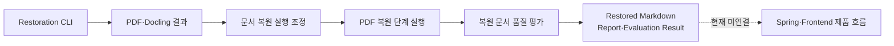

**Status:** 내부 CLI·실험 기능. FastAPI, Spring, Frontend 제품 흐름에는 연결되지 않았다.

#### 문서 복원 실행 조정 (`RestoreDocumentUseCase`)

- **Input:** PDF, Docling 결과, restoration mode·설정
- **Responsibility:** 복원 준비, stage 실행, Markdown 조립, report 생성 순서를 조정한다.
- **Output:** restored Markdown, stage timing, restoration report
- **Key Logic:** `docling-only`·`selective-repair`·`full-repair` 분기, 임시 작업 경로, stage별 timing 수집
- **Failure Handling:** 필수 입력·mode·stage 실패를 CLI 오류로 전파하고 불완전한 결과를 성공으로 반환하지 않는다.
- **Why this exists:** 여러 subprocess 기반 복원 단계를 하나의 재현 가능한 실행 흐름으로 묶기 위해 존재한다.

#### PDF 복원 단계 실행 (`SubprocessDocumentRestorationStages`)

- **Input:** 준비된 작업 디렉터리, PDF·Block manifest, 복원 설정
- **Responsibility:** layout·수식 탐지, crop OCR, selective repair, vision review, Markdown 조립 script를 실행한다.
- **Output:** stage별 artifact와 조립된 Markdown
- **Key Logic:** subprocess 인자 조립, 순서 보장, mode별 stage skip, 중간 artifact 재사용
- **Failure Handling:** subprocess 비정상 종료·출력 누락을 즉시 RestoreDocumentUseCase에 전파한다.
- **Why this exists:** CLI script 세부 구현을 application use case에서 분리하고 단계 순서를 명시하기 위해 존재한다.

#### 복원 문서 품질 평가 (`prepare_document_evaluation`, `DocumentEvaluatorPort`)

- **Input:** 조립된 Markdown과 Page·Bounding Box·source text가 있는 Block
- **Responsibility:** 문서를 평가 chunk로 분할하고 Block별 복원 품질과 근거 충분성을 평가한다.
- **Output:** evaluation job, Block별 verdict·reason, unresolved 목록
- **Key Logic:** assembled Markdown parsing, Page·Block 연결, chunk 크기 제한, local 또는 Chat Completions evaluator 선택
- **Failure Handling:** 근거가 부족한 Block은 임의 수정하지 않고 `unresolved`로 남긴다. evaluator 호출 실패는 evaluation 실패로 반환한다.
- **Why this exists:** 복원된 Markdown을 눈으로만 확인하지 않고 원본 Block 근거와 대조해 품질을 측정하기 위해 존재한다.

## 4. 현재 미연결 구간

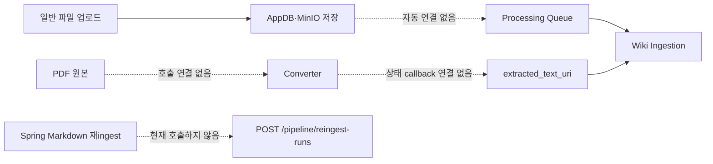

| 미연결 구간 | 현재 영향 |
|---|---|
| 일반 업로드 → Processing Queue | 파일 업로드만으로 Wiki가 생성되지 않음 |
| PDF → Converter → `extracted_text_uri` | PDF는 AI Pipeline 입력으로 사용할 수 없음 |
| Spring 재ingest → `/pipeline/reingest-runs` | 기존 Source Block 변경 비교가 실행되지 않음 |
| Spring Query → conversation context | AI Pipeline의 대화 context 보강 경로를 사용하지 않음 |
| Frontend Log → Pipeline Log API | 로그 화면은 실제 실행 데이터가 아닌 목업 |
| Frontend Schema → Spring Schema API | Schema 화면은 LocalStorage 목업 |
| Spring → Skill·Agent Run | 공개 인증·권한 endpoint가 없어 기본 비활성 |
| Agent Worker → Spring Tool API | `BackendToolGateway`는 호출하지만 Spring `/internal/agent/tools/*` route가 없어 `404` |

## 5. 주요 코드 위치

| 기능 | 코드 |
|---|---|
| 문서·폴더 | `backend/src/main/java/fruition/document/` |
| Markdown 편집 | `frontend/src/features/note-editing/`, `backend/src/main/java/fruition/document/service/DocumentService.java` |
| Markdown AI Assistant | `backend/src/main/java/fruition/agent/`, `llmPipeline/app/modules/markdown_edit/` |
| Wiki Ingestion | `llmPipeline/app/modules/wiki_ingestion/`, `llmPipeline/run_lab.py` |
| Embedding | `llmPipeline/app/modules/wiki_embedding/` |
| Wiki Query | `backend/src/main/java/fruition/query/`, `llmPipeline/app/modules/query/` |
| Wiki Graph | `backend/src/main/java/fruition/wiki/service/WikiService.java` |
| Chat Wiki export | `backend/src/main/java/fruition/chat/service/ChatWikiExportService.java` |
| Wiki lint·recovery | `llmPipeline/app/modules/wiki_ingestion/infrastructure/wiki_maintenance.py` |
| Pipeline log | `llmPipeline/app/modules/wiki_generation/infrastructure/pipeline_log.py` |
| AI 작업 결과 callback·복구 요청 | `backend/src/main/java/fruition/aihistory/`, `llmPipeline/app/modules/wiki_ingestion/infrastructure/pipeline_result_callback.py` |
| Wiki Schema | `backend/src/main/java/fruition/wikischema/`, `llmPipeline/app/modules/wiki_schema/` |
| Skill | `llmPipeline/app/modules/skill/` |
| Agent Run | `llmPipeline/app/modules/agent_run/` |
| 문서 복원·평가 | `llmPipeline/app/modules/document_restoration/`, `llmPipeline/app/modules/document_evaluation/` |
