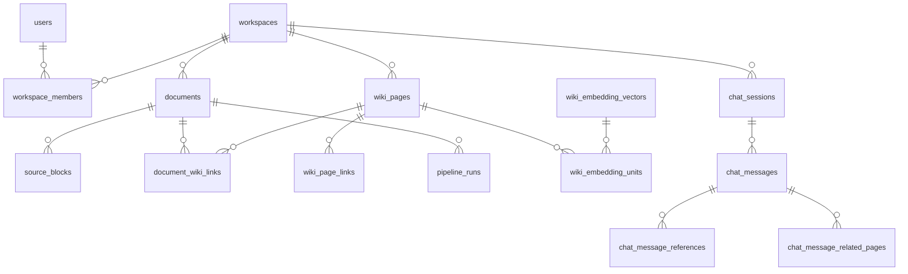

# 데이터 모델 요약

MSA 전환 후 데이터 소유·저장소 구조 압축본.
상세 원문: `docs/backlog/Fruition_MVP_Erd.md`, `docs/backlog/spec/pipeline-db-ownership.md`, `docs/backlog/msa/current-architecture.md` §4.

## 1. 저장소 개요

| 저장소 | 소유 서비스 | 용도 |
|---|---|---|
| **access_db** (PostgreSQL) | access-svc | 사용자·OAuth·refresh token·워크스페이스·멤버 (자체 Flyway) |
| **core_db** (PostgreSQL) | document-svc | 문서 metadata·폴더·채팅·Wiki·operation·버전 스냅샷 (Flyway 소유) |
| **ai_db** (PostgreSQL) | ai-svc | wiki_schemas·문서 파생물 stale 추적 (python `ai_schema.sql` 멱등 부트스트랩) |
| **MongoDB** | document-svc | 문서 본문·편집 revision·write-id·edit outbox — 단일 트랜잭션 후 outbox → Kafka `document.edit.event` |
| **Redis** | access-svc / document-svc | 권한 projection·OAuth 교환 코드 / query run 상태·SSE 이벤트 |
| **S3/MinIO** | document-svc | 문서 원본·snapshot, Wiki markdown 본문 |

**object key 표기 규약**: `documents.source_uri`는 항상 평문 키(`sources/documents/{document_id}/original`)다. document-svc가 문서를 만들 때 조립해 넣고 이후 바뀌지 않으며, `s3://` 형식은 `Document` 생성자가 거부한다. `s3://<bucket>/<key>` 형식이 들어오는 컬럼은 파이프라인이 콜백으로 채우는 `documents.extracted_text_uri` 뿐이다. 두 표기가 섞이면 쓰기와 읽기가 서로 다른 키를 가리켜도 오류 없이 어긋나므로, 읽기·쓰기 양쪽 모두 `normalizeObjectKey`를 거친다.

## 2. DB별 핵심 테이블

### access_db (access-svc)

| 테이블 | 소유 | 용도 | 핵심 컬럼/관계 |
|---|---|---|---|
| users | access-svc | 사용자 계정 | `email` UK, `password_hash`(OAuth 전용은 NULL) |
| user_oauth_accounts | access-svc | OAuth provider 연결 | users 1:N, `(provider, provider_user_id)` |
| user_refresh_tokens | access-svc | JWT refresh token | `token_hash`(SHA-256), `revoked_at`으로 탈취 감지 |
| workspaces | access-svc | 격리 단위 | 문서·Wiki·채팅의 소속 기준 |
| workspace_members | access-svc | 멤버십(N:M 대비) | 복합 PK `(workspace_id, user_id)`, `role`(owner/member) |

### core_db (document-svc)

| 테이블 | 소유 | 용도 | 핵심 컬럼/관계 |
|---|---|---|---|
| documents | document-svc | 원본 문서 업로드·처리 상태 | `status`, `content_hash` UK, `pipeline_run_id`, `origin`(upload/chat_export) |
| document_processing_queue | document-svc | 처리 순서 보장 내부 큐 | `document_id` UK |
| wiki_pages | document-svc | AI 생성 Wiki 페이지 | `page_type`(source/concept), `markdown_uri` |
| document_wiki_links | document-svc | 문서↔Wiki 연결 | 복합 PK `(document_id, wiki_page_id, relation_type)` |
| wiki_page_links | document-svc | Wiki 페이지 간 방향 링크(그래프 탐색) | 복합 PK `(from, to, link_type)` |
| source_blocks | document-svc | 문서 block 단위 텍스트 | 복합 PK `(document_id, block_id)`, 파이프라인 적재·Spring 읽기 |
| chat_sessions | document-svc | 채팅 세션(workspace당 10개) | `context_summary`, `wiki_page_id`(full export 연결) |
| chat_messages | document-svc | 질의응답 메시지 | `pair_id`로 user·assistant 쌍 식별 |
| chat_message_references | document-svc | 답변 근거 source block 스니펫 | chat_messages 1:N, `source_block_ids` |
| chat_message_related_pages | document-svc | 답변 관련 Wiki 페이지 목록 | chat_messages 1:N, `relevance_score`·`depth` |
| chat_partial_wiki | document-svc | partial export 문답↔페이지 멤버십 | `UNIQUE(pair_id, wiki_page_id)` |
| document_assets | document-svc | 문서 첨부 이미지 metadata(바이너리는 MinIO) | `storage_key` UK, `content_hash`(ETag), `unreferenced_since`(정리 후보 판정). workspace_id·uploaded_by는 access_db 논리 참조(물리 FK 없음) |
| document_asset_references | document-svc | 문서 본문↔asset 참조 동기화 | 복합 PK `(document_id, asset_id)`, asset 삭제 RESTRICT — 참조 중 asset 보호 |
| document_asset_orphans | document-svc | storage 정리 실패 asset 재시도 큐 | `storage_key` UK, `retry_count`, cleanup worker가 소비 |
| wiki_lint_state | document-svc | workspace별 마지막 lint 성공 시각(needs_lint 판단 기준점) | PK `workspace_id`(access_db 논리 참조), `last_lint_at` |

### ai_db (ai-svc)

| 테이블 | 소유 | 용도 | 핵심 컬럼/관계 |
|---|---|---|---|
| wiki_schemas | ai-svc | 워크스페이스·사용자별 Wiki 생성 규칙 | active 스키마는 소유 범위당 최대 1개(부분 unique index) |
| document_derived_state | ai-svc | 문서 파생물 stale 추적 | `document.edit.event` consumer가 갱신 |

### core_db 동거 중인 ai 테이블 (전환기 예외 — §4)

| 테이블 | 소유 | 용도 | 핵심 컬럼/관계 |
|---|---|---|---|
| pipeline_runs | ai-svc | pipeline 실행 기록 | `status`(terminal: succeeded/failed), `manifest` JSONB |
| wiki_page_embeddings | ai-svc | 페이지 임베딩(모델별 1행) | PK `(page_id, embedding_model)` |
| wiki_embedding_vectors | ai-svc | 임베딩 벡터 풀(중복 연산 방지) | `representation_hash`로 재사용 |
| wiki_embedding_units | ai-svc | 페이지 내 검색 단위 | vectors·pages·documents 참조, `weight` |

### MongoDB (document-svc)

| 컬렉션 | 용도 |
|---|---|
| document_edit_states | 문서 편집 본문 원본 |
| document_edit_writes | 편집 revision·write-id |
| document_edit_outbox | Kafka `document.edit.event` 발행용 outbox (at-least-once, 문서별 순서 보존) |

## 3. 핵심 관계

주의: users·workspaces는 access_db, 나머지는 core_db(+동거 ai 테이블)라 위 관계 중 DB 경계를 넘는 것은 물리 FK가 아닌 논리 참조다.

## 4. 계정 격리 정책

- DB 계정은 **runtime(DML) / migration(DDL) 분리**: `access_runtime/migration`, `core_runtime/migration`, `ai_runtime` (`infra/postgres/init-db-isolation.sh`).
- 타 서비스 DB write 불가 — validation 스크립트로 실검증.
- 코드 경계도 컴파일러가 강제: access-svc와 document-svc는 서로의 repository를 import하지 않고 내부 API·Redis projection으로만 연결.
- Idempotency 테이블은 각 DB에 서비스별 사본(코드는 java-shared 공유, 테이블 분리).

## 5. 전환기 예외 — ai 테이블 4개 core_db 동거

- 대상: `pipeline_runs` + 임베딩 3종(`wiki_page_embeddings`·`wiki_embedding_vectors`·`wiki_embedding_units`).
- 사유: 검색 CTE·ingest 원자성이 core_db 테이블(wiki_pages·source_blocks 등)과 교차해 있어 재설계 선행 필요. 교차 지점 실측은 `docs/backlog/issue/ai/2026-08-07.md`.
- 안전장치: **ai_runtime 별도 계정**으로 접근 범위를 격리해 소유권은 이미 분리됨.
- 이전 트리거: AI 부하를 독립 스케일해야 할 때 착수 (1단계로 wiki_schemas는 ai_db 이전 완료).
- 참고: 파이프라인의 backend 소유 테이블 직접 쓰기(documents.status 등)는 알려진 부채 — 단기 B(마커+인덱스) 적용 완료, 중기 C-poll 전환 예정 (`docs/backlog/spec/pipeline-db-ownership.md`).
