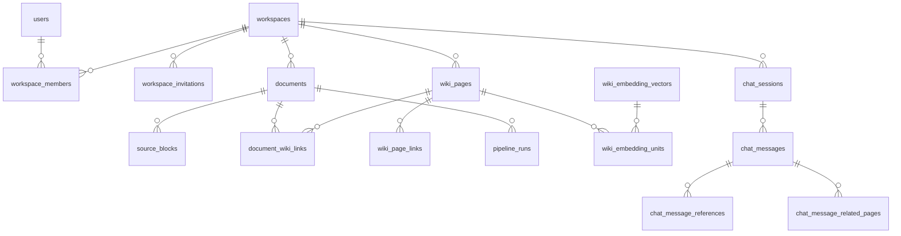

# 데이터 모델 요약

MSA 전환 후 데이터 소유·저장소 구조 압축본.
상세 원문: `docs/backlog/Fruition_MVP_Erd.md`, `docs/backlog/spec/pipeline-db-ownership.md`, `docs/backlog/msa/current-architecture.md` §4.

## 1. 저장소 개요

| 저장소 | 소유 서비스 | 용도 |
|---|---|---|
| **access_db** (PostgreSQL) | access-svc | 사용자·OAuth·refresh token·워크스페이스·멤버 (자체 Flyway) |
| **core_db** (PostgreSQL) | document-svc | 문서 metadata·폴더·채팅·operation·본문·편집 revision·write receipt·content version·asset/reference·Agent 적용 projection·감사·편집 outbox |
| **ai_db** (PostgreSQL) | ai-svc | Wiki 현재 상태·pipeline run·embedding·schema·문서 파생물 stale 추적·Agent·Skill·checkpoint (`ai_schema.sql`) |
| **Redis** | access-svc / document-svc / ai-svc | 권한 projection·OAuth 교환 코드 / query run·SSE / user+workspace Concept index·ingest short lock |
| **S3/MinIO** | document-svc | 문서 원본·snapshot, Wiki markdown 본문 |

**object key 표기 규약**: `documents.source_uri`는 항상 평문 키(`sources/documents/{document_id}/original`)다. document-svc가 문서를 만들 때 조립해 넣고 이후 바뀌지 않으며, `s3://` 형식은 `Document` 생성자가 거부한다. `s3://<bucket>/<key>` 형식이 들어오는 컬럼은 파이프라인이 콜백으로 채우는 `documents.extracted_text_uri` 뿐이다. 두 표기가 섞이면 쓰기와 읽기가 서로 다른 키를 가리켜도 오류 없이 어긋나므로, 읽기·쓰기 양쪽 모두 `normalizeObjectKey`를 거친다.

## 2. DB별 핵심 테이블

### access_db (access-svc)

| 테이블 | 소유 | 용도 | 핵심 컬럼/관계 |
|---|---|---|---|
| users | access-svc | 사용자 계정 | `(email, provider)` UK, `provider`는 계정을 만든 수단(`local`/OAuth 등록 ID), `password_hash`(OAuth 전용은 NULL) |
| user_oauth_accounts | access-svc | OAuth provider 연결 | users 1:N(FK `ON DELETE CASCADE`), `(provider, provider_user_id)` |
| user_refresh_tokens | access-svc | JWT refresh token | `token_hash`(SHA-256), `revoked_at`으로 탈취 감지, `user_agent`(세션 목록의 기기 구분. 컬럼 신설 이전 발급분은 NULL) |
| user_mfa | access-svc | TOTP 설정 | PK/FK `user_id`(삭제 cascade), `secret_cipher`·`secret_nonce`(AES-GCM. 검증에 원문이 필요해 해시로 둘 수 없다), `activated_at`(NULL이면 등록만 하고 미활성이라 로그인을 막지 않음), `last_used_counter`(같은 시간 창 재사용 차단) |
| user_mfa_recovery_codes | access-svc | 1회용 복구 코드 | `code_hash`(SHA-256, 원문 미저장), `consumed_at`. 미소비분에 partial index |
| user_mfa_challenges | access-svc | 로그인 2단계 중간 상태 | `token_hash` UK, `expires_at`(기본 300초), `consumed_at`. 비밀번호는 통과했지만 코드를 아직 못 받은 상태다 |
| workspaces | access-svc | 격리 단위 | 문서·Wiki·채팅의 소속 기준, 아이콘 `icon_emoji`·`icon_image_hash`·`icon_image_content_type`(이모지와 이미지는 CHECK 제약으로 배타), workspace 설정 snapshot인 `ingest_lint_provider`·`ingest_lint_model`(새 workspace 기본값 `gemini/gemini-3.1-flash-lite`) |
| workspace_icons | access-svc | 아이콘 이미지 바이너리 | PK/FK `workspace_id` → `workspaces(id)`(삭제 cascade), `image bytea`. 목록 조회가 바이너리를 함께 읽지 않도록 workspaces에서 분리했다. 1MB 상한이라 object storage를 쓰지 않는다 |
| workspace_members | access-svc | 멤버십(N:M 대비) | 복합 PK `(workspace_id, user_id)`, `role`(owner/member) |
| workspace_invitations | access-svc | 이메일 초대(수락 전 상태) | `token_hash`(SHA-256, 원문 미저장), `expires_at`, `accepted_at`/`accepted_by`/`revoked_at`. 대기 중 초대는 `(workspace_id, email)` partial unique라 재초대는 새 행이 아니라 재발송이다. 계정이 `(email, provider)`로 분리돼 있어 어느 계정이 멤버가 될지는 수락 시점에 정해진다 |

### core_db (document-svc)

- `chat_messages.web_search_enabled`: 질의 요청의 `allow_web_search` 실행 시점 snapshot

| 테이블 | 소유 | 용도 | 핵심 컬럼/관계 |
|---|---|---|---|
| documents | document-svc | 원본 문서 업로드·처리 상태 | `status`, `content_hash`(일반 문서는 동일 값 허용), `pipeline_run_id`, `origin`(upload/chat_export), `pipeline_input_blocks`(chat_export의 문답 provenance). `chat_export`만 `(workspace_id, content_hash, selection_mode)` partial unique이고 읽기 전용이다 |
| document_edit_states | document-svc | canonical 최신 Markdown과 편집 CAS 상태 | PK/FK `document_id` → `documents(id)`(삭제 cascade), `markdown`, `content_hash`, `revision bigint > 0`, `created_at`, `updated_at`. `revision`이 HTTP 편집 version·동시 저장 CAS·event 순서 기준이며 `documents.current_version`은 lifecycle metadata다 |
| document_edit_writes | document-svc | `revision_write_id` 멱등 replay receipt | PK `(document_id, revision_write_id)`, FK document(삭제 cascade), `request_hash`, `result_revision > 0`, `result_content_hash`, `result_updated_at`, `actor_user_id`, `changed`, `created_at`. 같은 request hash는 replay하고 다른 payload는 conflict |
| document_edit_outbox | document-svc | 편집 이벤트 transactional outbox | PK `event_id`, `document_id`(문서 hard delete와 무관하게 발행 완료까지 보존), `workspace_id`, `revision > 0`, `content_hash`, `event_type=document.edit.saved.v1`, `schema_version > 0`, `created_at`, `published`, `published_at`. pending index `(created_at,event_id)`로 순서 발행하며 at-least-once |
| ai_command_outbox | document-svc | AI command의 transactional outbox | `run_id` UK, Kafka topic·key·payload |
| ai_operation_logs | document-svc | 문서·Wiki AI 작업 및 복구 감사 로그 | `target_display_name`은 작업 시작 시점 대상 이름 snapshot이다. `document_restore_blocked`는 V39 당시 기존 `document_edit`만 true로 표시하며 해당 감사 행의 복구를 차단한다. 새 작업과 ingest/lint는 false; 복구는 `restore_token_hash`(미리보기 토큰 SHA-256)와 `(restored_from, restore_token_hash)` partial unique로 동일 실행을 DB에서 1회만 선점 |
| ai_operation_changes | document-svc | 작업별 변경 리소스 감사 내역 | `resource_display_name`은 변경 시점 리소스 이름 snapshot이며 이후 Wiki rename/delete와 무관하게 유지된다. |
| ai_task_runs·ai_task_changes | document-svc | 공개 AI 작업 상태·업무 행의 변경 전후 값·복구 완료 기록 | run ID와 actor, trigger로 같은 트랜잭션에 기록; V47 |
| ai_task_result_receipts | document-svc | `ai.task.event` 멱등 반영 영수증 | `event_id` PK, `run_id`, `task_kind` |
| agent_apply_projections | document-svc | Markdown Agent 적용 예약·결과 projection | `run_id` PK, `apply_operation_id` UK, `base_version`, V33 `apply_revision_write_id`, V35 `ready_markdown`, queued→ready/failed→consumed. V36은 기존 ready를 backfill하고 복구 불가 건을 `failed`로 전환 |
| wiki_page_versions | document-svc | Wiki 본문 revision 이력 | 복합 PK `(page_id, revision)`, 페이지 ID는 ai_db 논리 참조 |
| wiki_page_contributions | document-svc | 복구용 ingest 기여 원장 | 복합 PK `(page_id, ingest_operation_id)`, 비활성화 이력 보존 |
| chat_sessions | document-svc | 채팅 세션(workspace당 10개) | `context_summary` |
| chat_messages | document-svc | 질의응답 메시지 | `pair_id`로 user·assistant 쌍 식별, user·assistant 모두 `ai_provider`·`ai_model`·`web_search_enabled` snapshot |
| agent_route_outcomes (view) | document-svc | Agent route 운영 평가 후보 | 기존 적용 projection과 채팅을 연결하며 편집 적용은 `accepted`, 실행 실패는 `technical_failure`, 나머지는 `unlabeled`로 노출 |
| chat_message_references | document-svc | 답변 근거 source block 스니펫 | chat_messages 1:N, `source_block_ids` |
| chat_message_related_pages | document-svc | 답변 관련 Wiki 페이지 목록 | chat_messages 1:N, `relevance_score`·`depth` |
| chat_partial_wiki | document-svc | 채팅 export 문답↔페이지 멤버십 | `UNIQUE(pair_id, wiki_page_id)` |
| document_assets | document-svc | 문서 첨부 이미지 metadata(바이너리는 MinIO) | `storage_key` UK, `content_hash`(ETag), `unreferenced_since`(정리 후보 판정). workspace_id·uploaded_by는 access_db 논리 참조(물리 FK 없음) |
| document_asset_references | document-svc | 문서 본문↔asset 참조 동기화 | 복합 PK `(document_id, asset_id)`, asset 삭제 RESTRICT — 참조 중 asset 보호 |
| document_asset_orphans | document-svc | storage 정리 실패 asset 재시도 큐 | `storage_key` UK, `retry_count`, cleanup worker가 소비 |
| wiki_lint_state | document-svc | workspace별 마지막 lint 성공 시각(needs_lint 판단 기준점) | PK `workspace_id`(access_db 논리 참조), `last_lint_at` |

V34는 `chat_export`에만 `(workspace_id, content_hash, selection_mode)` partial unique index를 추가한다.
채팅 export는 언제나 선택한 문답만 담은 새 문서라 `selection_mode`는 항상 `partial`이고, 같은 선택을 다시 내보내면
이 index가 기존 문서를 재사용하게 한다. 세션 전체를 위키에 누적하던 경로를 걷어내면서
`chat_sessions.wiki_page_id`·`chat_sessions.wiki_export_document_id`·`chat_messages.wiki_page_id`는 쓰지 않는 잔여 컬럼이 됐다
(코드 매핑만 제거했고 컬럼은 남아 있다).
V43은 `documents.pipeline_input_blocks`를 추가한다. 채팅 export는 문답 단위 블록(JSON 배열, `block_id =
session_id:pair_id`)을 여기에 보존하고, 완료 후처리가 이 값을 읽어 문답↔페이지 멤버십을 기록한다. 일반 문서
Ingest 경로는 이 필드를 쓰지 않고 block ID를 새로 부여하므로, 파이프라인이 돌려준 값은 provenance로 쓰지 않는다.
V44는 AI 작업 로그와 변경 항목에 실행 시점의 문서 표시 이름 스냅샷을 추가한다.
V45는 원문을 복제하지 않고 `agent_apply_projections`와 `chat_messages`를 연결하는
`agent_route_outcomes` view를 추가한다. 취소·재시도는 route 실패로 단정하지 않는다.

### ai_db (ai-svc)

| 테이블 | 소유 | 용도 | 핵심 컬럼/관계 |
|---|---|---|---|
| wiki_schemas | ai-svc | 워크스페이스·사용자별 Wiki 생성 규칙 | active 스키마는 소유 범위당 최대 1개(부분 unique index) |
| document_derived_state | ai-svc | 문서 파생물 stale 추적 | `document.edit.event` consumer가 갱신 |
| wiki_pages·document_wiki_links·wiki_page_links | ai-svc | Wiki 현재 상태와 문서/페이지 관계 | workspace 범위 unique, DB 밖 document ID는 논리 참조 |
| source_blocks | ai-svc | 문서 block 텍스트 | 복합 PK `(block_id, document_id)` |
| pipeline_runs | ai-svc | pipeline 실행 상태 | Spring이 만든 `run_id`, `user_id`·`workspace_id` 보존. ingest manifest의 `post_ingest.status`는 `running/retrying/ready/needs_review` 품질 진단 상태를 보존 |
| wiki_page_embeddings·wiki_embedding_vectors·wiki_embedding_units | ai-svc | 검색용 embedding과 페이지 embedding 재처리 예약 | `wiki_page_embeddings.status`의 `pending`·`failed`는 maintenance worker가 재처리, page FK는 ai_db 내부, document ID는 논리 참조 |
| ai_task_runs·ai_task_changes | ai-svc | 비 Agent 작업·부모/자식·AI DB/객체 저장소 변경 기록 | command hash, 취소 상태, 역순 복구 기록 |
| skills·skill_versions·skill_version_sources | ai-svc | 개인·팀 Skill과 게시 version·생성 근거 | 개인은 `owner_user_id`, 팀은 `workspace_id`; 팀 권한은 access-svc 조회 |
| agent_runs·agent_plans·agent_plan_operations | ai-svc | Agent 실행·승인 대상 plan·operation | Markdown command는 Spring이 공급한 run ID와 envelope hash를 영속. 완료 `result`는 route를, 실패 `result`는 error code·예외 유형과 route 계약 교정 사유를 보존 |
| agent_approvals·agent_jobs·agent_tool_executions·agent_run_artifacts | ai-svc | 승인·lease/retry·Tool 멱등 실행·비동기 artifact | run/plan/operation FK, Tool 호출 수 40회 제한 |
| checkpoint_migrations·checkpoints·checkpoint_blobs·checkpoint_writes | ai-svc | LangGraph Agent 중단·재개 상태 | `PostgresSaver`가 `AI_DATABASE_URL`로 사용 |

Concept 본문 persistence는 ingest와 lint `materialize=true`가 같은 `(user_id, workspace_id)` PostgreSQL transaction advisory lock을 사용해 최종 object read-modify-write부터 DB commit까지 직렬화한다.

LLM provider/model은 workspace 설정 또는 chat/request에서 snapshot되어 command와 실행에 전달된다. API key는 DB·Kafka payload·log에 저장하지 않고 ai-svc secret env에서만 읽으며, 기존 AI 작업 로그 조회/결과 경로에는 LLM 설정 컬럼이 없다.

문서 편집 저장은 document-svc가 소유한 `core_db` PostgreSQL transaction에서 본문·편집 상태·write receipt·content version·asset/reference·Agent 적용 감사·`document_edit_outbox`를 함께 commit 또는 rollback한다. V39는 `document_edit_states`와 `document_content_versions`가 모두 빈 상태에서 시작하는 fresh cutover이며, 기존 Mongo 편집 데이터와 두 PostgreSQL table의 폐기는 대상별 승인을 전제로 한다. 기존 편집 데이터 import, fallback, dual-write를 사용하지 않는다. 결정 근거: [adr/0016](adr/0016-consolidate-document-body-into-postgres.md). S3/MinIO object upload는 transaction 밖이므로 실패·무변경 저장 시 업로드 호출자가 object를 정리한다. outbox publisher는 `created_at,event_id` 순으로 처리하고 첫 실패에서 cycle을 중단하며 현재 1 replica 전제를 둔다.

## 3. 핵심 관계

주의: DB 경계를 넘는 ID 관계는 V27부터 물리 FK가 아닌 논리 참조다. document-svc는 Wiki 현재 상태를 AI 내부 API로 읽는다.

## 4. 계정 격리 정책

- DB 계정은 **runtime(DML) / migration(DDL) 분리**: `access_runtime/migration`, `core_runtime/migration`, `ai_runtime/migration` (`infra/postgres/init-db-isolation.sh`).
- AWS runtime은 자기 runtime 자격증명만 받고 migration 자격증명은 별도 Job만 받는다. bootstrap 관리자 인증은 runtime/Job에 주입하지 않는다. 로컬 startup migration은 자기 서비스 migration 계정만 사용하는 개발 실행 예외다.
- 타 서비스 DB write를 금지한다. `ai_runtime`에는 core DB DML 권한과 runtime 연결 설정을 부여하지 않는다.
- 코드 경계도 컴파일러가 강제: access-svc와 document-svc는 서로의 repository를 import하지 않고 내부 API·Redis projection으로만 연결.
- Idempotency 테이블은 각 DB에 서비스별 사본(코드는 java-shared 공유, 테이블 분리)을 둔다. `(user_id, endpoint_scope, idempotency_key)` unique constraint로 실행 전 `IN_PROGRESS`를 원자 선점하고, 비즈니스 변경과 응답 저장이 같이 commit되면 `COMPLETED`로 전환한다. `IN_PROGRESS.expires_at`은 15분 실행 lease이며 만료 재선점은 같은 `request_hash`에만 허용하고 `claim_token`을 교체해 이전 실행을 fencing한다. 문서 resource ID·MinIO object key는 각 `claim_token`별로 다르게 만들어 이전 실행의 rollback cleanup이 재선점 실행의 객체를 삭제하지 못하게 한다. 신규 `COMPLETED` 기록은 응답과 완료 시점+24시간 `expires_at`을 저장한다. 기존 행은 migration에서 `COMPLETED`로 간주한다.

## 5. AI 저장소 cutover 안정화

- Wiki·Agent·Skill·checkpoint는 ID를 보존해 ai_db로 이전한다. core의 기존 source 테이블은 rollback 안정화 기간 동안 read-only로 보존하고 별도 migration에서 제거한다.
- Agent/Skill/checkpoint DDL의 단일 소유자는 Python `ai_schema.sql`이다. 팀 멤버십은 `workspace_members`를 직접 join하지 않고 access-svc 내부 권한 API로 조회한다.
- Markdown Agent는 ai_db의 `agent_runs`·`agent_jobs`로 실행·취소하고, core_db의 `ai_task_runs`가 채팅·업무 변경까지 복구를 조율한다. 비 Agent 작업은 ai_db의 `ai_task_runs`·`ai_task_changes`를 사용한다. Agent Tool 실행의 역작업은 `agent_tool_executions`에 별도 멱등키로 기록하며, 적용 projection의 `autonomous_tool`은 일반 턴 적용과 도구 역작업의 인가 경계를 구분한다.

취소로 본문을 복구한 뒤에도 `document_edit_states.revision`은 증가한다. 복구 outbox 이벤트를 AI 파생 상태에 동기 반영해 늦은 기존 편집 이벤트가 복구를 뒤집지 못하게 한다. 생성 문서 삭제의 파생 상태 tombstone과 작업·멱등 기록은 운영 기록으로 유지한다.

AI 실행 진단 로그는 S3 `pipeline-runs/{run_id}/pipeline.log`에 저장한다. 상태·manifest의 소유권은 ai_db에 있으며, 진단 로그는 업무 object 취소 rollback 대상이 아니다. 실행 재시도는 같은 key에 새 시도 로그를 저장한다.

AWS Redis는 서비스별 ACL 사용자로 분리한다. Access의 `auth:*`·`oauth:exchange:*`, Document의 `query:*`, AI의 `wiki:concept-index:*` 값 접근을 분리하고 `authz:role:*`는 Access 삭제/Document 적재·조회인 명시적 공유 projection이다. Access SCAN의 key 이름 열람 예외가 있다. S3 Document·AI prefix별 값 접근과 앱 bucket ListBucket metadata 예외는 [아키텍처](architecture.md#aws-저장소통신-권한)를 따른다.
