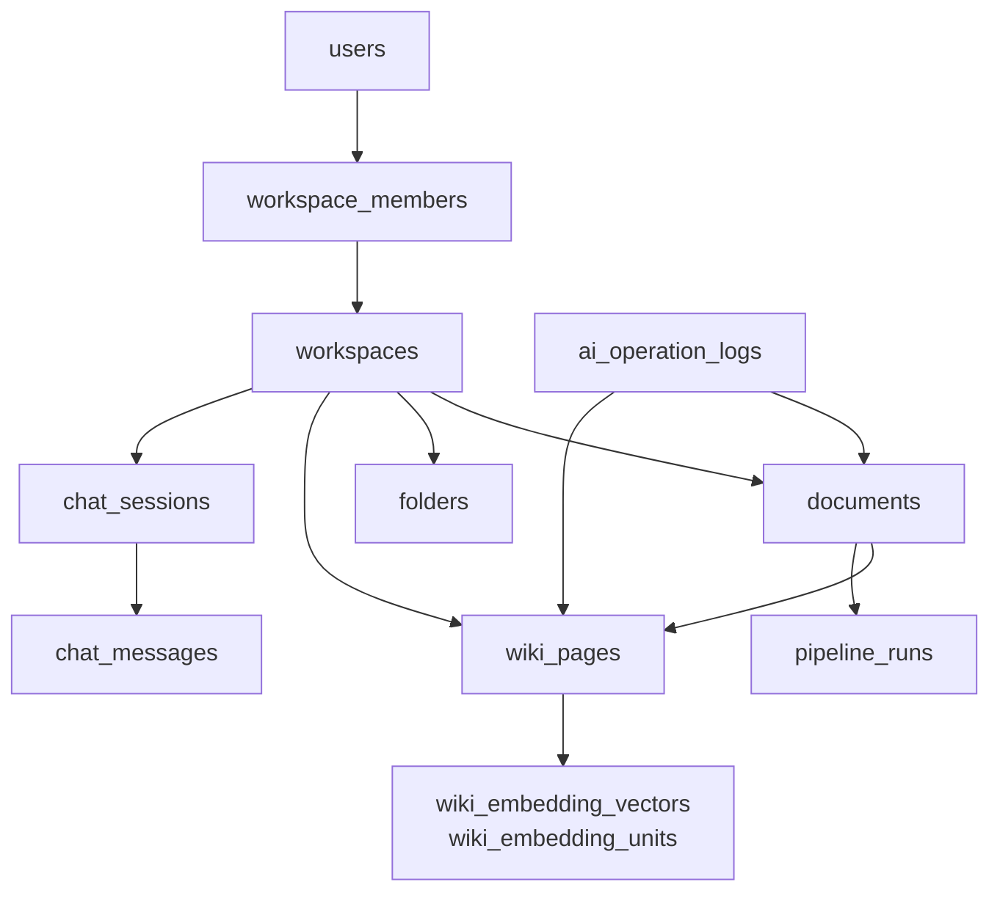

# Fruition 데이터 모델

> 상태: 현재 구현 기준
> Schema source of truth: `backend/src/main/resources/db/migration/V1__baseline_schema.sql` ~ `V19__*.sql`

애플리케이션은 `spring.jpa.hibernate.ddl-auto=validate`를 사용한다. 테이블 생성·변경은 Flyway migration이 담당하고, `llmPipeline`은 startup에서 공용 스키마를 확인한다. `flyway_schema_history`와 `spring_session*`은 애플리케이션 domain 테이블이 아니다.

## 1. 데이터 경계



Workspace는 사용자 데이터 격리의 논리적 루트다. 문서와 Wiki의 관계는 `document_wiki_links`, Wiki graph의 방향성 관계는 `wiki_page_links`, 채팅 답변의 근거는 `chat_message_references`로 표현한다.

## 2. 테이블 그룹과 책임

| 그룹 | 현재 테이블 | 주요 책임 | 주된 writer |
|---|---|---|---|
| Identity | `users`, `user_oauth_accounts`, `user_refresh_tokens`, `email_verifications` | 로그인·OAuth·refresh·이메일 검증 | Spring Boot |
| Workspace | `workspaces`, `workspace_members` | 사용자와 Workspace 격리 | Spring Boot |
| Document | `documents`, `folders`, `document_processing_queue`, `document_edit_states`, `document_content_versions`, `document_edit_locks`, `idempotency_records` | 원본·편집 문서·처리 queue·동시성 | Spring Boot |
| Asset | `document_assets`, `document_asset_references`, `document_asset_orphans` | Markdown에 포함된 이미지 등 asset | Spring Boot |
| Wiki | `wiki_pages`, `document_wiki_links`, `wiki_page_links`, `source_blocks`, `wiki_schemas` | source/concept page·graph·근거 block·규칙 | Spring Boot schema / pipeline 결과 writer |
| Chat | `chat_sessions`, `chat_messages`, `chat_message_references`, `chat_message_related_pages`, `chat_partial_wiki` | 질의응답·근거·채팅 Wiki export | Spring Boot |
| Pipeline/Search | `pipeline_runs`, `wiki_page_embeddings`, `wiki_embedding_vectors`, `wiki_embedding_units` | 실행 기록·검색 projection·embedding | llmPipeline |
| AI history | `ai_operation_logs`, `ai_operation_changes`, `wiki_page_versions`, `wiki_page_contributions` | AI 변경 이력·복구·재조립 | Spring Boot와 pipeline callback |

`documents`, `wiki_pages`, `source_blocks`, `document_wiki_links`, `wiki_page_links`는 설계상 Backend 소유 영역이지만, 현재 ingestion 구현은 pipeline이 일부 결과 테이블과 문서 상태를 직접 갱신한다. 이 known debt와 C-poll 전환 방향은 [ADR-0003](./adr/0003-choose-event-processing-strategy.md)에 기록한다.

## 3. 핵심 Entity

### users / workspaces / workspace_members

| Entity | 핵심 필드 | Nullable / 제약 |
|---|---|---|
| `users` | `id`, `email`, `display_name`, `password_hash`, timestamps | OAuth-only 사용자는 `password_hash`가 NULL일 수 있음. `email`은 unique |
| `workspaces` | `id`, `name`, `created_at`, `updated_at`, `deleted_at` | soft delete 지원 |
| `workspace_members` | `workspace_id`, `user_id`, `role`, `joined_at` | `(workspace_id, user_id)` 복합 PK. 현재 생성자의 `owner` 중심 |

### documents

문서 원본과 편집 문서의 관리 metadata를 저장한다.

| 필드 | 타입 | Nullable | 용도 |
|---|---|---|---|
| `id` | `varchar` | no | 문서 식별자 |
| `workspace_id`, `user_id` | `varchar` | no | 소유·격리 범위 |
| `filename`, `mime_type`, `byte_size` | `varchar`, `varchar`, `bigint` | no | 업로드 metadata |
| `status` | `varchar` | no | `uploaded`, `processing`, `completed`, `failed` 중 하나 |
| `source_uri` | `varchar` | migration에 따라 nullable 가능 | MinIO 원본 object key |
| `content_hash` | `varchar(64)` | 편집 문서는 nullable 가능 | 중복·변경 감지 hash |
| `current_content_hash`, `current_version` | `varchar`, `bigint` | current version 사용 시 no | Markdown 편집 상태 |
| `document_role`, `folder_id`, `sort_order` | `varchar`, `uuid`, `bigint` | 일부 nullable | 문서 트리 배치 |
| `pipeline_run_id`, `processing_*` | 여러 타입 | yes | 비동기 처리 상태와 heartbeat |
| `origin`, `selection_mode`, `pipeline_input_markdown` | `varchar`, `varchar`, `text` | yes | chat export 분기와 delta input |
| `deleted_at`, `deleted_by`, `delete_operation_id` | 여러 타입 | yes | 비파괴 삭제·복구 |

### wiki_pages / links / source_blocks

| Entity | 핵심 필드 | 제약·조회 패턴 |
|---|---|---|
| `wiki_pages` | `id`, `workspace_id`, `user_id`, `page_type`, `title`, `slug`, `summary`, `markdown_uri`, `status` | `page_type`은 `source`·`concept` 중심. Workspace별 graph 조회 |
| `document_wiki_links` | `document_id`, `wiki_page_id`, `relation_type`, `confidence` | `(document_id, wiki_page_id, relation_type)` 복합 PK. `source_of`, `extracted_concept` |
| `wiki_page_links` | `from_page_id`, `to_page_id`, `link_type`, `label`, `confidence` | 방향성 edge. graph 조회 시 양 끝 page가 같은 Workspace인지 service에서 필터 |
| `source_blocks` | `document_id`, `block_id`, `text` | `(document_id, block_id)` 복합 PK. Query citation이 block ID를 참조 |

### chat_sessions / chat_messages

`chat_sessions`는 Workspace와 사용자에 속하고, `chat_messages`는 `pair_id`로 user·assistant 메시지 쌍을 식별한다. assistant 결과는 `chat_message_references`의 source block, `chat_message_related_pages`의 탐색 page, `chat_partial_wiki`의 partial export membership으로 분리 저장한다.

### Version, lock, operation

| 테이블 | 역할 | 핵심 규칙 |
|---|---|---|
| `document_content_versions` | Markdown 전체 본문 snapshot | `(document_id, version)` PK. 복원도 새 version append |
| `document_edit_locks` | 문서 편집 lease | 문서당 1행. heartbeat가 끊기면 `expires_at`으로 만료 |
| `wiki_page_versions` | Wiki 본문 snapshot | `(page_id, revision)` PK. 복구도 revision을 줄이지 않음 |
| `wiki_page_contributions` | Wiki page를 구성하는 ingest 기여 | active contribution을 조합해 restore 대상 계산 |
| `ai_operation_logs` | ingest·lint·restore·document edit 작업 상태 | Workspace·operation type·created_at 중심 조회 |
| `ai_operation_changes` | operation이 만든 resource별 변화 | operation별 detail과 복구 대상 조회 |

### Pipeline와 검색 projection

`pipeline_runs`는 FastAPI 실행 상태·manifest·error를 저장한다. `wiki_page_embeddings`는 page/model별 현재 embedding, `wiki_embedding_vectors`는 동일 representation의 공유 vector, `wiki_embedding_units`는 source block·page 단위 검색 텍스트다. 이 데이터는 원본 문서와 Wiki 관계에서 재생성 가능한 projection으로 취급한다.

## 4. 상태와 생명주기

### 문서

```text
uploaded -> processing -> completed
                     \-> failed
```

Markdown upload 또는 explicit ingest가 `document_processing_queue`에 pending row를 만들고, Spring worker가 processing으로 claim한다. pipeline run 요청이 실패하면 Backend가 `failed`와 error를 기록한다. 진행 callback은 `processing_stage`와 `processing_updated_at`을 갱신한다.

### Wiki page

```text
draft -> active
     \-> failed
active -> deleted (soft state, V17)
```

본문 변경은 `wiki_page_versions`에 append하고, ingest 기여는 `wiki_page_contributions`로 추적한다. restore는 기존 row를 지우기보다 contribution을 비활성화하고 필요한 page를 재구성한다.

### AI operation

```text
processing -> applying -> succeeded
          \-> failed
          \-> conflict
          \-> rebuilding -> succeeded | failed
```

operation 결과 callback은 operation ID와 payload hash로 중복·다른 결과를 구분한다.

## 5. Object Storage 모델

PostgreSQL에는 object key·content hash·상태 metadata를 두고, 큰 본문과 binary는 MinIO에 둔다.

| 데이터 | 저장소 | 현재 용도 |
|---|---|---|
| 업로드 원본 PDF/Markdown | MinIO `sources/documents/{document_id}/...` | 원본 보존·streaming |
| 편집 Markdown과 export | PostgreSQL 상태 + MinIO object | version·hash와 본문 분리 |
| Wiki Markdown/artifact | MinIO `wiki/...` 및 pipeline artifact | graph page 상세 조회·restore |
| 문서 asset | MinIO object + `document_assets*` | 이미지 등 binary와 참조 관계 |
| 실행 manifest/debug | `pipeline_runs.manifest`와 pipeline run volume | 실행·평가 결과 추적 |

Bucket은 anonymous access를 허용하지 않는다. API가 Workspace 권한을 확인한 뒤 object를 읽거나 stream한다.

## 6. 소유권과 현재 Known Debt

- Flyway version과 스키마 변경은 Backend repository가 관리한다.
- Identity, Workspace, document metadata, chat, operation log의 제품 규칙은 Spring Boot가 관리한다.
- Pipeline run·embedding·LLM workflow는 `llmPipeline`이 관리한다.
- Wiki ingestion 결과와 일부 `documents.status`는 현재 pipeline이 공유 PostgreSQL에 직접 쓴다. 이 때문에 schema coupling과 single-writer 위반이 남아 있다.
- 중기 목표는 pipeline이 산출물·run 상태를 확정한 뒤 Backend가 문서 상태와 제품 후처리를 소유하도록 전환하는 것이다.

## 7. Index와 Query Pattern

- Workspace membership: `(workspace_id, user_id)` 복합 PK
- 문서 트리: `idx_folders_parent_order`, `idx_documents_folder_order`, Workspace·folder·sort order
- 문서 검색: `idx_documents_normalized_filename`, Workspace·normalized filename
- 처리 재조정: `idx_documents_reconcile`, origin·status·reconciled state
- Version 조회: `document_content_versions(document_id, version DESC)`, `wiki_page_versions(page_id, revision DESC)`
- Lock 만료: `idx_document_edit_locks_expires(expires_at)`
- AI log 목록: `idx_ai_operation_logs_workspace_type(workspace_id, operation_type, created_at DESC)`
- Embedding lookup: model/hash index와 page/vector reference index
- Email verification: email·purpose·created_at, token hash index

## 8. 개인정보와 보존

- 비밀번호, refresh token, verification code/token은 원문을 저장하지 않는다.
- `chat_messages`, Markdown, Wiki artifact는 사용자 입력과 문서 본문을 포함할 수 있으므로 Workspace 권한 없이 반환하지 않는다.
- LLM credential과 내부 token은 DB·object·application log에 저장하지 않는다.
- 문서·Wiki 삭제는 domain별 cascade/set-null 정책을 따르며, AI operation log는 복구와 감사 목적상 대상 resource 삭제 후에도 보존될 수 있다.

## 9. Schema References

- Flyway migrations: `backend/src/main/resources/db/migration/`
- Flyway 운영 규칙: [backend README](../backend/README.md#데이터베이스-스키마-flyway)
- 현재 API: [API 문서](./api.md)
- 현재 데이터 흐름: [Architecture](./architecture.md#core-data-flow)
- 이전·부분 ERD: [백로그의 Fruition_MVP_Erd.md](./backlog/Fruition_MVP_Erd.md)
- 초기 ERD spec: [백로그의 backend-mvp-erd.md](./backlog/backend-mvp-erd.md)
