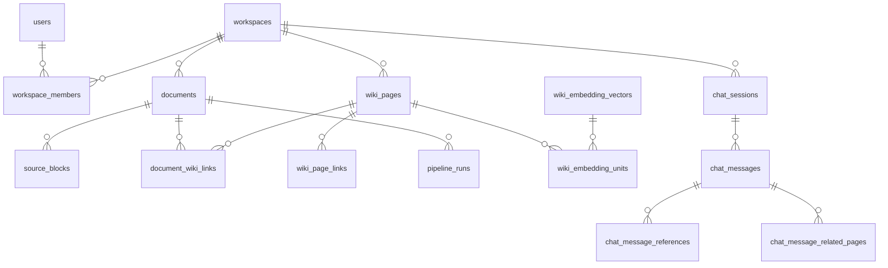

# 데이터 모델 요약

MSA 전환 후 데이터 소유·저장소 구조 압축본.
상세 원문: `docs/backlog/Fruition_MVP_Erd.md`, `docs/backlog/spec/pipeline-db-ownership.md`, `docs/backlog/msa/current-architecture.md` §4.

## 1. 저장소 개요

| 저장소 | 소유 서비스 | 용도 |
|---|---|---|
| **access_db** (PostgreSQL) | access-svc | 사용자·OAuth·refresh token·워크스페이스·멤버 (자체 Flyway) |
| **core_db** (PostgreSQL) | document-svc / 전환기 ai-svc | 문서 metadata·폴더·채팅·operation·Wiki revision/기여 이력. Wiki 현재 상태·pipeline run·embedding은 maintenance cutover 전까지 물리적으로 동거 |
| **ai_db** (PostgreSQL) | ai-svc | Wiki schema·문서 파생물 stale 추적. Wiki 현재 상태는 후속 maintenance cutover에서 이전 (`ai_schema.sql`) |
| **MongoDB** | document-svc | 문서 본문·편집 revision·write-id·edit outbox — 단일 트랜잭션 후 outbox → Kafka `document.edit.event` |
| **Redis** | access-svc / document-svc | 권한 projection·OAuth 교환 코드 / query run 상태·SSE 이벤트 |
| **S3/MinIO** | document-svc | 문서 원본·snapshot, Wiki markdown 본문 |

**object key 표기 규약**: `documents.source_uri`는 항상 평문 키(`sources/documents/{document_id}/original`)다. document-svc가 문서를 만들 때 조립해 넣고 이후 바뀌지 않으며, `s3://` 형식은 `Document` 생성자가 거부한다. `s3://<bucket>/<key>` 형식이 들어오는 컬럼은 파이프라인이 콜백으로 채우는 `documents.extracted_text_uri` 뿐이다. 두 표기가 섞이면 쓰기와 읽기가 서로 다른 키를 가리켜도 오류 없이 어긋나므로, 읽기·쓰기 양쪽 모두 `normalizeObjectKey`를 거친다.

## 2. DB별 핵심 테이블

### access_db (access-svc)

| 테이블 | 소유 | 용도 | 핵심 컬럼/관계 |
|---|---|---|---|
| users | access-svc | 사용자 계정 | `email` UK, `password_hash`(OAuth 전용은 NULL) |
| user_oauth_accounts | access-svc | OAuth provider 연결 | users 1:N, `(provider, provider_user_id)` |
| user_refresh_tokens | access-svc | JWT refresh token | `token_hash`(SHA-256), `revoked_at`으로 탈취 감지 |
| workspaces | access-svc | 격리 단위 | 문서·Wiki·채팅의 소속 기준 |
| workspace_members | access-svc | 멤버십(N:M 대비) | 복합 PK `(workspace_id, user_id)`, `role`(owner/member) |

### core_db (document-svc)

| 테이블 | 소유 | 용도 | 핵심 컬럼/관계 |
|---|---|---|---|
| documents | document-svc | 원본 문서 업로드·처리 상태 | `status`, `content_hash` UK, `pipeline_run_id`, `origin`(upload/chat_export) |
| ai_command_outbox | document-svc | AI command의 transactional outbox | `run_id` UK, Kafka topic·key·payload |
| wiki_page_versions | document-svc | Wiki 본문 revision 이력 | 복합 PK `(page_id, revision)`, 페이지 ID는 ai_db 논리 참조 |
| wiki_page_contributions | document-svc | 복구용 ingest 기여 원장 | 복합 PK `(page_id, ingest_operation_id)`, 비활성화 이력 보존 |
| chat_sessions | document-svc | 채팅 세션(workspace당 10개) | `context_summary`, `wiki_page_id`(full export 연결) |
| chat_messages | document-svc | 질의응답 메시지 | `pair_id`로 user·assistant 쌍 식별 |
| chat_message_references | document-svc | 답변 근거 source block 스니펫 | chat_messages 1:N, `source_block_ids` |
| chat_message_related_pages | document-svc | 답변 관련 Wiki 페이지 목록 | chat_messages 1:N, `relevance_score`·`depth` |
| chat_partial_wiki | document-svc | partial export 문답↔페이지 멤버십 | `UNIQUE(pair_id, wiki_page_id)` |
| document_assets | document-svc | 문서 첨부 이미지 metadata(바이너리는 MinIO) | `storage_key` UK, `content_hash`(ETag), `unreferenced_since`(정리 후보 판정). workspace_id·uploaded_by는 access_db 논리 참조(물리 FK 없음) |
| document_asset_references | document-svc | 문서 본문↔asset 참조 동기화 | 복합 PK `(document_id, asset_id)`, asset 삭제 RESTRICT — 참조 중 asset 보호 |
| document_asset_orphans | document-svc | storage 정리 실패 asset 재시도 큐 | `storage_key` UK, `retry_count`, cleanup worker가 소비 |
| wiki_lint_state | document-svc | workspace별 마지막 lint 성공 시각(needs_lint 판단 기준점) | PK `workspace_id`(access_db 논리 참조), `last_lint_at` |
| wiki_pages·document_wiki_links·wiki_page_links·source_blocks | ai-svc(전환기 core_db) | Wiki 현재 상태·문서/페이지 관계·source block | Spring은 직접 접근하지 않고 AI 내부 API로 조회 |
| pipeline_runs·wiki_page_embeddings·wiki_embedding_vectors·wiki_embedding_units | ai-svc(전환기 core_db) | 실행 상태와 검색용 embedding | `user_id`·`workspace_id`를 run에 보존해 documents JOIN 제거 |
| skills·skill_versions·skill_version_sources | ai-svc | 개인·팀 Skill과 게시 version·생성 근거 | 개인은 `owner_user_id`, 팀은 `workspace_id`; 팀 권한은 access-svc 조회 |
| agent_runs·agent_plans·agent_plan_operations | ai-svc | Agent 실행·승인 대상 plan·operation | `operation_hash`, 현재 plan, 사용자·workspace 범위 |
| agent_approvals·agent_jobs·agent_tool_executions·agent_run_artifacts | ai-svc | 승인·lease/retry·Tool 멱등 실행·비동기 artifact | run/plan/operation FK, Tool 호출 수 40회 제한 |
| checkpoint_migrations·checkpoints·checkpoint_blobs·checkpoint_writes | ai-svc | LangGraph Agent 중단·재개 상태 | pipeline worker가 사용, document-svc Flyway V25가 생성 |

### ai_db (ai-svc)

| 테이블 | 소유 | 용도 | 핵심 컬럼/관계 |
|---|---|---|---|
| wiki_schemas | ai-svc | 워크스페이스·사용자별 Wiki 생성 규칙 | active 스키마는 소유 범위당 최대 1개(부분 unique index) |
| document_derived_state | ai-svc | 문서 파생물 stale 추적 | `document.edit.event` consumer가 갱신 |

### MongoDB (document-svc)

| 컬렉션 | 용도 |
|---|---|
| document_edit_states | 문서 편집 본문 원본 |
| document_edit_writes | 편집 revision·write-id |
| document_edit_outbox | Kafka `document.edit.event` 발행용 outbox (at-least-once, 문서별 순서 보존) |

## 3. 핵심 관계

주의: DB 경계를 넘게 될 ID 관계는 V27부터 물리 FK가 아닌 논리 참조다. document-svc는 Wiki 현재 상태를 AI 내부 API로 읽고, 실제 테이블 복사 전까지는 위 전환기 위치를 따른다.

## 4. 계정 격리 정책

- DB 계정은 **runtime(DML) / migration(DDL) 분리**: `access_runtime/migration`, `core_runtime/migration`, `ai_runtime` (`infra/postgres/init-db-isolation.sh`).
- 원칙적으로 타 서비스 DB write를 금지한다. 현재 `ai_runtime` core DML은 Wiki/Agent 전환기 예외이며 cutover 뒤 회수한다.
- 코드 경계도 컴파일러가 강제: access-svc와 document-svc는 서로의 repository를 import하지 않고 내부 API·Redis projection으로만 연결.
- Idempotency 테이블은 각 DB에 서비스별 사본(코드는 java-shared 공유, 테이블 분리).

## 5. 전환기 예외

- 대상: Wiki 현재 상태·pipeline run·embedding과 Agent/Skill/checkpoint 테이블.
- 코드 경계: Spring은 Wiki 현재 상태를 직접 읽지 않고 AI 내부 API를 사용하며, AI는 documents와 core 기여 이력을 내부 API로 조회한다.
- Wiki 이전: worker 중지·snapshot·ID 보존 복사·검증·연결 전환·기존 테이블 read-only 보존 순서의 maintenance cutover. 폐기 가능한 로컬 개발 DB만 재생성을 허용한다.
- Agent 이전: Agent 비동기 실행 전환 PR.
- Agent/Skill/checkpoint DDL의 단일 소유자는 document-svc Flyway이며, pipeline은 `AGENT_SKILLS_ENABLED` 또는 Agent worker 기동 시 필수 테이블만 검증한다. 팀 멤버십은 `workspace_members`를 직접 join하지 않고 access-svc 내부 권한 API로 조회한다.
