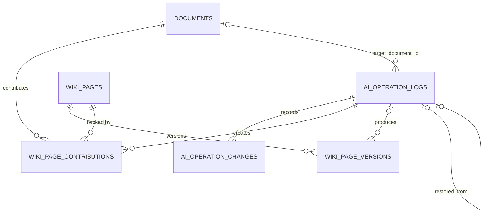

# AI 작업 로그 저장·조회·복구 설계

- 상태: Draft · 2026-07-30
- 범위: Backend API + llmPipeline 통신 계약
- 범위 밖: 프론트엔드 UI, 보존 정책·로그 삭제, 간선(link) 복구
- 상세 근거: [`ai-operation-log-detail.md`](./ai-operation-log-detail.md)

## 1. 만들 기능

| # | 기능 | 설명 |
|---|---|---|
| 1 | 로그 저장 | AI가 문서·Wiki를 바꿀 때마다 기록. `document_edit` · `ingest` · `lint` |
| 2 | 로그 목록·상세 | 워크스페이스별 조회. 작업 1건과 그것이 바꾼 리소스 목록 |
| 3 | 변경분 확인 | 두 버전의 diff. 조회 시 계산 |
| 4 | 복구 미리보기 | 특정 작업을 취소하면 무엇이 삭제·복원·재작성되는지 |
| 5 | 복구 실행 | 되돌리고, 못 되돌리는 건 llmPipeline에 재작성 위임 |

### 핵심 난점

개념(concept) 페이지는 **여러 원문 문서의 기여가 하나의 글로 합쳐진** 결과다. 한 문서만 되돌리려 해도 그 문서 부분만 오려낼 수 없다.

```text
C3 = A 기여 + B 기여 + C 기여 + D 기여   (한 편의 글로 엮여 있음)
```

그래서 복구는 **기여 명단에서 줄을 끄고 남은 것으로 다시 만드는** 방식이다.

### 처리 흐름 한눈에

```text
① 문서 AI 편집 — 동기. 저장과 로그가 한 트랜잭션

   사용자 "적용"
     documents                  본문 교체
     document_content_versions  이전·새 본문 2행
     ai_operation_logs          1행 (succeeded)
     ai_operation_changes       1행 (updated, 줄 수)

② 위키 ingest — 비동기. 요청 때 열고 콜백 때 확정

   요청       ai_operation_logs         1행 (processing) 후 커밋 → llmPipeline 호출
   llmPipeline  위키 변경 → 작업별 key에 본문·조각 저장 → 콜백
   콜백 처리   wiki_page_versions        바뀐 페이지마다 1행 (본문 전체)
              wiki_page_contributions   바뀐 페이지마다 1행 (active=true)
              wiki_pages                markdown_uri 를 새 key로 이동
              ai_operation_changes      바뀐 페이지마다 1행
              ai_operation_logs         succeeded 로 갱신

③ 조회 — 쓰기 없음

   목록       ai_operation_logs
   상세       + ai_operation_changes   (줄 수는 저장값이라 계산 없음)
   diff 펼침   wiki_page_versions 2행을 읽어 그 자리에서 계산

④ 복구

   미리보기   wiki_page_contributions 읽기만 → 삭제·복원·재조립 3분류
   실행       wiki_page_contributions   뺄 기여를 active=false
              wiki_page_versions        복원 페이지마다 1행
              wiki_pages                markdown_uri 를 옛 key로 되돌림 / status='deleted'
                                       ← 저장소 쓰기 없음. 옛 object 재사용
              ai_operation_logs         1행 (restore)
              ai_operation_changes      페이지마다 1행 (restored·deleted·delegated)
              → 재조립 대상은 llmPipeline에 지시서 전송
   재조립 결과 wiki_page_versions        재작성 페이지마다 1행
              ai_operation_changes      1행 (rebuilt 또는 rebuild_failed)
```

`wiki_page_contributions`만 값이 바뀌고(`active`), 나머지는 전부 쌓기만 한다.

## 2. 설계 결정

| 항목 | 결정 |
|---|---|
| 결과 수신 | Kafka 아님. **내부 콜백 API** (Backend에 Kafka 미도입) |
| Wiki 이력 소유 | **Backend**. revision 채번과 `markdown_uri` 갱신은 Backend만. 단 저장소 쓰기는 llmPipeline만 |
| 본문 저장 | **RDS text**. 이 규모에서 트랜잭션 정합성·백업 단순성이 용량보다 이득 |
| 본문 전달 | llmPipeline이 **작업별 불변 key**에 쓰고, 콜백은 key만. Backend가 검증 후 읽음 |
| 화면 버전 | **`revision`** 하나. 기여 수는 지표로 병기 |
| diff | 저장하지 않음. 줄 수만 저장 |
| 복구 판정 | **`wiki_page_contributions.active`** 기준 |

## 3. 추가되는 DB 테이블

신규 4개, 기존 컬럼 추가 2개.



| 테이블 | 답하는 질문 | 성격 |
|---|---|---|
| `ai_operation_logs` | 무슨 작업이 언제 있었나 | 불변 로그 |
| `ai_operation_changes` | 그 작업이 뭘 건드렸나 | 불변 로그 |
| `wiki_page_versions` | 그때 본문이 뭐였나 | append |
| `wiki_page_contributions` | **지금 누가 이 페이지를 받치고 있나** | 유일하게 갱신됨 |

### 3.1 `ai_operation_logs`

```text
operation_id            PK          작업 식별자. 멱등의 실제 보증
workspace_id            FK NOT NULL
user_id                 FK NOT NULL
operation_type                      document_edit · ingest · lint · restore
target_document_id      FK NULL     어느 원문 문서 작업인지. 없으면 복구 불가. lint는 NULL
status                              3.5 참조
summary                 NULL
changed_resource_count  DEFAULT 0
restored_from           FK self     되돌린 대상 작업
restore_manifest        jsonb NULL  llmPipeline에 보낸 조립 지시서 원본
payload_hash            NULL        콜백 재전송 판별
created_at / completed_at
```

ingest는 llmPipeline 호출 **전에** `processing`으로 먼저 커밋한다. 콜백 body의 `workspace_id`·`user_id`·`target_document_id`는 권한 근거로 쓰지 않고 이 행과 일치하는지만 검증한다.

### 3.2 `ai_operation_changes`

```text
id                      PK
operation_id            FK
resource_type                       document · wiki_page
resource_id                         다형 참조. FK 없음
before_revision         NULL        NULL이면 새로 만든 것
after_revision          NULL
change_type                         created · updated · deleted
                                    restored · delegated · rebuilt · rebuild_failed
change_summary          NULL
additions / deletions   NULL        diff 본문은 저장 안 함
```

### 3.3 `wiki_page_versions`

```text
page_id, revision       PK          revision = 화면 버전 = 복구 좌표. 단조 증가
contribution_count                  그 시점 살아 있던 기여 수. 버전이 아님
markdown                NOT NULL    전체 본문
markdown_key            NOT NULL    그 본문이 담긴 불변 object key
content_hash                        무변경 판정
operation_id            FK NULL
created_by / created_at
```

`revision`과 `contribution_count`를 나눈 이유는, 기여 수를 버전으로 쓰면 되돌릴 때 번호가 되돌아가 **같은 번호가 다른 내용을 가리키기** 때문이다.

```text
revision 4 · 기여 4  =  A, B, C, A2
revision 6 · 기여 4  =  A, B, C, D
```

### 3.4 `wiki_page_contributions` — 복구의 근거

```text
page_id, ingest_operation_id  PK
source_document_id      FK NULL
sequence_revision       NOT NULL    이 기여가 처음 적용된 revision. 순서 기준
object_key              NOT NULL    재조립용 조각 위치
active                  DEFAULT true
deactivated_by          FK NULL     어느 복구가 껐는지
created_at
```

`deactivated_by`가 있어야 **연속 복구**가 맞는다. 한 번 끈 기여가 다음 계산에서 되살아나지 않는다.

source page도 concept과 같은 모델이다. 재ingest는 교체가 아니라 기여를 하나 더 만든다. lint는 기여를 만들지 않는다.

### 3.5 열거값

```text
operation_type   document_edit · ingest · lint · restore
                 (restore_rebuild는 타입이 아니라 restore의 처리 단계)
status           processing · applying · notify_pending · rebuilding
                 succeeded · partially_succeeded · failed · conflict
```

### 3.6 기존 테이블 변경

```text
document_content_versions  + operation_id      이 버전을 만든 AI 작업
```

`wiki_pages`는 그대로 둔다. 채번 기준은 `max(revision)`으로 얻고(인덱스 첫 항목 1행), 재조립 실패는 `ai_operation_changes.rebuild_failed`에 이미 남으므로 별도 컬럼을 만들지 않는다.

### 3.7 인덱스

```sql
CREATE INDEX ON ai_operation_logs(workspace_id, operation_type, created_at DESC);
CREATE INDEX ON ai_operation_logs(target_document_id, created_at);
CREATE INDEX ON ai_operation_changes(operation_id);
CREATE INDEX ON ai_operation_changes(resource_id, id);
CREATE UNIQUE INDEX ON ai_operation_changes(operation_id, resource_type, resource_id, change_type);
CREATE INDEX ON wiki_page_versions(page_id, revision DESC);
CREATE INDEX ON wiki_page_contributions(page_id, active, sequence_revision);
```

마지막 인덱스가 복구 성능을 좌우한다.

## 4. llmPipeline ↔ Backend 통신

```text
①  Backend → llmPipeline   ingest 요청        기존 확장
②  llmPipeline → Backend   결과 콜백          신규
③  Backend → llmPipeline   조립 지시서        신규
④  llmPipeline → Backend   재조립 결과        ②와 같은 경로, rebuilding 분기
⑤  Backend ↔ llmPipeline   lint (동기)        기존 확장
```

### 4.1 ingest 요청 — `POST /pipeline/runs`

기존 요청에 **2개 필드만** 추가한다.

```json
{
  "operation_id": "op_a2_7f3c9",
  "result_callback_url": "http://backend/api/ai-operations/op_a2_7f3c9/result"
}
```

`PipelineRunIn`이 `extra="forbid"`(`schemas.py:14`)라 **스키마를 안 고치면 요청이 422로 튕긴다.**

llmPipeline이 작업 중에 남겨야 할 것:

```text
wiki/{ws}/pages/{page_id}/ops/{op_id}.md     본문. 작업마다 새 key. 덮어쓰지 않음
wiki/{ws}/pages/{page_id}/ops/{op_id}.json   기여 조각
```

**`wiki_pages.markdown_uri`는 건드리지 않는다.** Backend가 검증 후 옮긴다.

### 4.2 결과 콜백 — `POST /api/ai-operations/{operation_id}/result`

```json
{
  "operation_id": "op_a2_7f3c9",
  "operation_type": "ingest",
  "status": "succeeded",
  "workspace_id": "ws_fruition",
  "user_id": "user_hw",
  "target_document_id": "doc_A",
  "summary": "위키 페이지 3개를 갱신했습니다.",
  "changed_pages": [
    {
      "page_id": "C2",
      "markdown_key": "wiki/ws_fruition/pages/C2/ops/op_a2_7f3c9.md",
      "contribution_key": "wiki/ws_fruition/pages/C2/ops/op_a2_7f3c9.json",
      "content_hash": "sha256:3c4d..."
    }
  ]
}
```

| 필드 | 없으면 |
|---|---|
| `operation_id` | 멱등 불가 |
| `target_document_id` | **복구 자체가 불가능.** 뺄 작업을 못 고름 |
| `page_id` | 기여 이력 누락 → 버전 계산이 어긋남 |
| `markdown_key` | 그 작업의 본문을 특정 못 함 |
| `contribution_key` | 재조립 불가 |
| `content_hash` | 쓰기가 잘렸는지 확인 불가 |

**보내지 않는 것**: 버전 번호, 본문 전문, bucket, diff, 안 바뀐 페이지.

| 응답 | llmPipeline이 할 일 |
|---|---|
| 200 | 없음 |
| 200 + 기존 결과 (같은 `payload_hash`) | 없음 |
| 409 (같은 작업에 다른 payload) | 중단 |
| 422 (해시 불일치·prefix 위반) | 다시 쓰고 재전송 |

**부분 실패해도 이미 만든 페이지는 `changed_pages`에 담아 보낸다.** 안 보내면 Wiki에는 있는데 로그에 없는 페이지가 영영 남는다.

### 4.3 조립 지시서 — `POST /wiki/restore-runs` (신규)

```json
{
  "operation_id": "op_restore_9a2b",
  "excluded_operations": ["op_a2_7f3c9"],
  "rebuild_pages": [
    { "page_id": "C3", "contribution_count": 4,
      "keep_contributions": [
        { "operation_id": "op_a", "document_id": "doc_A" },
        { "operation_id": "op_b", "document_id": "doc_B" },
        { "operation_id": "op_c", "document_id": "doc_C" },
        { "operation_id": "op_d", "document_id": "doc_D" }
      ] }
  ],
  "restored_pages": [ { "page_id": "S_A", "revision": 3 } ],
  "deleted_pages": []
}
```

| 필드 | 성격 |
|---|---|
| `rebuild_pages` | **요청** — 조각을 순서대로 붙여 다시 써 달라 |
| `contribution_count` | Backend가 계산한 복구 후 활성 기여 수 |
| `keep_contributions` | **`sequence_revision` 순서**. 순서가 결과를 바꾼다 |
| `restored_pages` · `deleted_pages` | 통보 — 임베딩·링크 정리용 |

`keep_contributions`가 1개면 조립이 아니라 그 조각을 그대로 쓰면 되므로 LLM 호출이 필요 없다.

### 4.4 재조립 결과

4.2와 **같은 엔드포인트**를 쓰되 restore operation의 `rebuilding` 단계를 완료하는 분기다.

```json
{
  "operation_id": "op_restore_9a2b",
  "operation_type": "restore",
  "status": "partially_succeeded",
  "changed_pages": [ { "page_id": "C3", "markdown_key": "...", "content_hash": "..." } ],
  "failed_pages": [ { "page_id": "C6", "reason": "contribution_missing" } ]
}
```

`failed_pages`가 유일한 차이다. 실패 페이지는 `ai_operation_changes`에 `rebuild_failed`로 기록하고 다음 lint에 맡긴다.

멱등 기준은 `(operation_id, page_id, result_phase='rebuild')`다. `contribution_count`는 `restore_manifest`에서 꺼내 쓰고 다시 계산하지 않는다.

### 4.5 lint — `POST /wiki/maintenance/lint` (동기)

요청에 `operation_id`, 응답에 `changed_pages`를 더한다. lint는 기여를 만들지 않으므로 `contribution_key`가 없고 `contribution_count`도 올라가지 않는다. `dry_run=true`면 빈 배열이다.

### 4.6 공통 규칙

| 항목 | 규칙 |
|---|---|
| `operation_id` 발급 | **항상 Backend** |
| revision 채번 · `markdown_uri` 갱신 | **항상 Backend** |
| 본문 위치 | 콜백이 준 key를 검증 후 Backend가 읽음 |
| 본문 쓰기 | **llmPipeline만.** 작업별 새 key, 덮어쓰지 않음. Backend는 `wiki/`에 쓰지 않는다 |
| `wiki_pages.markdown_uri` · `status` | **Backend만.** llmPipeline의 `ON CONFLICT DO UPDATE`에서 두 컬럼을 빼야 한다 |
| 키 검증 | bucket은 환경 설정 고정. prefix가 `wiki/{ws}/pages/{page}/ops/{op}.(md\|json)`인지 정확 검증 |
| 콜백 인증 | 내부 토큰·서명 필수. 인증 전에는 객체를 읽지 않음 |
| 멱등 | 작업 등록은 `operation_id` PK, 콜백은 `payload_hash` + 변경내역 UNIQUE |

## 5. 복구 규칙

### 5.1 판정

```text
복구는 "이 작업 되돌리기" 하나다. 사용자가 범위를 고르지 않는다.

E = 취소할 operation 집합. 지목한 작업 X 하나로 정해진다

    { X } ∪ (target_document_id = X.target AND created_at > X.created_at AND type = ingest)
    → X 자신과 그 이후 같은 문서의 작업 전부

    lint는 target_document_id가 없어 뒤 범위를 만들 수 없다. { X } 하나만 취소한다

X 자신을 포함하는 이유는 로그 목록에서 "이 항목이 한 일을 없앤다"가 가장 흔한 조작이기
때문이다. lint도 같은 규칙이라 두 유형의 결과가 어긋나지 않는다.
X까지 살리고 싶으면 그다음 작업을 지목하면 된다.

페이지의 active 기여를 sequence_revision 순으로 놓고 E를 뺀다

    남은 기여 = 0            →  삭제
    E가 이력의 꼬리          →  Backend 복원 (직전 스냅샷이 곧 정답)
    E가 중간에 낌            →  llmPipeline 재조립 (그런 본문은 존재한 적 없음)
```

```text
C2 이력 : A → B → A2
  A2만 취소  →  A2가 꼬리       →  직전 스냅샷이 이미 "A+B"  →  꺼내 씀
  A 취소     →  B가 중간에 남음  →  "B만의 본문"은 없음       →  재조립
```

### 5.2 실행 순서

```text
① 미리보기 + preview_token (대상 page의 current_revision·활성 기여 hash 서명)
② 사용자 확인
③ preview_token 재검증 — 그사이 변경됐으면 409
④ [트랜잭션] 페이지 행 FOR UPDATE
     contributions SET active=false, deactivated_by=복구 operation
     복원 → wiki_page_versions insert
              revision      = max+1
              markdown      = 되돌릴 revision의 본문
              markdown_key  = 되돌릴 revision의 key       ← 재사용
            wiki_pages.markdown_uri 를 그 key로 이동
     삭제 → status='deleted' (소프트). 하드 삭제하면 이력이 CASCADE로 사라짐
     위임 → ai_operation_changes에 delegated 기록만
⑤ 조립 지시서 전송 → 대상 있으면 rebuilding, 없으면 succeeded
⑥ 재조립 결과 수신 (4.4)
```

**ingest 되돌리기는 Wiki만 되돌린다.** ingest는 원문 문서를 읽기만 하고 바꾸지 않으므로 되돌릴 문서 본문이 없다. 문서 본문을 되돌리는 것은 `document_edit` 작업의 몫이며 여기서 다루지 않는다.

**Backend는 저장소에 쓰지 않는다.** 되돌릴 revision의 object가 불변으로 이미 있으므로 같은 본문을 다시 쓰지 않고 `markdown_uri`를 그 key로 되돌린다. 덕분에 Wiki 반영이 트랜잭션 하나로 끝나고, 쓰기 실패를 다룰 필요가 없다.

④는 한 트랜잭션이다. 그 앞에서 복구 작업을 `applying`으로 먼저 커밋해 두므로, 반영 중 실패하면 `applying`으로 남아 같은 `restore_manifest`로 재시도할 수 있다.

⑤ 전송이 실패해도 예외를 올리지 않는다. 복구는 이미 DB에 반영됐고 재작성만 보류되므로 `notify_pending`으로 남겨 나중에 다시 보낸다.

### 5.3 lint 복구

lint는 `target_document_id`가 없고 기여도 만들지 않는다. **꼬리일 때만 되돌리기를 지원**하고, 뒤에 다른 작업이 있으면 되붙일 조각이 없으므로 lint 재실행으로 안내한다.

### 5.4 검증 시나리오

`A → B → C → A2 → D` ingest 후. 기대값은 복구 후 `contribution_count`.

```text
D 취소   C3 기여4 · C6 기여1
A2 취소  C2 기여2 · C3 기여4 · C5 기여1 · C6 기여1
C 취소   C3 기여4 · C4 기여1
B 취소   C2 기여2 · C3 기여4
A 취소   삭제 S_A·C1·C5 / C2 기여1 · C3 기여3 · C4 기여1 · C6 기여1

A2 취소 → D 취소              비활성 기여가 재포함되지 않음
A 취소 → A3 ingest → B 취소    과거 기여는 비활성 유지
미리보기 → 신규 ingest → 실행   preview_token 불일치로 409
같은 페이지 콜백 2개 동시 수신  revision 중복·포인터 역전 없음
```

**다중 버전 시나리오**도 고정한다. 문서 A를 5번 ingest하고 중간에 문서 B가 `C7`에 참여한 상태에서 `op_a2`를 지목한다.

```text
S_A  a1 a2 [a3 a4 a5]     뺄 것이 전부 뒤   →  되돌리기 (revision 2)
C1   a1 a2 [a3    a5]     뺄 것이 전부 뒤   →  되돌리기 (revision 2)
C2   a2                   a3~a5 무관        →  손 안 댐
C7   [a3] b               b 가 남음         →  재조립 (기여 1)
C8   [a4]                 남는 게 없음      →  삭제
```

`C7`이 핵심이다. **3번째 ingest가 만든 페이지라도 다른 문서가 붙었으면 지우지 않는다.** `C2`는 되돌릴 시점에 이미 있던 페이지라 건드리지 않는다.

**다른 문서가 중간에 끼면 판정이 뒤집힌다.** `A1 A2 A3 E A4 F` 순으로 ingest하고 `op_a2`를 지목한 경우다.

```text
C1   a1 a2 [a3] e [a4] f    뺄 것 사이에 e·f 가 낌   →  재조립 (기여 4)
C3   [a3] e                 e 가 남음                →  재조립 (기여 1)
C5   [a4]                   남는 게 없음             →  삭제
C2   a2                     무관                     →  손 안 댐
C4   e        C6  f         무관                     →  손 안 댐
```

`C1`이 앞 시나리오에서는 되돌리기였는데 여기서는 **재조립**이다. `a1+a2+e+f` 조합의 본문이 저장된 적이 없기 때문이다. **오래된 시점으로 갈수록, 사이에 낀 다른 문서가 많을수록 재조립 비중이 커진다.**

이 11개를 테스트로 고정한다.

## 6. Backend API

```http
GET  /api/workspaces/{ws}/ai-operation-logs?type=&status=&cursor=&size=
GET  /api/workspaces/{ws}/ai-operation-logs/{operation_id}
GET  /api/workspaces/{ws}/ai-operation-logs/{operation_id}/restore-preview
POST /api/workspaces/{ws}/ai-operation-logs/{operation_id}/restore
GET  /api/workspaces/{ws}/wiki/pages/{page_id}/diff?from=&to=

POST /api/ai-operations/{operation_id}/result        내부 콜백
```

| 화면 | 읽는 테이블 | diff 계산 |
|---|---|---|
| 목록 | `ai_operation_logs` | 없음 |
| 상세 | `ai_operation_changes` | 없음 (줄 수는 저장값) |
| diff 펼치기 | `wiki_page_versions` 2행 | 1회 |

복구 실행은 body에 `preview_token`이 필수다. 편집 잠금 위반 423, 버전 충돌 409.

**복구 범위를 고르는 파라미터는 없다.** 로그에서 한 시점을 지목하면 그 이후 같은 문서의 작업이 전부 취소되고, 그사이에 만들어진 source page·concept page는 받치는 기여가 사라져 삭제된다.

```http
GET  .../ai-operation-logs/{operation_id}/restore-preview
POST .../ai-operation-logs/{operation_id}/restore        { "preview_token": "..." }
```

```text
A1 → A2 → A3 → B → A4  상태에서

  A3 지목   A4 가 만든 페이지 삭제
  A2 지목   A3·A4 가 만든 페이지가 대상. 단 B가 보탠 페이지는 B 것만으로 재작성
```

## 7. 코드 수정 지점

### Backend

| 대상 | 수정 |
|---|---|
| `db/migration/V15__*.sql` | `ai_operation_logs` · `ai_operation_changes`, `document_content_versions.operation_id` |
| `db/migration/V16__*.sql` | `wiki_page_versions` · `wiki_page_contributions` (신규 2개만. `wiki_pages`는 변경 없음) |
| **신규** `fruition/aihistory/**` | 도메인·리포지토리·서비스·컨트롤러, 내부 콜백 수신. 클래스는 `Operation*`·`Restore*` (패키지가 문맥을 주므로 `Ai` 접두어 생략) |
| `agent/service/AgentTurnService` | `apply_operation_id` 발급해 응답에 포함 |
| `document/service/DocumentService` | `saveContent`에서 검증된 `apply_operation_id`만 로그 기록. conflict는 `REQUIRES_NEW` |
| `document/service/MarkdownDiffService` | 응답 타입을 리소스 중립 record로 분리 (기존 문서 diff 스키마는 유지) |
| `document/repository/DocumentProcessingRequester` | `operation_id`·`result_callback_url` 전달 |
| `wikimaintenance/**` | lint 요청에 `operation_id`, 응답 `changed_pages` 수용 |
| `wiki/service/WikiService` | `normalizeObjectName`에 prefix 정확 검증 추가 |
| `security/SecurityConfig` | `/api/ai-operations/**` 내부 토큰 검증 |

`saveContent`의 기존 `source` 파라미터는 현재 받기만 하고 쓰이지 않는다(`DocumentService.java:945-1007`). **문자열만으로 AI 작업 여부를 신뢰하지 않고** `apply_operation_id` 검증으로 대체한다.

### llmPipeline

| 대상 | 수정 |
|---|---|
| `wiki_ingestion/interfaces/http/schemas.py` | `_PipelineRunBase`에 `operation_id`·`result_callback_url`. `WikiLintIn/Out` 확장 |
| `wiki_ingestion/interfaces/http/routes.py` | `POST /wiki/restore-runs` 신설 |
| `postgres_wiki_output_persistence.py:97,162,337` | 작업별 key에 write. `markdown_uri` 갱신 제거 |
| `postgres_wiki_ingestion_repository.py:621,691` | 동일 |
| **신규** | 기여 조각 저장, 조각 기반 재조립 |
| 결과 통지 | `pipeline_log.py:60 _post_event`의 `urllib` 패턴 재사용 |

## 8. 작업 순서

```text
llmPipeline 선행 (F4의 조건)
  L1  요청 스키마 필드 2개            ← 없으면 Backend 호출 자체가 422
  L2  작업별 key 쓰기 + 기여 조각 저장  ← 없으면 그 시점 데이터는 영영 복구 불가
  L3  결과 콜백 (인증 포함)
  L4  /wiki/restore-runs
  L5  lint 확장
  L6  1차 구현에서 workspace별 ingest 직렬 실행 보장

Backend
  F1  로그 스키마 (V15)          ─┬─ F3 로그 저장(document_edit) ─┐
  F2  Wiki 스키마 (V16)          ─┴─ F4 콜백 수신 ───────────────┴─ F5 조회 API
                                                                  └─ F6 복구 계산·미리보기
                                                                     └─ F7 복구 실행
                                                                        └─ F8 재조립 수신
  F9  스펙 문서 · 역할별 이슈
```

F1·F2는 병렬 가능하다. **L2가 가장 급하다.** ingest 시점에 조각을 안 남기면 그때 쌓인 데이터는 나중에 어떤 방법으로도 되돌릴 수 없다.

### 완료 조건

| | verify |
|---|---|
| F1 | 같은 `operation_id` 2회 insert 시 제약 위반. 같은 payload 재전송 200, 다른 payload 409 |
| F2 | `revision` 단조 증가, `contribution_count` 감소 가능. 비활성 기여가 후속 계산에서 제외됨 |
| F3 | AI 편집 1회 = 로그 1건. 수동 저장·무변경은 로그 없음. `source=agent`만 위조한 요청은 로그 생성 실패 |
| F4 | 요청 실패는 `failed`. hash 불일치·prefix 위반 422. 동시 콜백에도 revision 중복·포인터 역전 없음 |
| F5 | 기존 `/documents/{id}/diff` 스키마 무변경. 목록·상세는 diff 계산 0회 |
| F6 | 5.4 시나리오 일치. 미리보기 후 revision 변경 시 실행 409. 복구 범위 파라미터가 없고 기준 작업 하나로 결정됨 |
| F7 | revision append, 소프트 삭제. 복원 revision의 `markdown_key`가 되돌릴 대상의 것과 동일. Backend가 저장소에 쓰지 않음 |
| F8 | `contribution_count`가 지시서 값과 일치. 페이지별 재전송 멱등, 다른 payload 409 |

## 9. 미확정

- **간선 support 모델** — `wiki_page_links`에 기여 support 개념이 없다. 간선 복구는 별도 범위
- **문서가 `ORIGINAL`인 경우** — Wiki만 복구할지, 복구를 거부할지
- **재조립 실패 화면 노출** — `needs_lint` 표시까지는 정했고 UI 표현이 남음
- **오래된 로그·기여 정리** — 보존 정책 범위. 이번엔 만들지 않음

넷 다 F1~F8 착수를 막지 않는다.
