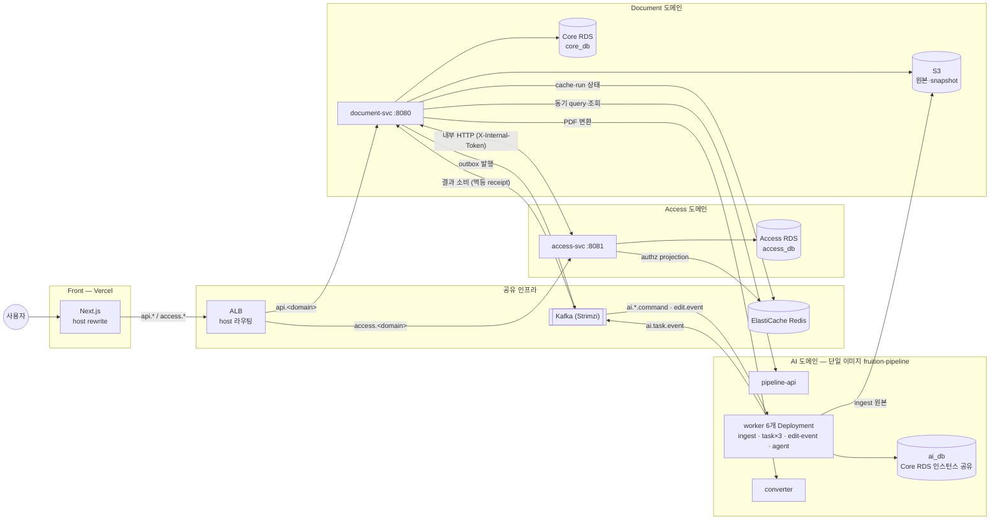
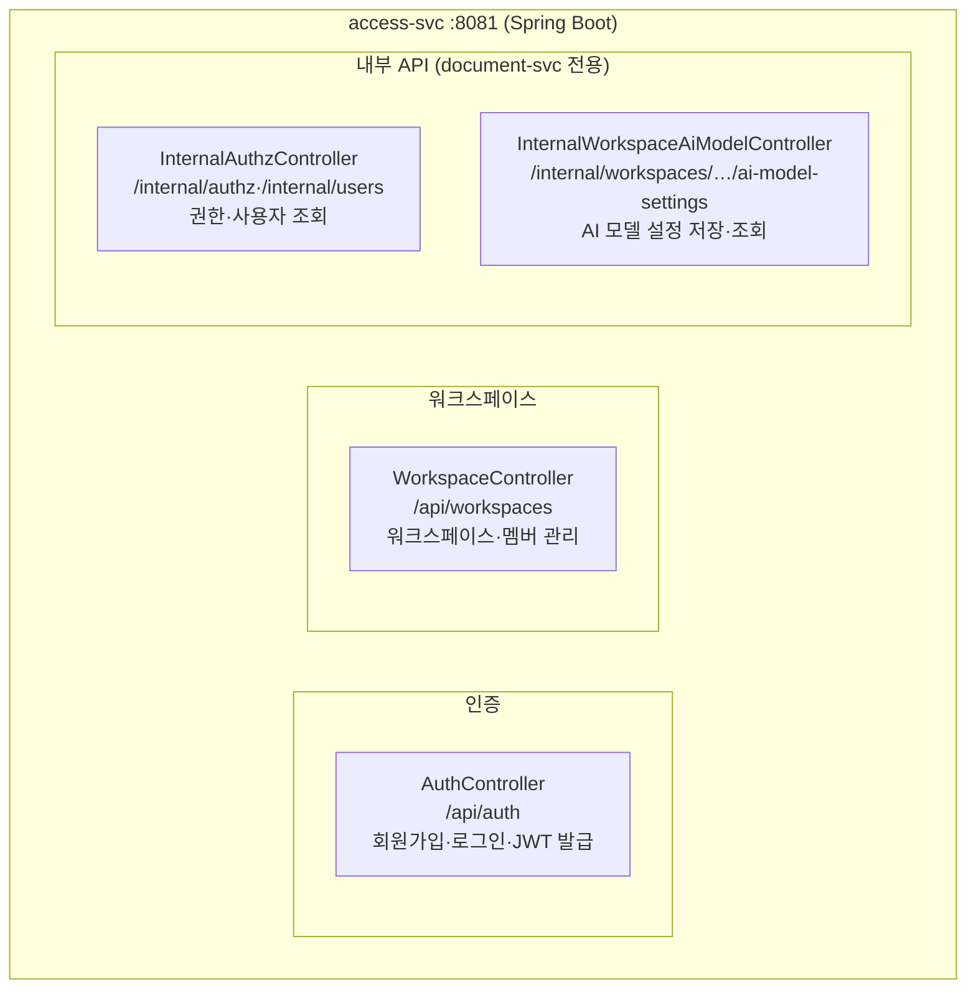
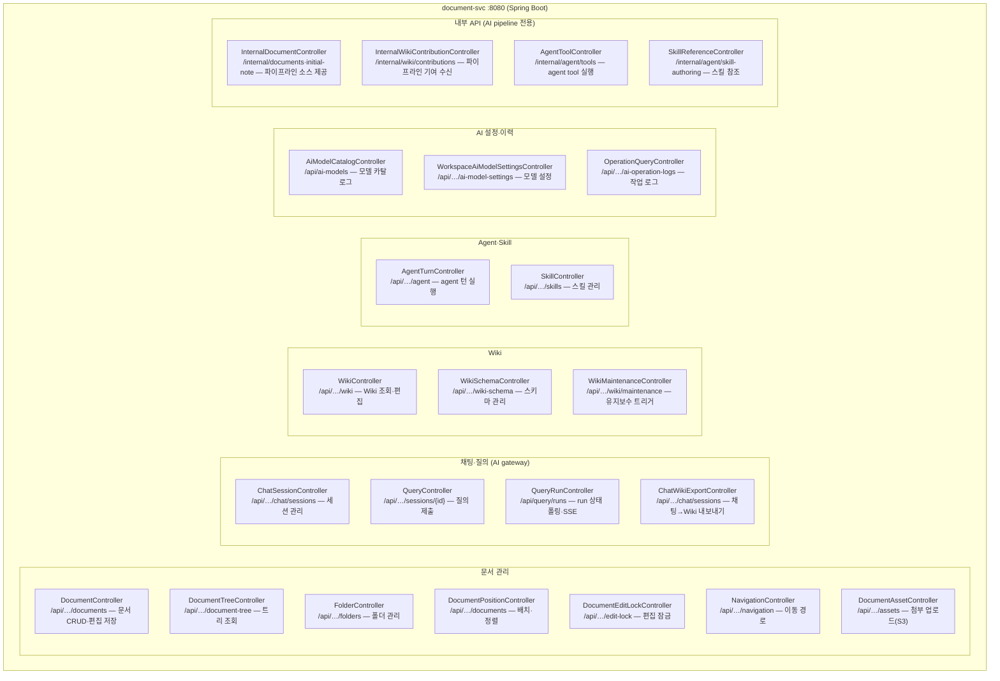
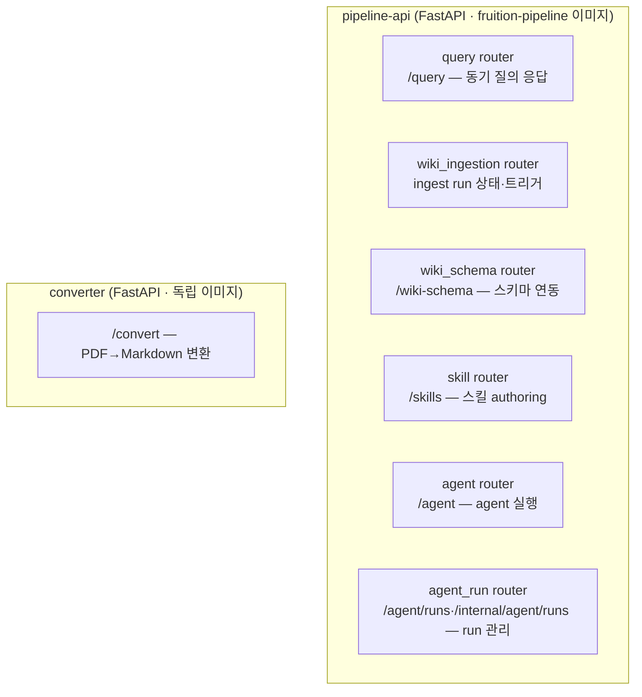
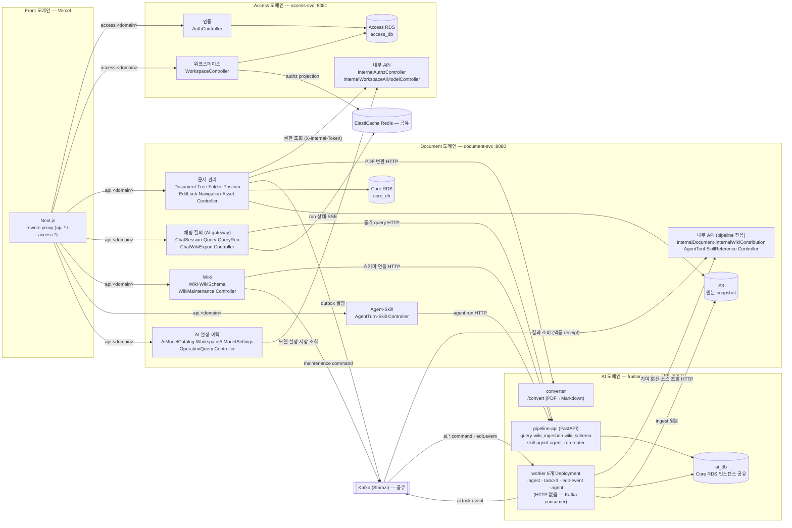
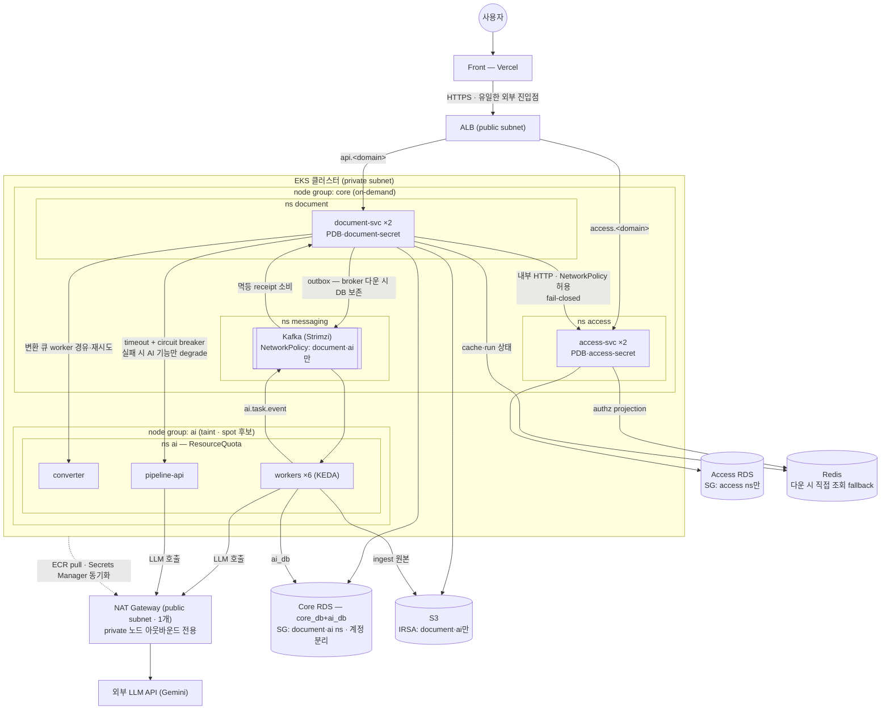

# AWS 배포 아키텍처 작도 문서

기준일 2026-08-14. 이 문서는 `aws-deployment.drawio` 작도 기준이다. 서비스 간 계약 상세는 [architecture.md](../architecture.md)를 따르고, 여기서는 "무엇을 어디에 배치하고 어떤 흐름으로 배포·실행하는가"만 다룬다.

## 1. 작도 그룹 (도메인별로 묶는다)

배포 도메인은 4개: **Front / Access / Document / AI**. 각 도메인이 자기 서비스와 자기 데이터를 소유한다. 어느 한 도메인에 넣을 수 없는 것(ALB, Kafka, Redis, 배포 경로)만 공유 인프라로 뺀다.

| 도메인 | 구성 요소 | 배치 위치 |
|---|---|---|
| Front | Next.js | Vercel (AWS 외부) |
| Access | access-svc(:8081) + Access RDS(access_db) | EKS `fruition` namespace + RDS |
| Document | document-svc(:8080) + Core RDS(core_db) + S3(원본·snapshot) | EKS + 관리형 |
| AI | pipeline-api, ingest-worker, task workers ×3(query·agent·maintenance), edit-event-consumer, pipeline-agent-worker — 전부 단일 이미지 `fruition-pipeline` + converter + ai_db | EKS + Core RDS 인스턴스 공유 |
| 공유 인프라 | ALB(host 라우팅), Kafka(Strimzi), ElastiCache Redis | VPC public / EKS 내부 / 관리형 |
| Deploy/Secret | GitHub Actions(OIDC), ECR, Secrets Manager + External Secrets Operator | 배포·시크릿 경로 |

경계 판단 근거:
- **converter → AI**: 호출자는 document-svc뿐이지만 "배포 단위 = 이미지 = 폴더" 원칙상 `services/ai` 소속, fruition-ai 레포에서 빌드(§8).
- **ai_db → AI**: 소유는 AI 도메인. Core RDS 인스턴스를 공유할 뿐 물리 DB·계정 분리(§4).
- **Kafka·Redis → 공유**: Kafka는 Document↔AI 양쪽이 발행·소비, Redis는 Access·Document 공용이라 한 도메인에 못 넣는다.

### 1.1 도메인 그룹 예시 (mermaid)



## 2. 요청 배치 흐름 (runtime)

```text
사용자 → Vercel(Next.js)
  └ next.config rewrite로 host 분기
     ├ api.<domain>    → ALB → document-svc
     └ access.<domain> → ALB → access-svc

document-svc ↔ access-svc : 내부 HTTP (X-Internal-Token, 권한·워크스페이스)
document-svc → pipeline-api : 동기 HTTP (query·Wiki 조회·run 폴링)
document-svc → converter   : HTTP (변환 큐 worker 경유)
```

- ALB는 host 기반 라우팅만 한다. path 분기는 Vercel rewrite가 이미 수행.
- 인가: document-svc는 Redis authz projection(TTL 300s) → miss 시 access-svc 조회, fail-closed.

## 3. 서비스 내부 모듈 실행 방식

핵심: **배포 단위 = 이미지 = 폴더**. 하나의 이미지가 실행 command만 바꿔 여러 역할을 맡는다.

- **Backend**: access-svc·document-svc 각각 독립 이미지·독립 Deployment. document-svc가 core_db Flyway를 먼저 적용한 뒤 나머지 기동.
- **AI Pipeline**: `fruition-pipeline` 단일 Dockerfile(`services/ai/pipeline`) → command 분기로 7개 Deployment 실행. 이미지 이름·ECR repo는 관례상 2개(`pipeline-api`, `ingest-worker`)지만 빌드 소스는 동일하다.
  - `pipeline-api`: FastAPI 서버 (동기 경로)
  - `ingest-worker`: `ai.ingest.command` 소비, KEDA lag 기준 1~4 replica
  - `query/agent/maintenance task worker` ×3: topic·consumer group만 env로 바꾼 동일 worker 모듈, 각각 KEDA 스케일
  - `edit-event-consumer`: `document.edit.event` 소비, ai_db 파생물 stale 추적
  - `pipeline-agent-worker`: LangGraph agent 실행

  task worker를 코드 하나로 3개 Deployment로 나누는 이유 — "프로세스 종류는 1개, 배포 단위는 topic별" 패턴:
  1. **workload 격리**: topic별 consumer group이 독립이라 ingest·agent 폭주가 query 처리를 막지 않는다.
  2. **스케일 정책 분리**: KEDA는 Deployment 단위로 스케일한다. query·agent 1~4 replica(lag 5), maintenance 1~2(lag 2)처럼 workload별 한도를 따로 준다.
  3. **장애 격리**: 한 worker가 죽어도 다른 topic 소비는 계속된다.
  4. 이미지는 1개라 빌드·배포 파이프라인은 그대로 유지된다.
- **Converter**: 독립 이미지, document-svc 변환 큐 뒤에서만 호출되는 내부 전용.

### 3.1 도메인 내부 아키텍처 (기능 → 컨트롤러)

각 도메인이 제공하는 기능과, 그 기능을 수행하는 컨트롤러가 어느 서비스에 포함되는지의 매핑. 경로는 클래스 `@RequestMapping`(Spring) / router prefix(FastAPI) 기준.

**Front 도메인 — Next.js**: 에디터·채팅·Wiki UI 렌더링, 로그인 흐름, api.*/access.* host 분기 rewrite proxy. 자체 비즈니스 로직·컨트롤러 없음.

#### Access 도메인 — access-svc

**서비스가 할 수 있는 것**: 회원가입·로그인·JWT 발급, 워크스페이스 생성·초대·멤버 역할 관리, 워크스페이스별 AI 모델 설정 저장, (내부) document-svc의 권한·사용자 조회 응답.



#### Document 도메인 — document-svc

**서비스가 할 수 있는 것**: 문서 작성·편집·저장(잠금·revision 포함), 폴더·트리·네비게이션, 첨부 자산 업로드(S3), 채팅 세션 기반 AI 질의와 run 상태 스트리밍(SSE), 채팅→Wiki 내보내기, Wiki 조회·편집·스키마 관리·유지보수 트리거, agent 턴 실행·스킬 관리, AI 모델 카탈로그·워크스페이스 설정·작업 로그 조회, (내부) AI pipeline에 문서 소스 제공·Wiki 기여 수신. 모든 AI 비동기 작업의 진입점(gateway) — outbox로 Kafka 발행.



#### AI 도메인 — pipeline-api · converter

**서비스가 할 수 있는 것**:
- **pipeline-api**: RAG 기반 동기 질의 응답, ingest run 상태 조회·트리거, Wiki 스키마 연동, 스킬 authoring, agent 실행·run 관리.
- **workers**: 문서 ingest(청킹·임베딩·Wiki 초안 생성), 비동기 query·agent·maintenance 작업 처리, 문서 편집 이벤트 소비로 파생물 stale 추적, LangGraph agent 실행. 결과는 `ai.task.event`로 회신.
- **converter**: PDF→Markdown 변환 (document-svc 내부 전용).

worker 6개 Deployment는 HTTP 인터페이스가 없다(§3 — Kafka consumer). HTTP 기능은 pipeline-api router와 converter가 담당.



- 호출자는 전부 document-svc(§2). Front는 컨트롤러 없이 Next.js가 rewrite proxy만 수행.

### 3.2 전체 이너 아키텍처 (4개 도메인 통합)

도메인 간 연결은 기능 그룹 단위 화살표로 표기. 컨트롤러별 경로는 §3.1 참조.



- Access RDS ← access-svc (access_db)
- Core RDS ← document-svc (core_db) / AI pipeline (ai_db — 같은 인스턴스, 물리 DB·계정 분리, `ai_runtime`은 core_db 접근 불가)
- ElastiCache ← access-svc(authz projection write-through), document-svc(authz cache·run 상태·SSE)
- S3 ← document-svc(원본·snapshot), AI pipeline(ingest 원본 읽기)

## 5. 배포 파이프라인

```text
GitHub Actions ──(OIDC AssumeRole)──▶ ECR push (서비스별 repo)
              └─(kustomize edit set image: 커밋 SHA)─▶ kubectl apply -k k8s/overlays/aws → EKS
Secrets Manager(fruition/app) ──(External Secrets Operator, IRSA, 1h)──▶ k8s Secret fruition-secret
Terraform(infra/terraform) : EKS·RDS·ElastiCache·S3·ECR·OIDC·Secrets 프로비저닝
```

- EKS 노드: on-demand t3.large ×2(기본), spot m5.xlarge 0~2(확장 대기).
- 로컬 kind 매니페스트(base)를 overlays/aws가 그대로 참조 — 코드 변경 0, env·endpoint만 치환.
- 서비스 업데이트는 Deployment 단위 rolling update: 새 pod가 readiness probe 통과한 뒤 구 pod 종료(무중단), probe 실패 시 교체 중단·구 버전 유지, 롤백은 이전 SHA 재적용. 업데이트 대상이 아닌 서비스는 재시작조차 되지 않는다.
- Flyway 마이그레이션은 rolling 중 구·신 pod 공존을 견디는 하위호환 형태로 작성한다 — 컬럼 추가 OK, 삭제·rename은 2단계 배포.

## 6. AI 서비스: Kafka + K8s 구조 판단

**결론: 현 구조 유지가 맞다.** 근거:

1. **작업 특성 일치** — LLM·임베딩 작업은 수십 초~수 분. 요청-응답 분리가 필수라 큐가 필요하고, HTTP 동기 경로는 이미 짧은 조회 전용으로 분리돼 있다.
2. **순서 보장** — `key=document_id` partition 순서로 같은 문서의 ingest 순서를 보존하면서 서로 다른 문서는 병렬 처리. SQS 표준 큐는 순서가 없고 FIFO는 처리량·그룹 제약이 생긴다.
3. **K8s와의 결합이 이미 설계 핵심** — workload별 topic·consumer group·Deployment가 1:1이고 KEDA가 consumer lag으로 스케일한다. 큐를 바꾸면 스케일 트리거부터 다시 설계해야 한다.
4. **신뢰성 패턴이 Kafka 전제로 구현 완료** — outbox 발행, at-least-once + 멱등 receipt, ingest run 폴링 복구. 전환 비용이 이득을 넘는다.
5. **로컬-AWS 대칭** — Strimzi를 kind와 EKS에서 동일하게 쓴다. 규모가 커지면 bootstrap 주소만 MSK로 치환하는 명확한 탈출구가 있다.

주의점 (그림에는 넣지 않고 여기만 기록):
- Strimzi 자가 운영 부담 — broker 장애 시 AI 비동기 경로 전체 정지 (ingest는 run 폴링으로 복구 가능).
- pipeline-runs PVC(EBS RWO) 때문에 ingest-worker가 pipeline-api 노드에 고정 — S3 아티팩트 이전 전까지 spot 노드 활용 불가.

## 7. 작도 규칙

- §1 도메인(Front/Access/Document/AI) 단위 박스로 묶고 pod 내부 구현·API 목록은 그리지 않는다. 공유 인프라(ALB·Kafka·Redis)는 도메인 박스 밖에 둔다.
- Kafka topic은 화살표 라벨로만 표기.
- 배포·시크릿 경로는 점선, runtime 경로는 실선.
- AWS 관리형 서비스는 drawio 내장 AWS 2019 아이콘(`mxgraph.aws4.*`)으로 그린다. EKS 내부 워크로드는 k8s pod이므로 일반 박스 유지.
- drawio 페이지 구성: 1페이지 = 전체 아키텍처, 2~5페이지 = 레포별 세부 아키텍처(frontend / backend / ai / infra, §8 참조).

## 8. 레포 분리 계획 (서비스별 GitHub CI/CD)

현재는 모노레포(워크플로 3개: tests·deploy·web-services). 서비스별 CI/CD 독립을 위해 4-레포로 분리한다.

| 레포 | 내용 | CI/CD 책임 |
|---|---|---|
| `fruition-frontend` | Next.js (`services/frontend`) | Vercel Git 연동 자동 배포 (PR=Preview, main=Production). CI는 lint·build 검증만 |
| `fruition-backend` | document-svc + access-svc + java-shared (Gradle 멀티모듈) | gradle test → 이미지 2개 ECR push → infra 레포 dispatch |
| `fruition-ai` | pipeline + converter (`services/ai`) | pytest → 이미지 3개(pipeline-api·ingest-worker·converter) ECR push → infra 레포 dispatch |
| `fruition-infra` | terraform + k8s(base·overlays) + deploy 워크플로 | 배포 전담. EKS 배포 권한(OIDC role)은 이 레포만 보유 |

분리 기준 근거:

1. **레포 경계 = 이미지 빌드 경계** — §3의 "배포 단위 = 이미지 = 폴더" 원칙을 레포 수준으로 올린 것. 한 레포의 push가 그 레포의 이미지만 빌드한다.
2. **backend는 더 쪼갤 수 없다** — document-svc·access-svc가 `java-shared` 모듈을 compile 의존으로 공유한다. 레포를 나누려면 java-shared를 별도 패키지(GitHub Packages 등)로 발행·버전 관리해야 하는데 현 규모에서 비용이 이득을 넘는다.
3. **ai는 한 레포가 자연스럽다** — 단일 Dockerfile이 7개 Deployment를 실행하므로(§3) 빌드 파이프라인이 하나다. converter도 같은 FastAPI 스택이고 document-svc 뒤 내부 전용이라 함께 둔다.
4. **infra 분리는 권한 최소화 목적** — 서비스 레포의 OIDC role은 ECR push만 허용, EKS 배포 권한은 infra 레포 role 하나로 한정한다. 배포 이력·감사가 한 곳에 모이고, k8s 매니페스트·terraform은 서비스 코드와 수명주기가 다르다. 현재 서비스 코드와 같이 있는 `k8s/`·`infra/terraform/`을 이 레포로 이관한다.
5. **frontend는 Vercel 연동이 레포 단위** — Vercel Git integration이 레포당 프로젝트 하나를 전제하므로 독립 레포가 마찰이 가장 적다.

배포 흐름:

```text
서비스 레포 CI: test → docker build → ECR push (커밋 SHA 태그)
             └─ repository_dispatch(image=SHA) ─▶ fruition-infra deploy.yml
fruition-infra: OIDC AssumeRole → kustomize edit set image → kubectl apply -k overlays/aws
```

- 서비스 레포와 infra 레포의 OIDC role을 분리해 서비스 레포가 클러스터에 직접 접근할 수 없게 한다.
- 규모가 커지면 repository_dispatch를 ArgoCD(image updater)로 치환하는 명확한 탈출구가 있다 — infra 레포가 이미 GitOps 소스 역할이므로 구조 변경 없음.

## 9. 도메인 기반 배포 재구성 — 보안·장애 격리

### 9.1 판단: Spring(backend)도 EKS로 띄우는 게 맞는가

**결론: 맞다. EKS 단일 클러스터 유지.** 근거:

1. **이미 컨테이너화 완료** — kind base 매니페스트가 있고 overlays/aws가 그대로 재사용한다(§5). ECS·EC2로 빼면 매니페스트 이원화.
2. **Kafka 밀결합** — document-svc가 outbox 발행·ai.task.event 소비로 클러스터 내부 Kafka(Strimzi)와 직접 통신한다. 클러스터 밖으로 빼면 Kafka를 외부 노출해야 한다.
3. **내부 HTTP가 ClusterIP로 끝난다** — document↔access, document→pipeline-api·converter 전부 클러스터 내부. 밖으로 빼면 이 경로들을 내부 LB·mTLS로 다시 보호해야 한다.
4. **운영 단일화** — 배포(kustomize)·시크릿(ESO)·스케일(KEDA)·관측이 한 클러스터에 모인다.

대안 기각: ECS Fargate — KEDA·Strimzi 못 쓰고 스케일 트리거 재설계 필요. EC2 직접 — 운영 부담만 증가.

### 9.2 도메인별 배포 단위 (namespace·node group 분리)

현행 단일 `fruition` namespace를 도메인 경계에 맞춰 분리한다. 분리 자체가 보안(NetworkPolicy 적용 단위)과 장애 격리(ResourceQuota 단위)의 전제다.

| 단위 | 내용 | 격리 목적 |
|---|---|---|
| ns `access` | access-svc (replicas 1 시작 → SLA 단계 2 + PDB) | NetworkPolicy로 수신 경로 제한 |
| ns `document` | document-svc (replicas 1 시작 → SLA 단계 2 + PDB) | 〃 |
| ns `ai` | pipeline 7 Deployment + converter + ResourceQuota | AI 폭주가 다른 ns 자원 못 뺏음 |
| ns `messaging` | Kafka(Strimzi) | 접근 ns 화이트리스트 |
| ns `platform` | ESO·KEDA·ALB controller | 시스템 컴포넌트 분리 |
| node group `core` (on-demand) | access·document·messaging | backend 안정성 우선 |
| node group `ai` (taint, spot 후보) | ai ns 전용 | LLM burst의 노드 자원 격리. PVC 제약(§6)은 이 그룹 안에서 해결 |

- Secret도 도메인별 분리: `fruition-secret` 단일 → `access-secret`/`document-secret`/`ai-secret` (Secrets Manager 경로 분리). 한 도메인 유출이 전체 크리덴셜 유출로 번지지 않는다.
- IRSA 최소 권한: S3는 document·ai ServiceAccount만, Secrets Manager 읽기는 ESO만.
- **replica 판단**: rolling update(maxSurge=1, maxUnavailable=0)면 replicas 1로도 무중단 배포·자동 복구는 확보된다. replicas 2가 추가로 주는 건 pod·노드 장애 "동안"의 무중단뿐. SLA 단계에서 document·access만 2로 올리고, 그때 outbox 폴링 `FOR UPDATE SKIP LOCKED`(중복 발행 방지) + pod anti-affinity를 함께 적용한다. 현재 outbox publisher는 분산 락 없이 `findTop100` 폴링이라 replica 2면 상시 중복 발행된다.
- **네트워크 출입구**: 인바운드는 ALB 1개, 아웃바운드는 **AWS 관리형 NAT Gateway 1개**(`single_nat_gateway`, terraform vpc.tf) — LLM API 호출·ECR pull·Secrets Manager 동기화 전부 경유. S3만 gateway VPC endpoint(무료)로 NAT 우회 여지. NAT 단일 AZ 리스크는 현 규모 수용, HA 필요 시 AZ당 1개.
- **클러스터는 1개**: MSA 경계는 클러스터가 아니라 이미지·Deployment·namespace다. 격리는 ns·node group으로 충분하고, 클러스터 분리는 prod/stage 환경 분리 시점의 일.

### 9.3 보안 문제점과 대응

| 문제 | 위험 | 대응 |
|---|---|---|
| JWT HS256 공유 시크릿 — access·document 둘 다 보유 | 한쪽 유출 시 토큰 위조 가능 | 단기: 도메인별 Secret 분리·회전. 장기: RS256 전환(access가 서명, document는 공개키 검증만) |
| X-Internal-Token 정적 토큰 | 토큰 유출 시 내부 API 전체 호출 가능 | NetworkPolicy로 발신 pod 제한(document ns→access ns만) + 주기 회전 |
| Kafka 무인증 (클러스터 내부 평문) | 침투 시 임의 발행·소비 | NetworkPolicy로 document·ai ns만 messaging ns 접근 허용. 성장 시 SCRAM-SHA 인증 |
| 외부 노출 면적 | pipeline·converter·Kafka가 뚫리면 내부 전체 | ALB가 유일한 진입점 — document·access Service만 연결. 나머지 전부 ClusterIP |
| RDS 접근 경로 | 아무 pod나 DB 접근 | SG 분리: Access RDS←access ns, Core RDS←document·ai ns. ai_db는 기존 계정 분리 유지(§4) |

### 9.4 장애 전파 방지

이미 설계에 있는 장치(유지):

- **outbox 발행** — Kafka broker 다운 시 이벤트가 core_db에 보존, 복구 후 발행 재개. 문서 편집 기능 영향 0.
- **authz fail-closed** — Redis 다운 시 access-svc 직접 조회, 그것도 실패하면 거부(허용 아님).
- **멱등 receipt + run 폴링** — 중복·유실 이벤트가 상태를 오염시키지 않는다.

추가할 장치:

- **document→pipeline-api 동기 호출에 timeout + circuit breaker**(Resilience4j) — AI 도메인 전체가 죽어도 문서·워크스페이스 기능은 정상, AI 기능만 degrade. 현재 유일하게 차단기 없는 동기 의존.
- **ns별 ResourceQuota + pod limits** — AI worker 폭주가 노드 자원을 고갈시켜도 core node group의 backend는 무관.
- **PDB(minAvailable 1)** — access·document는 노드 교체·spot 회수 중에도 최소 1 pod 유지.
- **readiness probe 기반 ALB 헬스체크** — 기동 중 pod로 트래픽 안 감.

### 9.5 DB 가용성 판단과 해결 로드맵

현행(terraform rds.tf): RDS 2대 모두 `multi_az = false`, db.t4g.small, 백업 7일·삭제 보호 on. **단일 AZ RDS가 전체 구조에서 유일하게 자동 복구되지 않는 SPOF** — app replica를 늘려도 DB가 죽으면 무의미하므로 가용성 투자는 DB가 앱보다 앞선다.

| 문제 | 해결 | 적용 시점 |
|---|---|---|
| 단일 AZ SPOF | Multi-AZ 전환(`multi_az = true` 1줄) — 동기 standby, 자동 failover 60~120초, 앱 변경 0. 비용 2배 | SLA 발생 시. 그 전엔 백업 7일로 유실만 방어 |
| failover 공백 1~2분 | HikariCP 재연결 + outbox·멱등 receipt가 재시도 흡수 | 이미 확보 |
| Core RDS 자원 공유 (document·ai가 t4g.small 2 vCPU 공유) | 단기: CloudWatch 관측 + KEDA worker 한도가 완충. 중기: ai_db 인스턴스 분리 — 물리 DB·계정이 이미 분리돼 있어 `AI_DATABASE_URL` 엔드포인트 치환만, 코드 0 | ingest 중 core_db 지연 관측 시 |
| 커넥션 증가 | pool×pod ≤ max_connections(~200) 계산 → 부족 시 RDS Proxy(풀링 위임 + failover 수 초로 단축) | replica 확대 후 |
| 성능 한계 | 수직 확장(t4g.small→medium; t4g는 burstable — 지속 부하 시 크레딧 고갈 주의) → 읽기 분산은 그 다음 | 관측 후 |

대안 검토 (이 로드맵이 최선인 이유):

- **Aurora PostgreSQL**: failover ~30초, 스토리지 자동 확장, reader 추가 용이. 그러나 최소 비용이 t4g.small Multi-AZ보다 높고 지금 병목은 확장성이 아니라 가용성이다. read replica가 필요해지는 규모의 대안으로 보류 — RDS→Aurora는 스냅샷 마이그레이션으로 전환 경로가 명확해 지금 결정을 안 해도 갇히지 않는다.
- **인스턴스 통합(1대에 access_db+core_db+ai_db)**: 비용 절감되지만 장애 반경이 전 도메인 확대 — 도메인 격리 원칙 위반, 기각.
- 결론: "지금 single-AZ+백업 → SLA에 Multi-AZ → 관측 후 ai_db 분리·확장" 단계 투자. 각 단계가 코드 변경 없는 설정 전환이라는 것이 현 구조의 장점.

### 9.6 예시 그림 (mermaid)


