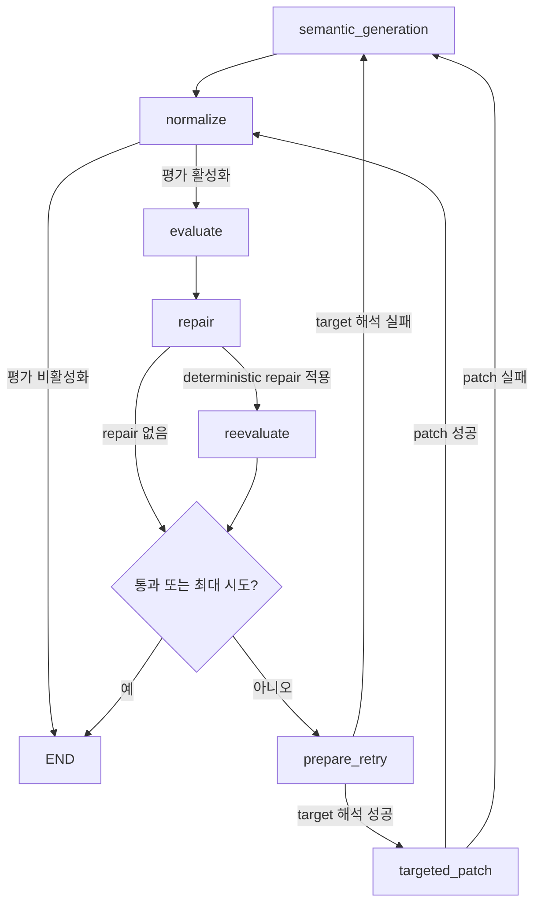

# Wiki ingest·Query evaluator LangGraph 전환

## 목적

Wiki ingest와 Query evaluator의 평가 결과가 실제 생성 결과에 반영되는 과정을 LangGraph와 LangSmith에서 추적할 수 있게 한다. 평가 문제는 수정·재평가하고, 선택적 제안은 통과를 막지 않으며, LangSmith API key가 없는 환경에서도 제품 실행은 유지한다.

## 변경 범위

### Wiki ingest

- 기존 Python 반복문을 LangGraph로 전환했다.
- evaluator loop는 API와 CLI에서 기본 활성화한다.
- 명확한 observation 오류는 raw semantic note와 normalized 결과에 deterministic repair를 함께 적용한 후 재평가한다.
- concept, evidence, source block 문제는 전체 chunk를 바로 다시 만들지 않고 targeted patch를 먼저 실행한다.
- 시도별 평가와 실제 반영 방식을 pipeline manifest에 기록한다.

### Query

- evaluator가 내부 근거로 답변할 수 있지만 수정이 필요하다고 판단하면 `revise_answer`로 분기한다.
- `internal_supported` 응답에 actionable feedback이 포함되면 방어적으로 `revise_answer`로 정규화한다.
- 최대 수정 횟수 후에도 평가를 통과하지 못하면 검증되지 않은 답변 대신 기존 unsupported 응답을 반환한다.

## Wiki ingest graph



`targeted_patch` 실패 후 `semantic_generation`으로 이동할 때는 관련 source block을 포함한 packet만 재생성한다. `prepare_retry`에서 evaluator target을 source block으로 해석하지 못한 경우에만 모든 packet을 재생성한다.

## 평가 결과 계약

Evaluator 출력은 문제의 필수 수정 여부를 다음처럼 구분한다.

- `issues`: 통과 전에 반드시 수정해야 하는 문제다. 하나라도 있으면 `passed=false`, `retry_recommended=true`로 정규화한다.
- `warnings`: 결과 통과를 막지 않는 선택적 개선 사항이다.
- `retry_feedback`: 다음 repair, patch 또는 재생성에 적용할 간결한 지시다.

평가 대상은 `target` 배열에 concept slug, evidence ID, observation ID 또는 source block ID로 기록한다.

## Targeted patch

### 입력 구성

예를 들어 evaluator가 `ev_0003`을 문제로 지정하고 이 evidence가 `B0002`에 연결되어 있으면 LLM에는 다음 정보만 전달한다.

- evaluator의 해당 `issues`와 `retry_feedback`
- 기존 `ev_0003` 값과 수정 가능한 `chunk_id`, collection, index
- target block `B0002`와 앞뒤 block `B0001`, `B0003`

같은 block을 사용하는 다른 observation이나 evidence는 evaluator가 직접 target으로 지정하지 않은 이상 수정 가능한 항목에 포함하지 않는다.

실제 Patch LLM user input은 다음 형태다.

```json
{
  "evaluator_issues": [
    {
      "metric": "evidence_relevance",
      "type": "evidence_too_broad",
      "severity": "medium",
      "target": ["ev_0003"],
      "reason": "하나의 evidence에 서로 다른 주장이 함께 포함되어 있습니다.",
      "feedback": "ev_0003을 직접 근거별 원자 주장으로 분리하세요."
    }
  ],
  "retry_feedback": "ev_0003을 직접 근거별 원자 주장으로 분리하세요.",
  "editable_targets": [
    {
      "chunk_id": "chunk_0001",
      "collection": "evidence_claims",
      "index": 2,
      "identifiers": ["ev_0003"],
      "value": {
        "claim": "서로 다른 두 사실을 함께 설명하는 넓은 주장",
        "anchor_block_ids": ["B0002"],
        "related_concept_hints": ["target-concept"],
        "confidence": 0.8
      }
    }
  ],
  "source_blocks": [
    {"block_id": "B0001", "text": "B0002를 이해하기 위한 앞 문맥"},
    {"block_id": "B0002", "text": "평가 target이 직접 참조한 원문"},
    {"block_id": "B0003", "text": "B0002 다음의 이어지는 문맥"}
  ]
}
```

`editable_targets`의 `chunk_id`, `collection`, `index`는 patch 적용 위치다. `identifiers`는 evaluator target과 기존 raw semantic item의 연결을 설명하고, `value`는 현재 값을 제공한다. `source_blocks`는 새 항목에서 사용할 수 있는 anchor의 전체 허용 범위이기도 하다.

### 출력 계약

Patch LLM은 전체 semantic note가 아니라 operation 목록을 반환한다.

```json
{
  "operations": [
    {
      "op": "replace",
      "chunk_id": "chunk_0001",
      "collection": "evidence_claims",
      "index": 2,
      "items": [
        {
          "claim": "분리된 원자 주장 A",
          "anchor_block_ids": ["B0002"]
        },
        {
          "claim": "분리된 원자 주장 B",
          "anchor_block_ids": ["B0002"]
        }
      ]
    }
  ]
}
```

지원 operation은 다음과 같다.

- `replace`: evaluator가 지정한 기존 항목 하나를 하나 이상의 항목으로 교체한다.
- `remove`: evaluator가 지정한 기존 항목을 제거한다.
- `add`: target이 속한 chunk의 semantic collection에 항목을 추가한다. concept를 section candidate로 낮추는 것처럼 remove와 함께 사용할 수 있다.

### 적용 검증

Application 계층에서 다음 조건을 검증한 후 raw semantic note에 patch를 적용한다.

- `replace`, `remove`는 evaluator target에서 계산한 정확한 path만 수정할 수 있다.
- 동일 path를 한 응답에서 중복 수정할 수 없다.
- 지원하는 semantic collection만 수정할 수 있다.
- 생성 항목의 source anchor는 LLM에 전달한 target 주변 block에 포함되어야 한다.
- category 외 factual 항목은 적어도 하나의 직접 source anchor를 가져야 한다.
- target과 무관한 note와 collection item은 그대로 유지한다.

Patch 적용 후 전체 note를 다시 normalize하고 evaluator를 재실행한다.

앞선 deterministic repair에서 제거·병합한 observation은 raw semantic note에도 반영되므로, 이후 concept/evidence patch가 실행되어도 다음 normalize 단계에서 되살아나지 않는다.

### Fallback

```text
targeted patch
  → LLM 호출 실패 또는 patch 계약 위반: 관련 packet 재생성
  → evaluator target을 source block으로 해석할 수 없음: 전체 packet 재생성
```

Fallback도 기존 evaluator feedback을 semantic extraction prompt에 포함한다.

## 평가·반영 기록

Pipeline manifest와 DB의 `pipeline_runs.manifest`에는 다음 필드를 보관한다.

- `generation_evaluations`: 시도별 evaluator 결과
- `generation_evaluation_status`: `disabled`, `passed`, `unresolved`
- `retry_mode`: `targeted_patch`, `targeted_chunk_regeneration`, `full_regeneration`
- `applied_patch_operations`: targeted patch에 실제 적용된 operation

최대 시도 후 issue가 남아도 기존 page 생성과 저장 계약은 유지하고 `generation_evaluation_status=unresolved`로 기록한다.

## LangSmith와 Studio

`llmPipeline/langgraph.json`은 다음 graph를 노출한다.

- `query_evaluator`
- `wiki_ingest_evaluator`

`LANGSMITH_TRACING=true`이고 `LANGSMITH_API_KEY`가 있을 때 graph node와 `upstage_chat_completions` LLM span을 기록한다. API key가 없으면 tracing만 생략하고 graph와 pipeline은 정상 실행한다.

Studio graph는 production과 같은 topology builder를 사용하므로 `targeted_patch`, repair, retry 분기를 시각적으로 확인할 수 있다. 실제 prompt와 모델 입출력은 pipeline 실행의 LangSmith trace에서 확인한다.

## Backend·Frontend 영향

현재 pipeline 요청·응답, document status, page 저장 계약은 변경하지 않았다. 따라서 기존 동작을 위해 backend나 frontend를 수정할 필요는 없다.

`unresolved` 품질 상태를 사용자에게 보여주려면 후속으로 다음 projection을 추가할 수 있다.

- backend가 `pipeline_runs.manifest.generation_evaluation_status`를 document 상세 응답에 노출한다.
- frontend가 `DocumentStatus.completed`와 별도로 품질 경고를 표시한다.

문서 생성은 성공한 상태이므로 `DocumentStatus`에 `unresolved`를 추가하지 않고 처리 상태와 품질 상태를 분리하는 것이 적절하다.

## 주요 구현 위치

- Wiki graph: `llmPipeline/app/modules/wiki_generation/infrastructure/wiki_generation_evaluator_graph.py`
- Studio graph: `llmPipeline/app/modules/wiki_generation/infrastructure/wiki_generation_evaluator_studio_graph.py`
- target 해석과 종료 상태: `llmPipeline/app/modules/wiki_generation/application/run_generation_loop.py`
- patch target·검증·적용: `llmPipeline/app/modules/wiki_generation/application/semantic_patch.py`
- LLM patch와 packet fallback: `llmPipeline/app/modules/wiki_generation/infrastructure/generation_loop_adapters.py`
- Wiki evaluator prompt: `llmPipeline/prompts/wiki_generation_evaluator.system.md`
- Patch prompt: `llmPipeline/prompts/wiki_generation_patch.system.md`
- Query evaluator: `llmPipeline/app/modules/query/infrastructure/query_answer_evaluator.py`
- Query retry use case: `llmPipeline/app/modules/query/application/answer_query.py`
- LangSmith tracing guard: `llmPipeline/app/core/langsmith_tracing.py`

## 검증

- `cd llmPipeline && .venv/bin/python -m pytest -q`
- `cd llmPipeline && .venv/bin/python -m compileall -q app run_lab.py`
- `cd llmPipeline && .venv/bin/langgraph validate`
- `git diff --check`
- 로컬 pipeline Docker image 재빌드 후 `/docs`, `/openapi.json` HTTP 200 확인
