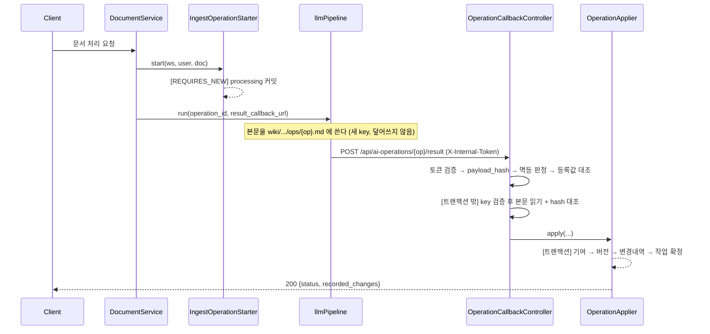
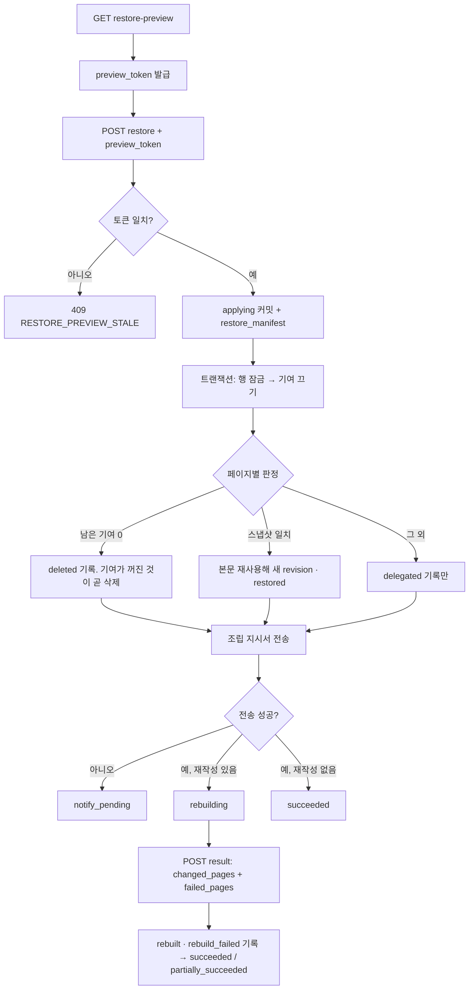

# AI 작업 로그 도메인 API (재구성 스펙)

AI 작업 로그 도메인은 AI가 문서·Wiki를 바꾼 이력을 한곳에 모아 **조회**하고, 특정 시점으로 **되돌린다**. 인증·예외 매핑·에러 응답 포맷 등 공통 규약은 [`00-common.md`](./00-common.md)를 전제로 하며 여기서 반복하지 않는다.

- Controller: `fruition/aihistory/controller/OperationQueryController.java`(사용자용), `OperationCallbackController.java`(llmPipeline 내부 콜백)
- Service: `OperationQueryService`, `RestorePreviewService`, `RestoreExecuteService`, `RestoreScopeResolver`, `RestorePlanner`, `RestoreApplier`, `RestoreOperationLifecycle`, `OperationIngestService`, `OperationApplier`, `RestoreRebuildApplier`, `OperationRecorder`, `IngestOperationStarter`, `AgentApplyOperationStore`, `PreviewTokenSigner`, `WikiObjectReader`, `WikiLineCounter` (`fruition/aihistory/service/`)
- Domain: `OperationLog`, `OperationChange`, `OperationType`, `OperationStatus`, `ChangeType`, `ResourceType`, `RestoreAction` (`fruition/aihistory/domain/`)
- Repository: `OperationLogRepository`, `OperationChangeRepository`, `PipelineRestoreRequester` (`fruition/aihistory/repository/`)
- Exception: `OperationNotFoundException`, `OperationPayloadConflictException`, `InvalidRestoreRequestException`, `RestorePreviewStaleException`, `InvalidCallbackTokenException`, `InvalidCallbackPayloadException` (`fruition/aihistory/exception/`)
- Wiki 이력 테이블 엔티티는 `fruition/wiki/domain/`에 있다: `WikiPageVersion`, `WikiPageVersionId`, `WikiPageContribution`
- 마이그레이션: `V15__add_ai_operation_logs.sql`, `V16__add_wiki_page_versions.sql`, `V17__add_wiki_page_deleted_status.sql`
- 설계 배경: [`docs/design/ai-operation-log.md`](../../design/ai-operation-log.md)

---

## 0. 핵심 개념

이 도메인을 재구성하려면 아래 세 가지를 먼저 이해해야 한다.

**revision과 contribution_count는 다른 것이다.** `revision`은 페이지 버전 번호로 단조 증가하며 되돌려도 줄지 않는다. 복구도 새 revision을 append한다. `contribution_count`는 그 시점 페이지를 받치던 기여 수이고 되돌리면 줄어든다. 같은 값이 서로 다른 revision에 나타날 수 있어(ABA) **버전으로 쓸 수 없다**. 화면에는 둘을 병기한다.

**기여 원장(contribution ledger)이 복구 판정의 유일한 근거다.** `wiki_page_contributions`가 "지금 누가 이 페이지를 받치고 있나"를 담는 유일한 가변 테이블이고, `ai_operation_logs`·`ai_operation_changes`·`wiki_page_versions`는 append-only 감사 기록이다. 복구는 기여 행을 **지우지 않고 `active=false`로 끈다**. 지우면 연속 복구에서 이전에 제외한 기여가 다시 살아난다.

**Backend는 `wiki/`에도 `wiki_pages`에도 쓰지 않는다.** 본문 object는 llmPipeline만 쓰며 작업마다 새 key를 만들고 덮어쓰지 않는다. `wiki_pages`도 llmPipeline 소유다(`5f230a4`에서 rename까지 위임했다).

그래서 **현재 본문은 `wiki_page_versions`의 최신 revision이 답한다.** Backend가 revision을 쌓는 것 자체가 "현재 내용이 이것"이라는 뜻이라 포인터를 따로 옮길 필요가 없다. `wiki_pages.markdown_uri`는 llmPipeline이 임베딩 생성에 쓰는 자기 값으로 남는다.

**삭제도 상태 컬럼을 쓰지 않는다.** 받치는 활성 기여가 하나도 없는 상태가 곧 삭제다. 링크·임베딩 정리는 조립 지시서의 `deleted_pages`를 받은 llmPipeline이 한다.

---

## 1. 데이터 모델

### `ai_operation_logs` (엔티티 `OperationLog`)

AI 작업 1회 = 1행. 애플리케이션 로그가 아니라 사용자에게 보여줄 업무 데이터다.

| 컬럼 | 타입/제약 | 비고 |
|---|---|---|
| `operation_id` | PK, varchar(255) | 발급은 **항상 Backend**. `op_` + 16바이트 난수의 URL-safe Base64 |
| `workspace_id` | varchar(255), NOT NULL, FK→`workspaces` ON DELETE CASCADE | |
| `user_id` | varchar(255), NOT NULL, FK→`users` | |
| `operation_type` | varchar(20), NOT NULL | `OperationType` = `document_edit` \| `ingest` \| `lint` \| `restore` |
| `target_document_id` | varchar(255), FK→`documents` ON DELETE SET NULL | 어느 원문 문서의 작업인지. **복구 범위 선정의 근거**이며 lint는 NULL |
| `status` | varchar(20), NOT NULL | 아래 상태표 참조 |
| `summary` | text, nullable | |
| `changed_resource_count` | integer, NOT NULL DEFAULT 0 | |
| `restored_from` | varchar(255), FK→self | 복구 작업이 되돌린 대상 작업 |
| `restore_manifest` | jsonb, nullable | 복구 시 llmPipeline에 보낸 조립 지시서 원본(`RestorePlan` 직렬화). 재조립 결과 수신과 재전송에 쓴다 |
| `payload_hash` | varchar(64), nullable | 완료 콜백 payload의 정규화 SHA-256. 재전송 판정용 |
| `created_at` | timestamptz, NOT NULL | 목록 커서이자 복구 범위 기준 |
| `completed_at` | timestamptz, nullable | |

인덱스: `(workspace_id, operation_type, created_at DESC)` 목록용, `(target_document_id, created_at)` 복구 범위 선정용.

정적 팩터리: `processing(...)`(ingest 접수), `completed(...)`(동기 완료), `applying(...)`(복구 시작, `restoredFrom`·`restoreManifest` 포함). 상태 전이는 `complete(status, summary, count, payloadHash, completedAt)`과 `moveTo(status)`.

### `OperationStatus`

| 값 | 의미 |
|---|---|
| `processing` | ingest 접수 후 llmPipeline 결과 대기 |
| `applying` | 복구 DB 반영 중. 중간 실패 시 같은 `restore_manifest`로 재시도 |
| `notify_pending` | 복구 반영 완료, llmPipeline 통지 대기 |
| `rebuilding` | 조립 지시서 전송 완료, 재조립 결과 대기 |
| `succeeded` / `partially_succeeded` / `failed` / `conflict` | 확정 상태 |

`isTerminal()`은 뒤 4개에 대해 true다. 콜백 재수신 시 멱등 판정의 기준이 된다.

### `ai_operation_changes` (엔티티 `OperationChange`)

작업 1회가 바꾼 리소스를 1행씩 기록한 감사 기록. **나중에 고치지 않는다.**

| 컬럼 | 타입/제약 | 비고 |
|---|---|---|
| `id` | PK, bigint IDENTITY | |
| `operation_id` | varchar(255), NOT NULL, FK→`ai_operation_logs` ON DELETE CASCADE | |
| `resource_type` | varchar(20), NOT NULL | `ResourceType` = `document` \| `wiki_page` |
| `resource_id` | varchar(255), NOT NULL | **FK 없음.** `documents.id` 또는 `wiki_pages.id`를 가리키는 다형 참조이며, 대상이 삭제돼도 로그는 남아야 한다 |
| `before_revision` | bigint, nullable | 손대기 직전 버전. NULL이면 새로 만든 것 |
| `after_revision` | bigint, nullable | 이 작업이 만든 버전. 위임·실패면 NULL |
| `change_type` | varchar(20), NOT NULL | 아래 표 참조 |
| `change_summary` | text, nullable | 실패 사유를 여기 남긴다 |
| `additions` / `deletions` | integer, nullable | 저장 시점 계산값. 계산 실패 시 NULL |

**diff 본문은 저장하지 않는다.** 전체 본문이 버전 테이블에 있어 조회 시 재계산할 수 있고, 중복 저장하면 두 값이 어긋날 여지가 생긴다.

UNIQUE `uk_ai_operation_changes_operation_resource_type` = `(operation_id, resource_type, resource_id, change_type)`. 콜백 재전송 시 중복을 막는 최종 방어선이다. revision은 매번 새로 채번되므로 버전 테이블 PK만으로는 재전송을 걸러낼 수 없다. `change_type`을 키에 넣는 이유는 **한 복구 작업이 같은 페이지에 `delegated`와 `rebuilt`를 차례로 남기기** 때문이다.

### `ChangeType`

| 값 | 남기는 시점 |
|---|---|
| `created` | 새 페이지. `before_revision`이 NULL이라 되돌릴 지점이 없다 |
| `updated` | ingest·lint가 기존 페이지를 갱신 |
| `deleted` | 복구로 받치는 기여가 하나도 남지 않아 소프트 삭제 |
| `restored` | 복구가 예전 버전 본문으로 되돌림 |
| `delegated` | 복구가 재조립을 llmPipeline에 맡김. 본문 미변경 |
| `rebuilt` | 재조립 성공 |
| `rebuild_failed` | 재조립 실패. 사유는 `change_summary` |

### `wiki_page_versions` (엔티티 `WikiPageVersion`, `fruition.wiki`)

| 컬럼 | 타입/제약 | 비고 |
|---|---|---|
| `page_id` + `revision` | 복합 PK (`WikiPageVersionId`) | revision은 `max+1` 채번 |
| `contribution_count` | integer, NOT NULL | 그 시점 살아 있던 기여 수. **버전이 아니다** |
| `markdown` | text, NOT NULL | RDS에 본문 사본을 둔다 |
| `markdown_key` | text, NOT NULL | 그 본문이 담긴 불변 object key. 복구가 재사용한다 |
| `content_hash` | varchar(64), NOT NULL | 무결성 확인 및 재전송 판정 |
| `operation_id` | varchar(255), FK→`ai_operation_logs` ON DELETE SET NULL | |
| `created_by`, `created_at` | | |

인덱스 `(page_id, revision DESC)` — 다음 revision 채번(`max`)과 이력 조회용.

### `wiki_page_contributions` (엔티티 `WikiPageContribution`, `fruition.wiki`)

| 컬럼 | 타입/제약 | 비고 |
|---|---|---|
| `page_id` + `ingest_operation_id` | 복합 PK | ingest 작업 하나가 페이지 하나에 남기는 기여는 최대 1개 |
| `source_document_id` | varchar(255), FK→`documents` ON DELETE SET NULL | |
| `sequence_revision` | bigint, NOT NULL | 이 기여가 처음 적용된 페이지 revision. **조립 순서의 기준**. `created_at`은 작업 시작 시각이라 실제 적용 순서와 어긋날 수 있어 쓰지 않는다 |
| `object_key` | text, NOT NULL | 재조립에 쓸 불변 기여 조각 key |
| `active` | boolean, NOT NULL DEFAULT true | 복구는 행을 지우지 않고 이 값을 끈다 |
| `deactivated_by` | varchar(255), FK→`ai_operation_logs` | 끈 복구 작업 |
| `created_at` | timestamptz, NOT NULL | |

인덱스 `(page_id, active, sequence_revision)` — 복구 판정의 핵심. 살아 있는 기여를 적용 순서대로 읽는다.

### `wiki_pages` (V17 — 현재 미사용)

V17이 `status` CHECK 제약에 `deleted`를 추가했지만 **Backend는 이 값을 쓰지 않는다.** 삭제 판정을 기여 원장으로 옮기면서 필요가 없어졌다. 이미 적용된 마이그레이션이라 되돌리지 않고, `WikiPageStatus.deleted`도 그 값을 읽을 수 있도록 남겨 둔다.

복구의 삭제는 행을 지우지 않는다. 하드 삭제하면 `wiki_page_versions`·`wiki_page_contributions`가 CASCADE로 사라져 되살릴 수 없다.

### `document_content_versions` 변경 (V15)

`operation_id varchar(255)` 컬럼 추가(FK→`ai_operation_logs` ON DELETE SET NULL). 사용자가 직접 편집한 버전이면 NULL이다.

---

## 2. 사용자용 엔드포인트

Controller `@RequestMapping("/api/workspaces/{workspace_id}/ai-operation-logs")`. `/api/workspaces/**`에 속하므로 **인증 필수**. `@AuthenticationPrincipal String userId`로 호출자를 식별하고, 서비스 진입 시 `WorkspaceMemberRepository.existsByWorkspace_IdAndUser_Id`로 멤버십을 검증한다. 아니면 `WorkspaceNotFoundException`(404).

---

### `GET /api/workspaces/{workspace_id}/ai-operation-logs` — 작업 로그 목록

- **query**: `type`(`OperationType` 이름), `status`(`OperationStatus` 이름), `cursor`(ISO-8601 Instant), `size`(기본 20, 최대 100, 1 미만이면 20)
- **응답 200** `OperationLogListResponse`
  - `logs[]`: `operation_id`, `operation_type`, `status`, `target_document_id`, `summary`, `changed_resource_count`, `restored_from`, `created_at`, `completed_at`
  - `next_cursor`: 마지막 항목의 `created_at`. null이면 마지막 페이지
- **에러**: `type`·`status`·`cursor` 파싱 실패 → `InvalidRestoreRequestException`(400, `INVALID_RESTORE_REQUEST`)
- **흐름**
  1. 멤버십 검증
  2. `limit+1`건을 조회해 다음 페이지 존재 여부를 판정하고, 초과분은 잘라낸다
  3. `OperationLogRepository.findPage(workspaceId, type, status, cursor, PageRequest.of(0, limit+1))` — `created_at DESC`

> ⚠️ **커서에 null을 넘기지 않는다.** `(:cursor IS NULL OR l.createdAt < :cursor)` 형태는 Postgres가 timestamp 파라미터의 타입을 추론하지 못해 `could not determine data type of parameter` 로 **실행 자체가 실패**한다. 첫 페이지는 `NO_CURSOR = 9999-12-31T23:59:59Z`를 넘긴다(`OperationQueryService`). `type`·`status`는 enum이라 같은 문제가 없어 `IS NULL` 형태를 그대로 쓴다.

---

### `GET .../ai-operation-logs/{operation_id}` — 작업 로그 상세

- **응답 200** `OperationLogDetailResponse` — 목록 항목의 필드에 `changes[]`를 더한다
  - `changes[]`: `id`, `resource_type`, `resource_id`, `before_revision`, `after_revision`, `change_type`, `change_summary`, `additions`, `deletions`, `hunks`, `diff_too_large`
  - `OperationChangeRepository.findByOperationIdOrderByIdAsc`로 기록 순서대로 반환
- **에러**: 404 `AI_OPERATION_NOT_FOUND`

`additions`·`deletions`는 저장 시점 계산값이라 다시 세지 않는다. 반면 `hunks`는 **조회 시점에 계산한다**(`ChangeDiffLoader`). 목록에서 한 건을 고르면 변경분까지 한 번에 받도록 상세에 담는다.

| 상황 | `hunks` | `diff_too_large` |
|---|---|---|
| 갱신·복원·재작성 (`before`·`after` 둘 다 있음) | 계산 결과 | 생략 |
| 생성·삭제·위임·재작성실패 (한쪽이 null) | 생략 | 생략 |
| 버전 행이 없음 | 생략 | 생략 |
| 두 본문 차이가 너무 커서 계산 거부 | 생략 | `true` |

> ⚠️ **한 항목의 계산 실패가 상세 전체를 실패시키지 않는다.** 큰 페이지 하나 때문에 나머지 멀쩡한 항목까지 못 보는 것은 잘못된 트레이드오프다. 개별 diff 엔드포인트였다면 422였을 경우도 여기서는 200이고 그 항목만 `diff_too_large: true`가 된다.
>
> 리소스 수에 상한을 두지 않았다. ingest 한 건이 위키 페이지를 몇 개나 건드리는지 실측 데이터가 없어서, 없을지도 모르는 문제에 대비해 클라이언트에 분기를 강요하지 않기로 했다. 실제 운영 수치를 본 뒤 필요하면 상한을 추가한다(응답에 필드가 느는 것이라 기존 클라이언트를 깨지 않는다).

---

### `GET .../ai-operation-logs/{operation_id}/restore-preview` — 복구 미리보기

되돌리기는 무를 수 없으므로 무엇이 삭제·복원·재작성되는지 먼저 보여준다. **본문을 읽지 않고 기여 명단만으로 계산한다.**

- **응답 200** `RestorePreviewResponse`
  - `delete_count`, `restore_count`, `rebuild_count`
  - `pages[]`: `page_id`, `action`(`delete` \| `restore` \| `rebuild`), `target_revision`(복원일 때만, 그 외 null), `contribution_count`
  - `document`: `{ document_id, from_version, to_version }` — **문서 편집 되돌리기일 때만**. 이때 `pages`는 빈 배열이다
  - `preview_token`: 실행에 그대로 전달해야 한다

> Wiki 되돌리기는 `pages`가 차고, 문서 편집 되돌리기는 `document`가 찬다. 둘이 동시에 차지 않는다.
> 문서는 버전이 선형이라 계산할 것이 없다. 되돌릴 지점이 `ai_operation_changes.before_revision`에 이미 적혀 있다.
- **에러**: 404 `AI_OPERATION_NOT_FOUND` / `WORKSPACE_NOT_FOUND`
- `@Transactional(readOnly = true)`

---

### `POST .../ai-operation-logs/{operation_id}/restore` — 이 작업 되돌리기

- **요청** `RestoreExecuteRequest`: `{ "preview_token": "..." }` (`@NotBlank`)
- **응답 200** `RestoreExecuteResponse`
  - `operation_id`(이번 복구 작업), `restored_from`(되돌린 대상), `delete_count`, `restore_count`, `rebuild_count`, `rebuilding`(boolean), `status`
- **에러**
  - 400 `INVALID_RESTORE_REQUEST` — 되돌릴 수 없는 작업 유형(`document_edit`·`ingest`·`lint`만 가능), 되돌릴 대상 없음
  - 404 `AI_OPERATION_NOT_FOUND` / `WORKSPACE_NOT_FOUND` / `DOCUMENT_CONTENT_VERSION_NOT_FOUND`
  - 409 `RESTORE_PREVIEW_STALE` — 미리보기 이후 대상이 변경됨
  - 423 — 다른 사용자가 문서를 편집 중 (문서 되돌리기만)
- **ingest 되돌리기는 Wiki만 되돌린다.** ingest는 원문 문서를 읽기만 하고 바꾸지 않으므로 되돌릴 문서 본문이 없다.
- **문서 편집 되돌리기는 문서만 되돌린다.** 재작성이 없어 llmPipeline을 부르지 않고 그 자리에서 `succeeded`로 끝난다.

### 문서 편집 되돌리기 (`document_edit`)

되돌리기는 사용자에게 한 가지 동작이므로 작업 종류와 무관하게 이 엔드포인트 하나로 처리한다. 내부에서만 갈린다.

```
① DocumentRestorePlanner — ai_operation_changes에서 before_revision을 읽어 목적지 결정
     from_version = 지금 문서 버전 (대상 작업이 만든 버전이 아니다. 그 뒤 사용자가 더 저장했을 수 있다)
     to_version   = before_revision
② preview_token 재검증 — from_version이 서명에 들어 있어 그사이 문서가 저장되면 409
③ [별도 트랜잭션] restore 작업을 applying으로 커밋
④ DocumentRestoreApplier — to_version의 본문으로 DocumentService.saveContent 호출
     편집 잠금·낙관적 잠금·편집 상태 갱신이 이미 그 안에 있어 되돌리기라고 다르게 처리하지 않는다
     적용 표를 넘기지 않으므로 document_edit 로그는 생기지 않는다
⑤ ai_operation_changes에 restored 기록 (document / from_version → 새 버전)
⑥ succeeded 확정
```

**과거 버전을 되살리지 않고 그 내용으로 새 버전을 쌓는다.**

```
버전 5  "원래 문단"
버전 6  "AI가 다듬은 문단"      ← op_7Kd3 이 만듦
버전 7  "원래 문단"             ← 되돌리기 결과. 5로 돌아가지 않는다
```

Wiki revision과 같은 원칙이다. 되돌린 것도 다시 되돌릴 수 있고, 같은 번호가 다른 내용을 가리키는 일이 없다.

거절하는 경우: 새로 만든 문서라 `before_revision`이 NULL, 이미 그 버전, 문서 변경내역이 없는 작업, 되돌릴 내용이 현재와 같아 저장이 일어나지 않음.

> 기존 `POST /api/documents/{id}/versions/{version}/restore`는 그대로 둔다. 버전 목록 화면에서 쓰는 별개 경로이며 AI 작업 로그를 만들지 않는다.

---

## 3. 복구 계산 규칙

### 3.1 범위 결정 (`RestoreScopeResolver`)

사용자는 범위를 고르지 않는다. 기준 작업 하나로 정해진다.

- `target_document_id`가 있으면(ingest): **지목한 작업 자신**과 `findByTargetDocumentAfter(documentId, target.createdAt, ingest)`가 반환한 **그 이후 같은 문서의 ingest 전부**를 모은다. `LinkedHashSet`이라 같은 시각 작업이 조회에 섞여 들어와도 중복되지 않는다.
- `target_document_id`가 없으면(lint): 그 작업 하나만 취소한다.

`A1 → A2 → A3 → B → A4`에서 A2를 지목하면 취소 대상은 `{A2, A3, A4}`다. B는 다른 문서이므로 살아남고, B가 보탠 페이지는 재작성 대상이 된다.

> **지목한 작업 자신도 취소된다.** 로그 목록에서 "이 항목이 한 일을 없앤다"가 가장 흔한 조작이기 때문이다. lint 되돌리기도 그 작업 하나만 취소하므로 두 유형의 규칙이 같다. A2까지 살리고 싶으면 그다음 작업인 A3을 지목하면 된다.

### 3.2 페이지별 판정 (`RestorePlanner`)

순수 계산이며 DB·저장소를 건드리지 않는다. 입력은 제외 대상 작업 집합과 **페이지별 전체 기여 목록(active + inactive)**이다.

```
남은 기여(kept) = 전체 기여 중 active이면서 제외 대상이 아닌 것, sequence_revision 오름차순

kept.isEmpty()                 → delete   (받치는 기여가 없다)
스냅샷이 kept와 일치            → restore  (되돌릴 버전이 그대로 있다)
그 외                          → rebuild  (남은 조각을 합쳐야 한다)
```

**restore 판정의 정확한 조건**은 다음과 같다.

```java
long lastKeptRevision = kept.get(kept.size() - 1).getSequenceRevision();
long appliedAtRevision = ordered.stream()                        // ordered = 전체 기여
        .filter(c -> c.getSequenceRevision() <= lastKeptRevision).count();
boolean canRestore = appliedAtRevision == kept.size();
```

즉 `targetRevision = 남길 기여의 마지막 revision`이고, **그 revision 이하의 기여가 전부 남길 대상일 때만** 유효하다.

> ⚠️ `targetRevision = 최소 제외 revision - 1`로 잡으면 **연속 복구에서 틀린다.** 이미 비활성인 기여가 포함된 revision을 가리키게 되기 때문이다. 그래서 planner 입력이 active-only가 아니라 전체 기여여야 한다.

### 3.3 preview_token (`PreviewTokenSigner`)

`operation_id` + 페이지별 기여 명단(`page_id`, `ingest_operation_id`, `sequence_revision`, `active`)을 정규화한 문자열에 대한 HMAC-SHA256이다. 키는 앱 시작 시 `SecureRandom`으로 생성하므로 **재시작하면 발급된 토큰이 무효**가 된다. 그때는 미리보기를 다시 받으면 된다. 비교는 상수 시간(`MessageDigest.isEqual`).

### 3.4 실행 순서 (`RestoreExecuteService`)

```
① 대상 작업 조회 + 유형 확인 (document_edit이면 문서 분기로)
② 범위 결정 → 기여 적재 → preview_token 재검증 (불일치면 409)
③ 계획 계산. 대상 페이지가 없으면 400
④ [별도 트랜잭션] restore 작업을 applying으로 커밋 + restore_manifest 보관
⑤ [한 트랜잭션] RestoreApplier.apply(...)
⑥ 조립 지시서 전송
⑦ [별도 트랜잭션] 상태 확정
```

④를 먼저 커밋하는 이유는 ⑤가 중간에 실패해도 `applying`으로 남아 같은 `restore_manifest`로 재시도할 수 있게 하기 위해서다. ④·⑦은 `RestoreOperationLifecycle`에 있다. **같은 클래스 안에서 호출하면 `@Transactional`이 걸리지 않으므로 반드시 별도 빈이어야 한다.**

### 3.5 반영 (`RestoreApplier`, 한 트랜잭션)

1. 대상 페이지를 **`page_id` 오름차순으로** `findByIdForUpdate`(`@Lock(PESSIMISTIC_WRITE)`) 잠근다. 순서를 고정해야 복구가 동시에 실행될 때 교착이 나지 않는다.
2. 제외 대상 기여를 `active=false`, `deactivated_by=복구 operation`으로 끈다.
3. 페이지별로:
   - `restore` — 되돌릴 revision의 `markdown`·`markdown_key`·`content_hash`를 **재사용**해 `revision = max+1`로 새 버전을 쌓는다. 그것이 곧 현재 본문이다. `restored` 기록. **저장소에도 `wiki_pages`에도 쓰지 않는다.**
   - `delete` — `deleted` 기록만. 기여를 전부 끈 상태가 곧 삭제이고, 링크 정리는 llmPipeline 몫이다
   - `rebuild` — 본문을 건드리지 않고 `delegated` 기록만
4. 작업을 `notify_pending`으로 옮긴다.

### 3.6 상태 확정 (`RestoreOperationLifecycle.finish`)

| 조건 | 결과 |
|---|---|
| 전송 실패 | `notify_pending` — 복구는 이미 반영됐고 재작성만 보류된다 |
| 전송 성공 + 재작성 있음 | `rebuilding` |
| 전송 성공 + 재작성 없음 | `succeeded` |

`PipelineRestoreRequester.send()`는 **예외를 던지지 않고** boolean을 반환한다. 통지 실패로 복구 전체를 롤백하면 이미 반영된 DB 상태와 어긋난다.

---

## 4. llmPipeline 연동

### 4.1 내부 콜백 인증

Controller `@RequestMapping("/api/ai-operations")`. 사용자 인증 대상이 아니며 `X-Internal-Token` 헤더를 `app.internal.callback-token`과 **상수 시간 비교**한다. 불일치·부재는 401 `INVALID_CALLBACK_TOKEN`. **인증을 통과하기 전에는 저장소 객체를 읽지 않는다.**

### 4.2 `POST /api/ai-operations/{operation_id}/result` — 작업 결과 수신

ingest 결과와 복구 재조립 결과가 **같은 엔드포인트**를 쓰며, 등록된 작업의 `operation_type`으로 갈린다.

- **요청** `OperationResultRequest`
  - `operation_id`(`@NotBlank`), `operation_type`, `status`(`@NotBlank`), `workspace_id`, `user_id`, `target_document_id`, `summary`
  - `changed_pages[]`(`@NotNull`): `page_id`, `page_type`, `markdown_key`, `contribution_key`, `content_hash`, `contribution_stored`
  - `failed_pages[]`: `page_id`, `reason` — **재조립에만 실린다**
- **응답 200** `OperationResultResponse`: `operation_id`, `status`, `recorded_changes`
- **에러**: 401 `INVALID_CALLBACK_TOKEN` / 404 `AI_OPERATION_NOT_FOUND` / 409 `AI_OPERATION_PAYLOAD_CONFLICT` / 422 `INVALID_CALLBACK_PAYLOAD`

> `workspace_id`·`user_id`·`target_document_id`는 **권한 근거가 아니다.** 요청 등록 때 저장한 값과 일치하는지 대조할 뿐이며, 생략하면 대조하지 않는다. 콜백이 보낸 값을 믿으면 위조된 요청이 다른 워크스페이스를 건드릴 수 있다.

**공통 처리 순서** (`OperationIngestService.accept`)

1. 경로와 본문의 `operation_id` 일치 확인
2. 작업 조회(없으면 404) 후 `payload_hash` 계산 — 정규화 JSON의 SHA-256 hex
3. **멱등** — 작업이 이미 `isTerminal()`이면 `payload_hash`가 같을 때 기존 결과를 그대로 반환하고, 다르면 409
4. 등록값 대조
5. 유형 분기 — `restore`면 재조립(4.4), 아니면 ingest 적재(4.3)

**저장소 읽기는 트랜잭션 밖**에서 한다. 페이지 여러 개를 읽는 동안 DB 커넥션을 붙잡지 않기 위해서다.

### 4.3 ingest 적재 (`OperationApplier`, 한 트랜잭션)

페이지마다:

1. `wiki_pages` 조회 — 없으면 422, 워크스페이스가 다르면 422
2. 직전 버전의 `content_hash`가 같으면 **건너뛴다**(재전송)
3. `revision = max+1` 채번
4. **기여를 먼저 넣는다.** 그래야 그 시점 기여 수가 나오고 그 값이 버전 행에 들어간다
5. `contribution_count = countByIdPageIdAndActiveTrue(pageId)`
6. `wiki_page_versions` 적재. `wiki_pages`는 건드리지 않는다
7. `created`(직전 버전 없음) 또는 `updated` 기록. 줄 수는 `WikiLineCounter`

작업 확정: `status == "failed"`면 `partially_succeeded`, 아니면 `succeeded`. **부분 실패여도 이미 만든 페이지는 기록한다.** 안 그러면 Wiki에는 있는데 로그에 없는 페이지가 영영 복구 대상에서 빠진다.

### 4.4 재조립 결과 (`RestoreRebuildApplier`, 한 트랜잭션)

복구의 `rebuilding` 단계를 끝낸다. 작업 상태가 `rebuilding`·`notify_pending`이 아니면 422.

ingest 적재와 다른 점은 **기여를 만들지 않는다**는 것이다. 조립에 쓴 조각은 복구가 살려둔 것들이라 이미 있다. 따라서 `contribution_count`도 다시 세지 않고 `restore_manifest`에서 꺼낸다. 그사이 새 ingest가 들어와도 목표값이 흔들리지 않게 하기 위해서다.

- 지시서에 `rebuild`로 없는 페이지가 결과에 오면 422다(요청하지 않은 페이지)
- 성공분: `revision = max+1`로 적재 후 `rebuilt` 기록. 같은 작업의 재전송이면 건너뛴다
- 실패분: 본문을 건드리지 않고 `rebuild_failed` + 사유만 기록. `(operation_id, page_id, rebuild_failed)`가 이미 있으면 건너뛴다(실패에는 대조할 해시가 없다)
- `delegated` 행은 갱신하지 않는다
- 확정: `failed_pages`가 비고 `status != "failed"`면 `succeeded`, 아니면 `partially_succeeded`
- `recorded_changes`는 이 복구 작업이 남긴 **전체** 변경내역 수다(삭제·복원·위임 포함)

### 4.5 `POST {app.wiki-restore.endpoint}` — 조립 지시서 (Backend → llmPipeline)

Backend가 못 하는 것만 넘긴다.

```json
{
  "operation_id": "op_restore_9a2b",
  "restored_from": "op_a2",
  "workspace_id": "ws_1",
  "user_id": "user_1",
  "result_callback_url": "http://.../api/ai-operations/op_restore_9a2b/result",
  "excluded_operations": ["op_a3", "op_a4"],
  "rebuild_pages": [
    { "page_id": "C3", "contribution_count": 2,
      "keep_contributions": [ { "operation_id": "op_b", "document_id": "doc_B", "object_key": "..." } ] }
  ],
  "restored_pages": [ { "page_id": "S_A", "revision": 3 } ],
  "deleted_pages": ["C6"]
}
```

| 항목 | 의미 |
|---|---|
| `rebuild_pages` | 요청 — 남은 조각을 `keep_contributions` **순서대로** 붙여 다시 써 달라. 순서가 결과를 바꾼다 |
| `restored_pages` · `deleted_pages` | 통보 — 이미 끝난 사실이며 임베딩·링크 정리용 |

`keep_contributions`가 1개면 조립이 아니라 그 조각을 그대로 쓰면 되므로 LLM 호출이 필요 없다.

### 4.6 object key 검증 (`WikiObjectReader`)

bucket은 **환경 설정으로 고정**하고 콜백에서 받지 않는다. 콜백이 준 경로를 검증 없이 열면 임의 객체를 읽게 된다. prefix가 `wiki/{workspace}/pages/{page}/ops/{operation}.(md|json)`인지 정확히 대조한 뒤에만 읽는다. `s3://bucket/...` 형태로 와도 object key만 남긴다.

읽은 뒤 SHA-256을 다시 계산해 콜백이 보고한 `content_hash`와 대조하고, 다르면 422다.

---

## 5. 작업 등록 지점

로그가 쌓이려면 작업을 **먼저 등록**해야 한다. 콜백이 도착했을 때 대조할 등록값이 없으면 결과를 받아들일 수 없다.

### 5.1 `document_edit` — AI 편집안 적용

`source=agent` 문자열은 클라이언트가 임의로 넣을 수 있어 **수동 편집을 AI 작업으로 위장**할 수 있다. 그래서 Backend가 발급한 일회용 표를 대조한다.

1. Agent turn 응답(`AgentTurnResponse`)에 `applyOperationId`를 실어 보낸다 — `AgentApplyOperationStore.issue(userId, documentId)`
2. 문서 저장 요청(`POST /api/documents/{id}/content`)의 multipart part `apply_operation_id`로 되돌려받는다
3. `consume(operationId, userId, documentId)` — 조회와 동시에 제거하므로 같은 표로 두 번 기록되지 않는다. TTL 30분
4. 통과하면 `OperationRecorder`가 `document_edit` 로그와 변경내역을 남기고 `document_content_versions.operation_id`를 연결한다

표를 **DB에 남기지 않는 이유**는 적용하지 않은 편집안을 기록하지 않기 위해서다. 사용자가 편집안을 버리면 표는 만료로 사라지고 흔적이 남지 않는다. 서버 재시작 시 발급된 표는 무효가 되며, 그때는 편집을 다시 요청하면 된다.

### 5.2 `ingest` — Wiki 재구축

`IngestOperationStarter.start(...)`가 llmPipeline을 **호출하기 전에** `processing`으로 `REQUIRES_NEW` 커밋한다. 호출 측 트랜잭션이 롤백돼도 등록은 남아야 한다. llmPipeline 호출 자체가 실패하면 `markFailed`로 확정해 진행 중으로 남지 않게 한다.

> ⚠️ `app.aihistory.ingest-logging-enabled` 기본값은 **`false`**다. llmPipeline의 `PipelineRunIn`이 `extra="forbid"`라 스키마가 준비되기 전에 `operation_id`를 보내면 422가 난다. llmPipeline이 준비되면 켠다.

---

## 6. 예외 → HTTP 매핑

| 예외 | HTTP | 에러 code |
|---|---|---|
| `OperationNotFoundException` | 404 | `AI_OPERATION_NOT_FOUND` |
| `InvalidRestoreRequestException` | 400 | `INVALID_RESTORE_REQUEST` |
| `RestorePreviewStaleException` | 409 | `RESTORE_PREVIEW_STALE` |
| `OperationPayloadConflictException` | 409 | `AI_OPERATION_PAYLOAD_CONFLICT` |
| `InvalidCallbackTokenException` | 401 | `INVALID_CALLBACK_TOKEN` |
| `InvalidCallbackPayloadException` | 422 | `INVALID_CALLBACK_PAYLOAD` |

---

## 7. 설정 키

| 키 | 기본값(env) | 용도 |
|---|---|---|
| `app.aihistory.ingest-logging-enabled` | `false` (`AIHISTORY_INGEST_LOGGING_ENABLED`) | ingest 작업 등록 on/off |
| `app.internal.callback-token` | `INTERNAL_CALLBACK_TOKEN` | 내부 콜백 인증. 사용자 인증과 분리. 기본값은 로컬 개발용 placeholder이며 배포 환경에서는 반드시 주입한다 |
| `app.wiki-restore.endpoint` | `http://localhost:8000/wiki/restore-runs` (`WIKI_RESTORE_ENDPOINT`) | 조립 지시서 전송 대상 |
| `app.wiki-restore.timeout-seconds` | `60` (`WIKI_RESTORE_TIMEOUT_SECONDS`) | read timeout. connect는 5초 고정 |
| `app.callback.base-url` | `http://host.docker.internal:8080` (`CALLBACK_BASE_URL`) | `result_callback_url` 조립에 쓴다 |

---

## 8. 흐름 시각화

### ingest 등록 → 결과 수신



### 되돌리기 → 재조립



---

## 9. 현재 상태

- llmPipeline은 아직 `operation_id` 수용, 기여 조각 저장, `POST /wiki/restore-runs`를 구현하지 않았다. Backend는 mock payload로만 검증했다.
- 그래서 `app.aihistory.ingest-logging-enabled`가 꺼져 있고, 재작성 대상이 있는 복구는 `notify_pending`에서 멈춘다.
- `notify_pending` 자동 재전송이 없다. 재시도는 수동이다.
- `applying` 상태 동안 같은 문서의 새 ingest를 막는 처리가 없다.
- 행 잠금 동작은 단위 테스트로 검증할 수 없다. Testcontainers 통합 테스트가 필요하다.
- 재조립 실패 페이지는 복구 직전 내용 그대로 남는다. 남은 기여와 본문이 어긋난 상태이며 다음 lint가 정리해야 한다.
