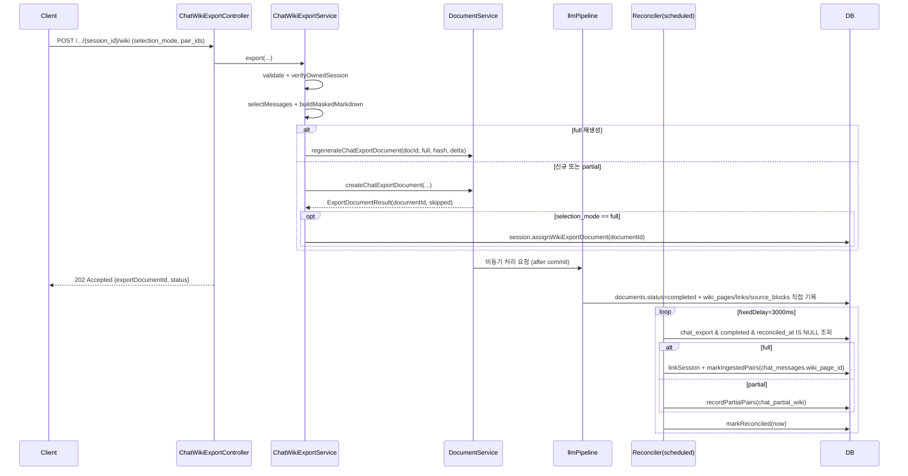
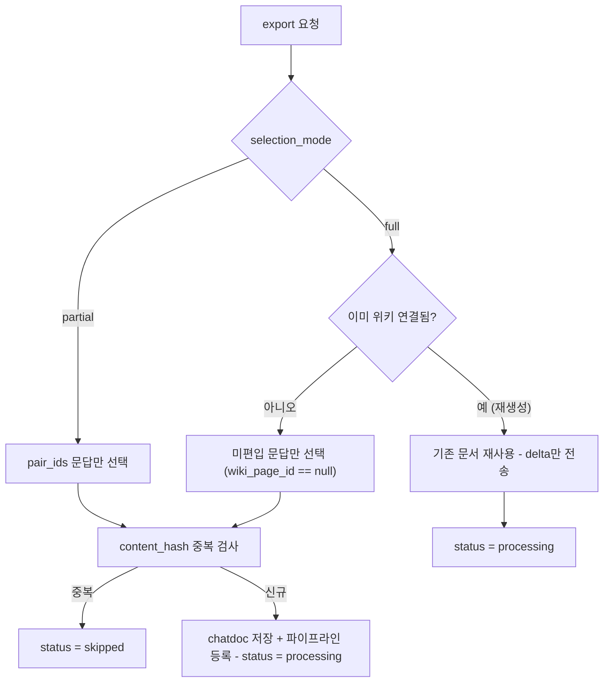

# chat 도메인 API (재구성 스펙)

채팅 세션 CRUD와 채팅 메시지 기록 조회, 그리고 세션(또는 선택 문답)을 Markdown 위키로 export하는 API를 정의한다. 공통 인프라(인증 필터, 예외→HTTP 매핑, ID/해시 규약)는 [`00-common.md`](./00-common.md)를 전제로 하며 여기서는 chat 고유 사항만 다룬다. 위키 export는 저장 후 기존 문서 ingestion 파이프라인에 위임되고, 완료는 `@Scheduled` 폴링 reconciler가 감지한다.

구성 파일:
- `chat/controller/ChatSessionController.java` — 세션 생성/목록/삭제, 메시지 기록 조회
- `chat/controller/ChatWikiExportController.java` — 세션→wiki export, wiki/preview
- `chat/service/ChatSessionService.java` — 세션 CRUD·소유권 검증(`verifyOwnedSession`)·개수 제한
- `chat/service/ChatWikiExportService.java` — export 오케스트레이션(full/partial/재생성)
- `chat/service/ChatWikiMarkdownSerializer.java` — 세션→llmPipeline 입력 Markdown 직렬화
- `chat/service/ChatWikiExportReconciler.java` — 파이프라인 완료 폴링 후처리(`@Scheduled(fixedDelay=3000)`)
- `chat/domain/` — `ChatSession`, `ChatMessage`, `ChatMessageReference`, `ChatMessageRelatedPage`, `ChatPartialWiki`, `StringListJsonConverter`
- `chat/dto/` — 요청/응답 record
- `chat/repository/` — JPA repository 5종
- `chat/exception/` — chat 고유 예외 4종
- 연동: `document/service/DocumentService.java`의 `createChatExportDocument`, `regenerateChatExportDocument`, `ExportDocumentResult`

> 참고: 채팅 메시지 자체를 생성/전송하는 엔드포인트는 chat 도메인이 아니라 query 도메인(`QueryController`)에 있고, 거기서 `chatSessionService.verifyOwnedSession(...)`을 재사용한다. chat 도메인 컨트롤러는 세션 관리·기록 조회·위키 export만 제공한다. ([`query.md`](./query.md) 참조)

## 데이터 모델

출처: `V1__baseline_schema.sql` + 엔티티. 모든 chat 테이블의 `workspace_id`는 `V3__add_workspace_fk_cascade.sql` 기준 애플리케이션에서 정리(세션 삭제 시 `ChatSessionService.deleteAllByWorkspaceId`)한다.

### chat_sessions
| 컬럼 | 타입 | 비고 |
|---|---|---|
| `id` (PK) | varchar(255) | `session_` + UUID(하이픈 제거) |
| `workspace_id` | varchar NOT NULL | 소속 워크스페이스 |
| `user_id` | varchar NOT NULL | 생성자 |
| `title` | varchar | nullable, 생성 요청값 |
| `context_summary` | text | 컨텍스트 요약(엔티티에 존재, chat API 응답엔 미노출) |
| `context_summary_updated_at` | timestamptz | 위와 동일 |
| `created_at` | timestamptz NOT NULL | 생성 시각(`Instant.now()`) |
| `last_message_at` | timestamptz | 생성 시 `created_at`으로 초기화, 목록 정렬 기준 |
| `wiki_page_id` | varchar | export 완료 후 연결된 source wiki page(reconciler가 세팅) |
| `wiki_export_document_id` | varchar | full export 시 기록되는 export 문서 id(재생성·역조회용) |

### chat_messages
| 컬럼 | 타입 | 비고 |
|---|---|---|
| `id` (PK) | varchar(255) | 메시지 id |
| `session_id` | varchar NOT NULL | FK → chat_sessions, **ON DELETE CASCADE** |
| `pair_id` | varchar NOT NULL | 문답(user+assistant) 쌍 식별자 |
| `role` | varchar NOT NULL | `user` / `assistant` |
| `content` | text NOT NULL | 본문 |
| `status` | varchar NOT NULL | `completed` 등(직렬화·해시는 `completed`만 사용) |
| `created_at` | timestamptz NOT NULL | 조회는 이 값 오름차순 |
| `error_message` | varchar(255) | nullable, 응답에서 null이면 생략 |
| `wiki_page_id` | varchar | full 편입 마킹(1:1). 세팅되면 이후 full export에서 제외 |

### chat_message_references
| 컬럼 | 타입 | 비고 |
|---|---|---|
| `id` (PK) | bigint IDENTITY | 자동 증가 |
| `chat_message_id` | varchar NOT NULL | FK → chat_messages, **ON DELETE CASCADE** |
| `reference_type` | varchar NOT NULL | 참조 종류 |
| `document_id` | varchar | 원본 문서 id |
| `rank` | integer | 순위 |
| `source_block_ids` | text | `StringListJsonConverter`로 JSON 배열 ↔ `List<String>` (첫 문서 기준 legacy) |
| `source_refs` | text | `SourceRefListJsonConverter`로 `[{source_document_id, source_block_id}]` ↔ `List<SourceRef>`. 다중 문서 참조 보존(V7). 기존 행 NULL |
| `quote` | text | 인용 텍스트 |

### chat_message_related_pages
| 컬럼 | 타입 | 비고 |
|---|---|---|
| `id` (PK) | bigint IDENTITY | 자동 증가 |
| `chat_message_id` | varchar NOT NULL | FK → chat_messages, **ON DELETE CASCADE** |
| `wiki_page_id` | varchar | 관련 위키 페이지 |
| `page_type` | varchar | 페이지 유형 |
| `title`, `slug` | varchar | 표시용 |
| `relevance_score` | double precision | null이면 응답에서 `0.0` |
| `role` | varchar | 역할 |
| `depth` | integer | null이면 응답에서 `0` |
| `rank` | integer | null이면 응답에서 `0` |

### chat_partial_wiki
partial 발췌 export의 "문답 ↔ 위키 페이지" 멤버십(1:N). full 편입(`chat_messages.wiki_page_id`)과 분리 저장한다.
| 컬럼 | 타입 | 비고 |
|---|---|---|
| `id` (PK) | varchar(255) | `cpw_` + UUID(하이픈 제거) |
| `session_id` | varchar NOT NULL | 원본 세션 |
| `pair_id` | varchar NOT NULL | 발췌된 문답 |
| `wiki_page_id` | varchar NOT NULL | 생성된 발췌 페이지 |
| `document_id` | varchar NOT NULL | 발췌 export 문서(멱등 가드 키) |
| `created_at` | timestamptz NOT NULL | 기록 시각 |
| (unique) | | `UNIQUE(pair_id, wiki_page_id)` |

## 엔드포인트

공통: 모두 `/api/workspaces/{workspace_id}/chat/sessions` 하위이며 `/api/workspaces/**`는 **authenticated**. `userId`는 `@AuthenticationPrincipal String userId`로 주입. 모든 핸들러는 먼저 워크스페이스 소유권(`workspace_member` 존재)을 검증하고, 실패 시 `WorkspaceNotFoundException`(404 `WORKSPACE_NOT_FOUND`).

| METHOD | path | 이름 |
|---|---|---|
| POST | `/api/workspaces/{workspace_id}/chat/sessions` | 세션 생성 |
| GET | `/api/workspaces/{workspace_id}/chat/sessions` | 세션 목록 |
| DELETE | `/api/workspaces/{workspace_id}/chat/sessions/{session_id}` | 세션 삭제 |
| GET | `/api/workspaces/{workspace_id}/chat/sessions/{session_id}/messages` | 메시지 기록 조회 |
| POST | `/api/workspaces/{workspace_id}/chat/sessions/{session_id}/wiki` | wiki export |
| POST | `/api/workspaces/{workspace_id}/chat/sessions/{session_id}/wiki/preview` | wiki Markdown 미리보기 |

---

### `POST /api/workspaces/{workspace_id}/chat/sessions` — 세션 생성

- 인증: 필요.
- path: `workspace_id`.
- 요청 DTO: `ChatSessionCreateRequest { title }` — body는 `required=false`, null이면 컨트롤러가 `new ChatSessionCreateRequest(null)`로 대체. `title` 검증 없음(nullable 허용).
- 응답: **201 Created**, `ChatSessionResponse { id, title, created_at, last_message_at }`.
- 에러:
  | 예외 | status | code |
  |---|---|---|
  | `WorkspaceNotFoundException` | 404 | `WORKSPACE_NOT_FOUND` |
  | `ChatSessionLimitExceededException` | 409 | `CHAT_SESSION_LIMIT_EXCEEDED` |
- 흐름(`@Transactional`, service 경계):
  1. controller → `chatSessionService.create(workspaceId, userId, safeRequest)`.
  2. `verifyWorkspaceOwnership` — `workspaceMemberRepository.existsByWorkspace_IdAndUser_Id` 아니면 404.
  3. `chatSessionRepository.countByWorkspaceId(workspaceId) >= 10`이면 409(`MAX_SESSIONS_PER_WORKSPACE = 10`).
  4. `session_`+UUID 생성 → `chatSessionRepository.save` → `toResponse`.

### `GET /api/workspaces/{workspace_id}/chat/sessions` — 세션 목록

- 인증: 필요.
- path: `workspace_id`. query 없음.
- 응답: **200 OK**, `ChatSessionListResponse { sessions: ChatSessionResponse[] }`. 정렬은 `findAllByWorkspaceIdOrderByLastMessageAtDesc`(최근 메시지 순).
- 에러: `WorkspaceNotFoundException` → 404.
- 흐름(비트랜잭션 읽기): controller → `list` → `verifyWorkspaceOwnership` → repo 조회 → 매핑.

### `DELETE /api/workspaces/{workspace_id}/chat/sessions/{session_id}` — 세션 삭제

- 인증: 필요.
- path: `workspace_id`, `session_id`.
- 응답: **204 No Content**(본문 없음).
- 에러:
  | 예외 | status | code |
  |---|---|---|
  | `WorkspaceNotFoundException` | 404 | `WORKSPACE_NOT_FOUND` |
  | `ChatSessionNotFoundException` | 404 | `CHAT_SESSION_NOT_FOUND` |
- 흐름(`@Transactional`):
  1. controller → `delete`.
  2. `verifyOwnedSession(workspaceId, userId, sessionId)` — 워크스페이스 소유권 + `findByIdAndWorkspaceId`(없으면 `ChatSessionNotFoundException`).
  3. `chatSessionRepository.delete(session)`. `chat_messages`/`chat_message_references`/`chat_message_related_pages`는 **FK ON DELETE CASCADE**로 함께 삭제. `chat_partial_wiki`는 FK CASCADE 없음(별도 정리 없음).

### `GET /api/workspaces/{workspace_id}/chat/sessions/{session_id}/messages` — 메시지 기록 조회

- 인증: 필요.
- path: `workspace_id`, `session_id`. query 없음.
- 응답: **200 OK**, `ChatMessagesResponse { messages: ChatMessageResponse[] }`. 각 `ChatMessageResponse`:
  `id, pair_id, role, content, status, created_at, related_pages[], references[], wiki_page_id, partial_wiki_page_ids[], error_message(null이면 생략)`.
  - `related_pages[]` = `ChatMessageRelatedPageResponse { wiki_page_id, page_type, title, slug, relevance_score, role, depth, rank }`(null 컬럼은 0/0.0으로 대체).
  - `references[]` = `ChatMessageReference(dto) { id, reference_type, rank, source_document_id, source_block_ids[], text, source_refs[] }`(NON_NULL, null 필드 생략). 엔티티의 `documentId`→응답 `source_document_id`, `quote`→응답 `text`로 매핑. `source_refs[]` = `[{source_document_id, source_block_id}]`(다중 문서 참조, 과거 행은 생략).
  - `wiki_page_id`: 메시지의 full 편입 페이지(1:1). `partial_wiki_page_ids[]`: 같은 `pair_id`의 partial 위키 페이지 목록(1:N).
- 에러: `WorkspaceNotFoundException` 404, `ChatSessionNotFoundException` 404.
- 흐름(비트랜잭션):
  1. `chatSessionService.verifyOwnedSession(...)`로 소유권 검증.
  2. `chatMessageRepository.findAllBySession_IdOrderByCreatedAtAsc` — 생성 순.
  3. N+1 방지: 메시지 id 목록으로 `referenceRepository.findAllByChatMessage_IdIn`, `relatedPageRepository.findAllByChatMessage_IdIn`을 한 번에 조회해 `groupingBy`.
  4. `chatPartialWikiRepository.findAllBySessionId(sessionId)`를 `pair_id`별로 grouping → 각 메시지 `pair_id`로 매핑.

### `POST /api/workspaces/{workspace_id}/chat/sessions/{session_id}/wiki` — wiki export

- 인증: 필요.
- path: `workspace_id`, `session_id`.
- 요청 DTO: `ChatWikiExportRequest { selection_mode, pair_ids[] }`(수동 검증, Bean Validation 아님). 규칙:
  - `selection_mode` 필수, 값은 `"full"` 또는 `"partial"`.
  - `partial`이면 `pair_ids` 비어있지 않아야 함.
  - `full`이면 `pair_ids` 무시.
- 응답: **202 Accepted**, `ChatWikiExportResponse { exportDocumentId, status }`. `status` ∈ `processing`(새 등록/재생성) | `skipped`(동일 `content_hash` 문서 이미 존재).
- 에러:
  | 예외 | status | code |
  |---|---|---|
  | `InvalidChatWikiExportRequestException` | 400 | `INVALID_CHAT_WIKI_EXPORT_REQUEST` |
  | `WorkspaceNotFoundException` | 404 | `WORKSPACE_NOT_FOUND` |
  | `ChatSessionNotFoundException` | 404 | `CHAT_SESSION_NOT_FOUND` |
  | `EmptyChatWikiExportException` | 400 | `EMPTY_CHAT_WIKI_EXPORT` |
- 흐름(`ChatWikiExportService.export`, `@Transactional`):
  1. `validate(request)` — selection_mode/pair_ids 검증(위 규칙 위반 시 400).
  2. `verifyOwnedSession(...)` — 소유권.
  3. `findAllBySession_IdOrderByCreatedAtAsc`로 메시지 로드 → `selectMessages`.
     - `partial`: `pair_ids`에 속한 메시지만.
     - `full`: `wiki_page_id == null`인(아직 세션 위키에 미편입) 문답만.
  4. 선택분을 `buildMaskedMarkdown` = `serializer.serialize` → `secretMasker.mask`. 완전한 문답이 없어 마커 `]Q : `가 없으면 → `EmptyChatWikiExportException`(400).
  5. **재생성 분기**(`isRegeneration` = full && `session.wikiPageId!=null` && `session.wikiExportDocumentId!=null`): 기존 export 문서 재사용. 세션 전체 fullMarkdown/fullHash로 원본 갱신, 파이프라인엔 미편입 delta(=selected markdown)만 inline 전송 → `documentService.regenerateChatExportDocument(documentId, fullMarkdown, fullHash, deltaMarkdown)` → `ChatWikiExportResponse(documentId, "processing")`.
  6. **신규/부분 분기**: `contentHash = stableContentHash(session, selected)`(session id + `completed` 메시지의 role/content SHA-256), `filename = titleOf(session)+".md"` → `documentService.createChatExportDocument(workspaceId, userId, filename, markdown, contentHash, selectionMode)` → `ExportDocumentResult(documentId, skipped)`.
  7. `selection_mode == "full"`일 때만 `session.assignWikiExportDocument(documentId)` 후 저장(정식 export 문서 기록). partial은 세션 상태를 건드리지 않음.
  8. `status = skipped ? "skipped" : "processing"` 반환.

### `POST /api/workspaces/{workspace_id}/chat/sessions/{session_id}/wiki/preview` — wiki Markdown 미리보기(임시)

- 인증: 필요.
- path: `workspace_id`, `session_id`. body 없음.
- 응답: **200 OK**, `Content-Type: text/plain;charset=UTF-8`, 본문은 직렬화·마스킹된 Markdown 문자열. **저장·파이프라인 호출 없음.**
- 에러: `WorkspaceNotFoundException` 404, `ChatSessionNotFoundException` 404.
- 흐름: `previewMarkdown` → `verifyOwnedSession` → 세션 전체 메시지 로드 → `buildMaskedMarkdown`(전체 세션 대상, selection 필터 없음).

### chat 고유 예외 → status/code 요약

| 예외 | HTTP | 에러 code |
|---|---|---|
| `ChatSessionNotFoundException` | 404 | `CHAT_SESSION_NOT_FOUND` |
| `ChatSessionLimitExceededException` | 409 | `CHAT_SESSION_LIMIT_EXCEEDED` |
| `EmptyChatWikiExportException` | 400 | `EMPTY_CHAT_WIKI_EXPORT` |
| `InvalidChatWikiExportRequestException` | 400 | `INVALID_CHAT_WIKI_EXPORT_REQUEST` |

(매핑은 공통 `GlobalExceptionHandler`. 워크스페이스 미소유는 `WorkspaceNotFoundException` 404로 통일 — 존재 여부를 감춘다.)

## 정합성 · 주의점

- **세션 개수 제한**: 워크스페이스당 최대 10개(`MAX_SESSIONS_PER_WORKSPACE`). `create`에서 `count >= 10` 검사 후 저장하므로 동시 요청 시 트랜잭션 격리에 따라 경계에서 초과 가능(잠금 없음).
- **소유권 검증 위치**: `verifyOwnedSession`은 워크스페이스 멤버십 + `findByIdAndWorkspaceId`를 함께 확인한다. chat 컨트롤러뿐 아니라 `QueryController`(메시지 생성 계열)에서도 재사용된다.
- **selection_mode 의미 차이**:
  - `full`: 아직 편입되지 않은 문답(`wiki_page_id==null`)만 파이프라인에 보낸다. 이미 위키가 연결된 세션을 다시 full export하면 재생성 경로로 빠져 기존 문서를 재사용하고 delta만 전송.
  - `partial`: `pair_ids`로 지정한 문답만. 세션 정식 상태(`wiki_page_id`/`wiki_export_document_id`)를 변경하지 않으며, 결과는 `chat_partial_wiki`(1:N)로만 기록. → 이후 full의 "이미 편입됨" 제외 필터를 오염시키지 않는다.
- **중복(dedup)**: `createChatExportDocument`는 `(workspace_id, content_hash)`로 기존 문서를 찾으면 새로 만들지 않고 `skipped=true`. `content_hash`는 session id + `completed` 메시지의 role/content만으로 계산(안정 해시)하므로, 미완료 상태 변화나 마스킹 전 원문 차이는 해시에 영향 없음.
- **preview vs export**: preview는 세션 전체를 대상으로 직렬화만 하고 저장/파이프라인 호출/상태 변경이 전혀 없다(읽기 전용, text/plain). export는 selection 필터·저장·비동기 처리 등록을 수행한다.
- **직렬화 규칙**(`ChatWikiMarkdownSerializer`): `completed`이면서 user+assistant가 모두 있는 문답만 대화 순서로 포함. 각 문답 앞에 `[session_id:pair_id]` prefix + `Q : ` / `A : ` 형식. 문답 내부 빈 줄은 단일 개행으로 접음. 완전한 문답이 하나도 없으면 export 시 `EmptyChatWikiExportException`.
- **완료 후처리(폴링)**: 파이프라인은 백엔드 콜백 없이 DB에 직접 완료를 쓴다. `ChatWikiExportReconciler`(`@Scheduled(fixedDelay=3000)`, `@Transactional`)가 `origin='chat_export'` && `status=completed` && `reconciled_at IS NULL` 문서를 훑어 처리하고 `markReconciled`로 다음 tick에서 제외. 멱등:
  - `full`: 세션에 source page 미연결이면 `linkSession`(이미 연결됐으면 skip), 편입 문답을 `markIngestedPairs`로 `chat_messages.wiki_page_id` 세팅(아직 null인 것만).
  - `partial`: `existsByDocumentId` 가드 후 `recordPartialPairs`로 `chat_partial_wiki`에 기록.
  - `session_id`/`pair_id`는 별도 저장이 아니라 source_block 텍스트의 `[session_id:pair_id]` prefix에서 정규식(`\[([^:\]]+):([^\]]+)\]`)으로 파싱.
- **알려진 한계(코드 주석 기준)**: 파이프라인이 append 미구현이라 full 재-export마다 새 source page가 생긴다. `chat_partial_wiki`는 workspace/session FK CASCADE가 없어 세션 삭제 시 자동 정리되지 않는다.

## 시각화

