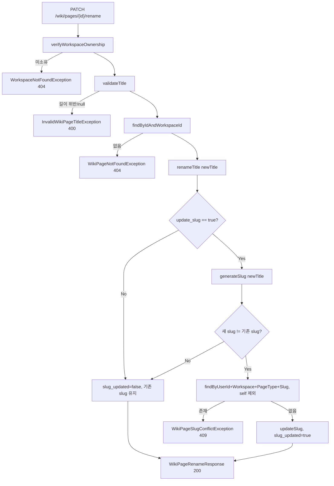
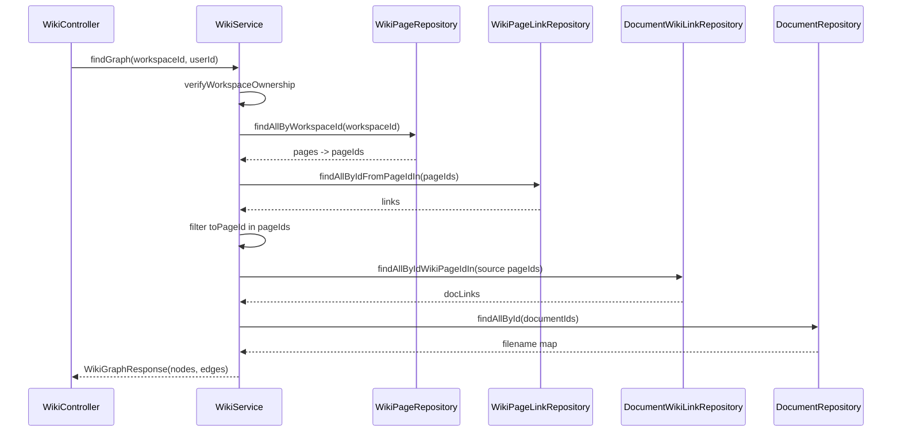

# wiki 도메인 API (재구성 스펙)

Wiki 도메인은 워크스페이스 단위의 **지식 그래프**(노드=페이지, 엣지=페이지 간 링크)를 조회하고, 개별 Wiki 페이지의 상세 정보·변경분·제목/slug 변경을 담당한다. 인증·예외 매핑·에러 응답 포맷 등 공통 규약은 [`00-common.md`](./00-common.md)를 전제로 하며 여기서 반복하지 않는다.

- Controller: `src/main/java/fruition/wiki/controller/WikiController.java`
- Service: `src/main/java/fruition/wiki/service/WikiService.java` (도메인 서비스는 이 1개)
- Domain(엔티티/enum): `WikiPage.java`, `WikiPageLink.java`, `WikiPageLinkId.java`, `DocumentWikiLink.java`, `DocumentWikiLinkId.java`, `WikiPageType.java`, `WikiPageStatus.java`, `DocumentWikiRelationType.java`, `WikiPageVersion.java`, `WikiPageVersionId.java`, `WikiPageContribution.java` (`src/main/java/fruition/wiki/domain/`)
- DTO: `WikiGraphResponse.java`, `WikiGraphNode.java`, `WikiGraphEdge.java`, `WikiPageDetailResponse.java`, `WikiPageSourceDoc.java`, `WikiRelatedPage.java`, `WikiPageRenameRequest.java`, `WikiPageRenameResponse.java`, `WikiPageDiffResponse.java` (`src/main/java/fruition/wiki/dto/`)
- Repository: `WikiPageRepository.java`, `WikiPageLinkRepository.java`, `DocumentWikiLinkRepository.java`, `WikiPageVersionRepository.java`, `WikiPageContributionRepository.java` (`src/main/java/fruition/wiki/repository/`)
- Exception: `WikiPageNotFoundException.java`, `InvalidWikiPageTitleException.java`, `WikiPageSlugConflictException.java`, `WikiPageVersionNotFoundException.java` (`src/main/java/fruition/wiki/exception/`)

> **본문 이력과 복구.** `wiki_page_versions`·`wiki_page_contributions` 테이블은 엔티티만 이 도메인에 두고, 쓰기와 복구 판정은 전부 AI 작업 로그 도메인이 담당한다. 두 테이블의 컬럼별 설계 이유와 복구 규칙은 [`ai-operation-log.md`](./ai-operation-log.md)에 있다. 여기서는 이 도메인이 읽는 범위만 다룬다.

---

## 데이터 모델

### `wiki_pages` (엔티티 `WikiPage`)

Wiki 그래프의 노드. 문서에서 추출된 개념 페이지(`concept`)와 원본 문서를 대표하는 페이지(`source`)를 모두 담는다.

| 컬럼 | 타입/제약 | 비고 |
|---|---|---|
| `id` | PK, String | ID 형식은 서비스 외부(파이프라인/Chat export)에서 생성. 코드 예시상 `wp_...` prefix |
| `page_type` | enum(STRING), NOT NULL | `WikiPageType` = `source` \| `concept` |
| `title` | String, NOT NULL | 표시 제목 |
| `slug` | String, NOT NULL | URL 식별자. 아래 UNIQUE 제약 참여 |
| `summary` | TEXT, nullable | 요약(그래프/상세에 노출) |
| `markdown_uri` | String, nullable | 본문 markdown의 스토리지 URI (`s3://<bucket>/<object>` 형식) |
| `user_id` | String, NOT NULL | 소유자. slug 유니크 범위에 포함 |
| `workspace_id` | String, NOT NULL | 소속 워크스페이스 |
| `status` | enum(STRING), NOT NULL | `WikiPageStatus` = `draft` \| `active` \| `failed` \| `deleted`. 생성 시 `draft`. CHECK 제약은 `V17__add_wiki_page_deleted_status.sql` |
| `created_at` | Instant, NOT NULL, updatable=false | |
| `updated_at` | Instant, NOT NULL | rename/updateSlug/updateContent/activate/markFailed 시 갱신 |

- **UNIQUE 제약** `uq_wiki_pages_workspace_type_slug`: `(user_id, workspace_id, page_type, slug)`. 즉 slug 유일성은 **워크스페이스 + 페이지 타입 + 소유자 범위** 안에서만 보장된다(전역 유일이 아님).
- 상태 전이 메서드: `activate()`→`active`, `markFailed()`→`failed`, `updateContent(title,summary,markdownUri)`, `renameTitle(title)`, `updateSlug(slug)`.
- 복구가 쓰는 메서드(호출자는 AI 작업 로그 도메인):
  - `softDelete(Instant)` → `deleted`. **하드 삭제하지 않는다.** 지우면 `wiki_page_versions`·`wiki_page_contributions`가 CASCADE로 사라져 되살릴 수 없다.
  - `moveMarkdownUri(String, Instant)` — 현재 본문을 가리키는 포인터만 옮긴다. Backend가 검증하고 revision으로 채택한 뒤에만 호출하며, llmPipeline은 이 값을 갱신하지 않는다.
- `WikiPageRepository.findByIdForUpdate(id)`는 `@Lock(PESSIMISTIC_WRITE)`다. 복구가 여러 페이지를 만질 때 `page_id` 오름차순으로 잠가 교착을 피한다.

### `wiki_page_links` (엔티티 `WikiPageLink`)

Wiki 페이지 간 방향 링크(그래프 엣지).

| 컬럼 | 타입/제약 | 비고 |
|---|---|---|
| `from_page_id` | 복합 PK, NOT NULL | `WikiPageLinkId`의 일부. 출발 페이지 |
| `to_page_id` | 복합 PK, NOT NULL | 도착 페이지 |
| `link_type` | 복합 PK, NOT NULL | 링크 종류 문자열(자유 문자열, enum 아님) |
| `label` | String, nullable | 엣지 라벨 |
| `confidence` | Double, nullable | 신뢰도. 응답 시 null이면 `0.0`으로 치환 |
| `created_at` | Instant, NOT NULL, updatable=false | |
| `updated_at` | Instant, NOT NULL | |

- PK가 `(from_page_id, to_page_id, link_type)` 복합키(`@EmbeddedId`)이므로 동일 두 페이지 사이라도 `link_type`이 다르면 별도 엣지.
- **workspace 컬럼이 없다.** 그래프 조회 시 워크스페이스 범위는 애플리케이션 레벨에서 page id 집합으로 필터링한다(아래 정합성 참조).

### `document_wiki_links` (엔티티 `DocumentWikiLink`)

문서와 Wiki 페이지의 연결(출처 관계).

| 컬럼 | 타입/제약 | 비고 |
|---|---|---|
| `document_id` | 복합 PK, NOT NULL | `DocumentWikiLinkId`의 일부 |
| `wiki_page_id` | 복합 PK, NOT NULL | |
| `relation_type` | 복합 PK, enum(STRING), NOT NULL | `DocumentWikiRelationType` = `source_of` \| `extracted_concept` |
| `confidence` | Double, nullable | null이면 응답 시 `0.0` |
| `created_at` | Instant, NOT NULL, updatable=false | `updated_at` 없음 |

- PK = `(document_id, wiki_page_id, relation_type)` 복합키. 같은 문서-페이지 쌍이라도 relation_type이 다르면 별도 행.

### 본문 이력 테이블 (읽기 관점)

복구와 diff가 쓰는 두 테이블이다. 상세 스펙은 [`ai-operation-log.md` §1](./ai-operation-log.md)에 있다.

- **`wiki_page_versions`** — PK `(page_id, revision)`. `revision`은 `max+1`로 채번되며 **단조 증가라 되돌려도 줄지 않는다**. 본문(`markdown`)과 그 본문이 담긴 불변 object key(`markdown_key`)를 함께 보관하므로, 복구는 저장소에 다시 쓰지 않고 key만 재사용한다. `page_id` FK는 `ON DELETE CASCADE`.
- **`wiki_page_contributions`** — PK `(page_id, ingest_operation_id)`. 페이지를 받치는 ingest 기여 원장이며, 복구는 행을 지우지 않고 `active=false`로 끈다. `sequence_revision`이 조립 순서를 정한다.

> `wiki_page_versions.contribution_count`는 **버전이 아니다.** 그 시점 살아 있던 기여 수라 되돌리면 줄어들고 같은 값이 서로 다른 revision에 나타날 수 있다. 화면 버전으로는 `revision`을 쓰고 기여 수는 병기한다.

### 삭제 정책

- Wiki 도메인 자체에는 페이지/링크 삭제 API가 없다. 정리용 파생 쿼리만 리포지토리에 존재한다: `WikiPageLinkRepository.deleteByIdFromPageIdOrIdToPageId(...)`, `DocumentWikiLinkRepository.deleteByIdDocumentId(...)`, `DocumentWikiLinkRepository.deleteByIdWikiPageId(...)`. 이들은 다른 도메인(문서 재처리, 복구)에서 호출되며, DB 레벨 cascade 제약은 엔티티에 선언돼 있지 않다.
- **페이지 삭제는 소프트 삭제뿐이다.** 복구가 `status='deleted'`로 바꾸고 링크만 정리하며, `wiki_pages` 행과 버전·기여 이력은 남는다. 그래프·상세 조회는 `deleted`를 제외하지만 diff는 이력 조회라 계속 동작한다(아래 정합성 참조).

---

## 엔드포인트

Controller `@RequestMapping("/api/workspaces/{workspace_id}/wiki")`. 모든 엔드포인트는 `/api/workspaces/**` 패턴에 속하므로 **인증 필수**(`SecurityConfig`에서 `authenticated`). `@AuthenticationPrincipal String userId`로 호출자 식별, 서비스 진입 시 `verifyWorkspaceOwnership`으로 워크스페이스 소유(멤버십) 검증. 소유하지 않으면 `WorkspaceNotFoundException`(404).

---

### `GET /api/workspaces/{workspace_id}/wiki/graph` — Wiki 그래프 조회

- **인증**: 필요.
- **path**: `workspace_id`
- **요청 DTO**: 없음.
- **응답 200** `WikiGraphResponse`:
  - `nodes`: `WikiGraphNode[]`
    - `id`, `page_type`(=`WikiPageType.name()`), `title`, `slug`, `summary`, `status`(=`WikiPageStatus.name()`), `source_document`(nullable)
    - `source_document`: `SourceDocRef { id, filename }` — **`page_type == source`인 노드에만** 채워진다. `filename`은 문서 조회 실패 시 null.
    - `@JsonInclude(NON_NULL)`: null 필드는 응답에서 생략(특히 `source_document`).
  - `edges`: `WikiGraphEdge[]`
    - `from_page_id`, `to_page_id`, `link_type`, `label`(nullable), `confidence`(null→`0.0`)
- **에러**: 워크스페이스 미소유 → `WorkspaceNotFoundException`(404, `WORKSPACE_NOT_FOUND`). 그 외 서버 오류 500.
- **흐름**:
  1. Controller `getGraph` → `wikiService.findGraph(workspaceId, userId)`
  2. `verifyWorkspaceOwnership` (권한 검증)
  3. `wikiPageRepository.findAllByWorkspaceId(workspaceId)`로 노드 원천 조회 → page id 집합 생성
  4. `wikiPageLinkRepository.findAllByIdFromPageIdIn(pageIds)` 후 **`toPageId`도 pageIds에 포함된 링크만** 애플리케이션 필터링(양 끝점이 모두 이 워크스페이스 페이지)
  5. `buildSourceDocRefs`: `page_type == source`인 페이지 id로 `documentWikiLinkRepository.findAllByIdWikiPageIdIn` → `documentRepository.findAllById`로 filename 매핑(중복 wikiPageId는 첫 항목 유지)
  6. 노드/엣지 DTO 조립 후 `WikiGraphResponse` 반환
- `@Transactional(readOnly = true)` (클래스 기본).

---

### `GET /api/workspaces/{workspace_id}/wiki/pages/{wiki_page_id}` — Wiki 페이지 상세 조회

- **인증**: 필요.
- **path**: `workspace_id`, `wiki_page_id`
- **요청 DTO**: 없음.
- **응답 200** `WikiPageDetailResponse` (`@JsonInclude(NON_NULL)`):
  - `id`, `page_type`, `title`, `slug`, `summary`, `markdown_uri`, `markdown`(스토리지에서 읽은 본문, 실패/부재 시 null), `status`, `created_at`, `updated_at`
  - `source_documents`: `WikiPageSourceDoc[]` = `{ id, filename, source_uri, relation_type, confidence(null→0.0) }`
  - `related_pages`: `WikiRelatedPage[]` = `{ id, page_type, title, slug, link_type, label, confidence(null→0.0) }`
- **에러**:
  | 예외 | status | code |
  |---|---|---|
  | `WorkspaceNotFoundException` | 404 | `WORKSPACE_NOT_FOUND` |
  | `WikiPageNotFoundException` | 404 | `WIKI_PAGE_NOT_FOUND` |
- **흐름**:
  1. Controller `getPage` → `wikiService.findById(workspaceId, userId, wikiPageId)`
  2. `verifyWorkspaceOwnership`
  3. `wikiPageRepository.findByIdAndWorkspaceId(id, workspaceId)` → 없으면 `WikiPageNotFoundException`
  4. `buildSourceDocs(id)`: `documentWikiLinkRepository.findAllByIdWikiPageId` → `documentRepository.findAllById`로 filename/source_uri 매핑
  5. `buildRelatedPages(id)`: `wikiPageLinkRepository.findAllByIdFromPageId`(**출발점이 이 페이지인 아웃링크만**) → 대상 페이지 `findAllById`로 제목/slug/타입 매핑
  6. `readMarkdown(markdownUri)`: `markdown_uri`를 object name으로 정규화 후 MinIO(`storageProperties.getBucket()`)에서 본문 읽기. 예외 시 조용히 null 반환(엔드포인트는 실패하지 않음)
- `@Transactional(readOnly = true)`.

> `markdown_uri` 정규화(`normalizeObjectName`): `s3://<bucket>/` prefix면 그 뒤 object key, 다른 `s3://...`면 host 다음 `/` 이후, 아니면 원문 그대로 사용.

---

### `GET /api/workspaces/{workspace_id}/wiki/pages/{wiki_page_id}/diff` — Wiki 페이지 변경분 조회

두 revision 사이의 diff를 반환한다. **저장된 본문을 읽어 요청 시점에 계산한다.** AI 작업 로그 상세가 보여주는 `additions`/`deletions`는 저장 시점 계산값이고, 사용자가 항목을 펼칠 때만 이 엔드포인트로 실제 변경 내용을 가져간다.

- **인증**: 필요.
- **path**: `workspace_id`, `wiki_page_id`
- **query**: `from`(long, 필수), `to`(long, 필수) — 비교할 두 revision
- **응답 200** `WikiPageDiffResponse`:
  - `page_id`, `from_revision`, `to_revision`, `additions`, `deletions`
  - `hunks`: `Hunk[]` = `{ old_start, old_lines, new_start, new_lines, lines[] }` — **문서 diff(`/api/documents/{id}/diff`)와 같은 구조**다. 계산기(`MarkdownDiffService.diff`)를 공유하고 응답 타입만 다르다
- **에러**:
  | 예외 | status | code |
  |---|---|---|
  | `WorkspaceNotFoundException` | 404 | `WORKSPACE_NOT_FOUND` |
  | `WikiPageNotFoundException` | 404 | `WIKI_PAGE_NOT_FOUND` |
  | `WikiPageVersionNotFoundException` | 404 | `WIKI_PAGE_VERSION_NOT_FOUND` |
  | `MarkdownDiffTooLargeException` | 422 | `MARKDOWN_DIFF_TOO_LARGE` |
- **흐름**:
  1. Controller `diff` → `wikiService.diff(workspaceId, userId, wikiPageId, from, to)`
  2. `verifyWorkspaceOwnership`
  3. `wikiPageRepository.findById(pageId)` → 없으면 `WikiPageNotFoundException`. **다른 워크스페이스 페이지면 존재를 알리지 않고 같은 404**를 던진다
  4. `loadVersion(pageId, from)`, `loadVersion(pageId, to)` — `WikiPageVersionRepository.findById(new WikiPageVersionId(...))`. 없으면 `WikiPageVersionNotFoundException`
  5. `markdownDiffService.diff(from, beforeMarkdown, to, afterMarkdown)` → `WikiPageDiffResponse.from(...)`
- `@Transactional(readOnly = true)`.

> ⚠️ **크기 가드**: Myers diff가 잡을 frontier 배열 2개의 크기가 16MB(`MAX_TRACE_BYTES`)를 넘으면 계산하지 않고 `MarkdownDiffTooLargeException`(422)을 던진다. 두 본문이 서로 완전히 다를 때 메모리가 폭발하는 것을 막는다. 이 가드는 문서 diff와 공유한다.
>
> 본문은 **`wiki_page_versions.markdown`(RDS)에서 읽는다.** 상세 조회의 `markdown`이 MinIO 실시간 조회인 것과 다르다. 그래서 스토리지 장애와 무관하게 동작하고, 부재 시 null이 아니라 404다.

---

### `PATCH /api/workspaces/{workspace_id}/wiki/pages/{wiki_page_id}/rename` — Wiki 페이지 이름 변경

- **인증**: 필요.
- **path**: `workspace_id`, `wiki_page_id`
- **요청 DTO** `WikiPageRenameRequest`:
  | 필드 | 타입 | 검증 |
  |---|---|---|
  | `title` | String | 서비스 `validateTitle`: null 불가, `trim()` 후 1자 이상 255자 이하. 위반 시 `InvalidWikiPageTitleException` |
  | `update_slug` | Boolean(nullable) | null/false면 slug 미변경. `Boolean.TRUE.equals(...)`로 판정 |
  > Bean Validation 애노테이션은 없고 서비스 레벨에서 수동 검증한다.
- **응답 200** `WikiPageRenameResponse`:
  - `id`, `page_type`, `title`(변경 후), `previous_title`, `slug`(현재), `previous_slug`, `slug_updated`(boolean), `updated_at`
- **에러**:
  | 예외 | status | code |
  |---|---|---|
  | `InvalidWikiPageTitleException` | 400 | `INVALID_WIKI_PAGE_TITLE` |
  | `WorkspaceNotFoundException` | 404 | `WORKSPACE_NOT_FOUND` |
  | `WikiPageNotFoundException` | 404 | `WIKI_PAGE_NOT_FOUND` |
  | `WikiPageSlugConflictException` | 409 | `WIKI_PAGE_SLUG_CONFLICT` |
- **흐름** (`@Transactional`, 쓰기 트랜잭션):
  1. Controller `rename` → `wikiService.rename(...)`
  2. `verifyWorkspaceOwnership` (권한 검증) → `validateTitle(request.title())`
  3. `wikiPageRepository.findByIdAndWorkspaceId` → 없으면 `WikiPageNotFoundException`
  4. `previousTitle`/`previousSlug` 보관, `newTitle = title.trim()`
  5. `page.renameTitle(newTitle)` (제목은 항상 변경, `updated_at` 갱신)
  6. `update_slug == true`이면:
     - `generateSlug(newTitle)`로 새 slug 계산
     - **새 slug가 기존과 같으면** 아무 것도 안 함(`slug_updated=false`)
     - 다르면 `findByUserIdAndWorkspaceIdAndPageTypeAndSlug(userId, workspaceId, pageType, newSlug)`로 충돌 검사. **자기 자신(id 동일)은 제외**. 다른 페이지가 이미 그 slug를 쓰면 `WikiPageSlugConflictException`(409)
     - 충돌 없으면 `page.updateSlug(newSlug)`, `slug_updated=true`
  7. 트랜잭션 커밋 시 dirty checking으로 flush(별도 `save` 호출 없음). 응답 DTO 조립.

---

## 정합성 · 주의점

- **concept vs source 페이지**: 두 타입 모두 `wiki_pages`에 저장되고 그래프 노드로 나온다. `source_document`(그래프 노드의 문서 참조)와 상세의 문서 매핑은 `page_type == source`를 중심으로 채워진다. 단 상세의 `source_documents`는 페이지 타입과 무관하게 `document_wiki_links`에 있는 모든 링크를 반환하므로, concept 페이지도 `extracted_concept` 관계로 문서와 연결될 수 있다.
- **slug 유일성 범위**: UNIQUE 제약과 rename 충돌 검사 모두 `(user_id, workspace_id, page_type, slug)` 기준이다. 따라서 같은 slug라도 `page_type`이 `source`/`concept`로 다르거나 워크스페이스가 다르면 공존 가능. rename의 충돌 검사는 대상 페이지 자신의 `page.getPageType()`을 사용하므로 타입 간 교차 충돌은 검사하지 않는다.
- **slug 재생성 규칙** (`generateSlug`): `trim()` → 소문자화(`Locale.ROOT`) → 공백을 `-`로 → `[a-z0-9가-힣-]` 외 문자 제거(**한글 보존**) → 연속 `-` 축약 → 앞뒤 `-` 제거. 이 규칙상 특수문자만으로 이루어진 제목은 빈 slug가 될 수 있는데, 빈 slug에 대한 별도 검증은 없다.
- **rename 규칙 요약**: title은 요청이 유효하면 항상 반영. slug는 `update_slug=true`이고 새 slug가 기존과 실제로 다를 때만 변경·충돌검사한다(`update_slug=false`면 제목만 바뀌고 slug/URL은 유지).
- **그래프 구성 방식**: `wiki_page_links`에 workspace 컬럼이 없어, 워크스페이스 경계는 "해당 워크스페이스 페이지 id 집합에 **양 끝점이 모두 포함**되는 링크"로 애플리케이션에서 필터링한다. 한쪽 끝이 다른 워크스페이스/삭제된 페이지를 가리키는 링크는 그래프에서 제외된다.
- **DB 조인 없이 in-memory 매핑**: filename/source_uri/related title 등은 별도 `findAllById` 조회 후 Map 조인이라, 참조 대상이 없으면 해당 필드만 null(엔드포인트는 성공). `buildSourceDocRefs`는 동일 wikiPageId가 여러 문서 링크를 가질 때 첫 항목만 남긴다(`(a,b)->a`).
- **confidence 정규화**: 모든 응답에서 `confidence`가 null이면 `0.0`으로 치환해 내려준다.
- **markdown 본문**: 상세 조회 시 MinIO에서 실시간으로 읽는다. 스토리지 오류/부재는 예외를 삼키고 `markdown=null`로 응답한다(500 아님). `markdown_uri`는 그대로 노출된다. 반면 diff는 `wiki_page_versions.markdown`(RDS)에서 읽으므로 스토리지와 무관하다.
- **`deleted` 페이지는 조회에서 제외된다**: 그래프는 `findAllByWorkspaceIdAndStatusNot(workspaceId, deleted)`, 상세는 `findByIdAndWorkspaceIdAndStatusNot(id, workspaceId, deleted)`을 쓴다. 삭제된 페이지의 상세는 404다. 그래프 간선은 page id 집합 기준으로 걸러지므로 삭제된 페이지로 가는 링크도 자동으로 빠진다. 상세의 `related_pages`도 삭제된 대상 링크를 뺀다 — 복구가 링크를 정리하지만 그 전에 조회가 들어올 수 있다. **단 대상 자체가 존재하지 않는 링크는 기존대로 남겨 필드만 null로 내려간다**(삭제와 부재는 다르다).
- **diff는 삭제된 페이지에도 동작한다**: `diff`는 `findById`만 쓰고 `status`를 보지 않는다. 그래프·상세가 "현재 상태"를 보여주는 것과 달리 diff는 이력 조회이므로, 삭제된 페이지의 과거 revision 사이 변경분은 계속 볼 수 있다.
- **본문 쓰기 주체**: `wiki_pages.markdown_uri`가 가리키는 object는 llmPipeline만 쓰며 작업마다 새 key를 만들고 덮어쓰지 않는다. Backend는 콜백이 준 key를 검증하고 읽은 뒤 `moveMarkdownUri`로 포인터만 옮긴다. 이 도메인의 어떤 엔드포인트도 본문을 쓰지 않는다.

---

## 시각화

### rename + slug 충돌 처리 흐름

### graph 조회 데이터 구성 흐름

> 컨트롤러 실제 base path는 `/api/workspaces/{workspace_id}/wiki`다. 예외→HTTP 매핑은 [`00-common.md`](./00-common.md)의 전역 핸들러 표와 일치한다.
