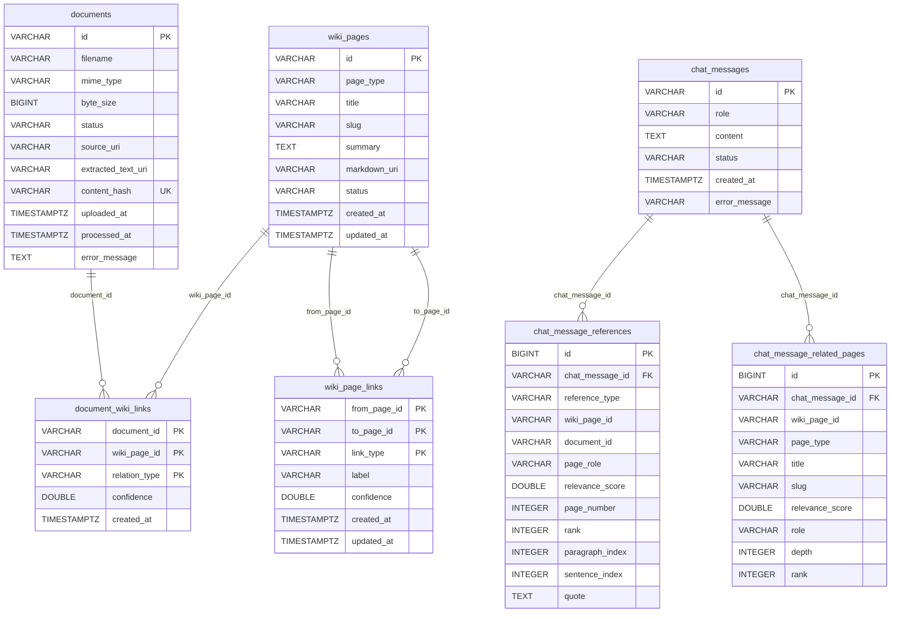

# Backend ERD

## 다이어그램

---

## 테이블 상세

### documents

원본 문서(PDF, Markdown) 업로드 정보를 저장한다.

| 컬럼 | 타입 | 제약 | 설명 |
| --- | --- | --- | --- |
| `id` | VARCHAR | PK | 업로드 시 생성하는 UUID 기반 식별자 |
| `filename` | VARCHAR | NOT NULL | 원본 파일명 |
| `mime_type` | VARCHAR | NOT NULL | `application/pdf`, `text/markdown` 등 |
| `byte_size` | BIGINT | NOT NULL | 파일 크기 (bytes) |
| `status` | VARCHAR | NOT NULL | 처리 상태 → enum 참고 |
| `source_uri` | VARCHAR | NOT NULL | MinIO 저장 경로 (`sources/documents/{id}/original`) |
| `extracted_text_uri` | VARCHAR | NULL 허용 | 텍스트 추출 완료 시 MinIO 경로 |
| `content_hash` | VARCHAR | NOT NULL, UNIQUE | SHA-256 해시 (중복 업로드 방지) |
| `uploaded_at` | TIMESTAMPTZ | NOT NULL | 업로드 시각 |
| `processed_at` | TIMESTAMPTZ | NULL 허용 | pipeline 처리 완료 시각 |
| `error_message` | TEXT | NULL 허용 | 처리 실패 사유 |

---

### wiki_pages

AI pipeline이 생성하는 Wiki 페이지 (source / concept 타입).

| 컬럼 | 타입 | 제약 | 설명 |
| --- | --- | --- | --- |
| `id` | VARCHAR | PK | pipeline이 할당하는 식별자 (`source:xxx`, `concept:xxx`) |
| `page_type` | VARCHAR | NOT NULL | `source` 또는 `concept` → enum 참고 |
| `title` | VARCHAR | NOT NULL | 페이지 제목 |
| `slug` | VARCHAR | NOT NULL | URL용 슬러그 |
| `summary` | TEXT | NULL 허용 | 페이지 요약 |
| `markdown_uri` | VARCHAR | NULL 허용 | MinIO 마크다운 본문 경로 |
| `status` | VARCHAR | NOT NULL | 생성 상태 → enum 참고 |
| `created_at` | TIMESTAMPTZ | NOT NULL | 생성 시각 (수정 불가) |
| `updated_at` | TIMESTAMPTZ | NOT NULL | 최종 수정 시각 |

**유니크 제약**: `(page_type, slug)` — `uq_wiki_pages_type_slug`

---

### document_wiki_links

문서와 Wiki 페이지 간 연결 관계. 복합 PK.

| 컬럼 | 타입 | 제약 | 설명 |
| --- | --- | --- | --- |
| `document_id` | VARCHAR | PK, FK → documents.id | 원본 문서 |
| `wiki_page_id` | VARCHAR | PK, FK → wiki_pages.id | 연결된 Wiki 페이지 |
| `relation_type` | VARCHAR | PK | 관계 유형 → enum 참고 |
| `confidence` | DOUBLE | NULL 허용 | 연결 신뢰도 (0~1) |
| `created_at` | TIMESTAMPTZ | NOT NULL | 연결 생성 시각 |

**복합 PK**: `(document_id, wiki_page_id, relation_type)`

---

### wiki_page_links

Wiki 페이지 간 방향성 있는 링크. 복합 PK.

| 컬럼 | 타입 | 제약 | 설명 |
| --- | --- | --- | --- |
| `from_page_id` | VARCHAR | PK, FK → wiki_pages.id | 출발 페이지 |
| `to_page_id` | VARCHAR | PK, FK → wiki_pages.id | 도착 페이지 |
| `link_type` | VARCHAR | PK | 링크 유형 (e.g. `source_mentions_concept`) |
| `label` | VARCHAR | NULL 허용 | 링크 레이블 (e.g. `mentions`) |
| `confidence` | DOUBLE | NULL 허용 | 링크 신뢰도 (0~1) |
| `created_at` | TIMESTAMPTZ | NOT NULL | 링크 생성 시각 |
| `updated_at` | TIMESTAMPTZ | NOT NULL | 최종 수정 시각 |

**복합 PK**: `(from_page_id, to_page_id, link_type)`

---

### chat_messages

질의응답 대화 메시지. `POST /api/query` 호출 시 user/assistant 쌍으로 저장된다.

| 컬럼 | 타입 | 제약 | 설명 |
| --- | --- | --- | --- |
| `id` | VARCHAR | PK | `chat_user_<uuid>` 또는 `chat_assistant_<uuid>` |
| `role` | VARCHAR | NOT NULL | `user` 또는 `assistant` |
| `content` | TEXT | NOT NULL | 메시지 본문 |
| `status` | VARCHAR | NOT NULL | `completed` 또는 `failed` |
| `created_at` | TIMESTAMPTZ | NOT NULL | 메시지 생성 시각 |
| `error_message` | VARCHAR(255) | NULL 허용 | 메시지 생성 시 발생한 오류 내용 |

---

### chat_message_references

assistant 메시지의 근거 스니펫(evidence_snippets) 저장. pipeline 응답의 `evidence_snippets` 중 `page_id`가 있는 항목만 저장된다.

| 컬럼 | 타입 | 제약 | 설명 |
| --- | --- | --- | --- |
| `id` | BIGINT | PK, AUTO_INCREMENT | 자동 생성 식별자 |
| `chat_message_id` | VARCHAR | NOT NULL, FK → chat_messages.id | 연결된 assistant 메시지 |
| `reference_type` | VARCHAR | NOT NULL | `source` 또는 `concept` (pipeline `page_type`) |
| `wiki_page_id` | VARCHAR | NULL 허용 | 참조 Wiki 페이지 ID |
| `document_id` | VARCHAR | NULL 허용 | 참조 원본 문서 ID (현재 미사용) |
| `page_role` | VARCHAR | NULL 허용 | pipeline `page_role` (e.g. `seed_source`, `focus_concept`) |
| `relevance_score` | DOUBLE | NULL 허용 | 관련성 점수 (pipeline `score`) |
| `page_number` | INTEGER | NULL 허용 | 페이지 번호 (현재 미사용) |
| `rank` | INTEGER | NULL 허용 | 답변 내 인용 순위 ([1], [2], ...) |
| `paragraph_index` | INTEGER | NULL 허용 | 단락 인덱스 |
| `sentence_index` | INTEGER | NULL 허용 | 문장 인덱스 |
| `quote` | TEXT | NULL 허용 | 인용 텍스트 (pipeline `text`) |

---

### chat_message_related_pages

assistant 메시지와 연결된 탐색된 Wiki 페이지 목록. pipeline 응답의 `related_pages`를 저장한다.

| 컬럼 | 타입 | 제약 | 설명 |
| --- | --- | --- | --- |
| `id` | BIGINT | PK, AUTO_INCREMENT | 자동 생성 식별자 |
| `chat_message_id` | VARCHAR | NOT NULL, FK → chat_messages.id | 연결된 assistant 메시지 |
| `wiki_page_id` | VARCHAR | NULL 허용 | 탐색된 Wiki 페이지 ID |
| `page_type` | VARCHAR | NULL 허용 | `source` 또는 `concept` |
| `title` | VARCHAR | NULL 허용 | 페이지 제목 |
| `slug` | VARCHAR | NULL 허용 | URL용 슬러그 |
| `relevance_score` | DOUBLE | NULL 허용 | 관련성 점수 |
| `role` | VARCHAR | NULL 허용 | pipeline `role` (e.g. `seed_source`, `focus_concept`) |
| `depth` | INTEGER | NULL 허용 | 그래프 탐색 깊이 (0 = 시드 노드) |
| `rank` | INTEGER | NULL 허용 | 목록 내 순위 (1부터 시작) |

`wiki_page_id`는 논리적 참조이며, DB 레벨 FK 제약은 없다.

---

## Enum 허용값

### documents.status

| 값 | 설명 |
| --- | --- |
| `uploaded` | 업로드 완료, 처리 대기 |
| `processing` | pipeline 처리 중 |
| `completed` | 처리 완료 |
| `failed` | 처리 실패 |

### wiki_pages.page_type

| 값 | 설명 |
| --- | --- |
| `source` | 원본 문서에서 추출된 페이지 |
| `concept` | AI가 추출한 개념 페이지 |

### wiki_pages.status

| 값 | 설명 |
| --- | --- |
| `draft` | 생성 중 |
| `active` | 활성 (pipeline 처리 완료) |
| `failed` | 생성 실패 |

### document_wiki_links.relation_type

| 값 | 설명 |
| --- | --- |
| `source_of` | 문서가 Wiki source 페이지의 원본 |
| `extracted_concept` | 문서에서 개념이 추출됨 |

---

## 관계 요약

| 관계 | 설명 |
| --- | --- |
| `documents` → `document_wiki_links` | 1:N, 하나의 문서가 여러 Wiki 페이지와 연결 가능 |
| `wiki_pages` → `document_wiki_links` | 1:N, 하나의 Wiki 페이지가 여러 문서와 연결 가능 |
| `wiki_pages` → `wiki_page_links` (from) | 1:N, 하나의 페이지에서 여러 페이지로 링크 |
| `wiki_pages` → `wiki_page_links` (to) | 1:N, 하나의 페이지가 여러 링크의 대상 |
| `chat_messages` → `chat_message_references` | 1:N, 하나의 assistant 메시지가 여러 근거 참조 보유 |
| `chat_messages` → `chat_message_related_pages` | 1:N, 하나의 assistant 메시지가 여러 탐색 Wiki 페이지 보유 |

`chat_message_references.wiki_page_id` / `document_id` 및 `chat_message_related_pages.wiki_page_id`는 논리적 참조이며, DB 레벨 FK 제약은 없다.
