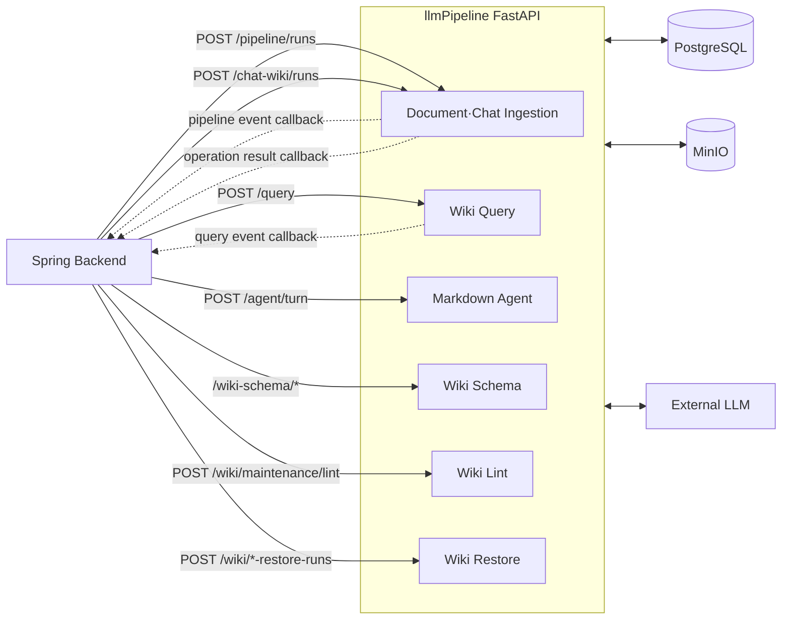
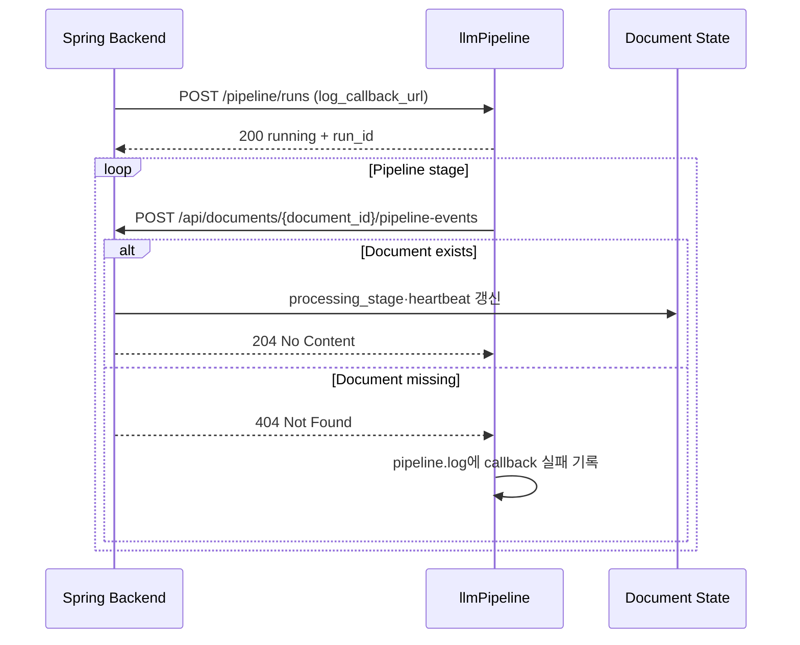
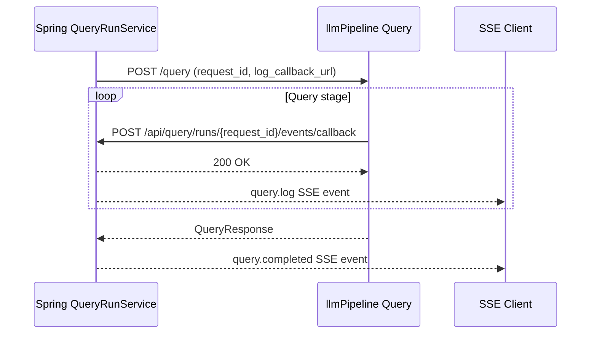
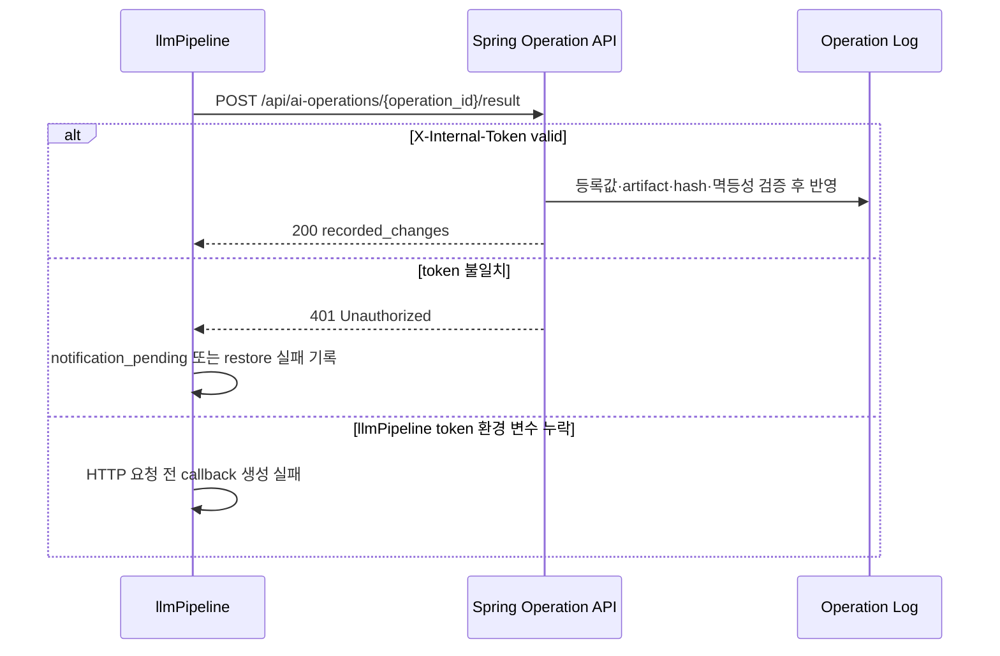

# llmPipeline ↔ Spring Backend API 계약

## 1. 문서 목적

이 문서는 **Spring Backend와 llmPipeline 사이에서 현재 실제로 호출되는 HTTP API 계약**을 정리한다.

- 기준일: 2026-08-05
- Source of truth: Spring requester/controller와 llmPipeline FastAPI route/Pydantic schema
- 문서와 코드가 다르면 현재 코드를 우선한다.

다음 정보를 API별로 같은 순서에서 제공한다.

1. Method + Path
2. 목적
3. Auth 필요 여부
4. Request body
5. Response body
6. Error response
7. Pagination / filtering
8. 권한 규칙
9. 예시 요청 / 응답

다이어그램은 사용자 여정을 기준으로 작은 흐름만 보여주고, 세부 JSON 계약은 각 API 섹션에서 설명한다. 이 구성은 API diagram에 endpoint, request/response flow, authentication, data structure, dependency, status/error를 포함하고 한 다이어그램에 너무 많은 개념을 넣지 말라는 [Postman API Diagram Guide](https://blog.postman.com/api-diagram-guide/)의 원칙을 따른다.

성공 응답의 더 상세한 field 설명은 [llmpipeline-backend-output-contract.md](./llmpipeline-backend-output-contract.md)를 부록으로 참조한다. 단, 해당 부록에는 Spring이 현재 호출하지 않는 llmPipeline 내부 API도 포함되므로 **현재 연결 여부는 이 문서를 우선**한다.

## 2. 범위와 연결 현황

### 2.1 전체 Integration Diagram



### 2.2 Backend → llmPipeline API 목록

| 상태 | Method | Path | Spring 호출자 |
| --- | --- | --- | --- |
| 연결됨 | `POST` | `/pipeline/runs` | `DocumentProcessingRequester` |
| 연결됨 | `POST` | `/chat-wiki/runs` | `DocumentProcessingRequester` |
| 연결됨 | `POST` | `/query` | `PipelineQueryRequester` |
| 부분 연결 | `POST` | `/agent/turn` | `PipelineAgentRequester` |
| 연결됨 | `POST` | `/wiki-schema/preview` | `PipelineWikiSchemaRequester` |
| 연결됨 | `POST` | `/wiki-schema/drafts` | `PipelineWikiSchemaRequester` |
| 연결됨 | `POST` | `/wiki-schema/{schema_id}/activate` | `PipelineWikiSchemaRequester` |
| 연결됨 | `GET` | `/wiki-schema/active` | `PipelineWikiSchemaRequester` |
| 연결됨 | `POST` | `/wiki/maintenance/lint` | `PipelineWikiMaintenanceRequester` |
| 연결됨 | `POST` | `/wiki/ingest-restore-runs` | `PipelineRestoreRequester` |
| 연결됨 | `POST` | `/wiki/lint-restore-runs` | `PipelineRestoreRequester` |
| 계약 불일치 | `PATCH` | `/wiki/pages/{wiki_page_id}/rename` | `PipelineWikiPageRequester` |

`PATCH /wiki/pages/{wiki_page_id}/rename`은 Spring에 호출 코드가 있지만 llmPipeline에 FastAPI route가 없다. 따라서 현재 사용 가능한 API가 아니며, 제6장에 계약 공백으로 기록한다.

### 2.3 llmPipeline → Backend Callback 목록

| 상태 | Method | Path | llmPipeline 호출자 |
| --- | --- | --- | --- |
| 연결됨 | `POST` | `/api/documents/{document_id}/pipeline-events` | `PipelineLog` |
| 연결됨 | `POST` | `/api/query/runs/{request_id}/events/callback` | `HttpQueryEventPublisher` |
| 연결됨 | `POST` | `/api/ai-operations/{operation_id}/result` | `HttpPipelineResultNotifier` |
| Backend route 없음 | `POST` | `/internal/agent/tools/read/{tool_name}` | `BackendToolGateway` |
| Backend route 없음 | `POST` | `/internal/agent/tools/execute/{tool_name}` | `BackendToolGateway` |

### 2.4 범위에서 제외한 llmPipeline API

다음 API는 llmPipeline에 구현되어 있지만 현재 Spring Backend가 호출하지 않으므로 본 계약의 API별 상세 범위에서 제외한다.

- `POST /pipeline/reingest-runs`
- `GET /pipeline/runs/{run_id}`
- `GET /pipeline/runs/{run_id}/logs`
- `POST /pipeline/runs/{run_id}/result-callback/retry`
- `/skills/*`
- `/agent/runs/*`
- `GET /documents/{document_id}`
- `GET /health`

## 3. 공통 계약

### 3.1 Base URL과 Content-Type

| 항목 | 현재 값 |
| --- | --- |
| llmPipeline 기본 Base URL | `http://localhost:8000` |
| Request Content-Type | `application/json` |
| Response Content-Type | 기본 `application/json` |
| 문자 인코딩 | UTF-8 |

### 3.2 Auth 현황

| API | llmPipeline Auth | Spring 헤더 | 현재 판정 |
| --- | --- | --- | --- |
| Ingestion, Query, Schema, Lint, Restore | `X-Internal-Token` 필수 | **현재 미전송** | Spring 호출이 `401`로 실패 |
| `/agent/turn` + `AGENT_SKILLS_ENABLED=false` | `X-Internal-Token` 필수 | **현재 미전송** | Spring 호출이 `401`로 실패 |
| `/agent/turn` + `AGENT_SKILLS_ENABLED=true` | `X-Internal-Token`, `X-Agent-Service-Token` 필수 | **둘 다 현재 미전송** | Spring 호출이 `401` 또는 `503`으로 실패 |
| 진행·Query callback | llmPipeline이 `X-Internal-Token` 전송 | Spring 검증 없음 | 헤더를 보내지만 아직 인증 경계로 사용하지 않음 |
| Operation result callback | Spring `X-Internal-Token` 필수 | llmPipeline이 `INTERNAL_CALLBACK_TOKEN` 전송 | 양쪽 설정값이 같을 때 연결됨 |
| Agent Tool Gateway | Spring route 없음 | llmPipeline이 `X-Agent-Service-Token` 전송 | 현재 `404`로 실패 |

Auth 항목은 현재 코드를 기술한 것이며, 보안상 권장 상태를 뜻하지 않는다.

### 3.3 공통 Error Shape

FastAPI route가 명시적으로 반환하는 오류는 보통 다음 형태다.

```json
{
  "detail": "Document not found"
}
```

Pydantic request validation 실패는 `422 Unprocessable Entity`와 배열 형태 `detail`을 반환한다.

```json
{
  "detail": [
    {
      "type": "missing",
      "loc": ["body", "document_id"],
      "msg": "Field required",
      "input": {}
    }
  ]
}
```

Agent의 출력 계약 실패는 코드화된 object를 `detail`에 넣는다.

```json
{
  "detail": {
    "code": "markdown_output_contract_failed",
    "message": "Markdown 편집 결과가 문법 및 보존 조건을 충족하지 못했습니다."
  }
}
```

오류 body 필드 의미:

| 필드 | 타입 | 의미 |
| --- | --- | --- |
| `detail` | string/object/array | FastAPI가 반환하는 오류 본문이다. 단순 domain 오류는 string, 코드화된 Agent 오류는 object, request validation 오류는 array다. |
| `detail.code` | string | 호출자가 오류 종류를 안정적으로 분기할 때 사용하는 machine-readable 코드다. 현재 주로 Agent 계약 오류에서 제공한다. |
| `detail.message` | string | 사용자 또는 운영 로그에 표시할 수 있는 오류 설명이다. |
| `detail[].type` | string | Pydantic validation 실패 종류다. 예: `missing`, `string_too_short`. |
| `detail[].loc` | array | 오류가 발생한 위치다. `body`, field 이름 등의 순서로 표현한다. |
| `detail[].msg` | string | validation 실패 이유다. |
| `detail[].input` | any | 검증에 실패한 입력값이다. 민감한 값이 포함될 수 있으므로 그대로 사용자 로그에 남기지 않는다. |

## 4. Backend → llmPipeline API

### 4.1 `POST /pipeline/runs`

#### 목적

Spring에 저장된 일반 Document를 Source·Concept Wiki Page로 비동기 변환한다.

#### Auth

- llmPipeline Auth: `X-Internal-Token` 필수
- Spring 전송 헤더: 현재 없음(`401`)

#### 권한 규칙

- Spring의 일반 업로드·재처리 API가 사용자 권한과 Document 상태를 검증한 뒤 처리 큐에 등록한다. 실제 llmPipeline 호출은 `DocumentProcessingWorker`가 수행하지만 현재 `X-Internal-Token`을 보내지 않아 llmPipeline에서 `401`로 거절된다.
- llmPipeline은 request의 `user_id`, `workspace_id`를 Wiki 저장 범위의 권위 값으로 사용하지 않고, `document_id`로 조회한 DB Document의 값을 사용한다.

#### Request Body

| 필드 | 타입 | 필수 | Spring 전송 | 설명 |
| --- | --- | --- | --- | --- |
| `document_id` | string | 예 | 예 | 처리할 Document ID |
| `user_id` | string | 아니오 | 예 | 호환용 필드. 실제 범위는 DB Document에서 결정 |
| `workspace_id` | string | 아니오 | 예 | 호환용 필드. 실제 범위는 DB Document에서 결정 |
| `log_callback_url` | string/null | 아니오 | 예 | 단계별 event callback URL |
| `operation_id` | string/null | 조건부 | 기능 flag 활성 시 | AI 작업 로그와 완료 결과를 연결하는 ID다. `result_callback_url`과 함께 보내야 한다. |
| `result_callback_url` | string/null | 조건부 | 기능 flag 활성 시 | 완료·실패 결과 callback URL이다. 진행 event용 `log_callback_url`과 별개다. |

Spring은 llmPipeline이 지원하는 model·prompt·evaluation 세부 설정을 전송하지 않으며 llmPipeline 기본값을 사용한다.
`app.aihistory.ingest-logging-enabled=false`가 기본값이므로 기본 설정에서는 `operation_id`와 `result_callback_url`을 보내지 않는다.

#### Response Body

| 필드 | 타입 | Spring 사용 | 설명 |
| --- | --- | --- | --- |
| `run_id` | string | 예 | Pipeline 실행 1건을 식별하는 UUID다. Spring이 Document의 현재 Pipeline Run ID로 기록한다. |
| `status` | string | 로그만 | 현재 실행 상태다. Spring requester가 응답 로그에는 남기지만 Document 상태 결정에는 사용하지 않는다. 기본 비동기 응답은 `running`이다. |
| `manifest` | object/null | 아니오 | 완료 산출물 요약이다. Spring은 `wait=false`만 사용하므로 응답 시점에는 `null`이며 Java response DTO에도 선언하지 않는다. |
| `output_dir` | string | 아니오 | llmPipeline이 실행별 artifact를 저장하는 내부 디렉터리 경로다. Java DTO로 역직렬화하지만 이후 사용하지 않는다. |
| `log_path` | string | 아니오 | llmPipeline의 local Pipeline log 파일 경로다. Java DTO로 역직렬화하지만 이후 사용하지 않는다. |

#### Error Response

| Status | 조건 | 예시 `detail` |
| --- | --- | --- |
| `404` | Document가 없음 | `Document not found` |
| `409` | PDF 등에 `extracted_text_uri`가 없음 | `Document needs extracted_text_uri ...` |
| `409` | source URI가 없음 | `Document has no source_uri or extracted_text_uri` |
| `422` | request schema 위반 | Pydantic validation detail |
| `422` | `operation_id`, `result_callback_url` 중 하나만 전송 | Pydantic model validation detail |
| `502` | MinIO 원본 읽기 실패 | `Failed to read document object from storage: ...` |
| `500` | DB run 등록 등 내부 오류 | 예외 메시지 |

Spring `DocumentProcessingRequester`는 이 오류를 세분화한 domain error로 변환하지 않고 `RuntimeException`으로 감싼다.

#### Pagination / Filtering

해당 없음.

#### 예시 요청

```http
POST /pipeline/runs HTTP/1.1
Content-Type: application/json

{
  "document_id": "doc_123",
  "user_id": "user_123",
  "workspace_id": "ws_123",
  "log_callback_url": "http://backend:8080/api/documents/doc_123/pipeline-events"
}
```

#### 예시 응답

```json
{
  "run_id": "2f5b7e8a-1c25-4a56-bf4a-7dc8b9c14e8d",
  "status": "running",
  "manifest": null,
  "output_dir": "runs/api_2f5b7e8a-1c25-4a56-bf4a-7dc8b9c14e8d",
  "log_path": "runs/api_2f5b7e8a-1c25-4a56-bf4a-7dc8b9c14e8d/pipeline.log"
}
```

### 4.2 `POST /chat-wiki/runs`

#### 목적

Chat Session에서 export한 Markdown을 Wiki Source Page로 생성하거나 기존 full Source Page에 누적한다.

#### Auth

- llmPipeline Auth: `X-Internal-Token` 필수
- Spring 전송 헤더: 현재 없음(`401`)

#### 권한 규칙

- Spring `ChatWikiExportService`는 `ChatSessionService.verifyOwnedSession(...)`으로 Session 소유 범위를 검증한다. partial 요청은 `pair_ids`가 비어 있지 않은지 확인한 뒤 일치하는 message만 선택하지만, 요청한 모든 pair ID가 실제로 존재하는지는 별도로 검증하지 않는다.
- 검증·선택된 Markdown으로 `chat_export` Document를 만들고 처리 큐에 등록한 뒤 `DocumentProcessingWorker`가 llmPipeline을 호출한다.
- llmPipeline은 `document_id`로 조회한 DB Document의 User·Workspace를 사용한다.

#### Request Body

| 필드 | 타입 | 필수 | 설명 |
| --- | --- | --- | --- |
| `document_id` | string | 예 | `chat_export` Document ID |
| `user_id` | string | 아니오 | Spring 호환용 전송 필드 |
| `workspace_id` | string | 아니오 | Spring 호환용 전송 필드 |
| `log_callback_url` | string/null | 아니오 | Document pipeline event callback URL |
| `selection_mode` | `full`/`partial` | 예 | full 누적 또는 partial 독립 Source Page |
| `input_markdown` | string/null | 아니오 | 기존 full Source Page에 추가할 신규 pair Markdown |
| `operation_id` | string/null | 조건부 | AI 작업 로그 ID다. `result_callback_url`과 함께 보내야 한다. |
| `result_callback_url` | string/null | 조건부 | 완료·실패 결과를 받을 Spring callback URL이다. |

`input_markdown`은 `selection_mode=full`이고 기존 Source Page가 있을 때만 허용된다. 그 외에는 Document의 MinIO 원본을 읽는다.
두 operation 필드는 일반 Ingestion과 동일하게 `app.aihistory.ingest-logging-enabled=true`일 때만 Spring이 전송한다.

#### Response Body

`POST /pipeline/runs`와 같은 `PipelineRunOut` 구조를 사용한다.

#### Error Response

| Status | 조건 |
| --- | --- |
| `404` | Document가 없음 |
| `409` | 처리할 source/extracted text가 없음 |
| `422` | `selection_mode` 누락·잘못된 값 |
| `422` | partial에 `input_markdown`을 전송 |
| `422` | 기존 Source Page 없이 full `input_markdown`을 전송 |
| `422` | `operation_id`, `result_callback_url` 중 하나만 전송 |
| `502` | MinIO 읽기 실패 |
| `500` | DB·Pipeline 내부 오류 |

#### Pagination / Filtering

해당 없음. `selection_mode`는 pagination/filter parameter가 아니라 Source Page 생성 모드다.

#### 예시 요청

```http
POST /chat-wiki/runs HTTP/1.1
Content-Type: application/json

{
  "document_id": "doc_chat_123",
  "user_id": "user_123",
  "workspace_id": "ws_123",
  "log_callback_url": "http://backend:8080/api/documents/doc_chat_123/pipeline-events",
  "selection_mode": "full",
  "input_markdown": "## User\n\n새 질문\n\n## Assistant\n\n새 답변"
}
```

#### 예시 응답

```json
{
  "run_id": "f3ee3040-3031-420e-bdb0-e75ac7f59875",
  "status": "running",
  "manifest": null,
  "output_dir": "runs/api_f3ee3040-3031-420e-bdb0-e75ac7f59875",
  "log_path": "runs/api_f3ee3040-3031-420e-bdb0-e75ac7f59875/pipeline.log"
}
```

### 4.3 `POST /query`

#### 목적

Workspace Wiki를 검색·탐색하고 근거가 포함된 답변을 반환한다.

#### Auth

- llmPipeline Auth: `X-Internal-Token` 필수
- Spring 전송 헤더: 현재 없음(`401`)

#### 권한 규칙

- Spring `QueryController`가 `ChatSessionService.verifyOwnedSession(workspaceId, userId, sessionId)`으로 Chat Session·Workspace·User 관계를 검증한 뒤 `QueryService` 또는 `QueryRunService`를 호출한다.
- llmPipeline은 request의 `workspace_id`를 신뢰하며 membership을 다시 검증하지 않는다.
- 현재 Spring은 `user_id`와 conversation context를 전송하지 않는다.

#### Request Body

| 필드 | 타입 | llmPipeline 필수 | Spring 전송 | 설명 |
| --- | --- | --- | --- | --- |
| `workspace_id` | string | 예 | 예 | 검색 범위 |
| `question` | string | 예 | 예 | 빈 문자열 불가 |
| `request_id` | string/null | 아니오 | 비동기 Query에서만 | Query Run ID |
| `log_callback_url` | string/null | 아니오 | 비동기 Query에서만 | 진행 event callback URL |
| `user_id` | string/null | 아니오 | 아니오 | 선택 User context |
| `recent_conversation_summary` | string/null | 아니오 | 아니오 | 대화 요약 |
| `reference_context` | object/null | 아니오 | 아니오 | 지시어·개념 context |

#### Response Body

| 필드 | 타입 | 설명 |
| --- | --- | --- |
| `answer` | string | 근거 표시가 포함된 답변 |
| `related_pages` | array | 검색·탐색한 Page |
| `evidence_snippets` | array | Source Document·Block 근거 |
| `graph_context` | object | UI highlight용 node·edge |
| `traversal_paths` | array | Graph 탐색 경로 |

`related_pages[]`와 `graph_context.nodes[]` 필드:

| 필드 | 타입 | 의미 |
| --- | --- | --- |
| `id` | string | Wiki Page의 DB 식별자다. |
| `page_type` | string | Page 종류다. 현재 주요 값은 `source`, `concept`다. |
| `title` | string | 사용자에게 표시할 Page 제목이다. |
| `slug` | string | Page를 URL이나 Wiki 내부 참조에서 식별하는 slug다. |
| `relevance_score` | number | 질문과 Page의 관련도 점수다. 높을수록 관련성이 크다. |
| `role` | string | 검색·Graph 탐색에서 Page가 맡은 역할이다. 예: `seed`, `expanded`, `evidence`. |
| `depth` | integer | 시작 Page에서 Graph edge를 몇 번 거쳐 도달했는지 나타내는 깊이다. |

`evidence_snippets[]` 필드:

| 필드 | 타입 | 의미 |
| --- | --- | --- |
| `rank` | integer | 근거 순번이다. 답변 안의 `[1]` 같은 표식과 연결된다. |
| `source_document_id` | string | 근거가 나온 대표 원본 Document ID다. |
| `source_block_ids` | string array | 답변 근거로 묶인 Source Block ID 목록이다. |
| `source_refs` | array | Document와 Block을 함께 식별하는 세부 근거 목록이다. |
| `source_refs[].source_document_id` | string | 해당 근거 Block이 속한 원본 Document ID다. |
| `source_refs[].source_block_id` | string | 원본 Document 안에서 근거 위치를 식별하는 Block ID다. |
| `text` | string | 답변 생성에 실제로 제공된 원문 또는 요약 근거다. |

`graph_context.edges[]`와 `traversal_paths[].edges[]` 필드:

| 필드 | 타입 | 의미 |
| --- | --- | --- |
| `from_page_id` | string | Graph edge의 시작 Page ID다. |
| `to_page_id` | string | Graph edge의 도착 Page ID다. |
| `link_type` | string | 두 Page 사이에 저장된 관계 종류다. |
| `role` | string | 이 edge가 탐색이나 답변 생성에서 맡은 역할이다. |
| `score` | number | edge를 탐색 경로로 선택한 관련도 점수다. |

`traversal_paths[]` 필드:

| 필드 | 타입 | 의미 |
| --- | --- | --- |
| `path_id` | string | 탐색 경로 1건의 식별자다. |
| `role` | string | 해당 경로의 용도다. 예: 답변 근거 경로 또는 후보 경로. |
| `used_for_answer` | boolean | 경로가 최종 답변 context에 실제 포함됐는지 나타낸다. |
| `score` | number | 경로 전체의 관련도 점수다. |
| `stop_reason` | string | 더 탐색하지 않고 중단한 이유다. |
| `nodes` | string array | 경로가 지나간 Page ID를 탐색 순서대로 담는다. |
| `edges` | array | 인접한 node를 연결한 edge 목록이다. 위 edge 필드 계약을 사용한다. |

#### Error Response

| Status | llmPipeline 조건 | Spring 변환 |
| --- | --- | --- |
| `400` | Query domain 규칙 위반 | `502 PIPELINE_ERROR` |
| `422` | request schema 위반 | `502 PIPELINE_ERROR` |
| `500` | retrieval·LLM·DB 오류 | `503 PIPELINE_UNAVAILABLE` |
| timeout | Spring read timeout | `503 PIPELINE_TIMEOUT` |

#### Pagination / Filtering

해당 없음. 검색 결과 개수와 Graph 탐색 한계는 llmPipeline 내부 설정이며 Spring API parameter로 노출되지 않는다.

#### 예시 요청

```http
POST /query HTTP/1.1
Content-Type: application/json

{
  "workspace_id": "ws_123",
  "question": "Wiki Ingestion은 어떤 순서로 동작해?",
  "request_id": "query_123",
  "log_callback_url": "http://backend:8080/api/query/runs/query_123/events/callback"
}
```

#### 예시 응답

```json
{
  "answer": "원본을 Source Block으로 나눈 뒤 Concept Page를 생성합니다. [1]",
  "related_pages": [
    {
      "id": "page_ingestion",
      "page_type": "concept",
      "title": "Wiki Ingestion",
      "slug": "wiki-ingestion",
      "relevance_score": 0.91,
      "role": "seed",
      "depth": 0
    }
  ],
  "evidence_snippets": [
    {
      "rank": 1,
      "source_document_id": "doc_123",
      "source_block_ids": ["B0001"],
      "source_refs": [
        {
          "source_document_id": "doc_123",
          "source_block_id": "B0001"
        }
      ],
      "text": "원본을 Source Block으로 분할한다."
    }
  ],
  "graph_context": {
    "nodes": [],
    "edges": []
  },
  "traversal_paths": []
}
```

### 4.4 `POST /agent/turn`

#### 목적

자연어 지시를 분류하고 현재 Markdown 문서의 편집안을 생성한다.

#### Auth

- `AGENT_SKILLS_ENABLED=false`: `X-Internal-Token` 필수
- `AGENT_SKILLS_ENABLED=true`: `X-Internal-Token`, `X-Agent-Service-Token` 모두 필수
- 현재 `PipelineAgentRequester`는 두 헤더를 모두 전송하지 않음

#### 권한 규칙

- Spring `AgentTurnService`가 Document membership, Markdown 형식, edit lock, `base_version`, target 범위를 먼저 검증한다.
- Spring은 llmPipeline request에 `workspace_id`, `user_id`, Document ID, base version을 전송하지 않는다.
- llmPipeline은 전달된 Markdown snapshot과 target만 편집하며 실제 Document 저장은 Spring API로 다시 수행한다.

#### Request Body

| 필드 | 타입 | llmPipeline 필수 | Spring 전송 | 설명 |
| --- | --- | --- | --- | --- |
| `message` | string | 예 | 예 | 사용자 지시 |
| `conversation_context` | object/null | 아니오 | 예 | 대화 요약·참조 context |
| `active_markdown_context` | object/null | 아니오 | 예 | Markdown snapshot과 target |
| `workspace_id` | string/null | 아니오 | 아니오 | Skill/AgentRun scope |
| `user_id` | string/null | 아니오 | 아니오 | Skill/AgentRun scope |
| `skill_mode` | `auto`/`explicit`/`off` | 아니오 | 아니오 | 기본 `auto` |
| `skill_id` | string/null | 아니오 | 아니오 | 명시적 Skill |
| `skill_draft_sources` | array | 아니오 | 아니오 | Skill 초안 생성에 사용할 Agent Run source. 기본 `[]` |
| `skill_draft_user_directives` | string array | 아니오 | 아니오 | Skill 초안에 반영할 사용자 지시. 기본 `[]` |
| `skill_draft_excluded_literals` | string array | 아니오 | 아니오 | Skill 초안에서 제외할 literal. 기본 `[]` |

`active_markdown_context.target`은 `selection`, `current_section`, `whole_document` 중 하나와 1부터 시작하는 `start_line`, `end_line`을 사용한다.

중첩 request 필드:

| 필드 | 타입 | 의미 |
| --- | --- | --- |
| `conversation_context.recent_conversation_summary` | string/null | 이전 대화를 압축한 요약이다. Agent가 현재 지시의 맥락을 해석할 때 사용한다. |
| `conversation_context.reference_context` | object/null | 사용자가 참조한 문서·개념 등 호출자가 구성한 추가 context다. |
| `active_markdown_context.markdown` | string | 편집 판단에 사용할 현재 Markdown snapshot이다. llmPipeline은 이 값을 직접 저장하지 않는다. |
| `active_markdown_context.target` | object/null | 편집 요청 범위다. 없으면 action에 따라 전체 문맥을 사용하거나 clarification을 반환할 수 있다. |
| `active_markdown_context.target.type` | string | `selection`은 선택 범위, `current_section`은 현재 section, `whole_document`는 문서 전체를 뜻한다. |
| `active_markdown_context.target.start_line` | integer | 대상 시작 line이다. 1부터 시작하며 해당 line을 포함한다. |
| `active_markdown_context.target.end_line` | integer | 대상 종료 line이다. 1부터 시작하며 해당 line을 포함한다. |
| `skill_draft_sources[].run_id` | string | Skill 초안의 근거가 되는 완료된 Agent Run ID다. |
| `skill_draft_sources[].status` | `completed` | source run이 정상 완료됐음을 나타내는 고정 상태값이다. |
| `skill_draft_sources[].request_summary` | string | source run에서 사용자가 요청한 작업의 요약이다. |
| `skill_draft_sources[].plan_summary` | string | source run이 수행한 계획의 요약이다. |
| `skill_draft_sources[].successful_operations` | array | source run에서 성공한 tool 작업 목록이다. 최소 1개가 필요하다. |
| `successful_operations[].tool_name` | string | 성공한 내부 tool 이름이다. 허용된 `ToolValue` 중 하나다. |
| `successful_operations[].reason` | string | 해당 tool 작업이 필요했던 이유다. |

#### Response Body

| 필드 | 타입 | 설명 |
| --- | --- | --- |
| `action` | string | routing 결과 |
| `route` | object | action, confidence, reason, edit goal |
| `message` | string/null | 일반 대화·clarification 메시지 |
| `chat` | object/null | Query action 결과 |
| `edit` | object/null | Markdown edit 결과 |
| `generated_markdown` | object/null | Markdown create 결과 |
| `skill_candidates` | array | Skill 후보 |
| `run_id`, `run_status` | string/null | AgentRun 시작 결과 |
| `skill_draft_proposal` | object/null | Skill 초안 제안 |

`route` 필드:

| 필드 | 타입 | 의미 |
| --- | --- | --- |
| `action` | string | Agent router가 분류한 실행 종류다. 예: `chat_answer`, `markdown_edit`, `markdown_create`, `clarify`. |
| `confidence` | number | action 분류 신뢰도다. |
| `reason` | string | 해당 action으로 판단한 이유다. |
| `edit_goal` | string/null | `shorten`, `cleanup`, `insert_after`처럼 편집 목적을 표현하는 힌트다. |
| `selected_skill_id` | string/null | 실행에 선택된 Skill ID다. Skill을 사용하지 않으면 `null`이다. |
| `skill_candidates` | string array | router가 후보로 판단한 Skill ID 목록이다. |

`edit` 필드:

| 필드 | 타입 | 의미 |
| --- | --- | --- |
| `operation` | `replace`/`insert_after` | `replace`는 범위를 교체하고 `insert_after`는 범위 뒤에 Markdown을 삽입한다. |
| `requested_target` | object | 사용자가 요청한 원래 line 범위다. request target과 같은 필드 구조를 사용한다. |
| `actual_target` | object | Markdown 구조 보존을 위해 llmPipeline이 실제 편집 대상으로 확정한 범위다. |
| `scope_expanded` | boolean | 실제 범위가 요청 범위보다 넓어졌는지 나타낸다. |
| `changed` | boolean | 결과 Markdown이 입력 snapshot과 실제로 다른지 나타낸다. |
| `summary` | string | 사용자에게 표시할 편집 결과 요약이다. |
| `replacement_markdown` | string | 교체하거나 뒤에 삽입할 Markdown 조각이다. 완성 Document 전체가 아닐 수 있다. |

그 밖의 중첩 response 필드:

| 필드 | 타입 | 의미 |
| --- | --- | --- |
| `chat` | object/null | `chat_answer` action의 Query 결과다. `POST /query`의 response 계약을 그대로 사용한다. |
| `generated_markdown.title` | string | 새 Markdown 문서의 제목 후보다. |
| `generated_markdown.summary` | string | 새 문서를 어떻게 생성했는지 설명하는 요약이다. |
| `generated_markdown.markdown` | string | 새 editor draft에 넣을 전체 Markdown 본문이다. llmPipeline이 직접 저장하지 않는다. |
| `skill_candidates[].id` | string | Skill의 식별자다. |
| `skill_candidates[].version_id` | string | 실행 후보로 선택된 Skill version ID다. |
| `skill_candidates[].name` | string | 사용자에게 표시할 Skill 이름이다. |
| `skill_candidates[].description` | string | Skill이 수행하는 작업 설명이다. |
| `skill_candidates[].capabilities` | string array | Skill이 허용하는 기능 목록이다. |
| `run_id` | string/null | workspace workflow 등에서 생성된 Agent Run ID다. |
| `run_status` | string/null | 생성된 Agent Run의 현재 상태다. |
| `skill_draft_proposal.name` | string | 제안된 Skill 이름이다. |
| `skill_draft_proposal.description` | string | 제안된 Skill의 용도 설명이다. |
| `skill_draft_proposal.instructions_markdown` | string | Skill이 따를 instruction Markdown 초안이다. |
| `skill_draft_proposal.capabilities` | string array | 제안된 Skill capability 목록이다. |
| `skill_draft_proposal.allowed_tools` | string array | 제안된 Skill이 사용할 수 있는 tool 목록이다. |
| `skill_draft_proposal.source_run_ids` | string array | 초안 생성 근거로 사용한 Agent Run ID 목록이다. |
| `skill_draft_proposal.persisted` | boolean | 제안이 DB에 저장됐는지 나타낸다. Agent turn의 초안 제안은 일반적으로 저장 전 상태다. |

#### Error Response

| Status | 코드/조건 | Spring 변환 |
| --- | --- | --- |
| `400` | 잘못된 request/domain 값 | `400` 유지 |
| `401` | service token 불일치 | `503` |
| `422` | `markdown_output_contract_failed` | `422` 유지 |
| `422` | `markdown_create_output_contract_failed` | `422` 유지 |
| `422` | `agent_turn_route_contract_failed` | `422` 유지 |
| `422` | `markdown_target_crosses_structure` | `422` 유지 |
| `422` | Skill disabled/not found | `422` 유지 |
| `500` | 내부 오류 | `503` |
| `503` | service token 설정 누락 | `503` |

#### Pagination / Filtering

해당 없음.

#### 예시 요청

```http
POST /agent/turn HTTP/1.1
Content-Type: application/json

{
  "message": "2번째 문단을 더 간결하게 바꿔줘",
  "conversation_context": {
    "recent_conversation_summary": null,
    "reference_context": {}
  },
  "active_markdown_context": {
    "markdown": "# 제목\n\n긴 문단입니다.",
    "target": {
      "type": "selection",
      "start_line": 3,
      "end_line": 3
    }
  }
}
```

#### 예시 응답

```json
{
  "action": "markdown_edit",
  "route": {
    "action": "markdown_edit",
    "confidence": 0.98,
    "reason": "선택한 Markdown 범위의 요약 요청입니다.",
    "edit_goal": "shorten",
    "selected_skill_id": null,
    "skill_candidates": []
  },
  "message": null,
  "chat": null,
  "edit": {
    "operation": "replace",
    "requested_target": {
      "type": "selection",
      "start_line": 3,
      "end_line": 3
    },
    "actual_target": {
      "type": "selection",
      "start_line": 3,
      "end_line": 3
    },
    "scope_expanded": false,
    "changed": true,
    "summary": "문단을 간결하게 줄였습니다.",
    "replacement_markdown": "간결한 문단입니다."
  },
  "generated_markdown": null,
  "skill_candidates": [],
  "run_id": null,
  "run_status": null,
  "skill_draft_proposal": null
}
```

### 4.5 `POST /wiki-schema/preview`

#### 목적

자유 형식 Schema Markdown을 ingest·query·edit·concept·template 규칙으로 분류하고 이슈를 preview한다.

#### Auth

llmPipeline은 `X-Internal-Token`을 요구하지만 Spring은 현재 전송하지 않아 `401`이다.

#### 권한 규칙

Spring `WikiSchemaService`가 Workspace membership을 검증한 후 호출한다. llmPipeline preview request 자체에는 Workspace·User 범위가 없다.

#### Request Body

| 필드 | 타입 | 필수 | 설명 |
| --- | --- | --- | --- |
| `raw_markdown` | string | 예 | 빈 문자열 불가 |

#### Response Body

| 필드 | 타입 | 설명 |
| --- | --- | --- |
| `fragments` | object | 6개 기능별 Markdown |
| `issues` | array | blocked/unclear 이슈 |
| `preview_markdown` | string | 사용자 표시용 preview |
| `has_blocked_issues` | boolean | 차단 이슈 존재 여부 |

`fragments` 필드:

| 필드 | 의미 |
| --- | --- |
| `global_markdown` | Query·Ingest·Edit 등 모든 기능에 공통 적용할 규칙이다. |
| `query_markdown` | 답변 방식, 근거 표시, 불확실성 처리 등 Query 전용 규칙이다. |
| `ingest_markdown` | 원본 분해와 Source 처리 등 Ingestion 전용 규칙이다. |
| `edit_markdown` | Markdown 편집 시 보존·변경해야 할 기준이다. |
| `concept_markdown` | Concept 후보와 관계를 판정하거나 Page를 생성할 때 적용할 규칙이다. |
| `template_markdown` | 문서 section 순서와 출력 구조 같은 template 규칙이다. |

`issues[]` 필드:

| 필드 | 타입 | 의미 |
| --- | --- | --- |
| `severity` | `blocked`/`unclear` | `blocked`는 적용을 막아야 하는 문제, `unclear`는 사용자 확인이 필요한 모호한 규칙이다. |
| `category` | string | issue 분류다. 예: scope, safety, ambiguity. |
| `text` | string | 문제가 된 입력 원문 조각이다. |
| `reason` | string | 해당 문구가 차단되거나 모호하다고 판단한 이유다. |
| `section` | string/null | issue가 연결된 Schema section이다. 특정 section이 없으면 `null`이다. |

#### Error Response

| Status | 조건 |
| --- | --- |
| `400` | Schema 정리 domain validation 실패 |
| `422` | request schema 위반 |
| `500` | organizer·LLM 내부 오류 |

#### Pagination / Filtering

해당 없음.

#### 예시 요청 / 응답

```json
{
  "raw_markdown": "# Global\n모든 답변에 근거를 표시한다.\n\n# Query\n답변은 간결하게 작성한다."
}
```

```json
{
  "fragments": {
    "global_markdown": "모든 답변에 근거를 표시한다.",
    "query_markdown": "답변은 간결하게 작성한다.",
    "ingest_markdown": "",
    "edit_markdown": "",
    "concept_markdown": "",
    "template_markdown": ""
  },
  "issues": [],
  "preview_markdown": "# Applied Rules\n...",
  "has_blocked_issues": false
}
```

### 4.6 `POST /wiki-schema/drafts`

#### 목적

정리·검증한 Wiki Schema를 Workspace draft로 저장한다.

#### Auth

llmPipeline은 `X-Internal-Token`을 요구하지만 Spring은 현재 전송하지 않아 `401`이다.

#### 권한 규칙

Spring이 Workspace membership을 검증한다. llmPipeline은 request의 `workspace_id`, `user_id`를 신뢰해 저장한다.

#### Request Body

| 필드 | 타입 | 필수 | 설명 |
| --- | --- | --- | --- |
| `raw_markdown` | string | 예 | Schema 원문 |
| `name` | string | 아니오 | Spring은 전송. llmPipeline 기본 `default` |
| `workspace_id` | string | 예 | 저장 Workspace |
| `user_id` | string | 예 | 생성 User |

#### Response Body

`wiki_schema` object를 반환한다. object은 `id`, scope, name, raw Markdown, fragments, issues, preview, status, version, timestamp를 포함한다.

`wiki_schema` 필드:

| 필드 | 타입 | 의미 |
| --- | --- | --- |
| `id` | string | 저장된 Schema의 식별자다. activate path의 `schema_id`로 사용한다. |
| `workspace_id` | string | Schema가 적용되는 Workspace 범위다. |
| `user_id` | string | Schema를 생성하고 조회하는 User 범위다. |
| `name` | string | 사용자가 여러 Schema를 구분하기 위한 이름이다. |
| `raw_markdown` | string | 정리하기 전 사용자가 입력한 Schema 원문이다. |
| `fragments` | object | 기능별로 분류·정리된 Markdown이다. 4.5의 `fragments` 계약을 사용한다. |
| `issues` | array | 저장 시점에 발견된 Schema 문제다. 4.5의 `issues[]` 계약을 사용한다. |
| `preview_markdown` | string | 사용자 확인 화면에 표시할 조합된 Schema Markdown이다. |
| `has_blocked_issues` | boolean | `severity=blocked` issue가 하나 이상 있는지 나타낸다. |
| `status` | string | Schema lifecycle 상태다. 현재 주요 값은 `draft`, `active`다. |
| `schema_version` | string | 저장 형식 또는 Schema 계약의 version 문자열이다. 현재 domain 기본값은 `1.0`이다. |
| `created_at` | string/null | Schema record 생성 시각의 ISO-8601 문자열이다. |
| `updated_at` | string/null | 마지막 갱신 시각의 ISO-8601 문자열이다. |
| `activated_at` | string/null | active 상태로 전환된 시각이다. draft는 `null`이다. |

#### Error Response

| Status | 조건 |
| --- | --- |
| `400` | Schema 정리·초안 생성 규칙 위반 |
| `422` | request schema 위반 |
| `500` | LLM·DB 내부 오류 |

#### Pagination / Filtering

해당 없음.

#### 예시 요청 / 응답

```json
{
  "raw_markdown": "# Query\n답변은 간결하게 작성한다.",
  "name": "concise-query",
  "workspace_id": "ws_123",
  "user_id": "user_123"
}
```

```json
{
  "wiki_schema": {
    "id": "schema_123",
    "workspace_id": "ws_123",
    "user_id": "user_123",
    "name": "concise-query",
    "raw_markdown": "# Query\n답변은 간결하게 작성한다.",
    "fragments": {
      "global_markdown": "",
      "query_markdown": "답변은 간결하게 작성한다.",
      "ingest_markdown": "",
      "edit_markdown": "",
      "concept_markdown": "",
      "template_markdown": ""
    },
    "issues": [],
    "preview_markdown": "# Applied Rules\n...",
    "has_blocked_issues": false,
    "status": "draft",
    "schema_version": "1.0",
    "created_at": "2026-08-05T10:00:00+00:00",
    "updated_at": "2026-08-05T10:00:00+00:00",
    "activated_at": null
  }
}
```

### 4.7 `POST /wiki-schema/{schema_id}/activate`

#### 목적

기존 Schema draft를 active 상태로 변경한다.

#### Auth

llmPipeline은 `X-Internal-Token`을 요구하지만 Spring은 현재 전송하지 않아 `401`이다.

#### 권한 규칙

Spring은 path의 Workspace membership을 검증하지만 llmPipeline activate request에 Workspace·User를 전송하지 않는다. llmPipeline은 `schema_id` 존재 여부만으로 대상을 찾는다.

#### Request Body

없음. `schema_id`는 path parameter다.

#### Response Body

활성화된 `WikiSchemaResponse` object를 반환한다. 4.6의 `wiki_schema` 내부 필드와 동일하지만 wrapper 없이 object를 직접 반환한다. `status="active"`이고 `activated_at`이 설정된다.

#### Error Response

| Status | 조건 |
| --- | --- |
| `404` | Schema가 없음 |
| `500` | DB 내부 오류 |

#### Pagination / Filtering

해당 없음.

#### 예시 요청

```http
POST /wiki-schema/schema_123/activate HTTP/1.1
Content-Type: application/json
```

#### 예시 응답

```json
{
  "id": "schema_123",
  "workspace_id": "ws_123",
  "user_id": "user_123",
  "name": "concise-query",
  "raw_markdown": "# Query\n답변은 간결하게 작성한다.",
  "fragments": {
    "global_markdown": "",
    "query_markdown": "답변은 간결하게 작성한다.",
    "ingest_markdown": "",
    "edit_markdown": "",
    "concept_markdown": "",
    "template_markdown": ""
  },
  "issues": [],
  "preview_markdown": "# Applied Rules\n...",
  "has_blocked_issues": false,
  "status": "active",
  "schema_version": "1.0",
  "created_at": "2026-08-05T10:00:00+00:00",
  "updated_at": "2026-08-05T10:01:00+00:00",
  "activated_at": "2026-08-05T10:01:00+00:00"
}
```

### 4.8 `GET /wiki-schema/active`

#### 목적

Workspace·User 범위의 active Wiki Schema를 조회한다.

#### Auth

llmPipeline은 `X-Internal-Token`을 요구하지만 Spring은 현재 전송하지 않아 `401`이다.

#### 권한 규칙

Spring이 Workspace membership을 검증한다. llmPipeline은 query parameter의 `workspace_id`, `user_id`를 신뢰한다.

#### Request Body

없음.

| Query parameter | 타입 | 필수 | 설명 |
| --- | --- | --- | --- |
| `workspace_id` | string | 예 | Workspace scope |
| `user_id` | string | 예 | User scope |

#### Response Body

- active Schema 존재: `WikiSchemaResponse`. 필드 의미는 4.6의 `wiki_schema` 계약과 같다.
- active Schema 없음: JSON `null`

#### Error Response

| Status | 조건 |
| --- | --- |
| `400` | scope 값이 잘못됨 |
| `422` | query parameter 누락 |
| `500` | DB 등 예상하지 못한 내부 오류 |

#### Pagination / Filtering

Pagination은 없다. `workspace_id`, `user_id`는 단일 active Schema를 선택하는 필수 scope 조건이다.

#### 예시 요청

```http
GET /wiki-schema/active?workspace_id=ws_123&user_id=user_123 HTTP/1.1
```

#### 예시 응답

```json
{
  "id": "schema_123",
  "workspace_id": "ws_123",
  "user_id": "user_123",
  "name": "concise-query",
  "raw_markdown": "# Query\n답변은 간결하게 작성한다.",
  "fragments": {
    "global_markdown": "",
    "query_markdown": "답변은 간결하게 작성한다.",
    "ingest_markdown": "",
    "edit_markdown": "",
    "concept_markdown": "",
    "template_markdown": ""
  },
  "issues": [],
  "preview_markdown": "# Applied Rules\n...",
  "has_blocked_issues": false,
  "status": "active",
  "schema_version": "1.0",
  "created_at": "2026-08-05T10:00:00+00:00",
  "updated_at": "2026-08-05T10:01:00+00:00",
  "activated_at": "2026-08-05T10:01:00+00:00"
}
```

### 4.9 `POST /wiki/maintenance/lint`

#### 목적

Workspace Wiki의 contribution, orphan link, promotion·relation·reconciliation 후보를 검사하고 선택적으로 수정한다.

#### Auth

llmPipeline은 `X-Internal-Token`을 요구하지만 Spring은 현재 전송하지 않아 `401`이다.

#### 권한 규칙

- Spring `WikiMaintenanceService`가 Workspace membership을 검증한다.
- llmPipeline은 request의 `workspace_id`, `user_id`를 신뢰한다.
- `dry_run=false`이면 Spring `LintOperationStarter`가 먼저 `operation_id`를 발급·저장하고 llmPipeline에 전송한다.
- Spring은 mutation 응답의 `changed_pages`를 읽어 AI 작업 로그와 변경 Page를 직접 확정한다. Lint에는 별도 HTTP 결과 callback을 사용하지 않는다.

#### Request Body

| 필드 | 타입 | llmPipeline 필수 | Spring 전송 | 설명 |
| --- | --- | --- | --- | --- |
| `user_id` | string | 기본값 있음 | 예 | User scope |
| `workspace_id` | string | 기본값 있음 | 예 | Workspace scope |
| `materialize_promotions` | boolean | 아니오 | 예 | promotion 실체화 여부 |
| `dry_run` | boolean | 아니오 | 예 | 기본 `true` |
| `operation_id` | string/null | mutation에서만 | mutation에서 예 | 복구·artifact와 Spring AI 작업 로그를 연결하는 작업 ID |

#### Response Body

Lint count·candidate·applied result·artifact·changed Page를 포함한 `WikiLintOut`을 반환한다.

| 필드 | 타입 | 의미 |
| --- | --- | --- |
| `user_id` | string | lint를 실행한 User namespace다. |
| `workspace_id` | string | 검사 대상 Wiki가 속한 Workspace namespace다. |
| `operation_id` | string/null | mutation 결과와 복구 artifact를 묶는 작업 ID다. dry-run에서는 보통 `null`이다. |
| `active_path` | string | 검사한 active meaning-cluster Markdown의 Object Storage 경로다. |
| `cluster_count` | integer | active cluster 문서에서 파싱한 cluster 수다. |
| `source_ref_count` | integer | cluster 전체에서 중복을 제거한 Source Reference 수다. |
| `orphan_refs` | string array | DB의 활성 Source Block과 연결되지 않는 `document_id:block_id` reference다. |
| `promotion_candidates` | string array | 독립 Concept Page로 승격할 수 있고 유효한 source 근거가 있는 cluster ID 목록이다. |
| `needs_review` | string array | 모호하거나 무효화된 근거가 있어 사람이 확인해야 하는 cluster ID 목록이다. |
| `relation_candidates` | object array | 저장 가능한 relation 후보다. 각 항목은 `cluster_id`, `target`, `relation`, `evidence`를 가진다. |
| `invalid_relations` | object array | target·relation·evidence가 없거나 허용되지 않아 적용할 수 없는 relation 후보다. |
| `invalid_promotions` | object array | 승격 후보지만 source 근거가 없어 적용할 수 없는 cluster와 이유다. |
| `reconciliation_candidates` | object array | 재편입으로 무효화된 Source Reference, 오래된 Concept 연결·relation 등 정리 후보다. |
| `applied_reconciliations` | object array | `dry_run=false`에서 DB에 실제 적용한 구조 정리 결과다. |
| `applied_cluster_reconciliation` | object | active cluster Markdown에서 실제 제거한 `removed_claims`, `removed_relations` 목록이다. |
| `materialized_promotions` | object array | 이번 실행에서 새 Concept Page로 실제 생성한 승격 결과다. |
| `merged_promotions` | object array | 새 Page를 만들지 않고 기존 Concept Page에 근거를 병합한 결과다. |
| `materialized_relations` | object array | 이번 실행에서 `wiki_page_links`에 실제 저장한 relation 결과다. |
| `orphan_link_candidates` | object array | 삭제된 Page나 활성 contribution으로 더는 뒷받침되지 않는 Wiki link 후보다. |
| `removed_orphan_links` | object array | `dry_run=false`에서 실제 삭제한 orphan link다. |
| `operation_artifacts` | object array | mutation을 재생·복구할 수 있도록 저장한 Page별 Markdown·contribution artifact 위치와 hash다. |
| `changed_pages` | object array | 이번 operation에서 내용 또는 link가 변경된 Page 목록이다. 현재 lint mutation에서는 `operation_artifacts`와 같은 artifact 목록을 사용한다. |

주요 중첩 항목 의미:

| 필드 | 의미 |
| --- | --- |
| `relation_candidates[].cluster_id` | relation 후보가 발견된 cluster ID다. |
| `relation_candidates[].target` | 연결 대상 Concept 참조다. 보통 `concept:{slug}` 형식이다. |
| `relation_candidates[].relation` | 제안된 core relation 종류다. |
| `relation_candidates[].evidence` | relation을 뒷받침하는 claim ID 또는 Source Reference 목록이다. |
| `materialized_promotions[].cluster_id` | 승격에 사용된 cluster ID다. |
| `materialized_promotions[].concept_slug` | 생성된 Concept Page slug다. |
| `materialized_promotions[].page_id` | 생성된 Concept Page의 DB ID다. |
| `merged_promotions[]` | `materialized_promotions[]`와 같은 식별 필드를 가지며 기존 Page에 병합됐다는 점만 다르다. |
| `materialized_relations[].from` / `.to` | 저장된 relation의 시작·도착 Concept slug다. |
| `materialized_relations[].relation` | DB에 저장된 relation type이다. |
| `materialized_relations[].evidence` | relation 판단의 근거 목록이다. |
| `materialized_relations[].source_refs` | evidence에서 해석한 실제 Source Reference 목록이다. |
| `operation_artifacts[].page_id` | artifact가 재생할 대상 Page ID다. |
| `operation_artifacts[].page_type` | 대상 Page 종류다. 현재 lint artifact는 `concept`다. |
| `operation_artifacts[].markdown_key` | 변경 후 Markdown snapshot의 Object Storage key다. |
| `operation_artifacts[].contribution_key` | 변경 기여분 JSON의 Object Storage key다. |
| `operation_artifacts[].content_hash` | 저장된 Markdown 내용의 hash다. |

`WikiLintOut`은 일부 중첩 항목을 `dict`로 허용하므로 위 설명은 현재 구현이 생성하는 구조다. Spring은 전체 응답을 `JsonNode`로 유지하면서 `operation_id`와 `changed_pages`의 artifact 식별 필드만 별도 DTO로 읽는다.

#### Error Response

| Status | 조건 | Spring 변환 |
| --- | --- | --- |
| `400` | maintenance 설정 오류 | `400` 유지 |
| `422` | request schema 위반 | `422` 유지 |
| `422` | mutation인데 `operation_id` 누락 | `422` 유지 |
| `500` | DB·Object Storage·LLM 오류 | `503` |
| timeout | Spring read timeout | `503` |

#### Pagination / Filtering

해당 없음. `materialize_promotions`과 `dry_run`은 작업 mode이지 목록 filtering이 아니다.

#### 예시 요청

```http
POST /wiki/maintenance/lint HTTP/1.1
Content-Type: application/json

{
  "user_id": "user_123",
  "workspace_id": "ws_123",
  "operation_id": "op_lint_123",
  "materialize_promotions": false,
  "dry_run": false
}
```

#### 예시 응답

```json
{
  "user_id": "user_123",
  "workspace_id": "ws_123",
  "operation_id": "op_lint_123",
  "active_path": "wiki/user_123/ws_123/clusters/active.md",
  "cluster_count": 4,
  "source_ref_count": 12,
  "orphan_refs": [],
  "promotion_candidates": [],
  "needs_review": [],
  "relation_candidates": [],
  "invalid_relations": [],
  "invalid_promotions": [],
  "reconciliation_candidates": [],
  "applied_reconciliations": [],
  "applied_cluster_reconciliation": {},
  "materialized_promotions": [],
  "merged_promotions": [],
  "materialized_relations": [],
  "orphan_link_candidates": [],
  "removed_orphan_links": [],
  "operation_artifacts": [],
  "changed_pages": []
}
```

### 4.10 `POST /wiki/ingest-restore-runs`

#### 목적

취소할 Ingestion operation을 제외하고 남은 contribution으로 Source·Concept Page를 재조립한다.

#### Auth

- llmPipeline Auth: `X-Internal-Token` 필수
- Spring 전송 헤더: 현재 없음(`401`)

#### 권한 규칙

- Spring `RestoreExecuteService`가 사용자 권한, 복구 대상 operation과 restore plan을 검증한 뒤 내부 요청을 만든다.
- llmPipeline은 request의 `workspace_id`, operation·Page ID를 신뢰하며 membership을 다시 검증하지 않는다.
- 재조립 후 `result_callback_url`로 결과를 통지해야 route가 성공한다. callback token이 없거나 Spring 설정과 다르면 요청이 실패하고 Spring 작업이 `notify_pending`에 남는다.

#### Request Body

| 필드 | 타입 | 필수 | 의미 |
| --- | --- | --- | --- |
| `operation_id` | string | 예 | 이번 restore 작업의 ID다. 결과 callback과 artifact 경로에 사용한다. |
| `workspace_id` | string | 예 | 재조립할 Wiki의 Workspace 범위다. |
| `result_callback_url` | string | 예 | 재조립 완료·부분 실패 결과를 받을 Spring URL이다. 빈 문자열은 허용하지 않는다. |
| `restore_to_operation_id` | string/null | 예 | Source Page를 되돌릴 Ingestion operation ID다. `null`이면 Source Page를 삭제 대상으로 처리한다. |
| `cancel_operation_ids` | string array | 예 | 취소할 Ingestion operation 목록이다. 비어 있거나 중복될 수 없다. |
| `source_page` | object | 예 | 원본 Document를 대표하는 Source Page다. |
| `source_page.page_id` | string | 예 | 복원하거나 삭제할 Source Page ID다. |
| `rebuild_pages` | array | 예 | 남은 contribution으로 다시 만들 Concept Page 목록이다. 빈 배열은 허용된다. |
| `rebuild_pages[].page_id` | string | 예 | 재조립할 Concept Page ID다. |
| `rebuild_pages[].keep_contributions` | array | 예 | 적용 순서대로 유지할 contribution 목록이다. 순서가 결과에 영향을 준다. |
| `keep_contributions[].operation_id` | string | 예 | 유지할 contribution을 만든 operation ID다. |
| `keep_contributions[].document_id` | string | 예 | contribution의 원본 Document ID다. |
| `deleted_pages` | string array | 아니오 | Spring restore plan이 삭제 대상으로 계산한 Page ID다. 기본 `[]`다. llmPipeline은 Page를 `deleted`로 바꾸고 관련 link·embedding을 정리한 뒤 결과에 전달한다. |

`operation_id`는 `cancel_operation_ids`, `restore_to_operation_id`와 같을 수 없다. 유지할 contribution의 operation도 취소 목록에 포함될 수 없다. `source_page`는 `rebuild_pages`와 겹칠 수 없다. `deleted_pages`는 `rebuild_pages`와 겹칠 수 없고, `restore_to_operation_id`가 있으면 `source_page`도 포함할 수 없다.

#### Response Body

| 필드 | 타입 | 의미 |
| --- | --- | --- |
| `operation_id` | string | request의 restore 작업 ID다. |
| `operation_type` | `ingest_restore` | Ingestion 복구 결과임을 나타낸다. |
| `status` | `succeeded`/`partially_succeeded` | 모든 Page 재조립 성공 여부다. 하나라도 실패하면 `partially_succeeded`다. |
| `changed_pages` | object array | 재작성한 Page와 Markdown artifact 정보다. |
| `changed_pages[].page_id` | string | 재작성한 Page ID다. |
| `changed_pages[].page_type` | string | 재작성한 Page 종류다. |
| `changed_pages[].markdown_key` | string | 복원된 Markdown의 Object Storage key다. |
| `changed_pages[].contribution_key` | string/null | contribution artifact key다. 복구 재조립은 새 contribution을 만들지 않아 없을 수 있다. |
| `changed_pages[].content_hash` | string | 복원 Markdown의 무결성 hash다. |
| `failed_pages` | object array | 재조립하지 못한 Page와 실패 이유다. |
| `failed_pages[].page_id` | string | 실패한 Page ID다. |
| `failed_pages[].reason` | string | `source_snapshot_missing`, `contribution_missing` 같은 실패 코드다. |
| `restore_to_operation_id` | string/null | 실제 Source Page 복원 기준 operation이다. |
| `cancel_operation_ids` | string array | 결과에 반영된 취소 operation 목록이다. |
| `deleted_pages` | string array | Page 상태와 관련 link·embedding 정리를 마치고 삭제 대상으로 보고한 Page ID다. |

Spring `PipelineRestoreRequester`는 HTTP response body를 사용하지 않는다. 같은 payload가 별도의 Operation result callback으로 전달돼야 작업 상태가 확정된다.

#### Error Response

| Status | 조건 | Spring 처리 |
| --- | --- | --- |
| `422` | request field·operation 관계 validation 실패 | 전송 실패로 보고 `notify_pending` 유지 |
| `500` | artifact 재조립 실패 또는 결과 callback 실패 | 전송 실패로 보고 `notify_pending` 유지 |
| timeout/network | Spring 요청 실패 | `false` 반환 후 `notify_pending` 유지 |

#### Pagination / Filtering

해당 없음. `rebuild_pages`, `cancel_operation_ids`는 한 restore plan 전체다.

#### 예시 요청

```json
{
  "operation_id": "op_restore_123",
  "workspace_id": "ws_123",
  "result_callback_url": "http://backend:8080/api/ai-operations/op_restore_123/result",
  "restore_to_operation_id": "op_ingest_100",
  "cancel_operation_ids": ["op_ingest_101"],
  "source_page": {
    "page_id": "source_doc_123"
  },
  "rebuild_pages": [
    {
      "page_id": "concept_123",
      "keep_contributions": [
        {
          "operation_id": "op_ingest_100",
          "document_id": "doc_123"
        }
      ]
    }
  ],
  "deleted_pages": []
}
```

#### 예시 응답

```json
{
  "operation_id": "op_restore_123",
  "operation_type": "ingest_restore",
  "status": "succeeded",
  "changed_pages": [
    {
      "page_id": "concept_123",
      "page_type": "concept",
      "markdown_key": "wiki/ws_123/pages/concept_123/ops/op_restore_123.md",
      "contribution_key": null,
      "content_hash": "sha256:example"
    }
  ],
  "failed_pages": [],
  "restore_to_operation_id": "op_ingest_100",
  "cancel_operation_ids": ["op_ingest_101"],
  "deleted_pages": []
}
```

### 4.11 `POST /wiki/lint-restore-runs`

#### 목적

취소할 Lint operation 이전의 contribution 상태로 Concept Page와 Wiki relation을 재조립한다.

#### Auth

- llmPipeline Auth: `X-Internal-Token` 필수
- Spring 전송 헤더: 현재 없음(`401`)

#### 권한 규칙

- Spring이 복구 대상 Lint operation과 Page별 유지 contribution을 계산한 뒤 호출한다.
- llmPipeline은 `workspace_id`, `target_operation_id`, Page ID를 신뢰하며 membership을 다시 검증하지 않는다.
- Ingestion restore와 동일하게 Operation result callback까지 성공해야 restore 완료가 확정된다.

#### Request Body

| 필드 | 타입 | 필수 | 의미 |
| --- | --- | --- | --- |
| `operation_id` | string | 예 | 이번 restore 작업 ID다. |
| `workspace_id` | string | 예 | 복구 대상 Workspace다. |
| `result_callback_url` | string | 예 | restore 결과를 받을 Spring callback URL이다. |
| `target_operation_id` | string | 예 | 되돌릴 기존 Lint operation ID다. 이번 `operation_id`와 달라야 한다. |
| `rebuild_pages` | array | 예 | contribution을 다시 조립할 Concept Page 목록이다. 구조는 4.10과 같다. |
| `deleted_pages` | string array | 아니오 | Spring restore plan이 삭제 대상으로 계산한 Page ID다. 기본 `[]`다. llmPipeline은 Page를 `deleted`로 바꾸고 관련 link·embedding을 정리한다. |

`target_operation_id`는 `rebuild_pages[].keep_contributions[].operation_id`에 포함될 수 없다. `deleted_pages`는 `rebuild_pages`와 겹칠 수 없다.

#### Response Body

| 필드 | 타입 | 의미 |
| --- | --- | --- |
| `operation_id` | string | 이번 restore 작업 ID다. |
| `operation_type` | `lint_restore` | Lint 복구 결과임을 나타낸다. |
| `status` | `succeeded`/`partially_succeeded` | Page 재조립과 link 계산의 전체 결과다. |
| `changed_pages` | object array | 재조립된 Page artifact다. 필드는 4.10과 같다. |
| `failed_pages` | object array | 재조립하지 못한 Page와 이유다. 필드는 4.10과 같다. |
| `target_operation_id` | string | 실제로 취소한 Lint operation ID다. |
| `deleted_pages` | string array | Page 상태와 관련 link·embedding 정리를 마치고 삭제 대상으로 보고한 Page ID다. |
| `link_changes` | object | 복구 후 제거·복원해야 할 Wiki link 묶음이다. |
| `link_changes.removed_links` | object array | 제거한 link의 `source`, `target`, `relation`이다. |
| `link_changes.restored_links` | object array | 복원한 link의 `source`, `target`, `relation`이다. |
| `failed_actions` | object array | Page 이외 복구 작업의 실패 정보다. |
| `failed_actions[].action` | string | 실패한 작업 종류다. 현재 link 복구는 `restore_links`다. |
| `failed_actions[].resource_id` | string | 실패 대상 resource다. 현재 link 복구는 취소하려던 Lint operation ID다. |
| `failed_actions[].reason` | string | `concept_rebuild_failed`, `operation_log_missing` 같은 실패 이유다. |

#### Error Response

| Status | 조건 | Spring 처리 |
| --- | --- | --- |
| `422` | request field·operation 관계 validation 실패 | 전송 실패로 보고 `notify_pending` 유지 |
| `500` | Page·link 복구 또는 결과 callback 실패 | 전송 실패로 보고 `notify_pending` 유지 |
| timeout/network | Spring 요청 실패 | `false` 반환 후 `notify_pending` 유지 |

#### Pagination / Filtering

해당 없음.

#### 예시 요청

```json
{
  "operation_id": "op_restore_200",
  "workspace_id": "ws_123",
  "result_callback_url": "http://backend:8080/api/ai-operations/op_restore_200/result",
  "target_operation_id": "op_lint_150",
  "rebuild_pages": [
    {
      "page_id": "concept_123",
      "keep_contributions": [
        {
          "operation_id": "op_ingest_100",
          "document_id": "doc_123"
        }
      ]
    }
  ],
  "deleted_pages": []
}
```

#### 예시 응답

```json
{
  "operation_id": "op_restore_200",
  "operation_type": "lint_restore",
  "status": "succeeded",
  "changed_pages": [],
  "failed_pages": [],
  "target_operation_id": "op_lint_150",
  "deleted_pages": [],
  "link_changes": {
    "removed_links": [],
    "restored_links": []
  },
  "failed_actions": []
}
```

## 5. llmPipeline → Backend Callback API

### 5.1 Pipeline Event Flow



### 5.2 `POST /api/documents/{document_id}/pipeline-events`

#### 목적

llmPipeline Ingestion의 단계별 event를 Spring Document 처리 상태에 반영한다.

#### Auth

llmPipeline은 `X-Internal-Token`을 보내지만 현재 Spring Security는 이를 검증하지 않는다.

#### 권한 규칙

URL의 `document_id`로 Document를 찾으며 User·Workspace membership을 검증하지 않는 내부 callback 경계다.
body의 `run_id`가 null이 아니면서 Document에 기록된 현재 Pipeline Run ID와 다르면 Spring은 event를 반영하지 않지만 `204 No Content`를 반환한다.

#### Request Body

| 필드 | 타입 | 설명 |
| --- | --- | --- |
| `run_id` | string/null | event를 발생시킨 Pipeline Run ID다. 현재 Document의 Run ID와 다르면 event가 무시된다. |
| `timestamp` | string | llmPipeline이 local time으로 기록한 event 발생 시각이다. Spring은 현재 상태 갱신에 사용하지 않는다. |
| `stage` | string | 현재 Pipeline 단계명이다. Spring `processing_stage`에 저장된다. |
| `message` | string | 단계별 진행 설명이다. Spring은 수신 로그에는 남기지만 Document 상태에는 저장하지 않는다. |
| `data` | object | llmPipeline이 각 값을 string으로 정규화한 추가 진단 데이터다. Spring은 key를 로그에 남기지만 상태 갱신에는 사용하지 않는다. |

#### Response Body

`204 No Content`. Body 없음.

#### Error Response

| Status | 조건 |
| --- | --- |
| `404` | Document가 없음 |
| `500` | Spring 내부 오류 |

llmPipeline `PipelineLog`는 callback 실패를 Pipeline 실패로 바꾸지 않고 local log에만 남긴다. 재시도하지 않는다.

#### Pagination / Filtering

해당 없음.

#### 예시 요청

```http
POST /api/documents/doc_123/pipeline-events HTTP/1.1
Content-Type: application/json

{
  "run_id": "run_123",
  "timestamp": "2026-08-05 10:00:00",
  "stage": "wiki_generation",
  "message": "Concept Page를 생성하고 있습니다.",
  "data": {
    "page_count": "3"
  }
}
```

#### 예시 응답

```http
HTTP/1.1 204 No Content
```

### 5.3 Query Event Flow



### 5.4 `POST /api/query/runs/{request_id}/events/callback`

#### 목적

llmPipeline Query의 단계별 event를 Spring SSE 구독자에게 전달한다.

#### Auth

llmPipeline은 `X-Internal-Token`을 보내지만 현재 Spring Security는 이를 검증하지 않는다.

#### 권한 규칙

path의 `request_id`가 Spring `QueryRunStore`에 존재해야 한다. Workspace·User 권한은 callback에서 다시 검증하지 않는다.
body의 `request_id`는 path 값과 일치하는지 검증하지 않으며, 현재 Spring은 body의 `event_type`, `sequence`, `timestamp`도 SSE event 생성에 사용하지 않는다.

#### Request Body

| 필드 | 타입 | 설명 |
| --- | --- | --- |
| `request_id` | string/null | llmPipeline이 알고 있는 Query Run ID다. Spring은 path 값만 사용하고 이 body 값은 검증하지 않는다. |
| `event_type` | string | event 종류다. 현재 publisher는 `query.log`를 보낸다. Spring은 이 값을 사용하지 않는다. |
| `stage` | string | Query 진행 단계명이다. Spring이 생성하는 SSE `query.log` event에 전달한다. |
| `message` | string | 사용자에게 보여줄 단계별 진행 설명이다. SSE event에 전달한다. |
| `sequence` | integer | llmPipeline publisher 인스턴스 안에서 1씩 증가하는 순번이다. Spring은 자체 SSE sequence를 사용하므로 이 값은 사용하지 않는다. |
| `timestamp` | string | llmPipeline이 기록한 UTC ISO-8601 발생 시각이다. Spring은 자체 수신 시각을 사용하므로 이 값은 사용하지 않는다. |
| `data` | object | candidate 수처럼 단계별로 제공하는 추가 데이터다. Spring이 SSE event payload에 전달한다. |

#### Response Body

`200 OK`. Body 없음.

#### Error Response

| Status | 조건 |
| --- | --- |
| `404` | Query Run이 없거나 완료·실패 후 10분 TTL이 지나 메모리 store에서 제거됨 |
| `500` | Spring 내부 오류 |

llmPipeline `HttpQueryEventPublisher`는 callback 실패를 무시하고 Query 응답 생성을 계속한다. 재시도하지 않는다.

#### Pagination / Filtering

해당 없음.

#### 예시 요청

```http
POST /api/query/runs/query_123/events/callback HTTP/1.1
Content-Type: application/json

{
  "request_id": "query_123",
  "event_type": "query.log",
  "stage": "retrieval",
  "message": "관련 Wiki Page를 검색했습니다.",
  "sequence": 2,
  "timestamp": "2026-08-05T01:00:00Z",
  "data": {
    "candidate_count": 5
  }
}
```

#### 예시 응답

```http
HTTP/1.1 200 OK
```

### 5.5 Operation Result Flow



### 5.6 `POST /api/ai-operations/{operation_id}/result`

#### 목적

Ingestion 또는 Wiki restore가 만든 Page artifact와 부분 실패 결과를 Spring AI 작업 로그에 반영한다.

#### Auth

- Spring 요구 헤더: `X-Internal-Token`
- Spring 설정: `app.internal.callback-token`
- llmPipeline 전송값: 환경 변수 `INTERNAL_CALLBACK_TOKEN`
- Docker Compose는 Spring과 llmPipeline에 같은 기본값을 전달한다.

#### 권한 규칙

- path와 body의 `operation_id`가 같아야 한다.
- Spring에 먼저 등록된 operation의 Workspace·User·Document 값과 body 값이 일치해야 한다. body에서 생략된 범위 값은 대조하지 않는다.
- `markdown_key`는 해당 Workspace·Page·operation artifact 경로여야 하며 읽은 Markdown의 hash가 `content_hash`와 같아야 한다.
- 같은 payload 재전송은 기존 결과를 `200`으로 반환하고, 이미 끝난 operation에 다른 payload를 보내면 `409`로 거절한다.

#### Request Body

| 필드 | 타입 | 필수 | 의미 |
| --- | --- | --- | --- |
| `operation_id` | string | 예 | 결과가 속한 Spring AI operation ID다. path 값과 같아야 한다. |
| `operation_type` | string/null | 아니오 | `ingest`, `ingest_restore`, `lint_restore`처럼 결과 생성 작업의 종류다. |
| `status` | string | 예 | `succeeded`, `failed`, `partially_succeeded` 등 결과 상태다. |
| `workspace_id` | string/null | 아니오 | 결과가 속한 Workspace다. 전송되면 등록값과 대조한다. |
| `user_id` | string/null | 아니오 | 결과가 속한 User다. 전송되면 등록값과 대조한다. |
| `target_document_id` | string/null | 아니오 | Ingestion 대상 원본 Document ID다. 전송되면 등록값과 대조한다. |
| `summary` | string/null | 아니오 | 작업 완료·실패를 설명하는 요약이다. |
| `changed_pages` | object array | 예 | 생성·재조립한 Page artifact 목록이다. |
| `changed_pages[].page_id` | string | 예 | 변경된 Wiki Page ID다. |
| `changed_pages[].page_type` | string/null | 아니오 | Page 종류다. 예: `source`, `concept`. |
| `changed_pages[].markdown_key` | string | 예 | 변경 후 Markdown artifact의 Object Storage key다. |
| `changed_pages[].contribution_key` | string/null | 아니오 | Ingestion contribution JSON key다. restore 결과에는 없을 수 있다. |
| `changed_pages[].content_hash` | string | 예 | Spring이 Object Storage에서 읽은 Markdown과 대조할 hash다. |
| `changed_pages[].contribution_stored` | boolean/null | 아니오 | contribution artifact가 저장됐는지 나타내는 호환 필드다. |
| `failed_pages` | object array/null | 아니오 | 재조립하지 못한 Page와 이유다. |
| `failed_pages[].page_id` | string | 예 | 실패한 Page ID다. |
| `failed_pages[].reason` | string/null | 아니오 | 재조립 실패 이유다. |
| `deleted_pages` | string array/null | 아니오 | restore 결과에서 삭제해야 할 Page ID다. |
| `link_changes` | object/null | 아니오 | Lint restore에서 제거·복원할 link 묶음이다. |
| `link_changes.removed_links` | object array | 아니오 | 제거할 `source`, `target`, `relation` 목록이다. |
| `link_changes.restored_links` | object array | 아니오 | 복원할 `source`, `target`, `relation` 목록이다. |
| `removed_links[].source`, `restored_links[].source` | string/null | 아니오 | link 시작 Page 참조다. |
| `removed_links[].target`, `restored_links[].target` | string/null | 아니오 | link 도착 Page 참조다. |
| `removed_links[].relation`, `restored_links[].relation` | string/null | 아니오 | 두 Page 사이 relation type이다. |
| `failed_actions` | object array/null | 아니오 | Page 재조립 외 작업 실패 목록이다. |
| `failed_actions[].action` | string/null | 아니오 | 실패한 작업 종류다. |
| `failed_actions[].resource_id` | string/null | 아니오 | 실패한 resource 식별자다. |
| `failed_actions[].reason` | string/null | 아니오 | 실패 이유다. |

#### Response Body

| 필드 | 타입 | 의미 |
| --- | --- | --- |
| `operation_id` | string | 반영한 operation ID다. |
| `status` | string | Spring이 최종 확정한 operation 상태다. 부분 실패가 있으면 요청 상태와 달라질 수 있다. |
| `recorded_changes` | integer | Spring 작업 로그에 기록한 변경 resource 수다. |

#### Error Response

| Status | 조건 | llmPipeline 처리 |
| --- | --- | --- |
| `400` | request validation 실패 | callback 실패 |
| `401` | `X-Internal-Token` 누락·불일치 | 즉시 실패 |
| `404` | 등록되지 않은 operation | 즉시 실패 |
| `409` | 이미 끝난 operation에 다른 payload 전송 | 재시도 금지 |
| `422` | 등록 범위·artifact key·content hash 불일치 | artifact를 정규 경로로 다시 쓴 뒤 최대 5회 안에서 재시도 |
| `5xx`/network | Spring 또는 통신 장애 | exponential backoff로 최대 5회 시도 |

Ingestion Run은 callback 실패를 `pipeline_runs.manifest.pending_notification`에 저장하고 Pipeline 성공 자체는 유지한다. Restore route는 callback 예외가 route까지 전파돼 `500`을 반환한다.

#### Pagination / Filtering

해당 없음.

#### 예시 요청

```http
POST /api/ai-operations/op_ingest_123/result HTTP/1.1
Content-Type: application/json
X-Internal-Token: configured-internal-token

{
  "operation_id": "op_ingest_123",
  "operation_type": "ingest",
  "status": "succeeded",
  "workspace_id": "ws_123",
  "user_id": "user_123",
  "target_document_id": "doc_123",
  "summary": "Wiki ingest를 완료했습니다.",
  "changed_pages": [
    {
      "page_id": "concept_123",
      "page_type": "concept",
      "markdown_key": "wiki/ws_123/pages/concept_123/ops/op_ingest_123.md",
      "contribution_key": "wiki/ws_123/pages/concept_123/ops/op_ingest_123.json",
      "content_hash": "sha256:example"
    }
  ]
}
```

#### 예시 응답

```json
{
  "operation_id": "op_ingest_123",
  "status": "succeeded",
  "recorded_changes": 1
}
```

## 6. 계약 공백과 주의사항

### 6.1 Wiki Page Rename API 미구현

Spring `PipelineWikiPageRequester`는 다음 API를 호출하도록 구현되어 있다.

```http
PATCH /wiki/pages/{wiki_page_id}/rename
Content-Type: application/json

{
  "user_id": "user_123",
  "workspace_id": "ws_123",
  "title": "새 이름",
  "update_slug": true
}
```

하지만 llmPipeline에 해당 FastAPI route가 없다. 현재 Spring requester는 `X-Internal-Token`도 보내지 않아 먼저 `401 Unauthorized`를 받고, Backend 토큰 송신을 적용한 뒤에는 `404 Not Found`가 발생한다.

### 6.2 Agent Service Token 불일치

`AGENT_SKILLS_ENABLED=true`이면 llmPipeline `/agent/turn`이 `X-Agent-Service-Token`을 요구한다. Spring `PipelineAgentRequester`는 현재 이 헤더를 보내지 않으므로 기능 flag를 켜면 통신이 깨진다.

### 6.3 Operation Result Callback 환경 변수 필수

`HttpPipelineResultNotifier`는 `INTERNAL_CALLBACK_TOKEN`을 필수 환경 변수로 직접 읽는다. Docker Compose에는 Spring과 같은 기본값이 연결돼 있지만, llmPipeline을 단독 실행하면서 변수를 설정하지 않으면 HTTP 요청 전 `KeyError`가 발생한다. 값이 Spring `app.internal.callback-token`과 다르면 callback은 `401`로 실패한다.

### 6.4 Agent Tool Backend Route 미구현

llmPipeline `BackendToolGateway`는 `X-Agent-Service-Token`과 함께 다음 API를 호출한다.

- `POST /internal/agent/tools/read/{tool_name}`
- `POST /internal/agent/tools/execute/{tool_name}`

하지만 Spring에 두 route를 처리하는 Controller가 없다. Agent Worker가 실행되면 현재 `404`가 발생한다.

### 6.5 `INTERNAL_CALLBACK_TOKEN` 양방향 적용 불완전

llmPipeline은 Ingestion, Query, Schema, Lint, Restore, Agent 요청에서 `X-Internal-Token`을 검증하고 진행·Query·작업 결과 callback에 같은 헤더를 보낸다. Spring requester는 아직 헤더를 보내지 않아 llmPipeline 호출이 `401`로 실패하며, 진행·Query callback Controller도 헤더를 검증하지 않는다. Backend 잔여 작업은 `docs/issue/backend/2026-08-05.md`에서 추적한다.

### 6.6 Spring과 llmPipeline의 Error Mapping 불일치

| 기능 | llmPipeline 상태 | Spring 변환 |
| --- | --- | --- |
| Ingestion | `404/409/422/502/500` | 대부분 `RuntimeException` |
| Query | `400/422` | `502` |
| Query | `500`/timeout | `503` |
| Agent | `400/422` | 원 상태 유지 |
| Agent | 기타/timeout | `503` |
| Schema | `400/404/422` | 원 상태 유지 |
| Schema | 기타/timeout | `503` |
| Lint | `400/422` | 원 상태 유지 |
| Lint | 기타/timeout | `503` |
| Restore | 모든 HTTP·timeout 오류 | 예외를 숨기고 `false`, 작업은 `notify_pending` |

## 7. 주요 코드 위치

| 계약 | Spring | llmPipeline |
| --- | --- | --- |
| Ingestion | `backend/src/main/java/fruition/document/repository/DocumentProcessingRequester.java` | `llmPipeline/app/modules/wiki_ingestion/interfaces/http/routes.py` |
| Query | `backend/src/main/java/fruition/query/repository/PipelineQueryRequester.java` | `llmPipeline/app/modules/query/interfaces/http/routes.py` |
| Agent | `backend/src/main/java/fruition/agent/repository/PipelineAgentRequester.java` | `llmPipeline/app/modules/agent/interfaces/http/routes.py` |
| Wiki Schema | `backend/src/main/java/fruition/wikischema/repository/PipelineWikiSchemaRequester.java` | `llmPipeline/app/modules/wiki_schema/interfaces/http/routes.py` |
| Wiki Lint | `backend/src/main/java/fruition/wikimaintenance/repository/PipelineWikiMaintenanceRequester.java` | `llmPipeline/app/modules/wiki_ingestion/interfaces/http/routes.py` |
| Wiki Restore | `backend/src/main/java/fruition/aihistory/repository/PipelineRestoreRequester.java` | `llmPipeline/app/modules/wiki_ingestion/interfaces/http/routes.py` |
| Wiki Page Rename | `backend/src/main/java/fruition/wiki/repository/PipelineWikiPageRequester.java` | 현재 route 없음 |
| Document callback | `backend/src/main/java/fruition/document/controller/DocumentPipelineController.java` | `llmPipeline/app/modules/wiki_generation/infrastructure/pipeline_log.py` |
| Query callback | `backend/src/main/java/fruition/query/controller/QueryRunController.java` | `llmPipeline/app/modules/query/infrastructure/query_event_publisher.py` |
| Operation result callback | `backend/src/main/java/fruition/aihistory/controller/OperationCallbackController.java` | `llmPipeline/app/modules/wiki_ingestion/infrastructure/pipeline_result_callback.py` |
| Agent Tool Gateway | 현재 route 없음 | `llmPipeline/app/modules/agent_run/infrastructure/backend_tool_gateway.py` |
