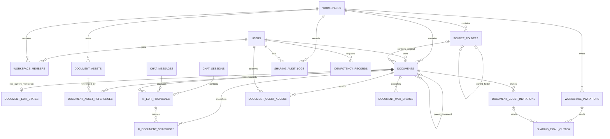

# Markdown 문서 목표 ERD

## 1. 문서 정보

- 상태: Draft
- 작성일: 2026-07-24
- 기준 SDD:
  - [`markdown-document-core.md`](./markdown-document-core.md)
  - [`markdown-document-hierarchy.md`](./markdown-document-hierarchy.md)
  - [`markdown-document-assets.md`](./markdown-document-assets.md)
  - [`markdown-document-sharing.md`](./markdown-document-sharing.md)
  - [`markdown-document-ai-editing.md`](./markdown-document-ai-editing.md)
- 구현 범위: 목표 데이터 모델과 관계 정의. Flyway migration과 entity 구현은 포함하지 않음

## 2. 모델링 원칙

- 기존 `documents`를 업로드 원본과 Markdown 편집 문서의 통합 식별자로 유지한다.
- `origin`은 생성 경로, `document_role`은 문서 역할을 나타낸다.
- `document_role=EDITABLE`은 Markdown 편집 문서이며 페이지 부모 관계를 사용한다.
- `document_role=ORIGINAL`은 불변 업로드 원본이며 원본 폴더 관계를 사용한다.
- 현재 Markdown과 낙관적 잠금 버전은 각각 `document_edit_states`, `documents.current_version`에서 관리한다.
- 일반 수동 편집의 범용 버전 이력은 만들지 않고 AI 적용·복원 시점만 snapshot으로 보관한다.
- 소프트 삭제한 문서와 이미지 참조는 유지한다.
- token 원문과 Object Storage bucket·key는 외부 응답이나 감사 로그에 노출하지 않는다.

## 3. 전체 관계



## 4. 기존 테이블 변경

### 4.1 `documents`

| 컬럼 | 타입 | null | 관계·제약 | 설명 |
|---|---|---:|---|---|
| `id` | VARCHAR(255) | N | PK | 기존 문서 ID |
| `workspace_id` | VARCHAR(255) | N | FK → `workspaces.id` | 소속 workspace |
| `user_id` | VARCHAR(255) | N | FK → `users.id` | 문서 소유자 |
| `filename` | VARCHAR(255) | N |  | 확장자를 포함한 실제 파일명 |
| `display_name` | VARCHAR(255) | N |  | 확장자를 제외한 표시 이름 |
| `normalized_filename` | VARCHAR(255) | N | 검색 index | 검색 정규화 파일명 |
| `mime_type` | VARCHAR(255) | N |  | MIME |
| `byte_size` | BIGINT | N |  | 원본 또는 현재 생성 문서 크기 |
| `origin` | VARCHAR(32) | Y | CHECK | `upload`, `direct`, `conversion`, `chat_export`, `ai_create`; 기존 `null` 허용 |
| `document_role` | VARCHAR(16) | N | CHECK | `EDITABLE`, `ORIGINAL` |
| `source_uri` | VARCHAR(255) | Y |  | 불변 원본 Object Storage 경로 |
| `content_hash` | VARCHAR(255) | Y | unique 아님 | 불변 원본 hash |
| `source_document_id` | VARCHAR(255) | Y | FK → `documents.id` | 변환본·복제본의 원본 |
| `parent_document_id` | VARCHAR(255) | Y | FK → `documents.id` | `EDITABLE`의 상위 편집 문서 |
| `source_folder_id` | UUID | Y | FK → `source_folders.id` | `ORIGINAL`의 원본 폴더 |
| `sort_order` | BIGINT | N | 부모 범위 index | 공용 형제 순서 |
| `current_content_hash` | VARCHAR(64) | Y |  | 현재 편집 Markdown hash |
| `current_version` | BIGINT | N | 기본값 1 | 문서 수준 낙관적 잠금 |
| `deleted_at` | TIMESTAMPTZ | Y |  | 소프트 삭제 시각 |
| `deleted_by` | VARCHAR(255) | Y | FK → `users.id` | 삭제 사용자 |
| `delete_operation_id` | UUID | Y | index | 트리 삭제·복구 작업 |
| `uploaded_at` | TIMESTAMPTZ | N |  | 기존 생성 시각 |
| `updated_at` | TIMESTAMPTZ | N |  | 마지막 문서 변경 시각 |

기존 파이프라인·처리 상태 컬럼은 유지한다. `UNIQUE(workspace_id, content_hash)`는 제거하고 제목·파일명·내용에 대체 unique constraint를 만들지 않는다.

역할별 부모 제약은 다음과 같다.

```text
EDITABLE → source_folder_id IS NULL
ORIGINAL → parent_document_id IS NULL
```

최상위 `EDITABLE`은 `parent_document_id=null`, 최상위 `ORIGINAL`은 `source_folder_id=null`이다. 부모 항목과 현재 항목의 workspace 일치 및 순환 여부는 서비스 transaction에서 검증한다.

### 4.2 `workspace_members`

기존 `(user_id, workspace_id)` PK와 `role`을 유지한다. 초대 수락과 workspace 소유권 이전은 이 테이블의 membership·role을 갱신한다.

### 4.3 `chat_sessions`, `chat_messages`

기존 대화 모델을 유지한다. 채팅 세션은 문서에 종속시키지 않고 `ai_edit_proposals`가 요청 당시의 문서와 메시지를 참조한다.

## 5. Core·Hierarchy 신규 테이블

### 5.1 `document_edit_states`

```text
document_id   VARCHAR(255) PK, FK → documents.id
markdown      TEXT NOT NULL
content_hash  VARCHAR(64) NOT NULL
created_at    TIMESTAMPTZ NOT NULL
updated_at    TIMESTAMPTZ NOT NULL
```

`documents`와 1:0..1 관계다. 버전은 중복 저장하지 않고 `documents.current_version`을 사용한다.

### 5.2 `source_folders`

```text
id                  UUID PK
workspace_id        VARCHAR(255) NOT NULL, FK → workspaces.id
parent_folder_id    UUID NULL, FK → source_folders.id
name                VARCHAR(255) NOT NULL
sort_order          BIGINT NOT NULL
current_version     BIGINT NOT NULL DEFAULT 1
deleted_at          TIMESTAMPTZ NULL
deleted_by          VARCHAR(255) NULL, FK → users.id
delete_operation_id UUID NULL
created_at          TIMESTAMPTZ NOT NULL
updated_at          TIMESTAMPTZ NOT NULL
```

동일 부모 아래 같은 이름을 허용한다. 부모 폴더의 workspace 일치와 순환 여부는 서비스에서 검증한다.

### 5.3 `idempotency_records`

```text
id                UUID PK
user_id           VARCHAR(255) NOT NULL, FK → users.id
endpoint_scope    VARCHAR(255) NOT NULL
idempotency_key   VARCHAR(255) NOT NULL
request_hash      VARCHAR(64) NOT NULL
response_status   INTEGER NOT NULL
resource_id       VARCHAR(255) NULL
response_body     JSONB NULL
created_at        TIMESTAMPTZ NOT NULL
expires_at        TIMESTAMPTZ NOT NULL
UNIQUE(user_id, endpoint_scope, idempotency_key)
```

같은 범위와 키의 24시간 내 재요청은 저장된 결과를 반환한다. 같은 키에 `request_hash`가 다르면 충돌로 처리한다. `response_body` 전체 저장 여부와 정리 worker 주기는 구현 전 확정한다.

## 6. 이미지 자산 테이블

### 6.1 `document_assets`

```text
id                  UUID PK
workspace_id        VARCHAR(255) NOT NULL, FK → workspaces.id
uploaded_by         VARCHAR(255) NULL, FK → users.id ON DELETE SET NULL
original_filename   VARCHAR(255) NOT NULL
content_type        VARCHAR(255) NOT NULL
byte_size           BIGINT NOT NULL
width               INTEGER NOT NULL
height              INTEGER NOT NULL
content_hash        VARCHAR(64) NOT NULL
storage_key         VARCHAR(255) NOT NULL UNIQUE
unreferenced_since  TIMESTAMPTZ NULL
created_at          TIMESTAMPTZ NOT NULL
```

### 6.2 `document_asset_references`

```text
document_id  VARCHAR(255) NOT NULL, FK → documents.id
asset_id     UUID NOT NULL, FK → document_assets.id
created_at   TIMESTAMPTZ NOT NULL
PK(document_id, asset_id)
```

소프트 삭제 문서의 참조는 유지한다. reference가 남은 asset 삭제는 FK로 차단한다.

## 7. AI 편집 테이블

### 7.1 `ai_edit_proposals`

```text
id                UUID PK
workspace_id      VARCHAR(255) NOT NULL, FK → workspaces.id
chat_session_id   VARCHAR(255) NOT NULL, FK → chat_sessions.id
message_id        VARCHAR(255) NULL, FK → chat_messages.id
document_id       VARCHAR(255) NOT NULL, FK → documents.id
base_version      BIGINT NOT NULL
instruction       TEXT NOT NULL
operation         VARCHAR(32) NOT NULL
requested_target  JSONB NOT NULL
actual_target     JSONB NOT NULL
before_markdown   TEXT NOT NULL
after_markdown    TEXT NOT NULL
summary           TEXT NULL
scope_expanded    BOOLEAN NOT NULL
status            VARCHAR(32) NOT NULL
created_at        TIMESTAMPTZ NOT NULL
applied_at        TIMESTAMPTZ NULL
rejected_at       TIMESTAMPTZ NULL
invalidated_at    TIMESTAMPTZ NULL
```

상태는 `PROPOSED`, `APPLIED`, `REJECTED`, `INVALIDATED`, `FAILED`다.

### 7.2 `ai_document_snapshots`

```text
id                    UUID PK
document_id           VARCHAR(255) NOT NULL, FK → documents.id
proposal_id           UUID NULL, FK → ai_edit_proposals.id
restore_operation_id  UUID NULL
snapshot_type         VARCHAR(32) NOT NULL
document_version      BIGINT NOT NULL
markdown              TEXT NOT NULL
content_hash          VARCHAR(64) NOT NULL
created_by            VARCHAR(255) NOT NULL, FK → users.id
created_at            TIMESTAMPTZ NOT NULL
```

snapshot type은 `AI_EDIT_BEFORE`, `AI_EDIT_APPLIED`, `AI_RESTORE_BEFORE`, `AI_RESTORE_APPLIED`다. `restore_operation_id`의 별도 테이블 도입 여부는 미결정이다.

## 8. 공유 테이블

### 8.1 `workspace_invitations`

```text
id                UUID PK
workspace_id      VARCHAR(255) NOT NULL, FK → workspaces.id
email_normalized  VARCHAR(255) NOT NULL
role              VARCHAR(32) NOT NULL
status            VARCHAR(32) NOT NULL
token_hash        VARCHAR(64) NOT NULL
expires_at        TIMESTAMPTZ NOT NULL
invited_by        VARCHAR(255) NOT NULL, FK → users.id
accepted_user_id  VARCHAR(255) NULL, FK → users.id
accepted_at       TIMESTAMPTZ NULL
canceled_at       TIMESTAMPTZ NULL
delivery_status   VARCHAR(32) NOT NULL
created_at        TIMESTAMPTZ NOT NULL
updated_at        TIMESTAMPTZ NOT NULL
```

같은 workspace·정규화 email의 `PENDING` 초대에는 partial unique index를 둔다.

### 8.2 `document_guest_invitations`

```text
id                UUID PK
workspace_id      VARCHAR(255) NOT NULL, FK → workspaces.id
document_id       VARCHAR(255) NOT NULL, FK → documents.id
email_normalized  VARCHAR(255) NOT NULL
status            VARCHAR(32) NOT NULL
token_hash        VARCHAR(64) NOT NULL
expires_at        TIMESTAMPTZ NOT NULL
invited_by        VARCHAR(255) NOT NULL, FK → users.id
accepted_user_id  VARCHAR(255) NULL, FK → users.id
accepted_at       TIMESTAMPTZ NULL
canceled_at       TIMESTAMPTZ NULL
delivery_status   VARCHAR(32) NOT NULL
created_at        TIMESTAMPTZ NOT NULL
updated_at        TIMESTAMPTZ NOT NULL
```

같은 문서·정규화 email의 `PENDING` 초대에는 partial unique index를 둔다.

### 8.3 `document_guest_access`

```text
document_id  VARCHAR(255) NOT NULL, FK → documents.id
user_id      VARCHAR(255) NOT NULL, FK → users.id
granted_by   VARCHAR(255) NOT NULL, FK → users.id
granted_at   TIMESTAMPTZ NOT NULL
revoked_at   TIMESTAMPTZ NULL
PK(document_id, user_id)
```

### 8.4 `document_web_shares`

```text
id            UUID PK
workspace_id  VARCHAR(255) NOT NULL, FK → workspaces.id
document_id   VARCHAR(255) NOT NULL, FK → documents.id
token_hash    VARCHAR(64) NOT NULL
status        VARCHAR(32) NOT NULL
expires_at    TIMESTAMPTZ NULL
created_by    VARCHAR(255) NOT NULL, FK → users.id
created_at    TIMESTAMPTZ NOT NULL
updated_at    TIMESTAMPTZ NOT NULL
revoked_at    TIMESTAMPTZ NULL
```

문서당 `ACTIVE` 공유 하나만 허용하는 partial unique index와 `token_hash` 조회 index를 둔다.

### 8.5 `sharing_email_outbox`

```text
id                   UUID PK
invitation_type      VARCHAR(32) NOT NULL
invitation_id        UUID NOT NULL
recipient_email      VARCHAR(255) NOT NULL
template_type        VARCHAR(32) NOT NULL
status               VARCHAR(32) NOT NULL
attempt_count        INTEGER NOT NULL
next_attempt_at      TIMESTAMPTZ NOT NULL
last_error_code      VARCHAR(64) NULL
created_at           TIMESTAMPTZ NOT NULL
sent_at              TIMESTAMPTZ NULL
```

`invitation_type + invitation_id`는 여러 초대 테이블을 가리키므로 일반 FK를 적용할 수 없다. 두 nullable FK로 분리할지 application 정합성 검증을 사용할지는 미결정이다.

### 8.6 `sharing_audit_logs`

```text
id              UUID PK
workspace_id    VARCHAR(255) NOT NULL, FK → workspaces.id
actor_user_id   VARCHAR(255) NULL, FK → users.id
target_user_id  VARCHAR(255) NULL, FK → users.id
document_id     VARCHAR(255) NULL, FK → documents.id
action          VARCHAR(64) NOT NULL
result          VARCHAR(32) NOT NULL
error_code      VARCHAR(64) NULL
request_id      VARCHAR(255) NOT NULL
created_at      TIMESTAMPTZ NOT NULL
```

감사 로그는 append-only로 관리하며 token 원문, Markdown, 이메일 본문을 저장하지 않는다.

## 9. Backfill

기존 `documents`는 다음 순서로 backfill한다.

1. `display_name`은 `filename`의 마지막 확장자를 제거해 생성한다.
2. `normalized_filename`은 기존 전체 `filename`의 검색 정규화 값으로 채운다.
3. Markdown MIME 또는 `.md` 파일은 `document_role=EDITABLE`로 지정한다.
4. 나머지 업로드 원본은 `document_role=ORIGINAL`로 지정한다.
5. `parent_document_id`, `source_folder_id`, `delete_operation_id`는 `null`로 둔다.
6. `sort_order`는 workspace와 역할별 `uploaded_at`, `id` 순서로 부여한다.
7. `current_version`은 `1`, `current_content_hash`는 기존 `content_hash`로 채운다.
8. `document_edit_states`는 SQL로 채우지 않고 기존 Markdown의 최초 상세 조회 또는 저장 시 lazy 생성한다.

## 10. 미결정 사항

- [ ] `normalized_filename`의 Unicode 정규화 수준
- [ ] `idempotency_records.response_body` 전체 저장 여부와 만료 row 정리 주기
- [ ] `ai_restore_operations` 별도 테이블 도입 여부
- [ ] `sharing_email_outbox`의 polymorphic invitation FK 처리 방식
- [ ] workspace당 소유자 한 명을 보장하는 DB 제약 방식
- [ ] 영구 삭제 시 각 FK의 `CASCADE`, `SET NULL`, 명시적 정리 순서
